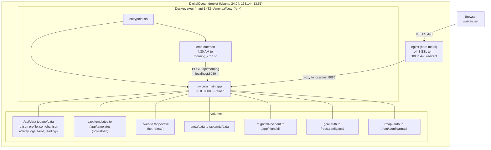
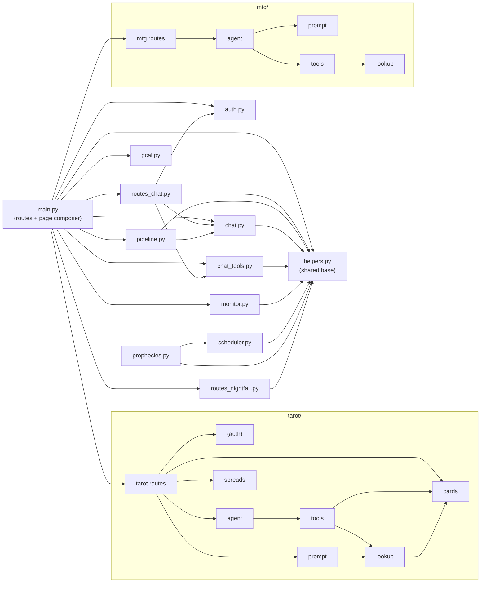
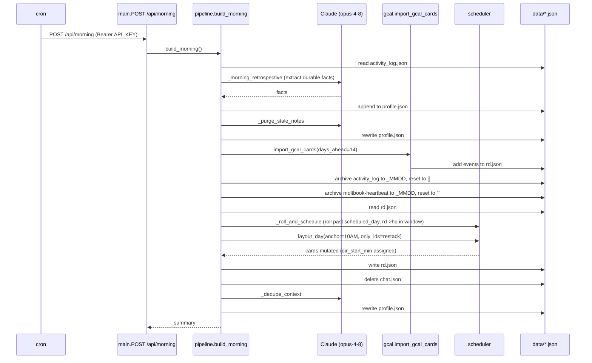
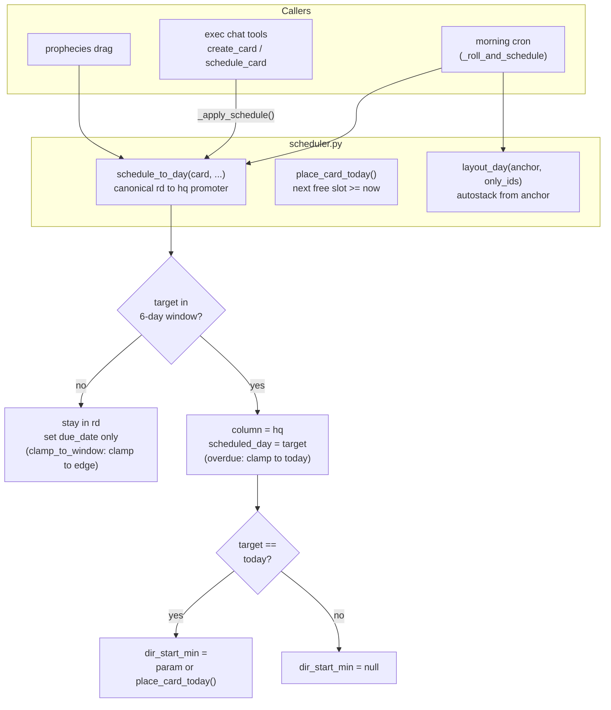

# exec-fn — Architecture (UML, Mermaid)

Generated from source (`api/*.py`, `docker-compose.yml`, `Dockerfile`,
cron). Three views:

1. [Deployment](#1-deployment) — how a request reaches code
2. [Module graph](#2-module-graph) — what imports what
3. [Morning pipeline + scheduling](#3-morning-pipeline--scheduling) — how
   cards move through time

---

## 1. Deployment

nginx (bare metal) terminates SSL, proxies to a single Docker container
running cron + uvicorn. Persistent state is JSON files on a bind-mounted
volume.

**Port chain:** `nginx :443 (SSL) -> localhost:8080 -> container:8080 (uvicorn)`

**Image:** `python:3.12-slim`; rmapi Go binary pre-built from
`golang:1.24-alpine`. No `EXPOSE`; port bound at compose level only.

**Secrets** (`.env`): `API_KEY`, `ANTHROPIC_API_KEY`, `GUEST_KEY`.
cron reads them via `/run/cron_env`.

---

## 2. Module graph

Intra-project imports only (stdlib / fastapi / anthropic omitted).
`main.py` is the composition root; `helpers.py` is the shared base
(10 inbound edges). Two self-contained subsystems: `tarot/*` and `mtg/*`.

Note: `scheduler.py` is reached at runtime from `chat_tools` and
`pipeline` via `__import__`/late import, so it has no static import edge
from them — the runtime call path is shown in view 3.

---

## 3. Morning pipeline + scheduling

### 3a. Morning cron sequence

`POST /api/morning` (4:30 AM ET) runs `build_morning()` in `pipeline.py`.

### 3b. scheduler.py — the time model

All `dir_start_min` / `scheduled_day` logic lives here. Window =
`SCHED_WINDOW_DAYS=5` (today + 5 = 6-day span).

**rd to hq promotion** (`schedule_to_day`): a card moves out of the `rd`
column into `hq` only when its target day falls inside the 6-day window.
`dir_start_min` (timeline position) is set only when the target is today —
either an explicit value or the next free slot from `place_card_today()`.
Outside the window the card stays in `rd` with just a `due_date`.

**Exec chat call chain:**
`POST /api/chat -> routes_chat._handle_tool -> chat_tools._TOOL_HANDLERS[name]`
`-> _apply_schedule -> scheduler.schedule_to_day`.
