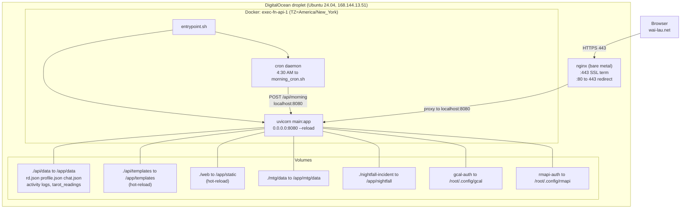
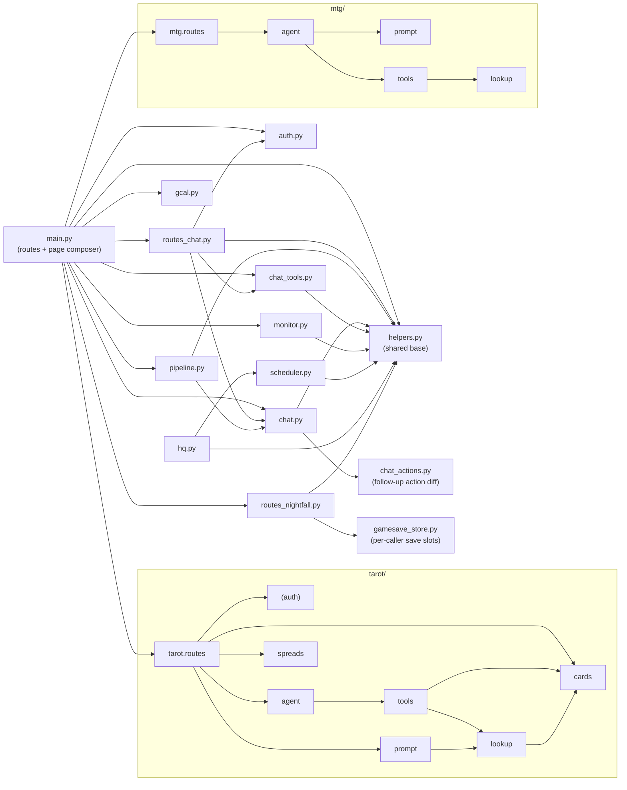
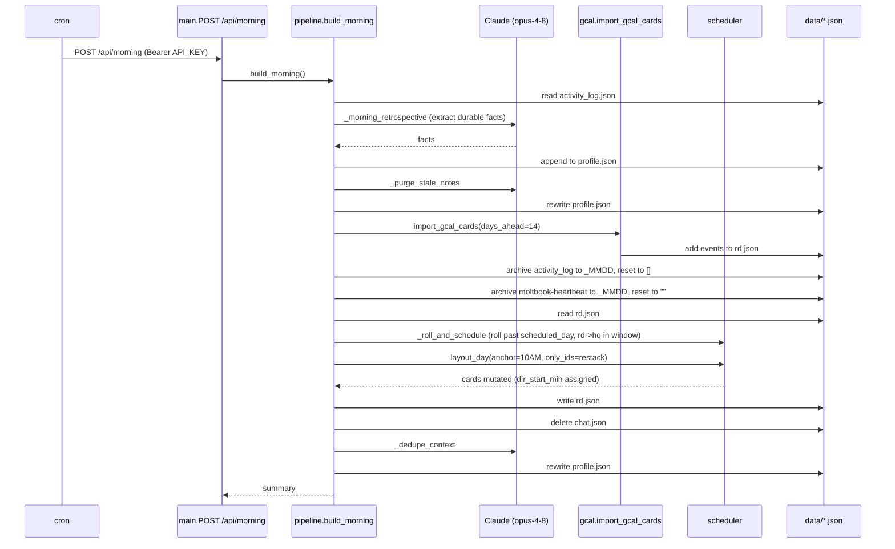
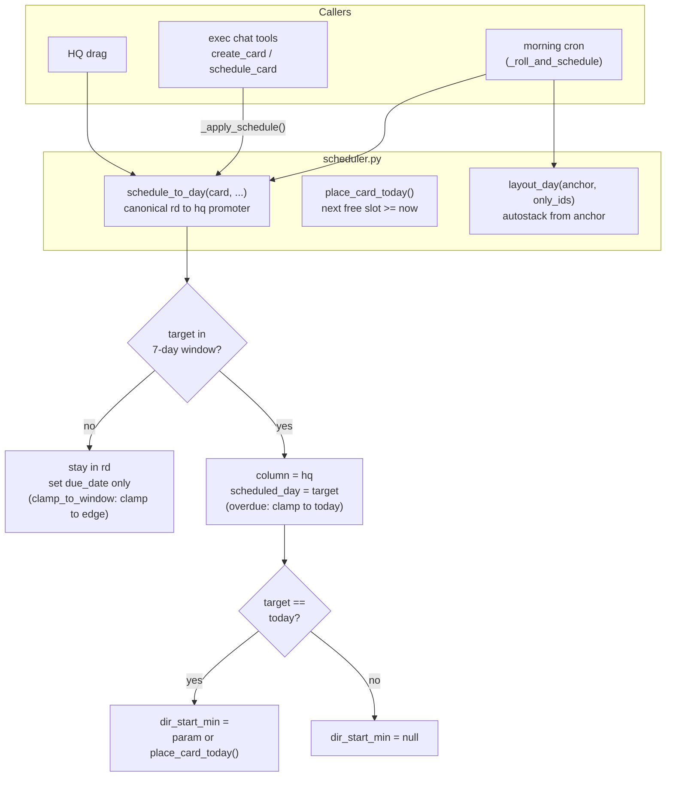
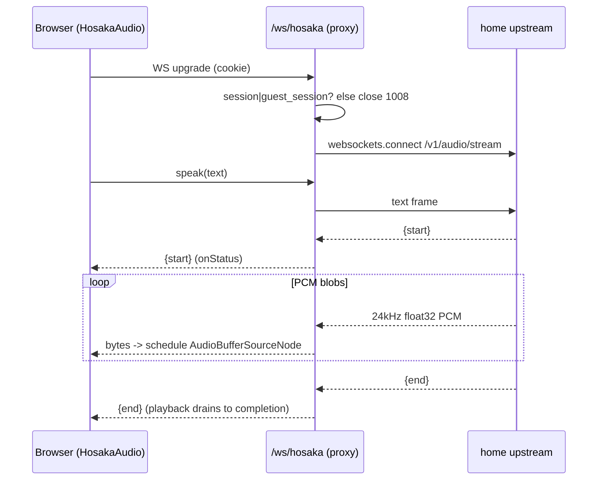
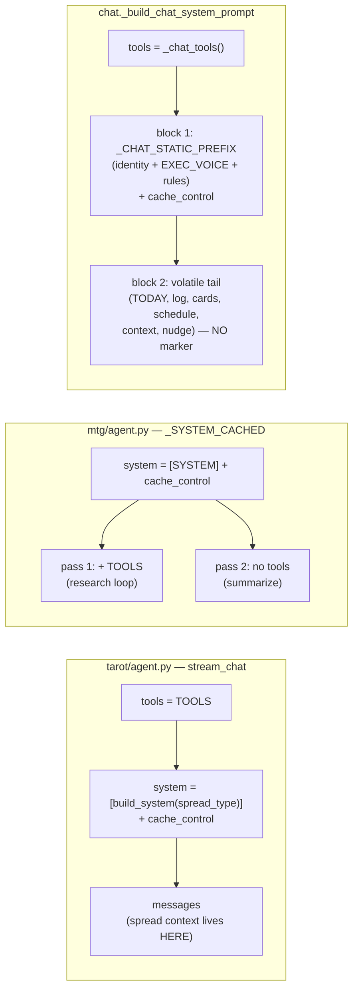

# exec-fn — Architecture (UML, Mermaid)

Generated from source (`api/*.py`, `docker-compose.yml`, `Dockerfile`,
cron). Five views:

1. [Deployment](#1-deployment) — how a request reaches code
2. [Module graph](#2-module-graph) — what imports what
3. [Morning pipeline + scheduling](#3-morning-pipeline--scheduling) — how
   cards move through time
4. [TTS subsystem](#4-tts-text-to-speech) — how every voice reaches the
   browser
5. [LLM call sites + prompt caching](#5-llm-call-sites--prompt-caching) —
   every Claude request and which prefixes are cached

---

## 1. Deployment

nginx (bare metal) terminates SSL, proxies to a single Docker container
running cron + uvicorn. Persistent state is JSON files on a bind-mounted
volume.

```mermaid
flowchart TB
  browser["Browser<br/>wai-lau.net"]

  subgraph droplet["DigitalOcean droplet (Ubuntu 24.04, 168.144.13.51)"]
    nginx["nginx (bare metal)<br/>:443 SSL term<br/>:80 to 443 redirect"]

    subgraph container["Docker: exec-fn-api-1 (TZ=America/New_York)"]
      direction TB
      entry["entrypoint.sh"]
      cron["cron daemon<br/>4:30 AM to morning_cron.sh"]
      uvicorn["uvicorn main:app<br/>0.0.0.0:8080 --reload"]
      entry --> cron
      entry --> uvicorn
      cron -->|"POST /api/morning<br/>localhost:8080"| uvicorn
    end

    subgraph vols["Volumes"]
      data["./api/data to /app/data<br/>rd.json profile.json chat.json<br/>activity logs, tarot_readings"]
      tmpl["./api/templates to /app/templates<br/>(hot-reload)"]
      web["./web to /app/static<br/>(hot-reload)"]
      mtgd["./mtg/data to /app/mtg/data"]
      night["./nightfall-incident to /app/nightfall"]
      gcal["gcal-auth to /root/.config/gcal"]
      rmapi["rmapi-auth to /root/.config/rmapi"]
    end

    uvicorn --- data
    uvicorn --- tmpl
    uvicorn --- web
    uvicorn --- mtgd
    uvicorn --- night
    uvicorn --- gcal
    uvicorn --- rmapi
  end

  browser -->|HTTPS 443| nginx
  nginx -->|"proxy to localhost:8080"| uvicorn
```

**Port chain:** `nginx :443 (SSL) -> localhost:8080 -> container:8080 (uvicorn)`

**Image:** `python:3.12-slim`; rmapi Go binary pre-built from
`golang:1.24-alpine`. No `EXPOSE`; port bound at compose level only.

**Secrets** (`.env`): `API_KEY`, `ANTHROPIC_API_KEY`, `TURNSTILE_SITE_KEY`,
`TURNSTILE_SECRET` (the guest gate is a Cloudflare Turnstile challenge, not a
shared key — `GUEST_KEY` retired).
cron reads them via `/run/cron_env`.

---

## 2. Module graph

Intra-project imports only (stdlib / fastapi / anthropic omitted).
`main.py` is the composition root; `helpers.py` is the shared base
(10 inbound edges). Two self-contained subsystems: `tarot/*` and `mtg/*`.

```mermaid
flowchart LR
  main["main.py<br/>(routes + page composer)"]
  auth["auth.py"]
  helpers["helpers.py<br/>(shared base)"]
  pipeline["pipeline.py"]
  scheduler["scheduler.py"]
  monitor["monitor.py"]
  hq["hq.py"]
  chat["chat.py"]
  chat_tools["chat_tools.py"]
  chat_actions["chat_actions.py<br/>(follow-up action diff)"]
  routes_chat["routes_chat.py"]
  routes_night["routes_nightfall.py"]
  gamesave["gamesave_store.py<br/>(per-caller save slots)"]
  gcal["gcal.py"]

  main --> pipeline
  main --> gcal
  main --> chat
  main --> chat_tools
  main --> helpers
  main --> routes_night
  main --> routes_chat
  main --> monitor
  main --> auth
  main --> mtgr["mtg.routes"]
  main --> tarr["tarot.routes"]

  routes_night --> gamesave
  routes_chat --> auth
  routes_chat --> chat
  routes_chat --> chat_tools
  routes_chat --> helpers

  pipeline --> helpers
  pipeline --> chat
  chat --> helpers
  chat --> chat_actions
  chat_tools --> helpers
  monitor --> helpers
  scheduler --> helpers
  hq --> helpers
  hq --> scheduler
  routes_night --> helpers

  subgraph tarot["tarot/"]
    tarr --> tauth["(auth)"]
    tarr --> tag["agent"]
    tarr --> tcards["cards"]
    tarr --> tprompt["prompt"]
    tarr --> tspreads["spreads"]
    tag --> ttools["tools"]
    ttools --> tcards
    ttools --> tlookup["lookup"]
    tprompt --> tlookup
    tlookup --> tcards
  end

  subgraph mtg["mtg/"]
    mtgr --> mag["agent"]
    mag --> mprompt["prompt"]
    mag --> mtools["tools"]
    mtools --> mlookup["lookup"]
  end
```

Note: `scheduler.py` is reached at runtime from `chat_tools` and
`pipeline` via `__import__`/late import, so it has no static import edge
from them — the runtime call path is shown in view 3.

---

## 3. Morning pipeline + scheduling

### 3a. Morning cron sequence

`POST /api/morning` (4:30 AM ET) runs `build_morning()` in `pipeline.py`.

```mermaid
sequenceDiagram
  participant cron
  participant API as main.POST /api/morning
  participant P as pipeline.build_morning
  participant LLM as Claude (opus-4-8)
  participant GC as gcal.import_gcal_cards
  participant S as scheduler
  participant FS as data/*.json

  cron->>API: POST /api/morning (Bearer API_KEY)
  API->>P: build_morning()
  P->>FS: read activity_log.json
  P->>LLM: _morning_retrospective (extract durable facts)
  LLM-->>P: facts
  P->>FS: append to profile.json
  P->>LLM: _purge_stale_notes
  P->>FS: rewrite profile.json
  P->>GC: import_gcal_cards(days_ahead=14)
  GC->>FS: add events to rd.json
  P->>FS: archive activity_log to _MMDD, reset to []
  P->>FS: archive moltbook-heartbeat to _MMDD, reset to ""
  P->>FS: read rd.json
  P->>S: _roll_and_schedule (roll past scheduled_day, rd->hq in window)
  P->>S: layout_day(anchor=10AM, only_ids=restack)
  S-->>P: cards mutated (dir_start_min assigned)
  P->>FS: write rd.json
  P->>FS: delete chat.json
  P->>LLM: _dedupe_context
  P->>FS: rewrite profile.json
  P-->>API: summary
```

### rd.json concurrency — `helpers._RD_LOCK`

rd.json writers run on genuinely parallel OS threads: the nudge loop's scans
(`asyncio.to_thread`), chat-tool dispatch (`routes_chat` → `to_thread`),
sync-`def` routes on Starlette's thread pool (gcal import), and the event loop
itself (`PATCH /api/rd`). Three guards in `helpers.py` make that safe:

- **`_RD_LOCK`** (`threading.RLock`) — every read-modify-write cycle holds it
  around the WHOLE load→mutate→save sequence (`with _RD_LOCK:`), so one
  thread's save can never silently drop another's changes. LLM/network calls
  are NEVER made under the lock — callers release, call the model, then
  re-lock + reload + apply (`_fire_nudge`, `_build_graph`, `_run_triage`,
  `api_rd_recalc`, `_tool_decompose_task`, `import_gcal_cards`).
- **`_load_rd()` returns a private deep copy** — the `_load_json` mtime cache
  holds one shared object; handing it out mutable would leak one thread's
  in-progress edits into another's snapshot.
- **`_save_rd()` is an atomic replace** (tmp + rename), so a concurrent
  reader never sees a truncated file.

Single-process invariant: uvicorn runs ONE worker (`--reload`), so a
process-wide lock is sufficient; nothing outside the container writes rd.json.
Read-only loads (`monitor`, `get_week_data`, scans) don't take the lock — the
deep copy + atomic replace make unlocked reads safe.

### 3b. scheduler.py — the time model

All `dir_start_min` / `scheduled_day` logic lives here. Window =
`SCHED_WINDOW_DAYS=6` (today + 6 = 7-day span).

```mermaid
flowchart TB
  subgraph entry["Callers"]
    morning["morning cron<br/>(_roll_and_schedule)"]
    execchat["exec chat tools<br/>create_card / schedule_card"]
    hq["HQ drag"]
  end

  subgraph sched["scheduler.py"]
    s2d["schedule_to_day(card, ...)<br/>canonical rd to hq promoter"]
    place["place_card_today()<br/>next free slot >= now"]
    layout["layout_day(anchor, only_ids)<br/>autostack from anchor"]
  end

  morning --> s2d
  morning --> layout
  execchat -->|"_apply_schedule()"| s2d
  hq --> s2d

  s2d --> decide{"target in<br/>7-day window?"}
  decide -->|"no"| outwin["stay in rd<br/>set due_date only<br/>(clamp_to_window: clamp to edge)"]
  decide -->|"yes"| inwin["column = hq<br/>scheduled_day = target<br/>(overdue: clamp to today)"]
  inwin --> istoday{"target ==<br/>today?"}
  istoday -->|"yes"| setmin["dir_start_min =<br/>param or place_card_today()"]
  istoday -->|"no"| clearmin["dir_start_min = null"]
```

**rd to hq promotion** (`schedule_to_day`): a card moves out of the `rd`
column into `hq` only when its target day falls inside the 7-day window.
`dir_start_min` (timeline position) is set only when the target is today —
either an explicit value or the next free slot from `place_card_today()`.
Outside the window the card stays in `rd` with just a `due_date`.

**Exec chat call chain:**
`POST /api/chat -> routes_chat._handle_tool -> chat_tools._TOOL_HANDLERS[name]`
`-> _apply_schedule -> scheduler.schedule_to_day`.

---

## 4. TTS (text-to-speech)

Every voice in the app — the `/hosaka` SPEAK page, the `/tarot` reader
narration, and the Exec bubble — streams from a **single home GPU box**
through a **same-origin reverse proxy**. No TTS models run on the droplet;
the container only proxies. The browser always talks same-origin, so the
session/guest cookie carries auth on the WebSocket handshake (HTTP basic
auth does not ride a WS upgrade reliably on mobile).

### 4a. Topology

The model server (Kokoro / Chatterbox / Piper) runs on Wai's home box and
is reached only over an SSH reverse tunnel bound to the Docker bridge
gateway (`TTS_UPSTREAM`, default `172.17.0.1:8123`). `tts-box/` (systemd
user service + port watchdog, installed on the home box) keeps that
upstream alive.

```mermaid
flowchart LR
  browser["Browser<br/>(/hosaka · /tarot · Exec bubble)"]

  subgraph droplet["droplet container — routes_tts.py"]
    page["GET /hosaka<br/>(guest_protected)"]
    voices["GET /api/hosaka/voices<br/>GET /api/hosaka/health<br/>(guest_protected)"]
    ws["WS /ws/hosaka<br/>(public route, cookie-gated)"]
  end

  tunnel(["SSH reverse tunnel<br/>172.17.0.1:8123"])

  subgraph home["home GPU box (RTX) — tts-box keepalive"]
    upstream["TTS upstream<br/>WS /v1/audio/stream<br/>GET /v1/voices<br/>Kokoro · Chatterbox · Piper"]
  end

  browser -->|HTTPS page load| page
  browser -->|"GET (httpx proxy)"| voices
  browser <-->|"WS audio (bidi pump)"| ws
  voices -->|http| tunnel
  ws -->|"websockets.connect"| tunnel
  tunnel --- upstream
```

`_pump_to_upstream` / `_pump_to_client` shuttle text + binary frames both
directions; `/api/hosaka/health` probes the upstream for a *real* response
(the reverse-tunnel listener stays bound on the droplet even when the model
server is down — a bound port is **not** liveness), letting `/hosaka` show
"TTS server offline" before SPEAK.

**Every utterance ends in a terminal frame** — the proxy guarantees it even
when the backend doesn't. An utterance normally ends with the upstream's own
`{"type":"end"}` / `{"type":"error"}`, which clears `busy[url]`; if the
upstream stream instead just *ends* (home box crashed, tunnel dropped, GPU
server restarted mid-sentence) `_pump_to_client`'s `finally` synthesizes
`{"type":"error","detail":"tts upstream closed mid-utterance"}` and evicts the
dead connection so the next utterance reconnects. This is load-bearing for
`/tarot`: the reader's typewriter paces off the audio clock and waits on a
terminal frame, so a silently-dead upstream left the reveal spinning forever
with the text stuck part-revealed. The guard is the pure predicate
`tts_routing.died_mid_utterance` (unit-tested — `routes_tts` can't be imported
by the dev venv), which fires **only** for the live connection on that `url`:
a stale socket `_ws_dispatch` deliberately cut to start a new utterance is
superseded, and its error would abort the utterance that replaced it.

Client-side belts for the same failure, since a frame can also be lost between
browser and droplet: `hosaka-audio.js`'s `ws.onclose` delivers a synthetic
`{type:"error"}` to the in-flight utterance (guarded on the socket still being
the live one), and `tarot-stream.js`'s stall watchdog caps `elapsed()` at the
buffered duration in its progress signal — the raw `el + dur` never stopped
rising (the ctx clock keeps running after the buffer drains), so the watchdog
could never fire on a dead stream.

### 4b. Auth — now guest-or-full

`/hosaka` and `/api/hosaka/*` moved from the full-auth `protected` router to
**`guest_protected`** — a guest session now reaches the SPEAK page. The WS
`/ws/hosaka` is declared on the `public` router but rejects (close `1008`)
unless a `session` **or** `guest_session` cookie matches before `accept()`.
The guest tier is what lets the `/tarot` reader voice work for guests.

| Endpoint | Router | Reachable by |
|----------|--------|--------------|
| `GET /hosaka` | `guest_protected` | full + guest (nav renders guest-tier for non-admins) |
| `GET /api/hosaka/voices`, `/health` | `guest_protected` | full + guest |
| `WS /ws/hosaka` | `public` + cookie check | full + guest (else `1008`) |

### 4b-ii. GPU-mode owner control

`GET /api/hosaka/mode` and `POST /api/hosaka/mode` sit on the **`protected`**
router (owner-only -- guests must never flip the GPU). They proxy the home-box
`gpu-mode` service over the SSH tunnel at `172.17.0.1:8124` (env:
`GPU_MODE_UPSTREAM`, default `172.17.0.1:8124`) using `Authorization: Bearer
$GPU_MODE_TOKEN` (the token must match the value on the home box;
provisioned in the droplet `.env` -- operator step). The GET returns the
current mode; the POST body `{"action": "homo"|"emo"|"idle", "force"?: bool}`
transitions it.
`emo` and `idle` stop hosaka-server and therefore disconnect active remote
users; the route confirms against `_audio_conns` (the live `/ws/hosaka` audio
socket set in `routes_tts.py` — the real listeners, incl. /tarot narration and
Exec voice, not just `/hosaka`-page `_presence`) and returns `409` if any users
are connected and the caller has not sent `{"force": true}`. `homo` never needs
confirmation.

Both `/hosaka` and `/emet` render the same `emo | idle | homo` segmented
control (shared `web/gpu-mode.{js,css}`, keyed on `#gpu-mode`) for owners only.
If the proxy call to the home service fails (tunnel down, service not running),
the mode is reported as `gone` (an exec-fn label; the home service itself never
returns `gone`).

`GET /api/hosaka/mode/stream` is an owner-only SSE fan-out (`_mode_subscribers`
in `routes_tts.py`): a successful `POST` broadcasts the new mode to every
subscriber, so the control **live-syncs across pages** — flipping it on
`/hosaka` updates the strip on an open `/emet` (and vice-versa) with no reload.
The stream pushes only on an actual switch; each page seeds its initial state
from `GET /api/hosaka/mode` on load.

| Endpoint | Router | Reachable by |
|----------|--------|--------------|
| `GET /api/hosaka/mode` | `protected` | owner only |
| `POST /api/hosaka/mode` | `protected` | owner only |
| `GET /api/hosaka/mode/stream` | `protected` | owner only |

### 4c. Three consumers of one audio core

All three share `web/hosaka-audio.js` (`HosakaAudio.createPlayer()`) — it
owns the `AudioContext`, the iOS unlock dance, the `/ws/hosaka` socket, and
playback of streamed **24 kHz float32 PCM** via scheduled
`AudioBufferSourceNode`s. The upstream emits only `{start}` / coarse PCM
blobs / `{end}` (no per-word timestamps), so any visual syncs to the
*measured* audio duration.

| Surface | Script | Voice | Backend |
|---------|--------|-------|---------|
| `/hosaka` SPEAK UI | `tts.js` | `charlie` (default) + full voice list | chatterbox + RVC |
| `/tarot` reader | `tarot-voice.js` | `af_nicole` | kokoro |
| Exec bubble | `exec-voice.js` / `exec-voice-listener.js` | `glados` | piper |

The `/tarot` reader paces its typewriter to the audio clock (holds text
until audio starts, then reveals on a `charWeight` schedule normalized to
the measured duration); on any audio failure it bails to a guessed-pace
typewriter and logs a sys note. Exec is fire-and-forget (no typewriter).

### 4d. One utterance

```mermaid
sequenceDiagram
  participant B as Browser (HosakaAudio)
  participant WS as /ws/hosaka (proxy)
  participant U as home upstream

  B->>WS: WS upgrade (cookie)
  WS->>WS: session|guest_session? else close 1008
  WS->>U: websockets.connect /v1/audio/stream
  B->>WS: speak(text)
  WS->>U: text frame
  U-->>WS: {start}
  WS-->>B: {start} (onStatus)
  loop PCM blobs
    U-->>WS: 24kHz float32 PCM
    WS-->>B: bytes -> schedule AudioBufferSourceNode
  end
  U-->>WS: {end}
  WS-->>B: {end} (playback drains to completion)
```

---

## 5. LLM call sites + prompt caching

Every Claude call goes through the `anthropic` SDK with a pay-per-token
`ANTHROPIC_API_KEY` (no subscription). Where a large, byte-stable system
prefix is **reused across turns**, a `cache_control: {type: ephemeral}`
marker (5-min TTL) lets repeat requests read that prefix at ~0.1x instead
of full price.

### The one invariant

Render order is `tools -> system -> messages`. A marker on the **last
system block** caches `tools + system` together as the prefix. Caching is
a pure prefix match: any byte that changes inside the cached span (a
timestamp, per-request card data) invalidates everything after it. So the
static text must physically precede the volatile text, and the marker sits
at the end of the static part. **Opus min cacheable prefix = 4096 tokens**
— a shorter prefix silently caches nothing (`cache_creation_input_tokens`
stays 0), so anything under that is left uncached.

### Cached sites

```mermaid
flowchart LR
  subgraph tarot["tarot/agent.py — stream_chat"]
    tsys["system = [build_system(spread_type)]<br/>+ cache_control"]
    ttools["tools = TOOLS"]
    tmsg["messages<br/>(spread context lives HERE)"]
    ttools --> tsys --> tmsg
  end

  subgraph mtg["mtg/agent.py — _SYSTEM_CACHED"]
    msys["system = [SYSTEM] + cache_control"]
    p1["pass 1: + TOOLS<br/>(research loop)"]
    p2["pass 2: no tools<br/>(summarize)"]
    msys --> p1
    msys --> p2
  end

  subgraph exec["chat._build_chat_system_prompt"]
    estatic["block 1: _CHAT_STATIC_PREFIX<br/>(identity + EXEC_VOICE + rules)<br/>+ cache_control"]
    evol["block 2: volatile tail<br/>(TODAY, log, cards, schedule,<br/>context, nudge) — NO marker"]
    etools["tools = _chat_tools()"]
    etools --> estatic --> evol
  end
```

| Call site | Model | Cached prefix | Tokens | Reuse pattern |
|-----------|-------|---------------|-------:|---------------|
| `tarot/agent.py` `stream_chat` | opus-4-8 | `build_system(spread_type)` + `TOOLS` | ~8.7K / ~13.4K | every turn of a reading |
| `mtg/agent.py` pass 1 | opus-4-8 | `SYSTEM` + `TOOLS` | ~6.6K | across research tool-loop iterations + cross-question |
| `mtg/agent.py` pass 2 | opus-4-8 | `SYSTEM` (no tools) | ~5.9K | cross-question only (separate prefix from pass 1) |
| `routes_chat` `/api/chat` + `_stream_tool_followup` | opus-4-8 | `_CHAT_STATIC_PREFIX` + `_chat_tools()` | ~5.2K | every exec turn; follow-up reads what the main turn wrote |

**Exec restructure:** the tools alone (~3.5K) are under 4096, so the static
text is what lifts the prefix over the floor. `_build_chat_system_prompt`
returns a **two-block** system list — a marked static block (identity +
`EXEC_VOICE` + global rules) and an unmarked volatile tail. `TODAY` was at
the top of the old single-string prompt and silently invalidated the cache
every request; it now lives in the volatile tail. Both `routes_chat` call
sites build the identical static block.

**Follow-up action diff:** after a tool round, the follow-up turn rebuilds the
system prompt — so its board lists now include any card the turn just created.
`_build_chat_system_prompt(stage, actions=…)` appends an **ACTIONS YOU JUST
TOOK** block (rendered by `chat_actions._actions_taken_block` from the dispatched
`{name, input, result}` list) to the **volatile tail**, so the model reads the
refreshed board as the result of its own action rather than reporting a phantom
duplicate. Marked only in the volatile tail → the cached static prefix stays
byte-stable. Threaded through both follow-up paths (`routes_chat._dispatch_tools`
collects the actions; `discord_bot.exec_reply` rebuilds `system2` with them).

### Uncached (measured, left alone)

| Call site | Why |
|-----------|-----|
| `monitor.py` | static slice ~1.3K (no tools) < 4096; debounced bursts = low reuse |
| `nudge_llm` `_TONE` | ~1.4K (no tools) < 4096; per-card one-shot |
| `card_llm` classify / parse-date | one-shot per card; no system / ~80-token volatile system |
| `morning.py`, `chat._dedupe_context` | daily one-shot; prompt lives in the user message |
| `gcal._haiku_classify_batch` | no system block; tiny instructions in the user message |

**Verifying:** the response `usage` reports `cache_creation_input_tokens`
(written this request, ~1.25x) and `cache_read_input_tokens` (served from
cache, ~0.1x). First request creates, second identical-prefix request
reads. `cache_read` staying 0 across two identical requests means a silent
invalidator is back in the prefix.

---

## 6. Printer (ELEGOO Centauri Carbon) — owner-only reverse proxy

`/printer` serves the printer's **own** web UI (an Angular SPA with a live
MJPEG camera and SDCP websocket controls) from wai-lau.net, without the SPA
ever knowing it left the LAN. Same-origin everywhere: the browser talks only
to the droplet, so the full `session` cookie rides every sub-request incl.
the websocket handshake, and nothing weaker than the owner reaches a machine
that can heat a nozzle.

Since 2026-08-30 the page also has a **guest tier — read-only, by routing**
(it is linked from the public landing; guests pass Turnstile). The rule is not
"filter what a guest may send", it is "a guest has no route that carries their
bytes to the LAN":

| Route | Owner | Guest | Why |
|-------|-------|-------|-----|
| `GET /printer` | SPA wrapper | camera + stats wrapper | same template, `data-readonly="1"` for guests |
| `ANY /printer/{path}` | full proxy | **401 → admin login** | the SPA, its file endpoints, uploads — every browser→printer HTTP path |
| `WS /ws/printer` | SDCP relay | **1008** | the only browser→printer socket; it drives the machine |
| `GET /printer/video` | ~10fps | ~2fps | one-way read, off the shared hub |
| `GET /api/printer/status` | ✓ | ✓ | one-way read; the printer pushes it unasked |
| `GET /api/printer/health` | ✓ | ✓ | one-way liveness GET |

The two guest-reachable readers are **server-opened singletons**, not relays
of anything a viewer said: `printer_camera.py` holds ONE upstream MJPEG
stream (demuxed to whole JPEG frames, re-muxed per viewer — the printer only
allows ~4 streams, so a public page can't be 1:1) and `printer_status.py`
holds ONE SDCP socket that **sends no frame, ever** — the printer pushes
`sdcp/status/<id>` about once a second on its own, and `public_status()`
whitelists it (no `MainboardID`/`TaskId`/`Filename`).

### 6a. Topology

The printer sits on Wai's home LAN (`192.168.2.25`). Its three ports are
reverse-tunnelled from the home box to the droplet's docker bridge by
`printer-box/printer-tunnel.service` — the hosaka/emet pattern (§4a), with
the `-R` forwards pointing straight at the printer's LAN address (nothing
listens on the home box).

```mermaid
flowchart LR
  browser["Browser<br/>(/printer wrapper + iframe)"]

  subgraph droplet["droplet container — routes_printer.py"]
    page["GET /printer<br/>(guest or owner)"]
    health["GET /api/printer/health<br/>(guest or owner)"]
    status["GET /api/printer/status<br/>(guest or owner, read-only)"]
    http["ANY /printer/{path}<br/>(OWNER ONLY, rewrites HTML+JS)"]
    video["GET /printer/video<br/>(guest or owner, shared MJPEG hub)"]
    ws["WS /ws/printer<br/>(OWNER ONLY, session-cookie gated)"]
  end

  tunnel(["SSH reverse tunnel<br/>172.17.0.1:8126 / 8127 / 8128"])

  subgraph lan["home LAN — ELEGOO Centauri Carbon"]
    p80[":80 SPA + files"]
    p3030[":3030 /websocket (SDCP)"]
    p3031[":3031 /video (MJPEG)"]
  end

  browser -->|HTTPS| page
  browser -->|15s poll| health
  browser -->|iframe src + assets| http
  browser -->|"<img src>"| video
  browser -->|3s poll, guest view| status
  browser <-->|SDCP JSON frames| ws
  health --> tunnel
  status --> tunnel
  http --> tunnel
  video --> tunnel
  ws --> tunnel
  tunnel --- p80
  tunnel --- p3030
  tunnel --- p3031
```

### 6b. Why rewrites, and which

The SPA assumes it is the origin. Served under a path prefix on a different
host over https, four things break; each is patched in flight by the pure
helpers in `printer_proxy.py` (no I/O — unit-tested in
`tests/test_printer_proxy.py` against verbatim slices of firmware V1.4.49):

| Upstream shape | Breaks because | Rewrite |
|----------------|----------------|---------|
| `<base href="/">`, `href="/assets/…"` (index HTML) | assets + Angular routes resolve against the site root | `rewrite_html`: root-absolute `href`/`src` → `/printer/…` (protocol-relative `//` untouched) |
| `` `ws://${this.hostName}:3030/websocket` `` (main.js) | wrong host, wrong port, `ws://` on an https page | `rewrite_js`: → `` `${location.protocol==="https:"?"wss":"ws"}://${location.host}/ws/printer` `` |
| `"http://"+(…VideoUrl)` on the camera `` (25.\<hash\>.js) | mixed content | `rewrite_js`: scheme dropped, the (rewritten) `VideoUrl` used verbatim |
| `` `http://${…hostName}:80` `` (file download href, upload POST) | wrong origin | `rewrite_js`: → `` `${location.origin}/printer` `` |
| `"/assets/images/network/*.png"` string literals in the compiled Angular templates (all bundles) | root-absolute → 404 against the site root (blank icons) | `rewrite_js`: quoted `/assets/` → `/printer/assets/` |
| `"VideoUrl":"192.168.2.25:3031/video"` in the SDCP reply to *enable video stream* (cmd 386) | LAN address | `rewrite_ws_text` on printer→browser text frames → `/printer/video` |
| `</head>` of the index | the SPA's own top bar (logo · language · store link) is noise inside the site shell | `rewrite_html` injects `<link href="/printer-frame.css">` (site-side overrides for the *proxied* document: hides `app-header`); injected after the re-root pass so the absolute href stays |
| `"Thumbnail":"http://192.168.2.25/board-resource/history_image/<task>.png"` (task detail, cmd 321; timelapse `TimeLapseVideoUrl` likewise) | LAN address, bound straight onto `` | `rewrite_ws_text`: any `http://<lan-ip>[:80]/` → `/printer/` (served off the printer's :80 by the proxy; other ports left alone) |

Relative URLs (hashed CSS/JS, webpack lazy chunks with `publicPath ""`,
`assets/i18n/…`, `iconfont.ttf`) resolve against the rewritten base href and
need nothing. **Deliberately not rewritten:** the WebRTC signalling socket
(`ws://<host>:8883`, reached only when the printer advertises
`VIDEO_WEBRTC` — this unit reports FILE_TRANSFER / PRINT_CONTROL /
VIDEO_STREAM only); a regression test pins it as untouched, so wiring it
(a fourth tunnel port + relay) is a conscious change.

Headers are **allowlists** in both directions (`upstream_request_headers` /
`client_response_headers`): the session cookie and admin bearer never reach
the printer; `accept-encoding` is pinned to `identity` so rewritable bodies
arrive uncompressed; `content-length` / `content-encoding` are dropped on
the way back (bodies change) but a request `content-length` is forwarded (a
streamed upload keeps its known length — the printer's tiny HTTP server is
not trusted to speak chunked); every response is stamped
`Cache-Control: private, no-cache` (auth-gated, never a shared-cache
candidate) and `main.py`'s `CacheControlMiddleware` skips the `/printer/`
prefix so its public/immutable stamp for static-looking suffixes never
applies. Conditional requests are answered by the **proxy**, never the
printer: `If-None-Match` is not forwarded, and a rewritten body's ETag is
the printer's tag + `-rw<REWRITE_VERSION>` (bump the constant whenever
`rewrite_html`/`rewrite_js` change), so the hashed bundles still 304 while a
browser copy patched by older rules misses and refetches — otherwise the
printer's unchanged ETag would 304 a stale rewrite back into service; only a
root-relative `Location` survives, re-rooted under the prefix — an absolute
or protocol-relative redirect target is dropped rather than sent to the
owner's browser.

### 6c. Runtime shape

- **`/printer/{path}`** streams every non-HTML/JS body straight through in
  BOTH directions (`StreamingResponse` over `httpx` `aiter_raw` down; the
  request body as `request.stream()` up, write timeout unbounded so a gcode
  upload runs at whatever the home uplink allows) — nothing is buffered;
  HTML/JS are read whole, rewritten, re-served.
- **`/printer/video`** relays the camera's `multipart/x-mixed-replace` with
  `X-Accel-Buffering: no` (nginx's `location /` buffers by default) and the
  content type excluded from `GZipMiddleware` (gzip would hold frames inside
  zlib). Newer starlette binds the exclusion list as a constructor-kwarg
  default at import time, so `main.py` passes the patched list explicitly
  when the signature accepts it (older starlette keeps reading the module
  global), and the tuple carries both the prefix and `type/*` spellings —
  without that, the MJPEG frames (and the fonts/images the list already
  named) were being gzipped after all. The relay **reconnects instead of
  ending**: the SPA's `` never re-requests a dead MJPEG stream, so when
  the upstream ends or stalls past the 30s read timeout (camera pause,
  tunnel restart) `_video_frames` re-dials with 1→15s backoff and splices
  the fresh stream into the SAME open response (the printer's part boundary
  is constant; a changed boundary ends the response instead). Closing the
  tab cancels the generator wherever it is; its `finally` closes the
  upstream, releasing one of the printer's 4 allowed streams.
- **`/ws/printer`** accepts first, then dials the printer (like
  `/ws/hosaka`) — a browser that vanishes mid-handshake never strands an
  open upstream socket, and a down printer surfaces as a clean `1011` close
  the SPA retries on. Two pump tasks (`_pump_to_client` rewrites text
  frames; `_pump_to_upstream` forwards text + bytes) under
  `asyncio.wait(FIRST_COMPLETED)`; whichever side closes tears down both.
  Declared on the `public` router like `/ws/hosaka` (a router-level
  `Depends` can't gate a websocket the same way) and checks the `session`
  cookie itself with `hmac.compare_digest` — guests are refused (`1008`
  before `accept()`, which the browser sees as a 403 handshake).
- **Liveness** (`/api/printer/health`): the tunnel ports stay bound while the
  printer is off and a connect *accepts then resets* — so only a real HTTP
  answer from the SPA shell counts as online (the `/api/hosaka/health`
  rule), probed with its own fail-fast 2s-connect / 3s timeout. Every
  upstream call has a short connect timeout and degrades to a 503 or a
  closed socket, never a 500.
- **The wrapper** (`templates/printer.html` + `web/printer.{css,js}`): a
  status row over an `<iframe>` of `/printer/network-device-manager/network/control`.
  The iframe isolates the SPA's global antd CSS from chrome.css and scopes
  its `<base href>` to its own document. `printer.js` polls health every 15s
  (+ on tab focus; polls are sequence-numbered so a slow, older answer can
  never overwrite a fresher one) and mounts the iframe only while online;
  offline swaps in a "printer offline" note and sets the frame to
  `about:blank` so the SPA's reconnect loop dies with it. Online again →
  remounts by itself. The page keeps the site's Exec link-bubble; because
  `window` mouse events stop firing once the cursor crosses into a
  cross-document frame, `exec-bubble-drag.js` flags a live mouse drag as
  `html.exec-drag` and `printer.css` drops the iframe's `pointer-events`
  for its duration, so the bubble can be dragged across the SPA.

Verified end-to-end against the live printer with the real app under
uvicorn (auth tiers, rewrites, etag→304, un-gzipped MJPEG, WS relay + the
cmd-386 rewrite, reconnect splice against a fake upstream that drops every
few frames).

| Endpoint | Router | Reachable by |
|----------|--------|--------------|
| `GET /printer`, `GET /api/printer/health` | `protected` | owner only |
| `ANY /printer/{path}`, `GET /printer/video` | `protected` | owner only |
| `WS /ws/printer` | `public` + `session` cookie check | owner only (else `1008`) |
