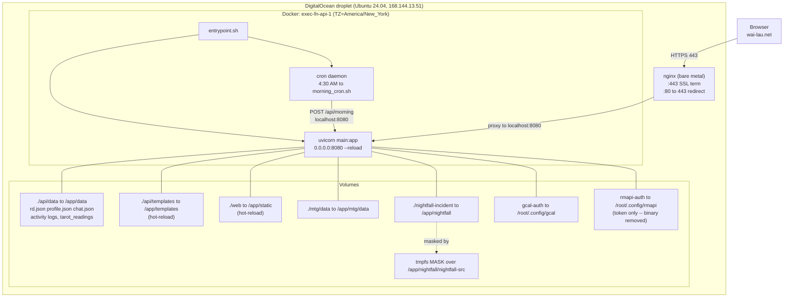
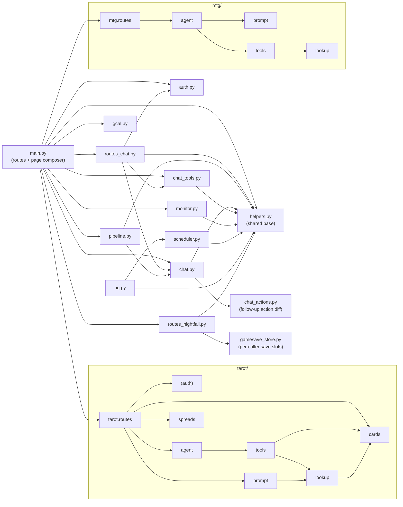
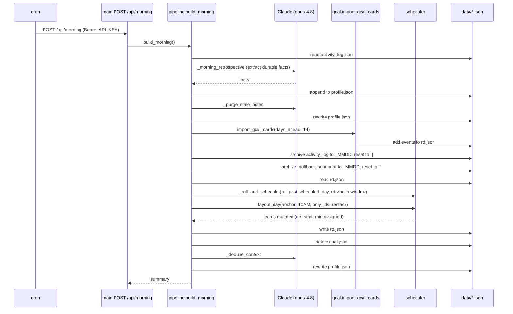
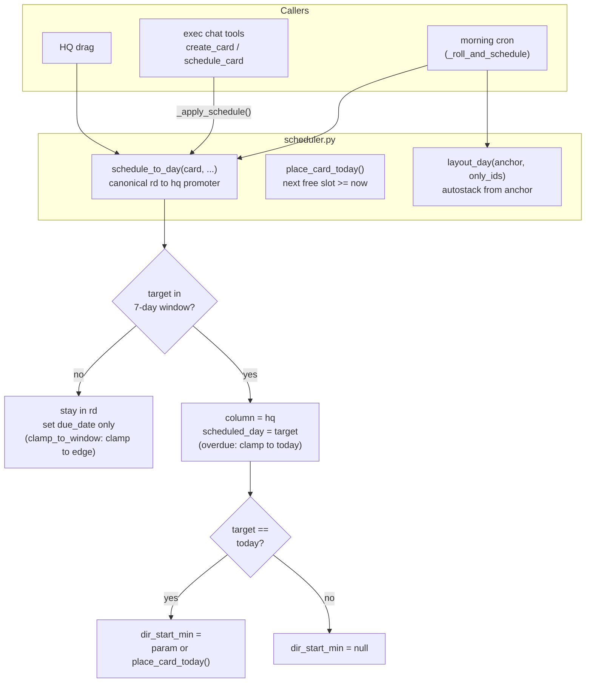
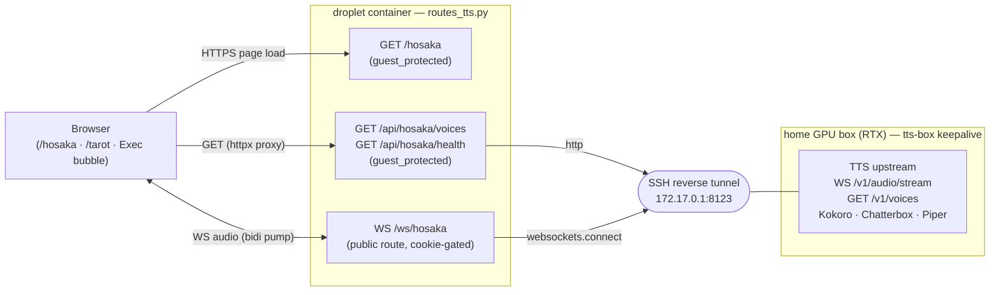
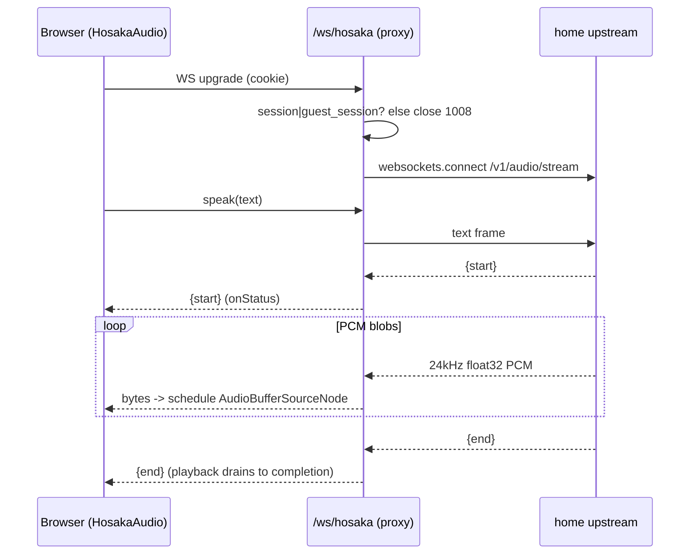
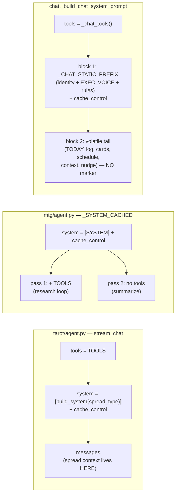
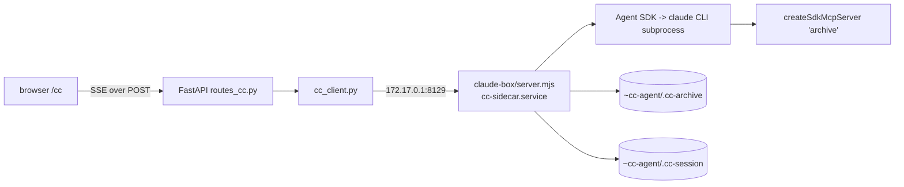

# exec-fn — Architecture (UML, Mermaid)

Generated from source (`api/*.py`, `docker-compose.yml`, `Dockerfile`,
cron). Five views:

1. [Deployment](#1-deployment) — how a request reaches code
2. [Module graph](#2-module-graph) — what imports what
3. [Morning pipeline + scheduling](#3-morning-pipeline--scheduling) — how
   cards move through time
4. [TTS subsystem](#4-tts-text-to-speech) — how every voice reaches the
   browser
5. [LLM call sites + prompt caching](#5-llm-call-sites--prompt-caching) —
   every Claude request and which prefixes are cached

---

## 1. Deployment

nginx (bare metal) terminates SSL, proxies to a single Docker container
running cron + uvicorn. Persistent state is JSON files on a bind-mounted
volume.


```mermaid
flowchart TB
  browser["Browser<br/>wai-lau.net"]

  subgraph droplet["DigitalOcean droplet (Ubuntu 24.04, 168.144.13.51)"]
    nginx["nginx (bare metal)<br/>:443 SSL term<br/>:80 to 443 redirect"]

    subgraph container["Docker: exec-fn-api-1 (TZ=America/New_York)"]
      direction TB
      entry["entrypoint.sh"]
      cron["cron daemon<br/>4:30 AM to morning_cron.sh"]
      uvicorn["uvicorn main:app<br/>0.0.0.0:8080 --reload"]
      entry --> cron
      entry --> uvicorn
      cron -->|"POST /api/morning<br/>localhost:8080"| uvicorn
    end

    subgraph vols["Volumes"]
      data["./api/data to /app/data<br/>rd.json profile.json chat.json<br/>activity logs, tarot_readings"]
      tmpl["./api/templates to /app/templates<br/>(hot-reload)"]
      web["./web to /app/static<br/>(hot-reload)"]
      mtgd["./mtg/data to /app/mtg/data"]
      night["./nightfall-incident to /app/nightfall"]
      gcal["gcal-auth to /root/.config/gcal"]
      rmapi["rmapi-auth to /root/.config/rmapi<br/>(token only -- binary removed)"]
      nfsrc["tmpfs MASK over /app/nightfall/nightfall-src"]
    end

    uvicorn --- data
    uvicorn --- tmpl
    uvicorn --- web
    uvicorn --- mtgd
    uvicorn --- night
    uvicorn --- gcal
    uvicorn --- rmapi
    night -.masked by.-> nfsrc
  end

  browser -->|HTTPS 443| nginx
  nginx -->|"proxy to localhost:8080"| uvicorn
```

**Port chain:** `nginx :443 (SSL) -> localhost:8080 -> container:8080 (uvicorn)`

**Image:** `python:3.12-slim`, single stage. No `EXPOSE`; port bound at compose
level only.

**The reMarkable feature is gone (2026-09-17), and the build got cheap because of
it.** The image used to open with `FROM golang:1.24-alpine AS rmapi-builder`,
which `git clone`d and `go build`s [rmapi](https://github.com/ddvk/rmapi); pip
then installed `rmscene` from git and the Dockerfile `sed -i`-patched one line of
its site-package source. All of it was dead: **neither `rmapi` nor `rmscene` had a
single reference in any `.py`, `.sh`, `.js` or cron file.** On a 2-core/1967MB box
a cold `go build` is a genuine OOM risk, which made every rebuild something to
schedule rather than just run — and the `sed` patch matched an upstream line by
exact string, so an upstream edit would have broken the build silently. Removing
the stage drops ~18MB of binary, the whole golang pull, the git clone, and that
patch.

**Python deps are locked, in two files.** `api/requirements.in` holds the ~18
DIRECT dependencies and all the explanatory comments; `api/requirements.txt` is a
**generated** full lock — every package including transitives, pinned `==`, 72 of
them. The Dockerfile installs the lock and never the `.in`. Regenerate with
`bash scripts/lock-requirements.sh`, which fresh-resolves inside a throwaway
`python:3.12-slim` (the same base the image uses, so the pins match what the
image will actually get rather than what the host happens to have), refuses to
write an empty result, and prints the rebuild command — because **a resolve
verifies nothing**.

The lock exists because of a specific outage. Nothing was pinned, so every
rebuild re-resolved the whole tree from scratch. On 2026-09-17 a rebuild resolved
`anthropic` and `mcp` to versions requiring **`httpx2`** rather than `httpx` — and
`api/auth.py` imports `httpx` **by name**, having only ever received it as a
transitive. It vanished, `main.py` died at import, and every route 502'd. Both
`httpx` and `httpx2` sit in the lock on purpose now: `httpx2` is what anthropic
and mcp want, `httpx` is what `auth.py` imports.

**The rule that falls out of it:** anything `api/` imports by name gets its own
line in `requirements.in`, no matter who else happens to pull it in. An audit of
every direct import against the declared set at the time found three such gaps —
`httpx`, `pydantic` and `starlette`. (`fontTools` also showed as missing, but it
belongs to `api/scripts/subset_cv_fonts.py`, a one-off font-subsetting script the
app never imports — not a runtime dep.)

**`rmapi-auth` is deliberately still mounted.** It holds a real authenticated
reMarkable device token (`rmapi.conf`, 1.5KB, last written 2026-04-28), and
re-pairing a device is a manual physical act. A declared-but-unmounted compose
volume counts as unused, so `docker volume prune` would eat it — hence mounted,
not merely declared. `RMAPI_FORCE_SCHEMA_VERSION` survives in `.env` as a no-op;
it was dropped from the Dockerfile `ENV` and from `entrypoint.sh`'s `cron_env`
filter.

**Secrets** (`.env`): `API_KEY`, `ANTHROPIC_API_KEY`, `TURNSTILE_SITE_KEY`,
`TURNSTILE_SECRET` (the guest gate is a Cloudflare Turnstile challenge, not a
shared key — `GUEST_KEY` retired).
cron reads them via `/run/cron_env`.

---

### 1d. nginx — the `--reload` 502, and the body-size 413

nginx does HTTP 80 → HTTPS redirect and HTTPS 443 → the `execfn_app` upstream (`127.0.0.1:8080`). The live config is `/etc/nginx/sites-enabled/default`; **backups live in `/etc/nginx/backups/`, NOT in `sites-enabled/`**, whose include is an unfiltered `*` that would load a `.bak` as a duplicate server block. `bootstrap.sh` carries the same block for a fresh box. The `/ws/` location is untouched.

**A `--reload` worker swap used to surface as a 502.** The reloader holds the listen socket in the parent and swaps the worker underneath, so a new connection is never refused — but a request landing on the OLD worker while it drains gets its connection closed with no response, which nginx reports as 502.

Measured live: **20 of 220 requests to `/` across two reloads came back 502**, while the same probe straight at `127.0.0.1:8080` saw none. That is what pinned it on the proxy rather than the app.

The fix is an explicit `upstream` block listing the server **TWICE** — nginx allows one try per peer, so a single-server upstream can never retry — with `max_fails=0`, plus `proxy_next_upstream error timeout http_502` / `_tries 3` / `_timeout 20s` / `proxy_connect_timeout 3s` on `location /`. Same probe after: **220/220 200s**, worst request ~7s (the swap is slow, not broken).

**Two deliberate omissions:**
- **`non_idempotent` is NOT set** — a retried POST/PATCH would apply a mutation twice — so retries cover the GETs that serve pages and assets.
- **`http_503` is NOT retried** — this app returns a real 503 when the home box or the printer is unreachable, and retrying would only delay an honest answer.

**`client_max_body_size 25m`** is set on the 443 server block (2026-09-13). nginx's default is **1m**, and a screenshot pasted into `/cc` arrives as base64 in a JSON body, so a normal phone screenshot was rejected with nginx's own HTML 413 before the app ever saw it — reported as `[ request failed (413) ] when uploading image`.

**The app's caps are meant to be the real ones** (4 images, 5MB base64 each, 24MB body) because they answer in JSON the page can render; nginx only has to be wide enough to let them do the refusing. Verified live: a 2MB body now reaches the app (401 unauthenticated, not 413), and an over-cap 7MB image returns the app's `{"error":"image too large"}` 413. Printer firmware/model uploads pass through the same limit.

## 2. Module graph

Intra-project imports only (stdlib / fastapi / anthropic omitted).
`main.py` is the composition root; `helpers.py` is the shared base
(10 inbound edges). Two self-contained subsystems: `tarot/*` and `mtg/*`.


```mermaid
flowchart LR
  main["main.py<br/>(routes + page composer)"]
  auth["auth.py"]
  helpers["helpers.py<br/>(shared base)"]
  pipeline["pipeline.py"]
  scheduler["scheduler.py"]
  monitor["monitor.py"]
  hq["hq.py"]
  chat["chat.py"]
  chat_tools["chat_tools.py"]
  chat_actions["chat_actions.py<br/>(follow-up action diff)"]
  routes_chat["routes_chat.py"]
  routes_night["routes_nightfall.py"]
  gamesave["gamesave_store.py<br/>(per-caller save slots)"]
  gcal["gcal.py"]

  main --> pipeline
  main --> gcal
  main --> chat
  main --> chat_tools
  main --> helpers
  main --> routes_night
  main --> routes_chat
  main --> monitor
  main --> auth
  main --> mtgr["mtg.routes"]
  main --> tarr["tarot.routes"]

  routes_night --> gamesave
  routes_chat --> auth
  routes_chat --> chat
  routes_chat --> chat_tools
  routes_chat --> helpers

  pipeline --> helpers
  pipeline --> chat
  chat --> helpers
  chat --> chat_actions
  chat_tools --> helpers
  monitor --> helpers
  scheduler --> helpers
  hq --> helpers
  hq --> scheduler
  routes_night --> helpers

  subgraph tarot["tarot/"]
    tarr --> tauth["(auth)"]
    tarr --> tag["agent"]
    tarr --> tcards["cards"]
    tarr --> tprompt["prompt"]
    tarr --> tspreads["spreads"]
    tag --> ttools["tools"]
    ttools --> tcards
    ttools --> tlookup["lookup"]
    tprompt --> tlookup
    tlookup --> tcards
  end

  subgraph mtg["mtg/"]
    mtgr --> mag["agent"]
    mag --> mprompt["prompt"]
    mag --> mtools["tools"]
    mtools --> mlookup["lookup"]
  end
```

Note: `scheduler.py` is reached at runtime from `chat_tools` and
`pipeline` via `__import__`/late import, so it has no static import edge
from them — the runtime call path is shown in view 3.

---

## 3. Morning pipeline + scheduling

### 3a. Morning cron sequence

`POST /api/morning` (4:30 AM ET) runs `build_morning()` in `pipeline.py`.


```mermaid
sequenceDiagram
  participant cron
  participant API as main.POST /api/morning
  participant P as pipeline.build_morning
  participant LLM as Claude (opus-4-8)
  participant GC as gcal.import_gcal_cards
  participant S as scheduler
  participant FS as data/*.json

  cron->>API: POST /api/morning (Bearer API_KEY)
  API->>P: build_morning()
  P->>FS: read activity_log.json
  P->>LLM: _morning_retrospective (extract durable facts)
  LLM-->>P: facts
  P->>FS: append to profile.json
  P->>LLM: _purge_stale_notes
  P->>FS: rewrite profile.json
  P->>GC: import_gcal_cards(days_ahead=14)
  GC->>FS: add events to rd.json
  P->>FS: archive activity_log to _MMDD, reset to []
  P->>FS: archive moltbook-heartbeat to _MMDD, reset to ""
  P->>FS: read rd.json
  P->>S: _roll_and_schedule (roll past scheduled_day, rd->hq in window)
  P->>S: layout_day(anchor=10AM, only_ids=restack)
  S-->>P: cards mutated (dir_start_min assigned)
  P->>FS: write rd.json
  P->>FS: delete chat.json
  P->>LLM: _dedupe_context
  P->>FS: rewrite profile.json
  P-->>API: summary
```

### rd.json concurrency — `helpers._RD_LOCK`

rd.json writers run on genuinely parallel OS threads: the nudge loop's scans
(`asyncio.to_thread`), chat-tool dispatch (`routes_chat` → `to_thread`),
sync-`def` routes on Starlette's thread pool (gcal import), and the event loop
itself (`PATCH /api/rd`). Three guards in `helpers.py` make that safe:

- **`_RD_LOCK`** (`threading.RLock`) — every read-modify-write cycle holds it
  around the WHOLE load→mutate→save sequence (`with _RD_LOCK:`), so one
  thread's save can never silently drop another's changes. LLM/network calls
  are NEVER made under the lock — callers release, call the model, then
  re-lock + reload + apply (`_fire_nudge`, `_build_graph`, `_run_triage`,
  `api_rd_recalc`, `_tool_decompose_task`, `import_gcal_cards`).
- **`_load_rd()` returns a private deep copy** — the `_load_json` mtime cache
  holds one shared object; handing it out mutable would leak one thread's
  in-progress edits into another's snapshot.
- **`_save_rd()` is an atomic replace** (tmp + rename), so a concurrent
  reader never sees a truncated file. It also **pops rd.json out of the
  `_load_json` mtime cache**: mtime granularity on this box is 1ms, so a save
  landing in the same millisecond as the read that seeded the cache left the
  stale PRE-save board being handed to the next load. Two quick cycles — a
  chat tool archiving a card, then re-reading it — saw the card back in the
  column it started in (found 2026-09-15 by `test_archive_card.py`, where a
  second archive of the same card re-cloned its recurrence).

Single-process invariant: uvicorn runs ONE worker (`--reload`), so a
process-wide lock is sufficient; nothing outside the container writes rd.json.
Read-only loads (`monitor`, `get_week_data`, scans) don't take the lock — the
deep copy + atomic replace make unlocked reads safe.

### 3b. scheduler.py — the time model

All `dir_start_min` / `scheduled_day` logic lives here. Window =
`SCHED_WINDOW_DAYS=6` (today + 6 = 7-day span).


```mermaid
flowchart TB
  subgraph entry["Callers"]
    morning["morning cron<br/>(_roll_and_schedule)"]
    execchat["exec chat tools<br/>create_card / schedule_card"]
    hq["HQ drag"]
  end

  subgraph sched["scheduler.py"]
    s2d["schedule_to_day(card, ...)<br/>canonical rd to hq promoter"]
    place["place_card_today()<br/>next free slot >= now"]
    layout["layout_day(anchor, only_ids)<br/>autostack from anchor"]
  end

  morning --> s2d
  morning --> layout
  execchat -->|"_apply_schedule()"| s2d
  hq --> s2d

  s2d --> decide{"target in<br/>7-day window?"}
  decide -->|"no"| outwin["stay in rd<br/>set due_date only<br/>(clamp_to_window: clamp to edge)"]
  decide -->|"yes"| inwin["column = hq<br/>scheduled_day = target<br/>(overdue: clamp to today)"]
  inwin --> istoday{"target ==<br/>today?"}
  istoday -->|"yes"| setmin["dir_start_min =<br/>param or place_card_today()"]
  istoday -->|"no"| clearmin["dir_start_min = null"]
```

**rd to hq promotion** (`schedule_to_day`): a card moves out of the `rd`
column into `hq` only when its target day falls inside the 7-day window.
`dir_start_min` (timeline position) is set only when the target is today —
either an explicit value or the next free slot from `place_card_today()`.
Outside the window the card stays in `rd` with just a `due_date`.

**Exec chat call chain:**
`POST /api/chat -> routes_chat._handle_tool -> chat_tools._TOOL_HANDLERS[name]`
`-> _apply_schedule -> scheduler.schedule_to_day`.

---

## 4. TTS (text-to-speech)

Every voice in the app — the `/hosaka` SPEAK page, the `/tarot` reader
narration, and the Exec bubble — streams from a **single home GPU box**
through a **same-origin reverse proxy**. No TTS models run on the droplet;
the container only proxies. The browser always talks same-origin, so the
session/guest cookie carries auth on the WebSocket handshake (HTTP basic
auth does not ride a WS upgrade reliably on mobile).

### 4a. Topology

The model server (Kokoro / Chatterbox / Piper) runs on Wai's home box and
is reached only over an SSH reverse tunnel bound to the Docker bridge
gateway (`TTS_UPSTREAM`, default `172.17.0.1:8123`). `tts-box/` (systemd
user service + port watchdog, installed on the home box) keeps that
upstream alive.


```mermaid
flowchart LR
  browser["Browser<br/>(/hosaka · /tarot · Exec bubble)"]

  subgraph droplet["droplet container — routes_tts.py"]
    page["GET /hosaka<br/>(guest_protected)"]
    voices["GET /api/hosaka/voices<br/>GET /api/hosaka/health<br/>(guest_protected)"]
    ws["WS /ws/hosaka<br/>(public route, cookie-gated)"]
  end

  tunnel(["SSH reverse tunnel<br/>172.17.0.1:8123"])

  subgraph home["home GPU box (RTX) — tts-box keepalive"]
    upstream["TTS upstream<br/>WS /v1/audio/stream<br/>GET /v1/voices<br/>Kokoro · Chatterbox · Piper"]
  end

  browser -->|HTTPS page load| page
  browser -->|"GET (httpx proxy)"| voices
  browser <-->|"WS audio (bidi pump)"| ws
  voices -->|http| tunnel
  ws -->|"websockets.connect"| tunnel
  tunnel --- upstream
```

`_pump_to_upstream` / `_pump_to_client` shuttle text + binary frames both
directions; `/api/hosaka/health` probes the upstream for a *real* response
(the reverse-tunnel listener stays bound on the droplet even when the model
server is down — a bound port is **not** liveness), letting `/hosaka` show
"TTS server offline" before SPEAK.

**Every utterance ends in a terminal frame** — the proxy guarantees it even
when the backend doesn't. An utterance normally ends with the upstream's own
`{"type":"end"}` / `{"type":"error"}`, which clears `busy[url]`; if the
upstream stream instead just *ends* (home box crashed, tunnel dropped, GPU
server restarted mid-sentence) `_pump_to_client`'s `finally` synthesizes
`{"type":"error","detail":"tts upstream closed mid-utterance"}` and evicts the
dead connection so the next utterance reconnects. This is load-bearing for
`/tarot`: the reader's typewriter paces off the audio clock and waits on a
terminal frame, so a silently-dead upstream left the reveal spinning forever
with the text stuck part-revealed. The guard is the pure predicate
`tts_routing.died_mid_utterance` (unit-tested — `routes_tts` can't be imported
by the dev venv), which fires **only** for the live connection on that `url`:
a stale socket `_ws_dispatch` deliberately cut to start a new utterance is
superseded, and its error would abort the utterance that replaced it.

Client-side belts for the same failure, since a frame can also be lost between
browser and droplet: `hosaka-audio.js`'s `ws.onclose` delivers a synthetic
`{type:"error"}` to the in-flight utterance (guarded on the socket still being
the live one), and `tarot-stream.js`'s stall watchdog caps `elapsed()` at the
buffered duration in its progress signal — the raw `el + dur` never stopped
rising (the ctx clock keeps running after the buffer drains), so the watchdog
could never fire on a dead stream.

### 4b. Auth — now guest-or-full

`/hosaka` and `/api/hosaka/*` moved from the full-auth `protected` router to
**`guest_protected`** — a guest session now reaches the SPEAK page. The WS
`/ws/hosaka` is declared on the `public` router but rejects (close `1008`)
unless a `session` **or** `guest_session` cookie matches before `accept()`.
The guest tier is what lets the `/tarot` reader voice work for guests.

| Endpoint | Router | Reachable by |
|----------|--------|--------------|
| `GET /hosaka` | `guest_protected` | full + guest (nav renders guest-tier for non-admins) |
| `GET /api/hosaka/voices`, `/health` | `guest_protected` | full + guest |
| `WS /ws/hosaka` | `public` + cookie check | full + guest (else `1008`) |

### 4b-ii. GPU-mode owner control

`GET /api/hosaka/mode` and `POST /api/hosaka/mode` sit on the **`protected`**
router (owner-only -- guests must never flip the GPU). They proxy the home-box
`gpu-mode` service over the SSH tunnel at `172.17.0.1:8124` (env:
`GPU_MODE_UPSTREAM`, default `172.17.0.1:8124`) using `Authorization: Bearer
$GPU_MODE_TOKEN` (the token must match the value on the home box;
provisioned in the droplet `.env` -- operator step). The GET returns the
current mode; the POST body `{"action": "homo"|"emo"|"idle", "force"?: bool}`
transitions it.
`emo` and `idle` stop hosaka-server and therefore disconnect active remote
users; the route confirms against `_audio_conns` (the live `/ws/hosaka` audio
socket set in `routes_tts.py` — the real listeners, incl. /tarot narration and
Exec voice, not just `/hosaka`-page `_presence`) and returns `409` if any users
are connected and the caller has not sent `{"force": true}`. `homo` never needs
confirmation.

**The reported mode is corrected against reality.** `/mode` reports the box's
*intent*, and that outlives the truth: when hosaka-server dies or wedges the
box goes on answering `homo` while nothing synthesizes, and the strip lights
the homo segment over a dead backend. `_current_mode()` probes `/mode` and TTS
liveness concurrently and passes both to the pure
`gpu_mode_client.effective_mode`, which reports `idle` for a claimed `homo`
whose TTS is not answering. Only `homo` is second-guessed — under `emo`/`idle`
a failing probe is the *expected* state, not a contradiction, and `gone` (box
unreachable) already says everything. Liveness is the same `_live()` rule the
health route uses: only a real `/v1/voices` response, never a bound tunnel
port. A `homo` switch sets a 90s grace (`_HOMO_GRACE_S`) during which liveness
is assumed, because the box has to load models before `/v1/voices` answers and
the next poll would otherwise read "homo but no TTS" and flip the strip to
idle and back.

**Mode changes reach open pages two ways.** A POST here pushes instantly to
`_mode_subscribers`. Everything else — a switch made at the home box, a
watchdog restart, hosaka-server dying under a mode still claiming homo — never
touches that queue, so `/api/hosaka/mode/stream`'s keepalive tick doubles as a
poll of the real mode (`_MODE_POLL_S`, 15s) and emits on change. This is what
fixes drift for pages that are already open; `gpu-mode.js`'s recheck-on-load
and refresh-on-refocus only ever covered pages that got touched, and its own
comment said so ("No interval -- a long-open foreground tab drifts until
touched"). An unchanged poll falls through to a `: keepalive` comment, so an
idle stream still costs one line per tick.

Both `/hosaka` and `/emet` render the same `emo | idle | homo` segmented
control (shared `web/gpu-mode.{js,css}`, keyed on `#gpu-mode`) for owners only.
If the proxy call to the home service fails (tunnel down, service not running),
the mode is reported as `gone` (an exec-fn label; the home service itself never
returns `gone`).

`GET /api/hosaka/mode/stream` is an owner-only SSE fan-out (`_mode_subscribers`
in `routes_tts.py`): a successful `POST` broadcasts the new mode to every
subscriber, so the control **live-syncs across pages** — flipping it on
`/hosaka` updates the strip on an open `/emet` (and vice-versa) with no reload.
The stream pushes only on an actual switch; each page seeds its initial state
from `GET /api/hosaka/mode` on load.

| Endpoint | Router | Reachable by |
|----------|--------|--------------|
| `GET /api/hosaka/mode` | `protected` | owner only |
| `POST /api/hosaka/mode` | `protected` | owner only |
| `GET /api/hosaka/mode/stream` | `protected` | owner only |

### 4c. Four consumers of one audio core — and one narrator above it

All four share `web/hosaka-audio.js` (`HosakaAudio.createPlayer()`) — it
owns the `AudioContext`, the iOS unlock dance, the `/ws/hosaka` socket, and
playback of streamed **24 kHz float32 PCM** via scheduled
`AudioBufferSourceNode`s. The upstream emits only `{start}` / coarse PCM
blobs / `{end}` (no per-word timestamps), so any visual syncs to the
*measured* audio duration.

| Surface | Script | Voice | Backend | Where that backend runs |
|---------|--------|-------|---------|-------------------------|
| `/hosaka` SPEAK UI | `tts.js` | `charlie` (default) + full list | chatterbox + RVC | home GPU box |
| `/tarot` reader | `tarot-voice.js` | `nicole` | kokoro | **home GPU box** |
| Exec panel + bubble | `exec-voice.js` / `exec-voice-listener.js` | `glados` | piper | **this droplet** |
| `/cc` | `exec-voice.js` (same binding) | `glados` | piper | **this droplet** |

**That last column is the difference that matters.** `pick_upstream` routes
backend `piper` to the always-on container beside the app, so Exec and `/cc`
keep their voice with the home machine asleep; only `/tarot` speaks from the
tunnel, and only `/tarot` can lose its voice (§14d).

Above the player sits **`web/voice-narrator.js`**, shared by the three
narrating surfaces: player lifecycle, the persisted on/off, the unlock dance,
the utterance queue, and the CONTROLLER (`elapsed()`, `duration()`, `ended`,
`ok`) a typewriter paces to. `exec-voice.js` and `tarot-voice.js` are thin
bindings over it — configuration plus what is genuinely theirs (the replay
glyph and the toggle both surfaces mount; the home-box probe and the canned
opening). The control itself is **`web/voice-ui.js` + `voice-ui.css`**: one
`.voice-mute` element, one `data-on` contract, three placements.

**The star is a CHARACTER in the bracket's own font, and a transform is the only
thing that sizes it** (fixed 2026-09-21). It was a `--font-ui` star at
`font-size: 1.3em` with `0.12em` side margins, and that cost this control both of
a composer's published dimensions. **Height**: an inline-block's own line-height
IS its box height, so a 20.18px box on an 18.62px line grew every composer
carrying the star by 1.56px — `/cc`'s input bar measured 26.17 against `/mtg`'s
24.61, and `/cc` publishes that bar as `--input-h` for `#terminal` to sit above,
so the star was quietly eating a row of transcript on the page that has the
least of it. **Width**: a 0.84em advance plus 0.24em of margin made `[✦]` nine
pixels wider than the `[x]` beside it (38.28 against 29.28), on a one-line
composer where the two read as a pair.

Iosevka has this glyph and its advance IS the mono cell, so in `--font-mono` the
star occupies exactly one character: three cells for `[✦]`, three for `[x]`,
29.28px each, and the line box is a character's. The font supplies the geometry
and `transform: scale(1.25)` only says how much of the cell the star fills — at
the font's own size it read thin beside the bracket strokes (ink 6.67px →
8.67px), and that is about as far as it goes: the gap to each bracket is down to
1px against the `[x]`'s 2.33px. Layout is untouched at any factor, which is the
whole reason the size lives in a transform. Both bars measure 24.61 and both
controls 29.28. The nav's glyph label is sized the same way, for the same reason
(§12).

**`/tarot` overrides both the factor and the size**, in `tarot.css`
(`.voice-mute.spread-btn .voice-glyph`). One mono cell is the right size next to
an `[x]`; that page has no `[x]` — the star sits in a column of glyph buttons,
`[↺]` at 1.7em and `[♪]` at 1.3em, both with real side margins — so the
cell-sized star read tiny and touched its own brackets (ink 5.67px against the
note's 10.67, 1px gaps against 4px). It takes the reset glyph's metrics plus the
factor that brings a star's ink up to a note's: 10.33px, 3.33px gaps, and the
same button height as `[↺]` by construction, since the box is the font-size.

**OFF means off.** Before 2026-09-20 `/tarot`'s button was a volume mute that
kept synthesizing and kept pacing the reveal to audio nobody could hear. Now
`speak()` returns a DEAD controller when the narrator is off — nothing
synthesized, no socket — and every caller reads that as "reveal at your own
pace, now". One flag; no second state to keep in sync.

Each narrating surface paces its typewriter to the audio clock and bails to the
guessed pace on any failure (§18). `exec-voice-listener.js` (nudges and monitor
comments on non-planning pages) is still fire-and-forget: there is no typewriter
on those pages to pace.

**A fourth path plays audio that was never synthesized here.** The
pre-generated `/tarot` openings (§14d) are already-rendered WAVs, and
`player.speakBuffer({data})` schedules one through the SAME `scheduleBuffer`
the streamed chunks use — same playhead, same gain node (so the ♪ mute still
works), same iOS unlock and silent-switch session, same `elapsed()` /
`audioDuration()` clock, so the typewriter cannot tell which one it got. No
socket is opened: there is nothing to synthesize. `{end}` fires the moment it
is scheduled, because a file is fully buffered by definition. One trap:
`decodeAudioData` **detaches** the ArrayBuffer it is handed, so it decodes a
copy and the caller's clip survives a replay.

**The other direction — synthesizing with no browser in the loop —** is
`api/tarot/voice_synth.py`: it speaks the upstream's protocol directly
(`ws://TTS_UPSTREAM/v1/audio/stream`, one JSON utterance in, `{start}` →
float32 frames → `{end}` back) rather than going through `/ws/hosaka`, because
there is no cookie to carry and no client to fan out to. Three callers: the
opening generator, the nightly voice probe (§14e), and `POST /api/tarot/warm`.

### 4d. One utterance


```mermaid
sequenceDiagram
  participant B as Browser (HosakaAudio)
  participant WS as /ws/hosaka (proxy)
  participant U as home upstream

  B->>WS: WS upgrade (cookie)
  WS->>WS: session|guest_session? else close 1008
  WS->>U: websockets.connect /v1/audio/stream
  B->>WS: speak(text)
  WS->>U: text frame
  U-->>WS: {start}
  WS-->>B: {start} (onStatus)
  loop PCM blobs
    U-->>WS: 24kHz float32 PCM
    WS-->>B: bytes -> schedule AudioBufferSourceNode
  end
  U-->>WS: {end}
  WS-->>B: {end} (playback drains to completion)
```

---

## 5. LLM call sites + prompt caching

Every Claude call goes through the `anthropic` SDK with a pay-per-token
`ANTHROPIC_API_KEY` (no subscription). Where a large, byte-stable system
prefix is **reused across turns**, a `cache_control: {type: ephemeral}`
marker (5-min TTL) lets repeat requests read that prefix at ~0.1x instead
of full price.

### The one invariant

Render order is `tools -> system -> messages`. A marker on the **last
system block** caches `tools + system` together as the prefix. Caching is
a pure prefix match: any byte that changes inside the cached span (a
timestamp, per-request card data) invalidates everything after it. So the
static text must physically precede the volatile text, and the marker sits
at the end of the static part. **Opus min cacheable prefix = 4096 tokens**
— a shorter prefix silently caches nothing (`cache_creation_input_tokens`
stays 0), so anything under that is left uncached.

### Cached sites


```mermaid
flowchart LR
  subgraph tarot["tarot/agent.py — stream_chat"]
    tsys["system = [build_system(spread_type)]<br/>+ cache_control"]
    ttools["tools = TOOLS"]
    tmsg["messages<br/>(spread context lives HERE)"]
    ttools --> tsys --> tmsg
  end

  subgraph mtg["mtg/agent.py — _SYSTEM_CACHED"]
    msys["system = [SYSTEM] + cache_control"]
    p1["pass 1: + TOOLS<br/>(research loop)"]
    p2["pass 2: no tools<br/>(summarize)"]
    msys --> p1
    msys --> p2
  end

  subgraph exec["chat._build_chat_system_prompt"]
    estatic["block 1: _CHAT_STATIC_PREFIX<br/>(identity + EXEC_VOICE + rules)<br/>+ cache_control"]
    evol["block 2: volatile tail<br/>(TODAY, log, cards, schedule,<br/>context, nudge) — NO marker"]
    etools["tools = _chat_tools()"]
    etools --> estatic --> evol
  end
```

| Call site | Model | Cached prefix | Tokens | Reuse pattern |
|-----------|-------|---------------|-------:|---------------|
| `tarot/agent.py` `stream_chat` | opus-4-8 | `build_system(spread_type)` + `TOOLS` | ~8.7K / ~13.4K | every turn of a reading |
| `mtg/agent.py` pass 1 | opus-4-8 | `SYSTEM` + `TOOLS` | ~6.6K | across research tool-loop iterations + cross-question |
| `mtg/agent.py` pass 2 | opus-4-8 | `SYSTEM` (no tools) | ~5.9K | cross-question only (separate prefix from pass 1) |
| `routes_chat` `/api/chat` + `_stream_tool_followup` | opus-4-8 | `_CHAT_STATIC_PREFIX` + `_chat_tools()` | ~5.2K | every exec turn; follow-up reads what the main turn wrote |

**Exec restructure:** the tools alone (~3.5K) are under 4096, so the static
text is what lifts the prefix over the floor. `_build_chat_system_prompt`
returns a **two-block** system list — a marked static block (identity +
`EXEC_VOICE` + global rules) and an unmarked volatile tail. `TODAY` was at
the top of the old single-string prompt and silently invalidated the cache
every request; it now lives in the volatile tail. Both `routes_chat` call
sites build the identical static block.

**Follow-up action diff:** after a tool round, the follow-up turn rebuilds the
system prompt — so its board lists now include any card the turn just created.
`_build_chat_system_prompt(stage, actions=…)` appends an **ACTIONS YOU JUST
TOOK** block (rendered by `chat_actions._actions_taken_block` from the dispatched
`{name, input, result}` list) to the **volatile tail**, so the model reads the
refreshed board as the result of its own action rather than reporting a phantom
duplicate. Marked only in the volatile tail → the cached static prefix stays
byte-stable. Threaded through both follow-up paths (`routes_chat._dispatch_tools`
collects the actions; `discord_bot.exec_reply` rebuilds `system2` with them).

**Tool rounds are a bounded LOOP, not one shot** (`_MAX_TOOL_ROUNDS` = 3, in both
`routes_chat` and `discord_bot`). The follow-up turn is handed the tools, so it
can answer a tool result by calling another tool — an exile right after a create.
Both paths used to keep only the follow-up's TEXT: any `tool_use` it emitted was
dropped on the floor, never dispatched and never stored, so Exec could announce
an action ("I'll exile the duplicate") that provably never happened — observed
2026-09-02, with `rd.json` holding one card and the activity log holding no
exile. `chat_store.assistant_content_blocks` is the shared helper that preserves
text + `tool_use` from an API message; each round dispatches the pending turn's
tool_use blocks, appends the results, and streams the next turn with a REBUILT
action diff (cumulative across rounds). A stream that dies mid-follow-up keeps
whatever text arrived and ends the loop.

**Activity-log entries carry the card `id`** (`_log_entries_for_patch`:
created/moved/updated/deleted, plus `revived`), and `_build_chat_system_prompt`
renders it as a trailing `[id:…]` on each log line. One `create_card` WITH a
due_date emits both a `created` and an `updated` entry — by title alone that
reads as two cards, which is what produced the phantom "there was already one in
the pool from earlier this turn". The actions block says so explicitly: entries
sharing an id are one card. Legacy entries with no id render unchanged.
Regression properties pinned in `tests/test_exec_tool_rounds.py`.

### Uncached (measured, left alone)

| Call site | Why |
|-----------|-----|
| `monitor.py` | static slice ~1.3K (no tools) < 4096; debounced bursts = low reuse |
| `nudge_llm` `_TONE` | ~1.4K (no tools) < 4096; per-card one-shot |
| `card_llm` classify / parse-date | one-shot per card; no system / ~80-token volatile system |
| `morning.py`, `chat._dedupe_context` | daily one-shot; prompt lives in the user message |
| `gcal._haiku_classify_batch` | no system block; tiny instructions in the user message |
| `tarot/openings_gen.generate_texts` | `voice_preamble()` ~1.5K < 4096; 24 calls, one per hour, minutes apart |

**Verifying:** the response `usage` reports `cache_creation_input_tokens`
(written this request, ~1.25x) and `cache_read_input_tokens` (served from
cache, ~0.1x). First request creates, second identical-prefix request
reads. `cache_read` staying 0 across two identical requests means a silent
invalidator is back in the prefix.

---

### 5d. Where the marker goes

Anthropic prompt caching is `cache_control: ephemeral`, 5-min TTL, wired on the large STATIC system prefixes reused across turns, so repeat turns read the prefix at ~0.1x. **Opus's minimum cacheable prefix is 4096 tokens; anything below that will not cache, silently**, and is left alone.

The marker always goes on a byte-stable block, and the volatile part must live somewhere else:

- **Tarot** (`tarot/agent.py`) — the marker sits on the single system block, `system=build_system(spread_type)` (~8.7K no-spread / ~13.4K three-card) + `TOOLS`. Fully static per reading; **the per-turn spread context rides in `messages`, never `system`**. A reading is many turns reusing one prefix.
- **MTG** (`mtg/agent.py`, `_SYSTEM_CACHED`) — `SYSTEM` (~5.9K) marked once, used at both call sites. Pass 1 (research tool-loop, with `TOOLS`) caches the ~6.6K tools+system prefix across its own iterations; pass 2 (summarize, NO tools) is a separate system-only prefix. Both cache cross-question; only pass 1 caches within a single question.
- **Exec chat** (`chat._build_chat_system_prompt`) returns a **TWO-block** system list: block 1 is `_CHAT_STATIC_PREFIX` (identity + `EXEC_VOICE` + global rules) carrying the marker, block 2 the volatile tail (TODAY, activity log, card lists, schedule, context, active-nudge block) carrying none. With the exec tools the cached prefix is ~5.2K.

  **TODAY moved from the top into the volatile tail — it was the silent invalidator.** The restructure was required because the tools alone (~3.5K) sit under opus's 4096 minimum.

  Both `routes_chat` call sites (main stream and `_stream_tool_followup`) build the identical static block, so the follow-up turn reads the cache the main turn wrote. The follow-up passes `_build_chat_system_prompt(stage, actions=…)` — an **ACTIONS YOU JUST TOOK** block (built by `chat_actions._actions_taken_block` from the turn's dispatched `{name,input,result}` list) appended to the volatile tail, **with the marker staying on block 1 so the cached prefix is byte-stable**.

## 6. Printer (ELEGOO Centauri Carbon) — two-tier reverse proxy

`/printer` serves the printer's **own** web UI (an Angular SPA with a live
MJPEG camera and SDCP websocket controls) from wai-lau.net, without the SPA
ever knowing it left the LAN. Same-origin everywhere: the browser talks only
to the droplet, so the full `session` cookie rides every sub-request incl.
the websocket handshake, and nothing weaker than the owner reaches a machine
that can heat a nozzle.

Since 2026-08-30 the page also has a **guest tier — read-only, by routing**
(it is linked from the public landing; guests pass Turnstile). The rule is not
"filter what a guest may send", it is "a guest has no route that carries their
bytes to the LAN":

| Route | Owner | Guest | Why |
|-------|-------|-------|-----|
| `GET /printer` | SPA wrapper | camera + job strip | same template, `data-readonly="1"` for guests |
| `ANY /printer/{path}` | full proxy | **401 → admin login** | the SPA, its file endpoints, uploads — every browser→printer HTTP path |
| `WS /ws/printer` | SDCP relay | **1008** | the only browser→printer socket; it drives the machine |
| `GET /printer/video` | ~10fps | ~2fps | one-way read, off the shared hub |
| `GET /api/printer/status` | ✓ | ✓ | one-way read; the printer pushes it unasked |
| `GET /api/printer/health` | ✓ | ✓ | one-way liveness GET |

The two guest-reachable readers are **server-opened singletons**, not relays
of anything a viewer said: `printer_camera.py` holds ONE upstream MJPEG
stream (demuxed to whole JPEG frames, re-muxed per viewer — the printer only
allows ~4 streams, so a public page can't be 1:1) and `printer_status.py`
holds ONE SDCP socket that **sends no frame, ever** — the printer pushes
`sdcp/status/<id>` about once a second on its own, and `public_status()`
whitelists it (no `MainboardID`/`TaskId`/`Filename`).

### 6a. Topology

The printer sits on Wai's home LAN (`192.168.2.25`). Its three ports are
reverse-tunnelled from the home box to the droplet's docker bridge by
`printer-box/printer-tunnel.service` — the hosaka/emet pattern (§4a), with
the `-R` forwards pointing straight at the printer's LAN address (nothing
listens on the home box).


```mermaid
flowchart LR
  browser["Browser<br/>(/printer wrapper + iframe)"]

  subgraph droplet["droplet container — routes_printer.py"]
    page["GET /printer<br/>(guest or owner)"]
    health["GET /api/printer/health<br/>(guest or owner)"]
    status["GET /api/printer/status<br/>(guest or owner, read-only)"]
    http["ANY /printer/{path}<br/>(OWNER ONLY, rewrites HTML+JS)"]
    video["GET /printer/video<br/>(guest or owner, shared MJPEG hub)"]
    ws["WS /ws/printer<br/>(OWNER ONLY, session-cookie gated)"]
  end

  tunnel(["SSH reverse tunnel<br/>172.17.0.1:8126 / 8127 / 8128"])

  subgraph lan["home LAN — ELEGOO Centauri Carbon"]
    p80[":80 SPA + files"]
    p3030[":3030 /websocket (SDCP)"]
    p3031[":3031 /video (MJPEG)"]
  end

  browser -->|HTTPS| page
  browser -->|15s poll| health
  browser -->|iframe src + assets| http
  browser -->|"<img src>"| video
  browser -->|3s poll, guest view| status
  browser <-->|SDCP JSON frames| ws
  health --> tunnel
  status --> tunnel
  http --> tunnel
  video --> tunnel
  ws --> tunnel
  tunnel --- p80
  tunnel --- p3030
  tunnel --- p3031
```

### 6b. Why rewrites, and which

The SPA assumes it is the origin. Served under a path prefix on a different
host over https, four things break; each is patched in flight by the pure
helpers in `printer_proxy.py` (no I/O — unit-tested in
`tests/test_printer_proxy.py` against verbatim slices of firmware V1.4.49):

| Upstream shape | Breaks because | Rewrite |
|----------------|----------------|---------|
| `<base href="/">`, `href="/assets/…"` (index HTML) | assets + Angular routes resolve against the site root | `rewrite_html`: root-absolute `href`/`src` → `/printer/…` (protocol-relative `//` untouched) |
| `` `ws://${this.hostName}:3030/websocket` `` (main.js) | wrong host, wrong port, `ws://` on an https page | `rewrite_js`: → `` `${location.protocol==="https:"?"wss":"ws"}://${location.host}/ws/printer` `` |
| `"http://"+(…VideoUrl)` on the camera `` (25.\<hash\>.js) | mixed content | `rewrite_js`: scheme dropped, the (rewritten) `VideoUrl` used verbatim |
| `` `http://${…hostName}:80` `` (file download href, upload POST) | wrong origin | `rewrite_js`: → `` `${location.origin}/printer` `` |
| `"/assets/images/network/*.png"` string literals in the compiled Angular templates (all bundles) | root-absolute → 404 against the site root (blank icons) | `rewrite_js`: quoted `/assets/` → `/printer/assets/` |
| `"VideoUrl":"192.168.2.25:3031/video"` in the SDCP reply to *enable video stream* (cmd 386) | LAN address | `rewrite_ws_text` on printer→browser text frames → `/printer/video` |
| `</head>` of the index | the SPA's own top bar (logo · language · store link) is noise inside the site shell | `rewrite_html` injects `<link href="/printer-frame.css">` (site-side overrides for the *proxied* document: hides `app-header`); injected after the re-root pass so the absolute href stays |
| `"Thumbnail":"http://192.168.2.25/board-resource/history_image/<task>.png"` (task detail, cmd 321; timelapse `TimeLapseVideoUrl` likewise) | LAN address, bound straight onto `` | `rewrite_ws_text`: any `http://<lan-ip>[:80]/` → `/printer/` (served off the printer's :80 by the proxy; other ports left alone) |

Relative URLs (hashed CSS/JS, webpack lazy chunks with `publicPath ""`,
`assets/i18n/…`, `iconfont.ttf`) resolve against the rewritten base href and
need nothing. **Deliberately not rewritten:** the WebRTC signalling socket
(`ws://<host>:8883`, reached only when the printer advertises
`VIDEO_WEBRTC` — this unit reports FILE_TRANSFER / PRINT_CONTROL /
VIDEO_STREAM only); a regression test pins it as untouched, so wiring it
(a fourth tunnel port + relay) is a conscious change.

Headers are **allowlists** in both directions (`upstream_request_headers` /
`client_response_headers`): the session cookie and admin bearer never reach
the printer; `accept-encoding` is pinned to `identity` so rewritable bodies
arrive uncompressed; `content-length` / `content-encoding` are dropped on
the way back (bodies change) but a request `content-length` is forwarded (a
streamed upload keeps its known length — the printer's tiny HTTP server is
not trusted to speak chunked); every response is stamped
`Cache-Control: private, no-cache` (auth-gated, never a shared-cache
candidate) and `main.py`'s `CacheControlMiddleware` skips the `/printer/`
prefix so its public/immutable stamp for static-looking suffixes never
applies. Conditional requests are answered by the **proxy**, never the
printer: `If-None-Match` is not forwarded, and a rewritten body's ETag is
the printer's tag + `-rw<REWRITE_VERSION>` (bump the constant whenever
`rewrite_html`/`rewrite_js` change), so the hashed bundles still 304 while a
browser copy patched by older rules misses and refetches — otherwise the
printer's unchanged ETag would 304 a stale rewrite back into service; only a
root-relative `Location` survives, re-rooted under the prefix — an absolute
or protocol-relative redirect target is dropped rather than sent to the
owner's browser.

### 6c. Runtime shape

- **`/printer/{path}`** streams every non-HTML/JS body straight through in
  BOTH directions (`StreamingResponse` over `httpx` `aiter_raw` down; the
  request body as `request.stream()` up, write timeout unbounded so a gcode
  upload runs at whatever the home uplink allows) — nothing is buffered;
  HTML/JS are read whole, rewritten, re-served.
- **`/printer/video`** relays the camera's `multipart/x-mixed-replace` with
  `X-Accel-Buffering: no` (nginx's `location /` buffers by default) and the
  content type excluded from `GZipMiddleware` (gzip would hold frames inside
  zlib). Newer starlette binds the exclusion list as a constructor-kwarg
  default at import time, so `main.py` passes the patched list explicitly
  when the signature accepts it (older starlette keeps reading the module
  global), and the tuple carries both the prefix and `type/*` spellings —
  without that, the MJPEG frames (and the fonts/images the list already
  named) were being gzipped after all. The relay **reconnects instead of
  ending**: the SPA's `` never re-requests a dead MJPEG stream, so when
  the upstream ends or stalls past the 30s read timeout (camera pause,
  tunnel restart) `_video_frames` re-dials with 1→15s backoff and splices
  the fresh stream into the SAME open response (the printer's part boundary
  is constant; a changed boundary ends the response instead). Closing the
  tab cancels the generator wherever it is; its `finally` closes the
  upstream, releasing one of the printer's 4 allowed streams.
- **`/ws/printer`** accepts first, then dials the printer (like
  `/ws/hosaka`) — a browser that vanishes mid-handshake never strands an
  open upstream socket, and a down printer surfaces as a clean `1011` close
  the SPA retries on. Two pump tasks (`_pump_to_client` rewrites text
  frames; `_pump_to_upstream` forwards text + bytes) under
  `asyncio.wait(FIRST_COMPLETED)`; whichever side closes tears down both.
  Declared on the `public` router like `/ws/hosaka` (a router-level
  `Depends` can't gate a websocket the same way) and checks the `session`
  cookie itself with `hmac.compare_digest` — guests are refused (`1008`
  before `accept()`, which the browser sees as a 403 handshake).
- **Liveness** (`/api/printer/health`): the tunnel ports stay bound while the
  printer is off and a connect *accepts then resets* — so only a real HTTP
  answer from the SPA shell counts as online (the `/api/hosaka/health`
  rule), probed with its own fail-fast 2s-connect / 3s timeout. Every
  upstream call has a short connect timeout and degrades to a 503 or a
  closed socket, never a 500.
- **The wrapper** (`templates/printer.html` + `web/printer.{css,js}`): a
  status row over an `<iframe>` of `/printer/network-device-manager/network/control`.
  The iframe isolates the SPA's global antd CSS from chrome.css and scopes
  its `<base href>` to its own document. `printer.js` polls health every 15s
  (+ on tab focus; polls are sequence-numbered so a slow, older answer can
  never overwrite a fresher one) and mounts the iframe only while online;
  offline swaps in a "printer offline" note and sets the frame to
  `about:blank` so the SPA's reconnect loop dies with it. Online again →
  remounts by itself. The page keeps the site's Exec link-bubble; because
  `window` mouse events stop firing once the cursor crosses into a
  cross-document frame, `exec-bubble-drag.js` flags a live mouse drag as
  `html.exec-drag` and `printer.css` drops the iframe's `pointer-events`
  for its duration, so the bubble can be dragged across the SPA.

Verified end-to-end against the live printer with the real app under
uvicorn (auth tiers, rewrites, etag→304, un-gzipped MJPEG, WS relay + the
cmd-386 rewrite, reconnect splice against a fake upstream that drops every
few frames).

| Endpoint | Router | Reachable by |
|----------|--------|--------------|
| `GET /printer`, `GET /api/printer/health` | `protected` | owner only |
| `ANY /printer/{path}`, `GET /printer/video` | `protected` | owner only |
| `WS /ws/printer` | `public` + `session` cookie check | owner only (else `1008`) |

### 6d. The tunnel and its env

The printer's three ports are `ssh -R`-tunnelled from the home box to the docker bridge exactly like hosaka/emet (install steps in `printer-box/README.md`):

| Printer port | Bridge | Env var |
|---|---|---|
| `:80` SPA + files | `172.17.0.1:8126` | `PRINTER_UPSTREAM` |
| `:3030` SDCP websocket | `:8127` | `PRINTER_WS_UPSTREAM` |
| `:3031` MJPEG camera | `:8128` | `PRINTER_VIDEO_UPSTREAM` |

`routes_printer.py` serves every route; the pure rewrite helpers live in `printer_proxy.py`, unit-tested against verbatim slices of firmware V1.4.49 in `tests/test_printer_proxy.py`.

### 6e. The wrapper page

**`GET /printer`** serves `templates/printer.html` through `printer_page()` — the standard shell + full nav, `full_height`: a lede and an online/offline status row over an **`<iframe>`** of the proxied SPA at `/printer/network-device-manager/network/control`.

The iframe is **isolated on purpose**: the SPA's global antd CSS never touches chrome.css, and its `<base href>` only applies inside its own document.

`web/printer.js` polls `/api/printer/health` every 15s (+ on tab focus; polls are sequence-numbered so a slow older answer never overwrites a fresher one) and mounts the iframe ONLY while the printer answers. Offline (printer off, home box asleep) shows a quiet "printer offline" note instead of the SPA's endless reconnect loop (frame set to `about:blank`), and it remounts by itself when the printer is back.

**The iframe fades in only on its `load` event** (`.printer-frame` is `opacity:0` until `printer.js` adds `.ready`) — the vendor SPA paints a white document before its app renders, so revealing it the instant `src` is set flashed white; now the page shows its own dark bg during the boot and the SPA fades in once painted.

**The guest render is a different page, not a filtered one.** `printer_page()` marks it `data-readonly="1"` on `.printer` and `printer.js` then never mounts the SPA frame at all — belt to the route tiering's braces — showing `#printer-view` instead: the camera `` plus ONE job strip (`#printer-job`) polled from `/api/printer/status` every 3s.

**The guest page is the picture and the job, nothing else** (2026-09-19). The strip carries the same information as the vendor SPA's own print-job row — state chip, percent, elapsed/remaining, layer progress — and none of its controls: there is no pause/stop here, and no route a guest could reach with one (`/printer/{path}` and `WS /ws/printer` are owner-only, so the buttons would be decoration over a 401). Dropped with the same cut: the page chrome (`.printer-head`, hidden by `.printer[data-readonly="1"]`) — the lede and the online/offline chip were the wrapper talking about a machine the guest does not drive, and `#printer-offline` already says when it is down — and the nozzle/bed/chamber temps, which are telemetry rather than "what is it printing". Filename and thumbnail are absent for a different reason and stay absent: `public_status` never sends them (§6, tier matrix).

**The job strip is a CARD, centred under the feed** (2026-09-19). It was a full-width grid with the state chip hard left and the percent hard right, which on a phone put the two numbers a whole screen-width apart with the picture's own edges between them. As a card it is one object under another object, sized to its own content, and the eye travels down rather than across: same surface as the document theme's `.doc-card` (green `0.12` over the page, matching border), one step down on the radius and padding because it holds four values where `.doc-card` holds a page. `.pj-rows` stacks ONE PAIR PER LINE for the same reason — side by side, elapsed + remaining + layer are wider than the feed itself, and a card as wide as the picture above it stops reading as a card and starts reading as its caption bar. An idle printer renders the state chip alone, and `.printer-job:not(:has(.pj-pct))` drops the card surface for it: no card around one word.

**`printer.css` does NOT drop the CRT stack to `z-index:-1`** the way `/rd` and `/hq` do. It stays at `--z-modal` IN FRONT for BOTH tiers, so the printer's picture reads as a feed on a CRT (phosphor + scanlines + glass blur), the proxied vendor SPA included; the layers are `pointer-events:none` so the SPA stays clickable underneath.

**The Exec link-bubble is draggable ACROSS the iframe**: window mouse events stop at a cross-document frame, so `exec-bubble-drag.js` flags a live mouse drag as `html.exec-drag` and `printer.css` drops the frame's `pointer-events` meanwhile.

Nav label is `3DP`, icon `printer.png` — the bitman smiley tile with rounded corners, baked from the untracked `bitman.png`. Its tile was recoloured lime→blue `#0090fc` on 2026-08-30: the lime read as the phosphor `.active` green, so the nav item looked permanently lit on every page. The route, icon key and internal name all stay `printer`; on the landing page it sits between nightfall and UI (its hue slot moved with the recolour).

### 6f. What gets rewritten, exactly

`text/html` and JS bodies are rewritten in flight; everything else streams through untouched, both ways (an upload body is `request.stream()`ed with its `content-length` forwarded, write timeout unbounded).

| In the vendor bundle | Becomes | Why |
|---|---|---|
| `<base href="/">` + root-absolute `href/src` | under `/printer/` | the SPA thinks it is at the site root |
| *(injected into `<head>`)* | a `<link>` to `web/printer-frame.css` | site-side overrides for the VENDOR UI — currently just hiding its `app-header` (logo/language/store) |
| `ws://${hostName}:3030/websocket` | `wss://<host>/ws/printer` | same-origin socket |
| `"http://"+VideoUrl` | scheme dropped | mixed content otherwise |
| `http://${hostName}:80` | `${location.origin}/printer` | file download/upload host |
| quoted `"/assets/images/…"` | `/printer/assets/…` | baked into compiled templates; 404ed as blank icons against the site root |

The WebRTC signalling socket (`ws://<host>:8883`, needs `VIDEO_WEBRTC`, which this unit lacks) is deliberately **NOT** rewritten — pinned by a regression test.

The wrapper's own styles stay in `printer.css`; `web/printer-frame.css` is only ever for the proxied document.

**The scrollbar is the site's, and taking it cost two hammers** (2026-09-19). The vendor document scrolls and painted the browser's grey system bar — a bright strip down the right edge of an otherwise green page, and the one piece of foreign chrome left on `/printer`. chrome.css cannot simply be injected to fix it: its globals would fight the SPA's antd styles on every element, which is the whole reason the iframe is isolated. So printer-frame.css re-declares the two tokens the pill needs (`--green-hsl`, `--radius-pill`) in its own `:root` and repeats chrome.css's scrollbar rules — **as `html ::-webkit-scrollbar` and with `!important` on every declaration**. Both are required: the SPA ships its own grey scrollbar under exactly that selector, so a bare `::-webkit-scrollbar` (what chrome.css uses) loses on specificity to `styles.<hash>.css`, and an Angular-injected inline copy of the same rules lands AFTER our `<link>`, so it would also lose on source order at equal specificity. Verified by pixel: the thumb reads phosphor green at the gutter, 4px of fill inside a 12px bar.

**Headers are an ALLOWLIST both ways.** Requests forward accept / content-type / content-length / if-none-match / range / … plus `accept-encoding: identity`, so the session cookie or bearer NEVER reaches the printer. Responses are likewise filtered and every one is stamped `Cache-Control: private, no-cache` — auth-gated, so never shared-cacheable. `CacheControlMiddleware` skips `/printer/` so its public/immutable stamp for `.js/.css/.ttf` suffixes cannot apply here.

**Conditional requests are answered by the PROXY, never the printer.** `If-None-Match` is not forwarded, and a rewritten body's ETag is the printer's tag + `-rw<REWRITE_VERSION>` — **bump that constant whenever the rewrite rules change**. The hashed bundles still 304, but a browser copy patched by older rules misses and refetches instead of reusing stale rewrites off the printer's unchanged ETag. (`last-modified` survives only on pass-through bodies.) Only a root-relative `Location` survives, re-rooted under the prefix; any other redirect shape is dropped.

On the socket, printer→browser text frames pass `rewrite_ws_text`, which turns `"VideoUrl":"<ip>:3031/video"` (the enable-video-stream reply, cmd 386) into `/printer/video`, and any other `http://<lan-ip>[:80]/…` URL — the print-task `Thumbnail` from cmd 321, the timelapse `TimeLapseVideoUrl` — into `/printer/…`. The SPA binds those straight onto ``.

`WS /ws/printer` **accepts first, THEN dials the printer**, so a vanished browser never strands an upstream socket and a down printer is a clean 1011 the SPA retries.

### 6g. The camera hub

`GET /printer/video` is declared on the **`public`** router with the tier checked by hand (`_has_view_access`). The routers mount public → protected → guest_protected, so a `guest_protected` declaration would never be reached — the owner-only `/printer/{path}` catch-all would match `/printer/video` first.

The printer accepts only ~4 concurrent streams, so a 1:1 relay stopped scaling the moment the page went public. The hub holds **ONE** upstream stream however many browsers watch: it demuxes the upstream parts into whole JPEG frames (`Content-Length`-framed), keeps the latest, and re-muxes a fresh multipart body per viewer (own boundary `--printerframe`) starting from that frame, so a joiner paints instantly instead of catching half a frame.

Each viewer has a one-frame queue and drops what it cannot keep up with, so a slow viewer never stalls the upstream. Guests are throttled to `GUEST_FRAME_INTERVAL` **0.2s (~5fps / ~170KB/s** vs the owner's ~10fps / ~340KB/s), viewers cap at `MAX_VIEWERS` 16 (503 past that), and the upstream is dropped 10s after the last viewer leaves.

**That interval was 0.5s (~2fps) until 2026-09-19 and read as broken rather than thrifty.** A print head moves far enough in half a second that consecutive frames look like unrelated stills, and a camera pointed at a machine exists to show the machine moving. 5fps is where motion reads as motion; the bandwidth is bounded twice over — ~34KB a frame, and `MAX_VIEWERS` caps the whole page at 16 streams however many people find it. Verified live: 5 concurrent viewers = 1 upstream socket, every part a valid JPEG.

**The hub RECONNECTS instead of ending.** An `` never re-requests a dead MJPEG stream, so on upstream end/stall (>30s silence, tunnel restart) it re-dials with 1→15s backoff and keeps feeding the SAME open viewer responses — the viewer bodies are ours, so a changed upstream boundary no longer matters.

`StreamingResponse` with `X-Accel-Buffering: no` for nginx, and the content type is excluded from gzip in `main.py` — which now passes the exclusion list to `GZipMiddleware` **EXPLICITLY**, since newer starlette binds the kwarg default at import time and silently ignored the module-global patch. The tuple lists both the prefix and `type/*` spellings so old and new starlette both honour it.

`GET /api/printer/health` is `{ok}` 200/503 with its own fail-fast 2s-connect/3s timeout. **Liveness = the SPA shell actually answers**: the tunnel port stays bound while the printer is off and accepts-then-resets, and a bound port is NOT online — the same rule as `/api/hosaka/health`. Every upstream call has a short connect timeout and degrades to 503 or a closed socket, never a 500.

Verified end-to-end against the live printer with the real app under uvicorn: auth tiers, rewrites, etag→304, un-gzipped MJPEG, WS relay + cmd 386 rewrite, reconnect splice.


---

## 7. `/cc` — Claude Code in the browser

Owner-only. Wai's own Claude Code session, driven from a web page instead of a terminal — often from a phone. Summary + the invariants a change must not break live in CLAUDE.md's page table; this section is the mechanism and the incident history.

**It became a full agent on 2026-09-13.** It shipped as a deliberately tools-light chat page ("no filesystem, never offer to run anything", two web tools), and that framing is now historical: `Read`, `Write`, `Edit`, `Bash`, `Glob` and `Grep` are on, at Wai's request, because she wants the working surface of a terminal session without the terminal. Both halves of that decision are recorded here — what it bought, and what it costs (§7b).

Its `cwd` is a private scratch sandbox and **not** a checkout of exec-fn: the repo is not in the unit's mount namespace, so the agent cannot see it. The system prompt says so explicitly, because a model that goes looking for a project, finds an empty directory and reports the page as broken is the obvious failure here.

### 7a. Topology

Claude Code cannot run in the app container (`python:3.12-slim` — no node, no `claude` binary, no credentials), so it runs on the droplet HOST as its own unprivileged user and the container reaches it over the docker bridge at `172.17.0.1:8129`. Same idiom as hosaka/emet/printer minus the SSH tunnel, since it is the same box.


```mermaid
flowchart LR
  B[browser /cc] -->|SSE over POST| API[FastAPI routes_cc.py]
  API --> CL[cc_client.py]
  CL -->|172.17.0.1:8129| SC[claude-box/server.mjs<br/>cc-sidecar.service]
  SC --> SDK[Agent SDK -> claude CLI subprocess]
  SC --> ARCH[(~cc-agent/.cc-archive)]
  SC --> PTR[(~cc-agent/.cc-session)]
  SDK --> MCP[createSdkMcpServer 'archive']
```

Host side is `claude-box/` (`server.mjs` sidecar on the Agent SDK, `cc-sidecar.service`, idempotent `setup.sh`, README). Container side is `cc_client.py` (transport) + `routes_cc.py` (routes), mirroring the `emet_client`/`routes_emet` split.

`/srv/cc-agent` (the sidecar code) is **root-owned** so the agent cannot rewrite the server that constrains it.

**Auth is `cc-agent`'s OWN subscription login** (`sudo -u cc-agent -H /usr/bin/claude`, then `/login`) — NOT a copy of wai-root's `~/.claude/.credentials.json`. Two processes sharing one OAuth refresh token race, and the loser (usually the interactive session) is logged out mid-refresh. A logged-out sidecar answers a clean per-request `Not logged in · Please run /login` text frame, so the page degrades rather than 500s.

`MAX_CONCURRENT` 1 + `MemoryMax=700M` is a memory ceiling expressed as a queue depth (~930MB free, each run spawns a CLI subprocess); a second request gets 429, surfaced as "busy".

### 7b. The sandbox — three mechanisms, and they are NOT equally strong

Know which is which before trusting one.

1. **The filesystem is an ALLOWLIST and is solid**: `TemporaryFileSystem=/:ro` + named `BindReadOnlyPaths`/`BindPaths`.

2. **MCP connectors are an ALLOWLIST and are solid**: `strictMcpConfig: true` + `mcpServers` naming only the in-process `archive` server = "only the servers named here". (It was `mcpServers: {}` — literally none — until the archive tools landed 2026-09-11; the allowlist property is what carried over, not the emptiness.)

   **This was the 2026-09-10 session's worst finding.** Signing cc-agent into claude.ai attached that ACCOUNT's connectors — a probe found Gmail, Google Calendar and Google Drive all `"connected"`, exposing `send_message`, `trash_thread`, `share_file`, `download_file_content` and `delete_event` through a public-internet page behind one cookie. They are server-side capability riding the OAuth identity, so the mount namespace, `settingSources: []` and a built-in-tool blocklist ALL missed them completely. **Any subscription login inherits whatever connectors the account has** — re-probe after enabling a new one.

3. **Tools are an ALLOWLIST — since 2026-09-13, and only since then.** The SDK's **`tools`** option sets the base set of built-in tools (`[]` disables them all), so anything not named there never enters the model's context, **including a tool that ships in a future SDK**. `BUILTIN_TOOLS` is `["WebSearch", "WebFetch"]`; the archive tools arrive separately through `mcpServers`.

   It was a **denylist** until then (`disallowedTools`, listing every name by hand), and that is a losing game: every name added to it after the fact is one that already reached a user once. **`AskUserQuestion` is how this was found** — nothing listed it, because nothing knew to, so it rode in on the login, the model called it mid-answer, and the page printed a raw `AskUserQuestion is not available in the sandbox` at Wai.

   Measured on the pre-fix config the same day — **8 tools reached the model, not 5**: `AskUserQuestion`, **`EnterPlanMode`** and **`ExitPlanMode`**, the last two unnoticed because the model never happened to call them. With `tools` set: exactly the 5 in `ALLOWED_TOOLS`.

   `disallowedTools` stays as belt, and to keep built-ins out of CONTEXT — a tool the model can see, calls, and is refused on burns a turn and reads as the assistant being broken.

   **`canUseTool` is NOT the gate and must never be described as one.** Measured 2026-09-10 with a deny-everything callback and `ToolSearch`/`CronList` left visible: both EXECUTED (`CronList` returned "No scheduled jobs") and the callback was never invoked once. It does not see harness tools. The code said "the actual gate" in a comment for months, which is most of why the denylist was treated as cosmetic and left to rot.

   > After any `@anthropic-ai/claude-agent-sdk` bump, run the probe and confirm `TOOL COUNT: 5` with no `UNEXPECTED` line:
   >
   > ```bash
   > systemd-run --user --scope -p MemoryMax=700M \
   >   sudo -u cc-agent -H node /srv/cc-agent/probe-tools.mjs
   > ```
   >
   > `claude-box/probe-tools.mjs` imports `sandboxOptions()` from `server.mjs` rather than rebuilding it, so it measures the policy that actually serves traffic. That import is why `server.listen` is guarded by `RUN_AS_MAIN` — an import that seized the port would take the live sidecar down to answer a question about it. **The probe was referenced in these docs for months without existing as a file**, which is most of how a tool reached a user: nothing was re-run because there was nothing to run.

### 7b-bis. The blast radius, honestly (2026-09-13)

This used to read "with no `Read` there is no local untrusted content to inject THROUGH, and with no `Bash`/`Write` an injected instruction reaches nothing it could act on." **That is no longer true and must not be quoted back as if it were.**

With `Bash` + `Read` + `WebFetch` all on, the exfiltration path is real and specific:

```
fetched page (or text inside a pasted screenshot)
  -> untrusted instructions land in context
  -> Bash/Read reach /home/cc-agent/.claude/.credentials.json
  -> WebFetch carries it out
```

`/home/cc-agent` is a **writable** bind (`BindPaths=` in the unit) and the sidecar runs **as** `cc-agent`, so the OAuth subscription token is readable by the very process holding the tools. No mount trick fixes this: the process needs those credentials to authenticate at all.

**Admin-only does not mitigate it.** The trigger is content the model fetched, not a person logging in — so "I am the only one with access" is true and irrelevant to this path.

**This was raised, understood and accepted** by Wai on 2026-09-13, weighing that the worst case is her subscription quota rather than infrastructure or data. Do not re-litigate it. **Do** re-raise if the credential storage changes, if a larger secret lands in that bind, or if the unit ever gains a bind that reaches the exec-fn repo or `data/`.

### 7b-ter. The path gate, and the one tool it does not cover

`canUseTool` confines every **path-taking** tool to the sandbox directory: `Read`, `Write`, `Edit`, `NotebookEdit`, `Glob`, `Grep`. The logic is `claude-box/sandbox-paths.mjs`.

The mount namespace decides what EXISTS; this decides where inside it the agent may go — which matters because the namespace still contains `/home/cc-agent`, and that holds the OAuth token.

**It is two checks, and the second is why this is not "a regex".** A character allowlist on the raw string, then the **resolved** path must still sit under the root — the same shape `archive-tools.mjs` uses (§7d). The resolution is not optional, because the agent has `Write`:

```bash
ln -s /home/cc-agent/.claude/.credentials.json ./notes.txt   # then Read ./notes.txt
```

That path is textually inside the sandbox the whole time; `realpath()` is what collapses it back to where it really points. A file that does not exist yet (Write creating one) resolves its deepest EXISTING ancestor, since a new file lands wherever its parent really is and the parent can be the link. Containment compares path **segments**, never a string prefix — `/srv/cc-sandbox-evil` starts with `/srv/cc-sandbox` as text while being a different directory.

Verified against the running sidecar, `Read` on `/etc/passwd`:

```
outside the sandbox -- Read.file_path: resolves to /etc/passwd, outside the sandbox
```

13 cases in `claude-box/sandbox-paths.test.mjs`, against real directories and real symlinks rather than mocks (a mocked `realpath` would be testing the test). Run in the pytest suite by `tests/test_cc_sandbox_paths.py` — pointed at the test FILE, because `node --test claude-box/` treats every `.mjs` in the directory as a test and would execute `server.mjs` (binds a port) and `probe-tools.mjs` (spends a real API call).

> **`Bash` is NOT covered, and cannot be by this or any regex.** A shell command reaches any path through quoting, variables, subshells or a redirect; a pattern that appeared to contain it would be worse than the honest gap. Demonstrated in the same live test: asked about the credentials file, the agent reached it with `ls -l` and declined to open the contents **by its own judgement, not because anything stopped it**.
>
> **Decided 2026-09-14: keep `Bash`, accept that the sandbox dir binds only the file tools.** The boundary for `Bash` is the mount namespace — it cannot see `/exec-fn`, `data/`, the docker socket, `/etc/cron.d` or `/etc/shadow`, but it CAN reach `/home/cc-agent`. The alternative on the table was dropping `Bash`, which would have made the gate the complete story at the cost of the terminal-like surface that is the point of the page. Do not re-litigate; do re-raise if a bigger secret lands in that bind.

What still bounds it:

- **The mount namespace** (§7b.1) is still the strongest layer, and was TIGHTENED when Bash landed: `TemporaryFileSystem=/:ro` plus named binds, so the process sees `/usr /bin /sbin /lib /lib64 /srv/cc-agent` read-only, a file-by-file slice of `/etc`, and `/srv/cc-sandbox` + `/home/cc-agent` read-write — **nothing else on the droplet**. Not `/exec-fn`, not `data/`, not the docker socket.

  **`/etc` used to be bound wholesale**, which was the one place the allowlist went coarse. Once `Bash` was on that mattered: `/etc/cron.d/exec-fn-security` carries `SECURITY_OWNER_IP` — Wai's home IP, precisely the owner-identifying data `/security` is careful never to render — and `/etc/nginx` exposed the topology. Neither is a secret the way a key is, but neither belongs in reach of a page that fetches untrusted URLs. Now only `ssl` / `ca-certificates` (outbound TLS), `passwd` / `group`, `nsswitch.conf` / `hosts` / `resolv.conf` (name resolution) and `localtime` are bound. Verified in the live namespace: `/etc/cron.d`, `/etc/nginx`, `/etc/shadow` and `/exec-fn` are all absent; `/etc/shadow` and the letsencrypt private keys were already unreadable on permissions alone.

  **The sandbox stays sealed, by decision.** Asked on 2026-09-13 whether /cc should see `/exec-fn`, Wai said no — keep it in the sandbox dir. Do not add a bind for the repo, `data/`, or the docker socket. If /cc says it cannot find a project, that is correct.

  **Verify any unit change from INSIDE the namespace**, because running as `cc-agent` alone does not test it — `sudo` will not even start in there (no `/etc/sudoers`, which is the confinement working):

  ```bash
  PID=$(systemctl show -p MainPID --value cc-sidecar)
  sudo nsenter -t "$PID" -m -S $(id -u cc-agent) -G $(id -g cc-agent) -- \
    env HOME=/home/cc-agent node /srv/cc-agent/probe-tools.mjs
  ```

  The probe authenticates to api.anthropic.com, so it exercises DNS, TLS and OAuth and fails loudly if a bind is missing.
- **`MemoryMax=700M`** on the unit means a runaway command kills the sidecar rather than inviting the global OOM killer to pick a victim by badness score (§17b).
- **`settingSources: []`** stops the agent writing its own permission rules and having them honoured next turn. That was a hypothetical when it had no `Write`; it is now load-bearing.
- **The tier.** `/cc` hands a shell to whoever reaches it, so admin-only is the whole of the access story — pinned by `tests/test_cc_admin_only.py`, which enumerates the routes from `routes_cc.py` rather than trusting a hand-written list.

### 7c. Tools — what is granted, and the deliberate widening

It runs with **five tools and one MCP server, all of them ours** — `WebSearch`, `WebFetch`, and the three `mcp__archive__*` tools, the only names in `ALLOWED_TOOLS` — plus an explicit `systemPrompt` replacing Claude Code's coding-CLI preset, and `cwd` on an empty confined dir.

The web tools were added 2026-09-11 after the page answered "search news" with its training cutoff, which is broken behaviour for a chat assistant; the system prompt now tells it to search first and never cite its cutoff on a dated question.

**This is a deliberate widening of the sandbox, not an oversight.** `WebFetch` is a real exfiltration channel — a fetched page is untrusted text that can try to steer the model into putting conversation content into a follow-up URL — and Wai enabled it weighing exactly that.

Tool lines render on the page via `summarize()` in `cc.js`, which puts `query`/`url` FIRST (WebSearch has none of the older keys and fell through to a raw JSON dump; WebFetch's `prompt` is the instruction to the fetcher, not the thing fetched).

**A tool call is ONE line, and its output folds under it** (`web/cc-toolout.js`, 2026-09-13). The line clips with an ellipsis (`.msg.tool .msg-body`, `white-space: nowrap`) — a url or a bash command routinely wrapped to three rows, and a turn with four fetches was a wall of addresses with the answer somewhere past it. The result renders collapsed (`hidden`); tapping the line reveals it and flips the gutter marker `+` → `-`. **The whole row is the hit target, not the marker glyph** — a 1ch pseudo-element is not a thumb, and this page is driven from a phone. Open, the block is capped at `max-height: 20lh` and scrolls inside itself: `lh` is 20 of the block's OWN lines, which is what the cap is about, where the `12rem` it replaced was a different number of lines at every font size.

Pairing is **FIFO, not by id**: the sidecar flattens `tool_use`/`tool_result` blocks to name+text (`server.mjs`) and carries no `tool_use_id`, and a turn's results arrive in the order its calls were made. A call is consumed from the queue even when its result is empty — otherwise it would stay queued and swallow the NEXT result — and `streamResponse` empties the queue at the top of every turn so an aborted run cannot pair across turns. A result with no waiting call falls back to a standalone open block rather than vanishing. The cursor parks on the TOOL line while the block is folded, since a blinking cursor inside a hidden element reads as a page that stopped.

**Every tool line expands to something** (fixed 2026-09-15). An empty result used to render nothing at all, which left the line without its `cc-fold` class or click handler: tapping it did nothing, and nothing distinguished an empty result from a broken page — how WebFetch got reported as unexpandable. Empty now folds as `[ no output ]`, and `ccFinishTools()` (end of turn, and on the interrupt path) folds `[ no result returned ]` under any call still waiting. The sidecar also stopped throwing results away: `resultText()` handles a string, an array of `{type:"text"}` blocks, **and** structured blocks with no `text` field — the web tools' shape, which joined to `""` — falling back to the block's JSON, an `[image]` marker instead of a megabyte of base64, and a 20 000-char cap so one unbounded result cannot cross the relay whole.

**Text that resumes after a tool call opens its OWN bubble.** `dropIfEmpty` used to drop the assistant bubble only when it was still empty; a bubble that already held prose stayed open, so the model's next message was appended to the same `fullText` with nothing between them and rendered ABOVE the tool line it came after. The join is invisible in the output — it reads as a missing space after a period (`…real numbers.**HG group coaching:**`, reported 2026-09-15). The bubble is now settled (markdown pass + SVG swap) and closed, the reveal state replaced with a fresh object (a cancelled typer never calls `onDone`, so leaving the old `typing` promise would hang the settle pass), and the receipt hangs on the last settled body when a turn ends on a tool. Pinned in `tests/test_cc_stream_browser.py`.

### 7d. The archive is three tools, not a filesystem

`claude-box/archive-tools.mjs` (2026-09-11): `list_conversations`, `search_conversations`, `read_conversation`, served by an in-process `createSdkMcpServer` named `archive` — the ONE entry in `mcpServers`, so `strictMcpConfig` still drops the account's claude.ai connectors.

Asked whether it could read its own archived conversations, the page answered "no filesystem, no history store here" — true and useless, since `/new` had been writing every one of them to `~cc-agent/.cc-archive/`. **Granting `Read` would have been the lazy fix and the wrong one**: `Read` is a filesystem, and a filesystem is every file the unit can see.

Containment is enforced TWICE per call — the id must match `^[A-Za-z0-9_:-]+$` (no separators, no dots, so `..` cannot be spelled) AND the resolved path must still sit under the archive root. The second check is what survives a future edit to the first. `transcriptPath` is exported for exactly that test — verified refusing `../../etc/passwd`, `..`, `a/../../b`, `/etc/passwd`, `x/../..`, `../.cc-session`, `..%2f..`.

Reads come back in 40K-char slices with a `from=` offset to continue. The system prompt tells it to search the archive rather than claim it has no memory.

### 7e. The persona is two halves

`SYSTEM_PROMPT` in `server.mjs` (the operating rules — no tools, no repo, and the SVG-drawing affordance) plus **`claude-box/cc-context.md`**, appended by `buildSystemPrompt()` — who Wai is, her ADHD calibration (inattentive, high-masking, so generic ADHD advice misses and the answer has to name the smallest concrete first action), and caveman-ultra delivery.

It is read **per run**, so an edit lands with no restart — but it reads `/srv/cc-agent/cc-context.md`. **Editing the repo copy alone changes nothing**; reinstall it:

```bash
sudo install -o root -g cc-agent -m 0640 claude-box/cc-context.md /srv/cc-agent/
```

Root-owned like the rest of the sidecar so the agent cannot rewrite its own instructions, and byte-stable across turns so the prefix caches. It deliberately carries NO repo/project detail — with no tools and no filesystem that would be tokens every turn buying nothing — and the personal detail it does carry is safe only while /cc stays owner-only.

Testing a prompt change appends to the ONE live conversation: park `/home/cc-agent/.cc-session` first, restore after.

### 7f. One continuing conversation — the SIDECAR owns the pointer

A pointer file (`~cc-agent/.cc-session`) holding the current session id, not a JS variable on the page. It used to be the latter, so every page load silently began a new conversation: five sessions came out of a handful of messages. Server-side means the thread also survives a phone locking and a move between devices, which no browser-side value can.

The page never sends a session id; `GET /api/cc/history` replays the thread on load. Because the pointer IS the thread, resuming is a one-line change on the server — nothing is copied and nothing is lost.

**Clearing ARCHIVES first.** `/new` writes the whole conversation to `~cc-agent/.cc-archive/<ISO-stamp>__<session-id>/conversation.txt` before dropping the pointer, and **a failed archive ABORTS the clear** (the page says so and keeps the thread) — a clear that loses the transcript is the one outcome worth failing loudly for.

Format is fixed and parseable, not pretty-printed: a `key: value` header, a blank line, then one block per message opening `[NNNN] SPEAKER ISO8601Z`. The index is zero-padded so lexical order IS chronological order, the speaker is a bare uppercase word, and timestamps are always UTC with a `Z` — nothing varies with locale, timezone or terminal width. Pasted images are written beside the transcript as `img-<NNNN>-<n>.<ext>`, named from the index that referenced them, with an `images:` line in the block. The dir is `0700` cc-agent, so read it with `sudo`.

`/new` drops the POINTER only — the old transcript stays on disk under `~cc-agent/.claude/projects`, so ending a conversation is never destroying one. Slash-command turns are stored as user messages wrapped in `<command-name>` tags and are filtered out of the replay; an unreadable or vanished session replays as EMPTY rather than erroring, so the page always opens.

### 7g. Commands (`web/cc-commands.js`, `web/cc-sessions.js`)

Split out of `cc.js` at the 500-line cap, and named for what it holds: what a leading slash means before anything is sent.

| Command | What |
|---|---|
| `/new`, `/clear` | Archive the conversation, drop the pointer |
| `/help` | Lists every command — the page's own, so it beats the SDK's "isn't available in this environment" |
| `/list` | The 20 most recent conversations |
| `/listall` | Every one |
| `/back` | The most recently touched conversation that is not the current one — one word instead of listing and aiming |

The list renders **oldest first, so the most recent sits at the BOTTOM**, nearest the composer and where the eye already is, the same way the transcript reads; the sidecar returns newest-first as the canonical order and the page reverses it. `/list` says `[ 20 of 35 — /listall for the rest ]` when it truncates.

Each row carries how long ago it was touched, right-aligned, as `<1m` / `45m` / `2h 20m` / `3d 14h 3m` — minutes are the floor (nothing in this list turns on seconds) and days the ceiling (`3w` makes you do arithmetic to compare it against `9d`); leading and trailing zero units are dropped (`2h`, not `2h 0m`) but an interior zero stays (`3d 0h 5m`) so the columns keep their meaning.

Rows are **tappable, not numbered**: the page is used one-handed, where reading a list and then typing `/resume 3` means the keyboard covers the thing being read from. The list is scoped sidecar-side to this sandbox's `cwd`, so the account's other sessions never appear, and `/resume` re-checks that the id is one of them (plus a uuid-shape test, since the string becomes a filename downstream). Titles prefer the **cached** haiku rolling title over the SDK's summary, read-only — a list of forty rows must not fire forty haiku calls to name itself.

**Some slash commands are the SDK's own and are passed through deliberately** (`CC_SDK_COMMANDS`): `/context`, `/cost`, `/usage`, `/compact`, `/model` — probed 2026-09-11, not assumed. They cost no turn (`turns: 0`) and never reach the model, and `/model <name>` really does switch it. `/help`, `/status` and `/memory` answer "isn't available in this environment"; `/agents` says it was removed.

**`/clear` is deliberately NOT passed through**: the SDK honours it SILENTLY, which would drop the conversation without the archive `/new` writes first, so the page keeps `/clear` as its own alias for `/new`.

Every leading slash now goes through `runCommand` — the old `text.startsWith('/') && !pending.length` meant a command typed with a screenshot attached bypassed the page entirely and went to the SDK verbatim, `/clear` included.

### 7h. The status bar (`web/cc-status.js`)

Carries the same numbers the Claude Code status line shows in a terminal, **in the same shape and the same colours** — read off `~/.claude/statusline-command.sh` rather than approximated.

`#cc-status` is **two rows, metrics first**: line 1 the metrics, line 2 the conversation's title on a full-width hash-coloured band (black text) sitting directly above the transcript it names.

Metrics sit on the page's own black in **five equal columns** (`grid-template-columns: repeat(5, 1fr)`, each value centred in its own fifth):

| Slot | Colour |
|---|---|
| `ctx:N%` | bright white |
| `(base:N%)` | grey `#8a8a8a` |
| `5h:N%` | pink `#ffafaf` |
| its reset | mint `#afffaf` |
| `7d:N%` | cyan `#00cdcd` |

**Each box also carries a little gauge under its number** (`.cs-bar`, 2026-09-14): **ONE pill that extends, riding a darker full-width pill that shows the capacity it is a fraction of** — same 5px body and same `--radius-pill` as `/rd`'s calendar dots. The rounded end is the whole reading: it says "this much of that", where a divided bar says "count me" (it was ten separate pills for an afternoon, and counting is exactly what the row must not ask for). Track is the calendar's own `0.12` rule green; the fill takes the segment's colour via `currentColor`, so a gauge belongs to the number above it rather than the row becoming one green block.

Two details it turns on:
- **`min-width: 5px` on the fill, and NO fill element at all for zero.** At 4% of a 60px box the fill is 2px, which at this radius renders as nothing; one body wide is the floor. Without the zero case that floor would make empty look like a little.
- **The gauges carry side margins.** Edge to edge the five run together into one rule across the bar and a fill stops reading as the gauge of its own number.

**`[x]` ends the conversation** — Exec's own button, same mono and same 0.8 green lifting to 1, at the same right end of the input line, doing what `/new` does (archive first, then drop the pointer; a run in flight is interrupted before the pointer moves, since a reply streaming into a conversation that no longer exists is the one way to lose it). The Exec bubble rests on that corner and swallows the tap until it is dragged off — **that is the bubble's nature, not a reason to site the control elsewhere**: it is draggable, and where it sits is Wai's choice.

**`/list` and `/listall` hue each title from the same hash the bar does** (`ccHue`, 2026-09-14), so a conversation keeps its colour from the row you tap to the band you land on. TEXT, not a filled band per row: twenty filled rows are a paint chart, and the picker is a list of names rather than a set of buttons competing for the eye. The timestamp beside it stays green so the hue marks the NAME, an untitled row is not hued at all (nothing to hash, and the bar shows it no band either), and the current row keeps its hue but steps back to 0.45 with the rest of its row.

**A clear ends with `/list`.** `/new`, `/clear` and `[x]` all draw the session picker as their last act: the empty terminal is the one moment the past is worth showing, so what was just archived is one tap away instead of one remembered command, and the page opens on something rather than on nothing. No row is marked `current` — the pointer was just dropped.

**Probe runs must not file a conversation.** `probeOptions()` gives the tool probe (and the titler) `TITLE_SANDBOX` as its cwd, because `/api/cc/sessions` lists every session whose cwd is `SANDBOX` — a probe sharing the sandbox puts `probe` in Wai's picker. Four transcripts from before that existed were moved out of the project dir on 2026-09-14 (to `~cc-agent/.cc-probe-junk/`, not deleted); each opened with the literal prompt `probe`.

The reset box gauges **how much of the 5h window has BURNED** (`ccBurned`, from the time left), so all five bars mean the same thing — more filled = less left — instead of one of them running backwards. No reset time means an empty bar, never a full one: an unknown must not look like an alarm.

**All five always render, defaulting to 0**: a slot that appears only once it has a value makes the row jump as numbers arrive, and an absent `ctx` reads as broken rather than as "no reply yet". A flex row sized each box to its text, so `9% → 10%` shifted everything after it; on a fixed fifth a value moves only inside its own box and the row reads as a gauge. (All four colours grandfathered into `raw-color-baseline.json` via `--update`, the sanctioned route for a deliberate new colour.)

The title hue is `hash(title) % 360` at 95% / 60% — the shell hashes with md5 and the browser has none (SubtleCrypto is SHA-only), so it uses FNV-1a: same behaviour, different exact hue from the terminal for the same title.

**Every figure is REPORTED, never estimated** — model from the SDK's `init` frame, context from the input side of the last `result` (`input_tokens + cache_read + cache_creation`, forwarded as `ctxTokens` and taken against 1M for a `[1m]` model else 200K), and the 5h/7d windows from `GET /api/cc/limits`.

**That last one is not in the SDK.** `rate_limit_event` is declared in its `.d.ts` but the string appears ZERO times in the shipped `sdk.mjs` (0.3.265), and nothing the CLI writes to disk holds the numbers either. What the CLI actually does — both strings are in its binary — is read `anthropic-ratelimit-unified-*` response headers and call `GET /api/oauth/usage`; that endpoint is the one reachable outside a request, so `claude-box/usage.mjs` asks it with cc-agent's own OAuth access token and returns percentages. **The token never leaves the sidecar** (read there, exchanged for two numbers, never refreshed — two processes on one refresh token race, which is why this account has its own login; an expired token degrades to no numbers). Cached 60s server-side, fetched on load and on `cc:reply-done` rather than polled. The stream's `limits` frame handling stays as a free upgrade path if a future SDK starts emitting it.

`cc.js` hands every SSE frame to `ccStatusOn()` and the bar ignores what it doesn't need.

**`base` is the script's definition, mirrored**: the SMALLEST total input ever observed — system prompt + tools + standing context, the floor a conversation cannot go below — persisted in `localStorage` (`cc.ctxbase`), the analogue of the script's `~/.claude/cache/statusline_baseline_global`. The first turn after a `/new` is the only time it is seen cleanly, which is why it persists rather than being recomputed.

The two rows were merged onto one on 2026-09-11 and split back the same day: on a phone the metrics are a fixed ~330px of the 430 available, so a single row truncated the title to almost nothing. On its own line the band gets the full width and the metric colours survive (white, mint and cyan are illegible on a bright band). The model is no longer shown at all — it is still tracked, since it decides which context window `ctx%` is measured against.

**Positioning, all three learned by failing:**
- Anchored to `top: var(--vvt, 0)`, the VISUAL viewport's offset, not the layout viewport — a soft keyboard shrinks and offsets the visual viewport (iOS standalone also scrolls the document) while a `fixed; top: 0` stays pinned to the layout viewport, which is how the bar ended up above the screen the moment the keyboard opened. `#exec-panel` anchors to the same variable for the same reason, and `#terminal`'s top inset adds it too.
- FIXED and **moved onto `<body>` by cc-status.js** — `_render_page` wraps a non-`full_height` page in a fixed, scrolling `.page-scroll`, and a bar meant to outlast every scroll has no business inside the thing being scrolled (reported as having to scroll up to see it).
- OUTSIDE `#terminal` — the numbers describe the session, not the part of the transcript on screen, so scrolling never takes them away. Its measured height rides in `--cc-status-h` via a `ResizeObserver` (the meta line wraps at narrow widths and the bit webfont re-wraps the title with no resize event, the same reason `--nav-h` and `--cal-h` are observed rather than hard-coded); `#terminal` restates its whole `inset` because chat-doc.css pins it with `!important`.

### 7i. The rolling title — two calls, with a deterministic floor

`api/cc_title.py`, `GET /api/cc/title`. A rolling 3-6 word haiku summary of the conversation.

**The SDK's own `summary` was tried first and is NOT enough**: on a live conversation it is usually just the opening prompt, so the bar showed the first thing typed back, verbatim. The good titles in Wai's terminal come from her own recap hook (`~/.claude/hooks/session-recap-gen.js`), which asks haiku for a 3-6 word rolling title every few prompts — this mirrors it.

**Generation runs in the SIDECAR, on the PLAN** (`claude-box/title-gen.mjs`, `POST /title-gen`, reached by `cc_client.generate_title`). It used to call the Anthropic API with the per-token key, and it is Claude Code's own subscription that should be paying to name a Claude Code conversation. Measured price of that move: **~304MB peak and ~6.9s per call**, since each one spawns a CLI subprocess — so the route is **single-flight AND yields entirely while a chat turn is in flight** (`titleBusy`, separate from `active`: a title must never take the one query slot and 429 Wai's actual message). Both refusals answer `title: null`, which lands in `cc_title` as "keep the cached one".

**The titler is a SECOND `query()` call site, and it had its own tool exposure.** Measured 2026-09-13: it was reaching the model with **`WebSearch` and `WebFetch`** — a call whose entire job is to name a conversation, holding an outbound-request tool while being fed that conversation's text. It carried `allowedTools: []`, which reads like a restriction and is not one (it means "auto-allow these without prompting"), and no `tools` option at all. It is now `tools: []` — **zero** tools, verified. Any new `query()` call site must set `tools` explicitly; there are three in the sidecar (`server.mjs`, `title-gen.mjs`, `probe-tools.mjs`) and nothing enforces it but review.

**The titler runs in its OWN cwd** (`CC_TITLE_SANDBOX`, default `<sandbox>/.titles`, created by the sidecar at startup). A `query()` call files a session transcript in the project dir for its cwd, and `/sessions` lists every session whose cwd is the sandbox — so sharing the sandbox meant each rolling title (writer + judge, twice on a retry) left 2-4 throwaway sessions in the `/list` picker, each summarised by the SDK from the transcript excerpt it carried. `/list` showed "Zekoa physical mitigation" three times seconds apart, none of them a conversation, and **20 of 61 listed sessions were titler scratch** (reported 2026-09-13). A subdir of the sandbox needs no unit change — `/srv/cc-sandbox` is already one of the two writable binds. The 20 existing ones were MOVED to `~cc-agent/.cc-titler-scratch/`, not deleted.

**The titler's scratch sessions still crowded the picker one layer down, through the `limit`** (fixed 2026-09-21). `listSessions()` is ACCOUNT-wide and its `limit` applies **before** any cwd filter, so `{ limit: 100 }` then `.filter(cwd === SANDBOX)` asked for the newest 100 sessions cc-agent had and kept whichever happened to be conversations: measured that day, **94 of the 100 were titler scratch and 6 were real**, bottoming the window out six days back. Every `/cc` conversation older than that was invisible to `/list` AND to `/listall`, which is meant to be all OF what the page holds — the picker looked like a 7-day retention policy that does not exist (the transcripts were on disk the whole time, back to 2026-09-08). The fix is `listSessions({ dir: SANDBOX, limit: 500 })` in **one helper** (`sandboxSessions()`, used by `/sessions` and by `/resume`'s known-session check): scoped to the sandbox's own project dir, the cap counts conversations only — 6 listed → 50. The `cwd === SANDBOX` filter stays as a belt, since `dir` pulls in git worktrees of that path by default. **Any new call must go through the helper**: a bare `listSessions({ limit })` reads as sandbox-scoped and silently is not.

**It is TWO calls, not one**: haiku writes a title, then a second, independent haiku call judges whether it is title *shaped* and returns one sentence of feedback the writer gets ONE retry with. (Two writes plus two judges is already four subprocesses; the feedback loop's whole gain lands on the first retry.) A model grading its own output in the same breath talks itself into whatever it just wrote.

**A deterministic floor runs BEFORE the judge** (`shapeFault`) — word count, trailing punctuation, wrapping quotes, a preamble, generic filler, second person, a verbatim echo of a message. Measuring showed the model judge is not trustworthy alone: on a real transcript it **passed both "Chat Session" and "Sourdough"**, having quietly written its own title and graded that instead. All five bad titles in that test are caught by the floor for free, and the judge then only rules on the part no rule can check — whether the title names what the conversation is actually about.

Two more things measurement forced:
- The proposed title goes **FIRST** in the judge's prompt — trailing it after the transcript is how it lost track of which string it was grading.
- The verdict is read with **regex, not `JSON.parse`** — "reply with JSON only" produced ` ```json ` fences, a one-element ARRAY, and an object followed by a paragraph of prose. **An unreadable verdict PASSES**: a judge that cannot make itself understood must not be able to veto a good title.

The same loop, floor and parser are duplicated in the statusline hook, which cannot import from the sandboxed sidecar — **change one, change the other**.

Cached in `data/cc_titles.json` per session and regenerated every 4 messages (a conversation drifts; a title from message two is wrong by message twenty), weighted to the latest 12 messages at 400 chars each. The SDK's value is the fallback, for a deliberate rename or when generation is unavailable; it never raises, since a bar without a title is fine and a 500 is not.

**The route handler is deliberately not named `cc_title`** — a route function with the module's name rebinds it at module scope, and `cc_title.rolling_title` then resolves against the function object.

Fetched on load and again on every `cc:reply-done`, cached with the rest of the bar's state, and cleared by `/new`. Only when there is no generated title yet — a brand-new conversation — does it fall back to the transcript's opening line, user → assistant, since a conversation that opens with a wordless screenshot has an empty first user message while the reply right under it says what it is about.

With **no** title the band is `hidden` entirely (the rule restates `display: none` for `[hidden]`, the same trap `#cc-thumbs` hit) rather than showing a stand-in — a full-width band of colour saying nothing is the loudest thing on the page. The title is read from the transcript, which arrives asynchronously, so a **`MutationObserver` on `#terminal`** re-renders until there is a first line and then disconnects; without it the bar rendered before `/api/cc/history` had replayed anything and every conversation was titled empty.

### 7j. The page

`templates/cc.html` + `web/cc.{css,js}` is **the /mtg chat UI** — the shared chat stack (see CLAUDE.md § *Chat surfaces*) + marked, rendered like /mtg with NO `full_height` (chat.css owns the layout). `cc.css` is only what an AGENT transcript needs on top (`.msg.tool`/`.msg.out`/`.msg.think`, pasted images, SVG diagrams). `cc.js` reuses mtg.js's contenteditable input, caret mirror, plain-text paste and iOS first-gesture focus.

**Transport differs from every other chat surface**: SSE over POST, so `EventSource` is unusable (GET only) and frames are parsed off a fetch body reader with a streaming `TextDecoder` (a chunk boundary can split a frame mid-UTF-8). The transcript only chases the tail when the reader is already at the bottom.

**Sending a message while a run is in flight INTERRUPTS it** (`web/cc-interrupt.js`, 2026-09-14). The page used to drop the keystroke — `if (streaming) return` — which is the wrong half of the terminal idiom it copies: a run that has gone the wrong way is exactly when you most want to say something.

There is **no interrupt endpoint, and none is needed**. The sidecar already aborts a run whose caller hangs up (`req.on("close")` → `controller.abort()`, written so a browser that navigates away cannot leave a CLI subprocess resident against `MAX_CONCURRENT 1`). Aborting the fetch hangs up through the whole chain — fetch → Starlette cancels the streaming generator → httpx closes the upstream stream → node sees `close` → the SDK query aborts. One mechanism, already load-bearing, reused.

Three details the implementation turns on:
- **The slot is freed at the FAR end of that chain**, so the new run cannot simply be fired: it would race the decrement and come back `busy` — the interrupt would eat the message that caused it. `ccInterrupt()` waits for its own handler to unwind and then **polls `/api/cc/health` until the sidecar reports itself free** (4s cap; past that the send proceeds and a real `busy` renders as the line it always was).
- **The user's line lands in the transcript BEFORE the interrupt it triggers.** The wait is up to a few hundred ms of round trips, and text that leaves the composer and appears nowhere reads as a dropped keystroke.
- **An abort is not an error.** The catch renders `[ interrupted ]` (`ccStopNote`), cancels the reveal so the partial reply stops where it is, and leaves that partial standing — the way a terminal leaves the output of a job it was told to stop. `_sending` guards only the interrupt window: interrupting again mid-reply is allowed, two Enters in the same tick doing it twice is not.

**Voice deliberately does NOT interrupt** — speech heard while a reply streams is still dropped (`ccMicBusy`, §7 above). Typing is a decision; a room saying something near an open microphone is not.

`tests/test_cc_stream_browser.py` (WebKit) pins both this and the blinking cursor, with `/api/cc/query` mocked as a route that never answers — which IS the state under test, so no sidecar and no subscription run. The cursor test does not settle for "the element is there": it takes the running animation off `getAnimations()`, pauses it and **scrubs `currentTime` to each half of the period**, demanding the computed opacity actually change. It timed wall-clock samples first and that version passed alone and failed in a three-test run: **a page that is not the frontmost one has its timers throttled to ~1s**, which is the blink's own period, so every sample landed in the same phase and a live cursor read as frozen. `web/cc-input.js` (the composer: caret mirror, Enter, paste, iOS first-gesture focus) was split out of `cc.js` at the 500-line cap in the same change, and is the one cc-* file loaded AFTER `cc.js` — it touches `_msgInput` at load, and a top-level `const` in a classic script is only initialised when ITS script runs, so reading cc.js's consts from a file loaded first is a TDZ error, not a hoist.

An assistant bubble is opened up front for the typing dots and **dropped if still empty** when a tool/thinking event arrives, then reopened for later prose — otherwise a tool call landing before any text renders after an empty bubble and the transcript reads out of order.

**`dropIfEmpty()` must be idempotent** (fix landed in `0de197a`, whose message covers only the CRT work). It nulls `div`, and a turn routinely fires several drops in a row — the archive tools list then read, so `tool`, `tool_result`, `tool` — at which point the second call ran `div.remove()` on null and the whole turn died with `null is not an object (evaluating 'div.remove')`, taking the reply that was still streaming behind it. It now returns early when `div` is already gone. Pinned by driving a real two-tool turn in WebKit: 2 tool lines, 1 assistant reply, zero console errors.

**The transcript never narrates itself.** The `[ continuing — /new starts a fresh conversation ]` and `[ ready — … ]` lines are gone, and the turn/time receipt prints only when something happened (more than one turn, or 15s+ — a wait long enough to want explaining).

**That receipt is hung on the END of the reply, not given a row of its own** (`ccAppendReceipt`, 2026-09-13): it is a footnote about the answer, and a `#` sys line under every tool-using turn reads as another thing said. Inline inside the final `<p>` when the reply ends in prose, a trailing element after anything that is not (a code block, a diagram, a list — an inline tail would land INSIDE the `<pre>`), and with no reply to hang it on (a turn that was all tool calls and no text) it falls back to the sys line it used to be. It is STASHED at the `done` frame rather than rendered there: `done` can arrive while the typer is still revealing, and the settle pass rebuilds `innerHTML` from scratch, so anything appended earlier is wiped a moment later.

A sys line is for something Claude DID: a tool call, its output, or a failure. **On load the page states the sidecar's state as a `.msg.sys.warn` line** (`authed:false` → the exact login command): a logged-out sidecar answers every run with `Not logged in · Please run /login`, which reads as a broken page unless something says otherwise — that is exactly how this got reported as down.

No voice OUTPUT on /cc yet — `execVoice` (GLaDOS) is loaded on the page for monitor/nudge lines but deliberately not wired to Claude's replies.

### 7k. Hands-free input (`web/voice-input.js`)

Wires the browser's own `webkitSpeechRecognition` — tap, talk, and the message sends itself when you stop. The recognizer is **never stopped between turns** (`continuous = true`).

**ONE engine, TWO bindings.** `web/voice-input.js` owns the session (everything below); `web/cc-mic.js` binds it to /cc's composer and `web/exec-mic.js` to the **Exec panel's** — same `$`-is-the-control affordance, same continuous session, same drop rule. It was written for /cc and every rule below is a bug paid for there, which is precisely why the panel got a binding rather than a second copy to drift against (the same argument that split the chat CSS, §18). A binding supplies four callbacks — `fill` (put what was heard in the composer), `send`, `busy`, `blur` — and the engine owns the rest. `tests/test_voice_input_browser.py` drives BOTH surfaces against a fake array-like recognizer.

**The panel's `busy()` has a second term /cc does not need: `execVoice.isSpeaking()`.** The panel narrates every Exec turn in the GLaDOS voice, so without it the mic transcribes Exec reading its own reply aloud and sends that back — a conversation with itself. `speaking` stays true through the playout tail, not just the stream, which is exactly the window the microphone can hear; `exec-voice.js` fires `exec:voice-idle` when it clears so the dot un-dims without waiting for the next thing she says. Closing the panel ends the session (`execMicStop`) — a mic left open behind a hidden panel keeps sending with nothing on screen to show for it.

**A `.mic` prompt is a `<span>`, and both surfaces' first-gesture keyboard arm ate the first tap on it.** `cc-input.js` and `exec-bubble.js` each `preventDefault()` a pointerdown that lands on something that is not `button, a, input, textarea, [contenteditable]` (so an empty-space tap cannot steal focus off the composer and drop the iOS keyboard) — the prompt matched none of those, so the mic only opened on the SECOND tap from a cold page. `.mic` is in both selectors now.

**That is not a preference, it is the only shape iOS allows**: `start()` requires a user gesture and `stop()` does not, so pausing the mic is one-way and a session could never restart itself — re-opening the mic a few hundred ms after a reply is simply denied, which is exactly how the first cut failed. One tap therefore has to cover the whole session.

Speech heard **while the surface is busy is DROPPED** (`busy()`: /cc's is cc.js's `streaming`, the panel's is that plus Exec speaking): the results are marked consumed via the session's `base` floor so they can never resurface glued to the next utterance, the composer is cleared, and the prompt dims to `data-drop` — a mic that looks identical whether or not it is keeping what you say is how you end up talking into a bin. `base` exists because a continuous `e.results` accumulates every result of the session, so without a floor each utterance would resend the whole conversation.

`cc.js` fires `cc:reply-done` on `#terminal` at the end of a turn and `exec-bubble.js` calls `execMicReplyDone()` at the end of `streamResponse`; in a continuous session that only repaints the dot, and it is the fallback path for a browser that ends recognition per utterance anyway (where `onend` retries `start()` and, if refused, ends the session silently with an idle `$` rather than a prompt that looks armed and is not).

It is a voice SESSION, not one dictation, and it is scoped deliberately: **a turn you TYPED never opens the mic**, because a page that starts listening on its own is one you have to remember to switch off.

**A session ends when it is tapped off, and not before** — silence does not end it, and no recognizer error does either. iOS tears the audio session down when a recognizer sits idle and the next one wakes into `onerror: audio-capture`; that was printed as a red `[ mic: audio-capture ]` line and ended the session, so a long pause read as the mic bricking. **`onerror` is now empty by design**: `no-speech`, `audio-capture` and `network` are weather, not failures, `end` follows every one of them, and the restart path there is the single place that decides what happens next.

**No `getUserMedia` track is held, deliberately.** One was, to keep iOS's audio session warm across a long silence, and it worked — but Safari gates `getUserMedia` (microphone) and speech recognition as SEPARATE permissions, so opening a voice session prompted twice, which is a worse bug than the one it fixed. The recovery path carries it alone now; if `audio-capture` becomes common again, the held stream is the fix and the second prompt is its price.

Every restart builds a **fresh recognizer** — `kill()` detaches `onresult`/`onend`/`onerror` before aborting, because an aborted instance still fires `end` and a corpse calling back into the restart path is how one dead recognizer became a mic that no tap could revive. A refused `start()` retries quietly (300ms, up to 10) and then stops **silently**, leaving an idle `$` rather than printing.

**During a session the composer is never focused** (`sendMsg` skips its `focus()` when `ccMicActive()`, and starting the mic blurs it): on a phone the keyboard is what shrinks the viewport and takes the nav bar down with it, which is absurd for an input nobody is typing into. Interim results type into the composer as you speak; the recognizer stops on silence, and `onend` does the sending so a final result and a natural stop cannot both fire it.

**The control IS the `$` prompt** on both surfaces, which gains `.mic` and turns into a lit `●` while listening; the rules live in **chat-msg.css** beside the rest of the shared composer vocabulary, keyed on `#input-prompt, #exec-prompt`. It does **NOT** pulse — both surfaces ride under the CRT stack, and an animated element beneath `.cyber-blur`/`.cyber-crt` re-fires both full-viewport backdrop readbacks every frame for as long as the mic is open; that shipped once and was reported as the page freezing in voice mode, the same trap chrome.css warns about for `.cyber-scan`. A separate button belongs at the right end of the input line, which is exactly where the Exec bubble rests (`right: 14px`, `bottom: navH + 10`) and it swallowed the taps — measured. The prompt is already a one-character cell in the shared 1ch gutter, so using it costs no width, cannot collide, and keeps the composer aligned with the transcript.

Where the API is absent (Firefox, and iOS home-screen launches have historically been flaky) the prompt stays a plain `$` and nothing is wired — a missing API costs an affordance, never a dead control.

**Two bugs shipped in the first cut, both fixed.** `onresult` iterated `e.results` with `for...of`, but **`SpeechRecognitionResultList` is array-LIKE in Safari with no `Symbol.iterator`**, so the handler threw before it could fill the composer or call `stop()` — the recognizer stayed running with its audio session hot, which is what "it never sends" was. Index loops now, the handler is wrapped in try/catch, a 180s watchdog stops a recognizer that never fires `end` (a stuck-mic backstop, not an utterance timer — a session spans several turns), and `visibilitychange` aborts one left open by backgrounding the tab. **Nothing is printed**, per the `onerror` rule above: an error line per hiccup made a working session look broken. **The browser test stubs the result list as array-like on purpose** — a plain JS array would hide exactly this bug.

The keyboard's own dictation key already types into this field; what this adds is not needing the keyboard at all.

### 7l. Pictures — SVG out, screenshots in, zoom for both

**Claude can send diagrams back, via SVG.** It cannot produce raster images at all, but it writes clean SVG, so a fenced ` ```svg ` block is the one route a picture takes back from the model. `web/cc-svg.js` (loaded before cc.js, same global scope — cc.js was at 468 of the 500-line cap) swaps those blocks for the rendered diagram and keeps the markup in a collapsed `<details>`.

**The sanitiser is load-bearing.** The markdown path uses `innerHTML`, so raw SVG would EXECUTE — `<script>` runs, `on*` handlers fire, `<foreignObject>` smuggles in arbitrary HTML, an external `href` both leaks that the page was opened and hands over a fetch. **"The model wrote it" is not a safety argument**, since model output is steered by whatever Wai pastes in, including text inside a screenshot.

It is an ALLOWLIST of elements and attributes (so a new SVG element fails closed), `href` only when it starts with `#`, no `url(`/`expression(`/`javascript:` in any value, and it returns null — leaving the code block visible — rather than ever rendering something it could not clean. Pinned by an in-browser attack suite: script tag, onload, foreignObject, external image, external href, style `url()`. Authored `width`/`height` are stripped and a `viewBox` synthesised if missing, so a 620px diagram scales to a 430px phone instead of forcing a horizontal scroll.

The **system prompt tells the model it can draw** and that the canvas is a DARK terminal (light strokes, transparent background, no width/height) — without that it describes diagrams in prose instead of drawing them.

**A diagram appears the moment its block CLOSES, not when the whole reply settles** (2026-09-13). It was settle-only, so an SVG the model had finished drawing kept scrolling past as raw markup for the rest of the answer — reported as "svg not being rendered immediately, being typed out". The typer now calls `ccRenderSvgBlocks(body, ccClosedSvgCount(shown))` each frame, and **the LIMIT is the whole mechanism**: `ccClosedSvgCount` counts only fenced svg blocks whose CLOSING fence has arrived, because a half-written block either sanitises to nothing and flickers or, worse, parses as a partial drawing that is replaced a frame later. Sanitised results are cached by source text (`ccSanitizeSvgCached`) — the typer rebuilds `innerHTML` every frame, so a finished diagram would otherwise be re-parsed ~60 times a second for the rest of the reply. Verified in WebKit by revealing a reply one character at a time: the diagram renders at exactly the character that completes the closing fence, never before, the count only ever goes 0→1, a trailing ` ```js ` block is not swept in, and there are no page errors.

**Images paste in.** A screenshot paste carries an image FILE on the clipboard, so `cc.js` takes `clipboardData.files` before the plain-text path and **downscales to ~1568px in the browser** (`shrink()`, canvas) — Claude downsamples above that anyway, so full-res buys nothing and costs everything on a 1967MB box: a 3-4MB phone photo arrives ~200KB.

Thumbnails stack above the input line inside `#input-bar` (so the composer grows upward and the terminal re-anchors off `--input-h`), each with an × to drop it. **`#input-bar` is a flex ROW**, so the strip needs `flex: 1 0 100%` + `order: -1` (and `flex-wrap` on the bar) to take a row of its own instead of sitting BESIDE the input. And **`#cc-thumbs[hidden]` must restate `display: none`**, because `#cc-thumbs {display: flex}` outranks the UA stylesheet's `[hidden]{display:none}` — without it an EMPTY strip stayed a zero-width flex item and the bar's `gap` shoved the whole input line 10px right of the transcript (reported 2026-09-11; `prompt.left` went 20→30 the moment a message was sent, since that is when the strip is first created).

A string `prompt` cannot carry images, so once any are attached the sidecar hands the SDK an **async iterable of `SDKUserMessage`** instead, content = image blocks + one text block. **An image with no text is a valid message** ("what is this?"), so every emptiness check tests BOTH. Limits are guards, not the normal path: 4 images, 5MB base64 each, 24MB body. A malformed image block is DROPPED rather than failing the turn — losing one picture beats losing the message. History replays images too, because keeping the words and silently dropping the picture they were about reads as corruption. Transcript images cap at `40vh` as well as 100% width, or a tall screenshot pushes the reply it is about off a phone screen.

**Any picture in the transcript — a drawn SVG or a pasted screenshot — taps open into a zoomable overlay** (`web/cc-zoom.js`, delegated off `#terminal` so streamed-in content needs no re-binding): a diagram authored for a page puts its labels at ~6px in a 430px column with scanlines across them, so the part most worth reading is the part you cannot read.

The overlay sits at `--z-bubble`, UNDER the `cyber-*` layers (`--z-modal`) like the rest of the chrome, so the picture is on the screen rather than in front of it and the scanlines cross it; the fx are `pointer-events:none`, so every gesture still lands. It is opaque, so the transcript underneath does not read through.

Pinch to zoom (clamped **0.5–8x**), drag to pan, double-tap toggles 2.5x at the tap point, single tap closes only at fit (zoomed, a tap is how you stop a fling). **Below-fit zoom is deliberate** and pairs with `overflow: visible` on the zoomed svg: an outermost svg clips to its viewBox, a model routinely draws a label past the box it declared, and pulling back is the only way to see the ink that lands off the screen edge. The svg is fitted `width:100%; height:auto; max-height:100%` — a `height:100%` fills the screen with the svg's BOX and letterboxes the drawing inside it, which opened a wide diagram at about a sixth of the height it could use.

Same three gesture rules as the landing wheel and the /rd calendar: `touch-action:none`, the PREFIXED `-webkit-user-select:none`, and pointermove/up on WINDOW with no `setPointerCapture`.

---

## 8. `/rd` — the board and its month calendar

The board itself is `rd.json` rendered into four columns (see CLAUDE.md § *Terminology*). This section is the **month calendar** that sits under the reminders/books bars — `#rd-calendar`, built by `web/rd-calendar.js` (split out of rd.js for the 500-line cap; same global scope, loaded before it).

### 8a. The grid

Full-width Sunday-first grid of the CURRENT MONTH only, no weekday guide row, 4-6 rows emitted to fit exactly the weeks the month spans (never a spare row). Out-of-month cells are blank but keep their weekend class.

**The last column's missing right rule is keyed off a `.cal-eow` class the builder sets from the day, never `:nth-child(7n)`.** nth-child counts every child of `#rd-calendar`, so adding the `.cal-mark` watermark as the first child shifted the count by one and silently moved the rule to Friday, deleting the Friday/Saturday hairline.

Grid lines are 5px at `0.12` (per-cell right+bottom; at 1px they were lost against the scanlines), with `background-clip: padding-box` on `.cal-d` so a cell's wash never tints its OWN rules — a cell draws only its right+bottom, so under the default border-box clip a lit week ended up lit down one side and dark down the other. **`.cal-d.cw` must therefore set `background-color`, NOT the `background` shorthand**, which resets every `background-*` longhand and silently undoes that clip.

`.cal-d` needs **`min-width: 0`** or the `1fr` track's `auto` minimum lets a busy day WIDEN its own column and knock the grid out of square.

### 8b. Dots — one per card, sized by importance

Each day is the zero-padded day number (`calc(var(--fs-sm) * 1.5)` bold) over a centered row of up to 5 dots, one per card landing on that day (`scheduled_day`, else the `due_date`'s date part).

**Books and EXILED cards are excluded; archived cards still count** — they happened on their day, and erasing finished work makes a month read emptier than it was. But **only on days that have already happened**: a card finished EARLY kept dotting a day nothing would happen on, and a recurring card double-booked the future, since archiving clones the next occurrence as its own card.

**Archiving now PRESERVES `scheduled_day`** (`_apply_patch_schedule`). Leaving hq clears it, except into archives, where the move means *done* and that field is the only record of the day it actually happened; clearing it fell back to `due_date`, which is a different day for anything completed early or rescheduled. Inert elsewhere: `get_week_data` takes `column == "hq"`, the morning rollover takes `("rd", "hq")`, nudges need `decomposable()` → hq. 33 already-archived cards were backfilled from the activity log.

Each dot is painted its card's category hue (`dotColor()` in card-style.js) at full opacity — except for the two adjacent warms a 4px dot cannot separate under the phosphor wash: **Interfacing is Marigold @ 1 and Hobby is Ember @ 0.8** (`_DOT_COLOR`), splitting them by VALUE as well as hue. Both pairs were already in the palette baseline, so it adds no colour; the CARDS keep Coral.

**A dot is as wide as the card is important.** `dotUnits()` (card-style.js) maps `size` to circle-widths — wisp 1 · idea 2 · plan 3 · commitment 4, unknown/missing → idea — so a day shows its WEIGHT, not just its count. A **reminder is forced to wisp** whatever its `size` says, the same override `cardStyle` applies: it is a note that a day exists, not work, and gcal imports (`size: null`) would otherwise take the `idea` default.

A multi-unit dot is a **stadium** (two semicircles joined by a rectangle, no seam) via `--radius-pill`; `--radius-round`'s 50% is per-axis and would draw a long dot as an ellipse.

Dots never shrink (`flex: 0 0 auto`) since a squashed dot would misreport its size. A day with more dots than fit shows as many WHOLE dots as the cell holds plus a trailing **hollow silver dot** (`.cal-more` — a ring at the one-unit diameter, `--gray-hsl / 0.45`, inheriting `--cal-dot` so it tracks the dot size). It was a `+` glyph, which sat on its own baseline and broke the row's rhythm; being hued like nothing in the palette it names no card — which is the point, since it stands for the ones it cannot show.

`fitCalDots` runs after every build, and **the fit test measures the visible children's SPAN, not `scrollWidth`** — the row is `justify-content:center`, so overflow spills out both sides and `scrollWidth` reports none of it.

**A recurring card is projected forward two months** (`_RECUR_HORIZON_MONTHS`, `_advanceRecur` mirroring the server's `helpers._advance_recurrence` step-for-step incl. the month-end clamp). Only one occurrence is ever live — archiving it is what clones the next — so without projection the months ahead read empty even though a weekly series lands in them every week. Projections dot exactly like the real card; archived cards are never projected, since the past occurrences already exist as their own cards.

### 8c. Three date markers, one weight

A weekend colours its **DATE** cyan `0.8` (`.cal-d.we .cal-n` — exactly what HQ does, tinting the day name; the cell background is untouched, so an out-of-month weekend cell shows nothing, having no date to colour). A **Québec statutory holiday** colours its date **pink** `0.8` (`.cal-d.hol`, source-ordered after the weekend rule so a holiday landing on a weekend wins).

Every date sits at alpha `0.8` — green weekday, cyan weekend, pink holiday — so the three read as one row of equal weight and only the HUE carries the meaning.

One of the 7 days from today washes the cell green as TWO stacked `0.12` `linear-gradient`s (~0.23 composite). **Green's scale jumps 0.12→0.45**, and 0.45 turned the week into a solid block the dark numbers were lost on, so the stack buys a middle step with both declared alphas still on-scale. This week LIGHTENS — it is the live part of the month, lit not shadowed. The markers never composite, so a weekend inside this week just shows both.

**Today draws a bright `0.8` 1px box as a `::after` overlay** (`position:absolute; inset:0`), NOT as a border: a border override would replace that one cell's 5px grid rules, thinning the grid there and leaving the bright line riding the outer edge of a 5px band so it read as shifted ~4px right and down. At `inset:0` the overlay lays out against the PADDING box, landing exactly on the cell's visual interior. It stays **1px** while the grid rules are 5px, because today reads as today by being bright, not thick.

### 8d. Holidays are computed, not tabulated

`web/qc-holidays.js` — a computus for Easter, nth-weekday for Labour Day/Thanksgiving, "Monday strictly before May 25" for the Patriotes — so it answers for any year with no table to expire.

It carries the eight that bind a Québec-regulated worker (LNT s. 60 + the Fête nationale's own statute) and deliberately EXCLUDES Family Day, the August Civic Holiday, Boxing Day, Remembrance Day, and Sep 30 Truth & Reconciliation (federally regulated employers only — Québec has not adopted it). Victoria Day's Monday IS marked, as the Journée nationale des patriotes. **Good Friday is the Easter entry** — the statute lets the EMPLOYER choose Good Friday *or* Easter Monday, so no calendar is right for everyone.

Dates pinned in `tests/test_qc_holidays.py`.

### 8e. Drag a card onto a day to schedule it

`wireCalendarDrops`: every in-month cell carries a `data-day` and is a Sortable list in the board's own `rd` group, so dropping a card on a date is the same gesture as dropping it in a column — it just lands on a day.

The dropped day IS the due date (`POST /api/rd/{id}/schedule` → `card_schedule.drop_on_day`), and inside the 7-day window the card also goes rd→hq through `schedule_to_day`; beyond it, the due date lands alone and the card waits in r&d (a toast says so, since nothing visibly moved).

Sortable really does insert the dragged card into the cell it hovers, and a full-size card in a ~40px grid cell would grow the calendar — which moves the board under the finger mid-drag — so `#rd-calendar .cal-d > .card` is `display:none` and the cell answers with a `:has(> .card)` green `0.45` wash instead: **the lit cell IS the feedback**.

Two rules the drop leans on:
- The POST fires only AFTER the board's own `save()` resolves (`rd.js` chains `flushCalDrop` onto it). `save()` sends every card's `{column, order}` from the local array, where the dropped card still reads as the column it left, so fired concurrently it could land last and undo the promotion to hq.
- The reminders bar is excluded from the drop group (`put:` accepts only `#col-*`), because the bar's `onRemove` reads any exit as *no longer a reminder* and a chip dropped on a date would silently clear the flag too.

### 8f. Paging months, and the watermark

**Drag (mouse) or swipe (touch) sideways to page months** (`wireCalendarSwipe`, one month per gesture past a 45px threshold; drag right = previous). `calOffset` is a plain module variable, never persisted, so a page load ALWAYS opens on the present month.

Arrows point the way BACK to the present month: a past month reads `08 >>`, a future one `<< 10`, and the present month points INWARD as `> 09 <` (you are here). No year — a month is only ambiguous 12+ away, further than this is meant to be dragged. today/this-week classes key off the REAL today, so another month simply has none.

The month shows as a big glowing zero-padded NUMBER behind the grid (`#cal-mark`, green `0.12` fill + a `0.12` `text-shadow` glow, sized `min(var(--cal-h), 26vw)`).

**It is a SIBLING of `#rd-calendar`, not a child, and that is load-bearing.** `#rd-calendar` is `position:fixed` WITH a z-index, so it opens its own stacking context and a negative-z child of it can only sink behind its own content, never behind the page's `cyber-*` layers (which `/rd` pins at `-1`). As a **fixed sibling at `z-index:-2`** it lands UNDER the CRT stack — scanlines and phosphor run across it, so it reads as part of the screen — and above the page background; it tracks the calendar's band by reading the same bar-height vars. Being fixed it costs no row and cannot change `--cal-h`, which is why sizing it FROM `--cal-h` has no feedback loop.

**Three gesture rules, all load-bearing** (the same three the landing wheel and `/cc`'s zoom overlay need):
- `user-select: none` — dragging across dates selected them, and a drag off a text selection fires the native `dragstart`, which SWALLOWS the rest of the pointer stream; the gesture died mid-swipe.
- `touch-action: none`.
- pointermove/up bound to **window** with NO `setPointerCapture` — stepping rebuilds the calendar's children mid-gesture, and capturing to an element whose subtree is then replaced killed event delivery the same way.

A month with a different row count changes `--cal-h`, and `.rd-board`'s top inset is computed from it, so the board re-anchors — verified 5-row↔6-row in WebKit. Cells are otherwise inert: nothing on hover or click.

### 8g. Bar heights are observed, not measured once

The calendar's measured height rides in `--cal-h`, which `.rd-board`'s top inset adds to the bars' height. The bar heights it anchors to (`--rem-bar-h`/`--books-bar-h`) are kept live by a **`ResizeObserver`** on both bars.

Measured only at build time and on `resize`, they held a stale height after the bit webfont landed and reflowed the chips (88px for an 82px bar), leaving a dead 6px gap between the reminders and the calendar — **no resize event fires for a reflow**. Same idiom the nav uses for `--nav-h` and `/cc`'s status bar for `--cc-status-h`.

`/rd`'s `.card.plain` opaque `color-mix` fill stays (matching `/hq`) — not to keep scanlines off the cards any more (they cross them now, at reduced strength, which is the point) but so nothing behind the board bleeds up through a card.

### 8h. The `+N` overflow needs a host, and the bar can be empty

The reminders bar shows what is **inside a 30-day window** (plus any `pinned_reminder`); everything further out is counted into a `+N` button that opens the full list. The button is `position:absolute` and was appended to `bar.firstElementChild`, i.e. to the first visible chip — so on a board whose reminders are ALL beyond the cutoff, `visible` is empty, there is no first chip, and the button was silently never created. `body.has-reminders` is keyed off `all.length`, not `visible.length`, so the bar still rendered: a blank strip with 38 reminders behind it and no way to reach them (2026-09-21 — birthdays run months ahead, so this is the board's normal state, not an edge case).

`buildBooks()` had already solved it — when nothing is visible it creates an **empty chip** to host the button — and `buildReminders()` now does the same. A bar's `+N` must never be parented to content that may not exist.

The two halves of the partition must also agree: `showRemOverflow()` recomputes it to fill the modal and was missing `buildReminders()`'s `!c.pinned_reminder` term, so a pinned far-future reminder would have been shown on the bar AND counted in the `+N` beside it.

---

## 9. The landing page — a ferris wheel, not a list

`/` is public: no auth, no exec bubble. `_landing_html()` in `routes_views.py`, styles in `web/landing.css`, driven by `web/landing-wheel.js`. Logged-in admins (valid `session` cookie) skip it and 302 to `/rd`; clicking a section follows the 401 redirect to the right login. An `admin` link sits bottom-right → `/login`.

Sections are ordered by icon hue (`_LANDING_HUE_ORDER`): recruiter · security · hosaka · graph · nightfall · printer · ui · mtg · tarot. Recruiter and security share hue 36°, security second because its blue secondary leans toward what follows. Each shows its **nav code** (`_NAV_LABELS` — the same code as the bottom nav, so nightfall reads `12AM` in both), then the thing's own **title** (`_LANDING_BLURBS`) and one plain line saying what it is (`_LANDING_DESCS`).

**What it replaced:** a full-height column of all eight that ran **1289px tall in a 932px viewport**, where `body{overflow:hidden}` silently clipped the last two sections off the bottom.

### 9a. One angle drives everything

It is a real wheel, not a styled list: the sections are **spokes `DTH` radians apart on a ring of radius R, seen EDGE-ON**.

| Quantity | Formula | Meaning |
|---|---|---|
| position | `y = R·sin θ` | where the item sits |
| depth | `1 − cos θ` | how far it has swung into the screen |
| scale | `scale = P/(P + 1 − cos θ)` | perspective shrink (`P` = 0.55, focal length over radius) |
| opacity | `opacity = cos^1.6 θ` | how square-on the spoke is |
| blur | a depth-of-field `filter: blur()` rising with `1 − cos θ` | `WHEEL_BLUR_PX` 8 at the seam |

Items stay **upright** as they travel (gondolas hang level), so the copy stays readable and the arc shows itself in the SPACING instead — slots bunch toward the rim the way seats on a turning wheel do.

### 9b. `DTH = (π/2)/K` is the load-bearing choice

`K` is how many slots it takes to reach the **seam** — where an item wraps from the bottom of the ring back round to the top. Putting the seam at exactly 90° means a spoke there is edge-on and `cos θ` is 0, so **an item is already fully transparent at the instant it teleports**: the ring closes with no pop, whatever `K` turns out to be.

**`K` is solved for, not baked in** (`wheelGeometry`, re-run on resize and by a `ResizeObserver` on every item). It walks `K` down from `ceil(n/2)` and takes the largest that neither collides the front pair nor pushes the outermost lit item's centre past `vh/2 · WHEEL_REACH` — so up to `2K−1` items are lit (capped by `n`), and "as many as will fit" is something the page works out at the size it is actually being viewed at.

**`K` may reach `n/2` but never pass it**, or two offsets would name the same item. On an EVEN `n` that lands a spoke exactly on the seam where `cos` is 0 and it is already invisible; on an ODD `n` the seam falls BETWEEN two slots, so `K` rounds UP — nothing ever rests there and an item only crosses it at a few hundredths of opacity behind ~6px of blur. **Rounding up pays twice**: it lights every item, and it narrows `DTH`, which tightens the front spacing (`R·sin DTH`) at the same time.

With the current 9 sections that is `K`=5, `DTH`=18°, and all 9 lit.

### 9c. Spacing

Only the FRONT pair can collide (furthest apart in `y`, both near full size), so clearance is measured over the pairs that really sit together, taller one unshrunk, plus `WHEEL_MIN_GAP`. The rim is allowed to bleed off both edges (`WHEEL_REACH` 1.12) because a real wheel is bigger than what you can see of it, and those items are the blurriest and faintest, so the bleed reads as depth rather than as clipping.

`R = max(vh/2 · WHEEL_FILL, need/sin DTH)`. **`WHEEL_FILL` (0.68) is the spacing knob**, but the tallest adjacent PAIR is usually what actually sets the pitch — which is why the item is `96vw` wide with a 48px icon column and the title runs at `--lh-none`: every wrapped line saved off the tallest item tightens the gaps for all the others.

Verified at 430×932 / 390×844 / 1440×900 / 1280×700: all 9 lit, front gaps 7–45px, at every one of the 9 positions. Rim pairs may touch by a px or two — they are the blurriest and faintest, and only the FRONT pair is guarded.

### 9d. The wheel genuinely turns

**Position is a float animated by `requestAnimationFrame`** (exponential settle, `TAU` 95ms, off real elapsed time so the settle takes the same wall-clock at any frame rate). The wheel turns THROUGH the arc, scale, opacity and blur sweeping the same functions on the way.

**A CSS transition would tween in a straight line between two states and flatten the arc back out** — which is why nothing here is transitioned and the script writes `transform`/`opacity`/`filter`/`visibility`/`pointer-events` inline per frame.

The blur is quantised to a **half-pixel and dropped under 1px**: a radius that changes every frame is a fresh rasterisation every frame, so a spin hands the compositor two distinct radii across four elements instead of a new value on six. WebKit at 430×932 holds a **17ms median frame through a spin, blur on or off**.

Only the RESTING position is a whole slot, so a gesture always ends snapped to an item.

| Input | Behaviour |
|---|---|
| scroll (`wheel` on window) | 60px per slot, leftover pixels kept within a gesture and dropped after 220ms idle; a hard flick carries up to 3 slots per event |
| drag / swipe (vertical) | turns the wheel **continuously at 1:1** under the finger (`wheelPitch` = `R·DTH`), snaps on release |
| arrow keys | step it |
| tap a lit item | turns the wheel to that slot FIRST, then follows the link once it lands |

The front item goes straight through; a press that travelled >8px is a drag, not a tap; and a `WHEEL_NAV_MAX_MS` timeout means a stalled rAF in a backgrounded tab can never strand the tap.

The `ResizeObserver` matters because R is derived from item heights, and the bit webfont landing re-wraps the blurbs with **no resize event firing** (same idiom as `--nav-h`).

### 9e. Three gesture details, all learned by failing

- `body` is `touch-action: pinch-zoom` — a vertical pan would otherwise be swallowed by scroll and the pointer stream would die mid-swipe.
- The wheel needs the **prefixed** `-webkit-user-select: none`. WebKit computes the unprefixed one to `text` (measured), and a drag off a text selection fires the native `dragstart`, which eats the rest of the gesture — the same trap the `/rd` calendar's month swipe hit (§8f).
- pointermove/up bind to **window** with no `setPointerCapture`.

The `.landing-wheel` box itself is `pointer-events: none` (only the lit items take taps, so the `admin` link underneath stays clickable) — which is why the gesture listeners live on `window`, not on it.

**Items scale about their LEFT edge** (`transform-origin: 0% 50%`), not their centre: every item then shares one left margin so the icons hold a clean vertical column as the wheel turns. Centre-origin is the truer projection but cascades the icon column rightward as items recede, reading as a vanishing point off to the side rather than as a wheel.

Icons are rounded (`--radius-4`); titles are `--fw-bold`.

---

## 10. The CRT effect stack (`_CRT_FX`)

**Tint, 2026-09-21.** The phosphor read heavy on every page, so it was dialled TOWARDS WHITE: saturation −40 and lightness +25 off `--cat-social` (125 55% 68% → ~125 15% 93%), written as `calc()` on those channels — the idiom `--card-social-plan` already uses, which keeps it on the palette with no new colour literal and no baseline to regenerate. The lesson is that **opacity and hue are different knobs**: the first attempt dropped the stripe's alpha from 0.45 to 0.25 and pulled the contrast filter back with it, which makes the scanlines fainter while leaving them exactly as green. Both are back where they were.

**Who gets it.** `_render_page`, the landing and `/graph`, plus — since 2026-09-21 — both login screens. `/login` reads the raw static shell (it needs the real form, which `_index_pages()` strips) and `/guest` builds from the bare one, so neither was picking the stack up from anywhere. The layers are `position:fixed`, `pointer-events:none` and painted at `--z-modal`, so they sit over a form without taking a click off it.

Five fixed, `pointer-events:none` layers injected by `_render_page` (and by the landing and graph pages), all at `--z-modal`. Defined in chrome.css.

**Paint order = DOM order, and it is load-bearing:**

```
.cyber-bg  →  .cyber-lines  →  .cyber-blur  →  .cyber-crt  →  .cyber-scan
   static        static          cached         cached        ANIMATED
```

| Layer | What it is |
|---|---|
| `.cyber-bg` | phosphor overlay — **chatsubo** hue `--cat-social-*` filling the lit rows between the black lines @ 0.45, plus a weak centre glow @ 0.06. Static. |
| `.cyber-lines` | **static black scanlines** @ 0.45, `hard-light` — the ONE blend layer. A **thin triangle ramp** (0.25px shoulder, peak fading to transparent, NOT a hard stop), near single-frequency so it does not alias into a moiré band on zoom. Painted AFTER bg so the darkening blend **re-blacks the line rows** the green tinted. |
| `.cyber-blur` | **CRT glass** — `backdrop-filter: blur(var(--blur-2xs))` = 0.5px frost over the static bg+lines+content composite. |
| `.cyber-crt` | **CRT phosphor punch** — `backdrop-filter: brightness(0.85) contrast(1.5)` over that SAME static composite, painted right after the glass and UNDER the sweep. |
| `.cyber-scan` | sweep beam, 480px tall, same chatsubo hue @ 0.06, plain alpha. The **ONE animated layer**, painted LAST = above the glass. |

### 10a. The invariant

> A `backdrop-filter` / `mix-blend-mode` layer is a full-viewport readback with **no partial invalidation**. It is cheap ONLY when nothing under it animates (blurs/blends once, compositor caches the texture), and ruinous when it sits OVER an animated layer (re-fires every frame, forever).

So the glass caches — its backdrop is bg+lines+static content, which never animates — and the sweep is kept ABOVE it. `.cyber-scan` stays plain-alpha, because a blend mode on the animated layer is the same trap.

**The measurements behind that.** The glass was removed 2026-08-30: back then it sat UNDER the sweep, took ~45% of frame time at **1131ms/frame** in WebKit, and the page filled in **top-to-bottom** because the engine could not finish a viewport in one vsync. It was **reinstated 2026-08-31** with the scan-above-glass fix, and re-measured live at 430×932: WebKit steady-state is **16.9ms/frame WITH the glass vs 16.5ms without** — 60fps, the blur adding ~0.4ms, which is the proof that a static backdrop caches.

Also gone since 2026-08-30 and not coming back: `plus-lighter` on `.cyber-bg`, `overlay` on `.cyber-scan`.

Merging `.cyber-bg` INTO `.cyber-lines` as one hard-light element buys ~42ms more in WebKit but was **rejected**: one blend pass cannot compound the way two do, and the scanlines flatten out over text.

The `.cyber-crt` punch was tuned 2026-08-31 from `brightness(1.03) contrast(1.1)` to a **multiply feel**: `brightness < 1` darkens the unlit ground, and high `contrast` (pivot 0.5) crushes the sub-midpoint green haze toward black while the bright green text clamps at max — unlit MUCH darker, lit text held. It is a filter, not a colour, so it pops the phosphor greens and deepens the blacks without touching the palette, and it caches exactly like the glass because its backdrop never animates. Over the sweep it would re-fire every frame, the same trap.

### 10b. Zoom-lock

The scanline geometry is sized in `calc(N * var(--crt-u))` where `--crt-u = 1px * var(--crt-scale)`. `web/crt-zoom.js` (loaded via `_CRT_FX`) sets `--crt-scale = baseDPR/currentDPR` on resize, so the pattern holds a constant on-screen size across browser (ctrl/cmd) zoom. Pinch-zoom does not change DPR, so it is uncompensated.

### 10c. Dimming on the dense pages

`/rd`, `/hq`, and since 2026-09-11 `/mtg` + `/cc`, keep all five layers ON TOP at `--z-modal` like every other page, but **dimmed to 0.75 of full strength** via the shared `web/crt-dim.css` (2026-09-07, restoring the in-the-CRT look the old `z-index:-1` push had taken off the boards; the three lines lived in both rd.css and hq.css until the chat pages needed them too). It was 0.5 from 2026-09-07 until 2026-09-11.

`/tarot` deliberately stays at full strength — its CRT is the mood, and it is looked at rather than scanned.

The halving is `.cyber-bg`/`.cyber-lines`/`.cyber-scan` at `opacity: .75`, and both backdrop-filter panes pulled a quarter of the way back toward identity: glass `blur(calc(var(--blur-2xs) * 0.75))` = 0.375px, punch `brightness(0.8875) contrast(1.375)`.

**Dimmed with `opacity` rather than by rewriting the gradient alphas, because a scaled alpha lands off the palette snap scale** (half of 0.45 is 0.225, three quarters 0.3375) — the palette lint would reject it, and `opacity` is governed by neither lint.

Paint order is untouched, so the two backdrop-filters still sit UNDER the one animated layer and cache their static backdrop. A card DRAG is the one thing that dirties them per frame.

`.exec-nav` sits at `--z-top`, above the fx; the `/graph` nav override (`graph-overlay.css`) matches it. Icons scale on hover, and there is a boot-in stagger that honors `prefers-reduced-motion`.

---

## 11. `/graph` — serve-time transforms over a generated artifact

Guest-gated (Turnstile; it was public until 2026-07-03). A self-contained graphify codebase visualisation served from the `./graphify-out` volume, which `/graphify` regenerates (nightly at 05:00 — see CLAUDE.md § *Cron*).

**Everything below is a string transform applied at SERVE time, on graphify's emitted HTML/JS — never a change to the generated file.** That is the whole design: a rebuild overwrites `graph.html` wholesale, so any edit made to it would be lost the next morning. Serve-time patches survive.

`graph_page()` lives in **`routes_graph.py`** (split out of routes_views 2026-08-30 for the 500-line cap). The transforms split two ways:

- **`graph_scrub.py`** — privacy scrubs + node/edge drops (what survives)
- **`graph_style.py`** — communities/colours, hexagons, tooltips, sizes, labels, the physics tune, the stats fixup (how what survives LOOKS)

chrome.css, the cyber-fx bg, the bottom nav and `web/graph-overlay.{css,js}` + `web/graph-pulse.js` are all injected at serve time for the same reason. Non-admins get the guest nav (the full nav links to login-gated pages); admins keep the full nav. Content-hash ETag + `no-cache`.

### 11a. Applied per request, COMPUTED once per artifact

The pipeline chews a 3.6MB string through ten json round-trips. Measured on the droplet, that was **2.5–2.9s of CPU on every single page load** — the page's whole "slow to load" reputation, before a byte reached the browser (gzip takes the response to ~170KB, so the wire was never the problem).

`_cached()` memoises the rendered bytes against the artifact's **`(st_mtime_ns, st_size)`**, one entry per auth tier, and clears the whole dict the moment that key changes. Warm TTFB is **0.13s**. The objection this answers — *"the graph is constantly regenerated, so it can't be cached"* — has the invalidation backwards: it is regenerated ONCE A DAY by the 05:00 cron, and an mtime key is correct at any rebuild frequency because the next request after a write misses. A stale render cannot outlive its source.

Two properties make the memo sound, and both are load-bearing:

- **`_render()` is pure.** Same artifact bytes in, same page bytes out. The community cap breaks size ties by NAME (`_ranked`) for exactly this reason — a tie resolved by dict order would change the ETag across a restart for no reason.
- **The cold render runs off the event loop**, via `asyncio.to_thread` under an `asyncio.Lock`. A 3s blocking route body would stall every SSE stream and the nudge loop with it, and the lock means a reload landing two requests at once pays for one render.

### 11b. Drops, in order

| Function | Drops | Why |
|---|---|---|
| `_redact_graph_nodes()` | node summaries in `_GRAPH_REDACT_IDS` → `[redacted]` | a few leak internals (the bearer-auth scheme, the `EXEC_SAY_KEY` name) |
| `_drop_graph_prefixed_nodes()` | whole source trees under `_GRAPH_DROP_PREFIXES` | see below |
| `_drop_graph_moltbook_nodes()` | the moltbook heartbeat plumbing (one read-only route node) | substring match on id/label/source |
| `_drop_graph_library_nodes()` | external library/framework symbols | a code node with NO `source_file` (no in-repo definition) OR a label in `_GRAPH_LIB_LABELS` — `BaseModel`, `Request`, `WebSocket`, `FastAPI`, `Path`, `datetime`, … |
| `_drop_graph_inferred_edges()` | the dashed INFERRED edges (~16% of edges, opacity 0.35) | keeps only solid EXTRACTED relationships; also recomputes every node's baked `degree` against what survives |
| `_drop_graph_orphan_nodes()` | every node no surviving edge touches | the overlay used to `hidden`-flag these client-side, which still parsed them, still built them into the DataSet and still walked them on every redraw |

`_GRAPH_DROP_PREFIXES` is one tuple rather than three near-identical passes, because the argument is the same every time — graphify indexes what is on disk, and some of what is on disk is somebody else's code or a reference text:

| Prefix | Nodes | Why |
|---|---|---|
| `api/tarot/book/` | ~110 | the Pollack tarot reference — card meanings, numerology, frameworks. The tarot ENGINE stays; only the book goes |
| `web/vendor/` | ~150 | the vendored vis-network bundle, one node per mangled minified name (`Kv()`, `_f()`, `Le()`). The `<script>` that loads the lib stays; only its parsed nodes go |
| `nightfall-incident/nightfall-src/` | 1054 | the nightfall game's own React/TS source — a quarter of the whole graph and the single biggest community in it, for a game that is a guest PAGE rather than a part of exec-fn's architecture. Its BUILT output is what the site serves |
| `api/data/` | 786 | the RUNTIME data dir — the JSON **key structure** of `rd.json`, the gamesaves, the cron logs, `cc_titles.json`: `numCredits`, `netmapStatus`, `at`, bare uuids. Keys only, never values, so it was never a leak — it is simply not architecture, and a graph is a picture of architecture. Data files are read BY the code the graph is about; they have no structure of their own worth drawing |

The prefix drop also prunes `RAW_EDGES` touching those nodes, drops their now-empty `LEGEND` rows, and drops the `hyperedges` (shaded narrative clusters off the book, e.g. "First-row forces gathered into the Chariot's ego") that reference any removed node.

The vendored bundle is ALSO excluded at ingestion by the repo-root `.graphifyignore` (`**/vendor/`, `*.min.js`, … — graphify reads it each build), so fresh graphs never carry vendor nodes; the prefix is the serve-time backstop for a stale/cached `graph.html` built before that landed.

Order matters twice: `_drop_graph_inferred_edges()` runs **before** the stats rewrite so the edge count is honest, and **before** `_drop_graph_orphan_nodes()` — an edge dropped later would orphan a node the orphan pass had already kept.

Net: 4843 nodes / 7154 edges / 610 communities as emitted → **2722 / 3582 / 14** as served — 56% of the nodes and half the edges are somebody else's code, a reference text, a data file's key names, or a relationship graphify was only guessing at.

### 11c. Communities are re-derived by FEATURE, then CAPPED

**vis cycles only a 10-colour palette**, so graphify's dozens of fine-grained communities share colours and the clusters become indistinguishable colour-noise.

`_merge_graph_communities()` regroups nodes into logically-named, FEATURE-based communities (`_logical_key`: `api/tarot/*` + `web/tarot-*.js` → "Tarot", `api/nudge*.py` → "Nudge", `api/graph_scrub` + `web/graph-overlay` → "Graph", …), giving each module its OWN distinct colour from `_COMMUNITY_COLORS` (Tableau-20 + Dark2 = 28 hues) and rebuilding `LEGEND` biggest-first, reassigning every node's `community`/`community_name`/`color`.

A feature with fewer than `_MIN_COMMUNITY` (10) nodes folds into its top-level dir bucket ("API"/"Web") so the legend is not littered with 2-node modules.

**That fold does not bound the count, and tuning the threshold does not either** — this repo yielded 54 buckets at `_MIN_COMMUNITY`, and raising the threshold plateaus around 20 because the long tail is made of whole top-level dirs, not small modules. So the count is **capped** instead: `_cap_communities()` keeps the `_MAX_COMMUNITIES` (14) biggest keys, folds the tail into its top-level source dir, and if that is still over the cap folds what remains into a single `(other)` bucket. Colour is only a legible encoding while a reader can hold the legend in their head; 28 shades past that point encode nothing.

This is `/graph`-page-only: the raw `graph.json` / `GRAPH_REPORT.md` keep graphify's full community set.

### 11d. Size, labels, shape, physics, stats

`_size_graph_by_degree()` sizes each node **geometrically in its edge count** — `min(88, 12 × 1.14^(degree−1))`, doubled from `min(44, 6 × …)` on 2026-09-21 because at the opening whole-graph fit the hexagons were specks, and a node you cannot see is a node nobody will hover — so each extra edge multiplies rather than adds and a hub reads as a hub. It replaced `_size_graph_by_loc()` (sqrt of line count, ~10..40), which compressed the interesting end flat. The growth factor is picked against this graph's own distribution (median degree 1, p90 5, p99 21, max 171): the whole range is spent on degrees 1–17, where 97% of the nodes are, and the long tail saturates at the cap. The ratio is what encodes degree, so doubling both ends changes only how much screen the encoding spends. It reads the `degree` field **after** `_drop_graph_inferred_edges()` has recomputed it, or hubs would be sized off edges the page no longer draws.

`_brighten_graph_edges()` raises every edge to opacity **1.0** and width **3**, from graphify's 0.7 / 2. At the zoom the page opens at, a width-2 line is a sub-pixel hairline, and at two-thirds alpha the structure BETWEEN the nodes — which is what a dependency graph is for — read as a haze. Colour is deliberately left alone: vis inherits each edge's colour from its from-node, which is what keeps the edge set reading as community-coloured rather than grey. This is the UNLIT state only; the cascade paints its own lit edges on the overlay canvas and never touches these values.

`_label_graph_nodes()` gives every node the site label font and blanks any label over 20 characters to `[ redacted ]`. Both used to be client-side walks of the whole DataSet at load; see 11e.

`_restyle_graph_nodes()` renders nodes as **hexagons** (vis default is `dot`) with a bg-filled interior + community-coloured border — the /emet look, node fill `_GRAPH_BG` `#0f0f1a`, set in `_node_color()` — and repoints `showInfo()`'s neighbour-stripe colour from `.color.background` (now the page bg, invisible) to `.color.border`.

`_drop_graph_tooltips()` strips `title:` from BOTH DataSet mappers (node + edge) so **nothing pops up on hover** — graphify puts a whole docstring-derived summary in `title`. The same text/metadata still reaches the click-through node-info panel, which reads `nodesDS`'s `label`/`_*` fields, never `title`. The regex targets the unquoted `title: x.title,`; `RAW_NODES`/`RAW_EDGES` carry it JSON-quoted, so the data arrays are untouched.

`_tune_graph_physics()` replaces graphify's whole `physics:` block (matched as a unit, anchored on the `interaction:` key that follows, so it survives a value changing inside it) with a **one-shot** stabilisation: forceAtlas2 at `theta 0.8`, high damping, coarse `minVelocity`, 220 iterations, `fit: true`. graph.html's own `stabilizationIterationsDone` handler then switches physics **off for good**. It also straightens the edges (`smooth: false`) — a bezier per edge per frame was the most expensive thing on the canvas and says nothing a straight line doesn't.

`_fix_graph_stats()` runs **last**, rewriting the `#stats` header — graphify bakes PRE-scrub node/edge/community counts — to the merged/dropped reality.

All the array transforms use a **per-line anchored** array regex, because a non-greedy `[.*?]` truncates at a `];` inside a node title.

### 11e. The client-side overlay

`graph-overlay.js` is now only what the server cannot decide. The label font, the long-label redaction and the orphan hiding all moved into 11b/11d — each had been a walk of all ~4.7k nodes plus a whole-DataSet update, spent on the page's slowest few seconds.

1. **The tour, which is now a firing simulation** — `web/graph-pulse.js`, on its own canvas. See below.
2. `patchInfoPanel()` wraps graph.html's global `showInfo()` so a redacted node (server `[redacted]` or `[ redacted ]`) gets its Type + Source blanked to "redacted" and its neighbors section removed. Community + Degree stay.
3. `addToggle()` builds the node-info panel's collapse button — the only panel left, though the wiring still reads like it expects the pair it had.
4. `setupZoomLimits()` clamps zoom/pan with hard walls, clamping in place on each user zoom/drag so the camera stops AT the threshold (no snap-back).
5. Reloads the page when the device wakes from sleep (interval-gap >30s → `location.reload()`).

**The page opens on COVER — a wallpaper's fill mode — not on a fit.** The loading cover lifts on `stabilizationIterationsDone` (capped at `LOAD_CAP`, 120s) and sets the camera first, because graphify's own `fit: true` runs before the CSS has finished sizing the canvas.

vis's `fit()` is CONTAIN: it scales until the limiting axis fits and leaves the other as empty margin, which on this near-square cloud in a wide window was two black bands with the graph sitting in the middle distance. `nodeBounds()` returns both scales and the page takes **`cover`** = `max(W/w, H/h)`, so neither edge has a gap and the cloud runs off the axis that is not limiting. It is centred on the node bounding box, so the overflow is shared evenly rather than landing all at one end. Measured: 1280×744 opens at 0.0883, cloud width exactly 1.00× the window and height 1.80×; 430×876 opens at 0.0593, height exactly 1.00× and width 2.08×. A wide window fills to width and crops top/bottom; a phone fills to height and crops left/right.

It replaced an `OPEN_ZOOM` of 1.25× applied on top of `fit()` — cover is already about 1.8× contain on a desktop window, so stacking the two would have over-cropped. The zoom-OUT wall stays on CONTAIN × `FIT_MARGIN` (0.8), deliberately looser than the cover the page opens at, so zooming out until every node is on screen at once is still allowed. It used to cap the viewport at half the node-cloud's area, which the opening view violates on arrival.

#### The tour kept its job and lost its mechanism, twice

The original overlay ran a **camera tour** — pick a random cluster every 10s, `network.focus()` its highest-degree node, and random-walk the gravitational constant to keep the layout "breathing" — behind a top-left **freeze | tour** segmented toggle. To do that it **re-enabled physics after graphify had already turned it off**, which left a 4.5k-node canvas running a force sim and redrawing every frame, forever. Measured: **0.4 fps, with 4.2-second frames**.

What was wrong with it was the camera, not the cycling. Flying to a cluster shows you that cluster and throws away the graph it came from; you arrive somewhere with no idea where you are. So the tour cycles as before and lights its stop **in place**, and the freeze toggle is gone outright — physics off is the only state. **The physics configurator panel went too** (2026-09-21), along with every `vis-configuration` rule that themed it: a strip of live sliders governs nothing once the sim is off for good, and a reload undoes whatever they were dragged to. The node-info panel on the right is the only panel left.

#### `graph-pulse.js` + `graph-pulse-draw.js` — the firing overlay

**Two files, split at the 500-line cap**, on the honest seam: `graph-pulse.js` knows what a cascade is and nothing about pixels, `graph-pulse-draw.js` is the reverse — the canvas element, the world-to-screen transform, and the shapes. The model hands the draw half the state it should read **once** (`init(pos, litEdges, level)`); those objects are mutated in place and never reassigned, which is the contract that makes one handover enough. Load order is the whole wiring, since these are same-global-scope scripts and not modules: draw, then model, then `graph-overlay.js`, which starts it.

**It draws on its own transparent canvas (`#gp-pulse`) over vis's, and vis never redraws for it.** That is the whole reason the animation is affordable: a warm full vis redraw of this graph measured ~1.5s at 4561 nodes on the droplet's headless WebKit, so anything that redrew vis per frame would be the camera tour's 0.4 fps again. The overlay draws **only what is currently lit** — a few dozen nodes and their edges — so cost per frame is O(lit), not O(graph).

The **frozen layout is what makes that possible**: world positions never move, so they are read once with `getPositions()` and each frame is two multiplies per lit node. Pan and zoom still work, because the transform is recomputed from vis's public `getScale()` / `getViewPosition()` every frame (`screen = (world − view) × scale + half-canvas`, which is vis's own transform) and the glow stays welded to the nodes. `#gp-pulse` sits at `--z-raised` — above the graph, below every panel — is `pointer-events: none` (it covers the graph, and hover is what drives it), and JS keeps it sized and positioned to `#graph`'s own box across resizes.

The model is a **spreading cascade**, not a region that lights up:

| | |
|---|---|
| **Squares** | the node cloud's bounding box is cut into a `GRID`×`GRID` (4×4 = **16**) lattice of POSITIONAL squares, each with its own weighted prefix sum. They cut across communities on purpose: spatial neighbours that share no edge still belong to the same part of the picture, and that is what the eye is following |
| **Seed** | once every `ITER_MS` (500ms) one node is picked at random, weighted by **size to the `SEED_POW`** (2) — a prefix-sum plus a binary search, so it is one lookup rather than a scan or a reject loop. Strictly proportional looked like nothing happening: 76% of nodes sit at the size floor with one edge, so 9 seeds in 10 landed on a leaf that lit itself, rolled its single neighbour and stopped |
| **Extra seeds** | the iteration then draws `EXTRA_SEEDS` (2) more nodes out of **the seed's own square**, weighted the same way — the graph is a hairball, so three seeds scattered anywhere in it read as three unrelated sparks, while three inside one square read as a region waking up. All three share the iteration's `seen` and queue, so they merge into one event rather than re-rolling each other's nodes; a pick already seen is skipped rather than retried, since a square holding two nodes should stay a pair |
| **Spread** | the activation walks outward hop by hop. Each neighbour is queued at `HOP_MS` (110ms ± `HOP_JITTER` 30%) and, when its turn comes, lights with a probability set by **its own** size: `P_MIN` 0.55 at the floor rising to `P_MAX` 1 at the ceiling. The floor was 0.18 and the chains were too short to read as travelling — a spark, not a cascade; at 0.55 a chain through degree-1 nodes carries about two hops and anything with real degree keeps going. Sizes are geometric in degree, so this is a degree rule wearing the units it is drawn at |
| **Terminal nodes** | degree 1, nothing past them, and 76% of this graph — held at `TERMINAL_ODDS` (0.15), well under the floor, both for catching and (scaled) for being seeded. On the size curve they sit at the floor too, so at `P_MIN` every cascade dragged a halo of dead ends along with it: lights that go nowhere, drawn at the same weight as the chain they hang off. A cascade seeded on one can never be more than a single dot |
| **Dying out** | a node that fails its roll is **spent** — it does not light and nothing walks past it. That is the whole reason a cascade ends by itself instead of eating the graph every second. Branching is `degree × p`, so a seed on a leaf is a spark of two or three nodes and a seed on a hub blooms across a neighbourhood |
| **Tried once** | `seen` is per-iteration, so however many neighbours reach a node, it is rolled for once. Without it a dense region re-rolls itself forever |
| **Overlap** | each iteration gets `ITER_LIFE` (2s) and a new one starts every 500ms — **seeding is on a clock and nothing else**, never waiting for the last cascade to finish or for the canvas to go dark. Four are in flight at any moment and they overlap on purpose; that is what makes the graph look busy rather than metronomic. `MAX_LIVE` (8) is a safety bound sitting above that steady state, not the working number — at 4 it would have been quietly truncating the oldest live cascade every tick |
| **Degree buys time** | `dur` = `DUR_MIN` 1100ms + 130ms per edge (capped at 12), × a 0.6–1.4 random factor. Same argument as node size: the busy nodes are worth looking at longer |
| **Fade, never blink** | `ATTACK_MS` 90ms rise, then `(1 − t)^DECAY_POW` (1.2) — close to linear on purpose. At 1.8 the light was gone before the eye had followed the chain that lit it |
| **Edges** | the edge the activation **travelled along** lights as the far end catches, for `EDGE_DUR`. Both its ends are lit by construction — it is drawn because something crossed it |
| **Ink** | two soft discs under a **solid** hexagon (`A_FILL` 1), all under `globalCompositeOperation: 'lighter'`, which stacks them into a bloom. The fill was 0.55 and the node read as outlined-brighter rather than lit: the hexagon beneath is bg-filled with a coloured border (the /emet look), so an additive half-alpha only greyed its dark interior. At 1 the centre clips to white and the halos ring it. Cheaper than `shadowBlur` and needs no per-node state. Alpha rides on `ctx.globalAlpha` over one flat white `fillStyle` — never a colour string built per call, which at 60fps per node is garbage for the collector to chase (and it keeps the palette lint happy with a single literal) |

`SIZE_FLOOR`/`SIZE_CEIL` mirror `graph_style._size_graph_by_degree`'s range rather than being derived from the data, so one enormous outlier cannot flatten every other node onto `P_MIN`. If that range moves, move these with it.

**Hovering deliberately does nothing to the canvas.** A hover used to pin the hovered node's whole community lit and steady, on the argument that a hover asks *what is this module* and a flickering answer is a worse one. In practice the animation stopping dead under the pointer was worse than the question it answered, so the cascade now runs uninterrupted and `pin`/`unpin` are gone. Clicking a node still opens the node-info panel — that is graph.html's own handler and has nothing to do with the canvas.

**A frame with nothing lit skips its draw.** Cascades are sparse by design, so the page is idle a good part of the time, and a full-viewport canvas layer is not free even when it paints nothing — it is a composite of the whole viewport, and on this page that is five CRT layers, two of them `backdrop-filter`s. One clearing frame on the way into idle, then nothing until the next seed.

**The canvas sits UNDER the CRT stack**, deliberately: the glow belongs behind the same glass and scanlines as the graph it is part of. That costs frames on a machine compositing in software — measured on the droplet's GPU-less headless WebKit at **2 fps under the stack against 18 with the stack hidden**, while *our own canvas work measured 0ms either way*. The cost is compositing full-viewport layers, not anything `graph-pulse.js` draws, so on hardware with a compositor it is a non-issue and looking right won the trade.

#### Why nothing writes to the DataSets, or to `network.body` either

An earlier hover-highlight mutated vis's drawn node objects and called `network.redraw()`. That was already the fast path — measured on the droplet's headless WebKit, for a ~30-node neighbourhood:

| Path | Cost |
|---|---|
| `nodesDS.update()` + `edgesDS.update()` | **7.4s** |
| direct `body.nodes[id].setOptions()` + one `network.redraw()` | **1.07s** |

A DataSet write fires vis's whole `_dataUpdated` cascade — visible-index rebuild, **physics-body rebuild for all 4.5k nodes and 6.5k edges** — on a graph whose physics is switched off and will never run again.

But 1.07s is a *hover*, not a *frame*. Once the tour had to animate, even the fast path was a full graph redraw 60 times a second, so the overlay took over and vis's canvas is now left completely alone. The DataSets stay pristine as the source of truth the overlay indexes at startup.

#### What a redraw costs, and what that means

A warm full redraw of the served graph, on the droplet's headless WebKit (no GPU, shared core — the pessimistic end; a phone or desktop is several times quicker):

| | ms |
|---|---|
| first redraw after stabilisation (cold: label measurement, shape caching) | ~8300 |
| warm redraw, nodes + edges | ~1500 |
| nodes only (edges hidden) | ~717 |
| edges only (nodes hidden) | ~539 |
| arrowheads disabled | ~1463 — **no saving; arrows stay** |

Redraw cost tracks the primitive count almost linearly and splits roughly evenly between nodes and edges, which is why the answer to "rendering is slow" is *draw fewer things* (11b) rather than *draw them cheaper* — and why the firing animation had to move off this canvas entirely. Those numbers were taken at 4561 nodes / 6501 edges; the graph is 2722 / 3582 now, so scale them by about 0.57.

The cap makes `(other)` the second-largest community (444 nodes — the long tail of 38 small modules folded together). That is the cost of a cap and it is the right one: raising it to 22 only takes `(other)` to 285 while pushing the legend past what anyone reads, because the tail is genuinely long (52 buckets before the fold), not a handful of stragglers.

---

## 12. The bottom nav

Fixed to every page. Labels are **fixed 3-char codes** (`_NAV_LABELS`), with one glyph: `/cc` wears the star (§12a).

| Code | Route | Tier |
|---|---|---|
| `✦` | `/cc` | owner-only, FIRST slot |
| `R&D` · `HQ` · `DBG` | `/rd` · `/hq` · `/debug` | owner |
| `BOT` | `/security` | guest-gated |
| `GPH` | `/graph` | guest-gated |
| `UIX` | `/UI` | guest-gated |
| `12AM` | `/nightfall` | guest |
| `MTG` · `TRT` | `/mtg` · `/tarot` | guest |
| `HSK` | `/hosaka` | guest-or-full |
| `3DP` | `/printer` | guest read-only / owner control |
| `CV` | `/recruiter` | public |

The guest-gated ones (`BOT`, `UIX`, `HSK`, `3DP`, `GPH`) appear in the guest nav too. `GPH` only actually did from 2026-09-21: this table and CLAUDE.md had both said so while `_GUEST_NAV_LINKS` omitted it, so the public landing offered `/graph` to a visitor who then had no nav entry to leave by. Pinned now by `tests/test_landing_nav_parity.py`, which scrapes the rendered landing and the rendered guest nav and asserts the first is a subset of the second — both sides read out of the markup, never a hand-written list of sections, so a tenth section is covered the day it is added. One direction only: the nav may legitimately hold more (`/zombo` is unlinked on purpose, and the landing's own `admin` link is deliberately not a nav entry).

### 12f. The nav icons are traced, not drawn — and stay pixel art

**Two modes, since 2026-09-21.** The default traces an icon in its OWN COLOURS (`icon_colour.py`): the tile is dropped, which is the transparency, and every other colour is painted as itself, the ink taking the tile's colour so the icon keeps a rim of it. Seven icons stay on the older LINE-ART path (`LINE_ART` in `icon_config.py`) because a heavily dithered source traces its dither faithfully, and faithful is not always what an icon wants. The colour mode matters beyond looks: at 27px the shading IS the shape, so it returns for free what the line-art path needs an interior pass, a colour quantiser, a despeckler, per-icon floors and hand-drawn glyphs to reconstruct — all of which remain, but only for those seven.

The nav serves `web/icons/<name>.svg`, not the 27x27 PNG it was drawn from — at 20px the raster was mush, the tile colour reading while the art did not. Each SVG is that art's own black linework, **traced** by `scripts/trace-icons.py` and filled with the source tile's colour, so an `` needs no styling.

**It is still pixel art, deliberately.** One source pixel is one viewBox unit (so the viewBox is the source's own grid, `0 0 27 27`, and every path coordinate is an integer), and the root carries `shape-rendering="crispEdges"`. That attribute is the load-bearing one: 20/27 is not a whole number, so without it every pixel edge misses a device pixel and gets antialiased, and hard pixel art renders as a blur at exactly the size the nav uses it. `image-rendering:pixelated` is the RASTER knob and does nothing here. A first version instead ran Chaikin corner-cutting to round the staircases off — smoothing a pixel grid is the opposite of keeping it, and it cost 4x the bytes to do (120KB for the set against 26KB).

**The outline alone was not the icon.** Everything drawn as flat colour rather than linework — the boss's mouth, watchman's iris, wardenpp's badge, golem-stone's panels, the wizard's moon — is invisible to a darkest-cluster pass, so a second pass inks the boundaries BETWEEN colour regions. Three things make that work rather than produce noise, and each was learned by producing noise first: it runs only on pixels enclosed by the outline (the drop shadow every icon casts lies outside it); colour is quantised first, because these sources shade by DITHERING and a stippled iris is never one region at full depth; and a region under the size floor is merged into its nearest neighbour rather than dropped, since dropping inked a line only where both sides survived and every removed speck punched a hole in the line running past it. Against the tile the ink goes on the art's side whatever the luminance says — data-file's near-white pages on orange made the TILE the darker side, and a darker-side rule drew the silhouette onto the background where a "never ink the tile" guard deleted it. Three icons defeated every version of that and are DRAWN instead (`GLYPH_ONLY`): data-doctor's cross is five red cells smeared across an isometric face, laser-satellite's dice have dithered facets, and data-file's back sheets only ever traced as the sliver of themselves that is not hidden. A drawn glyph marked `solid` occludes the glyphs listed before it — paper is not see-through, and without that rule three closed sheets over each other are three wireframes. Per-icon floors, colour overrides, accent fills, drop-colours, ink-centring and outline despeckling live in by-name tables in the script; `web/icons/README.md` explains each. Where the source shape cannot be traced into the thing it depicts, a named glyph is DRAWN over the trace on the same pixel grid: data-doctor's cross is five red cells smeared across an isometric face, watchman's iris is dithered green-on-olive with a two-cell pupil, the boss's mouth is a 6px red band too small to survive the floor that calms his stippled skin, and data-file writes its text as a grid of grey blocks that is noise at icon size. `NO_INTERIOR` switches the interior pass off where the inside is nothing but dither (watchman, and bitman/printer, the same biting sphere). Note that a 27px source's interior detail does not resolve at 20px: the nav shows silhouette and the detail reads from ~40px up. The whole set is generated: edit the script, never `web/icons/*.svg`. Two things the tracer gets right that are easy to get wrong, and both were got wrong first — the ink is the DARKEST cluster rather than everything darker than the tile (every icon casts a drop shadow, often a dithered one, and the loose test fills the subject solid and turns the dither into thousands of one-pixel squares), and `data-file`/`data-doctor` are named exceptions because they are flat vector art with no outline anywhere in them, so their line is derived from where colour regions meet. Full rules, including the brightness inversion that keeps a near-black tile visible on this site's black: `web/icons/README.md`.


### 12a. The glyph label (`/cc`'s star)

The pixel nav font (`04b25`, `--font-pixel`) carries **106 glyphs, ASCII only**. A symbol like `✦` (U+2726) has no glyph there, so the implicit fallback picks a different face on every device. `/cc` wears that star as of 2026-09-21 — the same one its own composer wears on the voice toggle — so the machinery this section used to say was absent is now present and exercised.

**It is DETECTED, not listed.** `_build_nav` marks any label carrying a non-ASCII character (`text.isascii()`) as `nav-label glyph`, so a second glyph label is drawn correctly without anyone remembering this note. `.nav-label.glyph` re-fonts it to `--font-mono`, which HAS the glyph, and **must sit AFTER `.nav-label`** — the extra class is what wins on specificity, but the two `font-family` declarations would otherwise be one source-order edit away from fighting.

**The size is a `transform`, never a `font-size`, because the label's box IS nav geometry.** At `--fs-2xs` the star's ink measures 6.1px; a font-size big enough to match the codes beside it would grow the span, the anchor and the nav bar under them. `scale(1.48)` paints bigger and leaves the 13.6px box alone.

**The factor is set by WIDTH**: the star's ink is 9.0px, the same as the M of MTG two slots along, so it reads as one letter of the row rather than a symbol dropped into it. The star is square, so that also makes it 9.0px tall against the caps' 11.3px — width is the match, and one glyph cannot have both. Measured 2026-09-21 at 430x932 by clipping a screenshot per label and counting green pixels at 3x DPR (letters ink 910.04–921.04, star 911.09–919.76, centres 0.12px apart). **Do not size this off canvas `measureText`**, which reports this glyph ~30% off what it paints; the pixel count is the ground truth.

The baseline nudge rides in the same transform (`translateY(0.3px) scale(1.9)`, translate FIRST so the scale does not multiply it) because `.exec-nav a` is a **flex column**: the label is a flex ITEM, already blockified (no `display` needed for the transform to apply) and `vertical-align` is inert on it — a `-0.05em` that did nothing was the first attempt.

One thing this does NOT fix: the glyph's box is 13.6px against the pixel labels' 13px (`--lh-none` × `--fs-2xs`, where 04b25's `normal` line-height resolves to 13), so that one anchor is 35.6px and the nav 56.59 rather than 56. Closing it needs a font-size token of 13px for one glyph — a near-duplicate scale step for 0.6px of nav height, deliberately not taken.

### 12b. Standalone launch (home-screen / installed web app)

Detected by `navigator.standalone` or `display-mode: standalone` in the `_build_nav` script, which adds `html.standalone` and sets `--per-row` = ceil(item count / 2).

The nav reflows to **two rows** with one empty icon-cell of padding on each side (`html.standalone .exec-nav` in chrome.css; cell width = W/(per-row+2)).

Standalone also appends a **refresh** nav item (`#nav-refresh`, `firewall.png` padlock icon, last slot, labelled `F5`) — created in JS only when the standalone class is added (counted before `--per-row`), with no href so the link interceptor skips it, and a click handler that hard-reloads via `location.reload()`. There is no browser chrome to reload from in a home-screen launch.

The nav script also tracks the live nav height via a `ResizeObserver` (→ `--nav-h`, taller in two-row mode so pages reserving it do not hide content behind the nav) and, in standalone, intercepts same-origin link taps → `location.href` (prevents Safari kick-out).

**Keeping iOS chrome-less across navigation is the manifest's job, not the meta's.** `/manifest.webmanifest` (served by the static mount with `application/manifest+json` via a `mimetypes.add_type` in main.py; linked from `_APPLE_WEBAPP_META`) declares `scope:"/"` + `display:"standalone"`, so iOS treats in-scope page loads as in-app and hides the back/reload toolbar. **iOS reads the manifest at add-to-home-screen time only** — changing it requires deleting and re-adding the icon.

### 12c. The Exec bubble is not a nav entry

It is a floating draggable bubble (`#exec-bubble`, `guru-pink.png` glasses icon, `exec-bubble.js` + `exec-bubble-drag.js`) injected by `_build_nav()`. There is no `/exec` route. Guests get no bubble.

**On the planning routes (`/rd`, `/hq`)** it toggles the Exec chat panel. Appending `?exec=open` opens the panel expanded on load.

**On every OTHER non-guest page** the same `#exec-bubble` renders (identical look via exec-bubble.css, same drag + shared `exec-bpos` position) but a tap NAVIGATES to `/hq?exec=open` — wired by `exec-link.js`. It is a `<div>`, not an `<a>`, so a drag cannot fire a stray click; nav goes via `location.href`, which stays in-app under standalone.

The link-bubble carries `.exec-under-fx` (`z-index: var(--z-bubble)` < the fx's `--z-modal`) so it sits UNDER the CRT glass + scanlines — behind the screen, the same in-the-CRT look as the rest of the chrome. The fx are `pointer-events:none`, so the tap still lands. On `/rd`+`/hq` the interactive bubble keeps its default `--z-max`.

Bubble position persists in `localStorage` (`exec-bpos`), clamped to viewport. Unread monitor count shows as a badge on it.

**While the panel is open the bubble is HIDDEN** (`body:has(#exec-panel.open) #exec-bubble { display: none }`, exec-bubble.css — the same rule the card dialog already applies for the same reason). It paints at `--z-max` and the panel at `--z-bubble`, so wherever it rests it is ABOVE the panel and swallows every tap inside its 50px circle — and the tap it swallows is `togglePanel()`, i.e. CLOSE. At phone width the panel is full-screen and the bubble's resting corner (right 14px, bottom `--nav-h + 10`) lands squarely on the tail of the last choice row and on the composer's `#exec-mute` / `#exec-ph-close`: measured at 430x932, bubble `366..416 x 807..857` over a choice row at `12..418 x 808..841`. So tapping the last answer of a nudge MINIMISED the panel instead of answering it (reported 2026-09-18). The bubble's job is to OPEN; the panel closes from its own `[x]`, or a tap outside where there is an outside — on a phone the panel covers the screen, so `[x]` is the close.

The second half of the same failure is **WebKit touch adjustment**: a tap that lands on no clickable element snaps to the nearest one within ~10px, and the composer's `[x]` is a 29x19 target directly under the transcript's last line (`[x]` at `389..418 x 841..860` against a row ending at 841). `#exec-term` therefore carries `var(--space-2)` of BOTTOM padding as a tap guard, not as rhythm — without it a tap aimed at the last answer, landing a few px low, still closed the panel. Pinned by `tests/test_exec_bubble_overlap_browser.py` (WebKit, 430x932): nothing of the bubble may intersect the open panel, every choice button must be the topmost element at its own left/centre/right, and tapping the row's last answer must send it and leave the panel open.

(The standalone `/directives` timeline page was removed — that timeline now lives in the hq today column.)

### 12d. Exec's voice, and the panel

Exec speaks aloud in the GLaDOS voice (`exec-voice.js`, `glados`/piper over the shared HosakaAudio core), audible by default with an `#exec-mute` toggle in the panel input line (localStorage `exec.voice`, global across pages). Wai's own messages and bracketed sys notes are never spoken.

Each Exec turn's leading glyph in the panel is a clickable **replay** marker (`.msg-mark` — `>` reply / `~` monitor-nudge, built by `exec-bubble.js speakMark`); Wai's `$` and sys `#` lines get no marker.

On the planning pages the panel voices assistant replies + monitor comments + nudges. On every OTHER non-planning protected page **except /tarot and /hosaka**, `exec-voice-listener.js` loads the same player and voices the unsolicited turns (monitor comments + nudges) arriving over `/api/monitor/stream`, so a nudge narrates wherever Wai is. Audio unlocks on the first user gesture per page (browser autoplay rule).

The panel's top section is a server-persisted scratch **todo list** (`exec-todos.js`, `exec_todos.json`) — sizes to its content up to half the panel, then scrolls; an add-input at the top, a divider under the list, chat below. Items are DELETED on checkbox, distinct from rd.json cards, which archive.

**The panel's composer is exactly one text line tall**, matching the messages above it — the point of the panel is that it reads as a terminal where the prompt is simply the next line. It was 33px against an 18.6px message line (6px of row padding, plus `#exec-mute` and `#exec-ph-close` carrying their own vertical padding), so **nothing in that row may have height of its own**: `#exec-iline` has zero padding and `align-items: flex-start`, and both buttons are `padding: 0 0 0 var(--space-2)` at `--lh-tight`. Measured in WebKit: prompt, input and the assistant/user message bodies all start at x=27 with an 18.6px line box.

### 12e. Page scroll

Non-`full_height` pages (`/UI`, `/security`, `/debug`, `/mtg`, `/tarot`) scroll inside a `.page-scroll` wrapper — `_render_page` wraps `content` when not `full_height`; `position:fixed; inset:0 0 var(--nav-h) 0; overflow-y:auto` in chrome.css.

The reason is not layout preference: **the native root scrollbar is top-layer** and painted the styled pill (and its track's scanlines) OVER the fixed bottom nav's right edge. Confining the scroller to end at the nav top keeps the pill in the content area.

`full_height` pages (`/rd`, `/hq`, `/printer`, `/hosaka`) already scroll inner containers (body `overflow:hidden`) so they skip the wrapper.


---

### Click-outside-to-close must be decided in the CAPTURE phase

The Exec panel dismisses itself when a click lands outside it. The obvious way to write that is a bubble-phase listener on `document` asking `panel.contains(e.target)` — and it is wrong for any panel containing a control that removes itself.

`document` is the LAST stop on the way up, so by the time the test runs the target's own handler has already executed. exec-choices' answer buttons call `retireAnswers()`, which removes every answer in the row **including the one just tapped**, synchronously. The target is then detached from the tree, `panel.contains()` is false, and the panel closes under the very tap that was meant for it — the user answers a nudge and the chat vanishes.

So the origin is recorded on the way DOWN instead:

```js
let fromInside = false;
function markOrigin(e) { fromInside = panel.contains(e.target) || bubble.contains(e.target); }
function closeIfOutside() { if (isOpen && !fromInside) closePanel(); }
document.addEventListener('click', markOrigin, true);   // capture: DOM still intact
document.addEventListener('click', closeIfOutside);     // bubble: act on the flag
```

Capture reaches `document` before any handler can rewrite the DOM, so the node is still in the tree when it is tested. **This is a property of the mechanism, not of those particular buttons** — any control added later that detaches itself on tap is covered without touching this code.

Two notes for anyone re-testing it. The panel element **spans the whole viewport** when open (it is a full-bleed element whose empty region passes clicks through), so there is no screen coordinate on `/rd` that is geometrically "outside" it — a click-outside test has to dispatch at a target the panel does not contain, not at an (x, y). And the regression is only visible if you assert the OLD predicate alongside the new behaviour: `panel.contains(e.target)` in a bubble listener reads **false** on that tap while the panel correctly stays open, which is what proves both halves at once.

`exec-todos.js` does NOT hit this: its checkbox defers `li.remove()` by 180ms, so the removal lands well after the click has finished propagating.

## 13. The pre-commit hook suite

Source of truth is `scripts/pre-commit` (version-controlled); `.git/hooks/pre-commit` is a symlink to it — run `bash scripts/install-hooks.sh` to (re)install on a fresh clone. Run `bash scripts/pre-commit` manually to check before committing. Linter configs are tracked: `ruff.toml`, `eslint.config.mjs`, `.stylelintrc.json`, `package.json`.

Every check is **trigger-gated on what a commit actually stages**, so the suite stays fast.

| Check | Fires when | What it rejects |
|---|---|---|
| ruff | staged `.py` | lint |
| JS syntax + ESLint | staged templates, `web/*.js` | syntax; `max-lines-per-function: 100` |
| stylelint | staged `web/*.css` | lint |
| `scripts/lint-colors.py` | any css / web-js / template staged | a new colour or alpha (below) |
| `scripts/lint-scale.py` | any `web/*.css` staged | a raw literal on a governed property (below) |
| `scripts/lint-cachebust.py` | staged `web/*.{css,js}` | an asset edited without bumping its `?v=` |
| shellcheck | staged `.sh` | lint |
| 500-line cap | staged `.py`/`.js` | any file over the cap (`api/main.py` allowlisted pending its split) |
| no-multiline-inline-JS/CSS | templates | a multi-line inline `<script>`/`<style>` |
| fixture resolution | staged `tests/` or `api/*.py` | a stale/renamed/deleted fixture reference |
| page smoke tests | staged `api/*.py` or templates | a broken route |
| admin-tier guard | (part of the smoke tests) | a `protected` route reachable by guest/anon |

Plus a non-blocking reminder to update `CLAUDE.md`/`ARCHITECTURE.md` when source changes.

### 13a. The palette lint (`scripts/lint-colors.py`)

**The allowed `(color, alpha)` pairs are DERIVED from usage**, by the same extraction `/api/ui/usage` feeds to `/UI`, and frozen in `scripts/palette-baseline.json`. It rejects:

1. Any off-snap-scale alpha. The scale is `0/0.06/0.12/0.25/0.45/0.6/0.8/1`.
2. Any colour using more than **4 non-zero** alpha steps.
3. Any `(token, alpha)` pair not in the baseline — a new alpha for a colour, or a new colour token.
4. Any `var(--*-hsl)` not defined in chrome.css or `LOCAL_ACCENTS`.
5. Any raw colour literal (rgb/rgba/hex, or a non-token `hsl()`/`hsla()`) not in `scripts/raw-color-baseline.json` — current raw literals are grandfathered as a freeze-baseline, a NEW one is rejected.
6. Any CSS **named colour** (red/white/gold/…) in a colour property — `web/*.css` declarations and template inline `style=` — rejected outright. None exist to grandfather. `var(--green-hsl)` etc. are not misread as the colour; `transparent`/`currentcolor` stay allowed.

Every hued colour sits at ≤4 steps (e.g. `--cyan-hsl` = `0.12/0.45/0.8/1`, matching `--green-hsl`); neutrals (Silver, Smoked Glass) use fewer.

**To add a colour or alpha**: make the change, eyeball it on `/UI`, then `python3 scripts/lint-colors.py --update` to regenerate the baseline, and commit that too.

### 13b. The scale lint (`scripts/lint-scale.py`)

The SAME move as the palette lint, for every OTHER design choice.

Structural scale tokens live in chrome.css's second `:root` section: `--space-*` px steps, `--radius-*`, `--font-*` families, `--fs-*` (4 rem sizes — 2xs/sm/xl/3xl; fluid `clamp()` sizes stay bespoke), `--fw-*` (2 weights), `--lh-*`, `--tracking-*` em, `--blur-*`, `--z-*`. Border-width, duration and easing tokens were all dropped as unused — transitions and the `border` shorthand stay raw.

Every **governed** property — padding / margin / gap / border-radius / font-size / font-weight / line-height / letter-spacing / font-family — must reference a token, not a raw literal.

Allowed raw: `0`, `calc()/min()/max()/clamp()`, `%` + viewport units, CSS keywords, **`em`** (relative-by-design, left fluid for size and spacing — but letter-spacing tokens ARE em, so raw em tracking is rejected), and **negative** lengths (deliberate pull-ups).

NOT governed: border-width (it lives in the `border` shorthand), and transition/animation duration.

**`box-shadow` and `z-index` are FREEZE-governed** — there is no clean token scale to snap them to, so the current values are frozen into `scripts/scale-baseline.json` and any NEW/unseen value is rejected. A tokenised `z-index: var(--z-*)` always passes. Add a deliberate new shadow or z with `python3 scripts/lint-scale.py --update`, the same act as the palette `--update`.

It scans `web/*.css` only; inline template styles are covered by the no-inline-CSS rule.

**Snap a page onto the scale** with `python3 scripts/scale-codemod.py [file...]` (dry-run) or `--write`. The codemod is unit-aware: px↔rem convert and snap, em stays raw.

### 13c. The cache-bust lint (`scripts/lint-cachebust.py`)

A changed asset must bump the `?v=` on EVERY `api/` reference to it **in the same commit**.

Versioned static is served `public, max-age=31536000, immutable`, so an unbumped edit simply never reaches a browser that already holds the old copy. That is how `/hq`'s row layout shipped to desktop while the phone kept rendering the pre-rows `hq.css?v=17` for weeks.

`--all` audits the whole tree against git history — an asset committed later than its `?v=` last moved. **Pick a version number never used before**: reusing one a browser cached earlier busts nothing.

### 13d. The admin-tier guard (`tests/test_admin_only.py`)

Every route on `protected` must be admin-**ONLY**: refused for anonymous AND guest, and still reachable by the admin cookie. (A route that refused everyone would otherwise pass a "not public, not guest" check while being broken.)

**The route list is enumerated from the decorators, never hand-written.** A hand-written list is a denylist covering only what someone remembered, and a route added later would be silently uncovered.

Two traps it hit while being written, both worth knowing:

- **`protected` is a SUFFIX of `guest_protected`**, so an unanchored match files every guest route as admin — the same substring trap `cmdscan.py` exists for. The regex uses `(?<![\w_])`.
- **An included router's alias must resolve to its MODULE.** Nearly every route module names its router `router`, so resolving `chat_router` to the bare symbol and scanning every file swept mtg/tarot/nightfall in as admin.

**GET routes are fired over HTTP; mutating ones deliberately are NOT.** The suite runs against the LIVE container, and the one case where an unauthenticated POST does not stop at 401 is precisely the bug under test — at which point `POST /api/morning` would run the morning pipeline against real data. Those get a structural assertion instead.

SSE routes (`/api/monitor/stream`, `/api/hosaka/mode/stream`) are held open by an ACCEPTED request and answer nothing, so a timeout there means *not refused* and is read as such.

### 13e. The fixture-resolution check

`pytest tests/ --setup-plan`, run when any `tests/` or `api/*.py` is staged. It RESOLVES every test's fixture graph across the WHOLE suite without executing fixture or test bodies, so no WebKit and no live app are needed (~0.3s).

It catches a stale/renamed/deleted fixture reference *anywhere*, even when the consuming test sits behind a per-feature trigger gate — so a cross-cutting conftest rename cannot hide in an untriggered test. It skips cleanly with no pytest venv.

The **page smoke tests** themselves are HTTP over every route against the live container on :8080; they skip cleanly if it is down or the dev venv is absent, and fail+block on a broken route.

---

## 14. `/tarot` — the reading surface

Guest auth. Spread (top, fixed-height) + Pollack-voiced reader chat (bottom). Per-browser state in `localStorage`, no server persistence. The reading FLOW and its five phases are in CLAUDE.md § *Tarot reading flow*; this section is the page.

### 14a. The status bar carries what the chat no longer says

A fixed **status bar under the cards** (`#tarot-status`, styled in tarot.css) sits below the spread and above the nav; the spread/input/terminal stacks reserve `--status-h` at the bottom for it, and `#terminal` reserves `--status-h` at top.

It holds two dim credit lines, each a whole-line link — "method from 78 Degrees of Wisdom — Rachel Pollack" → the Pollack book, and "card back by u/vegetablebasket" → that reddit comment — below a single-line `#tarot-statusline` (top of the bar) showing the LATEST bracketed sys note: `set_significator`/`deal_spread` results, `reader voice unavailable`, errors.

Those used to be `.msg.sys` lines in the chat scrollback. Now `setStatus()` (tarot-view.js) writes them to the bar, latest-wins, and **the chat carries only reader/querent prose**.

**The deal turn's last two lines are likewise unrendered.** `drawSpread` still pushes the `[drew a … spread; N cards face-down]` state record and the frontend-owned flip invite ("When you're ready, turn the **Situation**.") into `messages` — the model needs the deal state and its own invite for continuity — but neither reaches the scrollback, so the chat ends on "…let me set the cards." with the face-down cards saying the rest. `isHiddenLine()` (tarot-view.js) is the shared predicate, and `tarot-chat.js`'s reload replay skips the same two, so a refresh cannot resurrect them.

The pre-reading `begin-hint` ("tap anywhere to begin the reading") centers vertically in the empty terminal — a `#terminal:has(.begin-hint)::before{flex:0}` neutralizes chat.css's bottom-anchoring flex spacer.

### 14b. Narration paces the typewriter

`tarot-voice.js`, AUDIBLE by default, works for full `session` AND `guest_session`. The reader's turn is spoken via hosaka (voice `nicole`), and the typewriter paces to **the actual audio clock**.

`tarot-chat.js` holds the text until audio starts (the reader "draws breath" behind a blinking cursor), then reveals characters on a `charWeight`-shaped schedule normalized to the measured audio duration — preserving punctuation pauses, with no drift, self-correcting off `player.elapsed()`.

The ♪ button in `#spread-controls` is a real **ON/OFF** (2026-09-20; it was a volume mute). Off, nothing is synthesized and the reveal runs at the reader's own 1.25 — `wantsDeferredOpening()` also stops holding the opening for a gesture, since there is no audio to unlock and the hold would buy nothing. Audio failure or not-yet-unlocked lands in the same place.

Both paces now live in the shared `web/typewriter.js` (`twAudio` moved out of tarot-stream.js when the Exec panel and `/cc` got the same voice), and the reader is a binding: `createTypewriter` is a render target and a speed. See CLAUDE.md § *Typewriter*.

### 14b-ii. The mic, and the reader it must not hear

The `$` prompt is the control (`tarot-mic.js` over the shared `voice-input.js`, the third binding after `/cc` and the Exec panel). One tap opens a continuous session and each finished utterance sends itself — a reading runs to five Phase 1 answers, a query dialogue and three turned cards, which is a lot of phone typing in the dark.

`tarotMicBusy()` names three moments whose sound must NOT become the querent's answer: a reader turn still streaming, **the reader's own voice playing** (`tarotVoice.isSpeaking()` — without it the page transcribes the reading and the reader interviews itself), and a card zoomed over the table, where a tap is someone looking at a card rather than answering.

That guard is why the narrator core clears `speaking` for a NON-queueing surface too: it used to be the queue's own drain, so `/tarot` left the flag true forever and nothing noticed until a microphone needed to know when the reader had stopped talking. `tarot:voice-idle` re-lights the dot; `tarot:reply-done` (fired by both the live turn and the canned opening) re-arms the session on a browser that ends recognition per utterance.

**The keyboard stays down during a session.** `focusInput()`, `_focusNow()` and `sendMsg()` all check `tarotMicActive()` first — focusing the composer is what raises the keyboard, which shrinks the viewport and takes the spread with it, for an input nobody is typing into. And `#input-prompt` had to join the first-gesture arm's control list in tarot-chat.js: the prompt is a `<span>`, so it matched none of the selectors and the `preventDefault()` there ate the very first tap on it.

### 14c. Ambient music, and why the level is measured

`tarot-music.js`, ♫ toggle below the reset button. A looping background track, streamed lazily from `web/tarot-ambient.m4a` (gitignored, 58MB — **the server holds the only copy**). Starts and fades in over 4s on the first tap, from a random point.

**The bed level is baked into the file.** iOS makes `el.volume` read-only AND silences a WebAudio-routed element, so no JS path can attenuate it there. There is no ducking.

**Set that level by MEASURING dBFS, not by picking a multiplier — the usable band is narrow.** The shipping bake (`?v=3`) is the source × 0.15 = **−31.8 dBFS mean / −16.2 dB peak**. That is quiet enough to read as silent on desktop speakers (a "music isn't playing" report that was the music playing: `paused:false`, clock advancing, no media error, verified in chromium/firefox/webkit), but a 2026-09-02 re-bake at **+10 dB → −21.8 dBFS mean** overshot and drowned the reader, so v3 was restored the same day. Anything replacing it has to clear the desktop noise floor without competing with the narration, and that window is well under 10 dB.

Re-bake from `~/tarot-ambient-0.15-orig.m4a`:

```bash
ffmpeg -i <master> -af volume=NdB -c:a aac -b:a 128k -movflags +faststart
ffmpeg -i <out> -af volumedetect -f null -   # verify
```

Then bump `?v=`.

It loops via `el.loop=true` **plus** an `ended` handler that rewinds to 0 and replays — native loop can fail to restart a track seeked into a progressively-streamed m4a.

### 14d. The opening turn is pre-generated — and why the first reading of a day was slow

The reader's FIRST turn is the only turn whose content is a function of nothing but the clock: no history, no Significator, no spread — one or two lines of image for the room at this hour, a blank line, the first Phase 1 question. Generating it live cost an opus round-trip AND a TTS synth before the querent had typed a word, and on the first reading of a day that synth is a **cold** one: ~4.6s of model load against 0.36s loaded (measured 2026-09-10). That is the slow start.

**And 4.6s is the mild version.** The first synth after the home box came back from being fully off measured **10.3s to first audio** (2026-09-20 — `OK SLOW` in the nightly log), with the next two at 704ms and 433ms on the same box, so the cold load is the whole of it and it is worse from a cold BOX than from an evicted model. A querent would have watched a blank terminal for ten seconds before the reader said a word.

So ten openings per hour are generated ahead of time **with their narration already rendered**, and the page plays one at random for the hour it was opened in.

| Piece | What |
|-------|------|
| `api/tarot/openings.py` | the store: `data/tarot_openings/index.json` + one `<id>.wav` per clip. The pure half (`pick_clip` / `clip_id_ok` / `shortfall`) takes the index as an argument, so `tests/test_tarot_openings.py` needs no filesystem |
| `api/tarot/openings_gen.py` | generation + the CLI (`stats` / `backfill` / `refresh` / `check`) |
| `api/tarot/voice_synth.py` | the server-side synth, §4c |
| `GET /api/tarot/opening?hour=` | one random clip for that hour: `{id, text, dur, audio}`, or `{"clip": null}` |
| `GET /api/tarot/opening/<id>.wav` | the narration, `immutable` (the id is content-unique) |
| `web/tarot-opening.js` | `startOpeningTurn()` — the client half, replacing the opening block that used to sit inline at the end of tarot-chat.js |

**The hour is the CLIENT's** (`new Date().getHours()`), so a querent outside America/New_York opens on their own light. The id shape `h<HH>-<8 hex>` is the whole traversal defence, since it is a path component — validated before it touches the filesystem, the same structural guarantee `gamesave_store` makes with its sha256 component.

**Only the FIRST turn is canned** (`!significator && !spread`). The other two openings — a returning querent whose Significator is already set, one who left mid-spread — answer a state the clips know nothing about, so they stay live. And **every failure falls back to the live turn**: an hour with no clips, a failed fetch, a clip whose audio never lands.

**The canned turn is otherwise indistinguishable.** It records the same `[opened /tarot; …]` marker, reveals through the same `createTypewriter`, and pushes the same `{role:'assistant'}` message onto `messages`, so the model continues the reading from its own first turn with no idea it did not write it.

**The audio downloads during the hold.** The prefetch starts the moment the clip JSON lands, which is while the page is sitting on "tap anywhere to begin" waiting for the gesture that unlocks audio; the reveal then waits at most `TAROT_CLIP_WAIT_MS` (5s) for the buffer and otherwise types silently. Bounded, because a stalled fetch must not hold the reading.

**WAV, deliberately.** 16-bit mono at 24 kHz is ~48KB/s, so an 8-13s opening is 400-600KB, fetched once and cached forever. The container has no encoder (ffmpeg is on the HOST only), and adding one would mean a new pinned dep and an image rebuild — a re-resolve of the whole lock, which is exactly how `httpx`/`httpx2` took the site down (§1) — to shrink a file served a handful of times a day. 240 clips ≈ 150MB in a gitignored data dir.

**Generation is ONE opus call per HOUR, not per clip.** Asked for ten at a time the model varies them against each other instead of converging on the same lamp and the same siren; asked one at a time it would not. There is no `temperature` — it is **removed on opus 4.8** (the SDK raises `TypeError`, the API 400s), so the batch shape is also where the variety now comes from. The system prompt is `prompt.voice_preamble()` alone (~1.5K: the register and the time-of-day table) — the framework chapters and phase machinery do not apply before the querent has said a word, and at that size it is under opus's 4096-token minimum cacheable prefix, so there is deliberately no `cache_control` marker. An off-shape variant (no blank line, not ending in `?`, over 420 chars, echoing the marker) is **dropped, not repaired**: the next top-up fills the gap, and a bad opening would be frozen into audio and played for months.

```bash
docker compose exec api python -m tarot.openings_gen stats
docker compose exec api python -m tarot.openings_gen backfill        # idempotent
docker compose exec api python -m tarot.openings_gen refresh --n 1   # rotate the oldest
```

**`POST /api/tarot/warm` finishes the job.** The canned opening removes the synth from turn ONE; the querent's next turn still needs a live one, and under GPU mode `idle` the models load on demand. So the page fires a warm on open — fire-and-forget, server-side 300s cooldown so a reload storm is not GPU load — and the models load while the opening is being read.

**When the home box is gone, the page says so — after the opening has spoken.** The reader's voice is `nicole` on the home GPU box; the droplet's own piper is always up but only speaks `glados`, which is Exec's voice, not the reader's. So with the box unreachable the reading is silent, and the page used to say nothing until the first turn had already failed mid-reading. `tarotVoice.probeHome()` (`GET /api/hosaka/health` — the same probe /hosaka polls for its "Wai's GPU offline" line, guest-safe) decides two things on load: the warm POST is skipped, since a round-trip into a dead tunnel warms nothing, and once the opening finishes the status bar reads `[ reader voice offline — the reading continues in silence ]`.

**The note waits for the opening deliberately.** A canned opening narrates from a FILE, so it speaks even with the box down — the silence starts at the querent's first answer, not at load, and a note that contradicts the voice currently talking is worse than no note. Its wording is also deliberately NOT streamResponse's `reader voice unavailable`, which means a voice that tried and failed; this one never had a box to try. A querent returning mid-reading has no opening turn, so there it goes up straight away.

`homeDown()` answers only once the probe has returned — an unprobed voice is not a voice known to be down, and a note that guesses is worse than no note.

### 14e. The nightly voice check

Narration fails **silently**: the page bails to the guessed-pace typewriter and reads fine, so a dead voice is only noticed the next time someone sits down for a reading. `api/tarot/openings_loop.py` checks it once a night at 05:45 ET — after morning (4:30), graphify (5:00), security (5:10) and the cc probe (5:20), so the five never contend for a 1967MB box.

It is an **in-process asyncio loop, not a cron line** (same reason as the nudge loop: a baked `/etc/cron.d` entry needs an image rebuild to change, while this re-arms on the next `--reload`), and it writes `data/cron/YYYY-MM-DD__tarotvoice.log`, which `/debug` renders through `GET /api/debug/cron`. **The log is the stamp** — one file, written once, and the thing that proves it ran.

The probe is a real one-line synth through the path a querent uses, not a port check. Its verdict:

| Reading | Meaning |
|---------|---------|
| `OK first_audio=…` | the voice answered |
| `OK SLOW …` | answered, but first audio took over 2.5s on a box that should be warm |
| `voice down (mode=idle\|emo)` | hosaka-server is deliberately stopped — the expected state, not a fault (the same call `gpu_mode_client.effective_mode` makes from the other direction) |
| `voice unreachable (mode=gone)` | the box did not decline, it did not answer at all: asleep, off, or its reverse tunnel down. Not a deliberate stop, and saying so sends the reader looking in the right place |
| `FAIL (mode=homo)` | the box claims loaded models and served nothing. This is the one worth shouting about |

The same pass tops every hour back up to ten openings, which normally costs nothing because nothing is missing, and is skipped outright when there is no voice to render audio with.

---

## 15. The nudge loop (`nudge.py` + `nudge_deadlines.py` + `nudge_loop.py`)

ADHD activation scaffolding. Every card is decomposed **prep** steps plus (when `work > 0`) one atomic **event block**. The prep back-schedules to finish at the event anchor; a nudge fires **once at the start of each step** — prep step or the event block itself ("start commuting at 6:50"). No reply just leaves that step `awaiting_reply` in silence. The frontier moves only when Wai acts, and due dates are protected behind the consequences conversation.

### 15a. Trigger and eligibility

An in-process asyncio loop (`_run_nudge_loop` in `nudge_loop.py`, lifespan-started from `main.py`, 30s tick). **No cron, no rebuild** — state lives on the cards in `rd.json`, so `--reload` restarts just re-arm. `POST /api/nudge/tick` is a manual tick.

`_eligible`: `decomposable()` (hq, not reminder/book) AND `scheduled_day == today`. **No-Rollover cards are NOT excluded** — they sit on the timeline and nudge like any other, their prep and their event block.

**Anchor** (`active_anchor`): each node's start is its back-scheduled deadline minus its own duration.

**First nudge** is the card's placement (`scheduled_day` @ `dir_start_min`). While unfired, `next_nudge_at` tracks the slot each tick.

**Fire**: decompose on first fire (one LLM call → graph + first chunk + nudge text), else nudge text for the active node. Delivered via the monitor SSE channel + `chat.json` `role=monitor` — the same pipe as encouragement comments, zero frontend.

**Failure backoff**: per-card 5-min in-memory retry delay on LLM errors; an in-flight set prevents a double fire.

### 15b. Everything in hq has a plan

Each tick, hq cards missing a graph (excluding reminders + books) get a **silent decompose** (`_build_graph` — no nudge sent) that builds the prep steps only; the event block is appended by `compute_deadlines`/`ensure_event_block`.

A card with `prep_time = 0` is **fully decomposed** — the whole `estimated_time` is broken into work steps with no event block (the decompose prompt and `ensure_event_block` both special-case prep 0). A self-task with `work = 0` is likewise all steps, no event node.

**The breakdown is a strict linear chain — never parallel.** `_linearize_chain` (nudge.py, called inside `_normalize_graph`) topo-sorts the LLM's steps by its edges, then re-chains them `step1→…→stepN`, discarding any branching. Legacy parallel graphs relinearize on their next breakdown/recalc.

The **event block** (`is_event_start:true`, `est_min = work`, label = card title) is the terminal sink every prep step points to. It is present only when `work > 0` (`nudge_deadlines.ensure_event_block`), back-scheduled so it ends at `card_deadline` (= block end) and starts at the anchor.

### 15c. The breakdown UI

Visible and editable in the card dialog (`web/card-graph.js` SVG chain, shown when `card.nudge.graph.nodes` is non-empty). Per-step label, start time (→ `tl_offset`) and estimate (`est_min`) are all editable; edits persist on dialog save, and `active_node` is recomputed client-side with the same first-open rule.

Nodes render **full-width** (single-column chain). Each step's left control stack is two circled buttons (`.cg-circ`): `✕` delete over `+` insert — the in-graph done-toggle was removed. The `+` inserts a `new step` *after* its node (`insertStep` splices `from→to` into `from→new→to`). An **entry arrow** points into the head step with a circled `+` above it to insert before the start. The chain stays linear; inserts persist via the dialog onChange.

A **breakdown** button beside the notes field (shown only for a non-book, non-reminder card with NO breakdown yet — it creates the first one; once a graph exists it hides and the breakdown-row **recalculate** button takes over) and **recalculate** both run the same rebuild: POST `/api/rd/{id}/recalc` with the current `{notes, prep, duration}`.

The hq today-column timeline renders the event block as a dashed block after the prep (`web/hq-groups.js renderSubBlock`). It drags to reschedule the occurrence — moving the whole card so the event lands at the drop, cascading the prep and retiming the due via `saveStartTime` (`wireEvent`) — and resizes to set its own duration (work), folded into `estimated_time = prep + work` by `snapMasterToSubs`.

### 15d. One nudge per step — no stall re-peel

A step nudges **exactly once**, at its start (`_due_nudge` in nudge_loop.py). If Wai does not reply, the card sits `awaiting_reply` in **silence**: the loop never re-fires or peels a smaller sub-step for that step.

The frontier advances only when Wai acts. `advance_chunk` (chat tool / timeline tap-done) marks the step done and re-arms `next_nudge_at` one stall-window out (`now + window_for`, `clamp(estimate × 2.6, 45, 240)` min) so the **next** step nudges once too. A reply-**without**-advance (any exec-chat turn) likewise re-arms the *same* step one window out via `clear_awaiting_focused` — so Wai engaging keeps the loop alive, but staying silent does not.

The old stall-peel path (`peel_sync`/`apply_peel`/`_PEEL_FLOOR_MIN`/`_stall_generate`, the whole "peel a tinier first sub-step off a stalled step" mechanism) was **removed 2026-08-28**. `window_deadline` and `redecompose_count`/`redecompose_at` are now **vestigial** fields on `card["nudge"]` — still in `default_nudge_state`, never written.

### 15e. A nudge ASKS whether the step is done; it never asserts that it isn't

`_TONE` + both prompts in `nudge_llm.py`, 2026-09-13.

**The loop has no completion data.** A fire means only that the step's slot on the timeline arrived, and Wai routinely does a step without tapping it done — so the old framing ("a task sitting untouched on today's timeline", "frame the un-started task as a clinical finding") was asserting a fact the system cannot know, and read as being accused of nothing when the thing was already finished.

The shape is now *ask whether it's done, then name the tiny first move for if it isn't*, which also makes the reply self-classifying: "done" → `advance_chunk`, "not yet" → the step. Either way the loop re-arms.

The prompt explicitly countermands `EXEC_VOICE`'s activity-log example ("The task you scheduled for 10 AM is untouched at 2 PM") — **that framing belongs to monitor comments**, which really do read the log. A nudge has none.

**Asking is not softening — the question is the weapon**, and the prompt says so explicitly, because the first cut's "you are requesting a status confirmation, not filing an accusation" read as *be nicer* and flattened the voice. Not knowing costs GLaDOS nothing and the doubt is plainly performative: extending Wai the benefit of it lands harder than an accusation, which would at least credit her with being worth the certainty.

The tone block carries five **mechanisms** to rotate rather than phrases to reuse — mock-charitable doubt, feigned ignorance as the jab, sarcastic optimism, mock scientific rigour, false comfort — with the rule that the step and the reason still land in plain words: the sass rides ON the question, never replacing the instruction.

**The previous nudge is fed in as an anti-repeat signal** (`last_nudge_text`, already stored on the card). Each nudge is an independent LLM call with no memory of the last, so "VARY it every single time" had nothing to vary *against* and the same good line recurred — two of four samples opened identically before this.

**Time-critical steps ask READINESS, not completion.** Asking whether a 6:30 departure that is still in the future is "done" reads as nonsense, so: clock + action first, then "are you ready to walk out?" The clock going first buys clarity, not a softer voice — the old prompt's "keep the warm, practical register" there fought the persona on exactly the path where it matters most.

`chat.py`'s `_active_nudge_block` handling carries the other half: a bare "yes"/"yep"/"did that" answering the question IS Wai saying the step is done, and a "not yet" is an answer, not pushback — so it must not trigger the consequences conversation.

### 15e-bis. Answering a nudge by tapping

A nudge ends on a question, and the question is the part Wai answers — so the model writes the answers as its final line, `[Sent it | Not yet | Doing it now]`, and `web/exec-choices.js` renders them as buttons under the message in the exec panel.

**Why one bracketed span**: that is already how Exec writes a sys note, and `exec-voice.js`'s `speak()` strips every `[...]` span before narrating — so the marker costs the voice path nothing and needs no second parser there.

**The regex is anchored to the LAST line and requires a `|` or a lone `card=` cell** (`/\n[ \t]*(?:\*\*|__|\*|_)?\[([^[\]\n]*\|[^[\]\n]*|card=[^[\]\n|]+)\](?:\*\*|__|\*|_)?\s*$/`), so an ordinary `[bracketed]` sys note, a markdown link, or a stray bracket mid-sentence is never mistaken for a choice row. Options cap at 4.

**Emphasis around the row is tolerated, and so is trailing whitespace** — `**[Got everything | Not yet | On it now]**` parses. The model reaches for bold on a line that reads like a control, and the failure is silent in the worst way: the row prints as raw brackets, as prose, and Wai gets no buttons at all. Both prompts now say to write it PLAIN (`nudge_llm._TONE`, `chat._CHAT_STATIC_PREFIX`) **and** the parser forgives it — a format rule the model has to remember is one it will sometimes miss.

**Every Exec reply is parsed, not just a nudge.** Exec asks Wai questions with a small answer set in ordinary turns too; `addMsg` parsed only the `probe` role, so those rows printed as brackets. Both paths now parse: the live stream re-renders the body without the row once the typewriter finishes (it has already typed it as prose) and attaches the buttons, and history replay goes through `addMsg`. A chat reply used to get **answer buttons only** — it carries no card id in its payload, and guessing one would archive the wrong card.

**So the model names the card in the row: every question about a card gets `done`/`exile`.** The row's first cell may be `card=<id>` — `[card=card-1750000000000 | Got it | Not yet]` — and `parse()` returns it as `cardId` instead of an option, which is the whole test `attach()` already applies for the card actions. A question about a card with no small answer set writes the cell alone, `[card=…]`, which is why the regex accepts a pipe-less row in that one shape. Precedence in `addMsg` is `cardId || choices.cardId`: a nudge push's id is the server's, the row's is the model's.

That cell is **the one place Exec may write a raw card id**, and `_CHAT_STATIC_PREFIX` says so explicitly beside the standing ban — the row is stripped before the body renders, and `exec-voice.js` strips every `[...]` span before narrating, so it reaches neither Wai's eyes nor her ears. The exception is **Discord**, which has no buttons and prints the reply verbatim: `discord_bot.strip_card_cell` (applied in `_send_chunked`, so it covers DM'd nudges too) removes the cell and keeps the answers, or drops the row entirely when the cell was all it held.

Why it matters: "is the poster picked up?" asked in ordinary chat is answered by *doing the thing*, and about half the time the next action Wai wants is to mark the card done. Without the cell the panel showed her the question and no way to close it out.

Tapping an answer **sends that text as Wai's own message** — the same message she would have typed — so nothing server-side has to know the buttons exist: the exec chat already reads "done" as advancing the chunk and "not yet" as an answer rather than pushback (§15e).

**EVERY open question keeps its buttons — nothing is wiped.** `clear()` used to run at the top of `attach()` and remove every `.exec-choice-row` but the one being added, on the theory that an older question had been overtaken. It had not. A day that fires two nudges asks two real questions about two different cards, and Wai answers them when she surfaces rather than in arrival order. Wiping left exactly ONE tappable row on screen, under the NEWEST card, so a tap meant for an earlier question hit the wrong one. Measured 2026-09-16: nudges at 14:00 (climbing) and 17:57 (Lyre poster); the 23:22:59 tap meant for climbing PATCHed `craft-lyre-poster` to archives, and climbing was archived by hand from /hq 22s later. `clear()` is now a no-op kept only because `exec-bubble.js` calls it before sending a typed message.

**What the wiping was protecting against was ambiguity, and the reference replaces it.** A bare `Not yet` belongs to no question on its face, so a tapped answer is sent as:

```
[answering: "Packed yet?" card=card-climbing] Not yet
```

built by `answerRef(text, cardId)`. The quoted question is the LAST interrogative sentence of the message the row hangs under (whitespace collapsed, capped at 120 chars with an ellipsis) — it appears verbatim in the transcript the model is already reading, so resolving it is a string compare, not an inference. `card=` rides along when the row came from a nudge push, so `advance_chunk`/`archive_card` get the id directly. A plain chat reply's row has no card id and sends the quoted question alone.

Three pieces make the reference actually land:

- **`_CHAT_STATIC_PREFIX`** (an ANSWER REFERENCES paragraph) tells the model the marker was attached by the panel, is authoritative about which question is being answered, and must never be echoed back — Exec is separately forbidden from printing raw card ids.
- **`_active_nudge_block`** appends an **OTHER OPEN NUDGES** list (`_open_nudge_cards` / `_other_nudge_lines`: id, title, current step, the question asked) below the focused card's detail. Without it an answer referencing the non-focused card named a card the prompt said nothing about.
- **`renderUserBody`** (exec-bubble.js) strips the marker out of the displayed message and renders the human half as a dim `re: "Packed yet?"` chip (`.msg-ref`, same rank as `.msg-ts` — addressing, not content). The id never reaches the screen.

**Answering retires that row's answer buttons only** (`retireAnswers`); `done`/`exile` stay, because the card may still need marking, and a row left with no buttons at all is removed so a plain chat reply's row still disappears whole. A card action removes the whole row. Pinned by `tests/test_exec_choices_browser.py`.

#### Card actions are the exception, and are deliberately not messages

`done` and `exile` mean exactly what the same two buttons on the card dialog mean — archive it, or drop it — so they **PATCH the card directly**. `cdDone`/`cdExile` in `card-dialog.js` do the identical `{id, column}` write to `archives` / `exile`.

Routing those through the model instead would spend a turn asking it to do something the tap already decided, and could silently not happen.

**They are appended by the CLIENT, not written by the model.** They apply to every nudge, and a model that has to remember to offer them is one that will sometimes forget.

**Only `{id, column}` is sent.** `PATCH /api/rd` merges by id, so every field the client does not own — above all the server-owned `nudge` block — is preserved. The server then does the rest on its own: clearing `scheduled_day` on exile, preserving it into archives (§8b), and reviving a recurring card. **Leaving hq also ends the nudge loop for that card**, since `_eligible` requires `column == "hq"` — nothing has to disarm it by hand.

Exec can also do both itself now: **`archive_card`** (added 2026-09-15) is the chat-side twin of the dialog's archive button, alongside `exile_card`. The prompt used to say archiving was Wai's alone, so asked to mark a card done Exec answered that the lever lived on her side of the glass. It now archives on Wai's word — and only on her word about that specific card, never on its own read of the board. The handler keeps `scheduled_day`, resolves the nudge block, and clones a recurring card's next occurrence through `helpers.recurring_clone`, the same function `PATCH /api/rd` uses, so both archive paths revive identically. Pinned in `tests/test_archive_card.py` (which also asserts schema and handler map stay in sync in both directions).

**This is why a nudge carries its card's id** and a monitor comment does not: `_fire_nudge` passes it to both `append_monitor_comment(text, card_id=…)` and `push_to_monitor({"comment": …, "card_id": …})`, monitor messages are preserved whole by `_save_chat`, `sanitize_history_for_api` drops them entirely so the key never reaches the API, and `GET /api/chat` returns the stream raw so a page reload still gets it. A monitor comment reads the whole board rather than one card, so it gets no actions.

**A failed PATCH re-arms the button and leaves the row.** A failed tap that removed the row would look exactly like a successful one.

Pinned in `tests/test_exec_choices_browser.py`, which **stubs `fetch`** — the suite runs against the LIVE container, and a real PATCH there would archive one of Wai's actual cards.

### 15f. Due-date protection

`schedule_card` refuses to defer or unschedule an active-nudge card. `record_consequences` → `reschedule_after_consequences` is the **only** later-day path.

**Morning (4:30)**: `morning_reconcile()` re-anchors placed-today cards to a fresh first nudge at the restacked slot and disarms others to `idle` (they re-arm on their day). It never leaves a past-dated `next_nudge_at`.

### 15g. Lateness recalibration — built, and GATED OFF

`recalibration.py`. Every completion (`moved→archives`) is tagged with its `category`; late ones (`completed_late`) also carry `minutes_late` + `estimated_time` (`_log_entries_for_patch` / `_minutes_late` in `routes_api.py`).

The morning pipeline folds the day's completions into a per-category EMA `factor` (`recalibrate()`), bounded [1.0, 2.0] — late tasks push it up (∝ how late), on-time pull it back toward 1.0. `nudge._factor(card)` reads it and biases `_lead()` (reserve more time), `window_for()` (wider stall window) and `active_anchor()` (nudge earlier), so a chronically-late category starts sooner with no manual estimate change. A missing or broken store means factor 1.0 — the loop never breaks.

**`recalibration.ENABLED = False`** pending real data: `factor_for`/`recalibrate` no-op at factor 1.0.

The telemetry is **dormant**, not merely unused. The manual "late" dialog button that set `completed_late` was **removed 2026-06-29** and was its only producer, so the late branch in `_log_entries_for_patch` currently receives nothing. The telemetry (the `late`/`minutes_late` tags) accrues only when a card carries `completed_late`. `_minutes_late` and the recalibration backend stay in place, gated off. **Flip `ENABLED` on only after re-wiring a late source and accruing a sample.**

---

## 16. The Exec monitor (`monitor.py`)

Unsolicited comments after significant card activity, in Exec's GLaDOS voice (`EXEC_VOICE`, shared with chat) — backhanded observations rather than warm encouragement.

### 16a. What counts as significant

A move to archives/exile, a book-card update, or a completed decompose sub-step.

**A sub-step completes two ways, both significant:**
1. The `advance_chunk` chat tool, fired from `routes_chat._dispatch_tools`.
2. A **timeline tap-done** in the hq today column — `persistLayout` PATCHes the whole card, and `_log_entries_for_patch` emits an `advanced` log entry (carrying the card `id` + `node_id`) on any nudge node's `done` false→true transition. That is independent of the card-level diff, so a same-patch column change cannot mask it.

An `advanced` entry is **re-validated at fire time** (`_drop_undone_advanced` in `_recent_entries`): if the node is no longer done by the time the debounce fires, the entry is dropped — a step marked done then unmarked (accidental) earns no comment.

### 16b. Timing

`schedule_monitor()` runs a **60s trailing debounce**, called from `PATCH /api/rd` on a significant entry and from the chat tool dispatch on a sub-step. `POST /api/monitor/flush` bypasses the wait.

The "already-commented" boundary is the last log entry's `ts` at process start (`_init_monitor_ts`), compared **strictly (`>`)** so a `--reload`/restart never re-comments the last action.

Context for the comment = profile.json + hq cards + books-in-progress + today's schedule.

**Recurring cards.** When one is archived, a `revived` entry is also logged (the auto-cloned next occurrence). `revived` is not significant on its own, but it rides the same batch as the `moved→archives` entry, so `_entry_line` renders it as context ("'{title}' is a recurring task; the system automatically queued its next occurrence") and a system-prompt rule tells the model to read the requeue as a normal recurrence — done this round, back next time — **never as resurrection, undeath, or a clerical error**.

Subscribers receive `{thinking}`/`{comment}` via `/api/monitor/stream` SSE. The posted comment is written to `chat.json` as `role=monitor` so the exec bubble shows it on next load.

### 16c. chat.json is ONE chronological stream

Persistence lives in **`chat_store.py`** (`get_chat`/`_save_chat`/`append_monitor_comment`/`sanitize_history_for_api`/`_msg_text_key`) — split out of `chat.py` to keep both under the 500-line cap; `chat.py` keeps the prompt + tool builders.

Every stored message (conversation + monitor) carries a server-side `ts` (ISO-UTC), and the file is kept sorted by `ts` — **not** conversation-then-monitor — so the bubble renders monitor comments and nudges interleaved in time order rather than dumped at the bottom. `_save_chat` carries each conversation message's original `ts` forward by index (the convo only grows by append) and stamps new tail messages `now`; `append_monitor_comment` stamps and re-sorts.

### 16d. The orphaned-`tool_use` 400, and its two fixes

Before an Anthropic call, **both** send paths (`routes_chat.api_chat` and `discord_bot.exec_reply`) run the history through `chat_store.sanitize_history_for_api`. It flattens every stored message to text-only, role-alternating `{role, content:<string>}` — dropping the server-side `ts` (the API rejects unknown keys), all monitor lines, AND every prior-turn `tool_use`/`tool_result` block. The fresh, correctly-paired tool round is appended *after*, so only past turns flatten.

**Stripping the tool blocks is load-bearing.** An **orphaned** `tool_use` — one whose `tool_result` drifted away — makes the API 400: `tool_use ids … without tool_result blocks immediately after`.

Orphaning happened because `_save_chat`'s chronological `ts`-sort could **split a tool turn**: a `tool_use`/`tool_result`-only message has no text key, so it was stamped a fresh `now` while its paired text kept its old `ts`, floating them apart.

Fixed on both sides: `sanitize_history_for_api` guarantees the outbound sequence is valid regardless of stored corruption, and `_save_chat` now makes a keyless (structural) message **inherit the preceding message's `ts`** so a tool turn stays contiguous in storage.

---

## 17. Memory is the scarce resource on this box

1967MB RAM + **5GB of swap** (`/swapfile` 1G and `/swapfile3` 4G, both in `/etc/fstab`; `/swapfile2` was retired 2026-09-13).

**Swap is sized at 2x RAM**, the standard rule under 2GB, because the spikes here are whole processes rather than growth: a WebKit launch is 200-400MB and every CLI subprocess (a chat turn, a title call) is ~300MB, against ~650MB of available RAM at rest. The 2GB it replaced was already 1029/2047MB used with 6 OOM kills behind it, so there was no headroom left to absorb one.

`vm.swappiness` stays at the default 60 **deliberately**: most of what sits in RAM here is idle interactive sessions, and those pages belong on disk.

The 4G file is `pri=10` so new pages land there; the old 1G file is priority -2 and drains as its pages are touched. Retire it with `sudo swapoff /swapfile && sudo rm /swapfile` once it reads near 0 — **a swapoff has to fit every live page somewhere, so do it while the new file has room**.

### 17a. What the pressure actually is

**Not the test suite.** The browser suites already run serially, and `conftest.py` launches ONE WebKit for the whole pytest session, shared by every browser test.

**Not the containers** (api ~148MB, hosaka-piper ~57MB).

It is the **baseline**: measured at rest, two Claude Code sessions plus the daemon account for ~890MB (456 + 242 + 94) and tmux ~146MB, against ~180MB for the app and the sidecar combined. The top consumers are an interactive `claude` session (~400MB) and tmux (~216MB).

### 17b. The global OOM killer picks by badness score, not by culprit

That is the whole reason for the caps below. An uncapped spike shoots `dbus-daemon` or uvicorn's python instead of the process that caused it; a capped one just fails.

**The browser suites run inside `systemd-run --user --scope -p MemoryMax=700M`** (`run_capped` in `scripts/pre-commit`, falling back to a bare run where systemd-run is unavailable), so an over-budget browser fails the commit instead of taking out the site.

**The graphify post-commit rebuild was the repeat offender.** `graphify.watch._apply_resource_limits()` renices to 10 and then RETURNS WITHOUT CAPPING unless `GRAPHIFY_REBUILD_MEMORY_LIMIT_MB` is set, so it ran unbounded at ~780MB and invoked the global OOM killer — which took out `dbus-daemon` (2026-09-10) and uvicorn-side `python` three times (2026-08-31, 09-01, 09-02).

Two fixes, both applied 2026-09-10:

1. **`graphify-out/GRAPH_REPORT.md` + `graph.html` had been root-owned since Aug 22**, so every rebuild did the full work and then died at the write — never recording state, so the next run redid it all. `chown wai-root` turned a ~780MB full rebuild into a **125MB no-op**. *Check ownership first when a rebuild looks expensive.*
2. `export GRAPHIFY_REBUILD_MEMORY_LIMIT_MB=600` in `~/.zshenv` (git hooks inherit it from the invoking shell) so the rebuild dies of `MemoryError` and logs it instead of taking the site down. A failed graph is cheap; a 502 is not.

Rebuilds cannot overlap (`fcntl.flock` on `graphify-out/.rebuild.lock`).

**Ad-hoc WebKit/playwright runs are the other hazard** — MiniBrowser triggered the 2026-09-10 21:09 OOM. Wrap heavy one-offs in `systemd-run --user --scope -p MemoryMax=...` and check for strays afterwards with `pgrep -f '[M]iniBrowser'` (the bracket keeps the pattern from matching its own command line).

Check pressure with `free -m` (watch **Swap used**, not just Mem) and `sudo dmesg -T | grep -i oom`.

### 17e. The `--reload` poller was burning 44% of a core to watch 66 files

Found 2026-09-16 while chasing "the box feels slow and laggy". It was not the cause of the lag (that was swap thrashing — below), but it was a permanent tax nobody had measured.

**`uvicorn --reload` has two backends and picks silently.** With `watchfiles` installed it uses `WatchFilesReload` (inotify, event-driven, ~0% idle). Without it, it falls back to `StatReload`, which **polls**: `should_restart()` runs `reload_dir.rglob("*.py")` over every reload dir, `resolve()`s and `stat()`s each hit, then sleeps `reload_delay` (default **0.25s**) and does it again. `watchfiles` was never in `requirements.txt`, so this box had been polling since the day `--reload` was added. Uvicorn even warns that `--reload-include`/`--reload-exclude` "have no effect unless watchfiles is installed" — which is why an exclude was never the available fix.

The cost came from what was in the tree, not the tree's purpose:

| Subtree | Entries walked | Reason it was there |
|---|---|---|
| `/app/nightfall/nightfall-src` | **29,010** | rode along inside the `./nightfall-incident` bind mount |
| `/app/graphify-out` | 1,398 | `:ro` mount, served by `/graph` |
| `/app/data` | 742 | the data volume |
| `/app/static` | 205 | `./web` |
| everything else | ~2,800 | actual Python source |
| **total** | **34,187** | to find **66 `.py` files** |

Measured: **0.209s per pass on a 0.25s interval** — an ~84% duty cycle on one thread of a 2-core box, reported by `top` as 44-47% and by `ps` as 82 CPU-hours over the container's 8-day life.

`nightfall-src/` is the game's SOURCE (354MB with `node_modules`). **Nothing at runtime reads it** — `routes_nightfall._NF_DIR` reads only `wai-head.js`, `wai-body.html`, `wai-save-sync.js`, `index.html` and `static/`, and `main.py` mounts `/app/nightfall` as `StaticFiles`; webpack runs on the host. It was pure walk cost.

Two fixes, applied together:

1. **`tmpfs: /app/nightfall/nightfall-src`** in `docker-compose.yml` — an empty tmpfs shadowing that one path. Docker mounts shallowest-first, so it lands on top of the `./nightfall-incident` bind; the host copy is untouched and webpack still builds against it. Walk: **34,187 → 5,184 entries**, CPU **44% → 8-12%**, verified with `/nightfall-game/index.html` and `bundle.css` both still 200.
2. **`watchfiles` in `api/requirements.txt`** — switches the backend to inotify and takes the residual 8-12% to ~0. Needs a **rebuild**, so it does not apply until one runs.

**Two traps for anyone touching this.** A bind mount cannot be partially excluded, so masking a subpath with a deeper mount is the only lever — `.dockerignore` governs the build context, not runtime binds. And after masking, `/app` holds **363 directories**, comfortably inside this box's `fs.inotify.max_user_watches` of 15,052; a future mount that re-inflates the tree would blow that budget and make `watchfiles` fail differently (and more quietly) than the poller did.

**The rebuild used to be expensive for a vestigial reason, so it was made cheap first.** `api/Dockerfile` opened with `FROM golang:1.24-alpine`, which `git clone`d and `go build`s **rmapi**; `rmscene` came from git alongside it. Neither had a single reference in any `.py`, `.sh`, `.js` or cron file. On a 2-core/1967MB box a cold `go build` is a real OOM risk, so the `watchfiles` rebuild was blocked behind a decision that had nothing to do with `watchfiles`. Both were removed 2026-09-17 (see §1, *Image*) — the build is now one `python:3.12-slim` stage and a `pip install`, which is why `watchfiles` could land without waiting on a memory cleanup first.

### 17c. Every cron job writes where both sides can see it

`data/cron/YYYY-MM-DD__<job>.log` (`morning`, `graphify`, `security`), read by `/debug`'s cron section through `GET /api/debug/cron`. **The data volume is the only filesystem both the container and the host can see, and a log nobody can see is how a nightly job fails quietly for weeks.**

**One file per JOB, not one per day**: the three writers are three different uids (container root, host root for the security refresh, host `wai-root` for graphify), and whoever created a shared daily file first would own it and lock the others out of appending.

The host cron lines therefore `mkdir -p` the directory and escape the date as `$(date +\%F)` — **a bare `%` is a newline to crontab**.

`morning_cron.sh` tees to both that file and `/var/log/exec-fn.log`, and reports **`${PIPESTATUS[0]}` rather than `$?`** — through a pipe `$?` is `tee`'s status, so the old line logged "exit 0" for every failed curl.

`morning._prune_cron_logs` keeps 30 days, as a string compare on the filename — no `stat()` per file and no clock skew between writer and sweeper.

### 17d. The nightly graphify publishes its own output

Host cron `/etc/cron.d/exec-fn-graphify` → `scripts/graphify-daily.sh`, as `wai-root`, at 05:00.

It used to run on **every commit**, which was the wrong trigger for something this heavy on a 1967MB box: dozens of runs a day. A graph a few hours stale costs nothing; a 502 does. It now sits between the 04:30 morning pipeline and the 05:10 security refresh so the three never contend. `flock`-guarded, capped at 600MB (a full rebuild measures 4089 nodes in 25s at a 366MB peak), logging to `~/.cache/graphify-rebuild.log`.

**It commits and pushes its own output** (2026-09-13). graphify-out is a generated artifact but a TRACKED one here — `/graph` serves it, and a rebuild that only ever exists on the droplet is one disk away from gone. Measured cost: **1.4 MiB of pack per night, ~0.5 GiB/year**.

**The publish step is scoped so it cannot pick up anything else.** This working tree is production and routinely carries live edits, so it stages only `graphify-out`, **refuses outright if the index already holds anything else**, and skips when the graph did not change.

cron has no ssh-agent, so the key is named explicitly (`GIT_SSH_COMMAND`) with `BatchMode=yes` — a passphrase prompt then errors instead of hanging the job until the next night skips on the lock.

A rejected push (the remote moved) is retried ONCE through a fetch + rebase, and only when the tree has no other modified tracked files — **never a stash**, which has taken the site down twice through the bind mounts. A conflict inside `graphify-out` resolves to tonight's build (`--theirs` during a rebase is the commit being replayed); a conflict anywhere else aborts and leaves the commit unpushed for a human.

**The lock is held on FD 9** rather than by `exec flock`, because an exec'd flock replaces the shell and there would be nothing left to run the publish step.

**The per-commit path is disabled by `GRAPHIFY_SKIP_HOOK=1` in `~/.zshenv`, not by deleting `.git/hooks/post-commit`** — that hook is untracked and `session-context.sh` reinstalls it, so a deleted hook comes back and an env var does not.

---

## 18. The typewriter and the shared chat surfaces

### 18-0. What the four transcripts actually share

| Shared | Where | Was |
|--------|-------|-----|
| the transcript look | `chat-msg.css` (+ `chat.css` / `chat-doc.css` / `chat-reader.css`) | three near-copies of forty lines |
| the stream bubble + the caret mirror | **`chat-dom.js`** (`chatStreamDiv`, `chatCaret`) | four copies each |
| the reveal | `typewriter.js` (`twGuess`, `twAudio`) | tarot-stream.js owned the audio half |
| the voice | `voice-narrator.js` + `voice-ui.js` + `voice-util.js` | two hand-written narrators |
| the mic | `voice-input.js` (engine **and** `bindComposer`) | one engine, three near-identical bindings |

**The caret mirror is the argument for all of it.** Four surfaces drew the same drawn-caret, and after WebKit threw `IndexSizeError` on a stale selection — blanking the page mid-send — the fix landed in three of them. The panel kept the broken copy until the files were merged. A copy is a fix you will forget to apply.

### 18a. Every chat surface reveals character by character

`web/typewriter.js`: a per-character delay where punctuation is a beat (`twCharWeight`: `.` 850ms, `\n` 1100, `,` 420, ` ` 110, else 65), divided by a speed multiplier.

`/tarot` runs it at **1.25** — a reading is paced to be listened to. `/cc`, `/mtg` and the **Exec panel** run the same engine at **5**, because those are read for an answer, and **a typewriter that lags the eye is latency with a costume on**. Measured on a real /mtg reply: ~45 chars/sec at SPEED 2; the multiplier has gone 2 → 3 → 5 (2026-09-14) as the reveal kept reading slower than the eye, and at 5 the ordinary 65ms character is 13ms, still a reveal rather than a paste.

### 18a-ii. With the voice on, the narrator sets the pace

Those speeds are the SILENT pace (`twGuess`). When a surface is narrating, the reveal belongs to the voice: **`twAudio`** keeps the same per-character weights for shape but rescales the total to the measured utterance, so the words land as they are spoken. It was `/tarot`'s main path, living in tarot-stream.js; it moved into the shared engine on 2026-09-20 when the Exec panel and `/cc` got the same voice, and the three now differ only in render target and fallback speed.

**Text buffers instead of typing while a voice is coming.** `push()` on a narrating surface does not start a reveal — typing at 5 under a voice finishes the answer before it has been read out, which is two versions of the same reply racing each other. The reveal starts when the utterance does.

**Syntax costs ZERO reveal time** (`twWeights`). It is jumped in one frame (18b) *and* the narrator never says it — `VoiceUtil.stripMarkdown` drops fences, tables and markers before TTS. Charging time for a span the voice skips is what would put a long code block's worth of drift between the words on screen and the words in the air, which is `/cc`'s normal reply shape.

**Every failure path ends at the guessed pace**, because a reveal that hangs freezes the page with the answer half-written: a dead controller (voice off, never unlocked, upstream gone) types immediately; `FIRST_AUDIO_MS` 12s covers a cold synth (10.3s measured off a box that had just come up — §14d — which is why the old 8s window was raised); `STALL_MS` 2.5s catches a stream that dies mid-utterance, with `el` capped at what was actually buffered so the watchdog cannot be defeated by a clock that keeps ticking after the audio stopped arriving.

A surface whose utterance is QUEUED behind another (`voice-narrator.js` queues so a monitor comment cannot cut off a reply) takes the guessed pace instead: its audio may be a minute away, and `twAudio` would sit out its first-audio window and bail to the same place.

### 18b. Everything that is SYNTAX rather than prose is jumped

Markdown's markers are instructions to the renderer; typing them shows punctuation that then vanishes, and the reader watches the machinery instead of the sentence.

One place answers it — `twJump`, largest form first: a fenced block, a table opening, a link tail, an image `` whole (it renders as a picture; none of it is read), then the small markers — `#` heading, `>` quote, `-`/`*`/`+`/`1.` list, `---` rule (block ones only at a line start, so a dash mid-sentence stays a dash), and `**`/`__`/`*`/`_`/`` ` ``/`~~`/`[` anywhere.

Measured on a sample holding all of them: **283 chars in 150 frames**, and `Done - not a bullet, 3 * 4, a # hash.` still types as prose.

| Jump | Rule | Why |
|---|---|---|
| `twLinkTail` — a link's `](url)` tail | waits for the closing paren rather than jumping to the end of what has streamed | the label is the only part anyone reads; typing the URL spends seconds on something invisible once the link closes. Half a URL revealed and then taken back is worse than a short pause |
| `twTableHead` — a table's opening | header + separator revealed together, body rows type like prose; only at a line start | a table is only a table once its `|---|---|` is complete, so typing those two lines shows a row of raw pipes slowly becoming a table. A `|` mid-sentence would otherwise be mistaken for one |
| `twFenceEnd` — a fenced block | jumped **whole, never typed**; while still unclosed, everything available is revealed each frame | an SVG diagram revealed backtick by backtick is markup scrolling past, not a picture being drawn. Measured on an 89-char reply carrying one SVG block: **18 frames instead of 89**, the 72-char block landing in a single one |

### 18c. The waiting indicator is a solid blinking block

`#blinkcursor` / `#exec-bc` in chat-msg.css — the one `/tarot`'s reader has always had (`.reader-cursor`). **A terminal that is thinking shows a cursor, not the three pulsing dots of a messaging app.**

The dot spans the JS still builds are simply `display: none`, which is cheaper than churning three files for no visual difference, and the `blink` keyframes live in chat-msg.css so the reader and the three chat surfaces share one definition.

On `/cc` the cursor **follows the work**: dropping the empty bubble for a tool call used to take the only "still going" signal off the screen with it, so a long search looked like a page that had stopped. `park()` re-attaches it to whatever line is last until the turn actually ends.

### 18d. Tarot's other mode is not shared

`tarot-stream.js` paces the reveal off the measured audio clock (`player.elapsed()`), which needs narration to pace against (§14b).

**The state object is shared and mutable by contract** — the caller appends to `buffered` and sets `serverDone`, the engine owns `displayed` — and **each surface must await the reveal before its settle pass** (markdown + SVG on `/cc`, rule-citation linkifying on `/mtg`), since settling mid-type prints the whole reply and then types over it.

The Exec glue lives in `exec-bubble-assets.js` rather than `exec-bubble.js`, which sits at 484 of the 500-line cap.

### 18e. Four surfaces, one transcript look

`/mtg`, `/cc`, `/tarot` and the **Exec panel** are ONE look in four stacked files. They used to be three near-copies of the same forty lines, drifting a value at a time — Exec's scrollback a step tighter than /mtg's, sys lines near-invisible on one page and legible on another.

| File | Holds | Note |
|---|---|---|
| `chat-msg.css` | the vocabulary: `.msg` roles + markers, markdown inside a reply, the typing dots, the composer | **Deliberately position-free** — nothing fixed, no viewport sizing, no keyboard awareness — so the same rules work inside a panel that slides in and a terminal pinned to the window |
| `chat.css` | the full-page shell only: non-scrolling body, `#terminal` pinned to the window, `#input-bar` anchored above the keyboard | The composer is MERGED into the scrollback (transparent, no slab, no rule) for every page that loads it; that used to be an override in chat-reader.css, which left the slab variant underneath it styled but unreachable |
| `chat-doc.css` | `/mtg` + `/cc`: the document palette (softer phosphor, full-width scrollback, the `--kb-anchor`+`--input-h` terminal inset) | was the same ten lines copied into the head of both page files |
| `chat-reader.css` | `/tarot` only: the neon reader mood — glow, wide tracking, `--lh-relaxed` over the dense shared default | a reading is paced to spoken audio; the other two are read as a column of exchanges |

`chat-msg.css` is loaded by the three pages AND injected on `/rd`+`/hq` by `exec-bubble-assets.js`, **before** `exec-bubble.css` — order is the cascade, and a swap hands the pages' rules the last word over the panel's.

**One gutter.** Every line hangs its marker (`>` reply · `$` Wai · `#` sys · `~` monitor · `+` tool) in a fixed `1ch` column (`--chat-gutter`), so every body and every wrapped line starts on ONE left edge; markers used to be inline `::before` content of varying width, leaving each role at its own indent.

A surface that builds its own marker ELEMENT — the Exec panel, whose mark is a replay button — is caught by `.msg:has(> .msg-mark)::before { content: none }`, **which must sit after the role markers**: it and `.msg.assistant` weigh exactly the same (two classes), so source order is the whole of the decision, and above them it silently loses and every Exec reply opens `> >`. A markerless line (tool output, thinking, the monitor probe) indents by `--chat-indent` instead.

**Density is the point of the merge**: `--lh-tight` (1.2, added to chrome.css for this), `--space-1` between messages, `--fs-2xs` sys lines. Sys moved from alpha 0.12 to **0.45** — at 0.12 it was legible only as a smudge, which is exactly how /cc's "not logged in" got read as a broken page.

**Headless WebKit will not composite the panel's `backdrop-filter` into a screenshot.** `#exec-panel` is in the DOM, hit-tests on top, and paints nothing in the PNG. Neutralise it (`backdrop-filter:none`) in an injected style tag when verifying the panel, and **do not read a blank panel as a regression**.

---

### The narration starts with the reveal, not after it

`streamResponse()` in exec-bubble.js reads the SSE stream, pushes each delta into the typewriter, and then `await typer.finish()`. **`execVoice.speak(fullText)` must sit BEFORE that await**, right where the read loop ends and `fullText` is final.

It used to sit after, among the settle-pass work — so the voice waited out the entire typewriter run and only began once the last character had landed. On a long reply that is the whole point of the narration gone: the screen has finished saying it. Measured with a stubbed stream at 430x932: speech at 740ms, reveal complete at 3396ms, i.e. **2656ms of silence that should have been narration**.

Moving it earlier is safe in the other direction because **`speak()` is fire-and-forget** — it strips markdown and any `[bracketed]` row, opens the TTS socket and returns; nothing awaits it. Had it been blocking, putting it first would have delayed the text instead.

`addMsg()` — the path nudges and monitor comments take — renders with `innerHTML` and no typewriter at all, so it speaks immediately and never had this bug. Only the streamed chat reply did.

---

### 18f. If Exec names a link, the link is tappable

A nudge that says *"open the login link"* with no link in it is a nudge that costs more to act on than doing nothing — the address is in the card, the reader is on a phone, and the instruction hands her a search instead of a tap. Observed 2026-09-19 on the biweekly EI card, whose notes have carried the `hrdc-drhc.gc.ca` login URL the whole time.

Both halves had to change, prompt and render:

| Half | Rule | Where |
|---|---|---|
| Prompt | Wherever Exec can SEE a URL — a card's notes (`_card_brief` ships `NOTES:`, `_build_chat_system_prompt` ships notes on every selected/pool card), KNOWN CONTEXT — it writes the instruction as a markdown link, `[the EI login](https://…)`. Never a naked phrase (*the link*, *the portal*, *that form*) with nothing behind it, and **never a bare URL**: every surface narrates, and the label is what gets spoken. No URL in hand → name the thing in words and invent nothing. | `chat._CHAT_STATIC_PREFIX` (the cached static block — the rule is global, so it belongs in the byte-stable half), `nudge_llm._TONE` |
| Render | `mdHtml()` parses through a `marked.Renderer` whose `link` emits `target="_blank" rel="noopener"` over a `URL()`-checked href. **New tab is not a preference here**: the panel lives ON `/rd` and `/hq`, so following a link in place tears down the board and the panel with it, mid-nudge, with the answer row still unanswered. | `web/exec-bubble-assets.js` |

The scheme check goes through `URL()` rather than the spelling — the regex scrub that follows `marked.parse` only catches a literal `javascript:`, and `java\nscript:` is the same href to a browser. An unusable scheme keeps the label and drops the anchor. `/cc` and `/mtg` already rendered links this way; the panel was the one surface still on bare `marked.parse`.

On the CSS side the link colour is repeated as `.msg.probe a` in **exec-bubble.css**, not extended in chat-msg.css. A nudge arrives as `addMsg('probe', …)`, and `probe` is a **panel-only role** — defined in exec-bubble.css, unknown to the shared vocabulary, which colours `.msg.assistant a` alone (`.msg.monitor` is vocabulary no JS applies any more). So the one line in the transcript that carries links was the one rendering in the UA's default blue.

Nothing downstream needed a parser change: `twJump` already jumps a link's `](url)` tail whole (§18b), `VoiceUtil.stripMarkdown` already reduces `[label](url)` to the label, and the choice-row regex is anchored to the last line and requires a `|`, so a link never reads as an answer row.

## 19. `/zombo` — a secret page with one third-party dependency

The 1999 zombo.com Flash intro, **the real movie**: `web/zombo-flash.js` loads the [Ruffle](https://ruffle.rs) emulator from jsDelivr and points it at the `.swf` on **welcometozombo.com** ([Jonty/zombocom](https://github.com/Jonty/zombocom)).

**The `.swf` files are hotlinked, never vendored.** That host sends `access-control-allow-origin: *` on its page and on all three `.swf` files, so the visitor's browser fetches them from the host that already publishes them, and nothing of anyone else's is committed here. The cost is a dependency no other page has: somebody else's server.

**The page is the movie and one line, and nothing else.** A CSS reproduction of the intro used to sit underneath as a fallback — wordmark, loader cluster, caption crawl, plus `zombo-audio.js` synthesising a bed and voice for it. All of it was deleted 2026-09-17. If the movie cannot mount, the page says so rather than drawing an imitation of it.

**It is unlinked on purpose** — no `_NAV_*` entry, no `_LANDING_HUE_ORDER` spoke, no link from any page; it is reached by typing the URL. **Unlisted is not a tier**, so it is still `guest_protected` (Turnstile), still in `_GUEST_NEXT_ALLOWED`, still in the 401 handler's guest prefix tuple, and still asserted in `tests/test_smoke.py`'s `GUEST_PAGES`. It lives in `api/routes_zombo.py`, built off the **bare shell** like `/recruiter`: the bottom nav and the CRT stack over a white 1999 Flash intro would defeat the only thing the page is.

### The load path, and the three traps in it

```
zbFlashInit()  HEAD welcometozombo.com/welcomeclip.swf   ← is the host alive?
     │ ok
zbLoadRuffle() ← ~1MB of emulator WASM from jsDelivr
     │
zbFlashMount() player.load({url, base})
     │ 'loadedmetadata'
zbOnPlayerReady()  ← the click, if already made, is spent here
```

**1. `inrozxa.swf` is a 7.9KB LOADER that pulls the movie by a RELATIVE path.** Without Ruffle's `base` it resolves against *this* page, so the browser asked wai-lau.net for `/welcomeclip.swf`, got a 404, and played a blank 1360-frame white rectangle while `load()` resolved perfectly happily.

**2. `load()` resolves BEFORE `player.metadata` is populated.** Measured: `null` at the promise's resolve, `{550×400, 1360 frames}` four seconds later. A version of this read metadata there, treated the empty value as failure, and tore down a healthy player. The handover is gated on the **`loadedmetadata` event** — never the promise, never a timer.

**3. The HEAD probe runs FIRST**, before the emulator is fetched, so a dead upstream costs one request instead of a megabyte. It probes the **clip**, not the loader, because the loader outliving the movie is the exact shape of trap 1.

### The one outbound link, and why it is rewritten in the bytes

The intro has exactly one clickable link: **"sign up for the newzletter"**. It lives in the **loader** `.swf`, not in the movie — the movie carries no URL string at all, its type being drawn as glyph shapes — and it is a bare `ActionGetURL` to `http://www.zombo.com/join1.htm` with an **empty target**: plain HTTP, to a domain that has not served that page this century. Clicking it navigated the tab off the page to nothing. It now goes to this site's own landing.

**The rewrite is done on the BYTES, before Ruffle sees the file** (`zbPatchLink`, zombo-flash.js), rather than by intercepting the navigation. Ruffle's web navigator reaches for `location.assign` on an empty target, and every member of `Location` is `[LegacyUnforgeable]` — an own, non-configurable property that a page cannot patch. Overriding `window.open` would only cover the *named*-target case, which is not the case this link uses. So the URL is replaced before it can be read.

**The replacement is the same length, and that is the whole trick.** The file is uncompressed (`FWS`), so an equal-length splice needs no `ActionGetURL` tag length, no `DoAction` length and no file-length header rewritten. `https://wai-lau.net/#fromzombo` is 30 bytes against the original's 30; the fragment is padding that happens to record where the visitor came from, and the landing ignores it.

Mechanically: `zbFetchLoader()` GETs the 7.9KB loader over CORS (Ruffle would have fetched it a moment later anyway), splices, and hands the buffer to `player.load({data, swfFileName, base})`. **A data load drops Ruffle's own `swfUrl`**, so `base` stops being a refinement and becomes the only thing resolving the loader's relative pull of `welcomeclip.swf` — it was already required by trap 1 and is the same value. Anything that fails — the fetch, the CORS header, a miss on the byte search because upstream recompressed or relinked the file — leaves `zbSwfData` null and Ruffle streams the original by URL, dead link and all. **Nothing of theirs is stored here**: the browser still fetches the file from the host that publishes it, and the edit lives in one `ArrayBuffer` for the life of the tab.

### Before the click, the page is one line

Until the click the page is white paper and `#zb-begin`: *click Anywhere to* / *Begin the.experience*, set in `--font-mono`, one `<span>` per character. Colour and jitter are **classes assigned from a running index** in `zbTint()` (`.zb-h0..8`, `.zb-j0..4`). The hue order is the wordmark's own sequence — Z o m b o . c o m = red, orange, blue, violet, cyan, blue, orange, green, blue — nine values with blue three times and orange twice, because it is a sequence to repeat rather than a palette to cycle evenly; nine against five offsets repeats only every 45 characters.

**Positional selectors were a bug that shipped.** A `<br>` is an element child too, so the moment the copy gained a line break every `:nth-child` cycle after it shifted by one and a handful of letters fell through every rule to the default ink — they rendered BLACK. The per-word wrapper compounds it: it nests the spans, so they are no longer siblings of one parent and a positional match fails outright. An explicit index is immune to both. Each **word** is wrapped (`.zb-w`, `white-space: nowrap`) because every character is an `inline-block`, so a line break could otherwise land between any two letters — it broke `exp / erience`.

Ruffle runs `autoplay: 'off'` and `zbPlay()` does `play()` + `unmuteAudio()` together on that one gesture, so the click **starts** the movie rather than revealing one already part-way through. Ruffle's own unmute control is a speaker button — chrome the intro never had — so it is suppressed (`unmuteOverlay: 'hidden'`).

**The pre-click hide is `opacity`, and it has to be.** `visibility: hidden` is inherited but a descendant can override it, and Ruffle's click-to-play overlay lives in the player's **shadow DOM** and sets `visibility: visible` on itself, which put a large orange play button squarely on the begin line. Opacity composites the whole subtree and cannot be un-set from inside. `display: none` is wrong too: the player measures itself against its real box.

**The click is a cross-fade, and the two halves are tuned against each other** — the movie fades up over **3.5s** (`#zb-flash`, from 1.4s) while the line fades out over **2.5s** (`.zb-begin`, from 1s). The movie is already *playing* underneath from the instant of the click, so a slow reveal opens on its green wash rather than cutting to it. The overlay has to stay the shorter of the two: raising the movie's fade alone leaves the line gone and the movie not yet up, which is a second of blank white paper in the middle of the transition.

**Clicking before the movie has mounted is neither a no-op nor an error.** The click is remembered (`zbClicked`), the line changes to *loading zombo.com* — deliberately not "unreachable", because at click time a missing player is equally a movie still downloading and the page cannot tell them apart — and `zbOnPlayerReady()` starts it the moment it lands.

### Sizing: the movie FITS, and the pillars are sampled from it

The movie is **550×400** and must never be cropped — the loader cluster falling off the bottom edge is the failure this sizing exists to prevent. So `--zb-mh` is `min(100dvh, calc(100vw * 8 / 11))`: the height it fits at, never taller than the viewport. The movie is **pinned to the top of the screen** — its green header wash is the page's top edge — so leftover height is spent below it and never split above. The player is sized to exactly that box (`width: min(100%, calc(var(--zb-mh) * 11 / 8))`) and centred.

Two things are easy to get wrong there:

- **`<ruffle-player>` is a custom element, so it is `inline` unless told otherwise**, and `margin: auto` does not centre an inline box. Without `display: block` the movie sits hard against the left edge with both pillars bunched on the right.
- **The bars are children of `#zb-flash` too.** A `#zb-flash > *` sizing rule carries id specificity and beats `.zb-bar`, so the bars got sized as if each were the movie. The selector is `#zb-flash > :not(.zb-bar)`.

Fitting the movie leaves **pillars** on any window wider than 11:8, and the movie's green header wash stops at its own edges. `zbPaintBars()` fills them by stretching `ZB_SAMPLE` (6) of the movie's own edge columns across each bar every frame, reading the canvas out of Ruffle's shadow root. A fixed CSS gradient was the first attempt and is wrong in principle — it hardcodes what the opening frames happen to look like and drifts the moment the movie animates. Stretching the real pixels stays correct for free.

The alternatives were all measured and all worse:

| Approach | Result |
|---|---|
| `scale: 'noBorder'` | covers by whichever axis needs it — on a portrait phone that is HEIGHT, cropping the wordmark to "mbo.co" |
| `scale: 'exactFit'` | stretches ~2.4× vertically on a portrait phone |
| `backgroundColor: 'transparent'` | breaks this movie's rendering outright — the whole page came back solid green |
| width × 11:8, overflow at the bottom | band reaches the edges, but the loader cluster gets cropped on a short window |
| **fit + sampled pillars** | nothing cropped, band edge to edge, and it tracks the movie |

**What cannot be changed from here:** the spacing *inside* the movie — the gap between the wordmark and the loader cluster — is baked into the `.swf`. Only the framing of the whole movie is ours.
