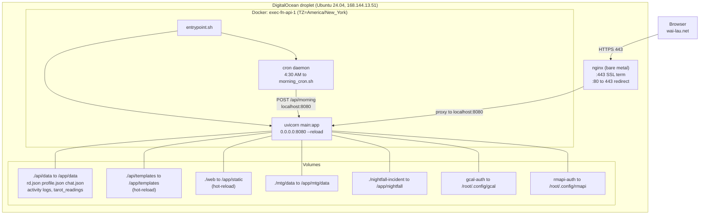
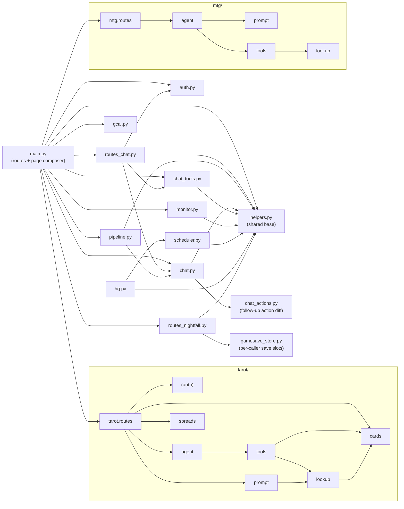
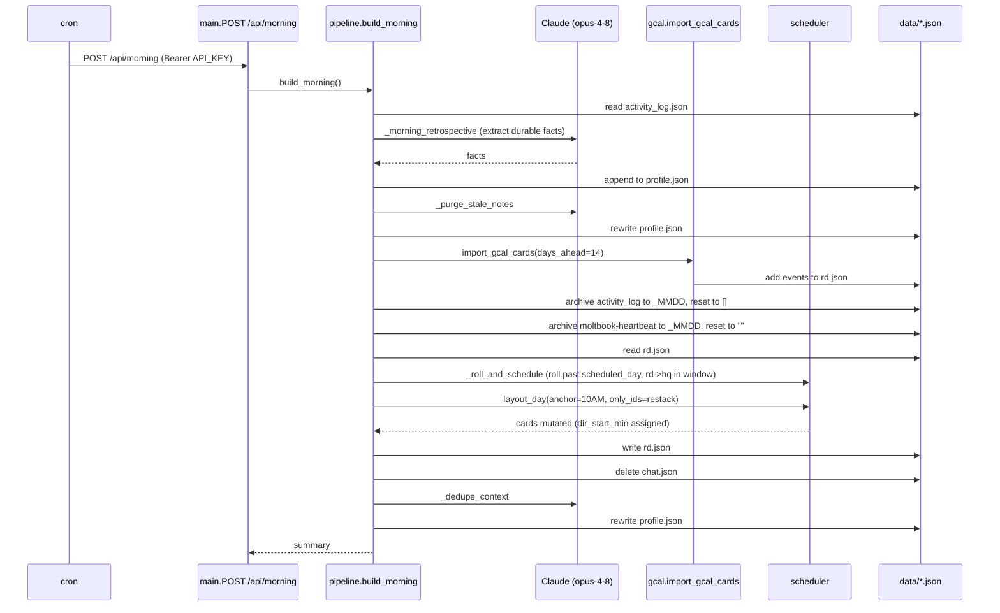
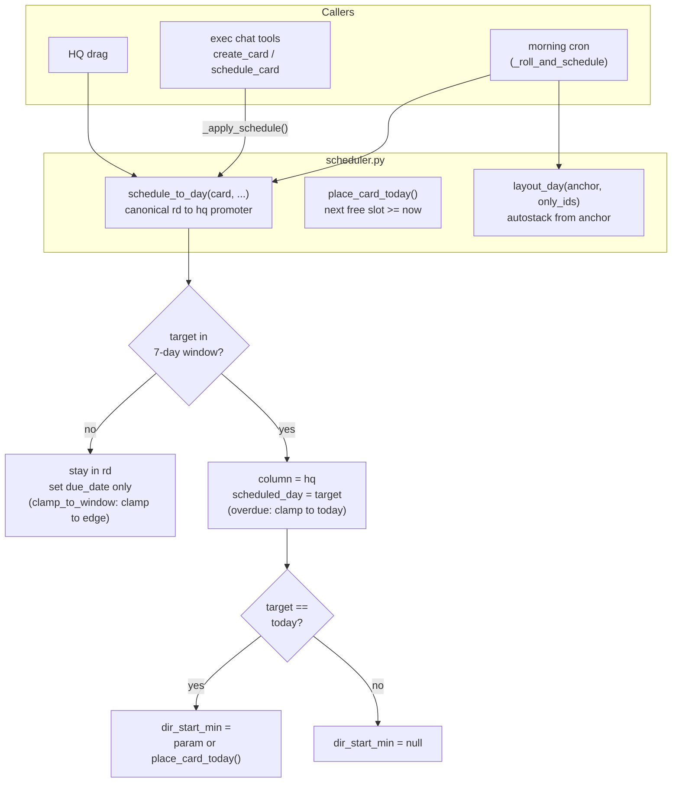
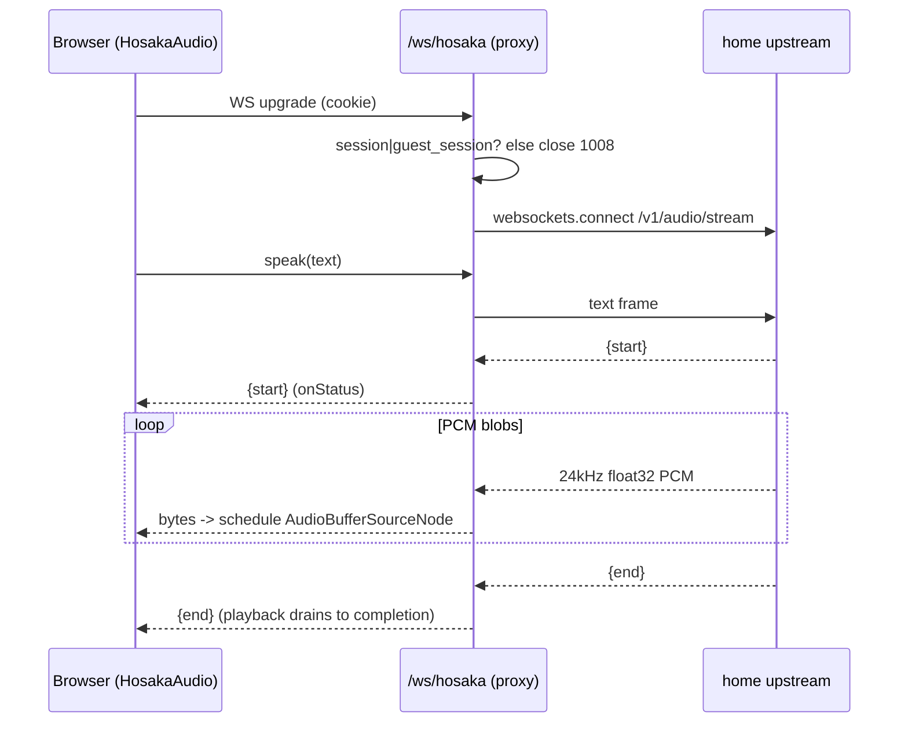
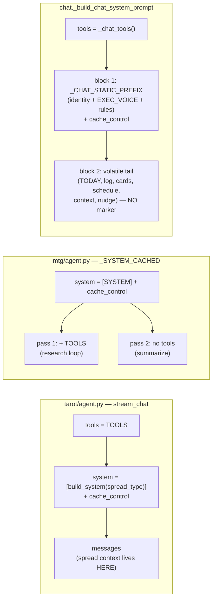
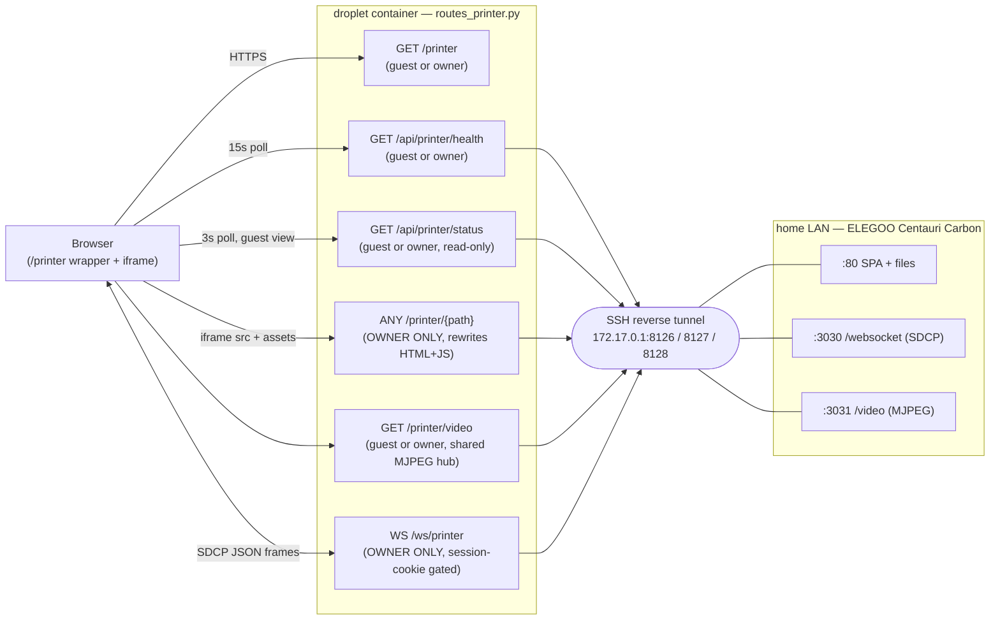
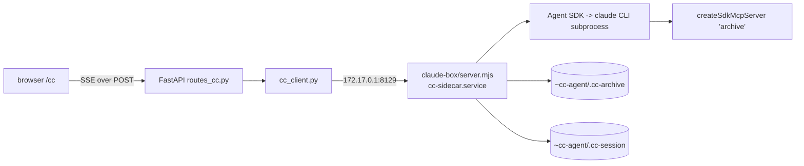

# exec-fn — Architecture (UML, Mermaid)

Generated from source (`api/*.py`, `docker-compose.yml`, `Dockerfile`,
cron). Five views:

1. [Deployment](#1-deployment) — how a request reaches code
2. [Module graph](#2-module-graph) — what imports what
3. [Morning pipeline + scheduling](#3-morning-pipeline--scheduling) — how
   cards move through time
4. [TTS subsystem](#4-tts-text-to-speech) — how every voice reaches the
   browser
5. [LLM call sites + prompt caching](#5-llm-call-sites--prompt-caching) —
   every Claude request and which prefixes are cached

---

## 1. Deployment

nginx (bare metal) terminates SSL, proxies to a single Docker container
running cron + uvicorn. Persistent state is JSON files on a bind-mounted
volume.


```mermaid
flowchart TB
  browser["Browser<br/>wai-lau.net"]

  subgraph droplet["DigitalOcean droplet (Ubuntu 24.04, 168.144.13.51)"]
    nginx["nginx (bare metal)<br/>:443 SSL term<br/>:80 to 443 redirect"]

    subgraph container["Docker: exec-fn-api-1 (TZ=America/New_York)"]
      direction TB
      entry["entrypoint.sh"]
      cron["cron daemon<br/>4:30 AM to morning_cron.sh"]
      uvicorn["uvicorn main:app<br/>0.0.0.0:8080 --reload"]
      entry --> cron
      entry --> uvicorn
      cron -->|"POST /api/morning<br/>localhost:8080"| uvicorn
    end

    subgraph vols["Volumes"]
      data["./api/data to /app/data<br/>rd.json profile.json chat.json<br/>activity logs, tarot_readings"]
      tmpl["./api/templates to /app/templates<br/>(hot-reload)"]
      web["./web to /app/static<br/>(hot-reload)"]
      mtgd["./mtg/data to /app/mtg/data"]
      night["./nightfall-incident to /app/nightfall"]
      gcal["gcal-auth to /root/.config/gcal"]
      rmapi["rmapi-auth to /root/.config/rmapi"]
    end

    uvicorn --- data
    uvicorn --- tmpl
    uvicorn --- web
    uvicorn --- mtgd
    uvicorn --- night
    uvicorn --- gcal
    uvicorn --- rmapi
  end

  browser -->|HTTPS 443| nginx
  nginx -->|"proxy to localhost:8080"| uvicorn
```

**Port chain:** `nginx :443 (SSL) -> localhost:8080 -> container:8080 (uvicorn)`

**Image:** `python:3.12-slim`; rmapi Go binary pre-built from
`golang:1.24-alpine`. No `EXPOSE`; port bound at compose level only.

**Secrets** (`.env`): `API_KEY`, `ANTHROPIC_API_KEY`, `TURNSTILE_SITE_KEY`,
`TURNSTILE_SECRET` (the guest gate is a Cloudflare Turnstile challenge, not a
shared key — `GUEST_KEY` retired).
cron reads them via `/run/cron_env`.

---

## 2. Module graph

Intra-project imports only (stdlib / fastapi / anthropic omitted).
`main.py` is the composition root; `helpers.py` is the shared base
(10 inbound edges). Two self-contained subsystems: `tarot/*` and `mtg/*`.


```mermaid
flowchart LR
  main["main.py<br/>(routes + page composer)"]
  auth["auth.py"]
  helpers["helpers.py<br/>(shared base)"]
  pipeline["pipeline.py"]
  scheduler["scheduler.py"]
  monitor["monitor.py"]
  hq["hq.py"]
  chat["chat.py"]
  chat_tools["chat_tools.py"]
  chat_actions["chat_actions.py<br/>(follow-up action diff)"]
  routes_chat["routes_chat.py"]
  routes_night["routes_nightfall.py"]
  gamesave["gamesave_store.py<br/>(per-caller save slots)"]
  gcal["gcal.py"]

  main --> pipeline
  main --> gcal
  main --> chat
  main --> chat_tools
  main --> helpers
  main --> routes_night
  main --> routes_chat
  main --> monitor
  main --> auth
  main --> mtgr["mtg.routes"]
  main --> tarr["tarot.routes"]

  routes_night --> gamesave
  routes_chat --> auth
  routes_chat --> chat
  routes_chat --> chat_tools
  routes_chat --> helpers

  pipeline --> helpers
  pipeline --> chat
  chat --> helpers
  chat --> chat_actions
  chat_tools --> helpers
  monitor --> helpers
  scheduler --> helpers
  hq --> helpers
  hq --> scheduler
  routes_night --> helpers

  subgraph tarot["tarot/"]
    tarr --> tauth["(auth)"]
    tarr --> tag["agent"]
    tarr --> tcards["cards"]
    tarr --> tprompt["prompt"]
    tarr --> tspreads["spreads"]
    tag --> ttools["tools"]
    ttools --> tcards
    ttools --> tlookup["lookup"]
    tprompt --> tlookup
    tlookup --> tcards
  end

  subgraph mtg["mtg/"]
    mtgr --> mag["agent"]
    mag --> mprompt["prompt"]
    mag --> mtools["tools"]
    mtools --> mlookup["lookup"]
  end
```

Note: `scheduler.py` is reached at runtime from `chat_tools` and
`pipeline` via `__import__`/late import, so it has no static import edge
from them — the runtime call path is shown in view 3.

---

## 3. Morning pipeline + scheduling

### 3a. Morning cron sequence

`POST /api/morning` (4:30 AM ET) runs `build_morning()` in `pipeline.py`.


```mermaid
sequenceDiagram
  participant cron
  participant API as main.POST /api/morning
  participant P as pipeline.build_morning
  participant LLM as Claude (opus-4-8)
  participant GC as gcal.import_gcal_cards
  participant S as scheduler
  participant FS as data/*.json

  cron->>API: POST /api/morning (Bearer API_KEY)
  API->>P: build_morning()
  P->>FS: read activity_log.json
  P->>LLM: _morning_retrospective (extract durable facts)
  LLM-->>P: facts
  P->>FS: append to profile.json
  P->>LLM: _purge_stale_notes
  P->>FS: rewrite profile.json
  P->>GC: import_gcal_cards(days_ahead=14)
  GC->>FS: add events to rd.json
  P->>FS: archive activity_log to _MMDD, reset to []
  P->>FS: archive moltbook-heartbeat to _MMDD, reset to ""
  P->>FS: read rd.json
  P->>S: _roll_and_schedule (roll past scheduled_day, rd->hq in window)
  P->>S: layout_day(anchor=10AM, only_ids=restack)
  S-->>P: cards mutated (dir_start_min assigned)
  P->>FS: write rd.json
  P->>FS: delete chat.json
  P->>LLM: _dedupe_context
  P->>FS: rewrite profile.json
  P-->>API: summary
```

### rd.json concurrency — `helpers._RD_LOCK`

rd.json writers run on genuinely parallel OS threads: the nudge loop's scans
(`asyncio.to_thread`), chat-tool dispatch (`routes_chat` → `to_thread`),
sync-`def` routes on Starlette's thread pool (gcal import), and the event loop
itself (`PATCH /api/rd`). Three guards in `helpers.py` make that safe:

- **`_RD_LOCK`** (`threading.RLock`) — every read-modify-write cycle holds it
  around the WHOLE load→mutate→save sequence (`with _RD_LOCK:`), so one
  thread's save can never silently drop another's changes. LLM/network calls
  are NEVER made under the lock — callers release, call the model, then
  re-lock + reload + apply (`_fire_nudge`, `_build_graph`, `_run_triage`,
  `api_rd_recalc`, `_tool_decompose_task`, `import_gcal_cards`).
- **`_load_rd()` returns a private deep copy** — the `_load_json` mtime cache
  holds one shared object; handing it out mutable would leak one thread's
  in-progress edits into another's snapshot.
- **`_save_rd()` is an atomic replace** (tmp + rename), so a concurrent
  reader never sees a truncated file.

Single-process invariant: uvicorn runs ONE worker (`--reload`), so a
process-wide lock is sufficient; nothing outside the container writes rd.json.
Read-only loads (`monitor`, `get_week_data`, scans) don't take the lock — the
deep copy + atomic replace make unlocked reads safe.

### 3b. scheduler.py — the time model

All `dir_start_min` / `scheduled_day` logic lives here. Window =
`SCHED_WINDOW_DAYS=6` (today + 6 = 7-day span).


```mermaid
flowchart TB
  subgraph entry["Callers"]
    morning["morning cron<br/>(_roll_and_schedule)"]
    execchat["exec chat tools<br/>create_card / schedule_card"]
    hq["HQ drag"]
  end

  subgraph sched["scheduler.py"]
    s2d["schedule_to_day(card, ...)<br/>canonical rd to hq promoter"]
    place["place_card_today()<br/>next free slot >= now"]
    layout["layout_day(anchor, only_ids)<br/>autostack from anchor"]
  end

  morning --> s2d
  morning --> layout
  execchat -->|"_apply_schedule()"| s2d
  hq --> s2d

  s2d --> decide{"target in<br/>7-day window?"}
  decide -->|"no"| outwin["stay in rd<br/>set due_date only<br/>(clamp_to_window: clamp to edge)"]
  decide -->|"yes"| inwin["column = hq<br/>scheduled_day = target<br/>(overdue: clamp to today)"]
  inwin --> istoday{"target ==<br/>today?"}
  istoday -->|"yes"| setmin["dir_start_min =<br/>param or place_card_today()"]
  istoday -->|"no"| clearmin["dir_start_min = null"]
```

**rd to hq promotion** (`schedule_to_day`): a card moves out of the `rd`
column into `hq` only when its target day falls inside the 7-day window.
`dir_start_min` (timeline position) is set only when the target is today —
either an explicit value or the next free slot from `place_card_today()`.
Outside the window the card stays in `rd` with just a `due_date`.

**Exec chat call chain:**
`POST /api/chat -> routes_chat._handle_tool -> chat_tools._TOOL_HANDLERS[name]`
`-> _apply_schedule -> scheduler.schedule_to_day`.

---

## 4. TTS (text-to-speech)

Every voice in the app — the `/hosaka` SPEAK page, the `/tarot` reader
narration, and the Exec bubble — streams from a **single home GPU box**
through a **same-origin reverse proxy**. No TTS models run on the droplet;
the container only proxies. The browser always talks same-origin, so the
session/guest cookie carries auth on the WebSocket handshake (HTTP basic
auth does not ride a WS upgrade reliably on mobile).

### 4a. Topology

The model server (Kokoro / Chatterbox / Piper) runs on Wai's home box and
is reached only over an SSH reverse tunnel bound to the Docker bridge
gateway (`TTS_UPSTREAM`, default `172.17.0.1:8123`). `tts-box/` (systemd
user service + port watchdog, installed on the home box) keeps that
upstream alive.


```mermaid
flowchart LR
  browser["Browser<br/>(/hosaka · /tarot · Exec bubble)"]

  subgraph droplet["droplet container — routes_tts.py"]
    page["GET /hosaka<br/>(guest_protected)"]
    voices["GET /api/hosaka/voices<br/>GET /api/hosaka/health<br/>(guest_protected)"]
    ws["WS /ws/hosaka<br/>(public route, cookie-gated)"]
  end

  tunnel(["SSH reverse tunnel<br/>172.17.0.1:8123"])

  subgraph home["home GPU box (RTX) — tts-box keepalive"]
    upstream["TTS upstream<br/>WS /v1/audio/stream<br/>GET /v1/voices<br/>Kokoro · Chatterbox · Piper"]
  end

  browser -->|HTTPS page load| page
  browser -->|"GET (httpx proxy)"| voices
  browser <-->|"WS audio (bidi pump)"| ws
  voices -->|http| tunnel
  ws -->|"websockets.connect"| tunnel
  tunnel --- upstream
```

`_pump_to_upstream` / `_pump_to_client` shuttle text + binary frames both
directions; `/api/hosaka/health` probes the upstream for a *real* response
(the reverse-tunnel listener stays bound on the droplet even when the model
server is down — a bound port is **not** liveness), letting `/hosaka` show
"TTS server offline" before SPEAK.

**Every utterance ends in a terminal frame** — the proxy guarantees it even
when the backend doesn't. An utterance normally ends with the upstream's own
`{"type":"end"}` / `{"type":"error"}`, which clears `busy[url]`; if the
upstream stream instead just *ends* (home box crashed, tunnel dropped, GPU
server restarted mid-sentence) `_pump_to_client`'s `finally` synthesizes
`{"type":"error","detail":"tts upstream closed mid-utterance"}` and evicts the
dead connection so the next utterance reconnects. This is load-bearing for
`/tarot`: the reader's typewriter paces off the audio clock and waits on a
terminal frame, so a silently-dead upstream left the reveal spinning forever
with the text stuck part-revealed. The guard is the pure predicate
`tts_routing.died_mid_utterance` (unit-tested — `routes_tts` can't be imported
by the dev venv), which fires **only** for the live connection on that `url`:
a stale socket `_ws_dispatch` deliberately cut to start a new utterance is
superseded, and its error would abort the utterance that replaced it.

Client-side belts for the same failure, since a frame can also be lost between
browser and droplet: `hosaka-audio.js`'s `ws.onclose` delivers a synthetic
`{type:"error"}` to the in-flight utterance (guarded on the socket still being
the live one), and `tarot-stream.js`'s stall watchdog caps `elapsed()` at the
buffered duration in its progress signal — the raw `el + dur` never stopped
rising (the ctx clock keeps running after the buffer drains), so the watchdog
could never fire on a dead stream.

### 4b. Auth — now guest-or-full

`/hosaka` and `/api/hosaka/*` moved from the full-auth `protected` router to
**`guest_protected`** — a guest session now reaches the SPEAK page. The WS
`/ws/hosaka` is declared on the `public` router but rejects (close `1008`)
unless a `session` **or** `guest_session` cookie matches before `accept()`.
The guest tier is what lets the `/tarot` reader voice work for guests.

| Endpoint | Router | Reachable by |
|----------|--------|--------------|
| `GET /hosaka` | `guest_protected` | full + guest (nav renders guest-tier for non-admins) |
| `GET /api/hosaka/voices`, `/health` | `guest_protected` | full + guest |
| `WS /ws/hosaka` | `public` + cookie check | full + guest (else `1008`) |

### 4b-ii. GPU-mode owner control

`GET /api/hosaka/mode` and `POST /api/hosaka/mode` sit on the **`protected`**
router (owner-only -- guests must never flip the GPU). They proxy the home-box
`gpu-mode` service over the SSH tunnel at `172.17.0.1:8124` (env:
`GPU_MODE_UPSTREAM`, default `172.17.0.1:8124`) using `Authorization: Bearer
$GPU_MODE_TOKEN` (the token must match the value on the home box;
provisioned in the droplet `.env` -- operator step). The GET returns the
current mode; the POST body `{"action": "homo"|"emo"|"idle", "force"?: bool}`
transitions it.
`emo` and `idle` stop hosaka-server and therefore disconnect active remote
users; the route confirms against `_audio_conns` (the live `/ws/hosaka` audio
socket set in `routes_tts.py` — the real listeners, incl. /tarot narration and
Exec voice, not just `/hosaka`-page `_presence`) and returns `409` if any users
are connected and the caller has not sent `{"force": true}`. `homo` never needs
confirmation.

**The reported mode is corrected against reality.** `/mode` reports the box's
*intent*, and that outlives the truth: when hosaka-server dies or wedges the
box goes on answering `homo` while nothing synthesizes, and the strip lights
the homo segment over a dead backend. `_current_mode()` probes `/mode` and TTS
liveness concurrently and passes both to the pure
`gpu_mode_client.effective_mode`, which reports `idle` for a claimed `homo`
whose TTS is not answering. Only `homo` is second-guessed — under `emo`/`idle`
a failing probe is the *expected* state, not a contradiction, and `gone` (box
unreachable) already says everything. Liveness is the same `_live()` rule the
health route uses: only a real `/v1/voices` response, never a bound tunnel
port. A `homo` switch sets a 90s grace (`_HOMO_GRACE_S`) during which liveness
is assumed, because the box has to load models before `/v1/voices` answers and
the next poll would otherwise read "homo but no TTS" and flip the strip to
idle and back.

**Mode changes reach open pages two ways.** A POST here pushes instantly to
`_mode_subscribers`. Everything else — a switch made at the home box, a
watchdog restart, hosaka-server dying under a mode still claiming homo — never
touches that queue, so `/api/hosaka/mode/stream`'s keepalive tick doubles as a
poll of the real mode (`_MODE_POLL_S`, 15s) and emits on change. This is what
fixes drift for pages that are already open; `gpu-mode.js`'s recheck-on-load
and refresh-on-refocus only ever covered pages that got touched, and its own
comment said so ("No interval -- a long-open foreground tab drifts until
touched"). An unchanged poll falls through to a `: keepalive` comment, so an
idle stream still costs one line per tick.

Both `/hosaka` and `/emet` render the same `emo | idle | homo` segmented
control (shared `web/gpu-mode.{js,css}`, keyed on `#gpu-mode`) for owners only.
If the proxy call to the home service fails (tunnel down, service not running),
the mode is reported as `gone` (an exec-fn label; the home service itself never
returns `gone`).

`GET /api/hosaka/mode/stream` is an owner-only SSE fan-out (`_mode_subscribers`
in `routes_tts.py`): a successful `POST` broadcasts the new mode to every
subscriber, so the control **live-syncs across pages** — flipping it on
`/hosaka` updates the strip on an open `/emet` (and vice-versa) with no reload.
The stream pushes only on an actual switch; each page seeds its initial state
from `GET /api/hosaka/mode` on load.

| Endpoint | Router | Reachable by |
|----------|--------|--------------|
| `GET /api/hosaka/mode` | `protected` | owner only |
| `POST /api/hosaka/mode` | `protected` | owner only |
| `GET /api/hosaka/mode/stream` | `protected` | owner only |

### 4c. Three consumers of one audio core

All three share `web/hosaka-audio.js` (`HosakaAudio.createPlayer()`) — it
owns the `AudioContext`, the iOS unlock dance, the `/ws/hosaka` socket, and
playback of streamed **24 kHz float32 PCM** via scheduled
`AudioBufferSourceNode`s. The upstream emits only `{start}` / coarse PCM
blobs / `{end}` (no per-word timestamps), so any visual syncs to the
*measured* audio duration.

| Surface | Script | Voice | Backend |
|---------|--------|-------|---------|
| `/hosaka` SPEAK UI | `tts.js` | `charlie` (default) + full voice list | chatterbox + RVC |
| `/tarot` reader | `tarot-voice.js` | `af_nicole` | kokoro |
| Exec bubble | `exec-voice.js` / `exec-voice-listener.js` | `glados` | piper |

The `/tarot` reader paces its typewriter to the audio clock (holds text
until audio starts, then reveals on a `charWeight` schedule normalized to
the measured duration); on any audio failure it bails to a guessed-pace
typewriter and logs a sys note. Exec is fire-and-forget (no typewriter).

### 4d. One utterance


```mermaid
sequenceDiagram
  participant B as Browser (HosakaAudio)
  participant WS as /ws/hosaka (proxy)
  participant U as home upstream

  B->>WS: WS upgrade (cookie)
  WS->>WS: session|guest_session? else close 1008
  WS->>U: websockets.connect /v1/audio/stream
  B->>WS: speak(text)
  WS->>U: text frame
  U-->>WS: {start}
  WS-->>B: {start} (onStatus)
  loop PCM blobs
    U-->>WS: 24kHz float32 PCM
    WS-->>B: bytes -> schedule AudioBufferSourceNode
  end
  U-->>WS: {end}
  WS-->>B: {end} (playback drains to completion)
```

---

## 5. LLM call sites + prompt caching

Every Claude call goes through the `anthropic` SDK with a pay-per-token
`ANTHROPIC_API_KEY` (no subscription). Where a large, byte-stable system
prefix is **reused across turns**, a `cache_control: {type: ephemeral}`
marker (5-min TTL) lets repeat requests read that prefix at ~0.1x instead
of full price.

### The one invariant

Render order is `tools -> system -> messages`. A marker on the **last
system block** caches `tools + system` together as the prefix. Caching is
a pure prefix match: any byte that changes inside the cached span (a
timestamp, per-request card data) invalidates everything after it. So the
static text must physically precede the volatile text, and the marker sits
at the end of the static part. **Opus min cacheable prefix = 4096 tokens**
— a shorter prefix silently caches nothing (`cache_creation_input_tokens`
stays 0), so anything under that is left uncached.

### Cached sites


```mermaid
flowchart LR
  subgraph tarot["tarot/agent.py — stream_chat"]
    tsys["system = [build_system(spread_type)]<br/>+ cache_control"]
    ttools["tools = TOOLS"]
    tmsg["messages<br/>(spread context lives HERE)"]
    ttools --> tsys --> tmsg
  end

  subgraph mtg["mtg/agent.py — _SYSTEM_CACHED"]
    msys["system = [SYSTEM] + cache_control"]
    p1["pass 1: + TOOLS<br/>(research loop)"]
    p2["pass 2: no tools<br/>(summarize)"]
    msys --> p1
    msys --> p2
  end

  subgraph exec["chat._build_chat_system_prompt"]
    estatic["block 1: _CHAT_STATIC_PREFIX<br/>(identity + EXEC_VOICE + rules)<br/>+ cache_control"]
    evol["block 2: volatile tail<br/>(TODAY, log, cards, schedule,<br/>context, nudge) — NO marker"]
    etools["tools = _chat_tools()"]
    etools --> estatic --> evol
  end
```

| Call site | Model | Cached prefix | Tokens | Reuse pattern |
|-----------|-------|---------------|-------:|---------------|
| `tarot/agent.py` `stream_chat` | opus-4-8 | `build_system(spread_type)` + `TOOLS` | ~8.7K / ~13.4K | every turn of a reading |
| `mtg/agent.py` pass 1 | opus-4-8 | `SYSTEM` + `TOOLS` | ~6.6K | across research tool-loop iterations + cross-question |
| `mtg/agent.py` pass 2 | opus-4-8 | `SYSTEM` (no tools) | ~5.9K | cross-question only (separate prefix from pass 1) |
| `routes_chat` `/api/chat` + `_stream_tool_followup` | opus-4-8 | `_CHAT_STATIC_PREFIX` + `_chat_tools()` | ~5.2K | every exec turn; follow-up reads what the main turn wrote |

**Exec restructure:** the tools alone (~3.5K) are under 4096, so the static
text is what lifts the prefix over the floor. `_build_chat_system_prompt`
returns a **two-block** system list — a marked static block (identity +
`EXEC_VOICE` + global rules) and an unmarked volatile tail. `TODAY` was at
the top of the old single-string prompt and silently invalidated the cache
every request; it now lives in the volatile tail. Both `routes_chat` call
sites build the identical static block.

**Follow-up action diff:** after a tool round, the follow-up turn rebuilds the
system prompt — so its board lists now include any card the turn just created.
`_build_chat_system_prompt(stage, actions=…)` appends an **ACTIONS YOU JUST
TOOK** block (rendered by `chat_actions._actions_taken_block` from the dispatched
`{name, input, result}` list) to the **volatile tail**, so the model reads the
refreshed board as the result of its own action rather than reporting a phantom
duplicate. Marked only in the volatile tail → the cached static prefix stays
byte-stable. Threaded through both follow-up paths (`routes_chat._dispatch_tools`
collects the actions; `discord_bot.exec_reply` rebuilds `system2` with them).

**Tool rounds are a bounded LOOP, not one shot** (`_MAX_TOOL_ROUNDS` = 3, in both
`routes_chat` and `discord_bot`). The follow-up turn is handed the tools, so it
can answer a tool result by calling another tool — an exile right after a create.
Both paths used to keep only the follow-up's TEXT: any `tool_use` it emitted was
dropped on the floor, never dispatched and never stored, so Exec could announce
an action ("I'll exile the duplicate") that provably never happened — observed
2026-09-02, with `rd.json` holding one card and the activity log holding no
exile. `chat_store.assistant_content_blocks` is the shared helper that preserves
text + `tool_use` from an API message; each round dispatches the pending turn's
tool_use blocks, appends the results, and streams the next turn with a REBUILT
action diff (cumulative across rounds). A stream that dies mid-follow-up keeps
whatever text arrived and ends the loop.

**Activity-log entries carry the card `id`** (`_log_entries_for_patch`:
created/moved/updated/deleted, plus `revived`), and `_build_chat_system_prompt`
renders it as a trailing `[id:…]` on each log line. One `create_card` WITH a
due_date emits both a `created` and an `updated` entry — by title alone that
reads as two cards, which is what produced the phantom "there was already one in
the pool from earlier this turn". The actions block says so explicitly: entries
sharing an id are one card. Legacy entries with no id render unchanged.
Regression properties pinned in `tests/test_exec_tool_rounds.py`.

### Uncached (measured, left alone)

| Call site | Why |
|-----------|-----|
| `monitor.py` | static slice ~1.3K (no tools) < 4096; debounced bursts = low reuse |
| `nudge_llm` `_TONE` | ~1.4K (no tools) < 4096; per-card one-shot |
| `card_llm` classify / parse-date | one-shot per card; no system / ~80-token volatile system |
| `morning.py`, `chat._dedupe_context` | daily one-shot; prompt lives in the user message |
| `gcal._haiku_classify_batch` | no system block; tiny instructions in the user message |

**Verifying:** the response `usage` reports `cache_creation_input_tokens`
(written this request, ~1.25x) and `cache_read_input_tokens` (served from
cache, ~0.1x). First request creates, second identical-prefix request
reads. `cache_read` staying 0 across two identical requests means a silent
invalidator is back in the prefix.

---

## 6. Printer (ELEGOO Centauri Carbon) — owner-only reverse proxy

`/printer` serves the printer's **own** web UI (an Angular SPA with a live
MJPEG camera and SDCP websocket controls) from wai-lau.net, without the SPA
ever knowing it left the LAN. Same-origin everywhere: the browser talks only
to the droplet, so the full `session` cookie rides every sub-request incl.
the websocket handshake, and nothing weaker than the owner reaches a machine
that can heat a nozzle.

Since 2026-08-30 the page also has a **guest tier — read-only, by routing**
(it is linked from the public landing; guests pass Turnstile). The rule is not
"filter what a guest may send", it is "a guest has no route that carries their
bytes to the LAN":

| Route | Owner | Guest | Why |
|-------|-------|-------|-----|
| `GET /printer` | SPA wrapper | camera + stats wrapper | same template, `data-readonly="1"` for guests |
| `ANY /printer/{path}` | full proxy | **401 → admin login** | the SPA, its file endpoints, uploads — every browser→printer HTTP path |
| `WS /ws/printer` | SDCP relay | **1008** | the only browser→printer socket; it drives the machine |
| `GET /printer/video` | ~10fps | ~2fps | one-way read, off the shared hub |
| `GET /api/printer/status` | ✓ | ✓ | one-way read; the printer pushes it unasked |
| `GET /api/printer/health` | ✓ | ✓ | one-way liveness GET |

The two guest-reachable readers are **server-opened singletons**, not relays
of anything a viewer said: `printer_camera.py` holds ONE upstream MJPEG
stream (demuxed to whole JPEG frames, re-muxed per viewer — the printer only
allows ~4 streams, so a public page can't be 1:1) and `printer_status.py`
holds ONE SDCP socket that **sends no frame, ever** — the printer pushes
`sdcp/status/<id>` about once a second on its own, and `public_status()`
whitelists it (no `MainboardID`/`TaskId`/`Filename`).

### 6a. Topology

The printer sits on Wai's home LAN (`192.168.2.25`). Its three ports are
reverse-tunnelled from the home box to the droplet's docker bridge by
`printer-box/printer-tunnel.service` — the hosaka/emet pattern (§4a), with
the `-R` forwards pointing straight at the printer's LAN address (nothing
listens on the home box).


```mermaid
flowchart LR
  browser["Browser<br/>(/printer wrapper + iframe)"]

  subgraph droplet["droplet container — routes_printer.py"]
    page["GET /printer<br/>(guest or owner)"]
    health["GET /api/printer/health<br/>(guest or owner)"]
    status["GET /api/printer/status<br/>(guest or owner, read-only)"]
    http["ANY /printer/{path}<br/>(OWNER ONLY, rewrites HTML+JS)"]
    video["GET /printer/video<br/>(guest or owner, shared MJPEG hub)"]
    ws["WS /ws/printer<br/>(OWNER ONLY, session-cookie gated)"]
  end

  tunnel(["SSH reverse tunnel<br/>172.17.0.1:8126 / 8127 / 8128"])

  subgraph lan["home LAN — ELEGOO Centauri Carbon"]
    p80[":80 SPA + files"]
    p3030[":3030 /websocket (SDCP)"]
    p3031[":3031 /video (MJPEG)"]
  end

  browser -->|HTTPS| page
  browser -->|15s poll| health
  browser -->|iframe src + assets| http
  browser -->|"<img src>"| video
  browser -->|3s poll, guest view| status
  browser <-->|SDCP JSON frames| ws
  health --> tunnel
  status --> tunnel
  http --> tunnel
  video --> tunnel
  ws --> tunnel
  tunnel --- p80
  tunnel --- p3030
  tunnel --- p3031
```

### 6b. Why rewrites, and which

The SPA assumes it is the origin. Served under a path prefix on a different
host over https, four things break; each is patched in flight by the pure
helpers in `printer_proxy.py` (no I/O — unit-tested in
`tests/test_printer_proxy.py` against verbatim slices of firmware V1.4.49):

| Upstream shape | Breaks because | Rewrite |
|----------------|----------------|---------|
| `<base href="/">`, `href="/assets/…"` (index HTML) | assets + Angular routes resolve against the site root | `rewrite_html`: root-absolute `href`/`src` → `/printer/…` (protocol-relative `//` untouched) |
| `` `ws://${this.hostName}:3030/websocket` `` (main.js) | wrong host, wrong port, `ws://` on an https page | `rewrite_js`: → `` `${location.protocol==="https:"?"wss":"ws"}://${location.host}/ws/printer` `` |
| `"http://"+(…VideoUrl)` on the camera `` (25.\<hash\>.js) | mixed content | `rewrite_js`: scheme dropped, the (rewritten) `VideoUrl` used verbatim |
| `` `http://${…hostName}:80` `` (file download href, upload POST) | wrong origin | `rewrite_js`: → `` `${location.origin}/printer` `` |
| `"/assets/images/network/*.png"` string literals in the compiled Angular templates (all bundles) | root-absolute → 404 against the site root (blank icons) | `rewrite_js`: quoted `/assets/` → `/printer/assets/` |
| `"VideoUrl":"192.168.2.25:3031/video"` in the SDCP reply to *enable video stream* (cmd 386) | LAN address | `rewrite_ws_text` on printer→browser text frames → `/printer/video` |
| `</head>` of the index | the SPA's own top bar (logo · language · store link) is noise inside the site shell | `rewrite_html` injects `<link href="/printer-frame.css">` (site-side overrides for the *proxied* document: hides `app-header`); injected after the re-root pass so the absolute href stays |
| `"Thumbnail":"http://192.168.2.25/board-resource/history_image/<task>.png"` (task detail, cmd 321; timelapse `TimeLapseVideoUrl` likewise) | LAN address, bound straight onto `` | `rewrite_ws_text`: any `http://<lan-ip>[:80]/` → `/printer/` (served off the printer's :80 by the proxy; other ports left alone) |

Relative URLs (hashed CSS/JS, webpack lazy chunks with `publicPath ""`,
`assets/i18n/…`, `iconfont.ttf`) resolve against the rewritten base href and
need nothing. **Deliberately not rewritten:** the WebRTC signalling socket
(`ws://<host>:8883`, reached only when the printer advertises
`VIDEO_WEBRTC` — this unit reports FILE_TRANSFER / PRINT_CONTROL /
VIDEO_STREAM only); a regression test pins it as untouched, so wiring it
(a fourth tunnel port + relay) is a conscious change.

Headers are **allowlists** in both directions (`upstream_request_headers` /
`client_response_headers`): the session cookie and admin bearer never reach
the printer; `accept-encoding` is pinned to `identity` so rewritable bodies
arrive uncompressed; `content-length` / `content-encoding` are dropped on
the way back (bodies change) but a request `content-length` is forwarded (a
streamed upload keeps its known length — the printer's tiny HTTP server is
not trusted to speak chunked); every response is stamped
`Cache-Control: private, no-cache` (auth-gated, never a shared-cache
candidate) and `main.py`'s `CacheControlMiddleware` skips the `/printer/`
prefix so its public/immutable stamp for static-looking suffixes never
applies. Conditional requests are answered by the **proxy**, never the
printer: `If-None-Match` is not forwarded, and a rewritten body's ETag is
the printer's tag + `-rw<REWRITE_VERSION>` (bump the constant whenever
`rewrite_html`/`rewrite_js` change), so the hashed bundles still 304 while a
browser copy patched by older rules misses and refetches — otherwise the
printer's unchanged ETag would 304 a stale rewrite back into service; only a
root-relative `Location` survives, re-rooted under the prefix — an absolute
or protocol-relative redirect target is dropped rather than sent to the
owner's browser.

### 6c. Runtime shape

- **`/printer/{path}`** streams every non-HTML/JS body straight through in
  BOTH directions (`StreamingResponse` over `httpx` `aiter_raw` down; the
  request body as `request.stream()` up, write timeout unbounded so a gcode
  upload runs at whatever the home uplink allows) — nothing is buffered;
  HTML/JS are read whole, rewritten, re-served.
- **`/printer/video`** relays the camera's `multipart/x-mixed-replace` with
  `X-Accel-Buffering: no` (nginx's `location /` buffers by default) and the
  content type excluded from `GZipMiddleware` (gzip would hold frames inside
  zlib). Newer starlette binds the exclusion list as a constructor-kwarg
  default at import time, so `main.py` passes the patched list explicitly
  when the signature accepts it (older starlette keeps reading the module
  global), and the tuple carries both the prefix and `type/*` spellings —
  without that, the MJPEG frames (and the fonts/images the list already
  named) were being gzipped after all. The relay **reconnects instead of
  ending**: the SPA's `` never re-requests a dead MJPEG stream, so when
  the upstream ends or stalls past the 30s read timeout (camera pause,
  tunnel restart) `_video_frames` re-dials with 1→15s backoff and splices
  the fresh stream into the SAME open response (the printer's part boundary
  is constant; a changed boundary ends the response instead). Closing the
  tab cancels the generator wherever it is; its `finally` closes the
  upstream, releasing one of the printer's 4 allowed streams.
- **`/ws/printer`** accepts first, then dials the printer (like
  `/ws/hosaka`) — a browser that vanishes mid-handshake never strands an
  open upstream socket, and a down printer surfaces as a clean `1011` close
  the SPA retries on. Two pump tasks (`_pump_to_client` rewrites text
  frames; `_pump_to_upstream` forwards text + bytes) under
  `asyncio.wait(FIRST_COMPLETED)`; whichever side closes tears down both.
  Declared on the `public` router like `/ws/hosaka` (a router-level
  `Depends` can't gate a websocket the same way) and checks the `session`
  cookie itself with `hmac.compare_digest` — guests are refused (`1008`
  before `accept()`, which the browser sees as a 403 handshake).
- **Liveness** (`/api/printer/health`): the tunnel ports stay bound while the
  printer is off and a connect *accepts then resets* — so only a real HTTP
  answer from the SPA shell counts as online (the `/api/hosaka/health`
  rule), probed with its own fail-fast 2s-connect / 3s timeout. Every
  upstream call has a short connect timeout and degrades to a 503 or a
  closed socket, never a 500.
- **The wrapper** (`templates/printer.html` + `web/printer.{css,js}`): a
  status row over an `<iframe>` of `/printer/network-device-manager/network/control`.
  The iframe isolates the SPA's global antd CSS from chrome.css and scopes
  its `<base href>` to its own document. `printer.js` polls health every 15s
  (+ on tab focus; polls are sequence-numbered so a slow, older answer can
  never overwrite a fresher one) and mounts the iframe only while online;
  offline swaps in a "printer offline" note and sets the frame to
  `about:blank` so the SPA's reconnect loop dies with it. Online again →
  remounts by itself. The page keeps the site's Exec link-bubble; because
  `window` mouse events stop firing once the cursor crosses into a
  cross-document frame, `exec-bubble-drag.js` flags a live mouse drag as
  `html.exec-drag` and `printer.css` drops the iframe's `pointer-events`
  for its duration, so the bubble can be dragged across the SPA.

Verified end-to-end against the live printer with the real app under
uvicorn (auth tiers, rewrites, etag→304, un-gzipped MJPEG, WS relay + the
cmd-386 rewrite, reconnect splice against a fake upstream that drops every
few frames).

| Endpoint | Router | Reachable by |
|----------|--------|--------------|
| `GET /printer`, `GET /api/printer/health` | `protected` | owner only |
| `ANY /printer/{path}`, `GET /printer/video` | `protected` | owner only |
| `WS /ws/printer` | `public` + `session` cookie check | owner only (else `1008`) |

---

## 7. `/cc` — Claude Code in the browser

Owner-only. A general CHAT page over Wai's Claude subscription — **not** a coding agent, and nothing here reaches the exec-fn repo. Summary + the invariants a change must not break live in CLAUDE.md's page table; this section is the mechanism and the incident history.

### 7a. Topology

Claude Code cannot run in the app container (`python:3.12-slim` — no node, no `claude` binary, no credentials), so it runs on the droplet HOST as its own unprivileged user and the container reaches it over the docker bridge at `172.17.0.1:8129`. Same idiom as hosaka/emet/printer minus the SSH tunnel, since it is the same box.


```mermaid
flowchart LR
  B[browser /cc] -->|SSE over POST| API[FastAPI routes_cc.py]
  API --> CL[cc_client.py]
  CL -->|172.17.0.1:8129| SC[claude-box/server.mjs<br/>cc-sidecar.service]
  SC --> SDK[Agent SDK -> claude CLI subprocess]
  SC --> ARCH[(~cc-agent/.cc-archive)]
  SC --> PTR[(~cc-agent/.cc-session)]
  SDK --> MCP[createSdkMcpServer 'archive']
```

Host side is `claude-box/` (`server.mjs` sidecar on the Agent SDK, `cc-sidecar.service`, idempotent `setup.sh`, README). Container side is `cc_client.py` (transport) + `routes_cc.py` (routes), mirroring the `emet_client`/`routes_emet` split.

`/srv/cc-agent` (the sidecar code) is **root-owned** so the agent cannot rewrite the server that constrains it.

**Auth is `cc-agent`'s OWN subscription login** (`sudo -u cc-agent -H /usr/bin/claude`, then `/login`) — NOT a copy of wai-root's `~/.claude/.credentials.json`. Two processes sharing one OAuth refresh token race, and the loser (usually the interactive session) is logged out mid-refresh. A logged-out sidecar answers a clean per-request `Not logged in · Please run /login` text frame, so the page degrades rather than 500s.

`MAX_CONCURRENT` 1 + `MemoryMax=700M` is a memory ceiling expressed as a queue depth (~930MB free, each run spawns a CLI subprocess); a second request gets 429, surfaced as "busy".

### 7b. The sandbox — three mechanisms, and they are NOT equally strong

Know which is which before trusting one.

1. **The filesystem is an ALLOWLIST and is solid**: `TemporaryFileSystem=/:ro` + named `BindReadOnlyPaths`/`BindPaths`.

2. **MCP connectors are an ALLOWLIST and are solid**: `strictMcpConfig: true` + `mcpServers` naming only the in-process `archive` server = "only the servers named here". (It was `mcpServers: {}` — literally none — until the archive tools landed 2026-09-11; the allowlist property is what carried over, not the emptiness.)

   **This was the 2026-09-10 session's worst finding.** Signing cc-agent into claude.ai attached that ACCOUNT's connectors — a probe found Gmail, Google Calendar and Google Drive all `"connected"`, exposing `send_message`, `trash_thread`, `share_file`, `download_file_content` and `delete_event` through a public-internet page behind one cookie. They are server-side capability riding the OAuth identity, so the mount namespace, `settingSources: []` and a built-in-tool blocklist ALL missed them completely. **Any subscription login inherits whatever connectors the account has** — re-probe after enabling a new one.

3. **Tools are a DENYLIST with no backstop** — `disallowedTools`, listing every name. This is the weak one, and it is weak by necessity: **`canUseTool` does NOT gate harness tools.** Measured 2026-09-10 with a deny-everything callback and `ToolSearch`/`CronList` left visible: both EXECUTED (`CronList` returned "No scheduled jobs") and the callback was never invoked once. So do not describe `canUseTool` as the gate — it is `ALLOWED_TOOLS = []`, and it covers less than it looks like it does. The list must therefore name the harness tools too (`CronCreate`/`CronDelete`/`Workflow`/`RemoteTrigger`/`PushNotification`/`SendMessage`/`ScheduleWakeup`/`ToolSearch`/`Skill`/…), and **an SDK upgrade that adds a new tool arrives unblocked**.

   > After any `@anthropic-ai/claude-agent-sdk` bump, re-run the init probe and confirm `TOOL COUNT: 0` before trusting it.

**Why the blast radius stays small anyway:** with no `Read` there is no local untrusted content to inject THROUGH, and with no `Bash`/`Write` an injected instruction reaches nothing it could act on. That is most of why a chat page is a far smaller target than the coding agent this started as, even with the web tools on.

### 7c. Tools — what is granted, and the deliberate widening

It runs with **five tools and one MCP server, all of them ours** — `WebSearch`, `WebFetch`, and the three `mcp__archive__*` tools, the only names in `ALLOWED_TOOLS` — plus an explicit `systemPrompt` replacing Claude Code's coding-CLI preset, and `cwd` on an empty confined dir.

The web tools were added 2026-09-11 after the page answered "search news" with its training cutoff, which is broken behaviour for a chat assistant; the system prompt now tells it to search first and never cite its cutoff on a dated question.

**This is a deliberate widening of the sandbox, not an oversight.** `WebFetch` is a real exfiltration channel — a fetched page is untrusted text that can try to steer the model into putting conversation content into a follow-up URL — and Wai enabled it weighing exactly that.

Tool lines render on the page via `summarize()` in `cc.js`, which puts `query`/`url` FIRST (WebSearch has none of the older keys and fell through to a raw JSON dump; WebFetch's `prompt` is the instruction to the fetcher, not the thing fetched).

### 7d. The archive is three tools, not a filesystem

`claude-box/archive-tools.mjs` (2026-09-11): `list_conversations`, `search_conversations`, `read_conversation`, served by an in-process `createSdkMcpServer` named `archive` — the ONE entry in `mcpServers`, so `strictMcpConfig` still drops the account's claude.ai connectors.

Asked whether it could read its own archived conversations, the page answered "no filesystem, no history store here" — true and useless, since `/new` had been writing every one of them to `~cc-agent/.cc-archive/`. **Granting `Read` would have been the lazy fix and the wrong one**: `Read` is a filesystem, and a filesystem is every file the unit can see.

Containment is enforced TWICE per call — the id must match `^[A-Za-z0-9_:-]+$` (no separators, no dots, so `..` cannot be spelled) AND the resolved path must still sit under the archive root. The second check is what survives a future edit to the first. `transcriptPath` is exported for exactly that test — verified refusing `../../etc/passwd`, `..`, `a/../../b`, `/etc/passwd`, `x/../..`, `../.cc-session`, `..%2f..`.

Reads come back in 40K-char slices with a `from=` offset to continue. The system prompt tells it to search the archive rather than claim it has no memory.

### 7e. The persona is two halves

`SYSTEM_PROMPT` in `server.mjs` (the operating rules — no tools, no repo, and the SVG-drawing affordance) plus **`claude-box/cc-context.md`**, appended by `buildSystemPrompt()` — who Wai is, her ADHD calibration (inattentive, high-masking, so generic ADHD advice misses and the answer has to name the smallest concrete first action), and caveman-ultra delivery.

It is read **per run**, so an edit lands with no restart — but it reads `/srv/cc-agent/cc-context.md`. **Editing the repo copy alone changes nothing**; reinstall it:

```bash
sudo install -o root -g cc-agent -m 0640 claude-box/cc-context.md /srv/cc-agent/
```

Root-owned like the rest of the sidecar so the agent cannot rewrite its own instructions, and byte-stable across turns so the prefix caches. It deliberately carries NO repo/project detail — with no tools and no filesystem that would be tokens every turn buying nothing — and the personal detail it does carry is safe only while /cc stays owner-only.

Testing a prompt change appends to the ONE live conversation: park `/home/cc-agent/.cc-session` first, restore after.

### 7f. One continuing conversation — the SIDECAR owns the pointer

A pointer file (`~cc-agent/.cc-session`) holding the current session id, not a JS variable on the page. It used to be the latter, so every page load silently began a new conversation: five sessions came out of a handful of messages. Server-side means the thread also survives a phone locking and a move between devices, which no browser-side value can.

The page never sends a session id; `GET /api/cc/history` replays the thread on load. Because the pointer IS the thread, resuming is a one-line change on the server — nothing is copied and nothing is lost.

**Clearing ARCHIVES first.** `/new` writes the whole conversation to `~cc-agent/.cc-archive/<ISO-stamp>__<session-id>/conversation.txt` before dropping the pointer, and **a failed archive ABORTS the clear** (the page says so and keeps the thread) — a clear that loses the transcript is the one outcome worth failing loudly for.

Format is fixed and parseable, not pretty-printed: a `key: value` header, a blank line, then one block per message opening `[NNNN] SPEAKER ISO8601Z`. The index is zero-padded so lexical order IS chronological order, the speaker is a bare uppercase word, and timestamps are always UTC with a `Z` — nothing varies with locale, timezone or terminal width. Pasted images are written beside the transcript as `img-<NNNN>-<n>.<ext>`, named from the index that referenced them, with an `images:` line in the block. The dir is `0700` cc-agent, so read it with `sudo`.

`/new` drops the POINTER only — the old transcript stays on disk under `~cc-agent/.claude/projects`, so ending a conversation is never destroying one. Slash-command turns are stored as user messages wrapped in `<command-name>` tags and are filtered out of the replay; an unreadable or vanished session replays as EMPTY rather than erroring, so the page always opens.

### 7g. Commands (`web/cc-commands.js`, `web/cc-sessions.js`)

Split out of `cc.js` at the 500-line cap, and named for what it holds: what a leading slash means before anything is sent.

| Command | What |
|---|---|
| `/new`, `/clear` | Archive the conversation, drop the pointer |
| `/help` | Lists every command — the page's own, so it beats the SDK's "isn't available in this environment" |
| `/list` | The 20 most recent conversations |
| `/listall` | Every one |
| `/back` | The most recently touched conversation that is not the current one — one word instead of listing and aiming |

The list renders **oldest first, so the most recent sits at the BOTTOM**, nearest the composer and where the eye already is, the same way the transcript reads; the sidecar returns newest-first as the canonical order and the page reverses it. `/list` says `[ 20 of 35 — /listall for the rest ]` when it truncates.

Each row carries how long ago it was touched, right-aligned, as `<1m` / `45m` / `2h 20m` / `3d 14h 3m` — minutes are the floor (nothing in this list turns on seconds) and days the ceiling (`3w` makes you do arithmetic to compare it against `9d`); leading and trailing zero units are dropped (`2h`, not `2h 0m`) but an interior zero stays (`3d 0h 5m`) so the columns keep their meaning.

Rows are **tappable, not numbered**: the page is used one-handed, where reading a list and then typing `/resume 3` means the keyboard covers the thing being read from. The list is scoped sidecar-side to this sandbox's `cwd`, so the account's other sessions never appear, and `/resume` re-checks that the id is one of them (plus a uuid-shape test, since the string becomes a filename downstream). Titles prefer the **cached** haiku rolling title over the SDK's summary, read-only — a list of forty rows must not fire forty haiku calls to name itself.

**Some slash commands are the SDK's own and are passed through deliberately** (`CC_SDK_COMMANDS`): `/context`, `/cost`, `/usage`, `/compact`, `/model` — probed 2026-09-11, not assumed. They cost no turn (`turns: 0`) and never reach the model, and `/model <name>` really does switch it. `/help`, `/status` and `/memory` answer "isn't available in this environment"; `/agents` says it was removed.

**`/clear` is deliberately NOT passed through**: the SDK honours it SILENTLY, which would drop the conversation without the archive `/new` writes first, so the page keeps `/clear` as its own alias for `/new`.

Every leading slash now goes through `runCommand` — the old `text.startsWith('/') && !pending.length` meant a command typed with a screenshot attached bypassed the page entirely and went to the SDK verbatim, `/clear` included.

### 7h. The status bar (`web/cc-status.js`)

Carries the same numbers the Claude Code status line shows in a terminal, **in the same shape and the same colours** — read off `~/.claude/statusline-command.sh` rather than approximated.

`#cc-status` is **two rows, metrics first**: line 1 the metrics, line 2 the conversation's title on a full-width hash-coloured band (black text) sitting directly above the transcript it names.

Metrics sit on the page's own black in **five equal columns** (`grid-template-columns: repeat(5, 1fr)`, each value centred in its own fifth):

| Slot | Colour |
|---|---|
| `ctx:N%` | bright white |
| `(base:N%)` | grey `#8a8a8a` |
| `5h:N%` | pink `#ffafaf` |
| its reset | mint `#afffaf` |
| `7d:N%` | cyan `#00cdcd` |

**All five always render, defaulting to 0**: a slot that appears only once it has a value makes the row jump as numbers arrive, and an absent `ctx` reads as broken rather than as "no reply yet". A flex row sized each box to its text, so `9% → 10%` shifted everything after it; on a fixed fifth a value moves only inside its own box and the row reads as a gauge. (All four colours grandfathered into `raw-color-baseline.json` via `--update`, the sanctioned route for a deliberate new colour.)

The title hue is `hash(title) % 360` at 95% / 60% — the shell hashes with md5 and the browser has none (SubtleCrypto is SHA-only), so it uses FNV-1a: same behaviour, different exact hue from the terminal for the same title.

**Every figure is REPORTED, never estimated** — model from the SDK's `init` frame, context from the input side of the last `result` (`input_tokens + cache_read + cache_creation`, forwarded as `ctxTokens` and taken against 1M for a `[1m]` model else 200K), and the 5h/7d windows from `GET /api/cc/limits`.

**That last one is not in the SDK.** `rate_limit_event` is declared in its `.d.ts` but the string appears ZERO times in the shipped `sdk.mjs` (0.3.265), and nothing the CLI writes to disk holds the numbers either. What the CLI actually does — both strings are in its binary — is read `anthropic-ratelimit-unified-*` response headers and call `GET /api/oauth/usage`; that endpoint is the one reachable outside a request, so `claude-box/usage.mjs` asks it with cc-agent's own OAuth access token and returns percentages. **The token never leaves the sidecar** (read there, exchanged for two numbers, never refreshed — two processes on one refresh token race, which is why this account has its own login; an expired token degrades to no numbers). Cached 60s server-side, fetched on load and on `cc:reply-done` rather than polled. The stream's `limits` frame handling stays as a free upgrade path if a future SDK starts emitting it.

`cc.js` hands every SSE frame to `ccStatusOn()` and the bar ignores what it doesn't need.

**`base` is the script's definition, mirrored**: the SMALLEST total input ever observed — system prompt + tools + standing context, the floor a conversation cannot go below — persisted in `localStorage` (`cc.ctxbase`), the analogue of the script's `~/.claude/cache/statusline_baseline_global`. The first turn after a `/new` is the only time it is seen cleanly, which is why it persists rather than being recomputed.

The two rows were merged onto one on 2026-09-11 and split back the same day: on a phone the metrics are a fixed ~330px of the 430 available, so a single row truncated the title to almost nothing. On its own line the band gets the full width and the metric colours survive (white, mint and cyan are illegible on a bright band). The model is no longer shown at all — it is still tracked, since it decides which context window `ctx%` is measured against.

**Positioning, all three learned by failing:**
- Anchored to `top: var(--vvt, 0)`, the VISUAL viewport's offset, not the layout viewport — a soft keyboard shrinks and offsets the visual viewport (iOS standalone also scrolls the document) while a `fixed; top: 0` stays pinned to the layout viewport, which is how the bar ended up above the screen the moment the keyboard opened. `#exec-panel` anchors to the same variable for the same reason, and `#terminal`'s top inset adds it too.
- FIXED and **moved onto `<body>` by cc-status.js** — `_render_page` wraps a non-`full_height` page in a fixed, scrolling `.page-scroll`, and a bar meant to outlast every scroll has no business inside the thing being scrolled (reported as having to scroll up to see it).
- OUTSIDE `#terminal` — the numbers describe the session, not the part of the transcript on screen, so scrolling never takes them away. Its measured height rides in `--cc-status-h` via a `ResizeObserver` (the meta line wraps at narrow widths and the bit webfont re-wraps the title with no resize event, the same reason `--nav-h` and `--cal-h` are observed rather than hard-coded); `#terminal` restates its whole `inset` because chat-doc.css pins it with `!important`.

### 7i. The rolling title — two calls, with a deterministic floor

`api/cc_title.py`, `GET /api/cc/title`. A rolling 3-6 word haiku summary of the conversation.

**The SDK's own `summary` was tried first and is NOT enough**: on a live conversation it is usually just the opening prompt, so the bar showed the first thing typed back, verbatim. The good titles in Wai's terminal come from her own recap hook (`~/.claude/hooks/session-recap-gen.js`), which asks haiku for a 3-6 word rolling title every few prompts — this mirrors it.

**Generation runs in the SIDECAR, on the PLAN** (`claude-box/title-gen.mjs`, `POST /title-gen`, reached by `cc_client.generate_title`). It used to call the Anthropic API with the per-token key, and it is Claude Code's own subscription that should be paying to name a Claude Code conversation. Measured price of that move: **~304MB peak and ~6.9s per call**, since each one spawns a CLI subprocess — so the route is **single-flight AND yields entirely while a chat turn is in flight** (`titleBusy`, separate from `active`: a title must never take the one query slot and 429 Wai's actual message). Both refusals answer `title: null`, which lands in `cc_title` as "keep the cached one".

**The titler runs in its OWN cwd** (`CC_TITLE_SANDBOX`, default `<sandbox>/.titles`, created by the sidecar at startup). A `query()` call files a session transcript in the project dir for its cwd, and `/sessions` lists every session whose cwd is the sandbox — so sharing the sandbox meant each rolling title (writer + judge, twice on a retry) left 2-4 throwaway sessions in the `/list` picker, each summarised by the SDK from the transcript excerpt it carried. `/list` showed "Zekoa physical mitigation" three times seconds apart, none of them a conversation, and **20 of 61 listed sessions were titler scratch** (reported 2026-09-13). A subdir of the sandbox needs no unit change — `/srv/cc-sandbox` is already one of the two writable binds. The 20 existing ones were MOVED to `~cc-agent/.cc-titler-scratch/`, not deleted.

**It is TWO calls, not one**: haiku writes a title, then a second, independent haiku call judges whether it is title *shaped* and returns one sentence of feedback the writer gets ONE retry with. (Two writes plus two judges is already four subprocesses; the feedback loop's whole gain lands on the first retry.) A model grading its own output in the same breath talks itself into whatever it just wrote.

**A deterministic floor runs BEFORE the judge** (`shapeFault`) — word count, trailing punctuation, wrapping quotes, a preamble, generic filler, second person, a verbatim echo of a message. Measuring showed the model judge is not trustworthy alone: on a real transcript it **passed both "Chat Session" and "Sourdough"**, having quietly written its own title and graded that instead. All five bad titles in that test are caught by the floor for free, and the judge then only rules on the part no rule can check — whether the title names what the conversation is actually about.

Two more things measurement forced:
- The proposed title goes **FIRST** in the judge's prompt — trailing it after the transcript is how it lost track of which string it was grading.
- The verdict is read with **regex, not `JSON.parse`** — "reply with JSON only" produced ` ```json ` fences, a one-element ARRAY, and an object followed by a paragraph of prose. **An unreadable verdict PASSES**: a judge that cannot make itself understood must not be able to veto a good title.

The same loop, floor and parser are duplicated in the statusline hook, which cannot import from the sandboxed sidecar — **change one, change the other**.

Cached in `data/cc_titles.json` per session and regenerated every 4 messages (a conversation drifts; a title from message two is wrong by message twenty), weighted to the latest 12 messages at 400 chars each. The SDK's value is the fallback, for a deliberate rename or when generation is unavailable; it never raises, since a bar without a title is fine and a 500 is not.

**The route handler is deliberately not named `cc_title`** — a route function with the module's name rebinds it at module scope, and `cc_title.rolling_title` then resolves against the function object.

Fetched on load and again on every `cc:reply-done`, cached with the rest of the bar's state, and cleared by `/new`. Only when there is no generated title yet — a brand-new conversation — does it fall back to the transcript's opening line, user → assistant, since a conversation that opens with a wordless screenshot has an empty first user message while the reply right under it says what it is about.

With **no** title the band is `hidden` entirely (the rule restates `display: none` for `[hidden]`, the same trap `#cc-thumbs` hit) rather than showing a stand-in — a full-width band of colour saying nothing is the loudest thing on the page. The title is read from the transcript, which arrives asynchronously, so a **`MutationObserver` on `#terminal`** re-renders until there is a first line and then disconnects; without it the bar rendered before `/api/cc/history` had replayed anything and every conversation was titled empty.

### 7j. The page

`templates/cc.html` + `web/cc.{css,js}` is **the /mtg chat UI** — the shared chat stack (see CLAUDE.md § *Chat surfaces*) + marked, rendered like /mtg with NO `full_height` (chat.css owns the layout). `cc.css` is only what an AGENT transcript needs on top (`.msg.tool`/`.msg.out`/`.msg.think`, pasted images, SVG diagrams). `cc.js` reuses mtg.js's contenteditable input, caret mirror, plain-text paste and iOS first-gesture focus.

**Transport differs from every other chat surface**: SSE over POST, so `EventSource` is unusable (GET only) and frames are parsed off a fetch body reader with a streaming `TextDecoder` (a chunk boundary can split a frame mid-UTF-8). The transcript only chases the tail when the reader is already at the bottom.

An assistant bubble is opened up front for the typing dots and **dropped if still empty** when a tool/thinking event arrives, then reopened for later prose — otherwise a tool call landing before any text renders after an empty bubble and the transcript reads out of order.

**`dropIfEmpty()` must be idempotent** (fix landed in `0de197a`, whose message covers only the CRT work). It nulls `div`, and a turn routinely fires several drops in a row — the archive tools list then read, so `tool`, `tool_result`, `tool` — at which point the second call ran `div.remove()` on null and the whole turn died with `null is not an object (evaluating 'div.remove')`, taking the reply that was still streaming behind it. It now returns early when `div` is already gone. Pinned by driving a real two-tool turn in WebKit: 2 tool lines, 1 assistant reply, zero console errors.

**The transcript never narrates itself.** The `[ continuing — /new starts a fresh conversation ]` and `[ ready — … ]` lines are gone, and the turn/time receipt prints only when something happened (more than one turn, or 15s+ — a wait long enough to want explaining).

**That receipt is hung on the END of the reply, not given a row of its own** (`ccAppendReceipt`, 2026-09-13): it is a footnote about the answer, and a `#` sys line under every tool-using turn reads as another thing said. Inline inside the final `<p>` when the reply ends in prose, a trailing element after anything that is not (a code block, a diagram, a list — an inline tail would land INSIDE the `<pre>`), and with no reply to hang it on (a turn that was all tool calls and no text) it falls back to the sys line it used to be. It is STASHED at the `done` frame rather than rendered there: `done` can arrive while the typer is still revealing, and the settle pass rebuilds `innerHTML` from scratch, so anything appended earlier is wiped a moment later.

A sys line is for something Claude DID: a tool call, its output, or a failure. **On load the page states the sidecar's state as a `.msg.sys.warn` line** (`authed:false` → the exact login command): a logged-out sidecar answers every run with `Not logged in · Please run /login`, which reads as a broken page unless something says otherwise — that is exactly how this got reported as down.

No voice OUTPUT on /cc yet — `execVoice` (GLaDOS) is loaded on the page for monitor/nudge lines but deliberately not wired to Claude's replies.

### 7k. Hands-free input (`web/cc-mic.js`)

Wires the browser's own `webkitSpeechRecognition` — tap, talk, and the message sends itself when you stop. The recognizer is **never stopped between turns** (`continuous = true`).

**That is not a preference, it is the only shape iOS allows**: `start()` requires a user gesture and `stop()` does not, so pausing the mic is one-way and a session could never restart itself — re-opening the mic a few hundred ms after a reply is simply denied, which is exactly how the first cut failed. One tap therefore has to cover the whole session.

Speech heard **while a reply is streaming is DROPPED** (`ccMicBusy()` reads cc.js's `streaming`): the results are marked consumed via `ccMicBase` so they can never resurface glued to the next utterance, the composer is cleared, and the prompt dims to `data-drop` — a mic that looks identical whether or not it is keeping what you say is how you end up talking into a bin. `ccMicBase` exists because a continuous `e.results` accumulates every result of the session, so without a floor each utterance would resend the whole conversation.

`cc.js` still fires `cc:reply-done` on `#terminal` at the end of a turn; in a continuous session that only repaints the dot, and it is the fallback path for a browser that ends recognition per utterance anyway (where `onend` retries `start()` and, if refused, ends the session with a visible `[ mic: tap $ to keep talking ]` rather than a prompt that looks armed and is not).

It is a voice SESSION, not one dictation, and it is scoped deliberately: **a turn you TYPED never opens the mic**, because a page that starts listening on its own is one you have to remember to switch off.

**A session ends when it is tapped off, and not before** — silence does not end it, and no recognizer error does either. iOS tears the audio session down when a recognizer sits idle and the next one wakes into `onerror: audio-capture`; that was printed as a red `[ mic: audio-capture ]` line and ended the session, so a long pause read as the mic bricking. **`onerror` is now empty by design**: `no-speech`, `audio-capture` and `network` are weather, not failures, `end` follows every one of them, and the restart path there is the single place that decides what happens next.

**No `getUserMedia` track is held, deliberately.** One was, to keep iOS's audio session warm across a long silence, and it worked — but Safari gates `getUserMedia` (microphone) and speech recognition as SEPARATE permissions, so opening a voice session prompted twice, which is a worse bug than the one it fixed. The recovery path carries it alone now; if `audio-capture` becomes common again, the held stream is the fix and the second prompt is its price.

Every restart builds a **fresh recognizer** — `ccMicKill()` detaches `onresult`/`onend`/`onerror` before aborting, because an aborted instance still fires `end` and a corpse calling back into the restart path is how one dead recognizer became a mic that no tap could revive. A refused `start()` retries quietly (300ms, up to 10) and then stops **silently**, leaving an idle `$` rather than printing.

**During a session the composer is never focused** (`sendMsg` skips its `focus()` when `ccMicActive()`, and starting the mic blurs it): on a phone the keyboard is what shrinks the viewport and takes the nav bar down with it, which is absurd for an input nobody is typing into. Interim results type into the composer as you speak; the recognizer stops on silence, and `onend` does the sending so a final result and a natural stop cannot both fire it.

**The control IS the `$` prompt**, which gains `.mic` and turns into a lit `●` while listening. It does **NOT** pulse — /cc rides under the CRT stack, and an animated element beneath `.cyber-blur`/`.cyber-crt` re-fires both full-viewport backdrop readbacks every frame for as long as the mic is open; that shipped once and was reported as the page freezing in voice mode, the same trap chrome.css warns about for `.cyber-scan`. A separate button belongs at the right end of the input line, which is exactly where the Exec bubble rests (`right: 14px`, `bottom: navH + 10`) and it swallowed the taps — measured. The prompt is already a one-character cell in the shared 1ch gutter, so using it costs no width, cannot collide, and keeps the composer aligned with the transcript.

Where the API is absent (Firefox, and iOS home-screen launches have historically been flaky) the prompt stays a plain `$` and nothing is wired — a missing API costs an affordance, never a dead control.

**Two bugs shipped in the first cut, both fixed.** `onresult` iterated `e.results` with `for...of`, but **`SpeechRecognitionResultList` is array-LIKE in Safari with no `Symbol.iterator`**, so the handler threw before it could fill the composer or call `stop()` — the recognizer stayed running with its audio session hot, which is what "it never sends" was. Index loops now, the handler is wrapped in try/catch, a 20s watchdog stops a recognizer that never fires `end`, `visibilitychange` aborts one left open by backgrounding the tab, and a real error is SHOWN as a `.msg.sys.warn` line rather than swallowed (there is no console on a phone; `no-speech`/`aborted` end quietly, being ordinary outcomes of tapping and not talking). **The browser test stubs the result list as array-like on purpose** — a plain JS array would hide exactly this bug.

The keyboard's own dictation key already types into this field; what this adds is not needing the keyboard at all.

### 7l. Pictures — SVG out, screenshots in, zoom for both

**Claude can send diagrams back, via SVG.** It cannot produce raster images at all, but it writes clean SVG, so a fenced ` ```svg ` block is the one route a picture takes back from the model. `web/cc-svg.js` (loaded before cc.js, same global scope — cc.js was at 468 of the 500-line cap) swaps those blocks for the rendered diagram and keeps the markup in a collapsed `<details>`.

**The sanitiser is load-bearing.** The markdown path uses `innerHTML`, so raw SVG would EXECUTE — `<script>` runs, `on*` handlers fire, `<foreignObject>` smuggles in arbitrary HTML, an external `href` both leaks that the page was opened and hands over a fetch. **"The model wrote it" is not a safety argument**, since model output is steered by whatever Wai pastes in, including text inside a screenshot.

It is an ALLOWLIST of elements and attributes (so a new SVG element fails closed), `href` only when it starts with `#`, no `url(`/`expression(`/`javascript:` in any value, and it returns null — leaving the code block visible — rather than ever rendering something it could not clean. Pinned by an in-browser attack suite: script tag, onload, foreignObject, external image, external href, style `url()`. Authored `width`/`height` are stripped and a `viewBox` synthesised if missing, so a 620px diagram scales to a 430px phone instead of forcing a horizontal scroll.

The **system prompt tells the model it can draw** and that the canvas is a DARK terminal (light strokes, transparent background, no width/height) — without that it describes diagrams in prose instead of drawing them.

**A diagram appears the moment its block CLOSES, not when the whole reply settles** (2026-09-13). It was settle-only, so an SVG the model had finished drawing kept scrolling past as raw markup for the rest of the answer — reported as "svg not being rendered immediately, being typed out". The typer now calls `ccRenderSvgBlocks(body, ccClosedSvgCount(shown))` each frame, and **the LIMIT is the whole mechanism**: `ccClosedSvgCount` counts only fenced svg blocks whose CLOSING fence has arrived, because a half-written block either sanitises to nothing and flickers or, worse, parses as a partial drawing that is replaced a frame later. Sanitised results are cached by source text (`ccSanitizeSvgCached`) — the typer rebuilds `innerHTML` every frame, so a finished diagram would otherwise be re-parsed ~60 times a second for the rest of the reply. Verified in WebKit by revealing a reply one character at a time: the diagram renders at exactly the character that completes the closing fence, never before, the count only ever goes 0→1, a trailing ` ```js ` block is not swept in, and there are no page errors.

**Images paste in.** A screenshot paste carries an image FILE on the clipboard, so `cc.js` takes `clipboardData.files` before the plain-text path and **downscales to ~1568px in the browser** (`shrink()`, canvas) — Claude downsamples above that anyway, so full-res buys nothing and costs everything on a 1967MB box: a 3-4MB phone photo arrives ~200KB.

Thumbnails stack above the input line inside `#input-bar` (so the composer grows upward and the terminal re-anchors off `--input-h`), each with an × to drop it. **`#input-bar` is a flex ROW**, so the strip needs `flex: 1 0 100%` + `order: -1` (and `flex-wrap` on the bar) to take a row of its own instead of sitting BESIDE the input. And **`#cc-thumbs[hidden]` must restate `display: none`**, because `#cc-thumbs {display: flex}` outranks the UA stylesheet's `[hidden]{display:none}` — without it an EMPTY strip stayed a zero-width flex item and the bar's `gap` shoved the whole input line 10px right of the transcript (reported 2026-09-11; `prompt.left` went 20→30 the moment a message was sent, since that is when the strip is first created).

A string `prompt` cannot carry images, so once any are attached the sidecar hands the SDK an **async iterable of `SDKUserMessage`** instead, content = image blocks + one text block. **An image with no text is a valid message** ("what is this?"), so every emptiness check tests BOTH. Limits are guards, not the normal path: 4 images, 5MB base64 each, 24MB body. A malformed image block is DROPPED rather than failing the turn — losing one picture beats losing the message. History replays images too, because keeping the words and silently dropping the picture they were about reads as corruption. Transcript images cap at `40vh` as well as 100% width, or a tall screenshot pushes the reply it is about off a phone screen.

**Any picture in the transcript — a drawn SVG or a pasted screenshot — taps open into a zoomable overlay** (`web/cc-zoom.js`, delegated off `#terminal` so streamed-in content needs no re-binding): a diagram authored for a page puts its labels at ~6px in a 430px column with scanlines across them, so the part most worth reading is the part you cannot read.

The overlay sits at `--z-bubble`, UNDER the `cyber-*` layers (`--z-modal`) like the rest of the chrome, so the picture is on the screen rather than in front of it and the scanlines cross it; the fx are `pointer-events:none`, so every gesture still lands. It is opaque, so the transcript underneath does not read through.

Pinch to zoom (clamped **0.5–8x**), drag to pan, double-tap toggles 2.5x at the tap point, single tap closes only at fit (zoomed, a tap is how you stop a fling). **Below-fit zoom is deliberate** and pairs with `overflow: visible` on the zoomed svg: an outermost svg clips to its viewBox, a model routinely draws a label past the box it declared, and pulling back is the only way to see the ink that lands off the screen edge. The svg is fitted `width:100%; height:auto; max-height:100%` — a `height:100%` fills the screen with the svg's BOX and letterboxes the drawing inside it, which opened a wide diagram at about a sixth of the height it could use.

Same three gesture rules as the landing wheel and the /rd calendar: `touch-action:none`, the PREFIXED `-webkit-user-select:none`, and pointermove/up on WINDOW with no `setPointerCapture`.
