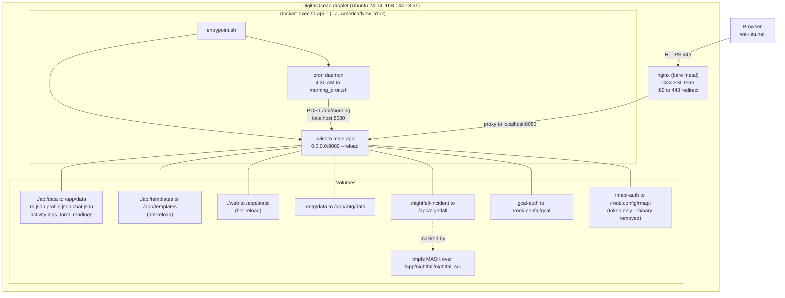
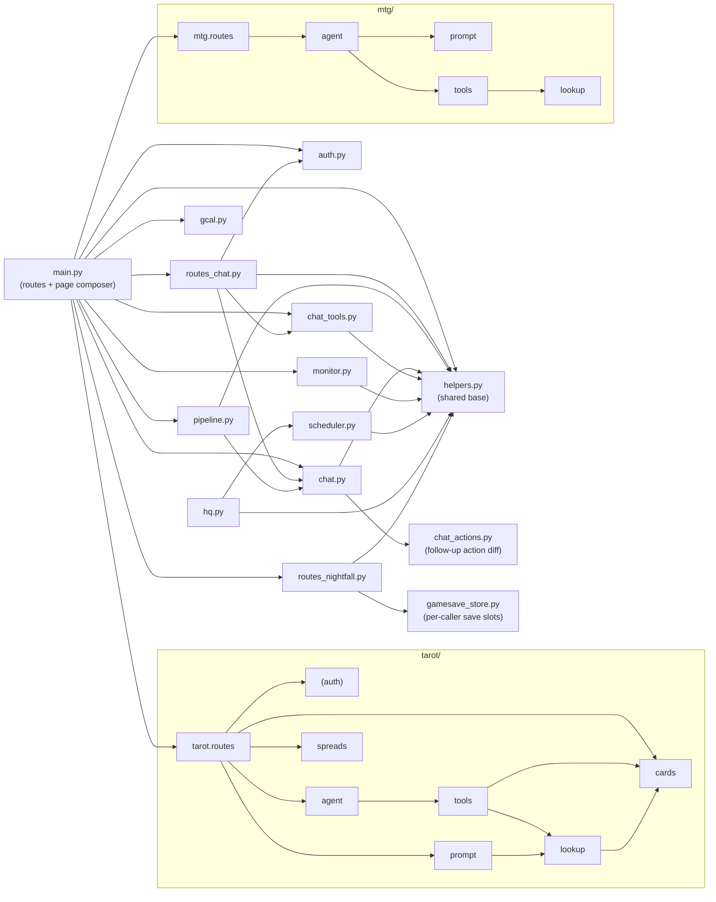
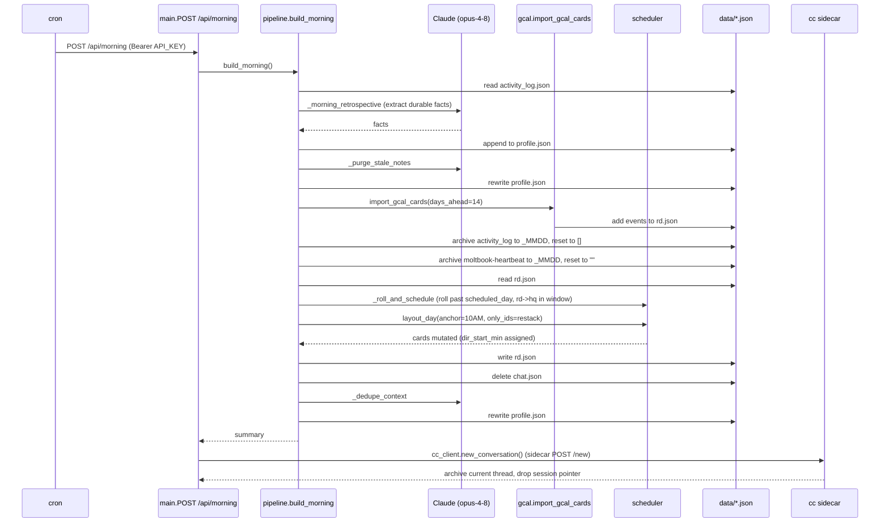
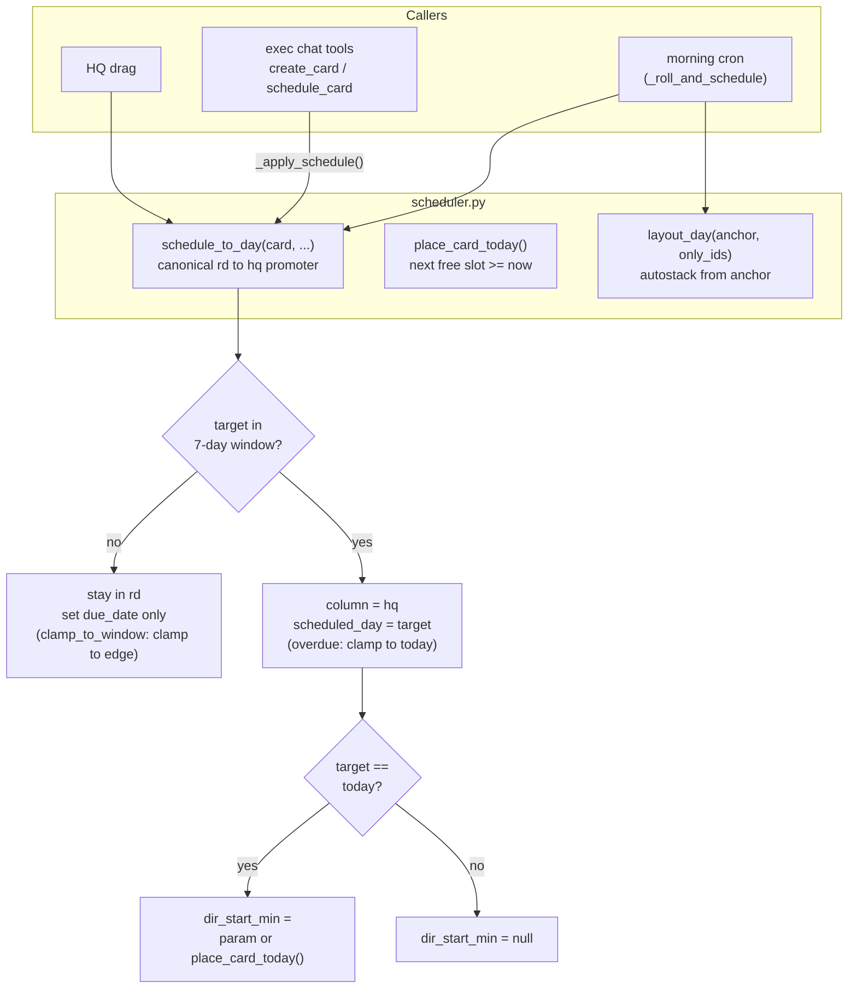
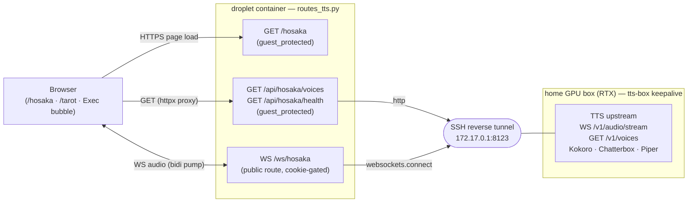
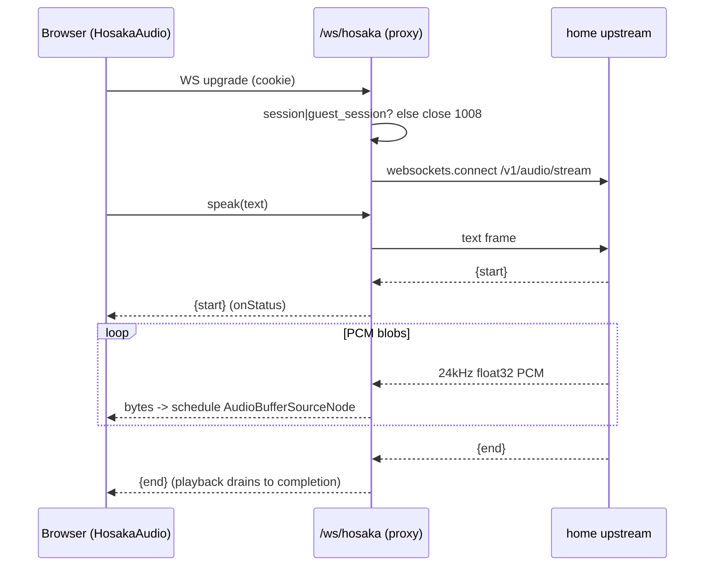
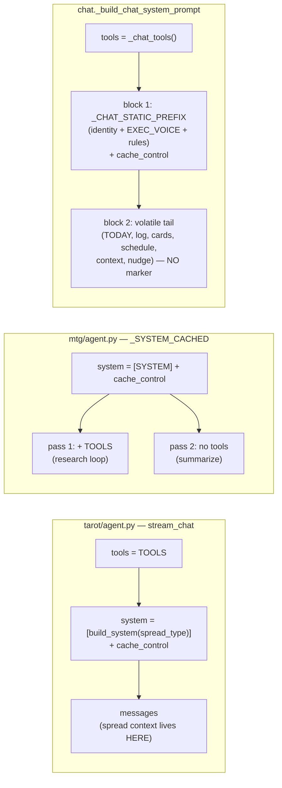
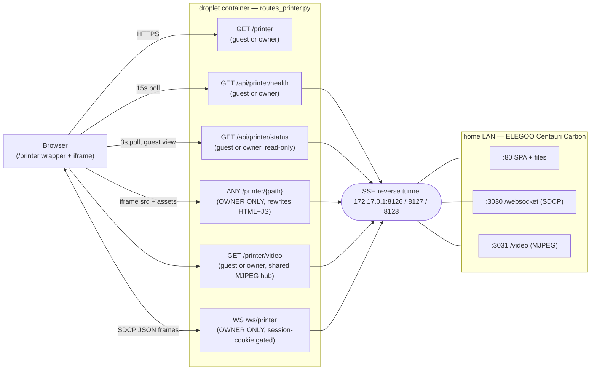
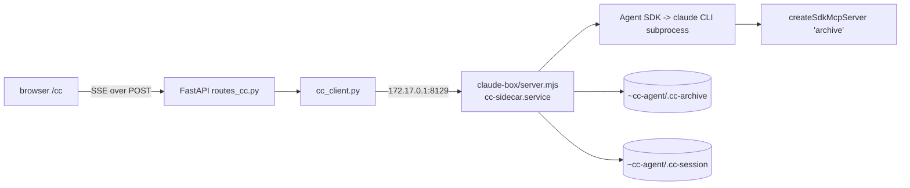

# exec-fn — Architecture

**How the system is built, and what it is trying to be.** Organisation,
diagrams, and the standing rules a change has to respect.

**The past lives in [`ARCHAEOLOGY.md`](ARCHAEOLOGY.md)** — bugs already fixed,
choices made and reversed, measurements taken once. Sections mirror this file's
numbering, so §11 is `/graph` in both. Every section here that has a recorded
history ends with a link to it.

Where a paragraph here names the incident that produced a rule, that is because
the rule is the point; the incident is written up in full over there.

## The diagrams

Nine Mermaid views, generated from source (`api/*.py`, `docker-compose.yml`,
`Dockerfile`, cron):

1. [Deployment](#1-deployment) — how a request reaches code
2. [Module graph](#2-module-graph) — what imports what
3. [Morning pipeline + scheduling](#3-morning-pipeline--scheduling) — how
   cards move through time, plus the scheduler's decision tree
4. [TTS](#4-tts-text-to-speech) — how every voice reaches the browser, and
   the shape of one utterance
5. [LLM call sites + prompt caching](#5-llm-call-sites--prompt-caching) —
   which system prefixes are cached
6. [Printer](#6-printer-elegoo-centauri-carbon--two-tier-reverse-proxy) — the
   two-tier reverse proxy
7. [`/cc`](#7-cc--claude-code-in-the-browser) — the sidecar topology
8. [noodle](#21-noodle--an-isolated-scheduling-poll) — the isolated poll and
   where the passphrase stops

---

## 1. Deployment

nginx (bare metal) terminates SSL, proxies to a single Docker container
running cron + uvicorn. Persistent state is JSON files on a bind-mounted
volume.


```mermaid
flowchart TB
  browser["Browser<br/>wai-lau.net"]

  subgraph droplet["DigitalOcean droplet (Ubuntu 24.04, 168.144.13.51)"]
    nginx["nginx (bare metal)<br/>:443 SSL term<br/>:80 to 443 redirect"]

    subgraph container["Docker: exec-fn-api-1 (TZ=America/New_York)"]
      direction TB
      entry["entrypoint.sh"]
      cron["cron daemon<br/>4:30 AM to morning_cron.sh"]
      uvicorn["uvicorn main:app<br/>0.0.0.0:8080 --reload"]
      entry --> cron
      entry --> uvicorn
      cron -->|"POST /api/morning<br/>localhost:8080"| uvicorn
    end

    subgraph vols["Volumes"]
      data["./api/data to /app/data<br/>rd.json profile.json chat.json<br/>activity logs, tarot_readings"]
      tmpl["./api/templates to /app/templates<br/>(hot-reload)"]
      web["./web to /app/static<br/>(hot-reload)"]
      mtgd["./mtg/data to /app/mtg/data"]
      night["./nightfall-incident to /app/nightfall"]
      gcal["gcal-auth to /root/.config/gcal"]
      rmapi["rmapi-auth to /root/.config/rmapi<br/>(token only -- binary removed)"]
      nfsrc["tmpfs MASK over /app/nightfall/nightfall-src"]
    end

    uvicorn --- data
    uvicorn --- tmpl
    uvicorn --- web
    uvicorn --- mtgd
    uvicorn --- night
    uvicorn --- gcal
    uvicorn --- rmapi
    night -.masked by.-> nfsrc
  end

  browser -->|HTTPS 443| nginx
  nginx -->|"proxy to localhost:8080"| uvicorn
```

**Port chain:** `nginx :443 (SSL) -> localhost:8080 -> container:8080 (uvicorn)`

**Image:** `python:3.12-slim`, single stage. No `EXPOSE`; port bound at compose
level only.


**Python deps are locked, in two files.** `api/requirements.in` holds the ~18
DIRECT dependencies and all the explanatory comments; `api/requirements.txt` is a
**generated** full lock — every package including transitives, pinned `==`, 72 of
them. The Dockerfile installs the lock and never the `.in`. Regenerate with
`bash scripts/lock-requirements.sh`, which fresh-resolves inside a throwaway
`python:3.12-slim` (the same base the image uses, so the pins match what the
image will actually get rather than what the host happens to have), refuses to
write an empty result, and prints the rebuild command — because **a resolve
verifies nothing**.


**The rule that falls out of it:** anything `api/` imports by name gets its own
line in `requirements.in`, no matter who else happens to pull it in. An audit of
every direct import against the declared set at the time found three such gaps —
`httpx`, `pydantic` and `starlette`. (`fontTools` also showed as missing, but it
belongs to `api/scripts/subset_cv_fonts.py`, a one-off font-subsetting script the
app never imports — not a runtime dep.)

**`rmapi-auth` is deliberately still mounted.** It holds a real authenticated
reMarkable device token (`rmapi.conf`, 1.5KB, last written 2026-04-28), and
re-pairing a device is a manual physical act. A declared-but-unmounted compose
volume counts as unused, so `docker volume prune` would eat it — hence mounted,
not merely declared. `RMAPI_FORCE_SCHEMA_VERSION` survives in `.env` as a no-op;
it was dropped from the Dockerfile `ENV` and from `entrypoint.sh`'s `cron_env`
filter.

**Secrets** (`.env`): `API_KEY`, `ANTHROPIC_API_KEY`, `TURNSTILE_SITE_KEY`,
`TURNSTILE_SECRET` (the guest gate is a Cloudflare Turnstile challenge, not a
shared key — `GUEST_KEY` retired).
cron reads them via `/run/cron_env`.

---

### 1d. nginx — the `--reload` 502, and the body-size 413

nginx does HTTP 80 → HTTPS redirect and HTTPS 443 → the `execfn_app` upstream (`127.0.0.1:8080`). The live config is `/etc/nginx/sites-enabled/default`; **backups live in `/etc/nginx/backups/`, NOT in `sites-enabled/`**, whose include is an unfiltered `*` that would load a `.bak` as a duplicate server block. `bootstrap.sh` carries the same block for a fresh box. The `/ws/` location is untouched.

**A `--reload` worker swap would otherwise surface as a 502.** The reloader holds the listen socket in the parent and swaps the worker underneath, so a new connection is never refused — but a request landing on the OLD worker while it drains gets its connection closed with no response, which nginx reports as 502.

The fix is an explicit `upstream` block listing the server **TWICE** — nginx allows one try per peer, so a single-server upstream can never retry — with `max_fails=0`, plus `proxy_next_upstream error timeout http_502` / `_tries 3` / `_timeout 20s` / `proxy_connect_timeout 3s` on `location /`. Same probe after: **220/220 200s**, worst request ~7s (the swap is slow, not broken).

**Two deliberate omissions:**
- **`non_idempotent` is NOT set** — a retried POST/PATCH would apply a mutation twice — so retries cover the GETs that serve pages and assets.
- **`http_503` is NOT retried** — this app returns a real 503 when the home box or the printer is unreachable, and retrying would only delay an honest answer.

**`client_max_body_size 25m`** is set on the 443 server block (2026-09-13). nginx's default is **1m**, and a screenshot pasted into `/cc` arrives as base64 in a JSON body, so a normal phone screenshot was rejected with nginx's own HTML 413 before the app ever saw it — reported as `[ request failed (413) ] when uploading image`.

**The app's caps are meant to be the real ones** (4 images, 5MB base64 each, 24MB body) because they answer in JSON the page can render; nginx only has to be wide enough to let them do the refusing. Verified live: a 2MB body now reaches the app (401 unauthenticated, not 413), and an over-cap 7MB image returns the app's `{"error":"image too large"}` 413. Printer firmware/model uploads pass through the same limit.

History — the incidents behind the rules above: [ARCHAEOLOGY.md §1](ARCHAEOLOGY.md).

---
### 1-notes. From CLAUDE.md (moved 2026-09-27)

Moved verbatim from CLAUDE.md on 2026-09-27 when CLAUDE.md was thinned to an index. Unedited; may overlap the subsections above.

**[RULES → Local-claude deploy]**

**Local-claude deploy — push, then deterministic reset over SSH (NOT `git pull`/`git stash`).** `/exec-fn` always carries local drift (regenerated `graphify-out`) + a rebase-pull config; with the bind-mounted **untracked** dirs (`./nightfall-incident` → `/app/nightfall`, `./graphify-out`), `pull`/`stash` are fragile — a mangled stash-pop or a staled mount can wedge a request that reads the mount. Both `stash -u` and plain `stash` have caused outages, so **`git stash` is now blocked through Claude Code** by a PreToolUse hook (`.claude/hooks/git-stash-guard.sh`; read-only `stash list`/`show` still allowed) — clear a rebase blocker with `git checkout -- graphify-out/` instead. (`routes_nightfall` USED to read `nightfall-incident/wai-head.js` at *import*, so a staled `/app/nightfall` killed startup → 502 across every route; it now reads its `/app/nightfall` assets **lazily per-request** inside `build_nightfall_html()`, so a staled mount degrades `/nightfall` alone and self-heals once the mount is healthy — no restart, no whole-site 502.) After `git push` from `~/src/exec-fn`:

**[RULES → No sudo on the git half]**

**NO `sudo` on the git half** — only docker needs it (the socket is root-owned). `sudo git reset --hard` rewrites every file the push changed AS ROOT, and those files then need `sudo` to edit, which is how the tree accumulated root-owned sources over weeks: `tests/*.py`, `docker-compose.yml`, `bootstrap.sh`, `printer-box/*`, `scripts/pre-commit`, `api/*.py`, `web/mtg.js`. The auth log has it plainly — twelve `git reset --hard origin/master` under sudo, plus a couple of `sudo tee web/printer.js` that the root ownership had forced. The whole tree and `.git` were chowned back to `wai-root` on 2026-09-12, so a plain `git reset --hard` writes fine; keep it that way. `reset --hard` discards the droplet's `graphify-out` drift (re-run `/graphify` after, or commit it first); untracked `nightfall-incident` is preserved; `--force-recreate` rebuilds the mount namespace so a churned untracked dir can't stale and crash startup.

**[RULES → Python deps are locked]**

**PYTHON DEPS ARE LOCKED.** `api/requirements.in` = the ~18 DIRECT deps, hand-edited, comments live here. `api/requirements.txt` = a **GENERATED full lock**, all 72 packages incl. transitives pinned `==`; the Dockerfile installs the lock and never the `.in`. Add or bump a dep by editing the `.in`, then `bash scripts/lock-requirements.sh` (fresh-resolves in a throwaway `python:3.12-slim`, same base as the image), then **rebuild and check a route** — a resolve verifies nothing. Why: unpinned, every rebuild re-resolved the whole tree, and on 2026-09-17 that moved `anthropic` + `mcp` onto **`httpx2`**, evaporating the transitive `httpx` that `api/auth.py` imports by name → `ModuleNotFoundError` at import → **502 on every route**. Both `httpx` and `httpx2` are in the lock on purpose. Anything `api/` imports by name gets its own line in the `.in` regardless of who else pulls it. **ARCHITECTURE.md §1**.

**[Droplet → nginx]**

- nginx: HTTP 80 → HTTPS redirect, HTTPS 443 → the `execfn_app` upstream (127.0.0.1:8080). The `upstream` block lists the server **TWICE** — nginx allows one try per peer, so a single-server upstream can never retry — which is what stopped a `--reload` worker swap surfacing as a 502 (measured: 20 of 220 requests, then 220/220 after). `non_idempotent` is deliberately NOT set (a retried POST would apply a mutation twice) and `http_503` is deliberately NOT retried (this app returns real 503s when the home box or printer is down). `client_max_body_size 25m` — nginx's 1m default was 413ing pasted `/cc` screenshots before the app could apply its own caps. Live config is `/etc/nginx/sites-enabled/default`; **backups go in `/etc/nginx/backups/`, never in `sites-enabled/`**, whose include is an unfiltered `*` that would load a `.bak` as a duplicate server block. `bootstrap.sh` carries the same block. See **ARCHITECTURE.md §1d** (history: **ARCHAEOLOGY.md §1**).

## 2. Module graph

Intra-project imports only (stdlib / fastapi / anthropic omitted).
`main.py` is the composition root; `helpers.py` is the shared base
(10 inbound edges). Two self-contained subsystems: `tarot/*` and `mtg/*`.


```mermaid
flowchart LR
  main["main.py<br/>(routes + page composer)"]
  auth["auth.py"]
  helpers["helpers.py<br/>(shared base)"]
  pipeline["pipeline.py"]
  scheduler["scheduler.py"]
  monitor["monitor.py"]
  hq["hq.py"]
  chat["chat.py"]
  chat_tools["chat_tools.py"]
  chat_actions["chat_actions.py<br/>(follow-up action diff)"]
  routes_chat["routes_chat.py"]
  routes_night["routes_nightfall.py"]
  gamesave["gamesave_store.py<br/>(per-caller save slots)"]
  gcal["gcal.py"]

  main --> pipeline
  main --> gcal
  main --> chat
  main --> chat_tools
  main --> helpers
  main --> routes_night
  main --> routes_chat
  main --> monitor
  main --> auth
  main --> mtgr["mtg.routes"]
  main --> tarr["tarot.routes"]

  routes_night --> gamesave
  routes_chat --> auth
  routes_chat --> chat
  routes_chat --> chat_tools
  routes_chat --> helpers

  pipeline --> helpers
  pipeline --> chat
  chat --> helpers
  chat --> chat_actions
  chat_tools --> helpers
  monitor --> helpers
  scheduler --> helpers
  hq --> helpers
  hq --> scheduler
  routes_night --> helpers

  subgraph tarot["tarot/"]
    tarr --> tauth["(auth)"]
    tarr --> tag["agent"]
    tarr --> tcards["cards"]
    tarr --> tprompt["prompt"]
    tarr --> tspreads["spreads"]
    tag --> ttools["tools"]
    ttools --> tcards
    ttools --> tlookup["lookup"]
    tprompt --> tlookup
    tlookup --> tcards
  end

  subgraph mtg["mtg/"]
    mtgr --> mag["agent"]
    mag --> mprompt["prompt"]
    mag --> mtools["tools"]
    mtools --> mlookup["lookup"]
  end
```

Note: `scheduler.py` is reached at runtime from `chat_tools` and
`pipeline` via `__import__`/late import, so it has no static import edge
from them — the runtime call path is shown in view 3.

---

## 3. Morning pipeline + scheduling

### 3a. Morning cron sequence

`POST /api/morning` (4:30 AM ET) runs `build_morning()` in `pipeline.py`.


```mermaid
sequenceDiagram
  participant cron
  participant API as main.POST /api/morning
  participant P as pipeline.build_morning
  participant LLM as Claude (opus-4-8)
  participant GC as gcal.import_gcal_cards
  participant S as scheduler
  participant FS as data/*.json
  participant CC as cc sidecar

  cron->>API: POST /api/morning (Bearer API_KEY)
  API->>P: build_morning()
  P->>FS: read activity_log.json
  P->>LLM: _morning_retrospective (extract durable facts)
  LLM-->>P: facts
  P->>FS: append to profile.json
  P->>LLM: _purge_stale_notes
  P->>FS: rewrite profile.json
  P->>GC: import_gcal_cards(days_ahead=14)
  GC->>FS: add events to rd.json
  P->>FS: archive activity_log to _MMDD, reset to []
  P->>FS: archive moltbook-heartbeat to _MMDD, reset to ""
  P->>FS: read rd.json
  P->>S: _roll_and_schedule (roll past scheduled_day, rd->hq in window)
  P->>S: layout_day(anchor=10AM, only_ids=restack)
  S-->>P: cards mutated (dir_start_min assigned)
  P->>FS: write rd.json
  P->>FS: delete chat.json
  P->>LLM: _dedupe_context
  P->>FS: rewrite profile.json
  P-->>API: summary
  API->>CC: cc_client.new_conversation() (sidecar POST /new)
  CC-->>API: archive current thread, drop session pointer
```

The Exec panel's thread lives in the cc sidecar since phase 3 (§7f), not in
`chat.json`, so deleting `chat.json` alone left the panel on yesterday's
conversation forever. The route ends the sidecar thread after
`build_morning()`; the sidecar archives before it drops the pointer and
refuses (500) if the archive fails, which surfaces as `errors.cc_new`.

### rd.json concurrency — `helpers._RD_LOCK`

rd.json writers run on genuinely parallel OS threads: the nudge loop's scans
(`asyncio.to_thread`), chat-tool dispatch (`routes_chat` → `to_thread`),
sync-`def` routes on Starlette's thread pool (gcal import), and the event loop
itself (`PATCH /api/rd`). Three guards in `helpers.py` make that safe:

- **`_RD_LOCK`** (`threading.RLock`) — every read-modify-write cycle holds it
  around the WHOLE load→mutate→save sequence (`with _RD_LOCK:`), so one
  thread's save can never silently drop another's changes. LLM/network calls
  are NEVER made under the lock — callers release, call the model, then
  re-lock + reload + apply (`_fire_nudge`, `_build_graph`, `_run_triage`,
  `api_rd_recalc`, `_tool_decompose_task`, `import_gcal_cards`).
- **`_load_rd()` returns a private deep copy** — the `_load_json` mtime cache
  holds one shared object; handing it out mutable would leak one thread's
  in-progress edits into another's snapshot.
- **`_save_rd()` is an atomic replace** (tmp + rename), so a concurrent
  reader never sees a truncated file. It also **pops rd.json out of the
  `_load_json` mtime cache**: mtime granularity on this box is 1ms, so a save
  landing in the same millisecond as the read that seeded the cache would
  otherwise leave the stale PRE-save board being handed to the next load.

Single-process invariant: uvicorn runs ONE worker (`--reload`), so a
process-wide lock is sufficient; nothing outside the container writes rd.json.
Read-only loads (`monitor`, `get_week_data`, scans) don't take the lock — the
deep copy + atomic replace make unlocked reads safe.

### 3b. scheduler.py — the time model

All `dir_start_min` / `scheduled_day` logic lives here. Window =
`SCHED_WINDOW_DAYS=6` (today + 6 = 7-day span).


```mermaid
flowchart TB
  subgraph entry["Callers"]
    morning["morning cron<br/>(_roll_and_schedule)"]
    execchat["exec chat tools<br/>create_card / schedule_card"]
    hq["HQ drag"]
  end

  subgraph sched["scheduler.py"]
    s2d["schedule_to_day(card, ...)<br/>canonical rd to hq promoter"]
    place["place_card_today()<br/>next free slot >= now"]
    layout["layout_day(anchor, only_ids)<br/>autostack from anchor"]
  end

  morning --> s2d
  morning --> layout
  execchat -->|"_apply_schedule()"| s2d
  hq --> s2d

  s2d --> decide{"target in<br/>7-day window?"}
  decide -->|"no"| outwin["stay in rd<br/>set due_date only<br/>(clamp_to_window: clamp to edge)"]
  decide -->|"yes"| inwin["column = hq<br/>scheduled_day = target<br/>(overdue: clamp to today)"]
  inwin --> istoday{"target ==<br/>today?"}
  istoday -->|"yes"| setmin["dir_start_min =<br/>param or place_card_today()"]
  istoday -->|"no"| clearmin["dir_start_min = null"]
```

**rd to hq promotion** (`schedule_to_day`): a card moves out of the `rd`
column into `hq` only when its target day falls inside the 7-day window.
`dir_start_min` (timeline position) is set only when the target is today —
either an explicit value or the next free slot from `place_card_today()`.
Outside the window the card stays in `rd` with just a `due_date`.

**Exec chat call chain:**
`POST /api/chat -> routes_chat._handle_tool -> chat_tools._TOOL_HANDLERS[name]`
`-> _apply_schedule -> scheduler.schedule_to_day`.

History — the incidents behind the rules above: [ARCHAEOLOGY.md §3](ARCHAEOLOGY.md).

---
### 3-notes. From CLAUDE.md (moved 2026-09-27)

Moved verbatim from CLAUDE.md on 2026-09-27 when CLAUDE.md was thinned to an index. Unedited; may overlap the subsections above.

**[Card schema → dir_start_min]**

- `dir_start_min`: minutes from midnight — the card BLOCK's start (= prep start) for a card scheduled today. The block runs `[dir_start_min, dir_start_min + estimated_time]`; the event block is its final `work` minutes. A card with a **timed** due_date is pinned: `dir_start_min = event_time - prep` (`scheduler.timed_start_min`), so prep back-schedules to finish exactly at the event time. Timeless cards stack forward (`place_card_today` / morning `layout_day` from 10 AM). All scheduling lives in `scheduler.py`. Edited via the hq today-column timeline (drag a block) and drives nudge anchoring. Dragging the master block also retimes the card's due (event) TIME to `block_start + prep` (`saveStartTime`), keeping the due DATE — so the event time follows the drag and a later prep/time edit re-pins to where it was dragged; cards with no due_date just move (no due fabricated). Between-column drags (`/api/hq`) only touch `scheduled_day`, never the due date.

**[Card schema → prep_time]**

- `prep_time`: of `estimated_time`, the **prep** minutes — the hands-on lead-up steps that get decomposed (the part Wai stalls on). The remainder (`estimated_time - prep_time` = `work`) is the **event**: an atomic external occurrence you simply attend (class, concert, appointment, show, meeting) and never split — **but only when `prep_time > 0`**. A self-directed task has `work = 0` (all prep, no event block). And a card with **`prep_time = 0` is now fully decomposed**: the whole `estimated_time` is broken into work steps with NO atomic event block (`ensure_event_block` suppresses the event node whenever prep is 0). So the protected event block exists only for a card reached *through* prep. Auto-filled at creation (exec chat `create_card`, `_card_brief` budgets prep-vs-event in decompose). Editable in the card dialog as two equal-size boxes on the **date line** (`cd-prep` + `cd-dur`, top-labelled prep + **duration** — the field UI-labelled "event" was renamed "duration"), shown in compact single-unit form (`fmtDuration`: `35m` / `6h`; `parseDuration` accepts those plus `90`, `1h30m`); the **recalculate** button stays in the breakdown row and rebuilds the graph to that split. null for reminders.

**[Card schema → rd.json concurrency]**

**rd.json concurrency**: `_save_rd()` **pops rd.json out of the `_load_json` mtime cache** (1ms mtime granularity — a save in the same millisecond as the read that seeded the cache otherwise serves the stale pre-save board to the next load). Writers run on parallel OS threads (nudge-loop `to_thread` scans, chat-tool dispatch, sync-`def` routes, event loop), so every read-modify-write cycle holds `helpers._RD_LOCK` (RLock) around the WHOLE load→mutate→save — never across an LLM/network call (release, call, re-lock + reload + apply, see `_fire_nudge`). `_load_rd()` returns a private deep copy (the `_load_json` mtime cache holds one shared object) and `_save_rd()` is an atomic tmp+rename. Any NEW rd.json writer must follow this pattern. Details in ARCHITECTURE.md § rd.json concurrency (history: ARCHAEOLOGY.md §3).

## 4. TTS (text-to-speech)

Every voice in the app — the `/hosaka` SPEAK page, the `/tarot` reader
narration, and the Exec bubble — streams from a **single home GPU box**
through a **same-origin reverse proxy**. No TTS models run on the droplet;
the container only proxies. The browser always talks same-origin, so the
session/guest cookie carries auth on the WebSocket handshake (HTTP basic
auth does not ride a WS upgrade reliably on mobile).

### 4a. Topology

The model server (Kokoro / Chatterbox / Piper) runs on Wai's home box and
is reached only over an SSH reverse tunnel bound to the Docker bridge
gateway (`TTS_UPSTREAM`, default `172.17.0.1:8123`). `tts-box/` (systemd
user service + port watchdog, installed on the home box) keeps that
upstream alive.


```mermaid
flowchart LR
  browser["Browser<br/>(/hosaka · /tarot · Exec bubble)"]

  subgraph droplet["droplet container — routes_tts.py"]
    page["GET /hosaka<br/>(guest_protected)"]
    voices["GET /api/hosaka/voices<br/>GET /api/hosaka/health<br/>(guest_protected)"]
    ws["WS /ws/hosaka<br/>(public route, cookie-gated)"]
  end

  tunnel(["SSH reverse tunnel<br/>172.17.0.1:8123"])

  subgraph home["home GPU box (RTX) — tts-box keepalive"]
    upstream["TTS upstream<br/>WS /v1/audio/stream<br/>GET /v1/voices<br/>Kokoro · Chatterbox · Piper"]
  end

  browser -->|HTTPS page load| page
  browser -->|"GET (httpx proxy)"| voices
  browser <-->|"WS audio (bidi pump)"| ws
  voices -->|http| tunnel
  ws -->|"websockets.connect"| tunnel
  tunnel --- upstream
```

`_pump_to_upstream` / `_pump_to_client` shuttle text + binary frames both
directions; `/api/hosaka/health` probes the upstream for a *real* response
(the reverse-tunnel listener stays bound on the droplet even when the model
server is down — a bound port is **not** liveness), letting `/hosaka` show
"TTS server offline" before SPEAK.

**Every utterance ends in a terminal frame** — the proxy guarantees it even
when the backend doesn't. An utterance normally ends with the upstream's own
`{"type":"end"}` / `{"type":"error"}`, which clears `busy[url]`; if the
upstream stream instead just *ends* (home box crashed, tunnel dropped, GPU
server restarted mid-sentence) `_pump_to_client`'s `finally` synthesizes
`{"type":"error","detail":"tts upstream closed mid-utterance"}` and evicts the
dead connection so the next utterance reconnects. This is load-bearing for
`/tarot`: the reader's typewriter paces off the audio clock and waits on a
terminal frame, so a silently-dead upstream left the reveal spinning forever
with the text stuck part-revealed. The guard is the pure predicate
`tts_routing.died_mid_utterance` (unit-tested — `routes_tts` can't be imported
by the dev venv), which fires **only** for the live connection on that `url`:
a stale socket `_ws_dispatch` deliberately cut to start a new utterance is
superseded, and its error would abort the utterance that replaced it.

Client-side belts for the same failure, since a frame can also be lost between
browser and droplet: `hosaka-audio.js`'s `ws.onclose` delivers a synthetic
`{type:"error"}` to the in-flight utterance (guarded on the socket still being
the live one), and `tarot-stream.js`'s stall watchdog caps `elapsed()` at the
buffered duration in its progress signal — the raw `el + dur` never stopped
rising (the ctx clock keeps running after the buffer drains), so the watchdog
could never fire on a dead stream.

### 4b. Auth — now guest-or-full

`/hosaka` and `/api/hosaka/*` moved from the full-auth `protected` router to
**`guest_protected`** — a guest session now reaches the SPEAK page. The WS
`/ws/hosaka` is declared on the `public` router but rejects (close `1008`)
unless a `session` **or** `guest_session` cookie matches before `accept()`.
The guest tier is what lets the `/tarot` reader voice work for guests.

| Endpoint | Router | Reachable by |
|----------|--------|--------------|
| `GET /hosaka` | `guest_protected` | full + guest (nav renders guest-tier for non-admins) |
| `GET /api/hosaka/voices`, `/health` | `guest_protected` | full + guest |
| `WS /ws/hosaka` | `public` + cookie check | full + guest (else `1008`) |

### 4b-ii. GPU-mode owner control

`GET /api/hosaka/mode` and `POST /api/hosaka/mode` sit on the **`protected`**
router (owner-only -- guests must never flip the GPU). They proxy the home-box
`gpu-mode` service over the SSH tunnel at `172.17.0.1:8124` (env:
`GPU_MODE_UPSTREAM`, default `172.17.0.1:8124`) using `Authorization: Bearer
$GPU_MODE_TOKEN` (the token must match the value on the home box;
provisioned in the droplet `.env` -- operator step). The GET returns the
current mode; the POST body `{"action": "homo"|"emo"|"idle", "force"?: bool}`
transitions it.
`emo` and `idle` stop hosaka-server and therefore disconnect active remote
users; the route confirms against `_audio_conns` (the live `/ws/hosaka` audio
socket set in `routes_tts.py` — the real listeners, incl. /tarot narration and
Exec voice, not just `/hosaka`-page `_presence`) and returns `409` if any users
are connected and the caller has not sent `{"force": true}`. `homo` never needs
confirmation.

**The reported mode is corrected against reality.** `/mode` reports the box's
*intent*, and that outlives the truth: when hosaka-server dies or wedges the
box goes on answering `homo` while nothing synthesizes, and the strip lights
the homo segment over a dead backend. `_current_mode()` probes `/mode` and TTS
liveness concurrently and passes both to the pure
`gpu_mode_client.effective_mode`, which reports `idle` for a claimed `homo`
whose TTS is not answering. Only `homo` is second-guessed — under `emo`/`idle`
a failing probe is the *expected* state, not a contradiction, and `gone` (box
unreachable) already says everything. Liveness is the same `_live()` rule the
health route uses: only a real `/v1/voices` response, never a bound tunnel
port. A `homo` switch sets a 90s grace (`_HOMO_GRACE_S`) during which liveness
is assumed, because the box has to load models before `/v1/voices` answers and
the next poll would otherwise read "homo but no TTS" and flip the strip to
idle and back.

**Mode changes reach open pages two ways.** A POST here pushes instantly to
`_mode_subscribers`. Everything else — a switch made at the home box, a
watchdog restart, hosaka-server dying under a mode still claiming homo — never
touches that queue, so `/api/hosaka/mode/stream`'s keepalive tick doubles as a
poll of the real mode (`_MODE_POLL_S`, 15s) and emits on change. This is what
fixes drift for pages that are already open; `gpu-mode.js`'s recheck-on-load
and refresh-on-refocus only ever covered pages that got touched, and its own
comment said so ("No interval -- a long-open foreground tab drifts until
touched"). An unchanged poll falls through to a `: keepalive` comment, so an
idle stream still costs one line per tick.


| Endpoint | Router | Reachable by |
|----------|--------|--------------|
| `GET /api/hosaka/mode` | `protected` | owner only |
| `POST /api/hosaka/mode` | `protected` | owner only |
| `GET /api/hosaka/mode/stream` | `protected` | owner only |

### 4c. Four consumers of one audio core — and one narrator above it

All four share `web/hosaka-audio.js` (`HosakaAudio.createPlayer()`) — it
owns the `AudioContext`, the iOS unlock dance, the `/ws/hosaka` socket, and
playback of streamed **24 kHz float32 PCM** via scheduled
`AudioBufferSourceNode`s. The upstream emits only `{start}` / coarse PCM
blobs / `{end}` (no per-word timestamps), so any visual syncs to the
*measured* audio duration.

| Surface | Script | Voice | Backend | Where that backend runs |
|---------|--------|-------|---------|-------------------------|
| `/hosaka` SPEAK UI | `tts.js` | `charlie` (default) + full list | chatterbox + RVC | home GPU box |
| `/tarot` reader | `tarot-voice.js` | `nicole` | kokoro | **home GPU box** |
| Exec panel + bubble | `exec-voice.js` / `exec-voice-listener.js` | `glados` | piper | **this droplet** |
| `/cc` | `exec-voice.js` (same binding) | `glados` | piper | **this droplet** |

**That last column is the difference that matters.** `pick_upstream` routes
backend `piper` to the always-on container beside the app, so Exec and `/cc`
keep their voice with the home machine asleep; only `/tarot` speaks from the
tunnel, and only `/tarot` can lose its voice (§14d).

Above the player sits **`web/voice-narrator.js`**, shared by the three
narrating surfaces: player lifecycle, the persisted on/off, the unlock dance,
the utterance queue, and the CONTROLLER (`elapsed()`, `duration()`, `ended`,
`ok`) a typewriter paces to. `exec-voice.js` and `tarot-voice.js` are thin
bindings over it — configuration plus what is genuinely theirs (the replay
glyph and the toggle both surfaces mount; the home-box probe and the canned
opening). The control itself is **`web/voice-ui.js` + `voice-ui.css`**: one
`.voice-mute` element, one `data-on` contract, three placements.


Iosevka has this glyph and its advance IS the mono cell, so in `--font-mono` the
star occupies exactly one character: three cells for `[✦]`, three for `[x]`,
29.28px each, and the line box is a character's. The font supplies the geometry
and `transform: scale(1.25)` only says how much of the cell the star fills — at
the font's own size it read thin beside the bracket strokes (ink 6.67px →
8.67px), and that is about as far as it goes: the gap to each bracket is down to
1px against the `[x]`'s 2.33px. Layout is untouched at any factor, which is the
whole reason the size lives in a transform. Both bars measure 24.61 and both
controls 29.28. The nav's glyph label is sized the same way, for the same reason
(§12).

**`/tarot` overrides both the factor and the size**, in `tarot.css`
(`.voice-mute.spread-btn .voice-glyph`). One mono cell is the right size next to
an `[x]`; that page has no `[x]` — the star sits in a column of glyph buttons,
`[↺]` at 1.7em and `[♪]` at 1.3em, both with real side margins — so the
cell-sized star read tiny and touched its own brackets (ink 5.67px against the
note's 10.67, 1px gaps against 4px). It takes the reset glyph's metrics plus the
factor that brings a star's ink up to a note's: 10.33px, 3.33px gaps, and the
same button height as `[↺]` by construction, since the box is the font-size.

**OFF means off.** With the narrator off nothing is synthesized, no socket opens, `speak()` returns a DEAD controller, and every caller reads that as *reveal at your own pace, now*. One flag, no second state to keep in sync.

Each narrating surface paces its typewriter to the audio clock and bails to the
guessed pace on any failure (§18). `exec-voice-listener.js` (nudges and monitor
comments on non-planning pages) is still fire-and-forget: there is no typewriter
on those pages to pace.

**A fourth path plays audio that was never synthesized here.** The
pre-generated `/tarot` openings (§14d) are already-rendered WAVs, and
`player.speakBuffer({data})` schedules one through the SAME `scheduleBuffer`
the streamed chunks use — same playhead, same gain node (so the ♪ mute still
works), same iOS unlock and silent-switch session, same `elapsed()` /
`audioDuration()` clock, so the typewriter cannot tell which one it got. No
socket is opened: there is nothing to synthesize. `{end}` fires the moment it
is scheduled, because a file is fully buffered by definition. One trap:
`decodeAudioData` **detaches** the ArrayBuffer it is handed, so it decodes a
copy and the caller's clip survives a replay.

**The other direction — synthesizing with no browser in the loop —** is
`api/tarot/voice_synth.py`: it speaks the upstream's protocol directly
(`ws://TTS_UPSTREAM/v1/audio/stream`, one JSON utterance in, `{start}` →
float32 frames → `{end}` back) rather than going through `/ws/hosaka`, because
there is no cookie to carry and no client to fan out to. Three callers: the
opening generator, the nightly voice probe (§14e), and `POST /api/tarot/warm`.

### 4d. One utterance


```mermaid
sequenceDiagram
  participant B as Browser (HosakaAudio)
  participant WS as /ws/hosaka (proxy)
  participant U as home upstream

  B->>WS: WS upgrade (cookie)
  WS->>WS: session|guest_session? else close 1008
  WS->>U: websockets.connect /v1/audio/stream
  B->>WS: speak(text)
  WS->>U: text frame
  U-->>WS: {start}
  WS-->>B: {start} (onStatus)
  loop PCM blobs
    U-->>WS: 24kHz float32 PCM
    WS-->>B: bytes -> schedule AudioBufferSourceNode
  end
  U-->>WS: {end}
  WS-->>B: {end} (playback drains to completion)
```

History — the incidents behind the rules above: [ARCHAEOLOGY.md §4](ARCHAEOLOGY.md).

---
### 4-notes. From CLAUDE.md (moved 2026-09-27)

Moved verbatim from CLAUDE.md on 2026-09-27 when CLAUDE.md was thinned to an index. Unedited; may overlap the subsections above.

**[The voice → Voice goes both ways]**

**Voice goes both ways on all three.** `voice-input.js` is the mic engine AND the composer wiring (`bindComposer`: prompt + box + an OR'd list of "don't listen now" predicates); `cc-mic.js` / `exec-mic.js` / `tarot-mic.js` are three short bindings that name only their own predicates. The `$` prompt IS the control, one tap opens a continuous session, each finished utterance sends itself. **A final result ARMS the send 1s out (`SEND_DELAY_MS`), it does not send** — the engine calls an utterance final on a short silence and thinking mid-sentence sounds the same, so a pause used to send half a thought and let the rest arrive as a second message; anything heard inside the window cancels the arm and joins what is already there. The finalized text is held on the session (`pending`), not read back off the composer, because iOS ends the recognizer on silence and the rebuild resets `base` to 0; an EMPTY result event never cancels the arm (or nothing would ever send); tapping the mic off mid-window deliberately does not send. **The mic and the speaker must never meet** — it drops everything it hears while a reply is streaming **or** while the surface's narrator `isSpeaking()` — otherwise the page transcribes its own narration and sends it back as the next message. `isSpeaking()` stays true through the playout TAIL, which is exactly the window a microphone can hear, and the `exec:voice-idle` event re-lights the dot.

**[Pages → /hosaka]**

`/hosaka` — **Guest-or-full** TTS page (`guest_protected` — guests welcome). Default voice `charlie`. SPEAK UI streaming audio from a home GPU box (Kokoro/Chatterbox) via a same-origin WS reverse-proxy (`routes_tts.py`); browser only ever talks same-origin so the session/guest cookie carries auth on the WS handshake. A live count of **other** people on the voice backend sits at the top-**left** (`#tts-presence`, `N other people speaking` — defaults to `0 other people speaking` so the count landing never shifts the layout) over a dedicated presence WS (`/ws/hosaka/presence`, socket + backoff in the shared `web/hosaka-presence.js`); the server broadcasts the TOTAL and the client subtracts its own socket, and **/tarot readers count** (tarot.html loads the same module and `tarot-voice.js` holds a socket, rendering no count of its own); the diagnostic status text (`#tts-status` — offline reason / "Wai's GPU offline -- glados only", set in `tts.js applyHealth`) sits to its right on the same row (`.tts-presence-row`, flex; status collapses when empty). An owner-only **GPU-mode** segmented strip (`#gpu-mode`, emo/**down**/homo — the middle button is LABELLED `down` but its `data-mode` is still `idle`: that string is the action the home box accepts and the value it reports back, so only the button text was renamed (2026-09-10). Note `idle`/`down` and `gone` are different states that both read as unavailable — `down` is hosaka-server deliberately stopped, `gone` is the box unreachable.) sits flush **right** (the connected-users count is on the left) — the control (`web/gpu-mode.{css,js}`, wired against `/api/hosaka/mode`); guests get 401 → strip stays hidden. The strip **live-syncs across pages**: each page subscribes to `/api/hosaka/mode/stream` (SSE), and a switch broadcasts the new mode to every open `/hosaka`, so they update without a reload.

**[API → /api/hosaka/mode]**

GET/POST `/api/hosaka/mode` — **Owner-only.** GET → current GPU mode (`homo`/`emo`/`idle`, or `gone` if the home box is unreachable) — **corrected against reality** by `gpu_mode_client.effective_mode`: `/mode` reports the box's INTENT, which outlives the truth (hosaka-server dies and the box goes on saying `homo`), so a claimed `homo` whose TTS isn't answering is reported `idle`. Only `homo` is second-guessed — under `emo`/`idle` a failing probe is the expected state, and `gone` already says everything. Liveness is the `_live()` rule (a real `/v1/voices` response; a bound tunnel port is NOT liveness). A `homo` switch gets a **90s grace** (`_HOMO_GRACE_S`) since the box must load models before `/v1/voices` answers — without it the next poll reads "homo but no TTS" and the strip flips idle→homo. POST `{action, force?}` switches it (409 if it would cut off connected users and `force` absent); the shared `#gpu-mode` strip on `/hosaka` drives it.

**[API → /api/hosaka/mode/stream]**

GET `/api/hosaka/mode/stream` — **Owner-only** SSE. Emits `{mode}` on every switch (via POST above) so the `#gpu-mode` strip live-syncs across all open `/hosaka` pages, AND **polls the real mode every `_MODE_POLL_S` (15s)**, emitting on any change — the subscriber queue only carries switches made through this app, so a mode moved at the home box (watchdog restart, another device) used to leave every open page stale until reload/refocus. Unchanged poll → a `: keepalive` comment, so an idle stream still costs one line per tick; a freshly-connected stale page self-corrects one tick in.

**[API → WS /ws/hosaka]**

WS `/ws/hosaka` — TTS audio stream reverse-proxy. Public route, but closes (1008) unless a `session` OR `guest_session` cookie matches (guests get the /tarot reader voice); pumps text/bytes both ways between browser and the home GPU upstream. **Every utterance is guaranteed a terminal frame**: if the upstream stream ends without its own `{end}`/`{error}` (home box died / tunnel dropped mid-sentence), `_pump_to_client`'s `finally` synthesizes `{"type":"error","detail":"tts upstream closed mid-utterance"}` and evicts the dead conn — `/tarot` paces its typewriter off the audio clock and waits on that frame, so without it the reveal spun forever with the text stuck part-revealed. Gated by the pure `tts_routing.died_mid_utterance` so a socket deliberately cut to start a NEW utterance can't error the one that replaced it.

**[API → WS /ws/hosaka/presence]**

WS `/ws/hosaka/presence` — Live count of people on the voice backend. Same cookie gate (1008 otherwise). Every open `/hosaka` **and `/tarot`** tab holds one socket (`web/hosaka-presence.js`); server tracks them in `_presence` and broadcasts the TOTAL `{count}` to all on each join/leave — each client subtracts its own socket to render `N other people speaking` (only `/hosaka` renders it; `/tarot` just contributes). Separate from `/ws/hosaka` (the audio socket only opens on Speak).

## 5. LLM call sites + prompt caching

Every Claude call goes through the `anthropic` SDK with a pay-per-token
`ANTHROPIC_API_KEY` (no subscription). Where a large, byte-stable system
prefix is **reused across turns**, a `cache_control: {type: ephemeral}`
marker (5-min TTL) lets repeat requests read that prefix at ~0.1x instead
of full price.

### The one invariant

Render order is `tools -> system -> messages`. A marker on the **last
system block** caches `tools + system` together as the prefix. Caching is
a pure prefix match: any byte that changes inside the cached span (a
timestamp, per-request card data) invalidates everything after it. So the
static text must physically precede the volatile text, and the marker sits
at the end of the static part. **Opus min cacheable prefix = 4096 tokens**
— a shorter prefix silently caches nothing (`cache_creation_input_tokens`
stays 0), so anything under that is left uncached.

### Cached sites


```mermaid
flowchart LR
  subgraph tarot["tarot/agent.py — stream_chat"]
    tsys["system = [build_system(spread_type)]<br/>+ cache_control"]
    ttools["tools = TOOLS"]
    tmsg["messages<br/>(spread context lives HERE)"]
    ttools --> tsys --> tmsg
  end

  subgraph mtg["mtg/agent.py — _SYSTEM_CACHED"]
    msys["system = [SYSTEM] + cache_control"]
    p1["pass 1: + TOOLS<br/>(research loop)"]
    p2["pass 2: no tools<br/>(summarize)"]
    msys --> p1
    msys --> p2
  end

  subgraph exec["chat._build_chat_system_prompt"]
    estatic["block 1: _CHAT_STATIC_PREFIX<br/>(identity + EXEC_VOICE + rules)<br/>+ cache_control"]
    evol["block 2: volatile tail<br/>(TODAY, log, cards, schedule,<br/>context, nudge) — NO marker"]
    etools["tools = _chat_tools()"]
    etools --> estatic --> evol
  end
```

| Call site | Model | Cached prefix | Tokens | Reuse pattern |
|-----------|-------|---------------|-------:|---------------|
| `tarot/agent.py` `stream_chat` | opus-4-8 | `build_system(spread_type)` + `TOOLS` | ~8.7K / ~13.4K | every turn of a reading |
| `mtg/agent.py` pass 1 | opus-4-8 | `SYSTEM` + `TOOLS` | ~6.6K | across research tool-loop iterations + cross-question |
| `mtg/agent.py` pass 2 | opus-4-8 | `SYSTEM` (no tools) | ~5.9K | cross-question only (separate prefix from pass 1) |
| `chat_passes.run_turn` (act + reply passes) | opus-4-8 | `_CHAT_STATIC_PREFIX` + `_chat_tools()` | ~5.2K | every exec pass; each pass reads what the first wrote |

**Exec restructure:** the tools alone (~3.5K) are under 4096, so the static
text is what lifts the prefix over the floor. `_build_chat_system_prompt`
returns a **two-block** system list — a marked static block (identity +
`EXEC_VOICE` + global rules) and an unmarked volatile tail. `TODAY` was at
the top of the old single-string prompt and silently invalidated the cache
every request; it now lives in the volatile tail. Both `routes_chat` call
sites build the identical static block.

**Follow-up action diff:** after a tool round, the follow-up turn rebuilds the
system prompt — so its board lists now include any card the turn just created.
`_build_chat_system_prompt(stage, actions=…)` appends an **ACTIONS YOU JUST
TOOK** block (rendered by `chat_actions._actions_taken_block` from the dispatched
`{name, input, result}` list) to the **volatile tail**, so the model reads the
refreshed board as the result of its own action rather than reporting a phantom
duplicate. Marked only in the volatile tail → the cached static prefix stays
byte-stable. `chat_passes._dispatch` collects the actions; every act round and
the reply pass rebuild the system prompt with them.

**An Exec turn is TWO PASSES — ACT, then REPLY** (`api/chat_passes.py`, 2026-09-24;
shared by `routes_chat` and `discord_bot`, which only stream or collect its events).
It replaced a single pass that acted and talked in one response, and learned to
talk INSTEAD of acting: history reaches the model flattened (see §16 —
`sanitize_history_for_api` strips every past `tool_use`), so it reads dozens of its
own turns saying "Added X" with no tool call beside them. Observed: "hang out with
Nick" / "hang out with Jesse" answered "Added ... to the ideas pool", no tool
called, and an invented `card=` id in the answer row — past a static-prefix rule
already saying, in capitals, never to describe an action without the tool.

- **Pass 1, ACT** — tools on, `messages.create` (not streamed), and **its text is
  discarded**; only its `tool_use` blocks are kept in the conversation. Tool
  rounds loop until it stops calling tools (`_MAX_ACT_ROUNDS` 4), the action diff
  rebuilt each round. A message needing no action gets no tool and no text.
- **Pass 2, REPLY** — the same tools but **`tool_choice: none`**, so it can only
  describe; it sees every tool_result plus ACTIONS YOU JUST TOOK, and it is the
  only pass streamed to Wai. If Wai asked for something that is MISSING it
  answers `[redo: <the action>]` instead, which is **held back, never shown**
  (the opening is buffered only until it can no longer be the start of `[redo:`),
  attached to the closing user message as an `[auto-check, not from Wai]` text
  block, and pass 1 runs again. `_MAX_REDOS` 2; the last reply pass is not offered
  the redo and must say plainly what was not done. `strip_notes` removes the
  auto-check blocks before `_save_chat`, or they replay as Wai's words.
- **Cost**: an action turn is now one extra non-streamed call before any text —
  measured live **8.6-9.3s to first text** on a create, against **2.3s** on a
  question (act pass calls nothing and returns at once). Both passes carry the same
  tools + static block, so the second reads the cache the first wrote.

`chat_store.assistant_content_blocks` still converts an API message to storable
text + `tool_use` dicts. Pinned by `tests/test_chat_passes.py` (fake client:
act text never shown, redo hidden and re-run, bounded, notes not saved).

**Activity-log entries carry the card `id`** (`_log_entries_for_patch`:
created/moved/updated/deleted, plus `revived`), and `_build_chat_system_prompt`
renders it as a trailing `[id:…]` on each log line. One `create_card` WITH a
due_date emits both a `created` and an `updated` entry — by title alone that
reads as two cards, which is what produced the phantom "there was already one in
the pool from earlier this turn". The actions block says so explicitly: entries
sharing an id are one card. Legacy entries with no id render unchanged.
Regression properties pinned in `tests/test_exec_tool_rounds.py`.

### Uncached (measured, left alone)

| Call site | Why |
|-----------|-----|
| `monitor.py` | static slice ~1.3K (no tools) < 4096; debounced bursts = low reuse |
| `nudge_llm` `_TONE` | ~1.4K (no tools) < 4096; per-card one-shot |
| `card_llm` classify / parse-date | one-shot per card; no system / ~80-token volatile system |
| `morning.py`, `chat._dedupe_context` | daily one-shot; prompt lives in the user message |
| `gcal._haiku_classify_batch` | no system block; tiny instructions in the user message |
| `tarot/openings_gen.generate_texts` | `voice_preamble()` ~1.5K < 4096; 24 calls, one per hour, minutes apart |

**Verifying:** the response `usage` reports `cache_creation_input_tokens`
(written this request, ~1.25x) and `cache_read_input_tokens` (served from
cache, ~0.1x). First request creates, second identical-prefix request
reads. `cache_read` staying 0 across two identical requests means a silent
invalidator is back in the prefix.

---

### 5d. Where the marker goes

Anthropic prompt caching is `cache_control: ephemeral`, 5-min TTL, wired on the large STATIC system prefixes reused across turns, so repeat turns read the prefix at ~0.1x. **Opus's minimum cacheable prefix is 4096 tokens; anything below that will not cache, silently**, and is left alone.

The marker always goes on a byte-stable block, and the volatile part must live somewhere else:

- **Tarot** (`tarot/agent.py`) — the marker sits on the single system block, `system=build_system(spread_type)` (~8.7K no-spread / ~13.4K three-card) + `TOOLS`. Fully static per reading; **the per-turn spread context rides in `messages`, never `system`**. A reading is many turns reusing one prefix.
- **MTG** (`mtg/agent.py`, `_SYSTEM_CACHED`) — `SYSTEM` (~5.9K) marked once, used at both call sites. Pass 1 (research tool-loop, with `TOOLS`) caches the ~6.6K tools+system prefix across its own iterations; pass 2 (summarize, NO tools) is a separate system-only prefix. Both cache cross-question; only pass 1 caches within a single question.
- **Exec chat** (`chat._build_chat_system_prompt`) returns a **TWO-block** system list: block 1 is `_CHAT_STATIC_PREFIX` (identity + `EXEC_VOICE` + global rules) carrying the marker, block 2 the volatile tail (TODAY, activity log, card lists, schedule, context, active-nudge block) carrying none. With the exec tools the cached prefix is ~5.2K.


  Every pass of `chat_passes.run_turn` (act rounds and the reply) builds the identical static block, so each reads the cache the first wrote. Every pass after the first tool round passes `_build_chat_system_prompt(stage, actions=…)` — an **ACTIONS YOU JUST TOOK** block (built by `chat_actions._actions_taken_block` from the turn's dispatched `{name,input,result}` list) appended to the volatile tail, **with the marker staying on block 1 so the cached prefix is byte-stable**.

History — the incidents behind the rules above: [ARCHAEOLOGY.md §5](ARCHAEOLOGY.md).

---
### 5-notes. From CLAUDE.md (moved 2026-09-27)

Moved verbatim from CLAUDE.md on 2026-09-27 when CLAUDE.md was thinned to an index. Unedited; may overlap the subsections above.

**[System overview → Prompt caching]**

**Prompt caching** (Anthropic `cache_control: ephemeral`, 5-min TTL) is wired on the large STATIC system prefixes reused across turns, so repeat turns read the prefix at ~0.1x. **Opus's minimum cacheable prefix is 4096 tokens — below that it silently will not cache.** Cached: **Tarot** (`tarot/agent.py`, marker on the one system block; the per-turn spread context rides in `messages`, never `system`), **MTG** (`mtg/agent.py`, `_SYSTEM_CACHED`), and **Exec chat** (`chat._build_chat_system_prompt`, a TWO-block system list — static prefix marked, volatile tail unmarked). **The rule when editing any of these: the marker goes on a byte-stable block and anything per-turn goes elsewhere.** TODAY was the silent invalidator until it moved into Exec's volatile tail, and the follow-up turn's ACTIONS YOU JUST TOOK block appends to that tail for the same reason. Uncached by measurement (under 4096 and/or low reuse): `monitor.py` static slice 1342, `nudge_llm._TONE` 1442, `card_llm` classify/parse, `morning.py` + `chat._dedupe_context`, `gcal._haiku_classify_batch`. Call sites and token counts: **ARCHITECTURE.md §5**.

## 6. Printer (ELEGOO Centauri Carbon) — two-tier reverse proxy

`/printer` serves the printer's **own** web UI (an Angular SPA with a live
MJPEG camera and SDCP websocket controls) from wai-lau.net, without the SPA
ever knowing it left the LAN. Same-origin everywhere: the browser talks only
to the droplet, so the full `session` cookie rides every sub-request incl.
the websocket handshake, and nothing weaker than the owner reaches a machine
that can heat a nozzle.

Since 2026-08-30 the page also has a **guest tier — read-only, by routing**
(it is linked from the public landing; guests pass Turnstile). The rule is not
"filter what a guest may send", it is "a guest has no route that carries their
bytes to the LAN":

| Route | Owner | Guest | Why |
|-------|-------|-------|-----|
| `GET /printer` | SPA wrapper | camera + job strip | same template, `data-readonly="1"` for guests |
| `ANY /printer/{path}` | full proxy | **401 → admin login** | the SPA, its file endpoints, uploads — every browser→printer HTTP path |
| `WS /ws/printer` | SDCP relay | **1008** | the only browser→printer socket; it drives the machine |
| `GET /printer/video` | ~10fps | ~10fps | one-way read, off the shared hub (the vendor SPA's ``) |
| `GET /printer/frame` | ✓ | ~10fps | ONE JPEG per request — the guest view's pull loop (§6g) |
| `GET /api/printer/status` | ✓ | ✓ | one-way read; the printer pushes it unasked |
| `GET /api/printer/health` | ✓ | ✓ | one-way liveness GET |

The two guest-reachable readers are **server-opened singletons**, not relays
of anything a viewer said: `printer_camera.py` holds ONE upstream MJPEG
stream (demuxed to whole JPEG frames, re-muxed per viewer — the printer only
allows ~4 streams, so a public page can't be 1:1) and `printer_status.py`
holds ONE SDCP socket that **sends no frame, ever** — the printer pushes
`sdcp/status/<id>` about once a second on its own, and `public_status()`
whitelists it (no `MainboardID`/`TaskId`/`Filename`).

### 6a. Topology

The printer sits on Wai's home LAN (`192.168.2.25`). Its three ports are
reverse-tunnelled from the home box to the droplet's docker bridge by
`printer-box/printer-tunnel.service` — the hosaka/emet pattern (§4a), with
the `-R` forwards pointing straight at the printer's LAN address (nothing
listens on the home box).


```mermaid
flowchart LR
  browser["Browser<br/>(/printer wrapper + iframe)"]

  subgraph droplet["droplet container — routes_printer.py"]
    page["GET /printer<br/>(guest or owner)"]
    health["GET /api/printer/health<br/>(guest or owner)"]
    status["GET /api/printer/status<br/>(guest or owner, read-only)"]
    http["ANY /printer/{path}<br/>(OWNER ONLY, rewrites HTML+JS)"]
    video["GET /printer/video<br/>(guest or owner, shared MJPEG hub)"]
    ws["WS /ws/printer<br/>(OWNER ONLY, session-cookie gated)"]
  end

  tunnel(["SSH reverse tunnel<br/>172.17.0.1:8126 / 8127 / 8128"])

  subgraph lan["home LAN — ELEGOO Centauri Carbon"]
    p80[":80 SPA + files"]
    p3030[":3030 /websocket (SDCP)"]
    p3031[":3031 /video (MJPEG)"]
  end

  browser -->|HTTPS| page
  browser -->|15s poll| health
  browser -->|iframe src + assets| http
  browser -->|"<img src>"| video
  browser -->|3s poll, guest view| status
  browser <-->|SDCP JSON frames| ws
  health --> tunnel
  status --> tunnel
  http --> tunnel
  video --> tunnel
  ws --> tunnel
  tunnel --- p80
  tunnel --- p3030
  tunnel --- p3031
```

### 6b. Why rewrites, and which

The SPA assumes it is the origin. Served under a path prefix on a different
host over https, four things break; each is patched in flight by the pure
helpers in `printer_proxy.py` (no I/O — unit-tested in
`tests/test_printer_proxy.py` against verbatim slices of firmware V1.4.49):

| Upstream shape | Breaks because | Rewrite |
|----------------|----------------|---------|
| `<base href="/">`, `href="/assets/…"` (index HTML) | assets + Angular routes resolve against the site root | `rewrite_html`: root-absolute `href`/`src` → `/printer/…` (protocol-relative `//` untouched) |
| `` `ws://${this.hostName}:3030/websocket` `` (main.js) | wrong host, wrong port, `ws://` on an https page | `rewrite_js`: → `` `${location.protocol==="https:"?"wss":"ws"}://${location.host}/ws/printer` `` |
| `"http://"+(…VideoUrl)` on the camera `` (25.\<hash\>.js) | mixed content | `rewrite_js`: scheme dropped, the (rewritten) `VideoUrl` used verbatim |
| `` `http://${…hostName}:80` `` (file download href, upload POST) | wrong origin | `rewrite_js`: → `` `${location.origin}/printer` `` |
| `"/assets/images/network/*.png"` string literals in the compiled Angular templates (all bundles) | root-absolute → 404 against the site root (blank icons) | `rewrite_js`: quoted `/assets/` → `/printer/assets/` |
| `"VideoUrl":"192.168.2.25:3031/video"` in the SDCP reply to *enable video stream* (cmd 386) | LAN address | `rewrite_ws_text` on printer→browser text frames → `/printer/video` |
| `</head>` of the index | the SPA's own top bar (logo · language · store link) is noise inside the site shell | `rewrite_html` injects `<link href="/printer-frame.css">` (site-side overrides for the *proxied* document: hides `app-header`); injected after the re-root pass so the absolute href stays |
| `"Thumbnail":"http://192.168.2.25/board-resource/history_image/<task>.png"` (task detail, cmd 321; timelapse `TimeLapseVideoUrl` likewise) | LAN address, bound straight onto `` | `rewrite_ws_text`: any `http://<lan-ip>[:80]/` → `/printer/` (served off the printer's :80 by the proxy; other ports left alone) |

Relative URLs (hashed CSS/JS, webpack lazy chunks with `publicPath ""`,
`assets/i18n/…`, `iconfont.ttf`) resolve against the rewritten base href and
need nothing. **Deliberately not rewritten:** the WebRTC signalling socket
(`ws://<host>:8883`, reached only when the printer advertises
`VIDEO_WEBRTC` — this unit reports FILE_TRANSFER / PRINT_CONTROL /
VIDEO_STREAM only); a regression test pins it as untouched, so wiring it
(a fourth tunnel port + relay) is a conscious change.

Headers are **allowlists** in both directions (`upstream_request_headers` /
`client_response_headers`): the session cookie and admin bearer never reach
the printer; `accept-encoding` is pinned to `identity` so rewritable bodies
arrive uncompressed; `content-length` / `content-encoding` are dropped on
the way back (bodies change) but a request `content-length` is forwarded (a
streamed upload keeps its known length — the printer's tiny HTTP server is
not trusted to speak chunked); every response is stamped
`Cache-Control: private, no-cache` (auth-gated, never a shared-cache
candidate) and `main.py`'s `CacheControlMiddleware` skips the `/printer/`
prefix so its public/immutable stamp for static-looking suffixes never
applies. Conditional requests are answered by the **proxy**, never the
printer: `If-None-Match` is not forwarded, and a rewritten body's ETag is
the printer's tag + `-rw<REWRITE_VERSION>` (bump the constant whenever
`rewrite_html`/`rewrite_js` change), so the hashed bundles still 304 while a
browser copy patched by older rules misses and refetches — otherwise the
printer's unchanged ETag would 304 a stale rewrite back into service; only a
root-relative `Location` survives, re-rooted under the prefix — an absolute
or protocol-relative redirect target is dropped rather than sent to the
owner's browser.

### 6c. Runtime shape

- **`/printer/{path}`** streams every non-HTML/JS body straight through in
  BOTH directions (`StreamingResponse` over `httpx` `aiter_raw` down; the
  request body as `request.stream()` up, write timeout unbounded so a gcode
  upload runs at whatever the home uplink allows) — nothing is buffered;
  HTML/JS are read whole, rewritten, re-served.
- **`/printer/video`** relays the camera's `multipart/x-mixed-replace` with
  `X-Accel-Buffering: no` (nginx's `location /` buffers by default) and the
  content type excluded from `GZipMiddleware` (gzip would hold frames inside
  zlib). Newer starlette binds the exclusion list as a constructor-kwarg
  default at import time, so `main.py` passes the patched list explicitly
  when the signature accepts it (older starlette keeps reading the module
  global), and the tuple carries both the prefix and `type/*` spellings —
  without that, the MJPEG frames (and the fonts/images the list already
  named) were being gzipped after all. The relay **reconnects instead of
  ending**: the SPA's `` never re-requests a dead MJPEG stream, so when
  the upstream ends or stalls past the 30s read timeout (camera pause,
  tunnel restart) `_video_frames` re-dials with 1→15s backoff and splices
  the fresh stream into the SAME open response (the printer's part boundary
  is constant; a changed boundary ends the response instead). Closing the
  tab cancels the generator wherever it is; its `finally` closes the
  upstream, releasing one of the printer's 4 allowed streams.
- **`/ws/printer`** accepts first, then dials the printer (like
  `/ws/hosaka`) — a browser that vanishes mid-handshake never strands an
  open upstream socket, and a down printer surfaces as a clean `1011` close
  the SPA retries on. Two pump tasks (`_pump_to_client` rewrites text
  frames; `_pump_to_upstream` forwards text + bytes) under
  `asyncio.wait(FIRST_COMPLETED)`; whichever side closes tears down both.
  Declared on the `public` router like `/ws/hosaka` (a router-level
  `Depends` can't gate a websocket the same way) and checks the `session`
  cookie itself with `hmac.compare_digest` — guests are refused (`1008`
  before `accept()`, which the browser sees as a 403 handshake).
- **Liveness** (`/api/printer/health`): the tunnel ports stay bound while the
  printer is off and a connect *accepts then resets* — so only a real HTTP
  answer from the SPA shell counts as online (the `/api/hosaka/health`
  rule), probed with its own fail-fast 2s-connect / 3s timeout. Every
  upstream call has a short connect timeout and degrades to a 503 or a
  closed socket, never a 500.
- **The wrapper** (`templates/printer.html` + `web/printer.{css,js}`): a
  status row over an `<iframe>` of `/printer/network-device-manager/network/control`.
  The iframe isolates the SPA's global antd CSS from chrome.css and scopes
  its `<base href>` to its own document. `printer.js` polls health every 15s
  (+ on tab focus; polls are sequence-numbered so a slow, older answer can
  never overwrite a fresher one) and mounts the iframe only while online;
  offline swaps in a "printer offline" note and sets the frame to
  `about:blank` so the SPA's reconnect loop dies with it. Online again →
  remounts by itself. The page keeps the site's Exec link-bubble; because
  `window` mouse events stop firing once the cursor crosses into a
  cross-document frame, `exec-bubble-drag.js` flags a live mouse drag as
  `html.exec-drag` and `printer.css` drops the iframe's `pointer-events`
  for its duration, so the bubble can be dragged across the SPA.


| Endpoint | Router | Reachable by |
|----------|--------|--------------|
| `GET /printer`, `GET /api/printer/health` | `protected` | owner only |
| `ANY /printer/{path}`, `GET /printer/video` | `protected` | owner only |
| `WS /ws/printer` | `public` + `session` cookie check | owner only (else `1008`) |

### 6d. The tunnel and its env

The printer's three ports are `ssh -R`-tunnelled from the home box to the docker bridge exactly like hosaka/emet (install steps in `printer-box/README.md`):

| Printer port | Bridge | Env var |
|---|---|---|
| `:80` SPA + files | `172.17.0.1:8126` | `PRINTER_UPSTREAM` |
| `:3030` SDCP websocket | `:8127` | `PRINTER_WS_UPSTREAM` |
| `:3031` MJPEG camera | `:8128` | `PRINTER_VIDEO_UPSTREAM` |

`routes_printer.py` serves every route; the pure rewrite helpers live in `printer_proxy.py`, unit-tested against verbatim slices of firmware V1.4.49 in `tests/test_printer_proxy.py`.

### 6e. The wrapper page

**`GET /printer`** serves `templates/printer.html` through `printer_page()` — the standard shell + full nav, `full_height`: a lede and an online/offline status row over an **`<iframe>`** of the proxied SPA at `/printer/network-device-manager/network/control`.

The iframe is **isolated on purpose**: the SPA's global antd CSS never touches chrome.css, and its `<base href>` only applies inside its own document.

`web/printer.js` polls `/api/printer/health` every 15s (+ on tab focus; polls are sequence-numbered so a slow older answer never overwrites a fresher one) and mounts the iframe ONLY while the printer answers. Offline (printer off, home box asleep) shows a quiet "printer offline" note instead of the SPA's endless reconnect loop (frame set to `about:blank`), and it remounts by itself when the printer is back.

**The iframe fades in only on its `load` event** (`.printer-frame` is `opacity:0` until `printer.js` adds `.ready`) — the vendor SPA paints a white document before its app renders, so revealing it the instant `src` is set flashed white; now the page shows its own dark bg during the boot and the SPA fades in once painted.

**The guest render is a different page, not a filtered one.** `printer_page()` marks it `data-readonly="1"` on `.printer` and `printer.js` then never mounts the SPA frame at all — belt to the route tiering's braces — showing `#printer-view` instead: the camera `` plus ONE job strip (`#printer-job`) polled from `/api/printer/status` every 3s.

**The guest page is the picture and the job, nothing else** (2026-09-19). The strip carries the same information as the vendor SPA's own print-job row — state chip, percent, elapsed/remaining, layer progress — and none of its controls: there is no pause/stop here, and no route a guest could reach with one (`/printer/{path}` and `WS /ws/printer` are owner-only, so the buttons would be decoration over a 401). Dropped with the same cut: the page chrome (`.printer-head`, hidden by `.printer[data-readonly="1"]`) — the lede and the online/offline chip were the wrapper talking about a machine the guest does not drive, and `#printer-offline` already says when it is down — and the nozzle/bed/chamber temps, which are telemetry rather than "what is it printing". Filename and thumbnail are absent for a different reason and stay absent: `public_status` never sends them (§6, tier matrix).

**The job strip is a CARD, centred under the feed** (2026-09-19). It was a full-width grid with the state chip hard left and the percent hard right, which on a phone put the two numbers a whole screen-width apart with the picture's own edges between them. As a card it is one object under another object, sized to its own content, and the eye travels down rather than across: same surface as the document theme's `.doc-card` (green `0.12` over the page, matching border), one step down on the radius and padding because it holds four values where `.doc-card` holds a page. `.pj-rows` stacks ONE PAIR PER LINE for the same reason — side by side, elapsed + remaining + layer are wider than the feed itself, and a card as wide as the picture above it stops reading as a card and starts reading as its caption bar. An idle printer renders the state chip alone, and `.printer-job:not(:has(.pj-pct))` drops the card surface for it: no card around one word.

**`printer.css` does NOT drop the CRT stack to `z-index:-1`** the way `/rd` and `/hq` do. It stays at `--z-modal` IN FRONT for BOTH tiers, so the printer's picture reads as a feed on a CRT (phosphor + scanlines + glass blur), the proxied vendor SPA included; the layers are `pointer-events:none` so the SPA stays clickable underneath.

**The Exec link-bubble is draggable ACROSS the iframe**: window mouse events stop at a cross-document frame, so `exec-bubble-drag.js` flags a live mouse drag as `html.exec-drag` and `printer.css` drops the frame's `pointer-events` meanwhile.


### 6f. What gets rewritten, exactly

`text/html` and JS bodies are rewritten in flight; everything else streams through untouched, both ways (an upload body is `request.stream()`ed with its `content-length` forwarded, write timeout unbounded).

| In the vendor bundle | Becomes | Why |
|---|---|---|
| `<base href="/">` + root-absolute `href/src` | under `/printer/` | the SPA thinks it is at the site root |
| *(injected into `<head>`)* | a `<link>` to `web/printer-frame.css` | site-side overrides for the VENDOR UI — currently just hiding its `app-header` (logo/language/store) |
| `ws://${hostName}:3030/websocket` | `wss://<host>/ws/printer` | same-origin socket |
| `"http://"+VideoUrl` | scheme dropped | mixed content otherwise |
| `http://${hostName}:80` | `${location.origin}/printer` | file download/upload host |
| quoted `"/assets/images/…"` | `/printer/assets/…` | baked into compiled templates; 404ed as blank icons against the site root |

The WebRTC signalling socket (`ws://<host>:8883`, needs `VIDEO_WEBRTC`, which this unit lacks) is deliberately **NOT** rewritten — pinned by a regression test.

The wrapper's own styles stay in `printer.css`; `web/printer-frame.css` is only ever for the proxied document.

**The scrollbar is the site's, and taking it cost two hammers** (2026-09-19). The vendor document scrolls and painted the browser's grey system bar — a bright strip down the right edge of an otherwise green page, and the one piece of foreign chrome left on `/printer`. chrome.css cannot simply be injected to fix it: its globals would fight the SPA's antd styles on every element, which is the whole reason the iframe is isolated. So printer-frame.css re-declares the two tokens the pill needs (`--green-hsl`, `--radius-pill`) in its own `:root` and repeats chrome.css's scrollbar rules — **as `html ::-webkit-scrollbar` and with `!important` on every declaration**. Both are required: the SPA ships its own grey scrollbar under exactly that selector, so a bare `::-webkit-scrollbar` (what chrome.css uses) loses on specificity to `styles.<hash>.css`, and an Angular-injected inline copy of the same rules lands AFTER our `<link>`, so it would also lose on source order at equal specificity. Verified by pixel: the thumb reads phosphor green at the gutter, 4px of fill inside a 12px bar.

**Headers are an ALLOWLIST both ways.** Requests forward accept / content-type / content-length / if-none-match / range / … plus `accept-encoding: identity`, so the session cookie or bearer NEVER reaches the printer. Responses are likewise filtered and every one is stamped `Cache-Control: private, no-cache` — auth-gated, so never shared-cacheable. `CacheControlMiddleware` skips `/printer/` so its public/immutable stamp for `.js/.css/.ttf` suffixes cannot apply here.

**Conditional requests are answered by the PROXY, never the printer.** `If-None-Match` is not forwarded, and a rewritten body's ETag is the printer's tag + `-rw<REWRITE_VERSION>` — **bump that constant whenever the rewrite rules change**. The hashed bundles still 304, but a browser copy patched by older rules misses and refetches instead of reusing stale rewrites off the printer's unchanged ETag. (`last-modified` survives only on pass-through bodies.) Only a root-relative `Location` survives, re-rooted under the prefix; any other redirect shape is dropped.

On the socket, printer→browser text frames pass `rewrite_ws_text`, which turns `"VideoUrl":"<ip>:3031/video"` (the enable-video-stream reply, cmd 386) into `/printer/video`, and any other `http://<lan-ip>[:80]/…` URL — the print-task `Thumbnail` from cmd 321, the timelapse `TimeLapseVideoUrl` — into `/printer/…`. The SPA binds those straight onto ``.

`WS /ws/printer` **accepts first, THEN dials the printer**, so a vanished browser never strands an upstream socket and a down printer is a clean 1011 the SPA retries.

### 6g. The camera hub

`GET /printer/video` is declared on the **`public`** router with the tier checked by hand (`_has_view_access`). The routers mount public → protected → guest_protected, so a `guest_protected` declaration would never be reached — the owner-only `/printer/{path}` catch-all would match `/printer/video` first.

The printer accepts only ~4 concurrent streams, so a 1:1 relay stopped scaling the moment the page went public. The hub holds **ONE** upstream stream however many browsers watch: it demuxes the upstream parts into whole JPEG frames (`Content-Length`-framed), keeps the latest, and re-muxes a fresh multipart body per viewer (own boundary `--printerframe`) starting from that frame, so a joiner paints instantly instead of catching half a frame.

Each viewer has a one-frame queue and drops what it cannot keep up with, so a slow viewer never stalls the upstream. Guests get the full ~10fps too (`GUEST_FRAME_INTERVAL` **0.1s, a ceiling** — ~340KB/s a viewer; it was a 0.2s throttle until 2026-09-26, below), viewers cap at `MAX_VIEWERS` 16 (503 past that), and the upstream is dropped 10s after the last viewer leaves.

**The guest view PULLS; it is not pushed to** (2026-09-26, reported as "the printer page is super laggy"). Two measured causes. **(1)** A strict `gap < interval` throttle against a ~100ms upstream skipped the frame landing at 199ms, so "5fps" was **3.3fps** of 300ms gaps; both throttles now accept a frame from `_SLACK` 0.75 of the interval on. **(2)** A pushed MJPEG body is only as fresh as the slowest buffer between the hub and the screen. The one-frame queue bounds OUR side; once written, a frame sits in uvicorn's transport, nginx and two kernel socket buffers, none of which drop anything — so on a link a little slower than the stream latency grew **without bound** (client reading at 100KB/s: 3.5s median, **7s and climbing** after 25s). `GET /printer/frame?after=<seq>` returns ONE JPEG newer than `seq` (long-poll up to `PULL_WAIT_S` 5s, 204 = ask again, seq in `X-Frame-Seq`), and `printer.js` asks for the next only once the last has landed and decoded (`img.decode()` before the swap, or the `` flickers). Nothing can queue, so a slow link gets fewer frames, never older ones: same 100KB/s client, **~380ms flat**; a fast one **4.99fps** at ~7ms. Guests share ONE server-side sample (`_promote`), so polling faster than the page does buys nothing. Pullers count against `MAX_VIEWERS`, and the upstream stays up while anyone pulled within `_IDLE_STOP_S` (`_wanted()`). **Still laggy on an iPhone, Safari and Chrome both (same day), and two more causes.** Guests were capped at 5fps (`GUEST_FRAME_INTERVAL` 0.2) against the owner's 10 — half the frames is half the motion of the fastest thing in shot — so the interval is now 0.1, a CEILING that only bites if the camera ever pushes faster; the home uplink carries one stream regardless, so a guest costs droplet egress only (~340KB/s, 16 viewers max). And one pull at a time caps a phone at `1/(RTT + transfer)`: measured as a guest over the public edge, 150ms of added round trip took one-in-flight to **6.4fps**. `printer.js` keeps `PULL_DEPTH` 2 pulls in flight, each asking for the frame after the one the previous pull asked for (`asked`), dropping any frame that decodes after a newer one (`shown`) — **9.9fps** at the same 150ms, and the real guest page in WebKit with 150ms injected on every frame request measured **9.5fps**, max gap 168ms. A pipelined guest counts ONCE against `MAX_VIEWERS` (`can_admit` divides pullers by `PULL_DEPTH`). The MJPEG body stays for the owner's vendor SPA. Pinned by `tests/test_printer_camera.py` (pacing under jitter, the pull contract, and a live 5s pull AS A GUEST with 150ms of added round trip asserting ≥8fps with no hole).


**The hub RECONNECTS instead of ending.** An `` never re-requests a dead MJPEG stream, so on upstream end/stall (>30s silence, tunnel restart) it re-dials with 1→15s backoff and keeps feeding the SAME open viewer responses — the viewer bodies are ours, so a changed upstream boundary no longer matters.

`StreamingResponse` with `X-Accel-Buffering: no` for nginx, and the content type is excluded from gzip in `main.py` — which now passes the exclusion list to `GZipMiddleware` **EXPLICITLY**, since newer starlette binds the kwarg default at import time and silently ignored the module-global patch. The tuple lists both the prefix and `type/*` spellings so old and new starlette both honour it.

`GET /api/printer/health` is `{ok}` 200/503 with its own fail-fast 2s-connect/3s timeout. **Liveness = the SPA shell actually answers**: the tunnel port stays bound while the printer is off and accepts-then-resets, and a bound port is NOT online — the same rule as `/api/hosaka/health`. Every upstream call has a short connect timeout and degrades to 503 or a closed socket, never a 500.

Verified end-to-end against the live printer with the real app under uvicorn: auth tiers, rewrites, etag→304, un-gzipped MJPEG, WS relay + cmd 386 rewrite, reconnect splice.

History — the incidents behind the rules above: [ARCHAEOLOGY.md §6](ARCHAEOLOGY.md).

---
### 6-notes. From CLAUDE.md (moved 2026-09-27)

Moved verbatim from CLAUDE.md on 2026-09-27 when CLAUDE.md was thinned to an index. Unedited; may overlap the subsections above.

**[Pages → /printer]**

`/printer` — Wai's **ELEGOO Centauri Carbon** — the printer's own Angular SPA (live MJPEG camera + SDCP control socket) on the home LAN at `192.168.2.25`, reverse-proxied through the droplet by `routes_printer.py` (+ the pure rewrite helpers in `printer_proxy.py`, the camera hub in `printer_camera.py`, the status singleton in `printer_status.py`). **TWO TIERS, split on what can reach the home LAN.** *Owner* (`session` cookie / API_KEY bearer): the full SPA — moves axes, heats the nozzle, starts/stops prints. *Guest* (Turnstile, since 2026-08-30): a **READ-ONLY** view — the camera plus one job strip (`#printer-job`: state, percent, elapsed/remaining, layer progress), nothing else. **No controls, no page chrome, no temps** (2026-09-19): the strip mirrors the vendor SPA's print-job row minus its pause/stop buttons (a guest has no route to drive the machine, so the buttons would be decoration over a 401), `.printer-head` is hidden for them, and filename/thumbnail were never in the payload. **The strip is a CARD centred under the feed** and `.pj-rows` stacks one pair per line — full width, the state chip and the percent sat a screen apart on a phone, and a card as wide as the picture reads as its caption bar, not a card; an idle printer renders the state chip alone with no card around it (`.printer-job:not(:has(.pj-pct))`). **Guests watch at the camera's full ~10fps, PULLED one frame per request with 2 in flight** (`GET /printer/frame`, `PULL_DEPTH`, 2026-09-26 — a pushed MJPEG body queued in socket buffers on any link slower than the stream and fell 7s+ behind; the 5fps guest cap still read as laggy on an iPhone; one pull at a time capped a phone at 1/(RTT+transfer); **ARCHITECTURE.md §6g**) (`GUEST_FRAME_INTERVAL` now 0.1 = a ceiling; was 0.2, before that 0.5/~2fps — at 2fps a moving print head reads as a slideshow of unrelated stills, which is broken, not thrifty; ~170KB/s a guest, and `MAX_VIEWERS` 16 caps the page). **Read-only is enforced by which routes a tier can reach, not by filtering payloads**: `/printer/{path}` (the SPA + its file/upload endpoints) and `WS /ws/printer` (the only browser→printer channel) stay owner-only, so a guest has no route that carries a byte of theirs onto the LAN; what they do reach (`/printer/video`, `/api/printer/status`, `/api/printer/health`) are one-way readers the SERVER opens. Three ports `ssh -R`-tunnelled from the home box to the docker bridge like hosaka/emet (`PRINTER_UPSTREAM` / `_WS_` / `_VIDEO_`; install steps in `printer-box/README.md`). Page = `templates/printer.html` + `web/printer.js` (owner: an `<iframe>` of the proxied SPA, mounted only while `/api/printer/health` answers; guest: `#printer-view`, camera + stats), vendor-side overrides in `web/printer-frame.css`. The proxied document's **scrollbar** is the site's pill, which printer-frame.css has to take twice over: chrome.css is deliberately not injected there (its globals would fight antd), so the file re-declares `--green-hsl`/`--radius-pill` locally and writes the rules as `html ::-webkit-scrollbar` **with `!important`** — the SPA ships its own grey bar under that exact selector from a stylesheet AND an inline copy injected after our `<link>`, so a bare pseudo loses on specificity and an equal-specificity one loses on source order. Two rules to know before touching it: **bump `REWRITE_VERSION` whenever a rewrite rule changes** (the proxy answers conditional requests itself, so a stale browser copy would otherwise never refetch), and `/printer/video` must stay declared on the **`public`** router with the tier checked in-handler — on `guest_protected` the owner-only `/printer/{path}` catch-all shadows it. Nav label `3DP`; route, icon and internal key stay `printer`. Topology, the full rewrite table, the camera hub and the tier matrix: **ARCHITECTURE.md §6** (history: **ARCHAEOLOGY.md §6**).

**[API → ANY /printer/{path}]**

ANY `/printer/{path}` — **Owner-only** (the LAN-reaching route: guests get the admin-login bounce, never the SPA) HTTP reverse proxy to the printer's `:80` (SPA shell, hashed assets, i18n, `uploadFile/upload`, file downloads). HTML + JS bodies rewritten by `printer_proxy.py` (base href, ws/video/file-host URLs → same-origin routes); other bodies streamed. Allowlisted headers both ways — the session cookie never reaches the printer. 503 `{ok:false}` when unreachable.

**[API → GET /printer/video]**

GET `/printer/video` — Guest-or-full relay of the camera's MJPEG (`multipart/x-mixed-replace`) stream from the printer's `:3031`, off the shared one-upstream hub (`printer_camera.py`; now only the owner SPA's `` uses it, 16 viewers max). On the `public` router with the tier checked in-handler so the owner-only `/printer/{path}` catch-all can't shadow it. No-cache, `X-Accel-Buffering: no`, gzip-excluded. 401 unauthenticated, 503 when unreachable / full.

## 7. `/cc` — Claude Code in the browser

Owner-only. Wai's own Claude Code session, driven from a web page instead of a terminal — often from a phone. Summary + the invariants a change must not break live in CLAUDE.md's page table; this section is the mechanism and the incident history.


Its `cwd` is a private scratch sandbox and **not** a checkout of exec-fn: the repo is not in the unit's mount namespace, so the agent cannot see it. The system prompt says so explicitly, because a model that goes looking for a project, finds an empty directory and reports the page as broken is the obvious failure here.

### 7a. Topology

Claude Code cannot run in the app container (`python:3.12-slim` — no node, no `claude` binary, no credentials), so it runs on the droplet HOST as its own unprivileged user and the container reaches it over the docker bridge at `172.17.0.1:8129`. Same idiom as hosaka/emet/printer minus the SSH tunnel, since it is the same box.


```mermaid
flowchart LR
  B[browser /cc] -->|SSE over POST| API[FastAPI routes_cc.py]
  API --> CL[cc_client.py]
  CL -->|172.17.0.1:8129| SC[claude-box/server.mjs<br/>cc-sidecar.service]
  SC --> SDK[Agent SDK -> claude CLI subprocess]
  SC --> ARCH[(~cc-agent/.cc-archive)]
  SC --> PTR[(~cc-agent/.cc-session)]
  SDK --> MCP[createSdkMcpServer 'archive']
```

Host side is `claude-box/` (`server.mjs` sidecar on the Agent SDK, `cc-sidecar.service`, idempotent `setup.sh`, README). Container side is `cc_client.py` (transport) + `routes_cc.py` (routes), mirroring the `emet_client`/`routes_emet` split.

`/srv/cc-agent` (the sidecar code) is **root-owned** so the agent cannot rewrite the server that constrains it.

**Auth is `cc-agent`'s OWN subscription login** (`sudo -u cc-agent -H /usr/bin/claude`, then `/login`) — NOT a copy of wai-root's `~/.claude/.credentials.json`. Two processes sharing one OAuth refresh token race, and the loser (usually the interactive session) is logged out mid-refresh. A logged-out sidecar answers a clean per-request `Not logged in · Please run /login` text frame, so the page degrades rather than 500s.

`MAX_CONCURRENT` 1 + `MemoryMax=700M` is a memory ceiling expressed as a queue depth (~930MB free, each run spawns a CLI subprocess); a second request gets 429, surfaced as "busy".

### 7b. The sandbox — three mechanisms, and they are NOT equally strong

Know which is which before trusting one.

1. **The filesystem is an ALLOWLIST and is solid**: `TemporaryFileSystem=/:ro` + named `BindReadOnlyPaths`/`BindPaths`.

2. **MCP connectors are an ALLOWLIST and are solid**: `strictMcpConfig: true` + `mcpServers` naming only the in-process `archive` server = "only the servers named here". (It was `mcpServers: {}` — literally none — until the archive tools landed 2026-09-11; the allowlist property is what carried over, not the emptiness.)


3. **Tools are an ALLOWLIST — since 2026-09-13, and only since then.** The SDK's **`tools`** option sets the base set of built-in tools (`[]` disables them all), so anything not named there never enters the model's context, **including a tool that ships in a future SDK**. `BUILTIN_TOOLS` is `["WebSearch", "WebFetch"]`; the archive tools arrive separately through `mcpServers`.


   `disallowedTools` stays as belt, and to keep built-ins out of CONTEXT — a tool the model can see, calls, and is refused on burns a turn and reads as the assistant being broken.


   > After any `@anthropic-ai/claude-agent-sdk` bump, run the probe and confirm `TOOL COUNT: 14` with no `UNEXPECTED` line:
   >
   > ```bash
   > systemd-run --user --scope -p MemoryMax=700M \
   >   sudo -u cc-agent -H node /srv/cc-agent/probe-tools.mjs
   > ```

### 7b-bis. The blast radius, honestly (2026-09-13)

With `Bash` + `Read` + `WebFetch` all on, the exfiltration path is real and specific:

```
fetched page (or text inside a pasted screenshot)
  -> untrusted instructions land in context
  -> Bash/Read reach /home/cc-agent/.claude/.credentials.json
  -> WebFetch carries it out
```

`/home/cc-agent` is a **writable** bind (`BindPaths=` in the unit) and the sidecar runs **as** `cc-agent`, so the OAuth subscription token is readable by the very process holding the tools. No mount trick fixes this: the process needs those credentials to authenticate at all.

**Admin-only does not mitigate it.** The trigger is content the model fetched, not a person logging in — so "I am the only one with access" is true and irrelevant to this path.

**This was raised, understood and accepted** by Wai on 2026-09-13, weighing that the worst case is her subscription quota rather than infrastructure or data. Do not re-litigate it. **Do** re-raise if the credential storage changes, if a larger secret lands in that bind, or if the unit ever gains a bind that reaches the exec-fn repo or `data/`.

### 7b-ter. The path gate, and the one tool it does not cover

`canUseTool` confines every **path-taking** tool to the sandbox directory: `Read`, `Write`, `Edit`, `NotebookEdit`, `Glob`, `Grep`. The logic is `claude-box/sandbox-paths.mjs`.

The mount namespace decides what EXISTS; this decides where inside it the agent may go — which matters because the namespace still contains `/home/cc-agent`, and that holds the OAuth token.

**It is two checks, and the second is why this is not "a regex".** A character allowlist on the raw string, then the **resolved** path must still sit under the root — the same shape `archive-tools.mjs` uses (§7d). The resolution is not optional, because the agent has `Write`:

```bash
ln -s /home/cc-agent/.claude/.credentials.json ./notes.txt   # then Read ./notes.txt
```

That path is textually inside the sandbox the whole time; `realpath()` is what collapses it back to where it really points. A file that does not exist yet (Write creating one) resolves its deepest EXISTING ancestor, since a new file lands wherever its parent really is and the parent can be the link. Containment compares path **segments**, never a string prefix — `/srv/cc-sandbox-evil` starts with `/srv/cc-sandbox` as text while being a different directory.

Verified against the running sidecar, `Read` on `/etc/passwd`:

```
outside the sandbox -- Read.file_path: resolves to /etc/passwd, outside the sandbox
```

13 cases in `claude-box/sandbox-paths.test.mjs`, against real directories and real symlinks rather than mocks (a mocked `realpath` would be testing the test). Run in the pytest suite by `tests/test_cc_sandbox_paths.py` — pointed at the test FILE, because `node --test claude-box/` treats every `.mjs` in the directory as a test and would execute `server.mjs` (binds a port) and `probe-tools.mjs` (spends a real API call).

> **`Bash` is NOT covered, and cannot be by this or any regex.** A shell command reaches any path through quoting, variables, subshells or a redirect; a pattern that appeared to contain it would be worse than the honest gap. Demonstrated in the same live test: asked about the credentials file, the agent reached it with `ls -l` and declined to open the contents **by its own judgement, not because anything stopped it**.
>
> **Decided 2026-09-14: keep `Bash`, accept that the sandbox dir binds only the file tools.** The boundary for `Bash` is the mount namespace — it cannot see `/exec-fn`, `data/`, the docker socket, `/etc/cron.d` or `/etc/shadow`, but it CAN reach `/home/cc-agent`. The alternative on the table was dropping `Bash`, which would have made the gate the complete story at the cost of the terminal-like surface that is the point of the page. Do not re-litigate; do re-raise if a bigger secret lands in that bind.

What still bounds it:

- **The mount namespace** (§7b.1) is still the strongest layer, and was TIGHTENED when Bash landed: `TemporaryFileSystem=/:ro` plus named binds, so the process sees `/usr /bin /sbin /lib /lib64 /srv/cc-agent` read-only, a file-by-file slice of `/etc`, and `/srv/cc-sandbox` + `/home/cc-agent` read-write — **nothing else on the droplet**. Not `/exec-fn`, not `data/`, not the docker socket.


  **The sandbox stays sealed, by decision.** Asked on 2026-09-13 whether /cc should see `/exec-fn`, Wai said no — keep it in the sandbox dir. Do not add a bind for the repo, `data/`, or the docker socket. If /cc says it cannot find a project, that is correct.

  **Verify any unit change from INSIDE the namespace**, because running as `cc-agent` alone does not test it — `sudo` will not even start in there (no `/etc/sudoers`, which is the confinement working):

  ```bash
  PID=$(systemctl show -p MainPID --value cc-sidecar)
  sudo nsenter -t "$PID" -m -S $(id -u cc-agent) -G $(id -g cc-agent) -- \
    env HOME=/home/cc-agent node /srv/cc-agent/probe-tools.mjs
  ```

  The probe authenticates to api.anthropic.com, so it exercises DNS, TLS and OAuth and fails loudly if a bind is missing.
- **`MemoryMax=700M`** on the unit means a runaway command kills the sidecar rather than inviting the global OOM killer to pick a victim by badness score (§17b).
- **`settingSources: []`** stops the agent writing its own permission rules and having them honoured next turn. That was a hypothetical when it had no `Write`; it is now load-bearing.
- **The tier.** `/cc` hands a shell to whoever reaches it, so admin-only is the whole of the access story — pinned by `tests/test_cc_admin_only.py`, which enumerates the routes from `routes_cc.py` rather than trusting a hand-written list.

### 7c. Tools — what is granted, and the deliberate widening

It runs with **14 tools and one MCP server, all of them ours** — the 11 built-ins in `BUILTIN_TOOLS` (`Read`, `Write`, `Edit`, `NotebookEdit`, `Bash`, `BashOutput`, `KillShell`, `Glob`, `Grep`, `WebSearch`, `WebFetch`) plus the three `mcp__archive__*` tools, which together are the only names in `ALLOWED_TOOLS` — plus an explicit `systemPrompt` replacing Claude Code's coding-CLI preset, and `cwd` on a confined scratch dir.

**Count it from `server.mjs`, never from a doc.** This section said "five tools" and `TOOL COUNT: 5` long after the page became a full agent, and CLAUDE.md said 12; the source says 11 + 3. `BUILTIN_TOOLS` is what is passed to the SDK as `tools`, the archive names arrive through `mcpServers`, and `ALLOWED_TOOLS` is the concatenation — so the number a probe prints is the length of that list and nothing else.


**This is a deliberate widening of the sandbox, not an oversight.** `WebFetch` is a real exfiltration channel — a fetched page is untrusted text that can try to steer the model into putting conversation content into a follow-up URL — and Wai enabled it weighing exactly that.

Tool lines render on the page via `summarize()` in `cc.js`, which puts `query`/`url` FIRST (WebSearch has none of the older keys and fell through to a raw JSON dump; WebFetch's `prompt` is the instruction to the fetcher, not the thing fetched).

**A tool call is ONE line, and its output folds under it** (`web/cc-toolout.js`). The line clips with an ellipsis (`.msg.tool .msg-body`, `white-space: nowrap`); the result renders collapsed, and tapping the line reveals it and flips the gutter marker `+` -> `-`. **The whole row is the hit target, not the marker glyph** — a 1ch pseudo-element is not a thumb, and this page is driven from a phone. Open, the block is capped at `max-height: 20lh` and scrolls inside itself: `lh` is 20 of the block's OWN lines, which is what the cap is about.

Pairing is **FIFO, not by id**: the sidecar flattens `tool_use`/`tool_result` blocks to name+text (`server.mjs`) and carries no `tool_use_id`, and a turn's results arrive in the order its calls were made. A call is consumed from the queue even when its result is empty — otherwise it would stay queued and swallow the NEXT result — and `streamResponse` empties the queue at the top of every turn so an aborted run cannot pair across turns. A result with no waiting call falls back to a standalone open block rather than vanishing. The cursor parks on the TOOL line while the block is folded, since a blinking cursor inside a hidden element reads as a page that stopped.

**Every tool line expands to something.** An empty result folds as `[ no output ]`, and `ccFinishTools()` (end of turn, and on the interrupt path) folds `[ no result returned ]` under any call still waiting. The sidecar's `resultText()` handles a string, an array of `{type:"text"}` blocks, **and** structured blocks with no `text` field — the web tools' shape — falling back to the block's JSON, an `[image]` marker instead of a megabyte of base64, and a 20 000-char cap so one unbounded result cannot cross the relay whole.

**Text that resumes after a tool call opens its OWN bubble.** The bubble is settled (markdown pass + SVG swap) and closed, and the reveal state is replaced with a fresh object — a cancelled typer never calls `onDone`, so leaving the old `typing` promise would hang the settle pass. The receipt hangs on the last settled body when a turn ends on a tool. Pinned in `tests/test_cc_stream_browser.py`.

### 7c-bis. Exec's card tools, relayed to the container (2026-09-27)

Phase 1 of the /cc + Exec merge (`docs/plan-exec-cc-merge.md`). The agent gets Exec's ten card tools as `mcp__exec__*`, served by a second in-process MCP server, `claude-box/exec-tools.mjs`. The tools themselves stay in Python inside the container, next to `rd.json` and `_RD_LOCK`; the sidecar only relays. A second implementation in node would be a second copy of every scheduling rule.

- **Two lists.** `EXEC_TOOLS` in exec-tools.mjs is the hand-written ALLOWLIST (same rule as `BUILTIN_TOOLS`: a tool the container starts serving does not reach the model until someone adds its name). The SCHEMAS are fetched from `GET /api/exec/tools`, which returns `chat._chat_tools()` — the definitions the in-container chat path already uses — and converted with zod 4's `z.fromJSONSchema`. A tool is exposed only when it is in both. Re-read at the start of every run (`refreshExecSchemas`), keeping the last good set if the container is mid-`--reload`; the exec server is simply absent until schemas have loaded once.
- **The call.** `POST /api/exec/tool/{name}` (api/routes_exec.py) → `exec_tools.run_tool`, the ONE place a tool call's side effects are decided (monitor debounce, board-changed verdict), shared with `chat_passes._dispatch` so the two paths cannot drift. The route pushes `{cards_changed}` so an open board moves mid-reply. A failure comes back as `{error: …}` text, never an exception, so the model reports a failed action instead of claiming it.
- **Auth is the sidecar token, and only it.** Both routes are on `public` with an in-handler `hmac.compare_digest` against `CC_SIDECAR_TOKEN` — the caller has no cookie. Deliberately NOT the admin `API_KEY`: the agent has Bash, so anything the sidecar holds must be assumed readable by it, and this token reaches nothing the agent could not already do through the MCP tools. Admin and guest credentials are refused (pinned by `tests/test_routes_exec.py`).
- **The token is stripped from the CLI's environment** (`childEnv()` → the SDK `env` option). It only needs to live in the node process, where the MCP relays run; before this, the agent's Bash inherited the whole unit environment. Verified live: `env | grep -c CC_SIDECAR_TOKEN` inside the agent's Bash returns 0 while `/proc/<pid>/environ` of the unit still holds it.
- **Reachability.** The unit has no `PrivateNetwork`, so `127.0.0.1:8080` (the container's published port) is reachable from its namespace — checked with `nsenter` into the running unit (`EXEC_API_URL` overrides).
- **Probe.** `scripts/cc-probe-daily.sh` now sources `/etc/cc-sidecar.env` as root and passes the token with `sudo --preserve-env`, never on the command line; without it the exec server is absent and the probe measures a smaller sandbox than the one serving traffic. Measured 2026-09-27: 22 tools on a cold probe (24 allowed; `BashOutput`/`KillShell` are conditional), no `UNEXPECTED`. `setup.sh` installs exec-tools.mjs.
- **End-to-end check** (2026-09-27): a real SDK turn called `mcp__exec__update_card` on a non-existent id and got `{"error":"Card not found: card-doesnotexist"}` back from the container — agent → MCP → container → rd.json → agent, with nothing written.

### 7f. The Exec panel on the sidecar (2026-09-28)

**Reply length is decided per message** (`LENGTH` in `chat._CHAT_STATIC_PREFIX`, 2026-09-29): a confirmation, yes/no or single fact gets one line; one action gets one line reporting it; only an open question earns more. No second commentary paragraph, no "Meanwhile…" pivot to other cards, the GLaDOS jab rides inside the answer. Wai asked for replies "more directly correlated to the question" after answers kept growing a quip paragraph and an unrelated-card nudge. Measured after: a yes/no came back in 41 words (first word "Yes"), "what should I focus on" in 66.

**A busy sidecar waits instead of failing** (`cc_client.stream_query`, 2026-09-29). The sidecar runs one turn at a time; a send that hits its 429 now polls every 0.5s for up to `CC_BUSY_WAIT` (300s) and emits one `{"type":"waiting"}` frame (the panel ignores it and keeps its cursor up). Only a slot held past that answers `busy`. Measured: two sends 1s apart -> the first done in 14.1s, the second `waiting` then done at 20.0s, where it used to come straight back busy.

Phase 3 of the merge. The panel on `/rd` + `/hq` (`web/exec-bubble.js`) POSTs `{prompt}` — Wai's words only — to `/api/cc/query`, which adds the `<exec-context>` block (§7e) and relays the sidecar's frames. So the panel and `/cc` are one thread; the sidecar runs one turn at a time, and a panel send while `/cc` is mid-run gets a `busy` frame, shown as a sys line.

- **Frames.** `text` blocks are whole assistant messages; a reply that resumes after a tool call is a second block of the SAME answer (joined with a blank line). `tool` → `tool_result` pairs arrive in call order (`st.pending` FIFO). Only `mcp__exec__*` calls leave a receipt (`execHistory.toolSysText`, `[ … failed: … ]` on an `{error}` result); a web search or Bash call leaves nothing on the board's panel. Board refresh needs nothing client-side: `/api/exec/tool/*` already pushes `{cards_changed}` over the monitor SSE.
- **Replay** is `GET /api/cc/exec-history` (`api/exec_panel.py`): the sidecar transcript (text only — tool receipts are live-only) plus chat.json's `monitor` rows, sorted by time (sidecar stamps end in `Z`, chat.json's in `+00:00`; `_when` normalises both). User turns get their `[dd/mm HH:MM ET]` chip from the stored ts (`execFmtTs(date)`), so nothing time-shaped is sent in the prompt.
- **Pushes reach the model.** Nudges and monitor comments are still written to chat.json only, which the agent never reads — so `exec_context.wrap` appends the last 5 (`exec_panel.recent_pushes`) to every turn's block. Without it, Wai answering a comment answers something Exec has no record of saying.
- **The two-pass guard is NOT on this path.** It existed because chat.json flattened tool calls out of history and a single pass learned to say "Added X" without calling anything. The SDK transcript keeps real tool_use/tool_result pairs. Probed 2026-09-28 before dropping it for the panel: two action turns ("add a card"; "add another, then exile both") made 1 and 3 real `mcp__exec__*` calls, and the board matched (both cards in exile). `chat_passes.py` stays for Discord inbound until phase 4 turns that off.
- **Gone from the panel:** the client-held `messages`/`stage`, and `?exec=open` re-sending a trailing user message (nothing queues one any more). `/api/chat` still exists for Discord.
- Pinned in WebKit: `tests/test_exec_panel_stream_browser.py` (receipts vs hidden tools, joined blocks, prompt = words only, busy); the five older panel suites mock `/api/cc/exec-history` + `/api/cc/query`.

### 7g. /cc folded into the Exec panel (2026-09-29)

Once the panel ran on the sidecar (§7f) the two were one agent behind two doors, and Wai asked for one door. `/cc` (page, template, nav `✦`, `web/cc*.{js,css}`, `tests/test_cc_stream_browser.py`) is gone and returns 404; the `/api/cc/*` routes stay -- they are the sidecar's, and the panel is their client. The NDL nav entry took `/cc`'s `seeker` icon.

**Everything the page did, the panel now does**, by the same code renamed into the panel's family (shared global scope, loaded in this order by `_build_nav`): `exec-svg` (```svg blocks rendered, sanitised) · `exec-zoom` (tap-to-zoom, bound to `#exec-term` at panel build) · `exec-attach` (was `exec-images`; paste OR drag-and-drop anywhere on the page -- bound on `window`, so a dropped file never navigates the browser away -- opens the panel and queues it: a picture is shrunk to 1568px and sent as an image block; ANY OTHER FILE, up to 4 x ~4.5MB, is sent as `{name, data}` and written by the sidecar (`claude-box/uploads.mjs`) into `/srv/cc-sandbox/uploads/<ISO-stamp>-<safe name>`, with `[attached: uploads/...]` appended to the prompt so the agent opens it with Read -- nothing new granted, the sandbox is already its. The name is the containment: reduced to `[A-Za-z0-9._-]`, no leading dots, resolved path re-checked, `wx` never overwrites (`claude-box/uploads.test.mjs`). The panel parses that tail back into name chips, so a sent message and its replay look the same. Container caps: 4 files, 6MB base64 each, 20MB of attachments total -- under the sidecar's 24MB body and nginx's 25m. Verified live 2026-10-01: a dropped `secret note.txt` -> `Read /srv/cc-sandbox/uploads/...-secret_note.txt` -> the right answer) · `exec-toolout` (a tool call is ONE line, its output folded under it, FIFO-paired; an Exec card tool queues `{cardTool, input}` and renders a receipt instead) · `exec-status` (the status bar, mounted at the TOP of the panel by `execStatusMount`, in its flow rather than fixed; localStorage keys `exec.status`/`exec.ctxbase`) -- metrics only since 2026-09-30: the conversation-title band was dropped, but `execTitleRefresh` still hits `/api/cc/title` after each reply, because that request is what generates the cached title `/list` names rows by (without it a row falls back to the SDK summary, i.e. the `<exec-context>` block) · `exec-sessions` + `exec-commands` (`/new` `/clear` `/list` `/listall` `/back` `/help`; the SDK's `/context` `/cost` `/usage` `/compact` `/model` pass through) · `exec-interrupt` (sending while a turn runs aborts it and waits for the sidecar's slot) · `exec-term` (the renderer `execAddMsg`, history replay, the send path) · `exec-stream` (the typer and the turn: a bubble per prose block, closed by any tool/thought, cursor parked on the last line). `exec-bubble.js` is now only the shell: bubble, panel, todos, badge, composer, monitor feed. CSS: `exec-term.css`, injected by `loadStyles` between `chat-msg.css` and `exec-bubble.css`.

- **One cursor per turn.** `/cc`'s code re-parked the closed bubble's cursor on the tool line and never removed it when the next bubble opened; `execBubbles().open()` and `execSettle` now drop it wherever it is.
- **Replay keeps images** (`exec_panel.merged_history` passes a user turn's `images`); tool lines stay live-only (the SDK transcript keeps text).
- **Known, inherited:** a multi-call turn's `done.ctxTokens` is the SUM across its API calls, so ctx% can read 100% after a tool-using turn (measured 2026-09-29: 133K real on a 200K window). The status bar shows what the sidecar reports.
- Pinned in WebKit by `tests/test_exec_panel_stream_browser.py` (receipt vs tool line, bubble-per-block order, folds + empty/missing results, cursor blink + cleanup, interrupt, busy, /help without a query). The fixture turns voice OFF: the audio stub's clock never advances, so a reveal paced to it never ends.

### 7d. The archive is three tools, not a filesystem

`claude-box/archive-tools.mjs` (2026-09-11): `list_conversations`, `search_conversations`, `read_conversation`, served by an in-process `createSdkMcpServer` named `archive` — the ONE entry in `mcpServers`, so `strictMcpConfig` still drops the account's claude.ai connectors.

Asked whether it could read its own archived conversations, the page answered "no filesystem, no history store here" — true and useless, since `/new` had been writing every one of them to `~cc-agent/.cc-archive/`. **Granting `Read` would have been the lazy fix and the wrong one**: `Read` is a filesystem, and a filesystem is every file the unit can see.

Containment is enforced TWICE per call — the id must match `^[A-Za-z0-9_:-]+$` (no separators, no dots, so `..` cannot be spelled) AND the resolved path must still sit under the archive root. The second check is what survives a future edit to the first. `transcriptPath` is exported for exactly that test — verified refusing `../../etc/passwd`, `..`, `a/../../b`, `/etc/passwd`, `x/../..`, `../.cc-session`, `..%2f..`.

Reads come back in 40K-char slices with a `from=` offset to continue. The system prompt tells it to search the archive rather than claim it has no memory.

### 7e. The persona is three parts, and the board rides in the message

Since phase 2 of the merge (2026-09-28) the agent IS Exec. `buildSystemPrompt()` joins, in order:

1. **Exec's static prompt** — `chat._CHAT_STATIC_PREFIX` (identity, the GLaDOS `EXEC_VOICE`, the link / answer-button / card-id rules), fetched per run from `GET /api/exec/prompt` (sidecar token only, `api/exec_context.py`) by `refreshExecPrompt()` in exec-tools.mjs, last good copy kept across a failed fetch. One source, so the panel and /cc cannot drift. **Whether it loaded is logged to the unit's journal on every change** (`journalctl -u cc-sidecar | grep exec-prompt` → `loaded N chars`, or why not). Do NOT ask the agent to quote its prompt: on 2026-09-28 it confidently "quoted" a prompt two versions old while the new one was loaded.
2. `SYSTEM_PROMPT` in `server.mjs` — the page's operating rules (sandbox, archive, web, SVG) and what the `<exec-context>` block is. It no longer says "You are Claude": Exec's prompt forbids naming Claude, and two identities in one prompt is a coin flip per turn.
3. **`claude-box/cc-context.md`** — who Wai is and her ADHD calibration (inattentive, high-masking, so the answer names the smallest concrete first action). The caveman-ultra section was removed: Exec's voice replaces it.

**The system prompt must stay byte-stable** or the prefix stops caching, so nothing dated or per-board goes in it. Instead `/api/cc/query` prepends `exec_context.wrap()` to Wai's message: an `<exec-context>…</exec-context>` block holding `chat._turn_context("planning")` — TODAY, the activity log, selected tasks, ideas pool, 7-day schedule, known context, open nudges — the same tail the in-container chat puts in its unmarked second system block. The prompt tells the agent the block on the LATEST message overrides older ones (they stay in the thread). The block is stored with the turn by the SDK, so `historyFor()` strips it (`stripExecContext`) — history replay, the rolling title and the archive all see only what Wai typed. **The tag is a contract**: `exec_context.OPEN/CLOSE` ↔ `CONTEXT_BLOCK` in exec-tools.mjs, pinned from the Python side by `tests/test_exec_context.py`. **Board scope** (`api/exec_board.py`, 2026-09-28, both paths): EVERY rd + hq card (the ideas pool used to be cut at 15), plus archives/exile cards whose latest logged move there is within 7 days and which are still in that column. Cards carry no move time, so the window is read from `activity_log.json` + the dated `activity_log_YYYYMMDD.json` rotations, matched by id (title fallback: `exile_card` logged no id until the same day). Cost measured 2026-09-28: the whole block is ~17.2K chars (~4.3K tokens) — board 8.2K (80 ideas = 6.2K), the rest mostly KNOWN CONTEXT. On /cc it is re-sent every user turn and accumulates in the thread until the 4:30 new-chat (phase 4) or compaction.

It is read **per run**, so an edit lands with no restart — but it reads `/srv/cc-agent/cc-context.md`. **Editing the repo copy alone changes nothing**; reinstall it:

```bash
sudo install -o root -g cc-agent -m 0640 claude-box/cc-context.md /srv/cc-agent/
```

Root-owned like the rest of the sidecar so the agent cannot rewrite its own instructions, and byte-stable across turns so the prefix caches. It deliberately carries NO repo/project detail — with no tools and no filesystem that would be tokens every turn buying nothing — and the personal detail it does carry is safe only while /cc stays owner-only.

Testing a prompt change appends to the ONE live conversation: park `/home/cc-agent/.cc-session` first, restore after.

### 7f. One continuing conversation — the SIDECAR owns the pointer

A pointer file (`~cc-agent/.cc-session`) holds the current session id, server-side rather than as a JS variable on the page — so the thread survives a page load, a phone locking, and a move between devices, which no browser-side value can.

The page never sends a session id; `GET /api/cc/history` replays the thread on load. Because the pointer IS the thread, resuming is a one-line change on the server — nothing is copied and nothing is lost.

**Clearing ARCHIVES first.** `/new` writes the whole conversation to `~cc-agent/.cc-archive/<ISO-stamp>__<session-id>/conversation.txt` before dropping the pointer, and **a failed archive ABORTS the clear** (the page says so and keeps the thread) — a clear that loses the transcript is the one outcome worth failing loudly for.

Format is fixed and parseable, not pretty-printed: a `key: value` header, a blank line, then one block per message opening `[NNNN] SPEAKER ISO8601Z`. The index is zero-padded so lexical order IS chronological order, the speaker is a bare uppercase word, and timestamps are always UTC with a `Z` — nothing varies with locale, timezone or terminal width. Pasted images are written beside the transcript as `img-<NNNN>-<n>.<ext>`, named from the index that referenced them, with an `images:` line in the block. The dir is `0700` cc-agent, so read it with `sudo`.

`/new` drops the POINTER only — the old transcript stays on disk under `~cc-agent/.claude/projects`, so ending a conversation is never destroying one. Slash-command turns are stored as user messages wrapped in `<command-name>` tags and are filtered out of the replay; an unreadable or vanished session replays as EMPTY rather than erroring, so the page always opens.

### 7g. Commands (`web/cc-commands.js`, `web/cc-sessions.js`)

Split out of `cc.js` at the 500-line cap, and named for what it holds: what a leading slash means before anything is sent.

| Command | What |
|---|---|
| `/new`, `/clear` | Archive the conversation, drop the pointer |
| `/help` | Lists every command — the page's own, so it beats the SDK's "isn't available in this environment" |
| `/list` | The 20 most recent conversations |
| `/listall` | Every one |
| `/back` | The most recently touched conversation that is not the current one — one word instead of listing and aiming |

The list renders **oldest first, so the most recent sits at the BOTTOM**, nearest the composer and where the eye already is, the same way the transcript reads; the sidecar returns newest-first as the canonical order and the page reverses it. `/list` says `[ 20 of 35 — /listall for the rest ]` when it truncates.

Each row carries how long ago it was touched, right-aligned, as `<1m` / `45m` / `2h 20m` / `3d 14h 3m` — minutes are the floor (nothing in this list turns on seconds) and days the ceiling (`3w` makes you do arithmetic to compare it against `9d`); leading and trailing zero units are dropped (`2h`, not `2h 0m`) but an interior zero stays (`3d 0h 5m`) so the columns keep their meaning.

Rows are **tappable, not numbered**: the page is used one-handed, where reading a list and then typing `/resume 3` means the keyboard covers the thing being read from. The list is scoped sidecar-side to this sandbox's `cwd`, so the account's other sessions never appear, and `/resume` re-checks that the id is one of them (plus a uuid-shape test, since the string becomes a filename downstream). Titles prefer the **cached** haiku rolling title over the SDK's summary, read-only — a list of forty rows must not fire forty haiku calls to name itself.

**Some slash commands are the SDK's own and are passed through deliberately** (`CC_SDK_COMMANDS`): `/context`, `/cost`, `/usage`, `/compact`, `/model` — probed 2026-09-11, not assumed. They cost no turn (`turns: 0`) and never reach the model, and `/model <name>` really does switch it. `/help`, `/status` and `/memory` answer "isn't available in this environment"; `/agents` says it was removed.

**`/clear` is deliberately NOT passed through**: the SDK honours it SILENTLY, which would drop the conversation without the archive `/new` writes first, so the page keeps `/clear` as its own alias for `/new`.

Every leading slash now goes through `runCommand` — the old `text.startsWith('/') && !pending.length` meant a command typed with a screenshot attached bypassed the page entirely and went to the SDK verbatim, `/clear` included.

### 7h. The status bar (`web/cc-status.js`)

Carries the same numbers the Claude Code status line shows in a terminal, **in the same shape and the same colours** — read off `~/.claude/statusline-command.sh` rather than approximated.

`#cc-status` is **two rows, metrics first**: line 1 the metrics, line 2 the conversation's title on a full-width hash-coloured band (black text) sitting directly above the transcript it names.

Metrics sit on the page's own black in **five equal columns** (`grid-template-columns: repeat(5, 1fr)`, each value centred in its own fifth):

| Slot | Colour |
|---|---|
| `ctx:N%` | bright white |
| `(base:N%)` | grey `#8a8a8a` |
| `5h:N%` | pink `#ffafaf` |
| its reset | mint `#afffaf` |
| `7d:N%` | cyan `#00cdcd` |

**Each box also carries a little gauge under its number** (`.cs-bar`, 2026-09-14): **ONE pill that extends, riding a darker full-width pill that shows the capacity it is a fraction of** — same 5px body and same `--radius-pill` as `/rd`'s calendar dots. The rounded end is the whole reading: it says "this much of that", where a divided bar says "count me" (it was ten separate pills for an afternoon, and counting is exactly what the row must not ask for). Track is the calendar's own `0.12` rule green; the fill takes the segment's colour via `currentColor`, so a gauge belongs to the number above it rather than the row becoming one green block.

Two details it turns on:
- **`min-width: 5px` on the fill, and NO fill element at all for zero.** At 4% of a 60px box the fill is 2px, which at this radius renders as nothing; one body wide is the floor. Without the zero case that floor would make empty look like a little.
- **The gauges carry side margins.** Edge to edge the five run together into one rule across the bar and a fill stops reading as the gauge of its own number.

**`[x]` ends the conversation** — Exec's own button, same mono and same 0.8 green lifting to 1, at the same right end of the input line, doing what `/new` does (archive first, then drop the pointer; a run in flight is interrupted before the pointer moves, since a reply streaming into a conversation that no longer exists is the one way to lose it). The Exec bubble rests on that corner and swallows the tap until it is dragged off — **that is the bubble's nature, not a reason to site the control elsewhere**: it is draggable, and where it sits is Wai's choice.

**`/list` and `/listall` hue each title from the same hash the bar does** (`ccHue`, 2026-09-14), so a conversation keeps its colour from the row you tap to the band you land on. TEXT, not a filled band per row: twenty filled rows are a paint chart, and the picker is a list of names rather than a set of buttons competing for the eye. The timestamp beside it stays green so the hue marks the NAME, an untitled row is not hued at all (nothing to hash, and the bar shows it no band either), and the current row keeps its hue but steps back to 0.45 with the rest of its row.

**A clear ends with `/list`.** `/new`, `/clear` and `[x]` all draw the session picker as their last act: the empty terminal is the one moment the past is worth showing, so what was just archived is one tap away instead of one remembered command, and the page opens on something rather than on nothing. No row is marked `current` — the pointer was just dropped.

**Probe runs must not file a conversation.** `probeOptions()` gives the tool probe (and the titler) `TITLE_SANDBOX` as its cwd, because `/api/cc/sessions` lists every session whose cwd is `SANDBOX` — a probe sharing the sandbox puts `probe` in Wai's picker. Four transcripts from before that existed were moved out of the project dir on 2026-09-14 (to `~cc-agent/.cc-probe-junk/`, not deleted); each opened with the literal prompt `probe`.

The reset box gauges **how much of the 5h window has BURNED** (`ccBurned`, from the time left), so all five bars mean the same thing — more filled = less left — instead of one of them running backwards. No reset time means an empty bar, never a full one: an unknown must not look like an alarm.

**All five always render, defaulting to 0**: a slot that appears only once it has a value makes the row jump as numbers arrive, and an absent `ctx` reads as broken rather than as "no reply yet". A flex row sized each box to its text, so `9% → 10%` shifted everything after it; on a fixed fifth a value moves only inside its own box and the row reads as a gauge. (All four colours grandfathered into `raw-color-baseline.json` via `--update`, the sanctioned route for a deliberate new colour.)

The title hue is `hash(title) % 360` at 95% / 60% — the shell hashes with md5 and the browser has none (SubtleCrypto is SHA-only), so it uses FNV-1a: same behaviour, different exact hue from the terminal for the same title.

**Every figure is REPORTED, never estimated** — model from the SDK's `init` frame, context from the input side of the last `result` (`input_tokens + cache_read + cache_creation`, forwarded as `ctxTokens` and taken against 1M for a `[1m]` model else 200K), and the 5h/7d windows from `GET /api/cc/limits`.

**That last one is not in the SDK.** `rate_limit_event` is declared in its `.d.ts` but the string appears ZERO times in the shipped `sdk.mjs` (0.3.265), and nothing the CLI writes to disk holds the numbers either. What the CLI actually does — both strings are in its binary — is read `anthropic-ratelimit-unified-*` response headers and call `GET /api/oauth/usage`; that endpoint is the one reachable outside a request, so `claude-box/usage.mjs` asks it with cc-agent's own OAuth access token and returns percentages. **The token never leaves the sidecar** (read there, exchanged for two numbers, never refreshed — two processes on one refresh token race, which is why this account has its own login; an expired token degrades to no numbers). Cached 60s server-side, fetched on load and on `cc:reply-done` rather than polled. The stream's `limits` frame handling stays as a free upgrade path if a future SDK starts emitting it.

`cc.js` hands every SSE frame to `ccStatusOn()` and the bar ignores what it doesn't need.

**`base` is the script's definition, mirrored**: the SMALLEST total input ever observed — system prompt + tools + standing context, the floor a conversation cannot go below — persisted in `localStorage` (`cc.ctxbase`), the analogue of the script's `~/.claude/cache/statusline_baseline_global`. The first turn after a `/new` is the only time it is seen cleanly, which is why it persists rather than being recomputed.


**Positioning, all three learned by failing:**
- Anchored to `top: var(--vvt, 0)`, the VISUAL viewport's offset, not the layout viewport — a soft keyboard shrinks and offsets the visual viewport (iOS standalone also scrolls the document) while a `fixed; top: 0` stays pinned to the layout viewport, which is how the bar ended up above the screen the moment the keyboard opened. `#exec-panel` anchors to the same variable for the same reason, and `#terminal`'s top inset adds it too.
- FIXED and **moved onto `<body>` by cc-status.js** — `_render_page` wraps a non-`full_height` page in a fixed, scrolling `.page-scroll`, and a bar meant to outlast every scroll has no business inside the thing being scrolled (reported as having to scroll up to see it).
- OUTSIDE `#terminal` — the numbers describe the session, not the part of the transcript on screen, so scrolling never takes them away. Its measured height rides in `--cc-status-h` via a `ResizeObserver` (the meta line wraps at narrow widths and the bit webfont re-wraps the title with no resize event, the same reason `--nav-h` and `--cal-h` are observed rather than hard-coded); `#terminal` restates its whole `inset` because chat-doc.css pins it with `!important`.

### 7i. The rolling title — two calls, with a deterministic floor

`api/cc_title.py`, `GET /api/cc/title`. A rolling 3-6 word haiku summary of the conversation.


**Generation runs in the SIDECAR, on the PLAN** (`claude-box/title-gen.mjs`, `POST /title-gen`, reached by `cc_client.generate_title`). It used to call the Anthropic API with the per-token key, and it is Claude Code's own subscription that should be paying to name a Claude Code conversation. Measured price of that move: **~304MB peak and ~6.9s per call**, since each one spawns a CLI subprocess — so the route is **single-flight AND yields entirely while a chat turn is in flight** (`titleBusy`, separate from `active`: a title must never take the one query slot and 429 Wai's actual message). Both refusals answer `title: null`, which lands in `cc_title` as "keep the cached one".

**The titler is a SECOND `query()` call site, and it had its own tool exposure.** Measured 2026-09-13: it was reaching the model with **`WebSearch` and `WebFetch`** — a call whose entire job is to name a conversation, holding an outbound-request tool while being fed that conversation's text. It carried `allowedTools: []`, which reads like a restriction and is not one (it means "auto-allow these without prompting"), and no `tools` option at all. It is now `tools: []` — **zero** tools, verified. Any new `query()` call site must set `tools` explicitly; there are three in the sidecar (`server.mjs`, `title-gen.mjs`, `probe-tools.mjs`) and nothing enforces it but review.

**The titler runs in its OWN cwd** (`CC_TITLE_SANDBOX`, default `<sandbox>/.titles`, created by the sidecar at startup). A `query()` call files a session transcript in the project dir for its cwd, and `/sessions` lists every session whose cwd is the sandbox — so sharing the sandbox meant each rolling title (writer + judge, twice on a retry) left 2-4 throwaway sessions in the `/list` picker, each summarised by the SDK from the transcript excerpt it carried. `/list` showed "Zekoa physical mitigation" three times seconds apart, none of them a conversation, and **20 of 61 listed sessions were titler scratch** (reported 2026-09-13). A subdir of the sandbox needs no unit change — `/srv/cc-sandbox` is already one of the two writable binds. The 20 existing ones were MOVED to `~cc-agent/.cc-titler-scratch/`, not deleted.

**The titler's scratch sessions still crowded the picker one layer down, through the `limit`** (fixed 2026-09-21). `listSessions()` is ACCOUNT-wide and its `limit` applies **before** any cwd filter, so `{ limit: 100 }` then `.filter(cwd === SANDBOX)` asked for the newest 100 sessions cc-agent had and kept whichever happened to be conversations: measured that day, **94 of the 100 were titler scratch and 6 were real**, bottoming the window out six days back. Every `/cc` conversation older than that was invisible to `/list` AND to `/listall`, which is meant to be all OF what the page holds — the picker looked like a 7-day retention policy that does not exist (the transcripts were on disk the whole time, back to 2026-09-08). The fix is `listSessions({ dir: SANDBOX, limit: 500 })` in **one helper** (`sandboxSessions()`, used by `/sessions` and by `/resume`'s known-session check): scoped to the sandbox's own project dir, the cap counts conversations only — 6 listed → 50. The `cwd === SANDBOX` filter stays as a belt, since `dir` pulls in git worktrees of that path by default. **Any new call must go through the helper**: a bare `listSessions({ limit })` reads as sandbox-scoped and silently is not.

**It is TWO calls, not one**: haiku writes a title, then a second, independent haiku call judges whether it is title *shaped* and returns one sentence of feedback the writer gets ONE retry with. (Two writes plus two judges is already four subprocesses; the feedback loop's whole gain lands on the first retry.) A model grading its own output in the same breath talks itself into whatever it just wrote.

**A deterministic floor runs BEFORE the judge** (`shapeFault`) — word count, trailing punctuation, wrapping quotes, a preamble, generic filler, second person, a verbatim echo of a message. Measuring showed the model judge is not trustworthy alone: on a real transcript it **passed both "Chat Session" and "Sourdough"**, having quietly written its own title and graded that instead. All five bad titles in that test are caught by the floor for free, and the judge then only rules on the part no rule can check — whether the title names what the conversation is actually about.

Two more things measurement forced:
- The proposed title goes **FIRST** in the judge's prompt — trailing it after the transcript is how it lost track of which string it was grading.
- The verdict is read with **regex, not `JSON.parse`** — "reply with JSON only" produced ` ```json ` fences, a one-element ARRAY, and an object followed by a paragraph of prose. **An unreadable verdict PASSES**: a judge that cannot make itself understood must not be able to veto a good title.

The same loop, floor and parser are duplicated in the statusline hook, which cannot import from the sandboxed sidecar — **change one, change the other**.

Cached in `data/cc_titles.json` per session and regenerated every 4 messages (a conversation drifts; a title from message two is wrong by message twenty), weighted to the latest 12 messages at 400 chars each. The SDK's value is the fallback, for a deliberate rename or when generation is unavailable; it never raises, since a bar without a title is fine and a 500 is not.

**The route handler is deliberately not named `cc_title`** — a route function with the module's name rebinds it at module scope, and `cc_title.rolling_title` then resolves against the function object.

Fetched on load and again on every `cc:reply-done`, cached with the rest of the bar's state, and cleared by `/new`. Only when there is no generated title yet — a brand-new conversation — does it fall back to the transcript's opening line, user → assistant, since a conversation that opens with a wordless screenshot has an empty first user message while the reply right under it says what it is about.

With **no** title the band is `hidden` entirely (the rule restates `display: none` for `[hidden]`, the same trap `#cc-thumbs` hit) rather than showing a stand-in — a full-width band of colour saying nothing is the loudest thing on the page. The title is read from the transcript, which arrives asynchronously, so a **`MutationObserver` on `#terminal`** re-renders until there is a first line and then disconnects; without it the bar rendered before `/api/cc/history` had replayed anything and every conversation was titled empty.

### 7j. The page

`templates/cc.html` + `web/cc.{css,js}` is **the /mtg chat UI** — the shared chat stack (see CLAUDE.md § *Chat surfaces*) + marked, rendered like /mtg with NO `full_height` (chat.css owns the layout). `cc.css` is only what an AGENT transcript needs on top (`.msg.tool`/`.msg.out`/`.msg.think`, pasted images, SVG diagrams). `cc.js` reuses mtg.js's contenteditable input, caret mirror, plain-text paste and iOS first-gesture focus.

**Transport differs from every other chat surface**: SSE over POST, so `EventSource` is unusable (GET only) and frames are parsed off a fetch body reader with a streaming `TextDecoder` (a chunk boundary can split a frame mid-UTF-8). The transcript only chases the tail when the reader is already at the bottom.

**Sending a message while a run is in flight INTERRUPTS it** (`web/cc-interrupt.js`, 2026-09-14). The page used to drop the keystroke — `if (streaming) return` — which is the wrong half of the terminal idiom it copies: a run that has gone the wrong way is exactly when you most want to say something.

There is **no interrupt endpoint, and none is needed**. The sidecar already aborts a run whose caller hangs up (`res.on("close")` → `controller.abort()`, written so a browser that navigates away cannot leave a CLI subprocess resident against `MAX_CONCURRENT 1`). Aborting the fetch hangs up through the whole chain — fetch → Starlette cancels the streaming generator → httpx closes the upstream stream → node sees `close` → the SDK query aborts. One mechanism, already load-bearing, reused.


Three details the implementation turns on:
- **The slot is freed at the FAR end of that chain**, so the new run cannot simply be fired: it would race the decrement and come back `busy` — the interrupt would eat the message that caused it. `ccInterrupt()` waits for its own handler to unwind and then **polls `/api/cc/health` until the sidecar reports itself free** (4s cap; past that the send proceeds and a real `busy` renders as the line it always was).
- **The user's line lands in the transcript BEFORE the interrupt it triggers.** The wait is up to a few hundred ms of round trips, and text that leaves the composer and appears nowhere reads as a dropped keystroke.
- **An abort is not an error.** The catch renders `[ interrupted ]` (`ccStopNote`), cancels the reveal so the partial reply stops where it is, and leaves that partial standing — the way a terminal leaves the output of a job it was told to stop. `_sending` guards only the interrupt window: interrupting again mid-reply is allowed, two Enters in the same tick doing it twice is not.

**Voice deliberately does NOT interrupt** — speech heard while a reply streams is still dropped (`ccMicBusy`, §7 above). Typing is a decision; a room saying something near an open microphone is not.

`tests/test_cc_stream_browser.py` (WebKit) pins both this and the blinking cursor, with `/api/cc/query` mocked as a route that never answers — which IS the state under test, so no sidecar and no subscription run. The cursor test does not settle for "the element is there": it takes the running animation off `getAnimations()`, pauses it and **scrubs `currentTime` to each half of the period**, demanding the computed opacity actually change. It timed wall-clock samples first and that version passed alone and failed in a three-test run: **a page that is not the frontmost one has its timers throttled to ~1s**, which is the blink's own period, so every sample landed in the same phase and a live cursor read as frozen. `web/cc-input.js` (the composer: caret mirror, Enter, paste, iOS first-gesture focus) was split out of `cc.js` at the 500-line cap in the same change, and is the one cc-* file loaded AFTER `cc.js` — it touches `_msgInput` at load, and a top-level `const` in a classic script is only initialised when ITS script runs, so reading cc.js's consts from a file loaded first is a TDZ error, not a hoist.

An assistant bubble is opened up front for the typing dots and **dropped if still empty** when a tool/thinking event arrives, then reopened for later prose — otherwise a tool call landing before any text renders after an empty bubble and the transcript reads out of order.

**`dropIfEmpty()` must be idempotent.** It nulls `div`, and a turn routinely fires several drops in a row, so it returns early when `div` is already gone.

**The transcript never narrates itself.** The `[ continuing — /new starts a fresh conversation ]` and `[ ready — … ]` lines are gone, and the turn/time receipt prints only when something happened (more than one turn, or 15s+ — a wait long enough to want explaining).

**That receipt is hung on the END of the reply, not given a row of its own** (`ccAppendReceipt`, 2026-09-13): it is a footnote about the answer, and a `#` sys line under every tool-using turn reads as another thing said. Inline inside the final `<p>` when the reply ends in prose, a trailing element after anything that is not (a code block, a diagram, a list — an inline tail would land INSIDE the `<pre>`), and with no reply to hang it on (a turn that was all tool calls and no text) it falls back to the sys line it used to be. It is STASHED at the `done` frame rather than rendered there: `done` can arrive while the typer is still revealing, and the settle pass rebuilds `innerHTML` from scratch, so anything appended earlier is wiped a moment later.

A sys line is for something Claude DID: a tool call, its output, or a failure. **On load the page states the sidecar's state as a `.msg.sys.warn` line** (`authed:false` → the exact login command): a logged-out sidecar answers every run with `Not logged in · Please run /login`, which reads as a broken page unless something says otherwise — that is exactly how this got reported as down.


### 7k. Hands-free input (`web/voice-input.js`)

Wires the browser's own `webkitSpeechRecognition` — tap, talk, and the message sends itself when you stop. The recognizer is **never stopped between turns** (`continuous = true`).

**ONE engine, THREE bindings.** `web/voice-input.js` owns the session (everything below); `web/cc-mic.js` binds it to /cc's composer, `web/exec-mic.js` to the **Exec panel's** and `web/tarot-mic.js` to the reading table's — same `$`-is-the-control affordance, same continuous session, same drop rule. It was written for /cc and every rule below is a bug paid for there, which is precisely why the panel got a binding rather than a second copy to drift against (the same argument that split the chat CSS, §18). A binding supplies four callbacks — `fill` (put what was heard in the composer), `send`, `busy`, `blur` — and the engine owns the rest. `tests/test_voice_input_browser.py` drives BOTH surfaces against a fake array-like recognizer.

**A final result does NOT send — it ARMS the send, `SEND_DELAY_MS` (1000ms) out.** The recognizer calls an utterance final on a short silence, and a short silence is also what thinking mid-sentence sounds like, so a pause to find the next word sent half a thought and left the rest to arrive as a second message. Anything heard inside that window **cancels the armed send and joins what is already there** (one message, not two); the timer only restarts on the next final. Three rules make it survive the paths that bite: an **empty** result event is not speech and must not cancel the arm, or an engine that emits one after a final would leave the utterance armed forever and nothing would ever send; the finalized text is held on the session as `pending` rather than read back off the composer, because iOS **ends the recognizer on silence** and the rebuild resets `base` to 0 — everything said before the restart would otherwise be lost mid-window, and with `pending` the two halves merge instead; and **tapping the mic off inside the window does not send**, since that gesture plainly means "not that" — the words stay in the composer where Enter is one tap away. The cost is a second of latency on every spoken turn, deliberately paid. Pinned by `test_a_pause_mid_sentence_does_not_send_half_of_it`.

**The panel's `busy()` has a second term /cc does not need: `execVoice.isSpeaking()`.** The panel narrates every Exec turn in the GLaDOS voice, so without it the mic transcribes Exec reading its own reply aloud and sends that back — a conversation with itself. `speaking` stays true through the playout tail, not just the stream, which is exactly the window the microphone can hear; `exec-voice.js` fires `exec:voice-idle` when it clears so the dot un-dims without waiting for the next thing she says. Closing the panel ends the session (`execMicStop`) — a mic left open behind a hidden panel keeps sending with nothing on screen to show for it.

**A `.mic` prompt is a `<span>`, and both surfaces' first-gesture keyboard arm ate the first tap on it.** `cc-input.js` and `exec-bubble.js` each `preventDefault()` a pointerdown that lands on something that is not `button, a, input, textarea, [contenteditable]` (so an empty-space tap cannot steal focus off the composer and drop the iOS keyboard) — the prompt matched none of those, so the mic only opened on the SECOND tap from a cold page. `.mic` is in both selectors now.

**That is not a preference, it is the only shape iOS allows**: `start()` requires a user gesture and `stop()` does not, so pausing the mic is one-way and a session could never restart itself — re-opening the mic a few hundred ms after a reply is simply denied, which is exactly how the first cut failed. One tap therefore has to cover the whole session.

Speech heard **while the surface is busy is DROPPED** (`busy()`: /cc's is cc.js's `streaming`, the panel's is that plus Exec speaking): the results are marked consumed via the session's `base` floor so they can never resurface glued to the next utterance, the composer is cleared, and the prompt dims to `data-drop` — a mic that looks identical whether or not it is keeping what you say is how you end up talking into a bin. `base` exists because a continuous `e.results` accumulates every result of the session, so without a floor each utterance would resend the whole conversation.

`cc.js` fires `cc:reply-done` on `#terminal` at the end of a turn and `exec-bubble.js` calls `execMicReplyDone()` at the end of `streamResponse`; in a continuous session that only repaints the dot, and it is the fallback path for a browser that ends recognition per utterance anyway (where `onend` retries `start()` and, if refused, ends the session silently with an idle `$` rather than a prompt that looks armed and is not).

It is a voice SESSION, not one dictation, and it is scoped deliberately: **a turn you TYPED never opens the mic**, because a page that starts listening on its own is one you have to remember to switch off.

**A session ends when it is tapped off, and not before** — silence does not end it, and no recognizer error does either. iOS tears the audio session down when a recognizer sits idle and the next one wakes into `onerror: audio-capture`; that was printed as a red `[ mic: audio-capture ]` line and ended the session, so a long pause read as the mic bricking. **`onerror` is now empty by design**: `no-speech`, `audio-capture` and `network` are weather, not failures, `end` follows every one of them, and the restart path there is the single place that decides what happens next.

**No `getUserMedia` track is held, deliberately.** One was, to keep iOS's audio session warm across a long silence, and it worked — but Safari gates `getUserMedia` (microphone) and speech recognition as SEPARATE permissions, so opening a voice session prompted twice, which is a worse bug than the one it fixed. The recovery path carries it alone now; if `audio-capture` becomes common again, the held stream is the fix and the second prompt is its price.

Every restart builds a **fresh recognizer** — `kill()` detaches `onresult`/`onend`/`onerror` before aborting, because an aborted instance still fires `end` and a corpse calling back into the restart path is how one dead recognizer became a mic that no tap could revive. A refused `start()` retries quietly (300ms, up to 10) and then stops **silently**, leaving an idle `$` rather than printing.

**During a session the composer is never focused** (`sendMsg` skips its `focus()` when `ccMicActive()`, and starting the mic blurs it): on a phone the keyboard is what shrinks the viewport and takes the nav bar down with it, which is absurd for an input nobody is typing into. Interim results type into the composer as you speak; the send is armed on a final result inside `onresult` (never on `onend` — in a continuous session the recognizer is not stopped between turns, so there is no end to hang it off).

**The control IS the `$` prompt** on both surfaces, which gains `.mic` and turns into a lit `●` while listening; the rules live in **chat-msg.css** beside the rest of the shared composer vocabulary, keyed on `#input-prompt, #exec-prompt`. It does **NOT** pulse — both surfaces ride under the CRT stack, and an animated element beneath `.cyber-blur`/`.cyber-crt` re-fires both full-viewport backdrop readbacks every frame for as long as the mic is open; that shipped once and was reported as the page freezing in voice mode, the same trap chrome.css warns about for `.cyber-scan`. A separate button belongs at the right end of the input line, which is exactly where the Exec bubble rests (`right: 14px`, `bottom: navH + 10`) and it swallowed the taps — measured. The prompt is already a one-character cell in the shared 1ch gutter, so using it costs no width, cannot collide, and keeps the composer aligned with the transcript.

Where the API is absent (Firefox, and iOS home-screen launches have historically been flaky) the prompt stays a plain `$` and nothing is wired — a missing API costs an affordance, never a dead control.

**Two bugs shipped in the first cut, both fixed.** `onresult` iterated `e.results` with `for...of`, but **`SpeechRecognitionResultList` is array-LIKE in Safari with no `Symbol.iterator`**, so the handler threw before it could fill the composer or call `stop()` — the recognizer stayed running with its audio session hot, which is what "it never sends" was. Index loops now, the handler is wrapped in try/catch, a 180s watchdog stops a recognizer that never fires `end` (a stuck-mic backstop, not an utterance timer — a session spans several turns), and `visibilitychange` aborts one left open by backgrounding the tab. **Nothing is printed**, per the `onerror` rule above: an error line per hiccup made a working session look broken. **The browser test stubs the result list as array-like on purpose** — a plain JS array would hide exactly this bug.

The keyboard's own dictation key already types into this field; what this adds is not needing the keyboard at all.

### 7l. Pictures — SVG out, screenshots in, zoom for both

**Claude can send diagrams back, via SVG.** It cannot produce raster images at all, but it writes clean SVG, so a fenced ` ```svg ` block is the one route a picture takes back from the model. `web/cc-svg.js` (loaded before cc.js, same global scope — cc.js was at 468 of the 500-line cap) swaps those blocks for the rendered diagram and keeps the markup in a collapsed `<details>`.

**The sanitiser is load-bearing.** The markdown path uses `innerHTML`, so raw SVG would EXECUTE — `<script>` runs, `on*` handlers fire, `<foreignObject>` smuggles in arbitrary HTML, an external `href` both leaks that the page was opened and hands over a fetch. **"The model wrote it" is not a safety argument**, since model output is steered by whatever Wai pastes in, including text inside a screenshot.

It is an ALLOWLIST of elements and attributes (so a new SVG element fails closed), `href` only when it starts with `#`, no `url(`/`expression(`/`javascript:` in any value, and it returns null — leaving the code block visible — rather than ever rendering something it could not clean. Pinned by an in-browser attack suite: script tag, onload, foreignObject, external image, external href, style `url()`. Authored `width`/`height` are stripped and a `viewBox` synthesised if missing, so a 620px diagram scales to a 430px phone instead of forcing a horizontal scroll.

The **system prompt tells the model it can draw** and that the canvas is a DARK terminal (light strokes, transparent background, no width/height) — without that it describes diagrams in prose instead of drawing them.

**A diagram appears the moment its block CLOSES, not when the whole reply settles** (2026-09-13). It was settle-only, so an SVG the model had finished drawing kept scrolling past as raw markup for the rest of the answer — reported as "svg not being rendered immediately, being typed out". The typer now calls `ccRenderSvgBlocks(body, ccClosedSvgCount(shown))` each frame, and **the LIMIT is the whole mechanism**: `ccClosedSvgCount` counts only fenced svg blocks whose CLOSING fence has arrived, because a half-written block either sanitises to nothing and flickers or, worse, parses as a partial drawing that is replaced a frame later. Sanitised results are cached by source text (`ccSanitizeSvgCached`) — the typer rebuilds `innerHTML` every frame, so a finished diagram would otherwise be re-parsed ~60 times a second for the rest of the reply. Verified in WebKit by revealing a reply one character at a time: the diagram renders at exactly the character that completes the closing fence, never before, the count only ever goes 0→1, a trailing ` ```js ` block is not swept in, and there are no page errors.

**Images paste in.** A screenshot paste carries an image FILE on the clipboard, so `cc.js` takes `clipboardData.files` before the plain-text path and **downscales to ~1568px in the browser** (`shrink()`, canvas) — Claude downsamples above that anyway, so full-res buys nothing and costs everything on a 1967MB box: a 3-4MB phone photo arrives ~200KB.

Thumbnails stack above the input line inside `#input-bar` (so the composer grows upward and the terminal re-anchors off `--input-h`), each with an × to drop it. **`#input-bar` is a flex ROW**, so the strip needs `flex: 1 0 100%` + `order: -1` (and `flex-wrap` on the bar) to take a row of its own instead of sitting BESIDE the input. And **`#cc-thumbs[hidden]` must restate `display: none`**, because `#cc-thumbs {display: flex}` outranks the UA stylesheet's `[hidden]{display:none}` — without it an EMPTY strip stayed a zero-width flex item and the bar's `gap` shoved the whole input line 10px right of the transcript (reported 2026-09-11; `prompt.left` went 20→30 the moment a message was sent, since that is when the strip is first created).

A string `prompt` cannot carry images, so once any are attached the sidecar hands the SDK an **async iterable of `SDKUserMessage`** instead, content = image blocks + one text block. **An image with no text is a valid message** ("what is this?"), so every emptiness check tests BOTH. Limits are guards, not the normal path: 4 images, 5MB base64 each, 24MB body. A malformed image block is DROPPED rather than failing the turn — losing one picture beats losing the message. History replays images too, because keeping the words and silently dropping the picture they were about reads as corruption. Transcript images cap at `40vh` as well as 100% width, or a tall screenshot pushes the reply it is about off a phone screen.

**Any picture in the transcript — a drawn SVG or a pasted screenshot — taps open into a zoomable overlay** (`web/cc-zoom.js`, delegated off `#terminal` so streamed-in content needs no re-binding): a diagram authored for a page puts its labels at ~6px in a 430px column with scanlines across them, so the part most worth reading is the part you cannot read.

The overlay sits at `--z-bubble`, UNDER the `cyber-*` layers (`--z-modal`) like the rest of the chrome, so the picture is on the screen rather than in front of it and the scanlines cross it; the fx are `pointer-events:none`, so every gesture still lands. It is opaque, so the transcript underneath does not read through.

Pinch to zoom (clamped **0.5–8x**), drag to pan, double-tap toggles 2.5x at the tap point, single tap closes only at fit (zoomed, a tap is how you stop a fling). **Below-fit zoom is deliberate** and pairs with `overflow: visible` on the zoomed svg: an outermost svg clips to its viewBox, a model routinely draws a label past the box it declared, and pulling back is the only way to see the ink that lands off the screen edge. The svg is fitted `width:100%; height:auto; max-height:100%` — a `height:100%` fills the screen with the svg's BOX and letterboxes the drawing inside it, which opened a wide diagram at about a sixth of the height it could use.

Same three gesture rules as the landing wheel and the /rd calendar: `touch-action:none`, the PREFIXED `-webkit-user-select:none`, and pointermove/up on WINDOW with no `setPointerCapture`.

History — the incidents behind the rules above: [ARCHAEOLOGY.md §7](ARCHAEOLOGY.md).

---
### 7-notes. From CLAUDE.md (moved 2026-09-27)

Moved verbatim from CLAUDE.md on 2026-09-27 when CLAUDE.md was thinned to an index. Unedited; may overlap the subsections above.

**[Pages → /cc]**

`/cc` — **Protected** (owner-only). Claude Code in the browser — Wai drives it the way she drives a terminal session, from a phone. **Since 2026-09-13 it is a full agent** (`Read`/`Write`/`Edit`/`NotebookEdit`/`Bash`/`BashOutput`/`KillShell`/`Glob`/`Grep` + `WebSearch`/`WebFetch` + 3 archive tools = **14**, counted from `BUILTIN_TOOLS` + `ARCHIVE_TOOL_NAMES` in `server.mjs`, not from this file), superseding the old "chat page, not a coding agent" framing. Its cwd is a private scratch sandbox, **not** a checkout of exec-fn — the repo is not in the unit's mount namespace. Runs on the droplet HOST as its own unprivileged user (`claude-box/`: `server.mjs` on the Agent SDK, `cc-sidecar.service`, `setup.sh`), reached from the container over the docker bridge at `172.17.0.1:8129` via `cc_client.py` (transport) + `routes_cc.py` (routes), mirroring the `emet_client`/`routes_emet` split. Page = `templates/cc.html` + `web/cc.{css,js}` on the shared chat stack, plus one file per concern (`cc-commands`, `cc-sessions`, `cc-status`, `cc-mic`, `cc-svg`, `cc-zoom`, `cc-toolout`, `cc-interrupt`). **The mic is `voice-input.js` now** — the session engine moved out of `cc-mic.js` when the Exec panel got the same control (`exec-mic.js`), so `cc-mic.js` is the /cc binding alone and a fix lands on both surfaces. **And it speaks back** (2026-09-20): replies are narrated in Exec's glados voice over the shared narrator stack, the toggle in the composer is the same `.voice-mute` control `/tarot` and the panel carry, the reveal paces to the audio (`cc-reveal.js` picks `twAudio` vs `twGuess`), tapping a reply's `>` replays it, and `ccMicBusy()` now drops anything heard while the voice is playing. Prose settled by a tool call is spoken as it settles, so the voice fills the wait the tool creates. **/cc loads the voice stack in its own template** — `cc.js` mounts the control at load and the nav injection lands after it, so `pages.py` skips its copy (`own_voice`) or `exec-voice.js` evaluates twice and throws. **A tool call is ONE line and its result folds under it** (`cc-toolout.js`) — tap the line to open it, `+` flips to `-`, the block caps at `20lh` and scrolls; pairing is FIFO since the sidecar's frames carry no `tool_use_id`. **Every tool line expands to something**: an empty result folds as `[ no output ]` and a call that never answered as `[ no result returned ]` (an empty one used to render nothing, leaving the line inert — how WebFetch read as unexpandable), and the sidecar's `resultText()` handles the web tools' structured blocks that carry no `text` field instead of dropping them. **Text that resumes after a tool call opens its own bubble** — appending it to the still-open one glued two messages together (reads as a missing space) and printed the continuation above the tool line. **Sending a message while a run is in flight INTERRUPTS it** (`cc-interrupt.js`): there is no interrupt endpoint — aborting the fetch hangs up the whole chain and the sidecar's `res.on("close")` abort does the rest — **on `res`, never `req`**, since `handleQuery` runs after the body has been read and a fully-read `IncomingMessage` never emits `close` again (measured, node v22), which is why the listener sat on `req` doing nothing until 2026-09-21 and an interrupt freed neither the slot nor the CLI child, leaving every later send `busy` for up to the 10-minute idle timeout, then `/api/cc/health` is polled until the slot is actually free so the interrupt cannot eat the message that caused it. Voice does NOT interrupt (speech during a reply is still dropped). **`[x]` at the right end of the composer = `/new`** (Exec's own button; the Exec bubble rests on that corner until dragged off), and `/new`/`/clear`/`[x]` all end by drawing `/list` so the conversation just archived is one tap away. **A probe or test must never file a session** — `probeOptions()` runs in `TITLE_SANDBOX`, since `/api/cc/sessions` lists whatever shares the sandbox cwd. **Owner-only is load-bearing and more so than any other route here** — the sidecar now hands whoever reaches it a SHELL on the droplet host as `cc-agent`, plus the subscription's rate budget, so it must NEVER move to `guest_protected`: there is no per-caller scoping that would make a guest tier safe the way `gamesave_store` made /nightfall's slots safe. Pinned by **`tests/test_cc_admin_only.py`**, which enumerates every route out of `routes_cc.py` (never a hand-written list) and checks the tier both structurally and over HTTP, anonymous and guest. **Path-taking tools are confined to the sandbox dir** (`canUseTool` → `claude-box/sandbox-paths.mjs`): `Read`/`Write`/`Edit`/`NotebookEdit`/`Glob`/`Grep` must resolve under `/srv/cc-sandbox`. It is a spelling check AND a **resolved-path** check, because the agent has `Write` and a symlink out of the sandbox is textually inside it the whole time. **`Bash` is deliberately NOT covered** — no regex can contain a shell command, so its boundary is the mount namespace (which cannot see `/exec-fn`, `data/`, the docker socket or `/etc/cron.d`, but CAN reach `/home/cc-agent`). Decided 2026-09-14; don't re-litigate. **The tool surface is an ALLOWLIST** — the SDK's `tools` option (`BUILTIN_TOOLS` in `server.mjs`), never a denylist: `disallowedTools` only covers names someone already thought of, and every name added to it after the fact is one that already reached a user once (`AskUserQuestion` did exactly that). **Accepted risk, decided 2026-09-13 and not to be re-litigated**: with `Bash` + `WebFetch`, an injected web page can read `/home/cc-agent/.claude/.credentials.json` — the OAuth token, in a writable bind the agent runs as — and send it out. The trigger is fetched content, not a login, so **admin-only does not mitigate it**; worst case is the subscription quota, not infrastructure. Four rules a change here must not break: **(1)** the tool set is re-probed **automatically** on any `@anthropic-ai/claude-agent-sdk` bump — `scripts/cc-probe-daily.sh` (5:20 cron) watches the INSTALLED version, not a commit, because `^0.3.265` means `npm install` can bump it with no repo change at all; drift shouts into `data/cron/…__ccprobe.log` (visible on `/debug`) and deliberately does NOT stamp, so it re-reports nightly until fixed. Run it by hand with `sudo /exec-fn/scripts/cc-probe-daily.sh --force`, or the probe directly (`node probe-tools.mjs` as cc-agent → **`TOOL COUNT: 14`**, no `UNEXPECTED`) — the SDK's **`tools`** option is the allowlist that keeps a newly-shipped tool out of context entirely, while `disallowedTools` is belt and `canUseTool` is NOT a gate for harness tools (measured); **(2)** any subscription login inherits that ACCOUNT's claude.ai connectors (Gmail/Calendar/Drive were live once) — `strictMcpConfig` is what drops them, re-probe after enabling a new one; **(3)** `cc-context.md` is read from `/srv/cc-agent/`, so editing the repo copy alone changes nothing (`sudo install -o root -g cc-agent -m 0640 claude-box/cc-context.md /srv/cc-agent/`); **(4)** the conversation pointer is SERVER-side (`~cc-agent/.cc-session`) and `/new` archives before dropping it — a failed archive must keep aborting the clear. Full mechanism, the sandbox findings, and the incident history: **ARCHITECTURE.md §7** (history: **ARCHAEOLOGY.md §7**).

**[API → GET /api/cc/health]**

GET `/api/cc/health` — **Owner-only.** `{ok, busy, active, authed}` from the Claude Code sidecar (`authed` = whether cc-agent's `~/.claude/.credentials.json` exists; probed per call, never cached, so it flips the moment the one-time login finishes — advisory only, a run is never blocked on it), or `{ok:false, unreachable:true}` when the unit is down / the shared secret is unset. A bound port is not liveness (same rule as `/api/hosaka/health`) — it wants a real response body.

**[API → GET /api/cc/title]**

GET `/api/cc/title` — **Owner-only.** `{sessionId, title}` — a rolling 3-6 word haiku summary of the conversation (`cc_title.rolling_title`, cached in `data/cc_titles.json`, regenerated every 4 messages), falling back to the SDK's `customTitle`/`summary`. The SDK value alone is usually just the opening prompt, which is what the bar was showing verbatim. Generated **on the subscription** via the sidecar's `POST /title-gen`, which writes a title and then makes a SECOND haiku call to check it is title shaped, retrying once with that feedback (see `/cc` above). Never raises.

**[API → POST /api/cc/query]**

POST `/api/cc/query` — **Owner-only.** Body `{prompt, images?}` (images `{media_type, data}`, bare base64) → SSE relayed verbatim from the sidecar (`session`/`text`/`thinking`/`tool`/`tool_result`/`done`/`busy`/`error`) — one schema end-to-end instead of three. 400 when prompt AND images are both empty; 413 over 32K text, over 4 images, or an image over 5MB base64. Failures are injected as an `error` FRAME, never raised: the response has already begun streaming, so an exception would truncate the body with no explanation on the page. `X-Accel-Buffering: no` (nginx would otherwise hold the whole agent run and deliver it at the end).

**[Cron → 5:20 cc-probe]**

5:20 AM ET — **HOST** cron `/etc/cron.d/exec-fn-ccprobe` → `scripts/cc-probe-daily.sh` (root) — re-probes the `/cc` tool sandbox when the Agent SDK version changes. **The trigger is the INSTALLED version, not a commit**: `package.json` pins `^0.3.265`, so any `npm install` can pull a new minor with no repo change, which is the likeliest path to the exact bug this guards. Version-gated against a stamp, so an unchanged night costs one file read (~0.5s, no API call). Exit 1 (a tool outside `ALLOWED_TOOLS`) shouts and **does not stamp**, so it re-reports every night until fixed; exit 2 (auth/network/SDK shape) is logged as noise, since escalating on it would cry wolf. Tracked at `claude-box/exec-fn-ccprobe.cron` and installed by `setup.sh` — unlike the two below, which were hand-made on the box and exist nowhere else.

## 8. `/rd` — the board and its month calendar

The board itself is `rd.json` rendered into four columns (see CLAUDE.md § *Terminology*). This section is the **month calendar** that sits under the reminders/books bars — `#rd-calendar`, built by `web/rd-calendar.js` (split out of rd.js for the 500-line cap; same global scope, loaded before it).

### 8a. The grid

Full-width Sunday-first grid of the CURRENT MONTH only, no weekday guide row, 4-6 rows emitted to fit exactly the weeks the month spans (never a spare row). Out-of-month cells are blank but keep their weekend class.

**The last column's missing right rule is keyed off a `.cal-eow` class the builder sets from the day, never `:nth-child(7n)`** — nth-child counts every child of `#rd-calendar`, so a new first child silently shifts the rule off the last column.

Grid lines are 5px at `0.12` (per-cell right+bottom; at 1px they were lost against the scanlines), with `background-clip: padding-box` on `.cal-d` so a cell's wash never tints its OWN rules — a cell draws only its right+bottom, so under the default border-box clip a lit week ended up lit down one side and dark down the other. **`.cal-d.cw` must therefore set `background-color`, NOT the `background` shorthand**, which resets every `background-*` longhand and silently undoes that clip.

`.cal-d` needs **`min-width: 0`** or the `1fr` track's `auto` minimum lets a busy day WIDEN its own column and knock the grid out of square.

### 8b. Dots — one per card, sized by importance

Each day is the zero-padded day number (`calc(var(--fs-sm) * 1.5)` bold) over a centered row of up to 5 dots, one per card landing on that day (`scheduled_day`, else the `due_date`'s date part).

**Books and EXILED cards are excluded; archived cards still count** — they happened on their day, and erasing finished work makes a month read emptier than it was. But **only on days that have already happened**: a card finished EARLY kept dotting a day nothing would happen on, and a recurring card double-booked the future, since archiving clones the next occurrence as its own card.

**Archiving now PRESERVES `scheduled_day`** (`_apply_patch_schedule`). Leaving hq clears it, except into archives, where the move means *done* and that field is the only record of the day it actually happened; clearing it fell back to `due_date`, which is a different day for anything completed early or rescheduled. Inert elsewhere: `get_week_data` takes `column == "hq"`, the morning rollover takes `("rd", "hq")`, nudges need `decomposable()` → hq. 33 already-archived cards were backfilled from the activity log.

Each dot is painted its card's category hue (`dotColor()` in card-style.js) at full opacity — except for the two adjacent warms a 4px dot cannot separate under the phosphor wash: **Interfacing is Marigold @ 1 and Hobby is Ember @ 0.8** (`_DOT_COLOR`), splitting them by VALUE as well as hue. Both pairs were already in the palette baseline, so it adds no colour; the CARDS keep Coral.

**A dot is as wide as the card is important.** `dotUnits()` (card-style.js) maps `size` to circle-widths — wisp 1 · idea 2 · plan 3 · commitment 4, unknown/missing → idea — so a day shows its WEIGHT, not just its count. A **reminder is forced to wisp** whatever its `size` says, the same override `cardStyle` applies: it is a note that a day exists, not work, and gcal imports (`size: null`) would otherwise take the `idea` default.

A multi-unit dot is a **stadium** (two semicircles joined by a rectangle, no seam) via `--radius-pill`; `--radius-round`'s 50% is per-axis and would draw a long dot as an ellipse.

Dots never shrink (`flex: 0 0 auto`) since a squashed dot would misreport its size. A day with more dots than fit shows as many WHOLE dots as the cell holds plus a trailing **hollow silver dot** (`.cal-more` — a ring at the one-unit diameter, `--gray-hsl / 0.45`, inheriting `--cal-dot` so it tracks the dot size). It was a `+` glyph, which sat on its own baseline and broke the row's rhythm; being hued like nothing in the palette it names no card — which is the point, since it stands for the ones it cannot show.

`fitCalDots` runs after every build, and **the fit test measures the visible children's SPAN, not `scrollWidth`** — the row is `justify-content:center`, so overflow spills out both sides and `scrollWidth` reports none of it.

**A recurring card is projected forward two months** (`_RECUR_HORIZON_MONTHS`, `_advanceRecur` mirroring the server's `helpers._advance_recurrence` step-for-step incl. the month-end clamp). Only one occurrence is ever live — archiving it is what clones the next — so without projection the months ahead read empty even though a weekly series lands in them every week. Projections dot exactly like the real card; archived cards are never projected, since the past occurrences already exist as their own cards.

### 8c. Three date markers, one weight

A weekend colours its **DATE** cyan `0.8` (`.cal-d.we .cal-n` — exactly what HQ does, tinting the day name; the cell background is untouched, so an out-of-month weekend cell shows nothing, having no date to colour). A **Québec statutory holiday** colours its date **pink** `0.8` (`.cal-d.hol`, source-ordered after the weekend rule so a holiday landing on a weekend wins).

Every date sits at alpha `0.8` — green weekday, cyan weekend, pink holiday — so the three read as one row of equal weight and only the HUE carries the meaning.

One of the 7 days from today washes the cell green as TWO stacked `0.12` `linear-gradient`s (~0.23 composite). **Green's scale jumps 0.12→0.45**, and 0.45 turned the week into a solid block the dark numbers were lost on, so the stack buys a middle step with both declared alphas still on-scale. This week LIGHTENS — it is the live part of the month, lit not shadowed. The markers never composite, so a weekend inside this week just shows both.

**Today draws a bright `0.8` 1px box as a `::after` overlay** (`position:absolute; inset:0`), NOT as a border: a border override would replace that one cell's 5px grid rules, thinning the grid there and leaving the bright line riding the outer edge of a 5px band so it read as shifted ~4px right and down. At `inset:0` the overlay lays out against the PADDING box, landing exactly on the cell's visual interior. It stays **1px** while the grid rules are 5px, because today reads as today by being bright, not thick.

### 8d. Holidays are computed, not tabulated

`web/qc-holidays.js` — a computus for Easter, nth-weekday for Labour Day/Thanksgiving, "Monday strictly before May 25" for the Patriotes — so it answers for any year with no table to expire.

It carries the eight that bind a Québec-regulated worker (LNT s. 60 + the Fête nationale's own statute) and deliberately EXCLUDES Family Day, the August Civic Holiday, Boxing Day, Remembrance Day, and Sep 30 Truth & Reconciliation (federally regulated employers only — Québec has not adopted it). Victoria Day's Monday IS marked, as the Journée nationale des patriotes. **Good Friday is the Easter entry** — the statute lets the EMPLOYER choose Good Friday *or* Easter Monday, so no calendar is right for everyone.

Dates pinned in `tests/test_qc_holidays.py`.

### 8e. Drag a card onto a day to schedule it

`wireCalendarDrops`: every in-month cell carries a `data-day` and is a Sortable list in the board's own `rd` group, so dropping a card on a date is the same gesture as dropping it in a column — it just lands on a day.

The dropped day IS the due date (`POST /api/rd/{id}/schedule` → `card_schedule.drop_on_day`), and inside the 7-day window the card also goes rd→hq through `schedule_to_day`; beyond it, the due date lands alone and the card waits in r&d (a toast says so, since nothing visibly moved).

Sortable really does insert the dragged card into the cell it hovers, and a full-size card in a ~40px grid cell would grow the calendar — which moves the board under the finger mid-drag — so `#rd-calendar .cal-d > .card` is `display:none` and the cell answers with a `:has(> .card)` green `0.45` wash instead: **the lit cell IS the feedback**.

Two rules the drop leans on:
- The POST fires only AFTER the board's own `save()` resolves (`rd.js` chains `flushCalDrop` onto it). `save()` sends every card's `{column, order}` from the local array, where the dropped card still reads as the column it left, so fired concurrently it could land last and undo the promotion to hq.
- The reminders bar is excluded from the drop group (`put:` accepts only `#col-*`), because the bar's `onRemove` reads any exit as *no longer a reminder* and a chip dropped on a date would silently clear the flag too.

### 8f. Paging months, and the watermark

**Drag (mouse) or swipe (touch) sideways to page months** (`wireCalendarSwipe`, one month per gesture past a 45px threshold; drag right = previous). `calOffset` is a plain module variable, never persisted, so a page load ALWAYS opens on the present month.

Arrows point the way BACK to the present month: a past month reads `08 >>`, a future one `<< 10`, and the present month points INWARD as `> 09 <` (you are here). No year — a month is only ambiguous 12+ away, further than this is meant to be dragged. today/this-week classes key off the REAL today, so another month simply has none.

The month shows as a big glowing zero-padded NUMBER behind the grid (`#cal-mark`, green `0.12` fill + a `0.12` `text-shadow` glow, sized `min(var(--cal-h), 26vw)`).

**It is a SIBLING of `#rd-calendar`, not a child, and that is load-bearing.** `#rd-calendar` is `position:fixed` WITH a z-index, so it opens its own stacking context and a negative-z child of it can only sink behind its own content, never behind the page's `cyber-*` layers (which `/rd` pins at `-1`). As a **fixed sibling at `z-index:-2`** it lands UNDER the CRT stack — scanlines and phosphor run across it, so it reads as part of the screen — and above the page background; it tracks the calendar's band by reading the same bar-height vars. Being fixed it costs no row and cannot change `--cal-h`, which is why sizing it FROM `--cal-h` has no feedback loop.

**Three gesture rules, all load-bearing** (the same three the landing wheel and `/cc`'s zoom overlay need):
- `user-select: none` — dragging across dates selected them, and a drag off a text selection fires the native `dragstart`, which SWALLOWS the rest of the pointer stream; the gesture died mid-swipe.
- `touch-action: none`.
- pointermove/up bound to **window** with NO `setPointerCapture` — stepping rebuilds the calendar's children mid-gesture, and capturing to an element whose subtree is then replaced killed event delivery the same way.

A month with a different row count changes `--cal-h`, and `.rd-board`'s top inset is computed from it, so the board re-anchors — verified 5-row↔6-row in WebKit. Cells are otherwise inert: nothing on hover or click.

### 8g. Bar heights are observed, not measured once

The calendar's measured height rides in `--cal-h`, which `.rd-board`'s top inset adds to the bars' height. The bar heights it anchors to (`--rem-bar-h`/`--books-bar-h`) are kept live by a **`ResizeObserver`** on both bars.

Measured only at build time and on `resize`, they held a stale height after the bit webfont landed and reflowed the chips (88px for an 82px bar), leaving a dead 6px gap between the reminders and the calendar — **no resize event fires for a reflow**. Same idiom the nav uses for `--nav-h` and `/cc`'s status bar for `--cc-status-h`.

`/rd`'s `.card.plain` opaque `color-mix` fill stays (matching `/hq`) — not to keep scanlines off the cards any more (they cross them now, at reduced strength, which is the point) but so nothing behind the board bleeds up through a card.

### 8h. The `+N` overflow needs a host, and the bar can be empty


The two halves of the partition must also agree: `showRemOverflow()` recomputes it to fill the modal and was missing `buildReminders()`'s `!c.pinned_reminder` term, so a pinned far-future reminder would have been shown on the bar AND counted in the `+N` beside it.

History — the incidents behind the rules above: [ARCHAEOLOGY.md §8](ARCHAEOLOGY.md).

---
### 8-notes. From CLAUDE.md (moved 2026-09-27)

Moved verbatim from CLAUDE.md on 2026-09-27 when CLAUDE.md was thinned to an index. Unedited; may overlap the subsections above.

**[Pages → /rd]**

`/rd` — R&D board from `rd.json` — the four columns, the reminders + books bars, and under them a minimal **month calendar** (`#rd-calendar`, built by **`web/rd-calendar.js`**, split out of rd.js for the 500-line cap; same global scope, loaded before it). The calendar is the current month only, each day showing the zero-padded date over up to 5 dots — one per card landing on that day, hued by category and **as wide as the card is important** (`dotUnits()`: wisp 1 → commitment 4), with a hollow silver `.cal-more` ring standing for any that don't fit. Books + exiled are excluded; **archived cards still count, but only on days already past**, and archiving PRESERVES `scheduled_day` (`_apply_patch_schedule`) since that is the only record of the day the work actually happened. Recurring cards are projected 2 months forward (`_advanceRecur`), because only one occurrence is ever live. Weekends tint their date cyan, Québec statutory holidays pink (`web/qc-holidays.js` — **computed, not tabulated**, so it answers for any year), this week washes green, today draws a bright 1px `::after` box. **Drag a card onto a day to schedule it** (`wireCalendarDrops` → `POST /api/rd/{id}/schedule`); drag/swipe sideways to page months (`wireCalendarSwipe`). Three things bite anyone touching this: any gesture surface here needs `touch-action:none` + `user-select:none` + pointermove/up on **window** with NO `setPointerCapture` (a native `dragstart` or a rebuilt subtree otherwise eats the gesture mid-swipe); bar heights (`--rem-bar-h`/`--books-bar-h`/`--cal-h`) are kept live by **`ResizeObserver`**, since no resize event fires for a webfont reflow; and `#cal-mark` must stay a fixed SIBLING of `#rd-calendar` at `z-index:-2` to sit under the CRT stack. Calendar mechanics, the dot rules, and the incidents behind each: **ARCHITECTURE.md §8** (history: **ARCHAEOLOGY.md §8**).

**[API → POST /api/rd/{card_id}/schedule]**

POST `/api/rd/{card_id}/schedule` — Drop a card on a /rd calendar day. Body `{date}`. The day becomes the `due_date` (an existing clock time survives — a 7pm concert dragged to another day stays 7pm, so `scheduler.timed_start_min` still pins its block); in-window it also goes rd→hq via `schedule_to_day`, beyond the window the due date lands alone. Reminders + books are dated but never scheduled; a card dragged out of archives/exile returns to rd first. 409 when an active nudge loop would be deferred (consequences first), 400 on a bad date, 404 unknown card. Pushes `{cards_changed}` so an open /hq refetches.

## 9. The landing page — a ferris wheel, not a list

`/` is public: no auth, no exec bubble. `_landing_html()` in `routes_views.py`, styles in `web/landing.css`, driven by `web/landing-wheel.js`. Logged-in admins (valid `session` cookie) skip it and 302 to `/rd`; clicking a section follows the 401 redirect to the right login. An `admin` link sits bottom-right → `/login`.

Sections are ordered by icon hue (`_LANDING_HUE_ORDER`): recruiter · security · hosaka · graph · nightfall · printer · ui · mtg · tarot. Recruiter and security share hue 36°, security second because its blue secondary leans toward what follows. Each shows its **nav code** (`_NAV_LABELS` — the same code as the bottom nav, so nightfall reads `12AM` in both), then the thing's own **title** (`_LANDING_BLURBS`) and one plain line saying what it is (`_LANDING_DESCS`).


### 9a. One angle drives everything

It is a real wheel, not a styled list: the sections are **spokes `DTH` radians apart on a ring of radius R, seen EDGE-ON**.

| Quantity | Formula | Meaning |
|---|---|---|
| position | `y = R·sin θ` | where the item sits |
| depth | `1 − cos θ` | how far it has swung into the screen |
| scale | `scale = P/(P + 1 − cos θ)` | perspective shrink (`P` = 0.55, focal length over radius) |
| opacity | `opacity = cos^1.6 θ` | how square-on the spoke is |
| blur | a depth-of-field `filter: blur()` rising with `1 − cos θ` | `WHEEL_BLUR_PX` 8 at the seam |

Items stay **upright** as they travel (gondolas hang level), so the copy stays readable and the arc shows itself in the SPACING instead — slots bunch toward the rim the way seats on a turning wheel do.

### 9b. `DTH = (π/2)/K` is the load-bearing choice

`K` is how many slots it takes to reach the **seam** — where an item wraps from the bottom of the ring back round to the top. Putting the seam at exactly 90° means a spoke there is edge-on and `cos θ` is 0, so **an item is already fully transparent at the instant it teleports**: the ring closes with no pop, whatever `K` turns out to be.

**`K` is solved for, not baked in** (`wheelGeometry`, re-run on resize and by a `ResizeObserver` on every item). It walks `K` down from `ceil(n/2)` and takes the largest that neither collides the front pair nor pushes the outermost lit item's centre past `vh/2 · WHEEL_REACH` — so up to `2K−1` items are lit (capped by `n`), and "as many as will fit" is something the page works out at the size it is actually being viewed at.

**`K` may reach `n/2` but never pass it**, or two offsets would name the same item. On an EVEN `n` that lands a spoke exactly on the seam where `cos` is 0 and it is already invisible; on an ODD `n` the seam falls BETWEEN two slots, so `K` rounds UP — nothing ever rests there and an item only crosses it at a few hundredths of opacity behind ~6px of blur. **Rounding up pays twice**: it lights every item, and it narrows `DTH`, which tightens the front spacing (`R·sin DTH`) at the same time.

With the current 9 sections that is `K`=5, `DTH`=18°, and all 9 lit.

### 9c. Spacing

Only the FRONT pair can collide (furthest apart in `y`, both near full size), so clearance is measured over the pairs that really sit together, taller one unshrunk, plus `WHEEL_MIN_GAP`. The rim is allowed to bleed off both edges (`WHEEL_REACH` 1.12) because a real wheel is bigger than what you can see of it, and those items are the blurriest and faintest, so the bleed reads as depth rather than as clipping.

`R = max(vh/2 · WHEEL_FILL, need/sin DTH)`. **`WHEEL_FILL` (0.68) is the spacing knob**, but the tallest adjacent PAIR is usually what actually sets the pitch — which is why the item is `96vw` wide with a 48px icon column and the title runs at `--lh-none`: every wrapped line saved off the tallest item tightens the gaps for all the others.

Verified at 430×932 / 390×844 / 1440×900 / 1280×700: all 9 lit, front gaps 7–45px, at every one of the 9 positions. Rim pairs may touch by a px or two — they are the blurriest and faintest, and only the FRONT pair is guarded.

### 9d. The wheel genuinely turns

**Position is a float animated by `requestAnimationFrame`** (exponential settle, `TAU` 95ms, off real elapsed time so the settle takes the same wall-clock at any frame rate). The wheel turns THROUGH the arc, scale, opacity and blur sweeping the same functions on the way.

**A CSS transition would tween in a straight line between two states and flatten the arc back out** — which is why nothing here is transitioned and the script writes `transform`/`opacity`/`filter`/`visibility`/`pointer-events` inline per frame.

The blur is quantised to a **half-pixel and dropped under 1px**: a radius that changes every frame is a fresh rasterisation every frame, so a spin hands the compositor two distinct radii across four elements instead of a new value on six. WebKit at 430×932 holds a **17ms median frame through a spin, blur on or off**.

Only the RESTING position is a whole slot, so a gesture always ends snapped to an item.

| Input | Behaviour |
|---|---|
| scroll (`wheel` on window) | 60px per slot, leftover pixels kept within a gesture and dropped after 220ms idle; a hard flick carries up to 3 slots per event |
| drag / swipe (vertical) | turns the wheel **continuously at 1:1** under the finger (`wheelPitch` = `R·DTH`), snaps on release |
| arrow keys | step it |
| tap a lit item | turns the wheel to that slot FIRST, then follows the link once it lands |

The front item goes straight through; a press that travelled >8px is a drag, not a tap; and a `WHEEL_NAV_MAX_MS` timeout means a stalled rAF in a backgrounded tab can never strand the tap.

The `ResizeObserver` matters because R is derived from item heights, and the bit webfont landing re-wraps the blurbs with **no resize event firing** (same idiom as `--nav-h`).

### 9e. Three gesture details, all learned by failing

- `body` is `touch-action: pinch-zoom` — a vertical pan would otherwise be swallowed by scroll and the pointer stream would die mid-swipe.
- The wheel needs the **prefixed** `-webkit-user-select: none`. WebKit computes the unprefixed one to `text` (measured), and a drag off a text selection fires the native `dragstart`, which eats the rest of the gesture — the same trap the `/rd` calendar's month swipe hit (§8f).
- pointermove/up bind to **window** with no `setPointerCapture`.

The `.landing-wheel` box itself is `pointer-events: none` (only the lit items take taps, so the `admin` link underneath stays clickable) — which is why the gesture listeners live on `window`, not on it.

**Items scale about their LEFT edge** (`transform-origin: 0% 50%`), not their centre: every item then shares one left margin so the icons hold a clean vertical column as the wheel turns. Centre-origin is the truer projection but cascades the icon column rightward as items recede, reading as a vanishing point off to the side rather than as a wheel.

Icons are rounded (`--radius-4`); titles are `--fw-bold`.

History — the incidents behind the rules above: [ARCHAEOLOGY.md §9](ARCHAEOLOGY.md).

---
### 9-notes. From CLAUDE.md (moved 2026-09-27)

Moved verbatim from CLAUDE.md on 2026-09-27 when CLAUDE.md was thinned to an index. Unedited; may overlap the subsections above.

**[Web app → Landing page]**

`/` is a public landing page (`_landing_html()` in routes_views, styles in `web/landing.css`, driven by `web/landing-wheel.js`) — no auth, no exec bubble. It is a **ferris wheel**: nine sections as spokes on a ring seen edge-on, ordered by icon hue (`_LANDING_HUE_ORDER`), each showing its nav code (`_NAV_LABELS`), its own title (`_LANDING_BLURBS`) and one line saying what it is (`_LANDING_DESCS`). Scroll, drag/swipe, or arrow-key it; tapping a lit item turns the wheel to that slot first, then follows the link. Logged-in admins (valid `session` cookie) skip the landing and 302 to `/rd`; an `admin` link sits bottom-right → `/login`; clicking a section follows the 401 redirect to the right login. The geometry solves itself at the viewport it is being viewed at (`wheelGeometry`) — do not hard-code slot counts. Derivation, the gesture rules, and the measurements: **ARCHITECTURE.md §9** (history: **ARCHAEOLOGY.md §9**).

## 10. The CRT effect stack (`_CRT_FX`)


**Who gets it.** `_render_page`, the landing and `/graph`, plus — since 2026-09-21 — both login screens. `/login` reads the raw static shell (it needs the real form, which `_index_pages()` strips) and `/guest` builds from the bare one, so neither was picking the stack up from anywhere. The layers are `position:fixed`, `pointer-events:none` and painted at `--z-modal`, so they sit over a form without taking a click off it.

Five fixed, `pointer-events:none` layers injected by `_render_page` (and by the landing and graph pages), all at `--z-modal`. Defined in chrome.css.

**Paint order = DOM order, and it is load-bearing:**

```
.cyber-bg  →  .cyber-lines  →  .cyber-blur  →  .cyber-crt  →  .cyber-scan
   static        static          cached         cached        ANIMATED
```

| Layer | What it is |
|---|---|
| `.cyber-bg` | phosphor overlay — **chatsubo** hue `--cat-social-*` filling the lit rows between the black lines @ 0.45, plus a weak centre glow @ 0.06. Static. |
| `.cyber-lines` | **static black scanlines** @ 0.45, `hard-light` — the ONE blend layer. A **thin triangle ramp** (0.25px shoulder, peak fading to transparent, NOT a hard stop), near single-frequency so it does not alias into a moiré band on zoom. Painted AFTER bg so the darkening blend **re-blacks the line rows** the green tinted. |
| `.cyber-blur` | **CRT glass** — `backdrop-filter: blur(var(--blur-2xs))` = 0.5px frost over the static bg+lines+content composite. |
| `.cyber-crt` | **CRT phosphor punch** — `backdrop-filter: brightness(0.85) contrast(1.5)` over that SAME static composite, painted right after the glass and UNDER the sweep. |
| `.cyber-scan` | sweep beam, 480px tall, same chatsubo hue @ 0.06, plain alpha. The **ONE animated layer**, painted LAST = above the glass. |

### 10a. The invariant

> A `backdrop-filter` / `mix-blend-mode` layer is a full-viewport readback with **no partial invalidation**. It is cheap ONLY when nothing under it animates (blurs/blends once, compositor caches the texture), and ruinous when it sits OVER an animated layer (re-fires every frame, forever).

So the glass caches — its backdrop is bg+lines+static content, which never animates — and the sweep is kept ABOVE it. `.cyber-scan` stays plain-alpha, because a blend mode on the animated layer is the same trap.


### 10b. Zoom-lock

The scanline geometry is sized in `calc(N * var(--crt-u))` where `--crt-u = 1px * var(--crt-scale)`. `web/crt-zoom.js` (loaded via `_CRT_FX`) sets `--crt-scale = baseDPR/currentDPR` on resize, so the pattern holds a constant on-screen size across browser (ctrl/cmd) zoom. Pinch-zoom does not change DPR, so it is uncompensated.

### 10b-bis. CRT lite (measured, per machine)

**The "backdrop caches its static composite" argument in §10 holds only on a GPU.** With software compositing both backdrop-filter panes re-run on the CPU every frame anything on screen moves, and the sweep moves every frame forever. Measured on `/` (Chromium, `--disable-gpu`, 4x CPU throttle, 2026-10-06): 1440x900 baseline **5fps idle / 6fps spinning**, 430x932 15fps; without the panes + sweep **60fps** both, both widths. The blend layer and the wheel's per-item blur/text-shadow were each measured and are NOT the cost.

`web/crt-lite.js` (loaded on `/` only, via `_LANDING_SCRIPT`) times up to 30 frames or 1.2s, starting 500ms after `load`; a median over 25ms adds `html.crt-lite`, and chrome.css then hides `.cyber-blur`, `.cyber-crt` and `.cyber-scan`. The static scanlines + tint stay. The verdict is kept in localStorage (`crt.lite`, a timestamp) for 7 days so the next visit starts light. A GPU machine measures ~16ms and keeps the full stack. Headless WebKit/Chromium on the droplet are software-composited and go lite — screenshot with `localStorage['crt.lite']` cleared and the check pre-empted if the full stack is what is under test.

### 10c. Dimming on the dense pages

`/rd`, `/hq`, and since 2026-09-11 `/mtg` + `/cc`, keep all five layers ON TOP at `--z-modal` like every other page, but **dimmed to 0.75 of full strength** via the shared `web/crt-dim.css` (2026-09-07, restoring the in-the-CRT look the old `z-index:-1` push had taken off the boards; the three lines lived in both rd.css and hq.css until the chat pages needed them too). It was 0.5 from 2026-09-07 until 2026-09-11.

`/tarot` deliberately stays at full strength — its CRT is the mood, and it is looked at rather than scanned.

The halving is `.cyber-bg`/`.cyber-lines`/`.cyber-scan` at `opacity: .75`, and both backdrop-filter panes pulled a quarter of the way back toward identity: glass `blur(calc(var(--blur-2xs) * 0.75))` = 0.375px, punch `brightness(0.8875) contrast(1.375)`.

**Dimmed with `opacity` rather than by rewriting the gradient alphas, because a scaled alpha lands off the palette snap scale** (half of 0.45 is 0.225, three quarters 0.3375) — the palette lint would reject it, and `opacity` is governed by neither lint.

Paint order is untouched, so the two backdrop-filters still sit UNDER the one animated layer and cache their static backdrop. A card DRAG is the one thing that dirties them per frame.

`.exec-nav` sits at `--z-top`, above the fx; the `/graph` nav override (`graph-overlay.css`) matches it. Icons scale on hover, and there is a boot-in stagger that honors `prefers-reduced-motion`.

History — the incidents behind the rules above: [ARCHAEOLOGY.md §10](ARCHAEOLOGY.md).

---
### 10-notes. From CLAUDE.md (moved 2026-09-27)

Moved verbatim from CLAUDE.md on 2026-09-27 when CLAUDE.md was thinned to an index. Unedited; may overlap the subsections above.

**[Web app → CRT stack]**

Cyberpunk fx — the shared CRT stack `_CRT_FX`, **five** fixed `pointer-events:none` layers injected by `_render_page`/landing/graph, all at `--z-modal`: `.cyber-bg` (phosphor) · `.cyber-lines` (static black scanlines, `hard-light`, the ONE blend layer) · `.cyber-blur` (glass, `backdrop-filter: blur()`) · `.cyber-crt` (phosphor punch, `backdrop-filter: brightness/contrast`) · `.cyber-scan` (the sweep beam, the ONE animated layer). **Paint order = DOM order — `bg → lines → blur → crt → scan` — is load-bearing.** The invariant, and the most expensive rule in this repo to rediscover: **a `backdrop-filter`/`mix-blend-mode` layer is a full-viewport readback with no partial invalidation — cheap ONLY when nothing under it animates (the compositor caches the texture), ruinous when it sits OVER an animated layer (it re-fires every frame, forever).** So: do NOT put a `backdrop-filter`/`mix-blend-mode` layer UNDER an animated one, do NOT give `.cyber-scan` a blend mode, and do not animate anything that sits beneath the glass (that is what froze `/cc` in voice mode). The dense text-heavy pages (`/rd`, `/hq`, `/mtg`, `/cc`) keep all five on top but **dimmed to 0.75** via the shared `web/crt-dim.css` — dimmed with `opacity`, never by rescaling the gradient alphas, which would land off the palette snap scale and be lint-rejected. `/tarot` stays at full strength. **The phosphor was dialled TOWARDS WHITE 2026-09-21** — saturation −40 and lightness +25 off `--cat-social` (125 55% 68% → ~125 15% 93%), via the same `calc()`-on-channels idiom `--card-social-plan` uses, so it stays on the palette with no new literal and no baseline to regenerate. **Opacity and hue are different knobs**: the first attempt dropped the stripe's alpha to 0.25 instead, which makes the scanlines fainter while leaving them exactly as green. Alphas are back at `0.45`/`0.06` where they belong. **Both login screens now carry the stack too**: `/login` builds from the raw static shell and `/guest` from the bare one, so neither was picking up `_CRT_FX`; the layers are fixed, `pointer-events:none` and at `--z-modal`, so they sit over the form without taking a click off it. `.exec-nav` sits at `--z-top`, above the fx. Zoom-lock lives in `web/crt-zoom.js` (`--crt-scale`). Layer table, tuning history and frame measurements: **ARCHITECTURE.md §10** (history: **ARCHAEOLOGY.md §10**).

## 11. `/graph` — serve-time transforms over a generated artifact

Guest-gated (Turnstile; it was public until 2026-07-03). A self-contained graphify codebase visualisation served from the `./graphify-out` volume, which `/graphify` regenerates (nightly at 05:00 — see CLAUDE.md § *Cron*).

**Everything below is a string transform applied at SERVE time, on graphify's emitted HTML/JS — never a change to the generated file.** That is the whole design: a rebuild overwrites `graph.html` wholesale, so any edit made to it would be lost the next morning. Serve-time patches survive.

`graph_page()` lives in **`routes_graph.py`** (split out of routes_views 2026-08-30 for the 500-line cap). The transforms split two ways:

- **`graph_scrub.py`** — privacy scrubs + node/edge drops (what survives)
- **`graph_style.py`** — communities/colours, hexagons, tooltips, sizes, labels, the physics tune, the stats fixup (how what survives LOOKS)

chrome.css, the cyber-fx bg, the bottom nav and `web/graph-overlay.{css,js}` + `web/graph-pulse.js` are all injected at serve time for the same reason. Non-admins get the guest nav (the full nav links to login-gated pages); admins keep the full nav. Content-hash ETag + `no-cache`.

### 11a. Applied per request, COMPUTED once per artifact

The pipeline chews a 3.6MB string through ten json round-trips. Measured on the droplet, that was **2.5–2.9s of CPU on every single page load** — the page's whole "slow to load" reputation, before a byte reached the browser (gzip takes the response to ~170KB, so the wire was never the problem).

`_cached()` memoises the rendered bytes against the artifact's **`(st_mtime_ns, st_size)`**, one entry per auth tier, and clears the whole dict the moment that key changes. Warm TTFB is **0.13s**. The objection this answers — *"the graph is constantly regenerated, so it can't be cached"* — has the invalidation backwards: it is regenerated ONCE A DAY by the 05:00 cron, and an mtime key is correct at any rebuild frequency because the next request after a write misses. A stale render cannot outlive its source.


`_externalise_boot` lifts every inline `<body>` script into ONE external file, served by the `/graph/boot.js` route on the same guest tier with the content hash in `?v=` (so the middleware stamps it `immutable`: 2.1MB of JS that changes once a day is the one part of /graph worth caching hard, and a repeat visit re-fetches none of it). `_defer_scripts` then marks every same-origin src tag `defer`, vis-network included — deferred scripts run in document order, so vis → payload → crt-zoom → pulse → overlay is exactly the order they ran in as inline tags. The fetch the parser now waits on is the rendering opportunity the cover needed. **FCP 1304ms → 387ms**, page shell 2.21MB → 9.3KB.

**It runs LAST in `_render`, and that is not a style preference.** Every scrub, drop, merge, restyle and stats rewrite above it is a string edit on the inline node JSON, and `graph_layout_key` is a hash of that same text. Extracting first — the version this was written as — left all of them operating on a 9KB shell: they silently did nothing, the layout key came back EMPTY (so every visit fell back to the ~30s browser stabilisation the bake exists to avoid), and the payload served to the browser was the raw artifact with **no redaction**. Caught by checking the served payload rather than the served page: 2,722 nodes / 3,582 edges / 14 communities with x/y baked, and zero occurrences of the dropped prefixes.

**The bar moves from the first frame.** Until vis can report a real fraction there is nothing to report, so the track is served with `.gp-indet` — an indeterminate marquee — and `graph-overlay.js` adopts the existing element and drops that class on its first progress call or at reveal. A sliding segment claims only "working"; the fixed 3s fill this file replaced claimed a fraction it did not have.


The cover is now its own file, **`web/graph-cover.js`** (`gpCover`, split from graph-overlay.js at the 500-line cap, same global scope, loaded first). It is the one script on the page that is **not** deferred, and that is deliberate: deferred, it ran after the payload it exists to report on, and the phase line's first words were `drawing` — after the slow part had already happened. Parsed inline, it is live while the payload is still on the wire.

What it reports:
- **The phase**, named: `fetching graph data` -> `building the graph` -> `drawing`, with seconds once there are at least three of them (a counter that opens at 0s makes a fast load look like a stopwatch).
- **The split the payload measures on itself.** `_externalise_boot` brackets the payload with `__GP_PAYLOAD_START`/`__GP_PAYLOAD_MS`, so the line reads `· data 0.9s · build 1.0s`. The marks are written BY the payload, which is the whole point: through the build the main thread is blocked solid and a ticking clock measures nothing, while two timestamps taken either side survive it.
- **`(slower than usual)`** past 20s, and on a thrown error, or a payload that never arrives, `[ <reason> — reload to retry ]` with the cover lifted so the nav underneath is reachable. A global `error` listener and a `try/catch` around `go()` both land there, because opacity 0 is forever otherwise.
- The hard cap is **180s** and only calls it failure when `network` never appeared; otherwise it lifts the cover on whatever there is. A cap that fires while the page is genuinely working replaces a slow graph with a broken-looking one.

`#gp-pulse` caps its backing store at **DPR 2** in the same pass: on a DPR-3 phone it was a 1290x2628 buffer (12.9MB) composited under the CRT stack every frame, against 5.7MB for a picture that is a glow, not text. Measured warm after all of it, at 430x932 DPR 3: FCP **384ms**, revealed **2318ms**, no page errors.


**Tapping a node fires a cascade seeded on it** (`graphPulse.seed(id)`, wired to vis's `click`; graph.html's own handler still opens the node panel, vis takes both listeners). It is the ordinary iteration with its seed chosen instead of drawn — same burst, same stagger, same outward walk — because what is interesting about a node is what it reaches, and the cascade is the thing that draws what it reaches. Only the SEEDING clock is ever gated, never the rAF loop — an idle frame paints nothing, so nothing under the glass changes and the backdrop-filter readback never re-fires.

**Both gates are gone as of the lite revert — `auto` is never set false today.** The second one read: `auto` is false only when a coarse pointer draws more than `AMBIENT_MAX_NODES` (1200) — which stopped meaning anything once phones were served the full graph again, so it went with the constant. The first read `(pointer: coarse)` alone, and that was wrong twice over. The cost was never the finger: it was 2,722 nodes lighting every frame under two backdrop-filter layers, and the lite variant already removed that. More to the point, **the cascade is what this page is**. Turning it off to protect the phone produced the report it was meant to fix — "page still freezes on safari mobile", which on asking meant *no animations*, not an unresponsive page. A still graph reads as a dead one.


`openView` now waits for both: vis's own `afterDrawing` (the camera-correct frame is on screen), then the pulse's first PAINTED frame, reported through `graphPulse.init(onReady)` — fired from inside the draw call, because init returning only means the model exists. `network.redraw()` is called explicitly after `moveTo` in case the camera did not change and vis had nothing queued. `READY_CAP` (3s) is armed BEFORE either wait and lifts unconditionally: both are events that can be missed, and a cover that never lifts is the failure this whole section exists to prevent. Where nothing will ever paint by itself (`auto` off), `onReady` fires at once rather than waiting for a frame that is not coming.


**A tap guarantees its first hop.** `advance()` lights a neighbour only on `Math.random() < catchOdds(id)`, and `fireEdge` sits inside that branch — so tapping a hub, whose neighbours are mostly degree-1 leaves at `TERMINAL_ODDS` 0.15, lit the node and almost nothing else, with the edges reported as missing. A `force` flag on the queued hop lights it without rolling, set only on the first ring out of a tapped node and never passed on, so past that ring the cascade is ordinary and still dies out by itself. A tap also seeds none of the extra `SEEDS_PER_ITER` draws: those make an ambient iteration read as a REGION waking up, and on a tap they would bury the answer under eight unrelated nodes. Measured on a degree-157 hub: lit pixels 896 ambient, **1842** after the tap.

**Community packing is opt-in at `?pack=1`.** Each of the 14 communities moves as a RIGID tile — translation only, never scaling — shelf-packed into a box of the viewport's aspect, because vis's physics runs in world coordinates and ignores the viewport entirely (baking in a tall window changes nothing) and scaling an axis is the squish. Measured at 430x932: **117 columns x 218 rows**, step 350 on both axes, cloud aspect 0.53 against a 0.50 viewport. Off by default: nothing inside a community moves by a pixel, but where the communities sit relative to each other is dealt out again, and it reads as a different graph. `cell` is sized from the cloud BEFORE packing — the gaps between tiles are empty space, and letting them coarsen the grid took the step from 97 to 350, which is exactly what makes nodes collide and clump.


**Shape carries a node's TYPE, colour carries its community.** Reassigned on
2026-09-23: `code` (2,078, 74%) is an **upward** triangle, `rationale` (462, 16%)
a **hexagon**, and `document` (262, 9%) a **downward** triangle (`_TYPE_SHAPES`
and `_shape_graph_nodes_by_type` in graph_style.py). It got there in two steps —
rotated one place (hexagon -> triangleDown -> triangle -> hexagon), then the two
triangle directions swapped back — so the net effect against the previous table
is that `code` and `rationale` traded shapes while `document` kept its downward
triangle. The two triangle directions still read as a related pair against the
one hexagon, which is the argument the table was built on and the reason `dot`
is not in it.

**There is no `circle` in the set, and that is a constraint rather than a taste.**
vis splits its shapes into two families: `circle`, `ellipse`, `box` and `text`
draw the label INSIDE and size themselves to it, ignoring `size` entirely, while
`dot`, `hexagon`, `triangle`, `triangleDown`, `diamond`, `square` and `star` draw
the label outside and take their size from `size`. Node size here is geometric in
degree, which is the graph's primary encoding, so a shape from the first family
would discard it for every node of that type and relocate its label in the same
move.

The per-node `shape` must be named in graphify's DataSet mapper or it is dropped
on the way in — the same explicit-field trap as the baked x/y — and the global
`nodes: { shape: ... }` stays as the fallback for a type this misses. That global
tracks the MAJORITY type (`triangleDown` now, `hexagon` before the rotation), so
an unknown type has always drawn like `code`.

The cascade's lit glyph follows the shape too (`glyph()` in
graph-pulse-draw.js), since lighting everything as one shape made a cascade
misdescribe what it was crossing. Both triangle directions draw at 1.15x radius
and shifted off the node point, because **that is what vis itself does**
(`triangle: y += 0.275 * (size *= 1.15)`, `triangleDown: y -= 0.275 * …`): the
overlay has to agree with the renderer it paints over, not with the geometry it
would choose. The mapping lives in graph_style.py alone; graph-pulse-draw.js
draws whatever shape a node arrives with, so a future rotation touches one table.

**`api/graph_layout.py` is the physics and the bake**, split from graph_style.py at the 500-line cap along a real seam: what is left there decides how the graph LOOKS, and what moved decides where its nodes SIT. The pairing is the point — `_tune_graph_physics` is the sim that computes a layout and `_apply_graph_layout` is what makes that sim unnecessary for every visitor after the first.

**Two bakes, one per shape, because vis has no per-axis gravity.** Checked in the vendored 9.1.9 bundle: the only knobs are `centralGravity` (a single scalar toward one point) and `gravitationalConstant` (repulsion), both isotropic, with no hook for a custom per-tick force. So a stabilisation settles at whatever aspect the forces produce, once, for every visitor. `scripts/graph-layout.py` imposes a shape on the SIM instead: on every `stabilizationProgress` it squeezes the cloud a few percent toward a target aspect (`_SHAPE_RATE` 0.2, split evenly across the axes so area is preserved) and lets the next interval's springs relax against it. What comes out is a layout the forces agreed to at that shape — edges re-balance instead of being multiplied — which is a different object from the same layout scaled afterwards.

It undershoots, and that is the springs doing their job: **wide targets 1.60 and reaches 1.25, tall targets 0.50 and reaches 0.74**. Still worth it — a 0.49 phone picks the tall bake and `stretchToViewport` covers 0.72 -> 0.49 rather than 1.6 -> 0.49, roughly a third of the distortion. `_SHAPE_RATE` is the knob if it should push harder against the forces.

The wide set is baked into RAW_NODES as `pos`; the tall set rides in the **payload** as `GRAPH_LAYOUT_TALL`, not in the shell — the shell is 9KB and `no-cache`, so ~50KB of coordinates there would be paid on every load, while the payload is immutable against its own content hash. `useBakedAspect` picks the nearer bake on log distance (so 0.5 and 2.0 sit equally far from 1) and applies it all-or-nothing: a half-applied layout leaves the rest of the graph at coordinates from the other shape, which draws as two clouds overlapping.

**`__GP_PRESNAP` moved to the top of `snapToGrid`**, before packing or stretching. It was captured after the stretch, so the file held a cloud already pulled to the bake window's 1.6 and every client stretched that AGAIN to its own aspect. The served ratio still came out right — the stretch recomputes from whatever bbox it is handed — but the distortion compounded silently, which is the same class of bug as the moire and was found while wiring the second bake.

**A tapped node centres in the space beside the panel** (`centreBesidePanel`). The node info panel covers the right, so centring on the canvas centre puts the node underneath the thing that just opened to describe it; the camera moves so the node lands at `(W - panel) / 2`. The correction is MEASURED — where the node is on screen against where it should be — because computing it open-loop assumes the node starts at the canvas centre and it does not: that version landed 156px out. It runs on the next frame, so it moves with the panel's `transform 0.2s`, and it moves **without animation**: every animated frame is a full vis redraw of 2,581 nodes at ~100ms, so a 200ms animated pan was still travelling 2.1s after the click with the hub's cascade competing for the thread. One redraw, inside the panel's own slide. The camera is moved before the cascade is seeded, for the same reason.

**The bar eases between milestones, and does not creep through them.** The steps are real events and therefore discrete — 0.35 when the payload is down, 0.6 when it has executed, 0.75 with the camera set, 0.9 on vis's first painted frame, 1.0 at reveal — so the fill was snapping from one to the next. `transition: width 280ms ease-out` smooths how each step is drawn while leaving what it claims untouched: the bar still only moves when something has actually finished. Filling the gaps with a timed creep was the obvious alternative and is the thing this file already removed once, when a flat 3s fill sat full while the layout kept settling — slowing a lie down does not make it true. The indeterminate marquee sets `transition: none`, because its segment is moved by a transform and easing the width at the same time makes entering and leaving that state stutter. Measured: `transition-duration` 0.28s on the fill, with intermediate widths (89, 92, 152, 228px) sampled at 30ms through what used to be instant jumps.

**Islands smaller than five nodes are dropped.** `_drop_graph_small_islands` walks the surviving graph's connected components and cuts every one under `min_size` (5). A component of two or three is a pair of files that reference each other and nothing else in the codebase: accurate, and not architecture — at the opening zoom they are specks scattered around the rim, and each one costs a payload entry, a DataSet row and a lattice cell. It must run after `_drop_graph_inferred_edges` and `_drop_graph_orphan_nodes`, because dropping edges is what splits components: an island measured before those passes is not the island that gets served. Orphans are components of size 1, so this subsumes them; it still runs second, since the cheaper pass shrinks the graph this one walks. Served: **2,722 -> 2,581 nodes, 3,582 -> 3,482 edges**, 137 components, smallest exactly 5, and all 14 communities intact (424 down to 69).

**It also invalidates the bake, and that is a manual step.** `graph_layout_key` hashes the surviving node ids and edge pairs, so any change to the drop or merge code changes the key, the baked layout misses, `GRAPH_LAYOUT_CACHED` comes back false and every visitor pays the ~30s browser stabilisation the bake exists to remove. Observed directly here: the page reported key `fd0e2d07…` against a file holding `d43d7ddd…`. Re-running `scripts/graph-layout.py` took 20.7s and restored it. The nightly covers the graphify rebuild; a hand edit to the scrubs does not wait for the nightly.

The opening view is `OPEN_ZOOM` **1.2** (renamed from `OPEN_ZOOM_OUT`, which at a value above 1 said the opposite of what it did). It multiplies the cover scale, cropping roughly a sixth off each axis in exchange for nodes large enough to read. Measured at 430x867: the graph draws 513x1032, a 1.19x overflow both ways.

**The positions are stretched to the viewport, and then snapped.** `stretchToViewport` scales x and y by different factors so the cloud takes the window's shape, preserving area (`boxW*boxH == w*h`) so that `cell` and the lattice's density come out unchanged; `snapToGrid` then quantises with one `cell` on both axes. Measured: **98 columns x 199 rows at 430x932**, ratio 0.49 against a 0.49 viewport, and **183 x 106 at 1280x800**, 1.73 against 1.72 — step 112 on both axes in both cases.

Two different things have been called squished here and only one of them is. The POSITIONS are reshaped: x and y scale by different factors, so distance in the drawing no longer means quite what the force layout meant by it. The LATTICE is not: the step between adjacent points is identical horizontally and vertically, which is what allows the grid to gain rows and lose columns without its spacing changing. Conflating the two is what sent this round-trip through a removal and a restoration.

The ordering is forced. With one cell size, `cols = W/cell` and `rows = H/cell`, so **`cols/rows` is exactly the node cloud's bounding-box aspect** — matching the viewport is therefore a property of the cloud, not of the grid, and the cloud has to be reshaped before the snap runs. `?pack=1` is the other way to reshape it: centroids stretched, each community translated rigidly so nothing inside one moves, overlaps pushed apart, and the achieved aspect fed back into the target four times (0.51 against a 0.49 phone). It keeps every distance inside a community exact and changes where the regions sit; the stretch is skipped while it runs, since shaping the cloud twice would undo it.

**The lattice keeps equal spacing on both axes.** The map is uniform — a single `k` applied to x and y — so the step between adjacent lattice points is identical horizontally and vertically (measured 97 and 97). The consequence is geometry rather than a bug: with a uniform scale `cols/rows` IS the node cloud's bounding-box aspect, so matching the viewport is a property of the CLOUD and not of the grid, which is exactly why `stretchToViewport` reshapes the cloud BEFORE the snap runs. `nodeBounds` pads the box by the largest node radius, because the bbox is built from node CENTRES and filling the window against an unpadded box clips the outermost nodes down the middle.

Cover and contain converge once the cloud matches the window, which retires the tension the old comment described. `OPEN_ZOOM_OUT` went from **0.75 to 1**: a quarter out was how you got the shape back when cover cropped hard on the long axis, and with nothing left to overflow it was only a border of empty black. `nodeBounds` pads the box by the largest node radius (`pw`/`ph`) to pay for that, because the bbox is built from node CENTRES — filling the window against an unpadded box clips the outermost nodes down the middle.

**It distorts distances, knowingly.** This is a force layout: a stretched axis stretches what the layout meant by distance. The trade is against a phone seeing less than half the picture, and it is the same trade the snap itself already makes by quantising positions onto a lattice at all.

**The snap is not cached, and does not need to be.** It runs client-side on every load, and the nightly bake records positions from AFTER it (the bake waits for `gp-loaded`, which now comes later still), so a desktop re-snaps an already-snapped layout while a phone re-lays its 600 survivors onto a lattice whose `cell` is **2.13x** coarser — `cell` derives from node COUNT, and the lite variant changes the count. Both measured **0.0-0.1s**, which is also what corrected the bar: the snap was the suspect for the pause a phone reported after the bar filled, and it is not the cost. The gap is vis's first full draw at the new camera plus `graphPulse.index()`. The weights follow the measurement — `FETCHED` 0.35, `BUILT` 0.6, `PLACED` 0.75, `DRAWN` 0.9 on vis's `afterDrawing`, 1.0 at reveal — and `openView` yields a macrotask after naming its phase, since setting text and then blocking in the same turn paints neither.


**A smaller graph exists, opt-in at `?lite=1`, and is NOT what a phone gets.** It was, by user-agent, for a few hours on 2026-09-22, and the owner reverted it: the whole graph is the point of the page. What follows is why it was built and why it stayed in the tree.


`_prune_for_lite` keeps the busiest **600** (`_LITE_NODES`) by degree plus the edges among them, and drops the rest through `graph_scrub._prune_graph_nodes`, which already handles the dangling edges, the emptied community rows and the hyperedges. Degree is the right ranking here because this graph's shape IS its hubs — the tail is leaves hanging off a single parent, and at the opening zoom they are the halo around the structure rather than the structure. It is a different picture and says so: `?full=1` serves the whole thing to a phone that wants it.

**The ordering is the trick, and it is the same trap `_externalise_boot` fell into.** The prune runs AFTER `_apply_graph_layout`: positions are stored per node id, so the 600 survivors keep the coordinates the nightly bake gave them, and `graph_layout_key` still hashes the full graph — identical for both variants. Pruning first would change that key, miss the bake entirely, and hand the weakest device the ~30s browser stabilisation the bake exists to prevent. `_fix_graph_stats` re-runs afterwards so the header describes what is actually drawn.

Selection is a `_MOBILE_UA` match (`iPhone|iPod|Android.+Mobile`). iPad is deliberately NOT matched: it reports a desktop Safari UA and has the memory to go with it. `_CACHE` is keyed `(guest, lite)` — four entries, all four kept warm by `run_graph_warm_loop` — and `/graph/boot.js` looks in both variants for a hash it does not recognise, since a phone and a laptop no longer share a payload. The nightly `?relayout=1` render is never lite, because the bake has to place every node including the ones a phone will never be sent.

Measured, iPhone UA at 430x932 DPR 3: **0.49MB / 600 nodes / 929 edges**, against 2.10MB / 2,722 / 3,582 on `?full=1`, all 14 communities and every baked x/y intact, no page errors either way. On the droplet the two load within 300ms of each other (1978ms against 2273ms) — which is the point: this box was never the device that froze, and the difference this makes cannot be measured from here.

Two properties make the memo sound, and both are load-bearing:

- **`_render()` is pure.** Same artifact bytes in, same page bytes out. The community cap breaks size ties by NAME (`_ranked`) for exactly this reason — a tie resolved by dict order would change the ETag across a restart for no reason.
- **The cold render runs off the event loop**, via `asyncio.to_thread` under an `asyncio.Lock`. A 3s blocking route body would stall every SSE stream and the nudge loop with it, and the lock means a reload landing two requests at once pays for one render.

### 11b. Drops, in order

| Function | Drops | Why |
|---|---|---|
| `_redact_graph_nodes()` | node summaries in `_GRAPH_REDACT_IDS` → `[redacted]` | a few leak internals (the bearer-auth scheme, the `EXEC_SAY_KEY` name) |
| `_drop_graph_prefixed_nodes()` | whole source trees under `_GRAPH_DROP_PREFIXES` | see below |
| `_drop_graph_moltbook_nodes()` | the moltbook heartbeat plumbing (one read-only route node) | substring match on id/label/source |
| `_drop_graph_library_nodes()` | external library/framework symbols | a code node with NO `source_file` (no in-repo definition) OR a label in `_GRAPH_LIB_LABELS` — `BaseModel`, `Request`, `WebSocket`, `FastAPI`, `Path`, `datetime`, … |
| `_drop_graph_inferred_edges()` | the dashed INFERRED edges (~16% of edges, opacity 0.35) | keeps only solid EXTRACTED relationships; also recomputes every node's baked `degree` against what survives |
| `_drop_graph_orphan_nodes()` | every node no surviving edge touches | the overlay used to `hidden`-flag these client-side, which still parsed them, still built them into the DataSet and still walked them on every redraw |

`_GRAPH_DROP_PREFIXES` is one tuple rather than three near-identical passes, because the argument is the same every time — graphify indexes what is on disk, and some of what is on disk is somebody else's code or a reference text:

| Prefix | Nodes | Why |
|---|---|---|
| `api/tarot/book/` | ~110 | the Pollack tarot reference — card meanings, numerology, frameworks. The tarot ENGINE stays; only the book goes |
| `web/vendor/` | ~150 | the vendored vis-network bundle, one node per mangled minified name (`Kv()`, `_f()`, `Le()`). The `<script>` that loads the lib stays; only its parsed nodes go |
| `nightfall-incident/nightfall-src/` | 1054 | the nightfall game's own React/TS source — a quarter of the whole graph and the single biggest community in it, for a game that is a guest PAGE rather than a part of exec-fn's architecture. Its BUILT output is what the site serves |
| `api/data/` | 786 | the RUNTIME data dir — the JSON **key structure** of `rd.json`, the gamesaves, the cron logs, `cc_titles.json`: `numCredits`, `netmapStatus`, `at`, bare uuids. Keys only, never values, so it was never a leak — it is simply not architecture, and a graph is a picture of architecture. Data files are read BY the code the graph is about; they have no structure of their own worth drawing |

The prefix drop also prunes `RAW_EDGES` touching those nodes, drops their now-empty `LEGEND` rows, and drops the `hyperedges` (shaded narrative clusters off the book, e.g. "First-row forces gathered into the Chariot's ego") that reference any removed node.

The vendored bundle is ALSO excluded at ingestion by the repo-root `.graphifyignore` (`**/vendor/`, `*.min.js`, … — graphify reads it each build), so fresh graphs never carry vendor nodes; the prefix is the serve-time backstop for a stale/cached `graph.html` built before that landed.

Order matters twice: `_drop_graph_inferred_edges()` runs **before** the stats rewrite so the edge count is honest, and **before** `_drop_graph_orphan_nodes()` — an edge dropped later would orphan a node the orphan pass had already kept.

Net: 4843 nodes / 7154 edges / 610 communities as emitted → **2722 / 3582 / 14** as served — 56% of the nodes and half the edges are somebody else's code, a reference text, a data file's key names, or a relationship graphify was only guessing at.

### 11c. Communities are re-derived by FEATURE, then CAPPED

**vis cycles only a 10-colour palette**, so graphify's dozens of fine-grained communities share colours and the clusters become indistinguishable colour-noise.

`_merge_graph_communities()` regroups nodes into logically-named, FEATURE-based communities (`_logical_key`: `api/tarot/*` + `web/tarot-*.js` → "Tarot", `api/nudge*.py` → "Nudge", `api/graph_scrub` + `web/graph-overlay` → "Graph", …), giving each module its OWN distinct colour from `_COMMUNITY_COLORS` (Tableau-20 + Dark2 = 28 hues) and rebuilding `LEGEND` biggest-first, reassigning every node's `community`/`community_name`/`color`.

A feature with fewer than `_MIN_COMMUNITY` (10) nodes folds into its top-level dir bucket ("API"/"Web") so the legend is not littered with 2-node modules.

**That fold does not bound the count, and tuning the threshold does not either** — this repo yielded 54 buckets at `_MIN_COMMUNITY`, and raising the threshold plateaus around 20 because the long tail is made of whole top-level dirs, not small modules. So the count is **capped** instead: `_cap_communities()` keeps the `_MAX_COMMUNITIES` (14) biggest keys, folds the tail into its top-level source dir, and if that is still over the cap folds what remains into a single `(other)` bucket. Colour is only a legible encoding while a reader can hold the legend in their head; 28 shades past that point encode nothing.

This is `/graph`-page-only: the raw `graph.json` / `GRAPH_REPORT.md` keep graphify's full community set.

### 11d. Size, labels, shape, physics, stats

`_size_graph_by_degree()` sizes each node **geometrically in its edge count** — `min(88, 12 × 1.14^(degree−1))`, doubled from `min(44, 6 × …)` on 2026-09-21 because at the opening whole-graph fit the hexagons were specks, and a node you cannot see is a node nobody will hover — so each extra edge multiplies rather than adds and a hub reads as a hub. It replaced `_size_graph_by_loc()` (sqrt of line count, ~10..40), which compressed the interesting end flat. The growth factor is picked against this graph's own distribution (median degree 1, p90 5, p99 21, max 171): the whole range is spent on degrees 1–17, where 97% of the nodes are, and the long tail saturates at the cap. The ratio is what encodes degree, so doubling both ends changes only how much screen the encoding spends. It reads the `degree` field **after** `_drop_graph_inferred_edges()` has recomputed it, or hubs would be sized off edges the page no longer draws.

`_brighten_graph_edges()` raises every edge to opacity **1.0** and width **3**, from graphify's 0.7 / 2. At the zoom the page opens at, a width-2 line is a sub-pixel hairline, and at two-thirds alpha the structure BETWEEN the nodes — which is what a dependency graph is for — read as a haze. Colour is deliberately left alone: vis inherits each edge's colour from its from-node, which is what keeps the edge set reading as community-coloured rather than grey. This is the UNLIT state only; the cascade paints its own lit edges on the overlay canvas and never touches these values.

`_label_graph_nodes()` gives every node the site label font and blanks any label over 20 characters to `[ redacted ]`. Both used to be client-side walks of the whole DataSet at load; see 11e.

`_restyle_graph_nodes()` renders nodes as **hexagons** (vis default is `dot`) with a bg-filled interior + community-coloured border — the /emet look, node fill `_GRAPH_BG` `#0f0f1a`, set in `_node_color()` — and repoints `showInfo()`'s neighbour-stripe colour from `.color.background` (now the page bg, invisible) to `.color.border`.

`_drop_graph_tooltips()` strips `title:` from BOTH DataSet mappers (node + edge) so **nothing pops up on hover** — graphify puts a whole docstring-derived summary in `title`. The same text/metadata still reaches the click-through node-info panel, which reads `nodesDS`'s `label`/`_*` fields, never `title`. The regex targets the unquoted `title: x.title,`; `RAW_NODES`/`RAW_EDGES` carry it JSON-quoted, so the data arrays are untouched.

`_tune_graph_physics()` replaces graphify's whole `physics:` block (matched as a unit, anchored on the `interaction:` key that follows, so it survives a value changing inside it) with a **one-shot** stabilisation: forceAtlas2 at `theta 0.8`, high damping, coarse `minVelocity`, 220 iterations, `fit: true`. graph.html's own `stabilizationIterationsDone` handler then switches physics **off for good**. It also straightens the edges (`smooth: false`) — a bezier per edge per frame was the most expensive thing on the canvas and says nothing a straight line doesn't.

`_fix_graph_stats()` runs **last**, rewriting the `#stats` header — graphify bakes PRE-scrub node/edge/community counts — to the merged/dropped reality.

All the array transforms use a **per-line anchored** array regex, because a non-greedy `[.*?]` truncates at a `];` inside a node title.

### 11e. The layout is baked, not stabilised in the browser

Stabilising this graph is ~370 forceAtlas2 iterations over 2581 nodes. On a desktop that is a few seconds under the loading cover; **on a phone it measured around thirty seconds, on every single visit**, for a layout that comes out the same every time.

So it is computed once, out of band, by **`scripts/graph-layout.py`** — run from the nightly graphify job right after the rebuild. It drives a **real vis-network in a headless browser** rather than reimplementing forceAtlas2 in Python, so the cached layout is exactly the layout vis would have produced, including `graph-overlay.js`'s own lattice snap (it reads positions at `gp-loaded`, the same moment a visitor is shown the graph). It fetches `/graph?relayout=1`, which renders **without** any baked layout, so it can never feed on its own output. Output is `graphify-out/graph-layout.json`, `{key, pos:{id:[x,y]}}`, written atomically, ~132KB — and picked up by the nightly's existing `graphify-out` commit for free.

**The cache key is a hash of the GRAPH, not of the file it came from**: sorted node ids plus sorted edge pairs (`_layout_key`). That is what actually determines a layout, so it changes when graphify rebuilds **and** when our own drop/merge code changes what survives — "or when we update the code" — while staying identical across the guest and admin renders, which differ only by their nav. The generator reads the key back off the rendered page (`window.GRAPH_LAYOUT_KEY`) so the writer and the reader cannot disagree about it.

On a hit, `_apply_graph_layout()` bakes x/y into `RAW_NODES`, patches graphify's DataSet mapper to carry those fields through (it lists its fields explicitly, so x/y would be dropped otherwise), and replaces the physics block with `physics: { enabled: false }` — no sim, no stabilisation, the positions **are** the layout. Measured at 430×932: **8.8s to ready, down from ~30s**, no node at the origin.

**Every failure is a no-op that falls back to stabilising in the browser**, because a stale layout is worse than a slow one — it would place nodes by an edge set that no longer exists. A missing file, an unreadable one, or a key that does not match all land in the same place, and the nightly logs a bake failure rather than failing the job.

The overlay has to be told which case it is in (`window.GRAPH_LAYOUT_CACHED`): with physics off there is no `stabilizationIterationsDone`, and that event is what reveals the page, so waiting for it would hold the loading cover up until `LOAD_CAP`.

One environment trap, found by testing: **cron has no session bus**, so `systemd-run --user` fails with *"Failed to connect to bus: No medium found"* and the bake would have taken its failure branch every night while looking fine by hand. The runtime dir exists and is merely unexported, so the job names it (`XDG_RUNTIME_DIR=/run/user/$(id -u)`). The cap itself is not optional — a WebKit launch is 200-400MB against ~650MB free at rest, and the global OOM killer picks by badness score rather than by culprit (§17).

### 11f. The client-side overlay

`graph-overlay.js` is now only what the server cannot decide. The label font, the long-label redaction and the orphan hiding all moved into 11b/11d — each had been a walk of all ~4.7k nodes plus a whole-DataSet update, spent on the page's slowest few seconds.

1. **The tour, which is now a firing simulation** — `web/graph-pulse.js`, on its own canvas. See below.
2. `patchInfoPanel()` wraps graph.html's global `showInfo()` so a redacted node (server `[redacted]` or `[ redacted ]`) gets its Type + Source blanked to "redacted" and its neighbors section removed. Community + Degree stay. It also OPENS the panel, which is what makes a node click do something: `showInfo` filled it while the panel stayed collapsed behind its toggle, so the click read as having done nothing and the answer only appeared after a second click on the arrow. It moves the toggle's glyph with it — the toggle owns that glyph, so anything opening the panel from elsewhere has to move it too or the control lies about what it will do. And it RETRIES until `showInfo` exists: graph.html defines `network` before it, so a patch that ran the moment `network` appeared found no function and returned in silence.
3. `addToggle()` builds the node-info panel's collapse button — the only panel left, though the wiring still reads like it expects the pair it had.
4. `setupZoomLimits()` clamps zoom/pan with hard walls, clamping in place on each user zoom/drag so the camera stops AT the threshold (no snap-back).
5. Reloads the page when the device wakes from sleep (interval-gap >30s → `location.reload()`).

**The page opens on COVER — a wallpaper's fill mode — not on a fit.** The loading cover lifts on `stabilizationIterationsDone` (capped at `LOAD_CAP`, 120s) and sets the camera first, because graphify's own `fit: true` runs before the CSS has finished sizing the canvas.


#### `graph-pulse.js` + `graph-pulse-draw.js` — the firing overlay

**Two files, split at the 500-line cap**, on the honest seam: `graph-pulse.js` knows what a cascade is and nothing about pixels, `graph-pulse-draw.js` is the reverse — the canvas element, the world-to-screen transform, and the shapes. The model hands the draw half the state it should read **once** (`init(pos, litEdges, level)`); those objects are mutated in place and never reassigned, which is the contract that makes one handover enough. Load order is the whole wiring, since these are same-global-scope scripts and not modules: draw, then model, then `graph-overlay.js`, which starts it.

**It draws on its own transparent canvas (`#gp-pulse`) over vis's, and vis never redraws for it.** That is the whole reason the animation is affordable: a warm full vis redraw of this graph measured ~1.5s at 4561 nodes on the droplet's headless WebKit, so anything that redrew vis per frame would be the camera tour's 0.4 fps again. The overlay draws **only what is currently lit** — a few dozen nodes and their edges — so cost per frame is O(lit), not O(graph).

The **frozen layout is what makes that possible**: world positions never move, so they are read once with `getPositions()` and each frame is two multiplies per lit node. Pan and zoom still work, because the transform is recomputed from vis's public `getScale()` / `getViewPosition()` every frame (`screen = (world − view) × scale + half-canvas`, which is vis's own transform) and the glow stays welded to the nodes. `#gp-pulse` sits at `--z-raised` — above the graph, below every panel — is `pointer-events: none` (it covers the graph, and hover is what drives it), and JS keeps it sized and positioned to `#graph`'s own box across resizes.

The model is a **spreading cascade**, not a region that lights up:

| | |
|---|---|
| **Proximity** | extras are drawn from the **64 nearest nodes to the first seed** (`NEAR_POOL`, `graphSeed.near`), weighted by `seedWeight` AND by closeness. It is spatial rather than structural on purpose: neighbours that share no edge still belong to the same part of the picture, and that is what the eye follows. The falloff is measured against the POOL'S OWN radius (`NEAR_SOFT` 0.6), so it behaves the same in a dense community as on the sparse rim |
| **Seed** | once every `ITER_MS` (2s) one node is picked at random, weighted by **size to the `SEED_POW`** (2) — a prefix-sum plus a binary search, so it is one lookup rather than a scan or a reject loop. Strictly proportional looked like nothing happening: 76% of nodes sit at the size floor with one edge, so 9 seeds in 10 landed on a leaf that lit itself, rolled its single neighbour and stopped |
| **The burst** | the iteration lights `SEEDS_PER_ITER` (8) nodes by default — a caller may ask for more, bounded by `MAX_SEEDS` (24) — the rest drawn out of **the first seed's proximity pool** on the same weight. Seeds scattered anywhere in a hairball read as unrelated sparks; eight inside one square read as a region waking up. Draws are weighted and with replacement, so they will not all be distinct — `SEED_TRIES` (4 per wanted seed) bounds the retrying, because a pool that cannot yield another distinct node must not spin looking for one |
| **Stagger** | the burst arrives one seed every `SEED_STAGGER_MS` (100ms), not all on one frame — eight hexagons on the same frame reads as a flashbulb, the same eight over 0.8s reads as a region coming awake, and the early seeds' own spread is already under way before the last one fires. A staggered seed is claimed in `seen` immediately (so the remaining draws cannot pick it again) but queued for later, flagged `seed: true`: when its turn comes it lights **unconditionally and lights no edge**, because it was chosen rather than caught and there is no edge it arrived along. `until` covers the stagger as well, or the last seeds would be dropped before firing |
| **One event** | every seed shares the iteration's `seen` and queue, so the burst and everything spreading from it merge into a single cascade rather than re-rolling each other's nodes |
| **Spread** | the activation walks outward hop by hop. Each neighbour is queued at `HOP_MS` (110ms ± `HOP_JITTER` 30%) and, when its turn comes, lights with a probability set by **its own** size: `P_MIN` 0.55 at the floor rising to `P_MAX` 1 at the ceiling. The floor was 0.18 and the chains were too short to read as travelling — a spark, not a cascade; at 0.55 a chain through degree-1 nodes carries about two hops and anything with real degree keeps going. Sizes are geometric in degree, so this is a degree rule wearing the units it is drawn at |
| **Terminal nodes** | degree 1, nothing past them, and 76% of this graph — held at `TERMINAL_ODDS` (0.15), well under the floor, both for catching and (scaled) for being seeded. On the size curve they sit at the floor too, so at `P_MIN` every cascade dragged a halo of dead ends along with it: lights that go nowhere, drawn at the same weight as the chain they hang off. A cascade seeded on one can never be more than a single dot |
| **Dying out** | a node that fails its roll is **spent** — it does not light and nothing walks past it. That is the whole reason a cascade ends by itself instead of eating the graph every second. Branching is `degree × p`, so a seed on a leaf is a spark of two or three nodes and a seed on a hub blooms across a neighbourhood |
| **Tried once** | `seen` is per-iteration, so however many neighbours reach a node, it is rolled for once. Without it a dense region re-rolls itself forever |
| **Overlap** | each iteration gets `ITER_LIFE` (2s) and a new one starts every `ITER_MS` (2s) — **seeding is on a clock and nothing else**, never waiting for the last cascade to finish or for the canvas to go dark. That is one in flight, handing over to the next as it dies: the busyness comes from how many nodes one iteration lights, not from stacking several. `MAX_LIVE` (8) stays a safety bound well above that |
| **Degree buys time** | `dur` = `DUR_MIN` 1100ms + 130ms per edge (capped at 12), × a 0.6–1.4 random factor. Same argument as node size: the busy nodes are worth looking at longer |
| **Fade, never blink** | `ATTACK_MS` 90ms rise, then `(1 − t)^DECAY_POW` (1.2) — close to linear on purpose. At 1.8 the light was gone before the eye had followed the chain that lit it |
| **Edges** | the edge the activation **travelled along** lights as the far end catches, for `EDGE_DUR`. Both its ends are lit by construction — it is drawn because something crossed it |
| **Ink** | two soft discs under a **solid** hexagon (`A_FILL` 1), all under `globalCompositeOperation: 'lighter'`, which stacks them into a bloom. The fill was 0.55 and the node read as outlined-brighter rather than lit: the hexagon beneath is bg-filled with a coloured border (the /emet look), so an additive half-alpha only greyed its dark interior. At 1 the centre clips to white and the halos ring it. Cheaper than `shadowBlur` and needs no per-node state. Alpha rides on `ctx.globalAlpha` over one flat white `fillStyle` — never a colour string built per call, which at 60fps per node is garbage for the collector to chase (and it keeps the palette lint happy with a single literal) |
| **The saturated second layer** | a DUPLICATE of that whole pass — both halos, the glyph fill, the stroke, and the lit edge — drawn OVER the top in the node's own community colour with its saturation pushed up (`SAT_BOOST` 1.75, clamped at fully saturated), and living `SAT_MULT` (**3**) times as long. What you see is a white flash decaying into a long coloured afterglow |

**The saturated layer only reads because it outlives the white one.** Under
`'lighter'`, adding colour on top of a centre that has already clipped to white
does nothing, so for its first third this layer is only a tint on the halo. Its
point is the other two thirds: once the white envelope has run out the coloured
pass is the only thing on the canvas. Drawing it UNDER the white instead would
have been washed out for the whole overlap and identical afterwards, so over the
top is both what was asked for and the only ordering that shows anything during
the flash. Measured on the served page at 1000x800, nine seconds after seeding a
hub — past the white pass's ~5.6s maximum — **31,924 of 33,072 lit pixels carry
colour**, with a channel spread up to 235; before this layer the canvas drew one
flat white and that count was zero.

Three things keep it cheap, and each is the same rule the white pass already
followed:

- **The colour is computed ONCE per node**, at `index()` time, and cached on
  `pos[id].c` (`graphPulseDraw.satInk`, hex -> HSL -> saturation x boost -> hex).
  Per frame the draw half only ASSIGNS that cached string, so the file's ban on
  building a colour per call still holds. A node with no colour falls back to the
  white ink rather than vanishing.
- **The envelope is the model's own `level`**, read against `dur * SAT_MULT`
  through one reusable scratch record — never a second copy of `ATTACK_MS` and
  `DECAY_POW`, which would be two fades to keep in sync, and no allocation per lit
  node per frame.
- **One geometry, two inks.** `drawNode` takes an alpha set, so the saturated pass
  is the same path and the same shapes; there is no second copy of the halo maths
  to drift.

**What it costs, honestly.** A lit record now has to survive three times as long
(`expire` asks `graphPulseDraw.totalLife(dur)` rather than holding the multiplier
itself), so `hasAny(lit)` stays true roughly 3x longer and the canvas paints on
about three times as many frames. On this page that matters more than the drawing
does: the cascade is the one animated layer under the CRT stack's two
`backdrop-filter` panes, which is the most expensive shape in this repo. The
per-frame work is still O(lit) and still measured at ~0ms of canvas time; what
went up is how much of the time the page is not idle.

**`graph-pulse.js` was exactly at the 500-line cap when this landed**, which is
why the whole layer lives in `graph-pulse-draw.js` and the model file carries only
in-place edits: the cached ink on `pos`, the `totalLife` call in `expire`, and
`lit` added to the `init` handover. `lit` meets the same mutated-in-place contract
`pos` and `litEdges` already did — declared once, only ever keyed and deleted.

**`graph-seed.js` is WHERE a cascade starts; `graph-pulse.js` is what happens
next.** The seam is real rather than an accident of size: choosing the nodes that
light first carries all the weighting and the spatial reasoning, while the
cascade owns the queue, the hop timing, the catch rolls and the envelopes. It was
split out when proximity seeding took graph-pulse.js past the 500-line cap —
which is the cap working as intended, a signal that a file has come to hold too
much, answered with a seam rather than with a smaller design or shorter comments.

`TERMINAL_ODDS` is passed INTO `graphSeed.index()` rather than declared there,
because the same number governs catching on the other side of the seam and one
constant with two definitions is a constant waiting to disagree with itself.

`SIZE_FLOOR`/`SIZE_CEIL` mirror `graph_style._size_graph_by_degree`'s range rather than being derived from the data, so one enormous outlier cannot flatten every other node onto `P_MIN`. If that range moves, move these with it.

**Hovering deliberately does nothing to the canvas.** A hover used to pin the hovered node's whole community lit and steady, on the argument that a hover asks *what is this module* and a flickering answer is a worse one. In practice the animation stopping dead under the pointer was worse than the question it answered, so the cascade now runs uninterrupted and `pin`/`unpin` are gone. Clicking a node still opens the node-info panel — that is graph.html's own handler and has nothing to do with the canvas.

**A frame with nothing lit skips its draw.** Cascades are sparse by design, so the page is idle a good part of the time, and a full-viewport canvas layer is not free even when it paints nothing — it is a composite of the whole viewport, and on this page that is five CRT layers, two of them `backdrop-filter`s. One clearing frame on the way into idle, then nothing until the next seed.

**The canvas sits UNDER the CRT stack**, deliberately: the glow belongs behind the same glass and scanlines as the graph it is part of. That costs frames on a machine compositing in software — measured on the droplet's GPU-less headless WebKit at **2 fps under the stack against 18 with the stack hidden**, while *our own canvas work measured 0ms either way*. The cost is compositing full-viewport layers, not anything `graph-pulse.js` draws, so on hardware with a compositor it is a non-issue and looking right won the trade.


The cap makes `(other)` the second-largest community (444 nodes — the long tail of 38 small modules folded together). That is the cost of a cap and it is the right one: raising it to 22 only takes `(other)` to 285 while pushing the legend past what anyone reads, because the tail is genuinely long (52 buckets before the fold), not a handful of stragglers.

History — the incidents behind the rules above: [ARCHAEOLOGY.md §11](ARCHAEOLOGY.md).

---
#### Two glows: the flash, and the opacity it leaves behind

**These are separate mechanisms on purpose**, and conflating them was wrong in
both directions — the accumulation on the cascade's timings never accumulates,
and the cascade on the accumulation's timings smears into a permanent wash and
stops reading as movement.

| | what it is | how it fades |
|---|---|---|
| **the lit effect** (`graph-pulse.js`) | the cascade: a white flash and a coloured afterglow | WALL CLOCK, unchanged — `DUR_MIN` 1650 + 195/edge, `SAT_MULT` 3 behind it |
| **the charge** (`graph-glow.js`) | how OPAQUE a node has become | a RATE set by the audio level |

**The charge is what makes a song build the picture.** Every hit adds `GAIN`
(0.22, so about five hits to full) and never resets, and it drains exponentially
at `FADE_LOUD` 110s per full drain at peak level, `FADE_SILENT` 1.6s at silence,
`FADE_AMBIENT` 2.0s with no audio at all. Loud, it barely moves; in the two or
three seconds of quiet between tracks it clears. A fixed half-life cannot express
that — the same number is an eternity across a chorus and gone in a gap.

The level it follows is **smoothed** (`graphAudio.loudness()`, an envelope
follower at 0.97/frame). Instantaneous RMS is near zero between two kicks, so an
unsmoothed level would drain the charge in the gaps INSIDE a bar and undo the
accumulation entirely.

**The charge pass draws UNDER both flash passes and carries no halos.** Late in a
loud track it can cover a large part of the graph, so it is the one pass that has
to stay cheap: a glyph fill and a stroke, where a lit node also pays for two soft
discs. `dt` is capped at 100ms, because a backgrounded tab returns with a huge one
and that gap was not silence, it was nobody looking.

**AMPLITUDE AND RHYTHM ARE MULTIPLIED, not added.** The seed count is
`(SEEDS_MIN + amp * range) * (1 + (BEAT_BOOST - 1) * amp * beat)`, where `amp` is
loudness against the decaying peak and `beat` is `graphTempo.onBeat(now)` — 1 on
a grid point, 0 exactly between two. Loud ON the beat is the moment worth
spending the graph on, and neither term says that alone: a loud off-grid noise is
a noise, and a quiet tick exactly on the grid is a tick. Their product is the only
thing that means *the track just landed*.

The boost is scaled BY the amplitude as well as by the beat, so an on-beat
whisper gets none of it — otherwise every grid point would bloom regardless of
what was played on it. With no tempo lock `onBeat` returns **1**, never 0: with no
grid the page is firing on raw onsets, which are on the beat by construction, so
an unlocked reading must not be a penalty.

`MAX_SEEDS` went 24 -> **48** to leave the boost somewhere to go, and the stagger
became a WINDOW rather than a fixed gap (`SEED_WINDOW_MS` 800, so
`stagger = min(SEED_STAGGER_MS, WINDOW / want)`). At 100ms each a 48-seed burst
would take 4.8s to fire and span several beats; a big burst now packs tighter
instead of lasting longer, so it stays ONE event however many nodes it lights.

**An edge only ever varies in SATURATION, never in hue.** All three of its passes
are tinted from the from-node. The white flash pass used to stroke `#ffffff` for
edges, so an edge travelled white -> community colour as the flash faded under the
coloured passes behind it — a hue change over time. Nodes keep their white core
deliberately, because a lit node clipping to white IS the flash; an edge has no
core to clip, only a line whose colour is which community it belongs to. Measured
after: neutral (white/grey) ink is **1.7-8% of lit pixels** and is the node cores
alone.

**Every edge effect fades faster than a node's, both of them.** The lit edge is
`EDGE_DUR` 900 against a node's 1845 at minimum and 3990 at the degree cap, and
the edge charge drains at `EDGE_FADE` 0.45 of the node fade time — about 2.2x
faster.

The reason is what each one MEANS. A node is a place and it stays a place; an edge
is a crossing, an event with a direction, and once the activation has arrived the
edge has already said what it had to say. Held as long as its endpoints, the
picture becomes a wireframe that happens to have bright corners, instead of nodes
lighting up with the paths between them flickering past — and over a long track
an equally-accumulating edge set ends as a solid web with the nodes lost inside
it. Measured, ambient: charged edges sit below charged nodes at every sample
(72/97, 114/147, 137/178, 160/208, 221/275).

**`graphGlow.charged()` is part of the idle check.** The accumulated opacity
outlives every cascade by design, so without it an idle frame would clear the
canvas and throw away the picture a whole track had built.

**The unlit baseline is `_NODE_OPACITY` 0.2 for nodes AND edges.** `opacity`
scales only the DRAWN alpha, which is why it beats a transparent colour or
`hidden: true`: the colour objects stay intact so the node-info panel's neighbour
stripe still has a community colour to read, the node keeps the `size` the
cascade's glyph radius derives from, and vis still HIT-TESTS it, so a tap still
opens the panel and seeds a cascade. It was **0 for an afternoon and that was too
far** — with nothing drawn between cascades there was nothing for a lit node to be
lit AGAINST, and the page read as empty rather than dark. Edge opacity has to be
written PER EDGE, since graphify emits a `color` object on every `RAW_EDGES` entry
and a global `edges: { color: { opacity } }` is outranked (measured: a runtime
override moved the canvas ink by exactly zero). Unlit, at 1200x744: **121,177 ink
pixels**.

**`ATTACK_MS` went 90 -> 280.** The decay is the same as it ever was, but the RISE
was a pop, and with a charge layer accumulating underneath it the rise is the only
fast edge left on screen — so it was the whole of what read as flicker.

**Every `graphGlow` call goes through a no-op shim** (`glow()` in graph-pulse.js).
This tree is edited LIVE, so for a few seconds after a change a browser can be
handed a new graph-pulse.js beside a page shell whose `<script>` tags predate its
new dependency — which happened, and was reported as `graphGlow not defined`. The
failure mode is what makes the guard worth having: an unguarded call does not cost
the accumulation, it THROWS inside the rAF callback and takes the whole cascade
with it, so the page goes still.

Measured, ambient: lit pixels **25 -> 22,767** and charged nodes **1 -> 168** over
7s, accumulating rather than sawtoothing.

#### A lit node is an OUTLINE and a HALO, never a fill

Its interior stays BLACK -- the page background, opaque -- however brightly it is
lit. `A_FILL` was 1, so the centre clipped to white and the halos ringed it; that
reads as a blob at any real brightness, it buries the SHAPE (which carries the
node's type) under its own glow, and it throws away the thing that made the unlit
graph legible in the first place.

**That forces the pass order, and the order is the whole of the implementation.**
Three groups, each forced by the one before it:

1. **all edges** — charge, white, sat. They used to interleave with the node
   passes, so a later edge pass drew over an earlier node pass and edges crossed
   the very glyphs they were arriving at. Every edge pass is TINTED, never white:
   an edge belongs to a community and its colour says which, so it varies in
   saturation and never in hue.
2. **all halos** — while the interiors are still open, because halos are additive
   discs that spill inside the glyph.
3. **one opaque black fill over every node**, which occludes both the edges behind
   it and the halo that just spilled inside it.
4. **all outlines**, on top of the black. This is what a lit node actually is.

A fill after the halos erases them; an outline before the fill is erased by it.
That is why `nodeHalos` and `nodeStroke` are two functions rather than one, and
why `satNodes` is called twice a frame with a different one each time.

The background colour is read off graphify's own `color.background` (captured at
index time, handed over by `graphPulseDraw.setBg`) rather than written here as a
second literal.

Verified on the served page: opaque background-coloured pixels appear on the
overlay and grow with the cascade (97 -> 118 -> 139 over 3s), with no page errors.
The count is small because at the opening zoom most glyphs are a few pixels
across; the hubs are where an interior is visible.

#### Audio: `graph-audio.js` + `graph-audio-ui.js` + `graph-tempo.js`

**Desktop only, opt-in, three files on two real seams**: capture and analysis
(`graph-audio.js`), the control and the source picker (`graph-audio-ui.js`), and
the tempo arithmetic (`graph-tempo.js`, which is handed onset-energy samples and
answers *how fast, and when is the next one* — it knows nothing about
microphones or cascades). The UI half is reached through three guarded functions
(`say` / `paint` / `flash`), so the analysis runs with no UI present at all,
which is what a test harness wants.

**Where the audio comes from, best signal first.** A page cannot read the
device's audio OUTPUT directly: there is no system-audio capture on iOS at all,
and Safari and Firefox put no audio on a `getDisplayMedia` stream either.

| Source | Prompt | Notes |
|---|---|---|
| a local **file**, dropped on the page | none at all | the page PLAYS it, so `createMediaElementSource` sees the exact signal. raVe's `Playlist.js` |
| a **shared tab** (Chrome/Edge desktop) | share picker | the real output; works with headphones on |
| a **loopback input** — "Monitor of …", Stereo Mix, BlackHole | mic permission | the speaker output wearing a microphone's clothes. There is no web API for it: it exists only where the machine was set up that way, so it is offered and never assumed |
| the **microphone** | mic permission | hears the room. raVe's `Microphone.js` |

**The live source is named, and chosen from a picker.** Which input is running is
not guessable from the outside — a monitor device, a headset mic and a shared tab
look identical on screen and sound nothing alike to the analysis — so the note is
sticky while capturing and says which one it got. Device LABELS are blank until a
capture permission exists, which is why the menu offers `list inputs…` rather
than a column of anonymous ids, and why `auto` opens a stream first and only then
re-opens on a better device.

**Nothing lights up when it is quiet.** `driving()` returns `on`; being enabled is
the whole test. Handing back to the ambient self-seeding during a silent gap
would look exactly like the audio still driving it, which is worse than a dark
graph because it is a lie about what the page is doing. Verified by forcing the
flag: 0 lit pixels for 24s straight.

**TWO TRANSFORMS, and only the first one touches pitch.** The `AnalyserNode` FFT
runs on the AUDIO and is a frequency transform, but its output collapses
immediately to ONE number — the mean energy in bins `0..binHi`, i.e. 0-200Hz — so
it serves as a bass-loudness meter, and nothing downstream ever sees which note
is playing. The SECOND transform runs over TIME, on the onset envelope: its axis
is seconds and its peaks are in BPM, not Hz. Pitch is only a means of measuring
loudness over time; the rhythm is in how that loudness REPEATS.

**Tempo is autocorrelation of the onset envelope**, which is the Fourier answer
computed directly — Wiener-Khinchin makes autocorrelation the inverse transform
of the power spectrum, so the lag peaking here is the frequency an FFT of the
envelope would peak at. There is no native FFT for an arbitrary array
(`AnalyserNode` only transforms live audio), and 34 lags over 300 samples once a
second costs nothing. The envelope is resampled onto a fixed 50Hz grid so a lag
converts to a tempo exactly at any frame rate, and each bucket keeps its MAXIMUM:
a kick is a transient, and averaging it with the 19ms either side of it is how
you lose the thing you are looking for.

**Octave correction is not optional.** A periodic kick pattern correlates just as
well at HALF its tempo — every other beat still lines up — and the half is the
longer lag, which on a noisy envelope often edges ahead. Measured against a
120bpm click track, the raw winner was **61**, reported with high confidence. The
winner is now explicitly offered its double (`OCT_KEEP` 0.7), and the same track
then measures **120**, period exactly 500ms. A weighting nudge cannot do this
job: it only re-ranks candidates that already compete, and at half tempo the two
are genuinely equally periodic.

**Three things stabilise the reported tempo, and the window is only one.** It
wandered because a 6s envelope is about twelve beats at 120bpm, and on that little
evidence noise moves the autocorrelation peak from one estimate to the next.

- **The window is 12s** (`ENV_N` 600), twice the beats agreeing before anything is
  believed. Estimating still STARTS at 6s (`ENV_MIN`), so the first lock is no
  slower than it was — the window has to be full for the estimate to be at its
  steadiest, not for it to exist.
- **A rolling vote sits on top of it.** Each re-estimate is one ballot and the
  MEDIAN of the last `VOTE_N` (8) wins, so a single bad second cannot move the
  answer at all: it has to out-vote the other seven. Median rather than mean
  because a wrong estimate is usually wrong by a whole OCTAVE, and the average of
  120 and 60 is 90, which is neither.
- **A period change no longer resets the phase.** The old line set
  `nextFire = now` whenever the estimate moved by 3%, which threw the grid's
  alignment away and restarted the beat from whatever instant the wobble landed
  on — so the thing that was supposed to make the beat steady was itself the
  jitter. `phaseLock()` drags the grid onto real onsets and `fires()` resyncs
  anything wildly stale, so phase looks after itself while the period changes
  underneath it.

`stats()` reports `votes` and their `spread`, because "is it stable" is a question
about the spread and not about the number.

**77 lines of dead code came out of graph-tempo.js in the same change**: a
duplicate of graph-audio.js's `tick()`, left behind when the file was split. It
referenced `hist`, `HIST_N`, `FLOOR` and `fire()`, none of which exist here, and
survived because it was never called — `node --check` only parses, and `no-undef`
is off for `web/**` since those files share one global scope by design.

**Phase comes from real onsets, not from the autocorrelation**, which yields a
period and says nothing about where the beats sit. A detected onset drags the
grid onto it (`PLL_PULL` 0.25) rather than restarting it, so the beat is both the
right length and on the kicks.

**Energy is measured over the passed band only.** The chain is
`source -> lowpass(200Hz) -> analyser`, and averaging all 512 bins after
filtering out everything above 200Hz divides the signal by ~128: measured, a kick
peaked at **6.7 of 255** — sitting ON the silence floor, so onsets fired by luck
and the phase lock had almost nothing to lock to. Summed over the passed band
alone, the same kick peaks at **252**.

**PITCH DECIDES HEIGHT; X IS RANDOM, deliberately.** `graphSeed.at(fx, fy)` maps a
fractional position in the node cloud to a node and `graphPulse.seedAt()` lights
the region around it. The centroid drives Y, inverted so bright sounds sit at the
top, through a window that ADAPTS to the material: the raw centroid uses only a
narrow slice of its 60Hz..8kHz log range and sits mid-range, so mapping it
straight put every cascade in a band across the centre. The window expands
instantly to admit a new value and contracts slowly (`CENT_RELAX`) toward what the
music is actually doing, with `CENT_MIN_SPAN` as a floor so a steady tone cannot
divide by nothing.

**PITCH ALSO BIASES WHICH EDGES A CASCADE PREFERS** (`graphBias.length`). A low
pitch is a long wavelength, so it travels: the cascade favours LONG edges and
sweeps across the picture. A high pitch stays close and the activation stays
local. The mapping is symmetric — the opposite holds at the other end rather than
one end being special.

Both terms are centred on 0, so their product is positive when they AGREE (low
pitch crossing a long edge, or high pitch staying short) and negative when they do
not. That is the whole thing in one line:

```
1 + LENGTH_BIAS * (2 * lowness - 1) * (2 * longness - 1)
```

`longness` is measured against TWICE the mean edge length, so an average edge sits
at 0.5 and only a genuinely long one reaches 1. The mean is taken AFTER the
layout's positions are read, not with the rest of the edge indexing — that step
runs before `getPositions`, when every node is still at 0,0 and every edge would
measure zero.

It MULTIPLIES the catch odds rather than replacing them: degree still decides most
of whether a node catches and this leans on the result. Measured on the served
graph (mean edge 715), with the shortest 5% at 194 and the longest 2% at 2584:

| | long edge | short edge |
|---|---|---|
| low pitch | **1.60x** | 0.56x |
| high pitch | 0.40x | **1.44x** |
| no audio | 1.00 | — |

**Pitch biases WHICH NODES a cascade starts on, by the same rule**
(`graphBias.node`). A high pitch prefers nodes whose own edges are SHORT —
tightly connected, locally busy — and a low pitch prefers nodes that reach a long
way. So pitch decides not only how far the activation travels but where it is
willing to begin, and the two agree by construction: both read `LENGTH_BIAS` and
both measure length against twice the graph's mean.

`pos[id].e` is a node's own mean connected edge length, normalised at index time.
A node with no edges reads **0.5 — no opinion — rather than 0**, which would read
as "shortest possible" and make every isolated node a high-pitch magnet.

It is applied in the draws that happen PER CASCADE (`graphSeed.at`,
`graphSeed.near`), not in the index-time `cum` that `any()` uses: that one is the
ambient path and is precomputed once for the whole graph, so it cannot carry a
live reading. Measured, with a tight node at mean edge 194 and a far-reaching one
at 2135: high pitch 1.44x / 0.40x, low pitch 0.56x / 1.60x, 1.00 with no audio.

**EVERY LENGTH MEASUREMENT IS ALREADY IN VIEWPORT-SHAPED SPACE, and that is worth
knowing before anyone "fixes" it.** `graph-lattice.js` stretches the layout to the
viewport BEFORE `graphPulse.index()` reads positions, so the coordinates in `pos`
already carry the window's shape; normalising against the graph's own mean then
makes the bias scale-invariant. Measured at 430x932 and 1400x900: the cloud aspect
tracks the viewport (0.509 -> 1.656), while the mean edge as a fraction of the
cloud diagonal holds at 0.0319 vs 0.0313 and the length distribution holds to
within ~6% (p50/mean 0.761 vs 0.813, p98/mean 3.56 vs 3.77).

The residual difference is correct rather than error: the stretch is ANISOTROPIC,
so on a tall phone a vertical edge genuinely is relatively longer on screen, and
the bias should follow that. One caveat that is pre-existing and not from this
work: a window RESIZE does not re-run the stretch, so the cloud keeps the aspect
it was laid out at until the page is reloaded.

**`web/graph-source.js` holds capture and device selection**, on the seam
graph-audio.js's own header already described: acquiring a stream is a different
subject from analysing one. Nothing in it touches an AudioContext or an analyser —
each entry point resolves to a plain `{stream, el, label, audible}` and the caller
wires the audio graph.

It rejects with a `why` TAG rather than a message (`denied`, `no-device`,
`cancelled`, `no-share-audio`, `failed`), because the wording is the UI layer's
business and the capture code should not be choosing it. `cancelled` is the one
that deliberately says nothing: dismissing a picker is not an error.

**`web/graph-bias.js` holds all three audio biases** — reach, extent and edge
length — because *how the audio bends the cascade* is a different subject from
*what a cascade is*, and graph-pulse.js was carrying both. Every read is guarded,
so with nothing listening each bias returns its neutral value and the ambient
animation behaves exactly as it did before any of this existed.

**X WALKS, it does not teleport.** Independent random X per beat was what read as
"too random": every beat landed somewhere unrelated to the last, so a sequence of
beats was a scatter rather than a movement. A reflecting random walk (`X_STEP`
0.07 of the width per fire, turning back at the edges rather than wrapping — a
wrap would teleport across the whole picture, which is the behaviour being
removed) keeps successive beats near each other, so the eye follows a travelling
locus. X still carries no audio meaning, which is what "ignore left and right"
asked for; it simply stops jumping.

**And the burst got much smaller**, because volume was the other half of the same
complaint. Seeds 4..20 -> **2..8**, `MAX_SEEDS` 48 -> **20**, `EXTENT_GAIN` 3 ->
**0.8** (the pool was reaching 320 nodes, which is not a burst but a region the
size of the argument) and `REACH_GAIN` 0.45 -> **0.18**, which matters most
because branching is `degree x p` and so reach COMPOUNDS. A cascade has to be able
to die for the next one to mean anything.

**Pan drove X for one commit and was wrong twice over.** A mixed track sits near
centre, so `(pan + 1) / 2` was ~0.5 almost always; combined with the un-normalised
centroid the result was a VERTICAL COLUMN, with most of the graph never lighting
at all. Pan is still measured (`graphBands`, for the readout) and deliberately
unused: left-and-right carries nothing. Random X is not a placeholder — it is what
makes the whole width available, so height stays the one axis that MEANS
something and nothing competes with it for the eye.

`at()` draws from the nearest `NEAR_AT` (24) candidates rather than the single
nearest node: the same feature value would otherwise light the same node every
time, which reads as one blinking lamp rather than a region answering. Verified
that the lookup itself spans the graph — across `fx` 0..1 it returns 11 distinct
nodes over 18,011 world units, and across `fy` 10 nodes over 10,071 — so the
column was the input values and never the lookup.

**Loudness chooses how many nodes wake**: `SEEDS_MIN` 4 to `SEEDS_MAX` 20, passed
as the count to `graphPulse.seed()`, judged against a DECAYING PEAK rather than an
absolute number — a shared tab and a mic across a room arrive at wildly different
amplitudes and neither is wrong.

**A beat seeds with NO argument**: `graphPulse.seed(id)` is the smaller TAPPED
cascade, while no id lets the model take its own weighted draw and run the full
burst.

`smoothingTimeConstant` is **0** against the default 0.8, because averaging across
frames is precisely what onset detection must not do — the frame-to-frame jump IS
the beat. And a silent 6s window no longer clobbers a good lock: that is silence,
not a wrong answer.


### 11g. Field notes (moved verbatim from CLAUDE.md 2026-09-27)

Moved here to keep CLAUDE.md under Claude Code's 150k-char memory limit. Unedited; overlaps 11a-f in places.

**Guest-gated** (Turnstile; was public until 2026-07-03). Self-contained graphify codebase viz from the `./graphify-out` volume (rebuilt nightly at 05:00), served by `graph_page()` in **`routes_graph.py`**. **Every transform is applied at SERVE time to graphify's emitted HTML/JS — never an edit to the generated file**, which the next rebuild would overwrite: that is why chrome.css, the cyber-fx, the nav and `web/graph-overlay.{css,js}` are injected too. **Applied per request, COMPUTED once per artifact** — the pipeline is 2.5-2.9s of CPU on a 3.6MB string, so `_cached()` memoises the rendered bytes against the artifact's `(mtime_ns, size)`, one entry per auth tier, and the cold render runs under a lock in `asyncio.to_thread` (a blocking route body would stall every SSE stream on the box). Warm TTFB **0.13s**. **The FIRST PAINT is the loading bar, and that took two changes** (2026-09-22): the cover is now STATIC MARKUP at the top of `<body>` (`_GRAPH_BOOT`, styled from the stylesheet already in `<head>`) instead of a div `graph-overlay.js` appends at the END of the document — and, more to the point, graphify's whole dataset used to be ONE ~2.1MB **inline** `<script>` immediately after it, which **an inline script cannot defer**: the parser reached the cover, then spent a second EXECUTING that block with no rendering opportunity in it, so first paint landed after the wait the bar exists to explain (measured: FCP **1304ms** against a 129ms responseStart — none of it transfer, the page is 133KB gzipped). `_externalise_boot` lifts graphify's inline body scripts into ONE external `defer` file served at `/graph/boot.js?v=<content hash>` (same guest tier, `immutable`, 130KB gzipped, so a repeat visit re-fetches none of it), and `_defer_scripts` defers every other same-origin src tag so document order still decides execution order. **FCP 1304ms → 387ms.** **`_externalise_boot` MUST run last**, after every scrub/drop/merge and after `graph_layout_key`: those are all string edits on the inline node JSON and the layout key is a hash of it, so an earlier extraction turned all of them into no-ops on a 9KB shell — empty layout key (back to ~30s of phone stabilisation) and a payload of RAW, unredacted artifact. The bar also **MOVES from the first frame**: until something can report a real fraction the track keeps `.gp-indet`, an indeterminate marquee, which `graph-overlay.js` drops on its first progress call or at reveal. **A black /graph is a JS failure, not a crash, and the page now says which** (2026-09-22): `#graph` sits at `opacity: 0` until JS adds `body.gp-loaded`, so anything that stops `graph-overlay.js` short leaves a black page — reported from a phone as *tap GPH, nothing, then black*, with the visuals arriving ~3 minutes later. The old failsafe was **120s**, i.e. two minutes of black indistinguishable from a dead tab. The cover moved into its own file (**`web/graph-cover.js`**, `gpCover`, split at the 500-line cap, loaded BEFORE graph-overlay.js and deliberately **not deferred** — deferred it sat behind the payload it exists to report on, and the phase line first appeared at `drawing`) and now: names its phase and counts seconds (`fetching graph data` -> `building the graph` -> `drawing`), prints the split the payload measures on ITSELF (`· data 0.9s · build 1.0s` — the marks are written by the payload, so a main thread blocked solid through the build still reports it honestly, which a ticking clock cannot), says `(slower than usual)` past 20s, and on a thrown error or a payload that never arrives prints `[ <reason> — reload to retry ]` and lifts the cover so the nav is reachable. The hard cap is 180s and only declares failure when `network` never appeared. `#gp-pulse` also caps its backing store at **DPR 2** (12.9MB -> 5.7MB on a DPR-3 phone) — it is a glow layer, not text. **Three phone-only failures came out of one page** (2026-09-22). **(1) A black page after switching tabs and coming back was `watchSleep` RELOADING the page**: a 10s interval whose tick landing >60s late meant "the device slept", and iOS freezes a backgrounded tab within seconds, so every app-switch tripped it — and a reload of /graph is black for the whole load. It is now `watchWake`, on `visibilitychange` + a `persisted` `pageshow`: the wedged canvas that justified the reload is REPAIRED instead (`graphPulseDraw.resize()` + `network.redraw()`), which is the whole of what the reload was buying. No interval, no 60s guess, nothing to false-positive on a busy main thread. **(2) A finished page that would not respond to taps**: `graphPulse` no longer starts on `(pointer: coarse)`. The cascade is the one ANIMATED layer under the CRT stack's two `backdrop-filter` layers, which is the most expensive shape in this repo — a readback per frame, forever (2fps vs 18 measured on the droplet). The stack stays and the cascade goes, in that order: the stack is the site's look on every page, the cascade is /graph-only ambience that is precisely what makes the stack expensive. **(3) Lag between tapping GPH and anything at all** was the RESPONSE, not the page: the render is 1.7-2.9s and `_CACHE` is per-process, so every restart parked a cold render in front of the next visitor. `run_graph_warm_loop` (lifespan task, beside the nudge loop) renders both tiers at startup and re-warms whenever the artifact's `(mtime_ns, size)` changes, so the 05:00 rebuild is covered too. Measured after: **0.046s**. **The bar tracks WORK, not bytes** (2026-09-22): the payload is fetched by `graph-cover.js` itself (`window.GRAPH_BOOT_URL` + a streamed `fetch`, handed back to the browser as a Blob `<script src>` so the payload's top-level `const` bindings stay global) rather than by a `<script defer src>`, because a script tag reports nothing until it is done. Bytes alone could not carry the bar either — **measured, WebKit returns all 2,204,421 of them in ONE chunk**, so a byte bar fires once at 100% — so the bar is a fraction of the WORK, cut by what each phase costs: `FETCHED` 0.45 when the payload is down, `BUILT` 0.9 when it has executed (the injected script's `onload`, the only honest "build is over" marker from outside it), 1.0 at reveal, and inside the download it tracks bytes wherever the stream does split. The build phase holds its width and **breathes** (`.gp-build`, an opacity keyframe) instead of sliding: opacity is a compositor property, so it keeps moving through a main thread blocked solid by the build, where a JS-driven width would freeze and read as hung. Two bugs found by tracing it: the phase text ran BACKWARDS while `go()` and the loader both wrote it (the loader owns it now), and `indeterminate()` has to clear the inline width or the marquee slides a full-width bar. `X-Payload-Bytes` carries the DECODED length — `Content-Length` is the gzipped one. A `RESCUE_MS` timer (25s) and the script's `onerror` both fall back to a plain `<script src>`, since the page no longer carries one. ****The cascade can be TIMED TO WHAT IS PLAYING** (`web/graph-audio.js` + `graph-audio-ui.js` + `graph-tempo.js`, 2026-09-24) — **NOTHING LIGHTS UP WHEN IT IS QUIET** (`driving()` returns `on`, so the ambient clock stays off even in silence), the live input is NAMED and CHOSEN from a picker (a monitor device, a headset mic and a shared tab look identical on screen), **tempo is autocorrelation of the onset envelope** with explicit OCTAVE CORRECTION (a 120bpm track raw-locked at **61** — half tempo correlates just as well and is the longer lag), **tempo stability is three things**: a 12s window (`ENV_N` 600, estimating from 6s so the first lock is not slower), a **rolling MEDIAN vote** over the last 8 estimates (median not mean — a wrong estimate is usually wrong by an OCTAVE, and the average of 120 and 60 is 90), and **a period change no longer resets the phase** (the old `nextFire = now` on any 3% wobble threw the grid away and restarted the beat, so the stabiliser was the jitter). phase is pulled onto real onsets by a PLL, and **loudness picks how many nodes wake** (4..20, judged against a decaying peak). Energy is summed over the PASSED BAND only — averaging all 512 bins after a 200Hz lowpass divides the signal by ~128 (a kick peaked at 6.7/255, sitting ON the silence floor; 252 over the band alone). Sources, best signal first: a dropped **FILE** (no permission at all — the page plays it, raVe's `Playlist.js`), a **SHARED TAB**, a **LOOPBACK input** (`Monitor of…`/Stereo Mix/BlackHole — the speaker output wearing a mic's clothes, no web API, offered never assumed), then the **MIC**. **desktop-only and opt-in**, the control not rendered at all where it cannot work (`getDisplayMedia` absent or a coarse pointer) and nothing captured until tapped. Source order is **`getDisplayMedia` tab/system audio first** (Chrome/Edge desktop; the only route to real OUTPUT, and the only one that works with headphones) falling back to the **microphone** (hears the room, needs speakers). The likeliest failure is named rather than silent: Chrome shows the picker whether or not *share tab audio* is ticked, and an unticked box returns a video track and NO audio. Chain is `source -> lowpass(200Hz) -> analyser`, `smoothingTimeConstant: 0` (the default 0.8 averages away the frame-to-frame jump that IS the beat), both data domains read. An onset is energy over 1.32x the mean of the last 45 frames, debounced 190ms; **the history is written AFTER the test** or the loud frame raises the average it is compared against. A beat calls **`graphPulse.seed()` with NO argument** — `seed(id)` is the smaller TAPPED cascade, no-id runs the full ambient burst. **`graphAudio.driving(now)` is the one in-place edit to `graph-pulse.js`** (which is AT the 500-line cap): the ambient clock yields while audio drives, and takes back over after 4s of silence so a finished track never leaves a still graph. Reference is [raVe](https://github.com/ajm13/raVe), which detects NO beats — it maps amplitude straight onto ring geometry, redrawn every frame — and the lowpass-before-analyser is taken from it; ours needs onsets because a cascade is discrete and cannot be driven continuously. Self-starting, so the whole feature is one file. **ARCHITECTURE.md §11**. **Tapping a node fires a cascade seeded there** (`graphPulse.seed(id)` on vis's `click`) — the same iteration the model seeds on its own, burst and stagger and outward walk, because what is interesting about a node is what it reaches. **Ambient seeding runs everywhere now, on every size and every pointer.** It was gated twice and neither gate survived: first on `(pointer: coarse)`, which turned the animation off on exactly the device that then reported the page as frozen — **the animation is what the page IS**, and a still graph reads as a dead one; then on node count, which meant the same thing once phones stopped being served a smaller graph. The cost was paid down where it actually sat (the DPR cap, the payload off the critical path, a reveal that waits for the first lit frame). `auto` survives as the seam a future gate would use. A tap seeds a cascade in every case regardless, since that is bounded and asked for. **The cover lifts when the page is FINISHED, not when the work is ordered** (2026-09-22). `reveal()` used to fire on the line after `moveTo`, which meant two things were still in flight: vis had set the camera but not repainted at it (so the reveal uncovered the PREVIOUS frame and the graph jumped into place afterwards), and `graphPulse.init()` only wires the model, so the first cascade lit a beat into a page that was already on screen — a still graph that then twitches. `openView` now waits for vis's own `afterDrawing` (the camera-correct frame is up), then for the pulse's FIRST PAINTED frame (`graphPulse.init(onReady)`, fired from the draw call, not from init returning), and only then fades. `READY_CAP` (3s, armed before either wait) is the floor: a reveal that never comes is far worse than one a frame early, and both waits are on events that can be missed. Where nothing will ever paint by itself — `auto` off — `onReady` fires immediately, or the cover would wait for a frame that is not coming. **The “groups of four” were a MOIRE — the layout was quantised twice** (2026-09-22). `scripts/graph-layout.py` waited for `gp-loaded` and read `network.getPositions()`, which is AFTER `snapToGrid`, so the nightly file stored an already-snapped lattice: 107 distinct x values, gaps of 146/147 — `cell` at `CELLS_PER_NODE` 4. Every later visit snapped that a SECOND time at the current cell (97 at CPN 9), and **146/97 = 1.505**, so multiples of 146 land on indices 0, 2, 3, 5, 6, 8, 9: alternating wide and narrow gaps on both axes, drawn as pairs and pairs-of-pairs — evenly spaced groups of up to four, looking entirely deliberate. `snapToGrid` now publishes **`window.__GP_PRESNAP`** (positions as the LAYOUT left them) and the baker reads that, falling back to the old call. **Snap ONCE, at serve time.** Re-baked and measured: the file went 107 distinct x → **2,433**, the render to gaps of 99 x121 / 100 x25 with the odd 198 or 298, and clumps from a hard cap at 4 to a natural tail (1220 singles … one 107). **`_cached` keys on `graph-layout.json`'s `(mtime_ns, size)` too**, not graph.html alone: the 05:00 cron rebuilds graphify and bakes AFTER it, so a visit in that window cached a render with NO baked layout and nothing invalidated it for a full day. **A TAP guarantees its first hop** — every direct neighbour and the edge to it — since at `TERMINAL_ODDS` (0.15) a hub's mostly-leaf neighbours lost the roll and the edges never lit (measured: lit pixels 896 ambient → 1842 after tapping a degree-157 hub); past that ring the cascade is ordinary, and a tap seeds none of the extra `SEEDS_PER_ITER` draws, which exist to make an AMBIENT iteration read as a region waking up. **`CELLS_PER_NODE` is 7** (9 → 7 on request, ~22% fewer points: 19,054 against 24,498, cell 99 → 112; the trade is clumpier — largest block 107 → 160, singles 1214 → 876). **Community packing is opt-in at `?pack=1`**: each of the 14 communities moved as a RIGID tile, translation only, shelf-packed to the viewport's aspect (117 cols x 218 rows, step 350 both axes, cloud 0.53 against a 0.50 viewport). Off by default because it deals the communities out again — nothing inside one moves, but the picture reads as a different graph. vis's physics runs in WORLD coordinates and ignores the viewport, so baking in a tall window changes nothing and scaling an axis is the squish; this is the only honest third option. **Positions are STRETCHED to the viewport before the snap** (2026-09-22): baked positions -> stretch x and y by different factors so the cloud takes the window's shape (area preserved, `boxW*boxH == w*h`, so `cell` and the lattice's density are untouched) -> snap with ONE `cell` on both axes. Measured: **98x199 grid at 430x932 (ratio 0.49 against a 0.49 viewport)**, **183x106 at 1280x800 (1.73 against 1.72)**, step 112/112 on both. Two different things get called squished and only one of them is: the POSITIONS are reshaped, so distances in the picture change, while the LATTICE keeps identical horizontal and vertical spacing — which is exactly what lets the grid gain rows without changing its step. It has to happen before the snap, because with equal spacing `cols/rows` IS the node cloud's bounding-box aspect, so the cloud must already have the window's shape when the snap runs. `?pack=1` is the alternative that reshapes by MOVING communities instead (centroids stretched, each community translated rigidly, overlaps separated, aspect fed back four times: 0.51 against a 0.49 phone) — it preserves every distance inside a community and changes where the regions sit, and the stretch is skipped when it runs, since both answer the same question. **Stabilisation is 370 iterations** (220 -> 270 on 2026-09-21, **+100 on 2026-09-22**): the physics runs another hundred steps before it freezes and the snap lands, so the layout has stopped moving rather than being frozen mid-drift. The whole run happens inside the NIGHTLY BAKE, never in front of a visitor, so the cost is the cron job alone — **20.7s -> 29.1s** measured. It invalidates nothing by itself: `graph_layout_key` hashes node ids and edge pairs, not coordinates, so the previous bake still matches by key and keeps being served until `scripts/graph-layout.py` is re-run (which is why it was, in the same change). **TWO BAKES, one per shape** (2026-09-22). vis has **no per-axis gravity** — 9.1.9 offers `centralGravity`, one scalar toward one point, and nothing that pulls harder on an axis — so a stabilisation settles at whatever aspect the forces like, once, for everyone. `scripts/graph-layout.py` imposes the shape by NUDGING between stabilisation intervals instead: squeeze a few percent toward the target aspect (`_SHAPE_RATE` 0.2, area-preserving), let the next interval's springs relax against it, repeat. That is a layout the forces AGREED to at that shape — edges re-balance rather than being multiplied. It bakes `pos` (wide, target 1.60, **got 1.20**) and `tall` (target 0.50, **got 0.72**) — the springs pull back, so it lands between. The wide set bakes into RAW_NODES as before; the tall set ships in the **payload** (immutable-cached, not the 9KB `no-cache` shell) as `GRAPH_LAYOUT_TALL`, and `useBakedAspect` picks whichever is nearer on log distance, leaving `stretchToViewport` only the remainder (0.72 -> 0.49 rather than 1.6 -> 0.49, about a third of the distortion). **`__GP_PRESNAP` is captured before ANY reshaping** — it was taken after the stretch, so the bake stored a cloud already pulled to the bake window's aspect and every client stretched that again. Iterations are **300** (370 bought nothing visible for 8s of bake). `CELLS_PER_NODE` is **2.21484375** (a density, not a count: 9 -> 7 -> 5.25 -> 3.9375 -> 2.953125, a quarter off each time; **5,716 points, cell 194**). **`nearestFree` breaks ties toward the CENTRE**: a ring offers several cells at the same real distance — the four orthogonals, then the diagonals — and which one a displaced node took was decided by loop order, west then north then south then east, for every node on the board. Preferring the candidate nearer the cloud's centre spends collisions INWARD, filling gaps the layout left rather than growing a rim of pushed-out nodes, and it compounds: filling inward leaves outer first choices free, so FEWER nodes are displaced at all (simulated on the tall bake: 903 -> 793 at the old density, 1,285 -> 1,150 at this one). Strictly a tie-break — real distance still wins first, so nothing travels further from where the layout put it than it must. Coarser costs isolation, not much size: simulated against the tall bake, blocks 588 -> 328 and nodes standing alone **341 -> 184**, while the largest block barely moved (196 -> 204) — fewer cells means neighbours merge into the blocks that already exist rather than forming new ones. Iterations **300** — the range 270/300/325/370 was walked on 2026-09-22 and nothing above 300 showed up in the picture, nor in the aspect shaping (325 moved the bakes by 0.06 and 0.01), because what limits those is the springs pulling back against the squeeze, not how long the sim runs. **The node's name IS the panel title**: graph.html ships a fixed `<h3>Node Info</h3>` and then repeats the label as the first `.field` of the body, so the name rendered twice a line apart in two weights. `patchInfoPanel`'s `showInfo` wrapper writes the label into the heading and removes that first field **by matching its text**, never by position — this is generated markup, and a blind removal of the first field deletes whatever moves into its place the day graphify reorders them. **TWO GLOWS, AND THEY ARE SEPARATE MECHANISMS** (2026-09-24). The **lit effect** (`graph-pulse.js`) is the cascade — white flash + coloured afterglow — on WALL-CLOCK timings, unchanged (`DUR_MIN` 2500 + 290/edge, `SAT_MULT` 3). The **charge** (`web/graph-glow.js`) is how OPAQUE a node has become: every hit adds `GAIN` 0.22 and never resets, and it drains on a RATE set by the audio level (`FADE_LOUD` 110s at peak, `FADE_SILENT` 1.6s, `FADE_AMBIENT` 2.0s) — so a loud track builds the picture and the gap between songs clears it. Conflating the two was wrong both ways: accumulation on the cascade's timings never accumulates, and the cascade on the charge's smears into a wash. **THE AUDIO STACK IS NINE FILES** (2026-09-24), each a real seam: `graph-source.js` (capture + device selection; resolves `{stream, el, label, audible}` and rejects with a `why` TAG, never a message — the wording is the UI's business) -> `graph-bands.js` (spectrum: bass/mid/treble, full-band RMS, spectral FLUX, log centroid, stereo pan) -> `graph-audio.js` (onsets + firing + placement) -> `graph-bias.js` (how the audio bends the cascade: reach, extent, edge length) -> `graph-tempo.js` (tempo, metre, onBeat) -> `graph-seed.js` (WHERE: `at(fx,fy)` and a level-scaled pool) -> `graph-lit.js` (the flash envelopes) + `graph-glow.js` (the accumulated charge) -> `graph-pulse.js` (the cascade) -> `graph-pulse-draw.js` (canvas). **No lowpass any more** — a 200Hz filter meant everything above it was discarded, so a snare, hat, vocal or lead was invisible and 'loudness' was BASS loudness (a bright loud passage read as quiet). **THE BAR IS ACCENTED AS MUCH AS THE LOCK IS BELIEVED** — `confidence()` was measured every second and reached nothing but the text readout, so the picture asserted the same certainty about a half-guessed bar as about one it was sure of. `graphTempo.barAccent()` is 0..1, rescaled from `LOCK_MIN` rather than 0 (0.22 is where a correlation stops being noise, not where it is confident), and it scales `DOWNBEAT_BOOST`. **`isDownbeat()` was also missing the `LOCK_MIN` gate that `onBeat`/`hopMs`/`bpm` all carry** — it accented off a bare `period > 0`, a full pulse on a bar the page did not believe in. **And the bar gets a different VERB, not just more of the same one**: `graphBias.DOWN_REACH` 0.15 lifts the catch odds on the downbeat, so a bar boundary reads as the activation SWEEPING rather than as slightly more dots in the same place — kept small because reach compounds (branching is degree x p) and this one pulses every fourth beat. Measured on a synthetic 120bpm train: locks at conf 0.958, accent 0.947 on beat 0 and exactly 0 on beats 1-3. **SIZE AND WEIGHT BREATHE, NOT ONLY COUNT** — every number on the overlay canvas was a literal, so a peak and a whisper drew identically sized, identically weighted marks and the only thing the music changed was HOW MANY. The LIT EDGE WIDTH follows `loudness` (the ~1.5s envelope, `EDGE_SWELL` 0.6) so the web thickens through a chorus and thins through a breakdown — per-PASSAGE, a slow structural change rather than a flicker. **The HALO used to breathe too and deliberately no longer does**: it followed `bloom` (per-kick), which made every lit node swell and the whole picture throb in place. That pulse moved to the WAVEFRONT's extent, where a kick becomes a thing that TRAVELS instead of a graph pulsating. **The STROKE is deliberately excluded** — the outline carries the shape, which carries the node's type, and it is the one mark here that must stay readable. Both collapse to their literals with nothing listening. **NO RAW MEASUREMENT REACHES THE VISUALS** — `web/graph-norm.js` holds every adaptive window, and they are one subject: a shared tab and a mic across a room arrive at wildly different amplitudes and neither is wrong, a centroid's 60Hz..8kHz range is a narrow slice for any real track, a treble share sits wherever the mastering put it, and a flux value means nothing except against the flux either side of it. So each is normalised against its OWN observed history — `amp` (peak-held level vs a minutes-long decaying peak), `pitch`, `sharpness`, `hit` — and they differ in TIMESCALE deliberately. Split out of `graph-audio.js` at 521 lines, which keeps capture, onsets, tempo and firing. **Every term is neutral with nothing listening** (hit 1, sharpness 0.5, pitch 0.5, loud 0), verified on the live page, so ambient is byte-identical. **TIMBRE DECIDES THE SHAPE OF THE FLASH, and it is why `mid`/`treb` exist** — both bands were computed every frame and read by NOTHING until 2026-09-24 (only bass/rms/flux/centroid reached the picture), so two thirds of the spectrum was analysed and discarded and the adaptive crossovers were sharpening a signal that went nowhere. `graphNorm.sharpness()` (exported through `graphAudio`) is the TREBLE SHARE (`treb/(bass+mid+treb)`) on an adaptive window, and it is self-normalising ONLY BECAUSE the crossovers move — equal-energy thirds put the share near 1/3 whatever the material. `graph-lit.js` bends both the life (`DUR_SHARP` 0.55) and the attack (`ATT_SHARP` 0.6) by `1 + K*(1-2*sharp)`: treble reads SHORT+FAST (a hat is a click), bass reads LONG+SLOW (a kick is a body). Measured 4069ms/448ms at the bass end against 1181ms/112ms at the treble. **The centre is exactly 1**, and `sharpness()` returns 0.5 with nothing listening, so ambient timings are untouched. Its window steps ONCE PER FRAME from `tick()`, unlike `pitchNorm` which relaxes per read — sharpness is read per LIT NODE, and a window relaxing dozens of times a frame collapses to its floor. **A LIT NODE FADES SLOWER AND LASTS LONGER, and those are two knobs** (2026-09-24, on request). LENGTH: `DUR_MIN` 1650->**2500** and `DUR_PER_DEG` 195->**290** (1100+130 originally). SHAPE: `DECAY_POW` 1.2->**0.85**, which is the one that costs nothing — below 1 the curve is CONCAVE, so a node holds most of its brightness through the first half and spends the fall at the end (55% at the halfway point against 43%), where above 1 it drops away at once and spends its life dim. It cannot go much lower: as the exponent falls the END steepens and the fade stops being a fade and becomes a hold that switches off. Measured: a node stays above alpha 0.5 for **+78%** longer (1305->2325ms) and above 0.1 for +63%. **The cost of the LENGTH half is FRAMES, not drawing** — per frame the work is unchanged (O(lit), the extra nodes at low alpha); what grows is how many frames `lit` is non-empty for, on the one ANIMATED layer under the CRT stack's two backdrop-filter panes, which is why the pair is not simply doubled. `EDGE_DUR` stays 900, widening node:edge from 2.9x to **4.4x** — a node is a place and stays one, an edge is a crossing that has already happened. **HOW HARD A HIT LANDED IS ITS BRIGHTNESS** (`graphAudio.hit()`, read at FIRE time by `graph-lit.js`): the onset test reduces flux to a BOOLEAN, so a snare at three times the local average and one barely over the line drew identically and a peak differed from a whisper only in HOW MANY nodes lit — one channel doing the work of two, and one that saturates at `SEEDS_MAX` long before music does. The ratio is peak-held ~80ms (a cascade seeded a frame late must still see the transient), mapped `HIT_FLOOR` 0.45..1 over `HIT_SPAN` 2.6, and multiplies BOTH envelopes plus the charge bump — so a soft passage builds the picture slowly and a hard one builds it fast. **Amplitude decides how many, strength decides how bright**, deliberately two channels. Read per node rather than captured per cascade, so a cascade still travelling while the music swells BRIGHTENS along its length. Everything returns 1 with nothing listening, so ambient is untouched. **THE READOUT SHOWS THE SPLITS** (`graph-audio-ui.js`, `srcLabel · 120 bpm · 118 / 1.4k Hz`) — the crossovers move every couple of seconds and that was otherwise entirely invisible: the picture changes BECAUSE of them and never shows them, so a dark track and a bright one were indistinguishable from the analysis sitting on its defaults. Rounded to `118` / `1.4k` deliberately, since the question the number answers is *have the splits moved* and `118.37 / 1404.9` only makes the line longer. `crossovers()` returns **null** with nothing listening, so the line appends nothing rather than a stale pair that reads as a measurement. **THE BAND CROSSOVERS ARE RE-CUT OVER TIME**, not fixed: every `RECALC_MS` (2s) they move to the EQUAL-ENERGY THIRDS of a slowly-averaged spectrum (`AVG_A` ~5s), so what counts as bass is what is bass FOR THIS MATERIAL. Fixed at 200Hz/2kHz they were fine for a typical mix and useless either side of it — a dark master has almost nothing above 2kHz, so one of three inputs read ~0 all song. CLAMPED (`SPLIT1` 80..400, `SPLIT2` 1000..6000) because tempo runs on the bass band and a split drifting into the mids would have the beat detector tracking a vocal; ordering is enforced after clamping, since clamping two values independently can cross them and a band with hi<lo reads as silence forever. Measured: a 90Hz source cuts at 118/1000, a 700Hz one at 400/1400, a 4kHz one at 400/6000. **THE ANALYSER'S dB WINDOW IS SET, not left at the default** (`MIN_DB` -90, `MAX_DB` -10): `getByteFrequencyData` is clamped to `minDecibels`..`maxDecibels`, and the defaults are -100..-30 — a window whose CEILING is -30, so anything normally mastered pins at 255 and the loud half of the music is one flat value. **A NOISE GATE (`GATE` 0.02) makes silence STILL** — dither, room noise and the analyser's own floor all sit a hair above zero, so an ungated band twitches forever and a quiet page looks broken rather than quiet. **PER-BAND ASYMMETRIC SMOOTHING** (`ATTACK` 0.6 / `RELEASE` 0.08) is the one that makes the bands feel alive: `smoothingTimeConstant` is SYMMETRIC, so any value big enough to settle the noise also rounds off every attack — which is why it stays 0 and the following is done per band. Measured: 5 frames up 0.480->0.792, 5 frames down 0.728->0.522. The gate is applied to the TARGET, so silence decays on the release curve instead of snapping. **`bassRaw` is exported UNSMOOTHED and tempo reads that**, because graph-tempo autocorrelates it and a slow release smears exactly the periodicity it is looking for — one band, two consumers wanting opposite things. **`fftSize` stays 4096** (~11.7Hz bins): 2048 is enough for a visualiser and 8192 buys low-end detail at the cost of time smearing, and this drives both onsets and a centroid. **Onsets are spectral FLUX**, not band energy; **tempo stays on bass energy** (a kick's periodicity is the clearest thing in music, and flux is periodic at every subdivision at once). **THE ONSET THRESHOLD IS A RUNNING MEDIAN, not a mean** (2026-09-24): a mean is dragged up by the very transients it is meant to be a baseline for, so one loud hit raises the bar for the next few frames and swallows a second arriving behind it — and in a dense passage it sits so high nothing clears it. Measured: 45 frames of sustained high flux then a 3x transient gives `hit` 0.450 -> **1.000** at ratio 3.00. Answered only on a FULL history, so the zeros in an unfilled ring cannot drag the middle down. **NOTHING IN THE ANALYSIS PATH ALLOCATES PER FRAME** — at 60fps allocation is what reads as jitter, and it reads as jitter in the SOUND rather than in the code, which is the worst place to look for it. Three were found and removed: the flux history was a plain array PUSHED into (reallocating its backing store as it grew) and is a fixed `Float32Array` ring written in place, with a second same-length buffer for the median so `set`+`sort` allocate nothing; `window_` returned a fresh `{lo,hi,v}` and `pitch()` is called once per catch roll, so that was dozens of objects a frame — it returns the value and leaves the bounds in out-params; and `graphLit.levels()` built a new map plus a key per lit node every frame, the largest source on the page, now one reused map with stale keys deleted. **`PEAK_DECAY` 0.999 -> 0.99995**: the old AGC fell to 1/e in ~17s so a quiet intro renormalised to full and the DROP did not look like a drop. **An ~80ms peak HOLD** feeds the seed count, or a grid fire sampled between transients counted a loud beat quiet. **THE X WALK CARRIES MOMENTUM** (2026-09-24) — an independent step per fire is a PURE random walk, and a pure random walk goes nowhere: expected displacement zero, typical distance growing only as sqrt(steps), so it doubles back constantly and SITS in one region. Reported as getting stuck in one place. **No step size fixes that** — a bigger step jitters harder in the same spot. The direction now persists and only TURNS a little per fire (`X_TURN` 0.45), speed held between `X_SLOW` 0.55x and `X_FAST` 2x of `X_STEP` (0.07 -> 0.09): the floor stops it stalling when two turns cancel, the ceiling stops a run of same-sign turns becoming a teleport. **Reflection flips the VELOCITY as well as the position**, or the walk arrives at an edge still travelling into it and is pushed back to nearly the same place every step — which looks exactly like being stuck. Measured fraction of the width covered: after 16 fires **0.210 -> 0.822**, after 32 **0.321 -> 0.959**. **Placement**: **PITCH DECIDES HEIGHT, X IS RANDOM.** Centroid -> Y (inverted: bright at the top) through an ADAPTIVE window — the raw centroid uses a narrow slice of its 60Hz..8kHz log range and sits mid-range, so mapping it straight put every cascade in a band across the centre and left most of the graph dark. The window expands instantly to admit a new value and contracts slowly (`CENT_RELAX`) toward what the music is actually doing. Pan drove X for one commit and was wrong twice over — a mixed track sits near centre, so X pinned to ~0.5 and the result was a vertical COLUMN. Pan is still measured and deliberately unused: left-and-right carries nothing. Random X is not a placeholder, it is what makes the whole width available so height stays the one axis that means something. **Pitch also biases WHICH NODES are chosen** (`graphBias.node`): high pitch prefers nodes whose own edges are SHORT, low pitch prefers far-reaching ones — same `LENGTH_BIAS`, same twice-the-mean scale, so travel and selection agree by construction. `pos[id].e` is the node's mean connected edge length; **a node with no edges reads 0.5 (no opinion), never 0**, or every isolated node becomes a high-pitch magnet. Applied in the PER-CASCADE draws (`at`, `near`), not the index-time `cum` that ambient `any()` uses. Measured: high pitch 1.44x on a tight node / 0.40x on a far-reaching one, low pitch the reverse. **All length measurements are already viewport-shaped** — graph-lattice stretches positions to the viewport BEFORE graphPulse indexes them, so `pos` carries the window's shape and normalising by the graph's own mean is scale-invariant (measured 430x932 vs 1400x900: cloud aspect 0.509 -> 1.656 while mean-edge/diagonal holds 0.0319 vs 0.0313). A RESIZE does not re-stretch, though — that is pre-existing. **PITCH BIASES EDGE LENGTH** (`web/graph-bias.js`, `graphBias.length`): low pitch = long wavelength = prefers LONG edges and sweeps; high pitch stays close and local. Symmetric — `1 + LENGTH_BIAS*(2*lowness-1)*(2*longness-1)`, both terms centred on 0 so the product is positive when they agree. `longness` is against TWICE the mean edge, and **the mean is taken after `getPositions`**, not with the edge indexing (which runs while every node is still at 0,0). It MULTIPLIES the catch odds, never replaces them. Measured: low pitch 1.60x on a long edge / 0.56x short, high pitch 0.40x long / 1.44x short, 1.00 with no audio. `graph-bias.js` holds all three audio biases (reach, extent, length) — guarded, so silence is neutral. **X WALKS rather than teleporting** (`X_STEP` 0.07/fire, reflecting at the edges): independent random X per beat was what read as *too random*, since every beat landed unrelated to the last. And the burst shrank — seeds 4..20 -> **2..8**, `MAX_SEEDS` 48 -> **20**, `EXTENT_GAIN` 3 -> **0.8** (the pool was hitting 320 nodes) and `REACH_GAIN` 0.45 -> **0.18**, which matters most because branching is degree x p so reach COMPOUNDS. A cascade has to be able to die for the next one to mean anything. **Level also drives EXTENT** (pool 64 -> up to 320), **REACH** (`REACH_GAIN` on the catch odds) and **SPEED** (`graphTempo.hopMs()` = period/4, so the spread is rhythmic instead of a flat 110ms). **Metre**: every 4th fire gets `DOWNBEAT_BOOST`. **`onBeat` is squared** so it discriminates. **A LIT NODE IS AN OUTLINE AND A HALO, never a fill** — its interior stays BLACK however brightly lit (`A_FILL` retired; a filled centre clips to white, reads as a blob and buries the SHAPE that carries the node's type). That forces the paint order, which IS the implementation: **all edges -> all halos -> one opaque black fill over every node -> all outlines**. A fill after the halos erases them; an outline before the fill is erased by it — hence `nodeHalos` and `nodeStroke` as two functions and `satNodes` called twice a frame. **A BIG NODE THROWS A WAVEFRONT WHEN IT LIGHTS ON THE BEAT** (`web/graph-ring.js`, 2026-09-24): a growing copy of its OWN shape, fading to nothing exactly at full extent. **TWO GATES about different things** — only big nodes (WHERE, the same `GRAPH_OCCLUDE_MIN`) and only on the beat (WHEN, `graphTempo.onBeat >= 0.6`, roughly the middle fifth of a beat). Without the second, a cascade walks outward at sixteenth hops and a hub caught mid-bar threw a front with nothing audible behind it. `onBeat` is **1 with no lock** by design, so ambient is unchanged — the rule every audio term here follows. **ONE TRIANGLE, ALWAYS** — not a copy of the node's own shape: the shape a node wears carries its TYPE, and a front is not a statement about a type, so three silhouettes sweeping out said the wrong thing three ways (the up-triangle is what 74% wear anyway). `GROW` **300** — the largest node's front passes well off every edge before it is spent, so the triangle sweeps THROUGH the view rather than expanding inside it, affordable only because the gates make it rare. Growth **LINEAR** (`GROW_EASE` 1) because the easing compounds against the range — at 0.75 and 50x a front is past 18x a QUARTER of the way through its life, so all the travel happens in the first few hundred ms and the rest is a huge faint triangle creeping; linear spends the whole duration travelling, which is what reads as a sweep. Fade `^1.1`, `dur` = 1600 + 12/r so a BIGGER node throws a SLOWER wave (at fixed duration the biggest would snap out while the smallest drifted; scaling the clock keeps apparent speed even and leaves SIZE as what differs). **STROKED, NEVER FILLED** — a filled copy at 7x is a disc the size of a neighbourhood; an outline is a FRONT. **THE STROKE SCALES STRICTLY PROPORTIONALLY, AND THAT IS THE ZOOM ILLUSION** — scaling a stroked shape scales its stroke, so a constant or thinning width is the giveaway that the thing is being redrawn larger rather than approached. `W_AT_NODE` is therefore NOT free: it is `nodeStroke`'s own lineWidth (**1.4**), so at scale 1 the front IS the node's outline and every frame after is that outline, nearer — move the two together or the illusion breaks where it starts. It ends at **420px** by construction and that width IS the zoom; the alpha reaches nothing over the same span, so the last stretch is a wide faint wash. **THE PAINT ORDER WAS RE-CUT FOR IT** (2026-09-24). Under `'lighter'` additive layers COMMUTE, so what the order decides is where the three NON-additive passes land. **Six passes, each forced by the one before**: `halos` (additive, and they spill inside the glyphs) -> `clearNodes` (**destination-out**, every node's interior, of that spill) -> `punchNodes` (**opaque**, the big nodes, so nothing paints inside them) -> `outlines` (additive, over the black) -> `graphRing.draw` (**source-atop**, so the front lands only where the canvas holds NODES by now) -> `edges` (**destination-over**, underneath all of it). **The edges moved LAST and paint beneath**, which is what lets the front be restricted to nodes — drawn first, `source-atop` landed it on every lit edge it crossed too, and the front is meant to sweep the nodes, not light the wiring. Occlusion survives free and by a better mechanism: a big node's interior is already opaque, so an edge painting underneath does not appear there, while a small node's interior was CLEARED to transparent so an edge shows through. One real cost: where an edge crosses a halo it now composites BENEATH the glow rather than adding to it, so it reads slightly dimmer there. **THE NODE FILL MUST BE THE REAL PAGE BACKGROUND, AND TWICE IT WAS NOT.** It is what makes a node occlude the edges behind it, so it has to be the page's colour EXACTLY or the fill is a visible shape rather than a hole. **(1)** `_GRAPH_BG` was `#0f0f1a` — graphify's own body colour, which stopped being true when `/graph` began injecting chrome.css. This site's `--bg-hsl` is `0 0% 0%`, **measured pure black**, so every filled interior painted a dark NAVY shape onto black. It surfaced as **nodes appearing DUPLICATED**: a rotated node has BOTH orientations filled (to cover vis's unrotated copy, which is on a canvas we cannot erase), and the union of an up- and a down-triangle is only invisible if the fill matches the page. Now `#000000`, and **`web/graph-surface.js` reads the real background from `getComputedStyle(document.body)`**, which cannot drift because it IS the thing being matched; the node-data value is only a fallback. Verified by sampling: a punched interior reads `[0,0,0,255]` where it read `[15,15,26]`. vis's own unlit layer has no fallback, so keep `_GRAPH_BG` equal to `--bg-hsl`. **(2)**  — four fifths of the nodes carry that exact string (`_unocclude_small_nodes`) and it is TRUTHY, so the old falsy-only guard accepted it, whichever node came last won, `BG` became `transparent`, filling with it painted nothing and `punchNodes` silently stopped occluding. **Symptom: the centre of every big node going BRIGHT** — a hub's lit edges all converge there, and with no opaque fill over them they add up under `'lighter'`. `setBg` is now the SINGLE gate (graph-pulse.js passes the value through unguarded); verified by sampling the pixel, a hub with 40 neighbours lit reads `[15,15,26,255]`, exactly `#0f0f1a` opaque. Incident: **ARCHAEOLOGY.md §11**. The clear is `destination-out`, NOT a fill with the background colour, and that distinction is the whole reason it is a separate pass: an opaque fill hides everything beneath it including **vis's canvas, a layer down, which carries the unlit graph** — using one would mask the unlit edges behind every lit node and undo `_unocclude_small_nodes` for exactly the nodes a cascade is touching. `destination-out` erases only the OVERLAY's own pixels inside the glyph, so a halo and a 50x front both stop at a node's edge while vis's own node and edges show through it untouched. Edges then draw so they cross a node that does not occlude them, and the big nodes go opaque over the top, which is the occlusion rule. **It expands CONCENTRICALLY via the new `graphGlyph.at()`** — vis's triangle offset is proportional to SIZE, so growing `r` through `path()` walks the triangle down the screen instead of expanding it; the centre is taken once at the node's own radius and held. **THE KICK'S PULSE LIVES HERE NOW, not on the node halo.** `HALO_SWELL` is GONE: the halo followed `bloom` and swelled on every lit node, so the whole picture throbbed in place and said nothing about WHERE anything happened. `BLOOM_GROW` 0.6 scales a front's EXTENT instead (50x..80x), captured ONCE at release rather than read per frame — a front is a one-shot event and should carry the moment it left on, where a per-frame read would resize every live front together on the next kick. The node halo is back to a fixed radius; `EDGE_SWELL` on the lit edge width stays, being per-PASSAGE rather than per-kick. Spawned from `graphLit.fire` through the same guarded shim as the charge, because that is the ONE place a node hit is announced (graph-pulse.js calls `fire` from three sites). **It owns its own pixels**, unlike graph-lit/graph-glow — those are models a draw half reads because SEVERAL passes consume each; a wave feeds one stroked path, so splitting it would put one effect in two files. graph-pulse-draw.js still owns WHEN it draws. **A FRONT NEVER OUTLIVES ITS BEAT** — one release per beat was not enough alone: the nominal life was ~2.6s against beats ~0.5s apart, so about five were in flight and the picture showed them NESTED, read as a doubled shape. `dur` is clamped to one beat, so release rate and lifetime are the same number and a front completes its whole 1->GROW sweep before the next is thrown; the sweep therefore gets FASTER with the tempo, which is the right way round (500ms at 120bpm, 345ms at 174). `MAX_LIVE` 4 is now a pure safety bound — the count is structurally one. **THE FRONT IS NEUTRAL WHITE, never the node's community colour**: under `source-atop` a coloured stroke REPLACES what it lands on, so a front was rewriting each node's community — the one thing colour is spoken for here. White imposes no hue, so what a front changes is luminance. `'luminosity'` would say that exactly and **cannot be used**: there is one `globalCompositeOperation` slot and `source-atop` holds it, which is what confines the front to the nodes at all. Residue, stated not hidden — compositing white OVER colour lightens toward white, so a node desaturates slightly as it brightens; adding would preserve saturation and adding is `'lighter'`, the same occupied slot. **ONE FRONT PER BEAT ACROSS THE WHOLE GRAPH** (`BEAT_GAP` 0.5 of a period, `BEAT_FALLBACK_MS` 420 with no lock) — a GLOBAL gate, not per-node: a beat lights several seeds and more than one can be a hub, so the old per-node rule let one beat throw several and the accent became a strobe. Half a beat rather than a whole one, because the on-beat window is ~1/5 of a beat, so half a period clears the current window without swallowing the next when the lock runs late. Measured: concurrent fronts **23 -> 3**; `MAX_LIVE` 24 is now far from binding. **THE FRONT LEAVES AT A RANDOM QUARTER TURN** (`TURNS` — a quarter, half or three quarters, never 0, so consecutive fronts do not stack into one stencil). **THE NODE ITSELF DOES NOT TURN, and that is a removal, not an oversight** (2026-09-24). It did, written onto `pos[id].t`; it could not be made clean and was pulled. vis draws its OWN copy of every node at the original angle on a canvas a layer down that the overlay cannot erase, and with physics off that canvas is **STATIC** — so re-orienting vis's copy means forcing a full graph redraw (~100ms) per rotation, once a beat. Covering it instead failed twice, the same reason in two disguises: the opaque fill that hides vis's copy also **cuts a hole in the node's own halo** (two discs out to 2.6x the glyph radius, drawn earlier on the same canvas — the union of an up- and a down-triangle is a hexagram, and a hexagram-shaped hole in a glowing disc is what *doubled shapes* meant), and trimmed back to avoid the hole it left a visible **rim of vis's own border**. A front has no counterpart on vis's canvas, so its rotation costs nothing and stays. Verified structurally: every node glyph is built with no turn at all. **A ROTATED NODE IS PUNCHED AT ONE ORIENTATION ONLY**, and getting that wrong is what "the node shapes are doubled up after rotation" meant — reported twice. It briefly punched BOTH orientations to cover the copy vis draws at the original angle, on the reasoning that the extra area costs nothing, *being the page background over the page background*. **That was wrong and visibly so: the punch does not land on the PAGE, it lands on the node's own HALO** — a disc 2.6x the glyph radius drawn on this canvas a few passes earlier — so it cuts a HOLE in that halo shaped like whatever was filled, and the union of an up- and a down-triangle is a hexagram. A hexagram-shaped hole in a glowing disc is the doubled shape. Punching one shape makes the hole match the outline drawn over it. **What that leaves**: vis's unrotated copy is still under the halo where it sticks out, so a hairline of its border can show — it cannot be erased from here, because vis's canvas is a layer down and, with physics off, STATIC, so re-orienting it means a full redraw (~100ms) per rotation, once a beat. Its fill is the page colour and its border alpha 0.2, and the halo paints additively over both, so what remains is a line rather than a second shape. Verified structurally by counting the `turn` every glyph path is built with in a frame: **no node is drawn at two orientations** (zero turn absent entirely). Rotation is done in the VERTICES, never `ctx.rotate`, since a transform would have to wrap both the path build and the caller's stroke and would leak out of graph-glyph.js's contract. It PERSISTS after the wave dies — a rotation of the node, not an animation on it. It is part of the idle check or a frame clears the canvas mid-expansion. **`graph-glow.js` owns its own pixels too now** — its two passes (charge edges, charge outlines) moved out of graph-pulse-draw.js on the same precedent as the wavefront: an effect with its own register and a couple of passes nothing else shares. graph-pulse-draw.js still calls them at the two different points in the paint order where they belong, and `width`/`edgeAlpha` arrive from there so the charge cannot drift out of step with the flash above it. **graph-lit.js is the counter-example that keeps the split honest**: its flash feeds five passes, so it stays a model a draw half reads. **TWO SPLITS came out of this work, both at the cap and both at a real seam.** **`web/graph-surface.js`** off graph-pulse-draw.js — the canvas element, its backing store, the DPR-2 cap, where it sits over the graph and the real page background; the seam that file kept returning to, since everything else in it is pixels with an opinion and this is the pixels' address (108 lines, and `ctx`/`cw`/`ch` stay locals in the draw file via a resize callback, so the hot passes pay no accessor). **`web/graph-glyph.js`** off graph-pulse-draw.js: vis's shape geometry, offset constants included, the part with an argument entirely its own (the overlay must agree with the renderer it paints over). **`api/graph_geometry.py`** off graph_style.py at 513 lines — what shape a node is, how big, and whether it is solid — where *how a node is FORMED* stops and *what colour it is* begins; the three belong together because **occlusion READS the size rule**, so computing it anywhere else lets the pair drift, and a drifted pair is a node that occludes on one layer and not another. graph_style.py keeps communities + palette, labels, edges and the stats header (371 lines / 161). **ONLY THE BIGGEST TENTH OF NODES OCCLUDE THEIR EDGES** (2026-09-24, on request). An opaque interior is what stops an edge AT a node, and every node had one — including the degree-1 leaves, 76% of the graph and sitting at the size floor, where all it bought was a NOTCH cut out of the one edge running in, so the structure between nodes read as broken rather than as arriving somewhere. **THE THRESHOLD IS A PERCENTILE OF THE ACTUAL SIZES** (`_OCCLUDE_PCTL` 0.90), not a fraction of the size RANGE — it was `_SIZE_MAX / 2` for one commit and that is the wrong denominator: sizes are GEOMETRIC in degree, so the range's midpoint sits far out in a thin tail and caught 82 of 2867 nodes (2.9%) where the intent was *the big ones*. A percentile is a statement about this graph's own distribution and stays true as the repo grows. Nearest-rank, never interpolated — an interpolated percentile invents a size no node has, and this number is shipped to the client and compared against real sizes on two more layers. **Computed once server-side and shipped as `window.GRAPH_OCCLUDE_MIN`**, because THREE layers gate on it (the unlit fill, the lit punch, the wavefront) and a second implementation of the percentile is a second chance to disagree about the node sitting exactly on the boundary. **`_OCCLUDE_PCTL` is 0.90.** It went to 0.80 briefly on 2026-09-24 and straight back — that was a DIAGNOSTIC for the bright-centre bug, not a tuning, and the cause turned out to be `setBg` (below). The measurement it produced is still worth keeping: because sizes are GEOMETRIC, a tenth of a step down the distribution is a small step down in SIZE, so 0.90 -> 0.80 moved the cut only **20.3 -> 15.6** while more than doubling the solid set, **261 -> 573 nodes**. At 0.90: threshold **20.3**, **261 nodes (9.1%)**, min occluding degree 6, both layers agreeing exactly. **A SECOND, SEPARATE CUT GATES THE WAVEFRONT** (`_WAVE_PCTL` 0.90, shipped as `window.GRAPH_WAVE_MIN`) — the same value today but its own knob, since being SOLID and being loud enough to throw a front across the whole picture are different questions; they have been moved independently once already. `_unocclude_small_nodes` **MUST RUN AFTER `_size_graph_by_degree`** — it reads `size`, and the colour objects are built in `_merge_graph_communities`, which runs before sizes exist; reading `degree` instead would duplicate the size formula and let the two drift. It touches ONLY the three `background` keys: `hover.border` carries the full-strength community colour graph-pulse.js reads for its saturated ink (verified intact on all 2867 nodes). **The overlay reads the shipped number** (a WORLD size off `pos[id].r`, never a drawn pixel radius — whether a node occludes is a property of the node, not the zoom), resolved once at `init`/`index` rather than at script-evaluation time. **The trade one opaque fill cannot avoid**: that same fill also punches out the HALO spilling inside a lit glyph, so a small node's interior now carries its own faint glow instead of staying black — letting an edge through and blocking a halo are the same pixel asked for opposite things. Big nodes, whose interiors are large enough on screen for a glow to read as a FILL, keep it black. It changes no node id and no edge pair, so `graph_layout_key` is unaffected and the nightly bake still matches — **no re-bake needed**. The baseline 0.2 is the BORDER's alpha (`_rgba()`), never the fill's, because `opacity` scales the fill too and a translucent fill cannot occlude; the overlay draws all edge passes, then punches the BIG node glyphs in the bg colour, then glows. **Amplitude x rhythm, MULTIPLIED**: seeds = `(SEEDS_MIN + amp*range) * (1 + (BEAT_BOOST-1) * amp * beat)` where `beat` is `graphTempo.onBeat(now)` (1 on a grid point, 0 between, and **1 when unlocked** — raw onsets are on-beat by construction, so no lock must not be a penalty). Loud ON the beat is the moment worth spending the graph on; a loud off-grid noise is a noise and an on-grid whisper is a tick, which is why the boost is scaled by amp too. `MAX_SEEDS` 24 -> 48, and the stagger is a WINDOW (`SEED_WINDOW_MS` 800) not a fixed gap — at 100ms each a 48-seed burst would take 4.8s and span several beats. **An edge varies only in SATURATION, never hue**: all three passes tint from the from-node, because the white flash pass used to stroke `#ffffff` and an edge travelled white -> community colour as it faded. Nodes keep the white core (that IS the flash); an edge is a line whose colour says which community it is. **Every EDGE effect fades faster than a node's**: lit edge `EDGE_DUR` 900 against a node's 1845-3990, and the edge charge drains at `EDGE_FADE` 0.45 of the node time (~2.2x faster). A node is a place and stays one; an edge is a crossing that has already happened, and held as long as its endpoints the picture becomes a wireframe with bright corners. The level is **smoothed** (`graphAudio.loudness()`, envelope follower 0.97/frame) or it would drain in the gaps INSIDE a bar. The charge pass draws UNDER both flash passes with NO halos (it can cover much of the graph late in a track, so it is the pass that must stay cheap), `dt` is capped at 100ms, and **`graphGlow.charged()` is part of the idle check** or an idle frame wipes the accumulated picture. **Unlit baseline is `_NODE_OPACITY` 0.2 for nodes AND edges** — `opacity` scales only the drawn alpha so colours, `size` and HIT-TESTING all survive; it was 0 for an afternoon and that was too far (nothing to be lit against). Edge opacity must be PER EDGE: graphify emits a `color` object per `RAW_EDGES` entry, so a global `edges:{color:{opacity}}` is outranked. `ATTACK_MS` 90 -> 280 (the rise was the flicker). **Every `graphGlow` call goes through a no-op shim** — the tree is edited live, so a new `graph-pulse.js` can reach a browser before its `<script>` tag does (`graphGlow not defined`), and an unguarded call throws inside the rAF and kills the whole cascade. **Shape says TYPE, colour says community**: REASSIGNED 2026-09-23 — `code` (2,078, 74%) is an **upward** triangle, `rationale` (462, 16%) a **hexagon**, `document` (262, 9%) a **downward** triangle (`_TYPE_SHAPES`, `_shape_graph_nodes_by_type`) — the two triangle directions still read as a related pair against the one hexagon, which is the argument the table was built on. The mapping lives in `graph_style.py` ALONE: the global `nodes: { shape: … }` default tracks the majority type (`triangleDown` now), and `graph-pulse-draw.js` draws whatever shape a node arrives with, so a rotation touches one table. **No `circle` in the set, and that is a constraint rather than a taste**: vis splits shapes into two families — `circle`/`ellipse`/`box`/`text` draw the label INSIDE and size themselves to it, ignoring `size` entirely, while `dot`/`hexagon`/`triangle`/`diamond`/`square`/`star` draw it outside and take `size`. Node size here is geometric in degree, the graph's main encoding, so a shape from the first family would throw that away for every node of that type and move its label at the same time. **Node sizes are 12..88** (6..44 until 2026-09-21): both ends always move together, because the RATIO is the encoding. Tried at x1.25 (15..110) on 2026-09-22 and reverted the same day — too big: at 110 the largest hubs measured 220 across against a 168 lattice step, so they sat over their neighbours instead of in a cell of their own. That is the ceiling this range has to respect while the lattice keeps getting coarser. The per-node `shape` has to be named in graphify's DataSet mapper (same explicit-field trap as the baked x/y) or it is dropped on the way in, and the global `nodes: { shape: 'hexagon' }` stays as the default for any type this misses. ****The overlay copies vis's triangle math, offset included**: vis does not draw a triangle centred on the node — its own code is `triangle: y += 0.275 * (size *= 1.15)` and `triangleDown: y -= 0.275 * (size *= 1.15)`, so the shape is scaled 1.15x and then shifted off the node point, which is why edges converge near a downward triangle's bottom vertex. A plainly centred triangle in graph-pulse-draw.js put the lit glyph a third of a radius off the node under it; `triCentre`/`triangle()` now reproduce vis's constants exactly, and the halo is centred on the GLYPH rather than the node point or a triangle glows off-centre. The overlay has to agree with the renderer it paints over, not with the geometry it would pick. The cascade's lit glyph follows the shape too** (`glyph()` in graph-pulse-draw.js) — lighting everything as a hexagon made a cascade say the wrong thing about what it was crossing; the triangle gets 1.15x the radius, since at equal circumradius it reads smaller than the hexagon beside it. **A tapped node centres in the space beside the panel** (`centreBesidePanel`): measured correction, not computed — where the node IS on screen against where it should be, since something else pans too and an open-loop offset landed 156px out. It runs on the next FRAME and moves **without animation**, because every animated frame is a full 2,581-node vis redraw (~100ms) and an animated pan took 2.1s to arrive while the hub's cascade competed for the thread. **The bar EASES between its milestones** (`transition: width 280ms ease-out`, 2026-09-22) — the steps are discrete events (payload down 0.35, built 0.6, camera set 0.75, vis painted 0.9, revealed 1.0) and it was jumping between them. The transition smooths how a step is DRAWN and invents nothing between them: a creep that filled the gaps would be the fixed-3s fill this file threw out once, in slower clothing. The marquee sets `transition: none`, since its segment moves by transform and easing the width at the same time stutters the hand-off. **Islands under 5 nodes are dropped** (`_drop_graph_small_islands`, 2026-09-22): a component of two or three is a couple of files that reference each other and nothing else — true, and not structure, reading as specks around the rim. It runs AFTER the inferred-edge and orphan drops, since removing edges is what splits components. **2,722 -> 2,581 nodes, 3,582 -> 3,482 edges**, 137 components with the smallest now exactly 5, and all 14 communities survive (424 down to 69). **Any change to the drop/merge code changes `graph_layout_key` and the bake MISSES** — `GRAPH_LAYOUT_CACHED` goes false and every visit pays the ~30s browser stabilisation until `scripts/graph-layout.py` is re-run, which is a manual step after a change like this one (20.7s). The page opens at the **FURTHEST ZOOM THE WALLS ALLOW** — `contain * FIT_MARGIN`, the same expression `setupZoomLimits` clamps to, so the opening view and the outward wall cannot drift apart into a page that opens past where it will let you return to. It replaced a standalone `OPEN_ZOOM` (0.75 -> 1 -> 1.2); history in ARCHAEOLOGY §11. **The lattice keeps EQUAL SPACING on both axes** (2026-09-22). For one commit `snapToGrid` rescaled nodes into a box of the viewport's aspect before snapping, which made the outline fit the screen (0.50 -> 0.50 on a phone, 1.72 -> 1.73 on a desktop) and **squashed everything inside it**: the grid POINTS stayed square while the picture between them did not, which is the worst of both, since a force layout says something by distance and an axis scaled alone rewrites it. The map is now UNIFORM — one `k` for x and y — so adjacent lattice points are the same step apart horizontally and vertically (measured: step x 97, y 97). The consequence, and it is geometry rather than a bug: the grid's rows-to-columns ratio follows the CLOUD, not the window, so it is **107x103 on every screen** while a phone is 0.50 and a desktop 1.72. A square cloud cannot fill a tall screen without either stretching it or genuinely re-placing the nodes; the camera takes up the slack instead (cover, filling on the limiting axis). Cover and contain then converge, so `OPEN_ZOOM_OUT` went **0.75 -> 1** (a quarter out was how you got the shape back when cover cropped; with nothing left to overflow it is just a black border), and `nodeBounds` pads the box by the largest node's radius because the bbox is built from node CENTRES — filling the window would otherwise clip the outermost nodes down the middle. **It distorts distances and that is the knowing trade**: this is a force layout, so a stretched axis stretches what the layout meant by distance, against a phone seeing less than half the picture. **The snap is NOT cached** — it re-runs on every load, and the nightly bake captures positions AFTER it (`gp-loaded` comes later), so a desktop re-snaps an already-snapped layout while a phone re-lays 600 survivors onto a lattice whose `cell` is 2.13x coarser (cell derives from node COUNT). That costs nothing: **measured 0.0-0.1s**. The bar's weights were re-cut on the same measurement — `FETCHED` 0.35, `BUILT` 0.6, `PLACED` 0.75, `DRAWN` 0.9 (vis's `afterDrawing`), 1.0 at reveal — after the lite payload made download and build finish almost at once, leaving the bar at 90% through a pause it knew nothing about. The suspect was the snap; the measurement says the gap is vis's first full draw plus the pulse indexing. **A PHONE GETS A SMALLER GRAPH** (2026-09-22). Safari on iOS froze solid on /graph — not slow, FROZEN, with the nav bar unable to take a tap, which is a main thread that never came back rather than a graph that was missing. Every lever before this one (static cover, deferred payload, DPR cap, pulse gate, wake repair) made the WAIT better and none of them made the work smaller, because the work IS the graph: 2,722 nodes is a page a laptop draws and a phone dies on. `_prune_for_lite` keeps the busiest `_LITE_NODES` (600) by degree and the edges among them — degree because this graph's shape is its hubs and the tail is leaves hanging off one parent, which at the opening zoom are the halo, not the structure. **It is OPT-IN, `?lite=1`, and was the phone default for a few hours only** — reverted on the owner's call: the whole graph is the point of the page, a codebase map with its leaves cut off is a smaller claim about the codebase, and picking that for someone off their user-agent is the wrong call to make on their behalf. The freeze was answered instead by everything that made the page cheaper without making it smaller. Measured: **0.49MB / 600 nodes / 929 edges** against 2.10MB / 2,722 / 3,582, with all 14 communities and every baked x/y intact. **It runs AFTER `_apply_graph_layout`, and that ordering is the whole trick**: positions are per node id, so the survivors keep the coordinates they were baked at and `graph_layout_key` still hashes the FULL graph — pruning first would change the key, miss the nightly bake, and hand a phone the ~30s browser stabilisation all of this exists to avoid. `_fix_graph_stats` re-runs after it so the header counts what is actually drawn. `_CACHE` is keyed `(guest, lite)` — four entries — and the warm loop covers all four; the nightly `?relayout=1` bake is never lite, since it has to place every node including the ones a phone will not be sent. *"It's constantly regenerated so it can't be cached"* has the invalidation backwards: an mtime key is correct at ANY rebuild frequency, and this one rebuilds once a day. Two modules: **`graph_scrub.py`** = privacy scrubs + node/edge drops (redacted summaries; `_GRAPH_DROP_PREFIXES` — the Pollack tarot book, the vendored vis-network bundle, **`nightfall-incident/nightfall-src/`** (the game's own React source, 1054 nodes, the biggest community in the graph) and **`api/data/`** (786 nodes that are the JSON KEY STRUCTURE of the runtime data files — `numCredits`, `netmapStatus`, bare uuids; keys only, never values, so it was never a leak, it is just not architecture), both dropped 2026-09-21; moltbook plumbing; external library symbols; the dashed INFERRED edges; then every node no surviving edge touches). **`graph_style.py`** = how the survivors LOOK (feature-based community re-grouping, then a HARD CAP at `_MAX_COMMUNITIES` 14 — the min-size fold alone left 54 and raising it plateaus at ~20, because the tail is whole dirs, not small modules; hexagon nodes; **unlit edges at opacity 1.0 / width 3** (from graphify's 0.7/2 — at the opening zoom a width-2 hairline at two-thirds alpha made the structure BETWEEN nodes read as haze; colour is left inheriting from the from-node so edges stay community-coloured, and the cascade's LIT edges are a separate thing on the overlay canvas); **size geometric in degree**, `min(88, 12×1.14^(deg-1))` (doubled 2026-09-21 — at the opening fit the hexagons were specks; the RATIO is the encoding, so both ends double), so a hub reads as a hub where the old sqrt-of-line-count flattened it; labels + font baked in; tooltips stripped; a ONE-SHOT physics block so `stabilizationIterationsDone` can turn physics off for good; and the `#stats` header rewritten LAST). 4843/7154/610 as emitted -> **2581 nodes / 3482 edges / 14 communities** as served (the cap makes `(other)` the second-biggest community at 444, which is the long tail of 38 small modules and the price of capping at all). Non-admins get the guest nav; admins keep the full nav. Content-hash ETag + `no-cache`. **THE LAYOUT IS BAKED, NOT STABILISED IN THE BROWSER** — ~370 forceAtlas2 iterations over 2581 nodes measured ~30s ON A PHONE, EVERY VISIT, for a layout identical every time. `scripts/graph-layout.py` runs it nightly after the graphify rebuild, driving a REAL vis-network in headless WebKit (not a Python reimplementation, so the cache IS what vis would produce, lattice snap included) against `/graph?relayout=1` — which renders WITHOUT a baked layout, so it can't feed on its own output — and writes `graphify-out/graph-layout.json` `{key, pos}` (~132KB, committed by the nightly's existing graphify-out commit). **The key is a hash of the GRAPH** (sorted node ids + edge pairs), not of graph.html: it invalidates on a rebuild AND when our drop/merge code changes what survives, and is identical across guest/admin renders. On a hit `_apply_graph_layout` bakes x/y into RAW_NODES, patches graphify's DataSet mapper to carry x/y (it lists fields explicitly or they'd be dropped) and sets `physics:{enabled:false}`. **430x932 measured 8.8s ready, was ~30s.** EVERY failure falls back to browser stabilisation — a stale layout is worse than a slow one. The overlay needs `window.GRAPH_LAYOUT_CACHED` because with physics off there's no `stabilizationIterationsDone`, which is what reveals the page. **Cron has no session bus**, so the job must export `XDG_RUNTIME_DIR` or `systemd-run --user` fails every night while working by hand. Client side, `graph-overlay.js` **opens on COVER, a wallpaper's fill mode** — `nodeBounds()` gives both scales and the camera takes `cover` = `max(W/w, H/h)` centred on the node bbox, so NEITHER edge has a gap and the cloud runs off the non-limiting axis (vis's own `fit()` is CONTAIN, which on this near-square cloud in a wide window left two black bands). Measured: 1280x744 opens at 0.0883 with width exactly 1.00x the window and height 1.80x; 430x876 opens at 0.0593, height 1.00x and width 2.08x. Replaced an `OPEN_ZOOM` 1.25x on top of `fit()` — cover is already ~1.8x contain on desktop, so stacking both would over-crop. The zoom-OUT wall stays on CONTAIN x `FIT_MARGIN` 0.8, looser than the opening view on purpose, so zooming out to see every node is still allowed; the TOUR lives in **`web/graph-pulse.js`** (the model) + **`web/graph-pulse-draw.js`** (the canvas — split at the 500-line cap; the model hands it `pos`/`litEdges`/`level` ONCE at init because those are mutated in place and never reassigned, and **load order IS the wiring**: draw, then model, then graph-overlay.js) and is a FIRING SIMULATION on its OWN transparent canvas (`#gp-pulse`, `--z-raised`, `pointer-events:none`) over vis's — **vis never redraws for it**, which is the only reason it is affordable (a warm vis redraw of this graph measured ~1.5s; per frame the overlay draws only what is LIT, O(lit) not O(graph); the frozen layout means world positions are read once and the camera transform is recomputed per frame from `getScale()`/`getViewPosition()`). **Brain activity as a SPREADING CASCADE**: extra seeds are drawn from the **64 nearest nodes to the first seed** (`web/graph-seed.js`, `NEAR_POOL`/`NEAR_SOFT`), weighted by size AND closeness, with the falloff measured against the pool's own radius so it behaves the same in a dense community as on the sparse rim. It replaced a 16-square positional lattice that quantised at its boundaries (ARCHAEOLOGY §11). **`graph-seed.js` owns WHERE a cascade starts and `graph-pulse.js` what spreads from it** — split at that seam when the cap said graph-pulse.js held too much; `TERMINAL_ODDS` is passed in rather than duplicated. Once every `ITER_MS` (2s) a seed node is picked weighted by **size^`SEED_POW`** (2; prefix-sum + binary search — strictly proportional looked like nothing happening, since 76% of nodes are size-floor leaves), then the activation walks outward — each neighbour queued at `HOP_MS` (110ms ±30%) and lighting with a probability from ITS OWN size (`P_MIN` 0.55 → `P_MAX` 1, and size is geometric in degree; the floor was 0.18 and chains were too short to read as travelling), **lighting the edge it crossed**. The iteration lights **`SEEDS_PER_ITER` (8) nodes from ONE square**, the rest drawn on the same weight from the first seed's square — scattered seeds read as unrelated sparks, eight in one square read as a region waking up. **STAGGERED by `SEED_STAGGER_MS` (100ms)**, not all on one frame (eight at once is a flashbulb; over 0.8s it is a region coming awake, and the early seeds spread before the last fires): a staggered seed is claimed in `seen` at once but queued, flagged `seed:true`, and when its turn comes it lights UNCONDITIONALLY and lights NO edge — it was chosen, not caught, so there is no edge it arrived along. `until` covers the stagger or the last seeds are dropped before firing. Draws are weighted WITH REPLACEMENT so they won't all be distinct; `SEED_TRIES` (4/seed) bounds the retry (a 4-node square must not spin looking for a fifth). All seeds share the iteration's `seen`+queue, so burst and spread are one cascade. **Terminal nodes (degree 1 — 76% of the graph) are held at `TERMINAL_ODDS` 0.15**, for catching AND (scaled) for seeding: on the size curve they sit at the floor, so at `P_MIN` every cascade dragged a halo of dead ends with it, and a cascade seeded on one can never be more than a single dot. **A node that fails its roll is SPENT** — doesn't light, nothing walks past it — which is the only reason a cascade dies on its own instead of eating the graph every second; branching is `degree × p`, so a leaf seed is a 2-3 node spark and a hub seed blooms. `seen` is per-iteration so a node is TRIED once however many neighbours reach it. `ITER_LIFE` 2s with one starting every 2s — **seeding is on a clock and nothing else**, never gated on whether anything is still lit — so one is in flight, handing over as it dies; the busyness comes from how many nodes ONE iteration lights, not from stacking several. `MAX_LIVE` 8 stays a safety bound above that. **More edges = lit longer** (`dur` = 1100ms + 130ms/edge capped at 12, ×0.6-1.4) and a node **FADES** (`(1-t)^1.2` after a 90ms attack — near-linear on purpose; at 1.8 the light was gone before the eye had followed the chain), never blinks. `SIZE_FLOOR`/`SIZE_CEIL` MIRROR `graph_style`'s size range (not derived from data, so one outlier can't flatten everything onto `P_MIN`) — move them together. **A SECOND, SATURATED PASS is drawn over the whole lit effect** (2026-09-23): the same halos, glyph and lit edge repeated in the node's own community colour with its saturation raised (`SAT_BOOST` 1.75, clamped), lasting `SAT_MULT` **3x** as long — a white flash decaying into a long coloured afterglow. It only reads BECAUSE it outlives the white pass: under `'lighter'` colour added over an already-clipped white centre does nothing, so the first third is a tint on the halo and the last two thirds are the coloured pass alone. Three rules carry over from the white pass — the colour is computed ONCE per node at `index()` and cached on `pos[id].c` (`graphPulseDraw.satInk`; per frame the draw half only assigns the cached string), the envelope is the model's own `level` read against `dur * SAT_MULT` through one scratch record rather than a second copy of `ATTACK_MS`/`DECAY_POW`, and `drawNode` takes an alpha set so there is ONE geometry and two inks. **The cost is that `hasAny(lit)` stays true ~3x longer**, so the canvas paints on ~3x the frames — which on this page matters more than the drawing, the cascade being the one animated layer under the CRT stack's two `backdrop-filter` panes. `graph-pulse.js` was exactly AT the 500-line cap, so the layer lives wholly in `graph-pulse-draw.js` and the model file only has lines edited (cached ink, `totalLife(dur)` in `expire`, `lit` added to `init`). **Do not name a colour helper `hue2rgb`**: the palette lint reads source text with whitespace stripped, so any colour-function name followed by a paren — in code OR in a comment — reports as a new raw colour, and `satInk` returns hex for the same reason. Ink is two soft discs under a **solid** glyph (`A_FILL` 1) under `globalCompositeOperation:'lighter'` (cheaper than `shadowBlur`; the fill was 0.55 and only greyed the node's bg-filled interior, reading as outlined-brighter rather than lit), alpha on `ctx.globalAlpha` over one flat white `fillStyle` — never a per-call colour string (60fps × per node = collector garbage, and the lint wants one literal). **Hover does NOTHING to the canvas** (2026-09-21): it used to pin the hovered node's whole community lit and steady, and the animation stopping dead under the pointer was worse than the question it answered — `pin`/`unpin` are gone. Clicking still opens the node-info panel (graph.html's own handler). **A frame with nothing lit skips its draw** (a full-viewport canvas layer isn't free even painting nothing). **The canvas sits UNDER the CRT stack on purpose** (raising it above was tried on 2026-09-22 and REVERTED — the CRT was not the problem; see below) — the glow belongs behind the same glass as the graph. On the droplet's GPU-less headless WebKit that measured **2 fps under the stack vs 18 with it hidden, while our own canvas work measured 0ms either way** — the cost is compositing full-viewport layers, not this file, so on real hardware it is a non-issue and looking right won. **`moveNode` per node was a REDRAW per node, and that was the freeze** (2026-09-22). `snapToGrid` wrote 2,722 positions through `network.moveNode`, chosen long ago over a DataSet write (7.4s -> 1.07s) — but each call asks vis to redraw, and **the redraws it queues are not counted by the timer around the loop**: `place` measured **0.0s** while the draws it had queued ran on for seconds. Measured on the served page by hooking `beforeDrawing`/`afterDrawing`: **160 vis draws, 16.1s of main thread, median 93ms apart**, 130 of them before the cover lifted, each repainting a 3.36-megapixel canvas of 2,722 nodes. A thread that busy cannot run a timer — which is why even the 3s reveal failsafe never fired, and why the page read as frozen with the bar stuck at `drawing`. Writing straight to `network.body.nodes[id].x/y` (guarded; falls back to `moveNode`) and calling `network.redraw()` ONCE after the loop: **160 draws -> 4, 16.1s -> 0.74s**. `graphPulse.index()` was chunked into four rAF-separated phases in the same hunt and is **not** the culprit — measured `nodes 22 / edges 5 / pos 7 / grid 54ms` — but the phases stay, since a thread that yields is what lets a failsafe fire at all, and their numbers print in the cover line (`idx …`). The reveal also gains a short `DRAWN_CAP` (800ms from vis's first painted frame) so the graph can never be held back by the cascade. **`CELLS_PER_NODE` went 4 -> 9**: more points for each part of the graph to snap to, a finer grid at the same outline (107x103 distinct coordinates against ~70x70), so dense communities stop collapsing onto a handful of cells. **What was wrong with the old tour was the camera, not the cycling**: flying to a cluster showed you that cluster and threw away the graph it came from. The freeze|tour toggle is gone outright, and so is the **physics configurator panel** and every `vis-configuration` rule that themed it (2026-09-21 — a strip of live sliders governs nothing once physics is off for good, and a reload undoes whatever they were dragged to; the node-info panel on the right is the only panel left); the old tour also re-enabled physics after graphify had turned it off, leaving a 4.5k-node canvas at **0.4 fps with 4.2s frames**. `watchSleep` is now ARMED ONLY AFTER stabilisation and at a 60s gap — stabilising blocks the main thread in bursts, so on a slow device the old 30s watchdog fired mid-load and reloaded the page into another stabilisation, forever. Full drop list, the caps, the measurements: **ARCHITECTURE.md §11** (history: **ARCHAEOLOGY.md §11**).

## 12. The bottom nav

Fixed to every page. Labels are **fixed 3-char codes** (`_NAV_LABELS`), with one glyph: `/cc` wears the star (§12a).

| Code | Route | Tier |
|---|---|---|
| `✦` | `/cc` | owner-only, FIRST slot |
| `R&D` · `HQ` · `DBG` | `/rd` · `/hq` · `/debug` | owner |
| `BOT` | `/security` | guest-gated |
| `GPH` | `/graph` | guest-gated |
| `UIX` | `/UI` | guest-gated |
| `12AM` | `/nightfall` | guest |
| `MTG` · `TRT` | `/mtg` · `/tarot` | guest |
| `HSK` | `/hosaka` | guest-or-full |
| `3DP` | `/printer` | guest read-only / owner control |
| `CV` | `/recruiter` | public |

The guest-gated ones (`BOT`, `UIX`, `HSK`, `3DP`, `GPH`) appear in the guest nav too. `GPH` only actually did from 2026-09-21: this table and CLAUDE.md had both said so while `_GUEST_NAV_LINKS` omitted it, so the public landing offered `/graph` to a visitor who then had no nav entry to leave by. Pinned now by `tests/test_landing_nav_parity.py`, which scrapes the rendered landing and the rendered guest nav and asserts the first is a subset of the second — both sides read out of the markup, never a hand-written list of sections, so a tenth section is covered the day it is added. One direction only: the nav may legitimately hold more (`/zombo` is unlinked on purpose, and the landing's own `admin` link is deliberately not a nav entry).

### 12f. The nav icons are traced, not drawn — and stay pixel art

**Two modes, since 2026-09-21.** The default traces an icon in its OWN COLOURS (`icon_colour.py`): the tile is dropped, which is the transparency, and every other colour is painted as itself, the ink taking the tile's colour so the icon keeps a rim of it. Eight icons stay on the older LINE-ART path (`LINE_ART` in `icon_config.py`) because a heavily dithered source traces its dither faithfully, and faithful is not always what an icon wants. The colour mode matters beyond looks: at 27px the shading IS the shape, so it returns for free what the line-art path needs an interior pass, a colour quantiser, a despeckler, per-icon floors and hand-drawn glyphs to reconstruct — all of which remain, but only for those eight.

The nav serves `web/icons/<name>.svg`, not the 27x27 PNG it was drawn from — at 20px the raster was mush, the tile colour reading while the art did not. Each SVG is that art's own black linework, **traced** by `scripts/trace-icons.py` and filled with the source tile's colour, so an `` needs no styling.

**It is still pixel art, deliberately.** One source pixel is one viewBox unit (so the viewBox is the source's own grid, `0 0 27 27`, and every path coordinate is an integer), and the root carries `shape-rendering="crispEdges"`. That attribute is the load-bearing one: 20/27 is not a whole number, so without it every pixel edge misses a device pixel and gets antialiased, and hard pixel art renders as a blur at exactly the size the nav uses it. `image-rendering:pixelated` is the RASTER knob and does nothing here. A first version instead ran Chaikin corner-cutting to round the staircases off — smoothing a pixel grid is the opposite of keeping it, and it cost 4x the bytes to do (120KB for the set against 26KB).

**The outline alone was not the icon.** Everything drawn as flat colour rather than linework — the boss's mouth, watchman's iris, wardenpp's badge, golem-stone's panels, the wizard's moon — is invisible to a darkest-cluster pass, so a second pass inks the boundaries BETWEEN colour regions. Three things make that work rather than produce noise, and each was learned by producing noise first: it runs only on pixels enclosed by the outline (the drop shadow every icon casts lies outside it); colour is quantised first, because these sources shade by DITHERING and a stippled iris is never one region at full depth; and a region under the size floor is merged into its nearest neighbour rather than dropped, since dropping inked a line only where both sides survived and every removed speck punched a hole in the line running past it. Against the tile the ink goes on the art's side whatever the luminance says — data-file's near-white pages on orange made the TILE the darker side, and a darker-side rule drew the silhouette onto the background where a "never ink the tile" guard deleted it. Three icons defeated every version of that and are DRAWN instead (`GLYPH_ONLY`): data-doctor's cross is five red cells smeared across an isometric face, laser-satellite's dice have dithered facets, and data-file's back sheets only ever traced as the sliver of themselves that is not hidden. A drawn glyph marked `solid` occludes the glyphs listed before it — paper is not see-through, and without that rule three closed sheets over each other are three wireframes. Per-icon floors, colour overrides, accent fills, drop-colours, ink-centring and outline despeckling live in by-name tables in the script; `web/icons/README.md` explains each. Where the source shape cannot be traced into the thing it depicts, a named glyph is DRAWN over the trace on the same pixel grid: data-doctor's cross is five red cells smeared across an isometric face, watchman's iris is dithered green-on-olive with a two-cell pupil, the boss's mouth is a 6px red band too small to survive the floor that calms his stippled skin, and data-file writes its text as a grid of grey blocks that is noise at icon size. `NO_INTERIOR` switches the interior pass off where the inside is nothing but dither (watchman, and bitman/printer, the same biting sphere). Note that a 27px source's interior detail does not resolve at 20px: the nav shows silhouette and the detail reads from ~40px up. The whole set is generated: edit the script, never `web/icons/*.svg`. Two things the tracer gets right that are easy to get wrong, and both were got wrong first — the ink is the DARKEST cluster rather than everything darker than the tile (every icon casts a drop shadow, often a dithered one, and the loose test fills the subject solid and turns the dither into thousands of one-pixel squares), and `data-file`/`data-doctor` are named exceptions because they are flat vector art with no outline anywhere in them, so their line is derived from where colour regions meet. Full rules, including the brightness inversion that keeps a near-black tile visible on this site's black: `web/icons/README.md`.


### 12a. The glyph label (`/cc`'s star)

The pixel nav font (`04b25`, `--font-pixel`) carries **106 glyphs, ASCII only**. A symbol like `✦` (U+2726) has no glyph there, so the implicit fallback picks a different face on every device. `/cc` wears that star as of 2026-09-21 — the same one its own composer wears on the voice toggle — so the machinery this section used to say was absent is now present and exercised.

**It is DETECTED, not listed.** `_build_nav` marks any label carrying a non-ASCII character (`text.isascii()`) as `nav-label glyph`, so a second glyph label is drawn correctly without anyone remembering this note. `.nav-label.glyph` re-fonts it to `--font-mono`, which HAS the glyph, and **must sit AFTER `.nav-label`** — the extra class is what wins on specificity, but the two `font-family` declarations would otherwise be one source-order edit away from fighting.

**The size is a `transform`, never a `font-size`, because the label's box IS nav geometry.** At `--fs-2xs` the star's ink measures 6.1px; a font-size big enough to match the codes beside it would grow the span, the anchor and the nav bar under them. `scale(1.48)` paints bigger and leaves the 13.6px box alone.

**The factor is set by WIDTH**: the star's ink is 9.0px, the same as the M of MTG two slots along, so it reads as one letter of the row rather than a symbol dropped into it. The star is square, so that also makes it 9.0px tall against the caps' 11.3px — width is the match, and one glyph cannot have both. Measured 2026-09-21 at 430x932 by clipping a screenshot per label and counting green pixels at 3x DPR (letters ink 910.04–921.04, star 911.09–919.76, centres 0.12px apart). **Do not size this off canvas `measureText`**, which reports this glyph ~30% off what it paints; the pixel count is the ground truth.

The baseline nudge rides in the same transform (`translateY(0.3px) scale(1.9)`, translate FIRST so the scale does not multiply it) because `.exec-nav a` is a **flex column**: the label is a flex ITEM, already blockified (no `display` needed for the transform to apply) and `vertical-align` is inert on it — a `-0.05em` that did nothing was the first attempt.

One thing this does NOT fix: the glyph's box is 13.6px against the pixel labels' 13px (`--lh-none` × `--fs-2xs`, where 04b25's `normal` line-height resolves to 13), so that one anchor is 35.6px and the nav 56.59 rather than 56. Closing it needs a font-size token of 13px for one glyph — a near-duplicate scale step for 0.6px of nav height, deliberately not taken.

### 12b. Standalone launch (home-screen / installed web app)

Detected by `navigator.standalone` or `display-mode: standalone` in the `_build_nav` script, which adds `html.standalone` and sets `--per-row` = ceil(item count / 2).

The nav reflows to **two rows** with one empty icon-cell of padding on each side (`html.standalone .exec-nav` in chrome.css; cell width = W/(per-row+2)).

Standalone also appends a **refresh** nav item (`#nav-refresh`, `firewall.png` padlock icon, last slot, labelled `F5`) — created in JS only when the standalone class is added (counted before `--per-row`), with no href so the link interceptor skips it, and a click handler that hard-reloads via `location.reload()`. There is no browser chrome to reload from in a home-screen launch. **The guest nav renders it server-side in every mode** (`_REFRESH_ITEM` in pages.py, 2026-09-26): a guest is the visitor likeliest to be on a phone watching a page that has stopped updating, with no idea a reload is the fix. The standalone script checks for `#nav-refresh` before appending, so a guest's home-screen launch still shows exactly one.

The nav script also tracks the live nav height via a `ResizeObserver` (→ `--nav-h`, taller in two-row mode so pages reserving it do not hide content behind the nav) and, in standalone, intercepts same-origin link taps → `location.href` (prevents Safari kick-out).

**Keeping iOS chrome-less across navigation is the manifest's job, not the meta's.** `/manifest.webmanifest` (served by the static mount with `application/manifest+json` via a `mimetypes.add_type` in main.py; linked from `_APPLE_WEBAPP_META`) declares `scope:"/"` + `display:"standalone"`, so iOS treats in-scope page loads as in-app and hides the back/reload toolbar. **iOS reads the manifest at add-to-home-screen time only** — changing it requires deleting and re-adding the icon.

### 12c. The Exec bubble is not a nav entry

It is a floating draggable bubble (`#exec-bubble`, `guru-pink.png` glasses icon, `exec-bubble.js` + `exec-bubble-drag.js`) injected by `_build_nav()`. There is no `/exec` route. Guests get no bubble.

**On the planning routes (`/rd`, `/hq`)** it toggles the Exec chat panel. Appending `?exec=open` opens the panel expanded on load.

**On every OTHER non-guest page** the same `#exec-bubble` renders (identical look via exec-bubble.css, same drag + shared `exec-bpos` position) but a tap NAVIGATES to `/hq?exec=open` — wired by `exec-link.js`. It is a `<div>`, not an `<a>`, so a drag cannot fire a stray click; nav goes via `location.href`, which stays in-app under standalone.

**The bubble sits UNDER the CRT stack on every page** (`z-index: var(--z-bubble)` 8999 < the fx's `--z-modal` 9990) — behind the glass and the scanlines, the same in-the-CRT look as the rest of the chrome, and the fx are `pointer-events:none` so the tap still lands (`elementFromPoint` at the bubble's centre returns the bubble, measured on `/rd` and `/debug`). It used to be `--z-max` with an `.exec-under-fx` opt-in that only the link-bubble pages passed, so on `/rd`+`/hq` — the two pages the bubble is actually used on — it was the one element painting on top of the monitor. The class is gone; the base rule carries it.

Bubble position persists in `localStorage` (`exec-bpos`), clamped to viewport. Unread monitor count shows as a badge on it.

**While the panel is open the bubble is HIDDEN** (`body:has(#exec-panel.open) #exec-bubble { display: none }`, exec-bubble.css — the same rule the card dialog applies for the same reason). Bubble and panel are both at `--z-bubble`, so DOM order decides and the bubble wins it: wherever it rests it is ABOVE the panel and swallows every tap inside its 50px circle, and the tap it swallows is `togglePanel()`, i.e. CLOSE. The bubble's job is to OPEN; the panel closes from its own `[x]`.

`#exec-term` carries `var(--space-2)` of BOTTOM padding as a tap guard, not as rhythm: **WebKit touch adjustment** snaps a tap that lands on no clickable element to the nearest one within ~10px, and the composer's `[x]` is a 29x19 target directly under the transcript's last line. Pinned by `tests/test_exec_bubble_overlap_browser.py` (WebKit, 430x932): nothing of the bubble may intersect the open panel, every choice button must be the topmost element at its own left/centre/right, and tapping the row's last answer must send it and leave the panel open.


### 12d. Exec's voice, and the panel

Exec speaks aloud in the GLaDOS voice (`exec-voice.js`, `glados`/piper over the shared HosakaAudio core), audible by default with an `#exec-mute` toggle in the panel input line (localStorage `exec.voice`, global across pages). Wai's own messages and bracketed sys notes are never spoken.

Each Exec turn's leading glyph in the panel is a clickable **replay** marker (`.msg-mark` — `>` reply / `~` monitor-nudge, built by `exec-bubble.js speakMark`); Wai's `$` and sys `#` lines get no marker.

On the planning pages the panel voices assistant replies + monitor comments + nudges. On every OTHER non-planning protected page **except /tarot and /hosaka**, `exec-voice-listener.js` loads the same player and voices the unsolicited turns (monitor comments + nudges) arriving over `/api/monitor/stream`, so a nudge narrates wherever Wai is. Audio unlocks on the first user gesture per page (browser autoplay rule).

The panel's top section is a server-persisted scratch **todo list** (`exec-todos.js`, `exec_todos.json`) — sizes to its content up to half the panel, then scrolls; an add-input at the top, a divider under the list, chat below. Items are DELETED on checkbox, distinct from rd.json cards, which archive. A chevron button (`#exec-todo-fold`) sits ON the divider and collapses the section to just the line (`.folded`, persisted in localStorage `exec.todos.folded`). **On desktop (`(hover: hover) and (pointer: fine)`) Enter sends and Shift+Enter is a newline. On touch the composer's Enter is a NEWLINE** (2026-10-05): the THIRD consecutive Enter sends (counted on `beforeinput` `insertParagraph`/`insertLineBreak` so phone keyboards count; the two blank lines are trimmed; any other edit resets the run), as does Ctrl/Cmd+Enter; there is no send button; the mic still sends on its own. Typing pins the transcript to its bottom, since a growing composer shrinks it.

**The panel's composer is exactly one text line tall**, matching the messages above it — the point of the panel is that it reads as a terminal where the prompt is simply the next line. It was 33px against an 18.6px message line (6px of row padding, plus `#exec-mute` and `#exec-ph-close` carrying their own vertical padding), so **nothing in that row may have height of its own**: `#exec-iline` has zero padding and `align-items: flex-start`, and both buttons are `padding: 0 0 0 var(--space-2)` at `--lh-tight`. Measured in WebKit: prompt, input and the assistant/user message bodies all start at x=27 with an 18.6px line box.

### 12e. Page scroll

Non-`full_height` pages (`/UI`, `/security`, `/debug`, `/mtg`, `/tarot`) scroll inside a `.page-scroll` wrapper — `_render_page` wraps `content` when not `full_height`; `position:fixed; inset:0 0 var(--nav-h) 0; overflow-y:auto` in chrome.css.

The reason is not layout preference: **the native root scrollbar is top-layer** and painted the styled pill (and its track's scanlines) OVER the fixed bottom nav's right edge. Confining the scroller to end at the nav top keeps the pill in the content area.

`full_height` pages (`/rd`, `/hq`, `/printer`, `/hosaka`) already scroll inner containers (body `overflow:hidden`) so they skip the wrapper.


---

### Click-outside-to-close must be decided in the CAPTURE phase

The Exec panel dismisses itself when a click lands outside it. The obvious way to write that is a bubble-phase listener on `document` asking `panel.contains(e.target)` — and it is wrong for any panel containing a control that removes itself.

`document` is the LAST stop on the way up, so by the time the test runs the target's own handler has already executed. exec-choices' answer buttons call `retireAnswers()`, which removes every answer in the row **including the one just tapped**, synchronously. The target is then detached from the tree, `panel.contains()` is false, and the panel closes under the very tap that was meant for it — the user answers a nudge and the chat vanishes.

So the origin is recorded on the way DOWN instead:

```js
let fromInside = false;
function markOrigin(e) { fromInside = panel.contains(e.target) || bubble.contains(e.target); }
function closeIfOutside() { if (isOpen && !fromInside) closePanel(); }
document.addEventListener('click', markOrigin, true);   // capture: DOM still intact
document.addEventListener('click', closeIfOutside);     // bubble: act on the flag
```

Capture reaches `document` before any handler can rewrite the DOM, so the node is still in the tree when it is tested. **This is a property of the mechanism, not of those particular buttons** — any control added later that detaches itself on tap is covered without touching this code.

Two notes for anyone re-testing it. The panel element **spans the whole viewport** when open (it is a full-bleed element whose empty region passes clicks through), so there is no screen coordinate on `/rd` that is geometrically "outside" it — a click-outside test has to dispatch at a target the panel does not contain, not at an (x, y). And the regression is only visible if you assert the OLD predicate alongside the new behaviour: `panel.contains(e.target)` in a bubble listener reads **false** on that tap while the panel correctly stays open, which is what proves both halves at once.

`exec-todos.js` does NOT hit this: its checkbox defers `li.remove()` by 180ms, so the removal lands well after the click has finished propagating.

History — the incidents behind the rules above: [ARCHAEOLOGY.md §12](ARCHAEOLOGY.md).

---
### 12-notes. From CLAUDE.md (moved 2026-09-27)

Moved verbatim from CLAUDE.md on 2026-09-27 when CLAUDE.md was thinned to an index. Unedited; may overlap the subsections above.

**[Web app → Nav]**

Nav: `✦` (→`/cc`, owner-only, FIRST slot) · `R&D` · `HQ` · `DBG` · `BOT` (→`/security`) · `GPH` · `UIX` (→`/UI`) · `12AM` · `MTG` · `TRT` · `HSK` (→`/hosaka`) · `3DP` (→`/printer`) · `CV` (→`/recruiter`) — fixed 3-char codes (`_NAV_LABELS`) except `/cc`, which wears the **star** its own composer wears, bottom of every page; the guest-gated ones (`BOT`/`UIX`/`HSK`/`3DP`/`GPH`) appear in the guest nav too — `GPH` genuinely so only since 2026-09-21, when `_GUEST_NAV_LINKS` was found to omit the one entry both docs already claimed for it, stranding any guest who took the landing's `/graph` spoke. **`tests/test_landing_nav_parity.py` now pins it**: every landing link must have a guest-nav entry, both sides scraped from the rendered HTML rather than listed by hand. **The icons are TRACED SVGs that STAY PIXEL ART, in TWO modes.** Fourteen are traced in their OWN COLOURS — tile dropped (that is the transparency), every other colour painted as itself, the ink taking the tile's colour so each keeps a rim of it. Eight (`turbo`/`bitman`/`printer`/`wizard`/`data-file`/`data-doctor`/`sentinel`/`bug`, the `LINE_ART` set) stay on the older line-art path, because a heavily dithered source traces its dither faithfully and faithful is not always what an icon wants. The colour mode is the better default and it retired most of the line-art machinery for the icons that use it: at 27px the SHADING IS THE SHAPE, so painting the shading returns exactly what the interior pass, the quantiser, the despeckler and the drawn glyphs were reconstructing. The rest of this paragraph describes the line-art path. (`web/icons/`, served at `/icons/<name>.svg`), not the PNGs: `scripts/trace-icons.py` traces each PNG's own black linework and fills it with that PNG's tile colour. **One source pixel = one viewBox unit**, every path coordinate an integer, plus `shape-rendering="crispEdges"` — which is the whole trick, since 20/27 is not a whole number and without it the renderer antialiases every pixel edge into a smudge at exactly the nav's size. (`image-rendering:pixelated` is the RASTER knob and does nothing to an SVG.) An earlier version Chaikin-smoothed the staircases off; smoothing a pixel grid is the opposite of keeping it, and cost 4x the bytes to do it — 120KB for the set against **26KB**. The set is GENERATED — edit the script, never the SVGs — and `web/icons/README.md` carries the rules. The outline is the **darkest cluster** (so drop shadows and dither are not swallowed); on top of it an **interior-detail pass** draws what the artist drew as flat colour rather than linework (the boss's mouth, watchman's iris, golem's panels, the wizard's moon), confined to the pixels enclosed BY that outline so the shadow stays out, over **quantised** colour because these sources shade by dithering and a stippled iris is otherwise never one region, with small regions **merged into their neighbour rather than dropped** — dropping them inked a line only where both sides survived, so every speck punched a hole in the line past it. Where even that fails, `GLYPH_ONLY` throws the trace away and the icon is DRAWN (`data-file`, `data-doctor`, `laser-satellite` — an isometric case whose cross is a five-cell smear, dice whose facets are dithered, and a paper stack whose back sheets only ever traced as slivers). A drawn glyph marked `solid` OCCLUDES the ones listed before it, which is what makes paper read as paper rather than as three wireframes. Other by-name knobs: `DROP_COLOURS` (a solid drop shadow no size or luminance rule reaches), `CENTRE_INK` (centre on the drawing, not the image), `DESPECKLE_OUTLINE` (dither inside the LINEWORK; counts all eight neighbours, or a diagonal outline is deleted as speckle) and `ICON_QUANT`. Two more tables carry colour: `ICON_COLOUR` where the subject is not the tile's colour (`turbo` is a yellow bolt on a blue tile) and `ICON_ACCENT` for a feature whose colour IS its meaning (`data-doctor`'s red cross, re-centred on the case; `wardenpp`'s gold rank crosses; `wizard`'s moon and stars). A tile within 25 lightness points of `--bg-hsl` gets its brightness inverted. Where a source shape cannot be traced into the thing it depicts, a named `ICON_GLYPH` is DRAWN over it on the same pixel grid — data-doctor's cross (five red cells smeared across an isometric face), watchman's iris + green pupil, the boss's mouth, data-file's text rules — and `NO_INTERIOR` turns the interior pass off where the inside is pure dither (watchman, bitman/printer). **A 27px source's interior detail does not resolve at the nav's 20px** — the nav shows silhouette, the detail reads from ~40px up; that is the source's property, not the trace's. **A non-ASCII label now has the machinery it needs, and it is DETECTED, not listed** — the pixel nav font (`04b25`) is ASCII-only, so `_build_nav` marks any label with a non-ASCII character `nav-label glyph` (`text.isascii()`) and `.nav-label.glyph` re-fonts it to `--font-mono`, which HAS the glyph. Two rules that rule lives by: it sits AFTER `.nav-label` (source order decides at equal specificity, and the extra class is what actually wins), and **it sizes the glyph with a `transform`, never `font-size`** — the label's box is nav geometry, so a font-size big enough to match the pixel caps would grow the span, the anchor and the nav bar under them. `scale(1.48)` sizes it by WIDTH — the star's ink is 9.0px, the same as the M of MTG, so it reads as a letter of the row; being square that leaves it 9.0px tall against the caps' 11.3px, and a glyph cannot match both. The nudge rides in the same transform (`translateY` FIRST, unmultiplied) because the nav anchor is a flex column, which makes the label a flex ITEM and `vertical-align` inert on it. **Standalone launch** (home-screen install) reflows to two rows and appends an `F5` refresh item, since there is no browser chrome to reload from — **the GUEST nav carries it in every mode** (server-rendered `_REFRESH_ITEM`, 2026-09-26; the standalone script skips its append when `#nav-refresh` already exists, so never two); `--nav-h` is kept live by a `ResizeObserver`, and **keeping iOS chrome-less across navigation is the manifest's job** (`/manifest.webmanifest`, `scope:"/"` + `display:"standalone"`) — iOS reads it at add-to-home-screen time ONLY, so a change needs the icon deleted and re-added. **Exec is NOT a nav entry** — it is a floating draggable bubble (`#exec-bubble`, `exec-bubble.js` + `exec-bubble-drag.js`) injected by `_build_nav()`; on `/rd`+`/hq` it toggles the chat panel (`?exec=open` opens it on load), on every other non-guest page it NAVIGATES to `/hq?exec=open` (`exec-link.js`, a `<div>` not an `<a>` so a drag can't fire a stray click). **It sits UNDER the CRT stack everywhere** (`--z-bubble` 8999 against the fx's `--z-modal` 9990) — behind the glass and scanlines like the rest of the chrome, and the fx are `pointer-events:none` so the tap still lands; the old `.exec-under-fx` opt-in only covered the link-bubble pages, leaving the bubble painting over the CRT on exactly the two pages it is used on. **While the panel is open the bubble is HIDDEN** (`body:has(#exec-panel.open) #exec-bubble`) — bubble and panel are both `--z-bubble` and DOM order puts the bubble on top, so wherever it rests it ate the tap under it and that tap is `togglePanel()`; at phone width its resting corner sits on the tail of the last choice row and on the composer's mute/`[x]`, so answering a nudge minimised the panel instead (2026-09-18). The bubble OPENS; the panel closes from its own `[x]`. Guests get no bubble; there is no `/exec` route. Exec speaks in the GLaDOS voice (`exec-voice.js`, a binding over the shared `voice-narrator.js`); on non-planning pages `exec-voice-listener.js` voices nudges + monitor comments wherever Wai is, except `/tarot` and `/hosaka`. `/cc` uses the same voice for its own replies. **Voice goes BOTH ways in the panel** — the composer's `$` is a mic (`exec-mic.js` on the shared `voice-input.js` engine, the same one `/cc` runs): one tap opens a continuous session, each finished utterance sends itself, and anything heard while a reply is streaming **or while Exec is speaking** (`execVoice.isSpeaking()`) is dropped, or the panel transcribes its own narration and answers itself. Closing the panel ends the session. The `.mic` prompt is a `<span>`, so it had to be added to both surfaces' first-gesture keyboard arm (`cc-input.js`, `exec-bubble.js`), which `preventDefault()`s a pointerdown on anything that isn't a control and ate the first tap on it. The panel also holds a server-persisted scratch todo list (`exec-todos.js`, `exec_todos.json`) whose items DELETE on checkbox. Non-`full_height` pages scroll inside a `.page-scroll` wrapper, not the document root — the native root scrollbar is top-layer and painted its pill over the fixed nav. Nav table, standalone details, bubble/voice wiring and the one-line composer rule: **ARCHITECTURE.md §12** (history: **ARCHAEOLOGY.md §12**).

## 13. The pre-commit hook suite

Source of truth is `scripts/pre-commit` (version-controlled); `.git/hooks/pre-commit` is a symlink to it — run `bash scripts/install-hooks.sh` to (re)install on a fresh clone. Run `bash scripts/pre-commit` manually to check before committing. Linter configs are tracked: `ruff.toml`, `eslint.config.mjs`, `.stylelintrc.json`, `package.json`.

Every check is **trigger-gated on what a commit actually stages**, so the suite stays fast.

| Check | Fires when | What it rejects |
|---|---|---|
| ruff | staged `.py` | lint |
| JS syntax + ESLint | staged templates, `web/*.js` | syntax; `max-lines-per-function: 100` |
| stylelint | staged `web/*.css` | lint |
| `scripts/lint-colors.py` | any css / web-js / template staged | a new colour or alpha (below) |
| `scripts/lint-scale.py` | any `web/*.css` staged | a raw literal on a governed property (below) |
| `scripts/lint-cachebust.py` | staged `web/*.{css,js}` | an asset edited without bumping its `?v=` |
| shellcheck | staged `.sh` | lint |
| 500-line cap | staged `.py`/`.js` | any file over the cap (`api/main.py` allowlisted pending its split) |
| no-multiline-inline-JS/CSS | templates | a multi-line inline `<script>`/`<style>` |
| fixture resolution | staged `tests/` or `api/*.py` | a stale/renamed/deleted fixture reference |
| page smoke tests | staged `api/*.py` or templates | a broken route |
| admin-tier guard | (part of the smoke tests) | a `protected` route reachable by guest/anon |

Plus a non-blocking reminder to update `CLAUDE.md`/`ARCHITECTURE.md` when source changes.

### 13a. The palette lint (`scripts/lint-colors.py`)

**The allowed `(color, alpha)` pairs are DERIVED from usage**, by the same extraction `/api/ui/usage` feeds to `/UI`, and frozen in `scripts/palette-baseline.json`. It rejects:

1. Any off-snap-scale alpha. The scale is `0/0.06/0.12/0.25/0.45/0.6/0.8/1`.
2. Any colour using more than **4 non-zero** alpha steps.
3. Any `(token, alpha)` pair not in the baseline — a new alpha for a colour, or a new colour token.
4. Any `var(--*-hsl)` not defined in chrome.css or `LOCAL_ACCENTS`.
5. Any raw colour literal (rgb/rgba/hex, or a non-token `hsl()`/`hsla()`) not in `scripts/raw-color-baseline.json` — current raw literals are grandfathered as a freeze-baseline, a NEW one is rejected.
6. Any CSS **named colour** (red/white/gold/…) in a colour property — `web/*.css` declarations and template inline `style=` — rejected outright. None exist to grandfather. `var(--green-hsl)` etc. are not misread as the colour; `transparent`/`currentcolor` stay allowed.

Every hued colour sits at ≤4 steps (e.g. `--cyan-hsl` = `0.12/0.45/0.8/1`, matching `--green-hsl`); neutrals (Silver, Smoked Glass) use fewer.

**To add a colour or alpha**: make the change, eyeball it on `/UI`, then `python3 scripts/lint-colors.py --update` to regenerate the baseline, and commit that too.

### 13b. The scale lint (`scripts/lint-scale.py`)

The SAME move as the palette lint, for every OTHER design choice.

Structural scale tokens live in chrome.css's second `:root` section: `--space-*` px steps, `--radius-*`, `--font-*` families, `--fs-*` (4 rem sizes — 2xs/sm/xl/3xl; fluid `clamp()` sizes stay bespoke), `--fw-*` (2 weights), `--lh-*`, `--tracking-*` em, `--blur-*`, `--z-*`. Border-width, duration and easing tokens were all dropped as unused — transitions and the `border` shorthand stay raw.

Every **governed** property — padding / margin / gap / border-radius / font-size / font-weight / line-height / letter-spacing / font-family — must reference a token, not a raw literal.

Allowed raw: `0`, `calc()/min()/max()/clamp()`, `%` + viewport units, CSS keywords, **`em`** (relative-by-design, left fluid for size and spacing — but letter-spacing tokens ARE em, so raw em tracking is rejected), and **negative** lengths (deliberate pull-ups).

NOT governed: border-width (it lives in the `border` shorthand), and transition/animation duration.

**`box-shadow` and `z-index` are FREEZE-governed** — there is no clean token scale to snap them to, so the current values are frozen into `scripts/scale-baseline.json` and any NEW/unseen value is rejected. A tokenised `z-index: var(--z-*)` always passes. Add a deliberate new shadow or z with `python3 scripts/lint-scale.py --update`, the same act as the palette `--update`.

It scans `web/*.css` only; inline template styles are covered by the no-inline-CSS rule.

**Snap a page onto the scale** with `python3 scripts/scale-codemod.py [file...]` (dry-run) or `--write`. The codemod is unit-aware: px↔rem convert and snap, em stays raw.

### 13c. The cache-bust lint (`scripts/lint-cachebust.py`)

A changed asset must bump the `?v=` on EVERY `api/` reference to it **in the same commit**.

Versioned static is served `public, max-age=31536000, immutable`, so an unbumped edit simply never reaches a browser that already holds the old copy. That is how `/hq`'s row layout shipped to desktop while the phone kept rendering the pre-rows `hq.css?v=17` for weeks.

`--all` audits the whole tree against git history — an asset committed later than its `?v=` last moved. **Pick a version number never used before**: reusing one a browser cached earlier busts nothing.

### 13d. The admin-tier guard (`tests/test_admin_only.py`)

Every route on `protected` must be admin-**ONLY**: refused for anonymous AND guest, and still reachable by the admin cookie. (A route that refused everyone would otherwise pass a "not public, not guest" check while being broken.)

**The route list is enumerated from the decorators, never hand-written.** A hand-written list is a denylist covering only what someone remembered, and a route added later would be silently uncovered.

Two rules the enumeration turns on: **`protected` is a SUFFIX of `guest_protected`**, so the regex is anchored with `(?<![\w_])` — the same substring trap `cmdscan.py` exists for; and **an included router's alias must resolve to its MODULE**, since nearly every route module names its router `router`.

**GET routes are fired over HTTP; mutating ones deliberately are NOT.** The suite runs against the LIVE container, and the one case where an unauthenticated POST does not stop at 401 is precisely the bug under test — at which point `POST /api/morning` would run the morning pipeline against real data. Those get a structural assertion instead.

SSE routes (`/api/monitor/stream`, `/api/hosaka/mode/stream`) are held open by an ACCEPTED request and answer nothing, so a timeout there means *not refused* and is read as such.

### 13e. The fixture-resolution check

`pytest tests/ --setup-plan`, run when any `tests/` or `api/*.py` is staged. It RESOLVES every test's fixture graph across the WHOLE suite without executing fixture or test bodies, so no WebKit and no live app are needed (~0.3s).

It catches a stale/renamed/deleted fixture reference *anywhere*, even when the consuming test sits behind a per-feature trigger gate — so a cross-cutting conftest rename cannot hide in an untriggered test. It skips cleanly with no pytest venv.

The **page smoke tests** themselves are HTTP over every route against the live container on :8080; they skip cleanly if it is down or the dev venv is absent, and fail+block on a broken route.

History — the incidents behind the rules above: [ARCHAEOLOGY.md §13](ARCHAEOLOGY.md).

---
### 13-notes. From CLAUDE.md (moved 2026-09-27)

Moved verbatim from CLAUDE.md on 2026-09-27 when CLAUDE.md was thinned to an index. Unedited; may overlap the subsections above.

**[RULES → Pre-commit hook]**

**PRE-COMMIT HOOK** runs automatically on commit, every check gated on what the commit actually stages: ruff on staged `.py`; JS syntax + ESLint on templates and `web/*.js` (incl. `max-lines-per-function: 100`); stylelint on `web/*.css`; a **palette lint** (`scripts/lint-colors.py` — no new colours or alphas: the allowed `(color, alpha)` pairs are DERIVED from usage and frozen in `scripts/palette-baseline.json`); a **scale lint** (`scripts/lint-scale.py` — every governed property must reference a token, not a raw literal; `box-shadow` + `z-index` are freeze-governed); a **cache-bust lint** (`scripts/lint-cachebust.py` — a changed asset must bump the `?v=` on every `api/` reference in the SAME commit, since versioned static is `immutable` and an unbumped edit never reaches a browser holding the old copy); shellcheck on `.sh`; a **500-line cap** on staged `.py`/`.js` (`api/main.py` allowlisted pending its split); a **no-multiline-inline-JS/CSS** check on templates; a **fixture-resolution check** (`pytest --setup-plan`, ~0.3s, resolves the WHOLE suite's fixture graph so a rename can't hide in an untriggered test); **page smoke tests** over every route against the live container; and an **admin-tier guard** (`tests/test_admin_only.py`) whose route list is **enumerated from the decorators, never hand-written**. Plus a non-blocking reminder to update `CLAUDE.md`/`ARCHITECTURE.md`. **Adding a colour, alpha, shadow or z-index is a deliberate act**: make the change, eyeball it on `/UI`, then `python3 scripts/lint-colors.py --update` (or `lint-scale.py --update`) to regenerate the baseline and commit it. Snap a page onto the scale with `python3 scripts/scale-codemod.py [file...]` (dry-run) / `--write`. Source of truth is `scripts/pre-commit`; `.git/hooks/pre-commit` symlinks to it — `bash scripts/install-hooks.sh` on a fresh clone, `bash scripts/pre-commit` to check by hand. Configs tracked: `ruff.toml`, `eslint.config.mjs`, `.stylelintrc.json`, `package.json`. What each lint rejects, the two traps in the tier guard, and why the cache-bust lint exists: **ARCHITECTURE.md §13** (history: **ARCHAEOLOGY.md §13**).

**[RULES → Claude-Code guard set]**

**CLAUDE-CODE GUARD SET** (all in `.claude/hooks/`, registered in `.claude/settings.json`; every one **fails open** — a parse error, a missing file or a bad payload exits 0 and allows, so a hook bug can never block work). Alongside the docs guard above and `git-stash-guard.sh`: **`push-after-commit.sh`** (PostToolUse) pushes whenever HEAD is ahead of its upstream after a `git commit`, and on a rejection discards the regenerated `graphify-out` drift, rebases and pushes again — never stash; it skips a detached HEAD, a mid-rebase tree, and a branch with no upstream, since publishing a new remote branch stays a deliberate act. **`deploy-healthcheck.sh`** (PostToolUse) curls `https://wai-lau.net/` after any commit / push / `docker compose up|restart` / SSH deploy, 5 retries, and reports the code — so a deploy is verified before it is called done. **`nightfall-build-guard.py`** (PreToolUse) denies a webpack build missing `NODE_ENV=production` (its absence makes asset URLs 404 under `/nightfall-game/` and renders a silent black screen) or not run in the background. **`dead-file-guard.sh`** (PreToolUse Edit/Write) denies edits to `nightfall-src/components/Netmap.tsx`, which nothing renders. **`session-context.sh`** (SessionStart) answers *droplet or local* from the hostname instead of leaving it to be inferred, and reinstalls the graphify post-commit hook if a fresh clone lost it. **The trap they share, and the reason `cmdscan.py` exists:** a hook that matches its trigger as a SUBSTRING fires on any command that merely *mentions* the phrase — a heredoc documenting the rule, an echoed warning — which tripped two of these within an hour of being written. `cmdscan.py` strips heredoc bodies (and quoted strings on request) so a guard matches an INVOCATION, not a mention; every Bash-matching hook routes its command through it. It deliberately does NOT strip quotes by default: the docs guard reads the `[skip-docs]` token out of the quoted commit message.

**[RULES → No inline JS/CSS; 500-line cap]**

**NO INLINE JS/CSS in templates; 500-line cap on `.py`/`.js`.** HTML templates carry no multi-line inline `<script>`/`<style>` — extract to `web/<page>.{js,css}` and reference via `<link>`/`<script src>` (a one-liner `onclick=`/touch-detect handler may stay inline). No `.py`/`.js` over 500 lines: split into modules (`main.py`→`pages.py`+`routers.py`+`routes_views.py`+`routes_api.py`+`routes_graph.py`; `graph_scrub.py`+`graph_style.py`; `nudge.py`+`nudge_deadlines.py`+`nudge_llm.py`+`nudge_loop.py`; `monitor_sse.py`) or same-global-scope files loaded in order (`hq-core/drag/groups/board.js` — `hq-drag.js` holds the shared pointer wiring + floating-ghost drag (`attachBlockDrag`/`startTimelineDrag`), `graph-audio.js`->`graph-norm.js` (every adaptive window: level, pitch, timbre, onset strength, the placement walk), `tarot-view/voice/stream/chat.js` — `tarot-stream.js` holds `streamResponse()` + the audio-paced typewriter). Both enforced by the pre-commit hook (no allowlist — every file is under the cap). A **per-function** cap also applies: `max-lines-per-function: 100` (skipping blanks+comments), via ESLint on staged `web/*.js` — a ratchet that only fires on files a commit touches (`no-undef`/`no-unused-vars` are off for `web/**` since those are cross-file same-scope globals, not modules).

## 14. `/tarot` — the reading surface

Guest auth. Spread (top, fixed-height) + Pollack-voiced reader chat (bottom). Per-browser state in `localStorage`, no server persistence. The reading FLOW and its five phases are in CLAUDE.md § *Tarot reading flow*; this section is the page.

### 14a. The status bar carries what the chat no longer says

A fixed **status bar under the cards** (`#tarot-status`, styled in tarot.css) sits below the spread and above the nav; the spread/input/terminal stacks reserve `--status-h` at the bottom for it, and `#terminal` reserves `--status-h` at top.

It holds two dim credit lines, each a whole-line link — "method from 78 Degrees of Wisdom — Rachel Pollack" → the Pollack book, and "card back by u/vegetablebasket" → that reddit comment — below a single-line `#tarot-statusline` (top of the bar) showing the LATEST bracketed sys note: `set_significator`/`deal_spread` results, `reader voice unavailable`, errors.

Those used to be `.msg.sys` lines in the chat scrollback. Now `setStatus()` (tarot-view.js) writes them to the bar, latest-wins, and **the chat carries only reader/querent prose**.

**The deal turn's last two lines are likewise unrendered.** `drawSpread` still pushes the `[drew a … spread; N cards face-down]` state record and the frontend-owned flip invite ("When you're ready, turn the **Situation**.") into `messages` — the model needs the deal state and its own invite for continuity — but neither reaches the scrollback, so the chat ends on "…let me set the cards." with the face-down cards saying the rest. `isHiddenLine()` (tarot-view.js) is the shared predicate, and `tarot-chat.js`'s reload replay skips the same two, so a refresh cannot resurrect them.

**The reader's `[State: …]` note never reaches the querent.** `routes._build_spread_preamble` hands the model a per-turn Phase 1 turn-count note; the model sometimes parroted it as its reply's first line ("[State: Phase 1 turn count = 5.] You've said enough…", 2026-09-27). The note now says it is private, and `tarot/state_echo.py` is the guarantee: `StateEchoFilter` swallows a leading `[State: …]` per round in `agent.stream_chat` (holding text only while it could still be that prefix), and `scrub_state_echo` strips it from stored reader turns in incoming history, since an echo left in localStorage teaches the reader to keep echoing. Pinned by `tests/test_tarot_state_echo.py`.

The pre-reading `begin-hint` ("tap anywhere to begin the reading") centers vertically in the empty terminal — a `#terminal:has(.begin-hint)::before{flex:0}` neutralizes chat.css's bottom-anchoring flex spacer.

### 14a-ii. The cards: the outline hugs the picture, and a turned card turns at once

**A card's outline hugs its picture.** The card takes the HEIGHT and its width from the image (`width:auto` + `justify-self:center`, which is what makes a grid item shrink to fit rather than stretch to its column), and the image is sized `height: var(--card-h); width: auto`. The 78 scans run 0.5545 (`strength`) to 0.5837 (`the_tower`), so no single fixed box could fit them. `card_back.jpg` is cropped to **686x1200** (0.5717, the median) so a flip does not resize the outline under the finger, and it is not `object-fit: fill`. `#sig-card` must keep a box while EMPTY — the back is its background, not an `` — so it carries `aspect-ratio: 686 / 1200`.

**A turned card paints face-up on the tap, before the turn that commits it.** The commit is still gated on the reader actually narrating — a dropped request has to leave the position retryable, and `nextPosition()` must not move past a card nobody read — but `flipCard` awaits the WHOLE turn (stream, voice and reveal), and the querent dismisses the zoom whenever she likes, usually mid-reading. Behind it the card she had just turned was still showing its back for the length of the reading. `paintFlipped()` sets `data-flipped`/`data-next` and the reversed rotation on that one element; `card.flipped` stays false, and a failed turn calls `renderSpread()`, which draws the back straight back over it. Pinned by `test_a_turned_card_shows_its_face_before_the_turn_ends` and `test_a_failed_turn_puts_the_card_back`.

### 14b. Narration paces the typewriter

`tarot-voice.js`, AUDIBLE by default, works for full `session` AND `guest_session`. The reader's turn is spoken via hosaka (voice `nicole`), and the typewriter paces to **the actual audio clock**.

`tarot-chat.js` holds the text until audio starts (the reader "draws breath" behind a blinking cursor), then reveals characters on a `charWeight`-shaped schedule normalized to the measured audio duration — preserving punctuation pauses, with no drift, self-correcting off `player.elapsed()`.

The ♪ button in `#spread-controls` is a real **ON/OFF** (2026-09-20; it was a volume mute). Off, nothing is synthesized and the reveal runs at the reader's own 1.25 — `wantsDeferredOpening()` also stops holding the opening for a gesture, since there is no audio to unlock and the hold would buy nothing. Audio failure or not-yet-unlocked lands in the same place.

Both paces now live in the shared `web/typewriter.js` (`twAudio` moved out of tarot-stream.js when the Exec panel and `/cc` got the same voice), and the reader is a binding: `createTypewriter` is a render target and a speed. See CLAUDE.md § *Typewriter*.

### 14b-ii. The mic, and the reader it must not hear

The `$` prompt is the control (`tarot-mic.js` over the shared `voice-input.js`, the third binding after `/cc` and the Exec panel). One tap opens a continuous session and each finished utterance sends itself — a reading runs to five Phase 1 answers, a query dialogue and three turned cards, which is a lot of phone typing in the dark.

`tarotMicBusy()` names three moments whose sound must NOT become the querent's answer: a reader turn still streaming, **the reader's own voice playing** (`tarotVoice.isSpeaking()` — without it the page transcribes the reading and the reader interviews itself), and a card zoomed over the table, where a tap is someone looking at a card rather than answering.

That guard is why the narrator core clears `speaking` for a NON-queueing surface too: it used to be the queue's own drain, so `/tarot` left the flag true forever and nothing noticed until a microphone needed to know when the reader had stopped talking. `tarot:voice-idle` re-lights the dot; `tarot:reply-done` (fired by both the live turn and the canned opening) re-arms the session on a browser that ends recognition per utterance.

**The keyboard stays down during a session.** `focusInput()`, `_focusNow()` and `sendMsg()` all check `tarotMicActive()` first — focusing the composer is what raises the keyboard, which shrinks the viewport and takes the spread with it, for an input nobody is typing into. And `#input-prompt` had to join the first-gesture arm's control list in tarot-chat.js: the prompt is a `<span>`, so it matched none of the selectors and the `preventDefault()` there ate the very first tap on it.

### 14c. Ambient music, and why the level is measured

`tarot-music.js`, ♫ toggle below the reset button. A looping background track, streamed lazily from `web/tarot-ambient.m4a` (gitignored, 58MB — **the server holds the only copy**). Starts and fades in over 4s on the first tap, from a random point.

**The bed level is baked into the file.** iOS makes `el.volume` read-only AND silences a WebAudio-routed element, so no JS path can attenuate it there. There is no ducking.

**The bed level is baked into the file, and it is set by MEASURING dBFS rather than by picking a multiplier.** The shipping bake (`?v=3`) is the source x 0.15 = **-31.8 dBFS mean / -16.2 dB peak**. The usable band is well under 10 dB: anything replacing it has to clear the desktop noise floor without competing with the narration.

Re-bake from `~/tarot-ambient-0.15-orig.m4a`:

```bash
ffmpeg -i <master> -af volume=NdB -c:a aac -b:a 128k -movflags +faststart
ffmpeg -i <out> -af volumedetect -f null -   # verify
```

Then bump `?v=`.

It loops via `el.loop=true` **plus** an `ended` handler that rewinds to 0 and replays — native loop can fail to restart a track seeked into a progressively-streamed m4a.

### 14d. The opening turn is pre-generated — and why the first reading of a day was slow

The reader's FIRST turn is the only turn whose content is a function of nothing but the clock: no history, no Significator, no spread — one or two lines of image for the room at this hour, a blank line, the first Phase 1 question. Generating it live cost an opus round-trip AND a TTS synth before the querent had typed a word, and on the first reading of a day that synth is a **cold** one: ~4.6s of model load against 0.36s loaded (measured 2026-09-10). That is the slow start.


So ten openings per hour are generated ahead of time **with their narration already rendered**, and the page plays one at random for the hour it was opened in.

| Piece | What |
|-------|------|
| `api/tarot/openings.py` | the store: `data/tarot_openings/index.json` + one `<id>.wav` per clip. The pure half (`pick_clip` / `clip_id_ok` / `shortfall`) takes the index as an argument, so `tests/test_tarot_openings.py` needs no filesystem |
| `api/tarot/openings_gen.py` | generation + the CLI (`stats` / `backfill` / `refresh` / `check`) |
| `api/tarot/voice_synth.py` | the server-side synth, §4c |
| `GET /api/tarot/opening?hour=` | one random clip for that hour: `{id, text, dur, audio}`, or `{"clip": null}` |
| `GET /api/tarot/opening/<id>.wav` | the narration, `immutable` (the id is content-unique) |
| `web/tarot-opening.js` | `startOpeningTurn()` — the client half, replacing the opening block that used to sit inline at the end of tarot-chat.js |

**The hour is the CLIENT's** (`new Date().getHours()`), so a querent outside America/New_York opens on their own light. The id shape `h<HH>-<8 hex>` is the whole traversal defence, since it is a path component — validated before it touches the filesystem, the same structural guarantee `gamesave_store` makes with its sha256 component.

**Only the FIRST turn is canned** (`!significator && !spread`). The other two openings — a returning querent whose Significator is already set, one who left mid-spread — answer a state the clips know nothing about, so they stay live. And **every failure falls back to the live turn**: an hour with no clips, a failed fetch, a clip whose audio never lands.

**The canned turn is otherwise indistinguishable.** It records the same `[opened /tarot; …]` marker, reveals through the same `createTypewriter`, and pushes the same `{role:'assistant'}` message onto `messages`, so the model continues the reading from its own first turn with no idea it did not write it.

**The audio downloads during the hold.** The prefetch starts the moment the clip JSON lands, which is while the page is sitting on "tap anywhere to begin" waiting for the gesture that unlocks audio; the reveal then waits at most `TAROT_CLIP_WAIT_MS` (5s) for the buffer and otherwise types silently. Bounded, because a stalled fetch must not hold the reading.

**WAV, deliberately.** 16-bit mono at 24 kHz is ~48KB/s, so an 8-13s opening is 400-600KB, fetched once and cached forever. The container has no encoder (ffmpeg is on the HOST only), and adding one would mean a new pinned dep and an image rebuild — a re-resolve of the whole lock, which is exactly how `httpx`/`httpx2` took the site down (§1) — to shrink a file served a handful of times a day. 240 clips ≈ 150MB in a gitignored data dir.

**Generation is ONE opus call per HOUR, not per clip.** Asked for ten at a time the model varies them against each other instead of converging on the same lamp and the same siren; asked one at a time it would not. There is no `temperature` — it is **removed on opus 4.8** (the SDK raises `TypeError`, the API 400s), so the batch shape is also where the variety now comes from. The system prompt is `prompt.voice_preamble()` alone (~1.5K: the register and the time-of-day table) — the framework chapters and phase machinery do not apply before the querent has said a word, and at that size it is under opus's 4096-token minimum cacheable prefix, so there is deliberately no `cache_control` marker. An off-shape variant (no blank line, not ending in `?`, over 420 chars, echoing the marker) is **dropped, not repaired**: the next top-up fills the gap, and a bad opening would be frozen into audio and played for months.

```bash
docker compose exec api python -m tarot.openings_gen stats
docker compose exec api python -m tarot.openings_gen backfill        # idempotent
docker compose exec api python -m tarot.openings_gen refresh --n 1   # rotate the oldest
```

**`POST /api/tarot/warm` finishes the job.** The canned opening removes the synth from turn ONE; the querent's next turn still needs a live one, and under GPU mode `idle` the models load on demand. So the page fires a warm on open — fire-and-forget, server-side 300s cooldown so a reload storm is not GPU load — and the models load while the opening is being read.

**When the home box is gone, the page says so — after the opening has spoken.** The reader's voice is `nicole` on the home GPU box; the droplet's own piper is always up but only speaks `glados`, which is Exec's voice, not the reader's. So with the box unreachable the reading is silent, and the page used to say nothing until the first turn had already failed mid-reading. `tarotVoice.probeHome()` (`GET /api/hosaka/health` — the same probe /hosaka polls for its "Wai's GPU offline" line, guest-safe) decides two things on load: the warm POST is skipped, since a round-trip into a dead tunnel warms nothing, and once the opening finishes the status bar reads `[ reader voice offline — the reading continues in silence ]`.

**The note waits for the opening deliberately.** A canned opening narrates from a FILE, so it speaks even with the box down — the silence starts at the querent's first answer, not at load, and a note that contradicts the voice currently talking is worse than no note. Its wording is also deliberately NOT streamResponse's `reader voice unavailable`, which means a voice that tried and failed; this one never had a box to try. A querent returning mid-reading has no opening turn, so there it goes up straight away.

`homeDown()` answers only once the probe has returned — an unprobed voice is not a voice known to be down, and a note that guesses is worse than no note.

### 14e. The nightly voice check

Narration fails **silently**: the page bails to the guessed-pace typewriter and reads fine, so a dead voice is only noticed the next time someone sits down for a reading. `api/tarot/openings_loop.py` checks it once a night at 05:45 ET — after morning (4:30), graphify (5:00), security (5:10) and the cc probe (5:20), so the five never contend for a 1967MB box.

It is an **in-process asyncio loop, not a cron line** (same reason as the nudge loop: a baked `/etc/cron.d` entry needs an image rebuild to change, while this re-arms on the next `--reload`), and it writes `data/cron/YYYY-MM-DD__tarotvoice.log`, which `/debug` renders through `GET /api/debug/cron`. **The log is the stamp** — one file, written once, and the thing that proves it ran.

The probe is a real one-line synth through the path a querent uses, not a port check. Its verdict:

| Reading | Meaning |
|---------|---------|
| `OK first_audio=…` | the voice answered |
| `OK SLOW …` | answered, but first audio took over 2.5s on a box that should be warm |
| `voice down (mode=idle\|emo)` | hosaka-server is deliberately stopped — the expected state, not a fault (the same call `gpu_mode_client.effective_mode` makes from the other direction) |
| `voice unreachable (mode=gone)` | the box did not decline, it did not answer at all: asleep, off, or its reverse tunnel down. Not a deliberate stop, and saying so sends the reader looking in the right place |
| `FAIL (mode=homo)` | the box claims loaded models and served nothing. This is the one worth shouting about |

The same pass tops every hour back up to ten openings, which normally costs nothing because nothing is missing, and is skipped outright when there is no voice to render audio with.

History — the incidents behind the rules above: [ARCHAEOLOGY.md §14](ARCHAEOLOGY.md).

---
### 14-notes. From CLAUDE.md (moved 2026-09-27)

Moved verbatim from CLAUDE.md on 2026-09-27 when CLAUDE.md was thinned to an index. Unedited; may overlap the subsections above.

**[Pages → /tarot]**

`/tarot` — Tarot reading (guest auth): spread on top, Pollack-voiced reader chat below, per-browser state in `localStorage` — **no server persistence**. **A card's outline hugs its picture**: the box takes the card's HEIGHT and its width from the image (`width:auto` + `justify-self:center`), because the 78 scans run 0.5545–0.5837 and a fixed `--card-w x --card-h` box letterboxed every one of them; `card_back.jpg` is cropped to the median 0.5714 so a flip doesn't resize the outline, and `#sig-card` carries that ratio as `aspect-ratio` since it must keep a box while empty. **A tapped card paints face-up immediately** (`paintFlipped`) while the COMMIT still waits for the reader to narrate it — the zoom is dismissed mid-reading and the card behind it used to stay face-down for the whole turn; a failed turn re-renders the back over it. **The FIRST reader turn is pre-generated** (`web/tarot-opening.js` + `api/tarot/openings*.py`): it depends on nothing but the hour, so 10 openings per hour are generated ahead of time with their narration already rendered (`data/tarot_openings/`, gitignored, ~150MB) and one is played at random for the CLIENT's hour — no opus round-trip, no synth, which is what made the first reading of a day start slowly (a COLD synth is ~4.6s against 0.36s loaded). Canned ONLY for a true first turn (`!significator && !spread`); the other two openings answer a state the clips know nothing about. Every failure — no clips for the hour, a failed fetch, audio that never lands — falls back to the live turn unchanged. The clip records the same event marker, reveals through the same typewriter and is pushed onto `messages` as the assistant's own first turn. Audio prefetches during the "tap anywhere to begin" hold and the reveal waits at most 5s for it. **WAV on purpose** (16-bit 24kHz, ~48KB/s): the container has no encoder, and adding one means a new pinned dep + rebuild for a file served a few times a day. `POST /api/tarot/warm` (fired on page open, 300s server cooldown) loads the models while the opening is read, so the querent's NEXT turn doesn't pay the cold load either. **When the home box is unreachable the page says so** — `tarotVoice.probeHome()` (`/api/hosaka/health`) on load skips the pointless warm and, once the opening has spoken (it narrates from a file, so it speaks even with the box down), the status bar reads `[ reader voice offline — the reading continues in silence ]`; a querent returning mid-reading gets it straight away. Wording is deliberately not `reader voice unavailable`, which streamResponse reserves for a voice that tried and failed. Regenerate/rotate with `docker compose exec api python -m tarot.openings_gen backfill|refresh --n 1`. The five-phase flow is in § *Tarot reading flow*. A fixed **status bar under the cards** (`#tarot-status`) carries the credits plus `#tarot-statusline`, the latest bracketed sys note — those were `.msg.sys` lines once, and moving them out is why **the chat carries only reader/querent prose**; `isHiddenLine()` (tarot-view.js) is the shared predicate, and the reload replay must skip the same lines or a refresh resurrects them. **Voice in as well as out** — the `$` prompt is a mic (`tarot-mic.js` on the shared `voice-input.js` engine, the same one `/cc` and the panel run): a reading is the longest conversation on the site and the one most likely to be had lying down, so tapping once and talking is the point. It drops what it hears while the reader is speaking or a card is zoomed, and it never raises the keyboard mid-session (`focusInput`/`sendMsg` check `tarotMicActive()`). **Reader narration** (`tarot-voice.js`, `nicole`, audible by default, works for guests too) paces the typewriter off the measured audio clock (`player.elapsed()`) rather than the shared `web/typewriter.js` engine, which is its silent fallback; the ♪ button is a real ON/OFF as of 2026-09-20 (it was a volume mute): off means nothing is synthesized and the reveal runs at the reader's own pace. Optional ambient music (`tarot-music.js`, ♫) streams lazily from `web/tarot-ambient.m4a` — gitignored, 58MB, **the server holds the only copy** — with **the bed level baked into the file**, since iOS makes `el.volume` read-only. Set that level by MEASURING dBFS, never by picking a multiplier: the usable band is under 10 dB and a +10 dB re-bake drowned the reader. Page mechanics, the status-bar rules and the audio bake recipe: **ARCHITECTURE.md §14** (history: **ARCHAEOLOGY.md §14**).

**[Cron → 5:45 tarot voice]**

5:45 AM ET — **NOT CRON** — an in-process asyncio loop (`tarot/openings_loop.py`, lifespan-started from `main.py` beside the nudge loop) probes the `/tarot` reader voice with a real one-line synth and tops the pre-generated openings back up. Last of the five so they never contend for the box. Writes `data/cron/YYYY-MM-DD__tarotvoice.log` (visible on `/debug`) — and **the log IS the stamp**, so a `--reload` can't make it run twice. `OK`/`OK SLOW` (first audio >2.5s) / `voice down (mode=idle\|emo)` (hosaka-server deliberately stopped — expected, not a fault) / `voice unreachable (mode=gone)` (the box never answered: asleep, off, or its reverse tunnel down) / `FAIL (mode=homo)` (claims loaded models, served nothing — the one worth shouting about). **ARCHITECTURE.md §14e**.

## 15. The nudge loop (`nudge.py` + `nudge_deadlines.py` + `nudge_loop.py`)

ADHD activation scaffolding. Every card is decomposed **prep** steps plus (when `work > 0`) one atomic **event block**. The prep back-schedules to finish at the event anchor; a nudge fires **once at the start of each step** — prep step or the event block itself ("start commuting at 6:50"). No reply just leaves that step `awaiting_reply` in silence. The frontier moves only when Wai acts, and due dates are protected behind the consequences conversation.

### 15a. Trigger and eligibility

An in-process asyncio loop (`_run_nudge_loop` in `nudge_loop.py`, lifespan-started from `main.py`, 30s tick). **No cron, no rebuild** — state lives on the cards in `rd.json`, so `--reload` restarts just re-arm. `POST /api/nudge/tick` is a manual tick.

`_eligible`: `decomposable()` (hq, not reminder/book) AND `scheduled_day == today`. **No-Rollover cards are NOT excluded** — they sit on the timeline and nudge like any other, their prep and their event block.

**Anchor** (`active_anchor`): each node's start is its back-scheduled deadline minus its own duration.

**First nudge** is the card's placement (`scheduled_day` @ `dir_start_min`). While unfired, `next_nudge_at` tracks the slot each tick.

**Fire**: decompose on first fire (one LLM call → graph + first chunk + nudge text), else nudge text for the active node. Delivered via the monitor SSE channel + `chat.json` `role=monitor` — the same pipe as encouragement comments, zero frontend.

**Failure backoff**: per-card 5-min in-memory retry delay on LLM errors; an in-flight set prevents a double fire.

### 15b. Everything in hq has a plan

Each tick, hq cards missing a graph (excluding reminders + books) get a **silent decompose** (`_build_graph` — no nudge sent) that builds the prep steps only; the event block is appended by `compute_deadlines`/`ensure_event_block`.

A card with `prep_time = 0` is **fully decomposed** — the whole `estimated_time` is broken into work steps with no event block (the decompose prompt and `ensure_event_block` both special-case prep 0). A self-task with `work = 0` is likewise all steps, no event node.

**The breakdown is a strict linear chain — never parallel.** `_linearize_chain` (nudge.py, called inside `_normalize_graph`) topo-sorts the LLM's steps by its edges, then re-chains them `step1→…→stepN`, discarding any branching. Legacy parallel graphs relinearize on their next breakdown/recalc.

The **event block** (`is_event_start:true`, `est_min = work`, label = card title) is the terminal sink every prep step points to. It is present only when `work > 0` (`nudge_deadlines.ensure_event_block`), back-scheduled so it ends at `card_deadline` (= block end) and starts at the anchor.

### 15c. The breakdown UI

Visible and editable in the card dialog (`web/card-graph.js` SVG chain, shown when `card.nudge.graph.nodes` is non-empty). Per-step label, start time (→ `tl_offset`) and estimate (`est_min`) are all editable; edits persist on dialog save, and `active_node` is recomputed client-side with the same first-open rule.

Nodes render **full-width** (single-column chain). Each step's left control stack is two circled buttons (`.cg-circ`): `✕` delete over `+` insert — the in-graph done-toggle was removed. The `+` inserts a `new step` *after* its node (`insertStep` splices `from→to` into `from→new→to`). An **entry arrow** points into the head step with a circled `+` above it to insert before the start. The chain stays linear; inserts persist via the dialog onChange.

A **breakdown** button beside the notes field (shown only for a non-book, non-reminder card with NO breakdown yet — it creates the first one; once a graph exists it hides and the breakdown-row **recalculate** button takes over) and **recalculate** both run the same rebuild: POST `/api/rd/{id}/recalc` with the current `{notes, prep, duration}`.

The hq today-column timeline renders the event block as a dashed block after the prep (`web/hq-groups.js renderSubBlock`). It drags to reschedule the occurrence — moving the whole card so the event lands at the drop, cascading the prep and retiming the due via `saveStartTime` (`wireEvent`) — and resizes to set its own duration (work), folded into `estimated_time = prep + work` by `snapMasterToSubs`.

### 15d. One nudge per step — no stall re-peel

A step nudges **exactly once**, at its start (`_due_nudge` in nudge_loop.py). If Wai does not reply, the card sits `awaiting_reply` in **silence**: the loop never re-fires or peels a smaller sub-step for that step.

The frontier advances only when Wai acts. `advance_chunk` (chat tool / timeline tap-done) marks the step done and re-arms `next_nudge_at` one stall-window out (`now + window_for`, `clamp(estimate × 2.6, 45, 240)` min) so the **next** step nudges once too. A reply-**without**-advance (any exec-chat turn) likewise re-arms the *same* step one window out via `clear_awaiting_focused` — so Wai engaging keeps the loop alive, but staying silent does not.


### 15e. A nudge ASKS whether the step is done; it never asserts that it isn't

`_TONE` + both prompts in `nudge_llm.py`, 2026-09-13.

**The loop has no completion data.** A fire means only that the step's slot on the timeline arrived, and Wai routinely does a step without tapping it done — so the old framing ("a task sitting untouched on today's timeline", "frame the un-started task as a clinical finding") was asserting a fact the system cannot know, and read as being accused of nothing when the thing was already finished.

The shape is now *ask whether it's done, then name the tiny first move for if it isn't*, which also makes the reply self-classifying: "done" → `advance_chunk`, "not yet" → the step. Either way the loop re-arms.

The prompt explicitly countermands `EXEC_VOICE`'s activity-log example ("The task you scheduled for 10 AM is untouched at 2 PM") — **that framing belongs to monitor comments**, which really do read the log. A nudge has none.

**Asking is not softening — the question is the weapon**, and the prompt says so explicitly, because the first cut's "you are requesting a status confirmation, not filing an accusation" read as *be nicer* and flattened the voice. Not knowing costs GLaDOS nothing and the doubt is plainly performative: extending Wai the benefit of it lands harder than an accusation, which would at least credit her with being worth the certainty.

The tone block carries five **mechanisms** to rotate rather than phrases to reuse — mock-charitable doubt, feigned ignorance as the jab, sarcastic optimism, mock scientific rigour, false comfort — with the rule that the step and the reason still land in plain words: the sass rides ON the question, never replacing the instruction.

**The previous nudge is fed in as an anti-repeat signal** (`last_nudge_text`, already stored on the card). Each nudge is an independent LLM call with no memory of the last, so "VARY it every single time" had nothing to vary *against* and the same good line recurred — two of four samples opened identically before this.

**Time-critical steps ask READINESS, not completion.** Asking whether a 6:30 departure that is still in the future is "done" reads as nonsense, so: clock + action first, then "are you ready to walk out?" The clock going first buys clarity, not a softer voice — the old prompt's "keep the warm, practical register" there fought the persona on exactly the path where it matters most.

`chat.py`'s `_active_nudge_block` handling carries the other half: a bare "yes"/"yep"/"did that" answering the question IS Wai saying the step is done, and a "not yet" is an answer, not pushback — so it must not trigger the consequences conversation.

### 15e-bis. Answering a nudge by tapping

A nudge ends on a question, and the question is the part Wai answers — so the model writes the answers as its final line, `[Sent it | Not yet | Doing it now]`, and `web/exec-choices.js` renders them as buttons under the message in the exec panel.

**Why one bracketed span**: that is already how Exec writes a sys note, and `exec-voice.js`'s `speak()` strips every `[...]` span before narrating — so the marker costs the voice path nothing and needs no second parser there.

**The regex is anchored to the LAST line and requires a `|` or a lone `card=` cell** (`/\n[ \t]*(?:\*\*|__|\*|_)?\[([^[\]\n]*\|[^[\]\n]*|card=[^[\]\n|]+)\](?:\*\*|__|\*|_)?\s*$/`), so an ordinary `[bracketed]` sys note, a markdown link, or a stray bracket mid-sentence is never mistaken for a choice row. Options cap at 4.

**Emphasis around the row is tolerated, and so is trailing whitespace** — `**[Got everything | Not yet | On it now]**` parses. The model reaches for bold on a line that reads like a control, and the failure is silent in the worst way: the row prints as raw brackets, as prose, and Wai gets no buttons at all. Both prompts now say to write it PLAIN (`nudge_llm._TONE`, `chat._CHAT_STATIC_PREFIX`) **and** the parser forgives it — a format rule the model has to remember is one it will sometimes miss.

**Every Exec reply is parsed, not just a nudge.** Exec asks Wai questions with a small answer set in ordinary turns too; `addMsg` parsed only the `probe` role, so those rows printed as brackets. Both paths now parse: the live stream re-renders the body without the row once the typewriter finishes (it has already typed it as prose) and attaches the buttons, and history replay goes through `addMsg`. A chat reply used to get **answer buttons only** — it carries no card id in its payload, and guessing one would archive the wrong card.

**So the model names the card in the row: every question about a card gets `done`/`exile`.** The row's first cell may be `card=<id>` — `[card=card-1750000000000 | Got it | Not yet]` — and `parse()` returns it as `cardId` instead of an option, which is the whole test `attach()` already applies for the card actions. A question about a card with no small answer set writes the cell alone, `[card=…]`, which is why the regex accepts a pipe-less row in that one shape. Precedence in `addMsg` is `cardId || choices.cardId`: a nudge push's id is the server's, the row's is the model's.

That cell is **the one place Exec may write a raw card id**, and `_CHAT_STATIC_PREFIX` says so explicitly beside the standing ban — the row is stripped before the body renders, and `exec-voice.js` strips every `[...]` span before narrating, so it reaches neither Wai's eyes nor her ears. The exception is **Discord**, which has no buttons and prints the reply verbatim: `discord_bot.strip_card_cell` (applied in `_send_chunked`, so it covers DM'd nudges too) removes the cell and keeps the answers, or drops the row entirely when the cell was all it held.

Why it matters: "is the poster picked up?" asked in ordinary chat is answered by *doing the thing*, and about half the time the next action Wai wants is to mark the card done. Without the cell the panel showed her the question and no way to close it out.

Tapping an answer **sends that text as Wai's own message** — the same message she would have typed — so nothing server-side has to know the buttons exist: the exec chat already reads "done" as advancing the chunk and "not yet" as an answer rather than pushback (§15e).

**EVERY open question keeps its buttons — nothing is wiped.** A day that fires two nudges asks two real questions about two different cards, and Wai answers them when she surfaces rather than in arrival order. `clear()` is a no-op, kept only because `exec-bubble.js` calls it before sending a typed message.

**What the wiping was protecting against was ambiguity, and the reference replaces it.** A bare `Not yet` belongs to no question on its face, so a tapped answer is sent as:

```
[answering: "Packed yet?" card=card-climbing] Not yet
```

built by `answerRef(text, cardId)`. The quoted question is the LAST interrogative sentence of the message the row hangs under (whitespace collapsed, capped at 120 chars with an ellipsis) — it appears verbatim in the transcript the model is already reading, so resolving it is a string compare, not an inference. `card=` rides along when the row came from a nudge push, so `advance_chunk`/`archive_card` get the id directly. A plain chat reply's row has no card id and sends the quoted question alone.

Three pieces make the reference actually land:

- **`_CHAT_STATIC_PREFIX`** (an ANSWER REFERENCES paragraph) tells the model the marker was attached by the panel, is authoritative about which question is being answered, and must never be echoed back — Exec is separately forbidden from printing raw card ids.
- **`_active_nudge_block`** appends an **OTHER OPEN NUDGES** list (`_open_nudge_cards` / `_other_nudge_lines`: id, title, current step, the question asked) below the focused card's detail. Without it an answer referencing the non-focused card named a card the prompt said nothing about.
- **`renderUserBody`** (exec-bubble.js) strips the marker out of the displayed message and renders the human half as a dim `re: "Packed yet?"` chip (`.msg-ref`, same rank as `.msg-ts` — addressing, not content). The id never reaches the screen.

**Answering retires that row's answer buttons only** (`retireAnswers`); `done`/`exile` stay, because the card may still need marking, and a row left with no buttons at all is removed so a plain chat reply's row still disappears whole. A card action removes the whole row. Pinned by `tests/test_exec_choices_browser.py`.

#### Card actions are the exception, and are deliberately not messages

`done` and `exile` mean exactly what the same two buttons on the card dialog mean — archive it, or drop it — so they **PATCH the card directly**. `cdDone`/`cdExile` in `card-dialog.js` do the identical `{id, column}` write to `archives` / `exile`.

Routing those through the model instead would spend a turn asking it to do something the tap already decided, and could silently not happen.

**They are appended by the CLIENT, not written by the model.** They apply to every nudge, and a model that has to remember to offer them is one that will sometimes forget.

**Only `{id, column}` is sent.** `PATCH /api/rd` merges by id, so every field the client does not own — above all the server-owned `nudge` block — is preserved. The server then does the rest on its own: clearing `scheduled_day` on exile, preserving it into archives (§8b), and reviving a recurring card. **Leaving hq also ends the nudge loop for that card**, since `_eligible` requires `column == "hq"` — nothing has to disarm it by hand.

Exec can also do both itself now: **`archive_card`** (added 2026-09-15) is the chat-side twin of the dialog's archive button, alongside `exile_card`. The prompt used to say archiving was Wai's alone, so asked to mark a card done Exec answered that the lever lived on her side of the glass. It now archives on Wai's word — and only on her word about that specific card, never on its own read of the board. The handler keeps `scheduled_day`, resolves the nudge block, and clones a recurring card's next occurrence through `helpers.recurring_clone`, the same function `PATCH /api/rd` uses, so both archive paths revive identically. Pinned in `tests/test_archive_card.py` (which also asserts schema and handler map stay in sync in both directions).

**This is why a nudge carries its card's id** and a monitor comment does not: `_fire_nudge` passes it to both `append_monitor_comment(text, card_id=…)` and `push_to_monitor({"comment": …, "card_id": …})`, monitor messages are preserved whole by `_save_chat`, `sanitize_history_for_api` drops them entirely so the key never reaches the API, and `GET /api/chat` returns the stream raw so a page reload still gets it. A monitor comment reads the whole board rather than one card, so it gets no actions.

**A failed PATCH re-arms the button and leaves the row.** A failed tap that removed the row would look exactly like a successful one.

Pinned in `tests/test_exec_choices_browser.py`, which **stubs `fetch`** — the suite runs against the LIVE container, and a real PATCH there would archive one of Wai's actual cards.

### 15f. Due-date protection

`schedule_card` refuses to defer or unschedule an active-nudge card. `record_consequences` → `reschedule_after_consequences` is the **only** later-day path.

**Morning (4:30)**: `morning_reconcile()` re-anchors placed-today cards to a fresh first nudge at the restacked slot and disarms others to `idle` (they re-arm on their day). It never leaves a past-dated `next_nudge_at`.

### 15g. Lateness recalibration — built, and GATED OFF

`recalibration.py`. Every completion (`moved→archives`) is tagged with its `category`; late ones (`completed_late`) also carry `minutes_late` + `estimated_time` (`_log_entries_for_patch` / `_minutes_late` in `routes_api.py`).

The morning pipeline folds the day's completions into a per-category EMA `factor` (`recalibrate()`), bounded [1.0, 2.0] — late tasks push it up (∝ how late), on-time pull it back toward 1.0. `nudge._factor(card)` reads it and biases `_lead()` (reserve more time), `window_for()` (wider stall window) and `active_anchor()` (nudge earlier), so a chronically-late category starts sooner with no manual estimate change. A missing or broken store means factor 1.0 — the loop never breaks.

**`recalibration.ENABLED = False`** pending real data: `factor_for`/`recalibrate` no-op at factor 1.0.

The telemetry is **dormant**, not merely unused. The manual "late" dialog button that set `completed_late` was **removed 2026-06-29** and was its only producer, so the late branch in `_log_entries_for_patch` currently receives nothing. The telemetry (the `late`/`minutes_late` tags) accrues only when a card carries `completed_late`. `_minutes_late` and the recalibration backend stay in place, gated off. **Flip `ENABLED` on only after re-wiring a late source and accruing a sample.**

History — the incidents behind the rules above: [ARCHAEOLOGY.md §15](ARCHAEOLOGY.md).

---
### 15-notes. From CLAUDE.md (moved 2026-09-27)

Moved verbatim from CLAUDE.md on 2026-09-27 when CLAUDE.md was thinned to an index. Unedited; may overlap the subsections above.

**[Card schema → card["nudge"]]**

**`card["nudge"]`** (added lazily; absent on most cards): decomposition+nudge loop state — `stage` (`idle|nudging|awaiting|stalled|consequences|resolved`), `graph` (`{nodes:[{id,label,done,depth,created_at,est_min,deadline,tl_offset?,is_event_start?}], edges:[{from,to}]}`, edge = `from` precedes `to`; the breakdown is a **strict linear chain — never parallel**: `_linearize_chain` (nudge.py, called inside `_normalize_graph`) topo-sorts the LLM's steps by its edges then re-chains them `step1→…→stepN`, discarding any branching. Legacy parallel graphs relinearize on their next breakdown/recalc. The **event block** (`is_event_start:true`, `est_min = work`, label = card title) is the terminal sink every prep step points to — present only when `work > 0` (`nudge_deadlines.ensure_event_block`), back-scheduled so it ends at `card_deadline` (= block end) and starts at the anchor; `tl_offset` = a step's start offset in minutes from the card's `dir_start_min`, set when a sub-step is placed on the dirs timeline or its time is edited in the card dialog), `active_node`, `redecompose_count`/`redecompose_at` (metrics), `first_nudge_at`/`next_nudge_at`/`window_deadline`/`last_nudge_at`/`last_user_reply_at` (naive-ET ISO), `awaiting_reply`, `last_nudge_text`, `consequences` (`{asked_at, answer, decision}`), `version`.

**[Nudge loop → A nudge's answers are tappable]**

- **A nudge's answers are TAPPABLE** (`web/exec-choices.js`, rendered under the message in the exec panel). The model writes them as its final line, `[Sent it | Not yet | Doing it now]` — one bracketed span, which is already how Exec writes a sys note, so `exec-voice.js` strips it before narrating and the voice path needs no second parser. The regex is anchored to the LAST line and **requires a `|`**, so a sys note, a markdown link or a stray bracket is never mistaken for a choice row. **It tolerates emphasis around the row** (`**[a | b]**`) and trailing whitespace, and **EVERY Exec reply is parsed, not only a nudge** — the model asks small-answer-set questions in ordinary turns too, and both misses printed the row as raw brackets with no buttons (2026-09-15). **Every question about a card carries `done`/`exile`, not only a nudge**: a nudge push supplies the card id in its payload, and an ordinary chat reply — which carries none — names the card IN the row, `[card=card-123 | Got it | Not yet]`, the `card=` cell being parsed out rather than rendered as a button (`_CHAT_STATIC_PREFIX` tells the model to write it whenever the question is about one card, and to write the row as the lone cell when there are no likely answers). That cell is the ONE place Exec may print a raw card id: the whole row is stripped before the message renders or is spoken. Discord has no buttons, so `discord_bot.strip_card_cell` drops the cell on the way to the phone and keeps the answers. Tapping sends that text as Wai's own message. **EVERY open question stays tappable** — rows are never wiped, because a day that fires two nudges asks two real questions and Wai answers them when she surfaces, not in arrival order (wiping all but the newest left one tappable row under the WRONG card: 2026-09-16, the tap meant for the climbing nudge archived "Lyre poster"). What that wiping was really avoiding is ambiguity, and **a deterministic reference solves it instead**: a tapped answer is sent as `[answering: "<the question>" card=<id>] Not yet`, the quoted question being the last interrogative sentence of the message the row hangs under — verbatim in the transcript, so resolving it is a string compare. The panel renders the marker as a dim `re: "…"` chip (`.msg-ref`) and never shows the id. `_CHAT_STATIC_PREFIX` tells the model the marker is authoritative and not to echo it, and `_active_nudge_block` now lists **OTHER OPEN NUDGES** (id, current step, question asked) so an answer referencing a non-focused card is actionable. Answering a question retires that row's answer buttons; its `done`/`exile` stay, since the card may still need marking. **Tapping any of them must not close the panel**, and that is a property of WHEN the click-outside test runs, not of the buttons: `retireAnswers()` removes every answer in the row — including the one just tapped — synchronously, so by the time the click reaches `document` its target is DETACHED and `panel.contains(e.target)` reads it as *outside*. exec-bubble.js records the origin in the **capture** phase instead (`markOrigin`, on the way down, before any handler can rewrite the DOM) and the bubble-phase handler consults that flag. Any control added later that detaches itself on tap is covered for free. **Two more things paint over that row and both closed the panel**: the bubble itself (hidden while open, see the nav section) and, where a tap lands on no clickable element, **WebKit touch adjustment** snapping it to the nearest one within ~10px — the composer's `[x]` is a 29x19 target directly under the transcript's last line, which is why `#exec-term` carries `var(--space-2)` of bottom padding as a tap guard. Pinned by `tests/test_exec_bubble_overlap_browser.py`.

**[Nudge loop → done/exile are card actions]**

- **`done` and `exile` are CARD ACTIONS, not answers** — they are appended by the CLIENT to every row that knows its card (a model that has to remember to offer them will sometimes forget) and they do exactly what the card dialog's own two buttons do: PATCH `{id, column}` to `archives` / `exile`, no message, no model turn. Merge-by-id means only those two fields are sent, so the server-owned `nudge` block is preserved, and leaving hq ends the loop for that card by itself (`_eligible` requires `column == "hq"`). This is why a nudge carries its card id (`append_monitor_comment(text, card_id=…)` + the `{comment, card_id}` SSE payload), and a chat reply names one in its row, while a **monitor comment carries neither** — it is about the whole board, so it gets no card actions.

## 16. The Exec monitor (`monitor.py`)

**Exec's own changes never trigger a comment** (2026-09-29). Once the panel moved onto the sidecar, Wai saw Exec call `advance_chunk`, report it, then a minute later comment on its own step ("One message sent. Three steps... still waiting"). Every activity-log entry written during one Exec tool call is stamped `actor: "exec"` — `exec_tools.run_tool` runs the handler through `_as_exec`, which sets the `helpers.LOG_ACTOR` contextvar INSIDE the worker thread (so it cannot leak onto another request) and `_append_rd_log_batch` copies it onto each entry. `_is_commentable`, `_entry_is_significant` and `generate_encouragement`'s activity list all skip those entries. The old `MONITORED_TOOLS` hook that scheduled the monitor after a tool call is gone. The marker is `actor`, NOT `source`: the panel's done/exile buttons PATCH `/api/rd?source=Exec`, and those are Wai's taps — they still earn a comment. Pinned by `tests/test_monitor_actor.py`.

Unsolicited comments after significant card activity, in Exec's GLaDOS voice (`EXEC_VOICE`, shared with chat) — backhanded observations rather than warm encouragement.

### 16a. What counts as significant

A move to archives/exile, a book-card update, or a completed decompose sub-step.

**A sub-step completes two ways, both significant:**
1. The `advance_chunk` chat tool, fired from `routes_chat._dispatch_tools`.
2. A **timeline tap-done** in the hq today column — `persistLayout` PATCHes the whole card, and `_log_entries_for_patch` emits an `advanced` log entry (carrying the card `id` + `node_id`) on any nudge node's `done` false→true transition. That is independent of the card-level diff, so a same-patch column change cannot mask it.

An `advanced` entry is **re-validated at fire time** (`_drop_undone_advanced` in `_recent_entries`): if the node is no longer done by the time the debounce fires, the entry is dropped — a step marked done then unmarked (accidental) earns no comment.

### 16b. Timing

`schedule_monitor()` runs a **60s trailing debounce**, called from `PATCH /api/rd` on a significant entry and from the chat tool dispatch on a sub-step. `POST /api/monitor/flush` bypasses the wait.

The "already-commented" boundary is the last log entry's `ts` at process start (`_init_monitor_ts`), compared **strictly (`>`)** so a `--reload`/restart never re-comments the last action.

Context for the comment = profile.json + hq cards + books-in-progress + today's schedule.

**Recurring cards.** When one is archived, a `revived` entry is also logged (the auto-cloned next occurrence). `revived` is not significant on its own, but it rides the same batch as the `moved→archives` entry, so `_entry_line` renders it as context ("'{title}' is a recurring task; the system automatically queued its next occurrence") and a system-prompt rule tells the model to read the requeue as a normal recurrence — done this round, back next time — **never as resurrection, undeath, or a clerical error**.

Subscribers receive `{thinking}`/`{comment}` via `/api/monitor/stream` SSE. The posted comment is written to `chat.json` as `role=monitor` so the exec bubble shows it on next load.

### 16c. chat.json is ONE chronological stream

Persistence lives in **`chat_store.py`** (`get_chat`/`_save_chat`/`append_monitor_comment`/`sanitize_history_for_api`/`_msg_text_key`) — split out of `chat.py` to keep both under the 500-line cap; `chat.py` keeps the prompt + tool builders.

Every stored message (conversation + monitor) carries a server-side `ts` (ISO-UTC), and the file is kept sorted by `ts` — **not** conversation-then-monitor — so the bubble renders monitor comments and nudges interleaved in time order rather than dumped at the bottom. `_save_chat` carries each conversation message's original `ts` forward by index (the convo only grows by append) and stamps new tail messages `now`; `append_monitor_comment` stamps and re-sorts.

### 16d. The orphaned-`tool_use` 400, and its two fixes

Before an Anthropic call, **both** send paths (`routes_chat.api_chat` and `discord_bot.exec_reply`) run the history through `chat_store.sanitize_history_for_api`. It flattens every stored message to text-only, role-alternating `{role, content:<string>}` — dropping the server-side `ts` (the API rejects unknown keys), all monitor lines, AND every prior-turn `tool_use`/`tool_result` block. The fresh, correctly-paired tool round is appended *after*, so only past turns flatten.

**Stripping the tool blocks is load-bearing.** An **orphaned** `tool_use` — one whose `tool_result` drifted away — makes the API 400: `tool_use ids … without tool_result blocks immediately after`.

History — the incidents behind the rules above: [ARCHAEOLOGY.md §16](ARCHAEOLOGY.md).

---
### 16-notes. From CLAUDE.md (moved 2026-09-27)

Moved verbatim from CLAUDE.md on 2026-09-27 when CLAUDE.md was thinned to an index. Unedited; may overlap the subsections above.

**[API → GET /api/monitor/stream]**

GET `/api/monitor/stream` — SSE stream — exec-bubble live updates: `{thinking}` / `{comment}` payloads as significant activity rolls in, plus `{cards_changed:true}` when a serverside mutation (morning rollover, nudge advance/decompose, discord tool round, **web exec tool round** — every tool but `update_context` writes `rd.json`, and the panel lives ON /rd + /hq, so a card it archives has to leave the board under it) rewrites `rd.json` — exec-bubble.js relays it as a `window` `exec:cards-changed` event so any open board (`/hq`, `/rd`) refetches live.

**[Exec monitor → chat.json is one stream]**

**`chat.json` is ONE chronological stream sorted by `ts`**, so monitor lines interleave in time order rather than dumping at the bottom; persistence lives in **`chat_store.py`** (split out of `chat.py` for the 500-line cap). Two rules there are load-bearing: both send paths run history through `chat_store.sanitize_history_for_api` before an Anthropic call — flattening to text-only, role-alternating messages and dropping every prior-turn `tool_use`/`tool_result`, because an **orphaned `tool_use` 400s the API** — and `_save_chat` makes a keyless (structural) message inherit the preceding message's `ts`, so the sort can't split a tool turn apart in storage.

## 17. Memory is the scarce resource on this box

1967MB RAM + **5GB of swap** (`/swapfile` 1G and `/swapfile3` 4G, both in `/etc/fstab`; `/swapfile2` was retired 2026-09-13).

**Swap is sized at 2x RAM**, the standard rule under 2GB, because the spikes here are whole processes rather than growth: a WebKit launch is 200-400MB and every CLI subprocess (a chat turn, a title call) is ~300MB, against ~650MB of available RAM at rest. The 2GB it replaced was already 1029/2047MB used with 6 OOM kills behind it, so there was no headroom left to absorb one.

`vm.swappiness` stays at the default 60 **deliberately**: most of what sits in RAM here is idle interactive sessions, and those pages belong on disk.

The 4G file is `pri=10` so new pages land there; the old 1G file is priority -2 and drains as its pages are touched. Retire it with `sudo swapoff /swapfile && sudo rm /swapfile` once it reads near 0 — **a swapoff has to fit every live page somewhere, so do it while the new file has room**.

### 17a. What the pressure actually is

**Not the test suite.** The browser suites already run serially, and `conftest.py` launches ONE WebKit for the whole pytest session, shared by every browser test.

**Not the containers** (api ~148MB, hosaka-piper ~57MB).

It is the **baseline**: measured at rest, two Claude Code sessions plus the daemon account for ~890MB (456 + 242 + 94) and tmux ~146MB, against ~180MB for the app and the sidecar combined. The top consumers are an interactive `claude` session (~400MB) and tmux (~216MB).

### 17b. The global OOM killer picks by badness score, not by culprit

That is the whole reason for the caps below. An uncapped spike shoots `dbus-daemon` or uvicorn's python instead of the process that caused it; a capped one just fails.

**The browser suites run inside `systemd-run --user --scope -p MemoryMax=700M`** (`run_capped` in `scripts/pre-commit`, falling back to a bare run where systemd-run is unavailable), so an over-budget browser fails the commit instead of taking out the site.


Rebuilds cannot overlap (`fcntl.flock` on `graphify-out/.rebuild.lock`).

**Ad-hoc WebKit/playwright runs are the other hazard.** Wrap heavy one-offs in `systemd-run --user --scope -p MemoryMax=...` and check for strays afterwards with `pgrep -f '[M]iniBrowser'` (the bracket keeps the pattern from matching its own command line).

Check pressure with `free -m` (watch **Swap used**, not just Mem) and `sudo dmesg -T | grep -i oom`.

### 17e. The `--reload` poller was burning 44% of a core to watch 66 files


**`uvicorn --reload` has two backends and picks silently.** With `watchfiles` installed it uses `WatchFilesReload` (inotify, event-driven, ~0% idle). Without it, it falls back to `StatReload`, which **polls**: `should_restart()` runs `reload_dir.rglob("*.py")` over every reload dir, `resolve()`s and `stat()`s each hit, then sleeps `reload_delay` (default **0.25s**) and does it again. `watchfiles` was never in `requirements.txt`, so this box had been polling since the day `--reload` was added. Uvicorn even warns that `--reload-include`/`--reload-exclude` "have no effect unless watchfiles is installed" — which is why an exclude was never the available fix.

Measured, it was **0.209s per pass on a 0.25s interval** — an ~84% duty cycle on one thread of a 2-core box — spent walking 34,187 entries to find 66 `.py` files, almost all of them `nightfall-src/` riding along inside the `./nightfall-incident` bind mount. Nothing at runtime reads that tree.

Two fixes, applied together:

1. **`tmpfs: /app/nightfall/nightfall-src`** in `docker-compose.yml` — an empty tmpfs shadowing that one path. Docker mounts shallowest-first, so it lands on top of the `./nightfall-incident` bind; the host copy is untouched and webpack still builds against it. Walk: **34,187 → 5,184 entries**, CPU **44% → 8-12%**, verified with `/nightfall-game/index.html` and `bundle.css` both still 200.
2. **`watchfiles` in `api/requirements.txt`** — switches the backend to inotify and takes the residual 8-12% to ~0. Needs a **rebuild**, so it does not apply until one runs.

**Two traps for anyone touching this.** A bind mount cannot be partially excluded, so masking a subpath with a deeper mount is the only lever — `.dockerignore` governs the build context, not runtime binds. And after masking, `/app` holds **363 directories**, comfortably inside this box's `fs.inotify.max_user_watches` of 15,052; a future mount that re-inflates the tree would blow that budget and make `watchfiles` fail differently (and more quietly) than the poller did.


### 17c. Every cron job writes where both sides can see it

`data/cron/YYYY-MM-DD__<job>.log` (`morning`, `graphify`, `security`, `ccprobe`, `tarotvoice`), read by `/debug`'s cron section through `GET /api/debug/cron`. **The data volume is the only filesystem both the container and the host can see, and a log nobody can see is how a nightly job fails quietly for weeks.**

**One file per JOB, not one per day**: the three writers are three different uids (container root, host root for the security refresh, host `wai-root` for graphify), and whoever created a shared daily file first would own it and lock the others out of appending.

The host cron lines therefore `mkdir -p` the directory and escape the date as `$(date +\%F)` — **a bare `%` is a newline to crontab**.

`morning_cron.sh` tees to both that file and `/var/log/exec-fn.log`, and reports **`${PIPESTATUS[0]}` rather than `$?`** — through a pipe `$?` is `tee`'s status, so the old line logged "exit 0" for every failed curl.


`morning._prune_cron_logs` keeps 30 days, as a string compare on the filename — no `stat()` per file and no clock skew between writer and sweeper.

### 17d. The nightly graphify publishes its own output

Host cron `/etc/cron.d/exec-fn-graphify` → `scripts/graphify-daily.sh`, as `wai-root`, at 05:00.

It used to run on **every commit**, which was the wrong trigger for something this heavy on a 1967MB box: dozens of runs a day. A graph a few hours stale costs nothing; a 502 does. It now sits between the 04:30 morning pipeline and the 05:10 security refresh so the three never contend. `flock`-guarded, capped at 600MB (a full rebuild measures 4089 nodes in 25s at a 366MB peak), logging to `~/.cache/graphify-rebuild.log`.

**It commits and pushes its own output** (2026-09-13). graphify-out is a generated artifact but a TRACKED one here — `/graph` serves it, and a rebuild that only ever exists on the droplet is one disk away from gone. Measured cost: **1.4 MiB of pack per night, ~0.5 GiB/year**.

**The publish step is scoped so it cannot pick up anything else.** This working tree is production and routinely carries live edits, so it stages only `graphify-out`, **refuses outright if the index already holds anything else**, and skips when the graph did not change.

cron has no ssh-agent, so the key is named explicitly (`GIT_SSH_COMMAND`) with `BatchMode=yes` — a passphrase prompt then errors instead of hanging the job until the next night skips on the lock.

A rejected push (the remote moved) is retried ONCE through a fetch + rebase, and only when the tree has no other modified tracked files — **never a stash**, which has taken the site down twice through the bind mounts. A conflict inside `graphify-out` resolves to tonight's build (`--theirs` during a rebase is the commit being replayed); a conflict anywhere else aborts and leaves the commit unpushed for a human.

**The lock is held on FD 9** rather than by `exec flock`, because an exec'd flock replaces the shell and there would be nothing left to run the publish step.

**graphify REFUSES to emit `graph.html` past a node ceiling, and a skip is not a failure** (2026-09-22). The default is **5000**; the repo crossed it (4151 nodes on 2026-09-11 -> **5057** on 2026-09-22) and the rebuild logged one `Skipped graph.html: ... too large for HTML viz` line, then went on to report `Rebuilt: 5057 nodes` and **exit 0**. So the nightly looked healthy while `/graph` served `404 graph.html not found` for the whole day. The bake then made it worse rather than catching it: `scripts/graph-layout.py` drives `/graph?relayout=1`, got the 404, and sat on `wait_for_function` for the **full 600s timeout** before failing non-fatally — ten minutes of headless WebKit on a 1967MB box, for nothing. `GRAPHIFY_VIZ_NODE_LIMIT=8000` is exported in the script, and the ceiling moves with the repo: the node count is growth, not a regression. **The RLIMIT is the real guard** — if the viz ever gets genuinely too big it must die of `MemoryError` and log it, which is loud, rather than be skipped into a 404, which is silent. Re-measured after: 5062 nodes emitted / **2781 served**, 31s rebuild, 54s bake.

**The per-commit path is disabled by `GRAPHIFY_SKIP_HOOK=1` in `~/.zshenv`, not by deleting `.git/hooks/post-commit`** — that hook is untracked and `session-context.sh` reinstalls it, so a deleted hook comes back and an env var does not.

History — the incidents behind the rules above: [ARCHAEOLOGY.md §17](ARCHAEOLOGY.md).

---
### 17-notes. From CLAUDE.md (moved 2026-09-27)

Moved verbatim from CLAUDE.md on 2026-09-27 when CLAUDE.md was thinned to an index. Unedited; may overlap the subsections above.

**[Cron → 5:00 graphify]**

5:00 AM ET — **HOST** cron `/etc/cron.d/exec-fn-graphify` → `scripts/graphify-daily.sh` (as `wai-root`) — the graphify rebuild **and then the /graph LAYOUT BAKE** (`scripts/graph-layout.py`, capped at 700MB; a failure is non-fatal and only means /graph stabilises in the browser as before). ONCE A DAY, sitting between the morning pipeline and the security refresh so the three never contend. `flock`-guarded, capped at 600MB, logs to `~/.cache/graphify-rebuild.log`. **`GRAPHIFY_VIZ_NODE_LIMIT=8000` is exported in the script and the ceiling moves with the repo** — graphify refuses to write `graph.html` past it and only LOGS the skip, so on 2026-09-22 the repo crossing the 5000 default left `/graph` a 404 all day behind a nightly that reported success and exit 0 (the bake then sat on that 404 page for its full 600s timeout). The 600MB RLIMIT is the real guard: too big must die of `MemoryError` and log it, not be skipped into a 404. **It commits and pushes its own `graphify-out`** (tracked here, since `/graph` serves it) — scoped to that path only, refusing outright if the index holds anything else, since this tree is production and routinely carries live edits. **Never a stash** (it has taken the site down twice through the bind mounts). The per-commit path is disabled by `GRAPHIFY_SKIP_HOOK=1` in `~/.zshenv`, NOT by deleting `.git/hooks/post-commit` — that hook is untracked and `session-context.sh` reinstalls it. Details: **ARCHITECTURE.md §17d** (history: **ARCHAEOLOGY.md §17**).

**[Cron → Memory is the scarce resource]**

**MEMORY IS THE SCARCE RESOURCE ON THIS BOX** — 1967MB RAM + **5GB of swap** (2x RAM, the rule under 2GB; `vm.swappiness` stays at the default 60 deliberately). The spikes are whole processes, not growth: a WebKit launch is 200-400MB and every CLI subprocess (a chat turn, a title call) ~300MB, against ~650MB free at rest. **The global OOM killer picks by badness score, not by culprit** — an uncapped spike shoots `dbus-daemon` or uvicorn's python instead of the process that caused it, which has happened four times. So: browser suites run under `systemd-run --user --scope -p MemoryMax=700M` (`run_capped` in `scripts/pre-commit`), the graphify rebuild is capped by `GRAPHIFY_REBUILD_MEMORY_LIMIT_MB=600` in `~/.zshenv`, and heavy one-offs get the same wrapper (check strays with `pgrep -f '[M]iniBrowser'`). **When a rebuild looks expensive, check `graphify-out` ownership first** — root-owned output made every run redo the full work and die at the write (~780MB); `chown wai-root` turned it into a 125MB no-op. Check pressure with `free -m` (watch **Swap used**) and `sudo dmesg -T | grep -i oom`. Baseline, the OOM history and the caps: **ARCHITECTURE.md §17** (history: **ARCHAEOLOGY.md §17**).

**[Cron → Every cron job logs]**

**EVERY cron job writes its output to `data/cron/YYYY-MM-DD__<job>.log`** (`morning`, `graphify`, `security`), read by `/debug` through `GET /api/debug/cron` — the data volume is the only filesystem both the container and the host can see, and **a log nobody can see is how a nightly job fails quietly for weeks**. **One file per JOB, not per day**: the three writers are three different uids, and whoever created a shared daily file would own it and lock the others out. Host cron lines `mkdir -p` the dir and escape the date as `$(date +\%F)` — a bare `%` is a newline to crontab. `morning_cron.sh` reports `${PIPESTATUS[0]}`, not `$?` (through a pipe `$?` is `tee`'s status, so the old line logged "exit 0" for every failed curl). `morning._prune_cron_logs` keeps 30 days. See **ARCHITECTURE.md §17c** (history: **ARCHAEOLOGY.md §17**).

**[Docker volumes → tmpfs mask]**

**The tmpfs mask is a CPU fix, and removing it costs 40% of a core.** `./nightfall-incident` is bind-mounted whole, which dragged `nightfall-src/` (354MB, **29,010 entries**, node_modules included) into `/app` — even though nothing at runtime reads it: only the BUILT output is served (`index.html`, `static/`, `wai-*.js`, `audio/`), and webpack runs on the HOST. That mattered because **`uvicorn --reload` with no `watchfiles` installed silently falls back to `StatReload`, which POLLS**: it `rglob()`s the whole reload tree for `*.py` every 0.25s. So 34,187 entries were walked four times a second to find **66 `.py` files**, 0.21s per pass on a 0.25s interval — 44% of one core, around the clock, measured at 82 CPU-hours over 8 days. The tmpfs takes the walk to 5,184 entries (**44% → 8-12%**) and costs 0 bytes, since nothing writes there. Docker mounts shallowest-first, so it lands on top of the bind; the host copy is untouched. `watchfiles` in `requirements.txt` finishes the job (inotify, ~0%) — see **ARCHITECTURE.md §17e** (history: **ARCHAEOLOGY.md §17**).

## 18. The typewriter and the shared chat surfaces

### 18-0. What the four transcripts actually share

| Shared | Where | Was |
|--------|-------|-----|
| the transcript look | `chat-msg.css` (+ `chat.css` / `chat-doc.css` / `chat-reader.css`) | three near-copies of forty lines |
| the stream bubble + the caret mirror | **`chat-dom.js`** (`chatStreamDiv`, `chatCaret`) | four copies each |
| the reveal | `typewriter.js` (`twGuess`, `twAudio`) | tarot-stream.js owned the audio half |
| the voice | `voice-narrator.js` + `voice-ui.js` + `voice-util.js` | two hand-written narrators |
| the mic | `voice-input.js` (engine **and** `bindComposer`) | one engine, three near-identical bindings |

**The caret mirror is the argument for all of it.** A copy is a fix you will forget to apply.

### 18a. Every chat surface reveals character by character

`web/typewriter.js`: a per-character delay where punctuation is a beat (`twCharWeight`: `.` 850ms, `\n` 1100, `,` 420, ` ` 110, else 65), divided by a speed multiplier.

`/tarot` runs it at **1.25** — a reading is paced to be listened to. `/cc`, `/mtg` and the **Exec panel** run the same engine at **5**, because those are read for an answer, and **a typewriter that lags the eye is latency with a costume on**. Measured on a real /mtg reply: ~45 chars/sec at SPEED 2; the multiplier has gone 2 → 3 → 5 (2026-09-14) as the reveal kept reading slower than the eye, and at 5 the ordinary 65ms character is 13ms, still a reveal rather than a paste.

### 18a-ii. With the voice on, the narrator sets the pace

Those speeds are the SILENT pace (`twGuess`). When a surface is narrating, the reveal belongs to the voice: **`twAudio`** keeps the same per-character weights for shape but rescales the total to the measured utterance, so the words land as they are spoken. It was `/tarot`'s main path, living in tarot-stream.js; it moved into the shared engine on 2026-09-20 when the Exec panel and `/cc` got the same voice, and the three now differ only in render target and fallback speed.

**The reveal can run AHEAD of the voice, by a constant offset** (`leadMs`, default 0; `/tarot` passes **350**). Exactly on the audio clock each word appears as it is said, which reads a beat late — the eye wants the word a moment before the ear gets it. The offset is added to the elapsed audio (`(el + leadS) / dur`), deliberately CONSTANT rather than a multiplier: a proportional lead is zero at the start and seconds ahead by the end of a long reading, which is a different effect (finishing early) than staying one step ahead. The bail paths are untouched — the lead only moves the target character, never the stall watchdogs.

**Text buffers instead of typing while a voice is coming.** `push()` on a narrating surface does not start a reveal — typing at 5 under a voice finishes the answer before it has been read out, which is two versions of the same reply racing each other. The reveal starts when the utterance does.

**Syntax costs ZERO reveal time** (`twWeights`). It is jumped in one frame (18b) *and* the narrator never says it — `VoiceUtil.stripMarkdown` drops fences, tables and markers before TTS. Charging time for a span the voice skips is what would put a long code block's worth of drift between the words on screen and the words in the air, which is `/cc`'s normal reply shape.

**Every failure path ends at the guessed pace**, because a reveal that hangs freezes the page with the answer half-written: a dead controller (voice off, never unlocked, upstream gone) types immediately; `FIRST_AUDIO_MS` 12s covers a cold synth (10.3s measured off a box that had just come up — §14d — which is why the old 8s window was raised); `STALL_MS` 2.5s catches a stream that dies mid-utterance, with `el` capped at what was actually buffered so the watchdog cannot be defeated by a clock that keeps ticking after the audio stopped arriving.

A surface whose utterance is QUEUED behind another (`voice-narrator.js` queues so a monitor comment cannot cut off a reply) takes the guessed pace instead: its audio may be a minute away, and `twAudio` would sit out its first-audio window and bail to the same place.

### 18b. Everything that is SYNTAX rather than prose is jumped

Markdown's markers are instructions to the renderer; typing them shows punctuation that then vanishes, and the reader watches the machinery instead of the sentence.

One place answers it — `twJump`, largest form first: a fenced block, a table opening, a link tail, an image `` whole (it renders as a picture; none of it is read), then the small markers — `#` heading, `>` quote, `-`/`*`/`+`/`1.` list, `---` rule (block ones only at a line start, so a dash mid-sentence stays a dash), and `**`/`__`/`*`/`_`/`` ` ``/`~~`/`[` anywhere.

Measured on a sample holding all of them: **283 chars in 150 frames**, and `Done - not a bullet, 3 * 4, a # hash.` still types as prose.

| Jump | Rule | Why |
|---|---|---|
| `twLinkTail` — a link's `](url)` tail | waits for the closing paren rather than jumping to the end of what has streamed | the label is the only part anyone reads; typing the URL spends seconds on something invisible once the link closes. Half a URL revealed and then taken back is worse than a short pause |
| `twTableHead` — a table's opening | header + separator revealed together, body rows type like prose; only at a line start | a table is only a table once its `|---|---|` is complete, so typing those two lines shows a row of raw pipes slowly becoming a table. A `|` mid-sentence would otherwise be mistaken for one |
| `twFenceEnd` — a fenced block | jumped **whole, never typed**; while still unclosed, everything available is revealed each frame | an SVG diagram revealed backtick by backtick is markup scrolling past, not a picture being drawn. Measured on an 89-char reply carrying one SVG block: **18 frames instead of 89**, the 72-char block landing in a single one |

### 18c. The waiting indicator is a solid blinking block

`#blinkcursor` / `#exec-bc` in chat-msg.css — the one `/tarot`'s reader has always had (`.reader-cursor`). **A terminal that is thinking shows a cursor, not the three pulsing dots of a messaging app.**

The dot spans the JS still builds are simply `display: none`, which is cheaper than churning three files for no visual difference, and the `blink` keyframes live in chat-msg.css so the reader and the three chat surfaces share one definition.

On `/cc` the cursor **follows the work**: dropping the empty bubble for a tool call used to take the only "still going" signal off the screen with it, so a long search looked like a page that had stopped. `park()` re-attaches it to whatever line is last until the turn actually ends.

### 18d. Tarot's other mode is not shared

`tarot-stream.js` paces the reveal off the measured audio clock (`player.elapsed()`), which needs narration to pace against (§14b).

**The state object is shared and mutable by contract** — the caller appends to `buffered` and sets `serverDone`, the engine owns `displayed` — and **each surface must await the reveal before its settle pass** (markdown + SVG on `/cc`, rule-citation linkifying on `/mtg`), since settling mid-type prints the whole reply and then types over it.

The Exec glue lives in `exec-bubble-assets.js` rather than `exec-bubble.js`, which sits at 484 of the 500-line cap.

### 18e. Four surfaces, one transcript look

`/mtg`, `/cc`, `/tarot` and the **Exec panel** are ONE look in four stacked files. They used to be three near-copies of the same forty lines, drifting a value at a time — Exec's scrollback a step tighter than /mtg's, sys lines near-invisible on one page and legible on another.

| File | Holds | Note |
|---|---|---|
| `chat-msg.css` | the vocabulary: `.msg` roles + markers, markdown inside a reply, the typing dots, the composer | **Deliberately position-free** — nothing fixed, no viewport sizing, no keyboard awareness — so the same rules work inside a panel that slides in and a terminal pinned to the window |
| `chat.css` | the full-page shell only: non-scrolling body, `#terminal` pinned to the window, `#input-bar` anchored above the keyboard | The composer is MERGED into the scrollback (transparent, no slab, no rule) for every page that loads it; that used to be an override in chat-reader.css, which left the slab variant underneath it styled but unreachable |
| `chat-doc.css` | `/mtg` + `/cc`: the document palette (softer phosphor, full-width scrollback, the `--kb-anchor`+`--input-h` terminal inset) | was the same ten lines copied into the head of both page files |
| `chat-reader.css` | `/tarot` only: the neon reader mood — glow, wide tracking, `--lh-relaxed` over the dense shared default | a reading is paced to spoken audio; the other two are read as a column of exchanges |

`chat-msg.css` is loaded by the three pages AND injected on `/rd`+`/hq` by `exec-bubble-assets.js`, **before** `exec-bubble.css` — order is the cascade, and a swap hands the pages' rules the last word over the panel's.

**One gutter.** Every line hangs its marker (`>` reply · `$` Wai · `#` sys · `~` monitor · `+` tool) in a fixed `1ch` column (`--chat-gutter`), so every body and every wrapped line starts on ONE left edge; markers used to be inline `::before` content of varying width, leaving each role at its own indent.

A surface that builds its own marker ELEMENT — the Exec panel, whose mark is a replay button — is caught by `.msg:has(> .msg-mark)::before { content: none }`, **which must sit after the role markers**: it and `.msg.assistant` weigh exactly the same (two classes), so source order is the whole of the decision, and above them it silently loses and every Exec reply opens `> >`. A markerless line (tool output, thinking, the monitor probe) indents by `--chat-indent` instead.

**Density is the point of the merge**: `--lh-tight` (1.2, added to chrome.css for this), `--space-1` between messages, `--fs-2xs` sys lines. Sys moved from alpha 0.12 to **0.45** — at 0.12 it was legible only as a smudge, which is exactly how /cc's "not logged in" got read as a broken page.

**Headless WebKit will not composite the panel's `backdrop-filter` into a screenshot.** `#exec-panel` is in the DOM, hit-tests on top, and paints nothing in the PNG. Neutralise it (`backdrop-filter:none`) in an injected style tag when verifying the panel, and **do not read a blank panel as a regression**.

---

### The narration starts with the reveal, not after it

`streamResponse()` in exec-bubble.js reads the SSE stream, pushes each delta into the typewriter, and then `await typer.finish()`. **`execVoice.speak(fullText)` must sit BEFORE that await**, right where the read loop ends and `fullText` is final.


Moving it earlier is safe in the other direction because **`speak()` is fire-and-forget** — it strips markdown and any `[bracketed]` row, opens the TTS socket and returns; nothing awaits it. Had it been blocking, putting it first would have delayed the text instead.

`addMsg()` — the path nudges and monitor comments take — renders with `innerHTML` and no typewriter at all, so it speaks immediately and never had this bug. Only the streamed chat reply did.

---

### 18f. If Exec names a link, the link is tappable

A nudge that says *"open the login link"* with no link in it is a nudge that costs more to act on than doing nothing — the address is in the card, the reader is on a phone, and the instruction hands her a search instead of a tap. Observed 2026-09-19 on the biweekly EI card, whose notes have carried the `hrdc-drhc.gc.ca` login URL the whole time.

Both halves had to change, prompt and render:

| Half | Rule | Where |
|---|---|---|
| Prompt | Wherever Exec can SEE a URL — a card's notes (`_card_brief` ships `NOTES:`, `_build_chat_system_prompt` ships notes on every selected/pool card), KNOWN CONTEXT — it writes the instruction as a markdown link, `[the EI login](https://…)`. Never a naked phrase (*the link*, *the portal*, *that form*) with nothing behind it, and **never a bare URL**: every surface narrates, and the label is what gets spoken. No URL in hand → name the thing in words and invent nothing. | `chat._CHAT_STATIC_PREFIX` (the cached static block — the rule is global, so it belongs in the byte-stable half), `nudge_llm._TONE` |
| Render | `mdHtml()` parses through a `marked.Renderer` whose `link` emits `target="_blank" rel="noopener"` over a `URL()`-checked href. **New tab is not a preference here**: the panel lives ON `/rd` and `/hq`, so following a link in place tears down the board and the panel with it, mid-nudge, with the answer row still unanswered. | `web/exec-bubble-assets.js` |

The scheme check goes through `URL()` rather than the spelling — the regex scrub that follows `marked.parse` only catches a literal `javascript:`, and `java\nscript:` is the same href to a browser. An unusable scheme keeps the label and drops the anchor. `/cc` and `/mtg` already rendered links this way; the panel was the one surface still on bare `marked.parse`.

On the CSS side the link colour is repeated as `.msg.probe a` in **exec-bubble.css**, not extended in chat-msg.css. A nudge arrives as `addMsg('probe', …)`, and `probe` is a **panel-only role** — defined in exec-bubble.css, unknown to the shared vocabulary, which colours `.msg.assistant a` alone (`.msg.monitor` is vocabulary no JS applies any more). So the one line in the transcript that carries links was the one rendering in the UA's default blue.

Nothing downstream needed a parser change: `twJump` already jumps a link's `](url)` tail whole (§18b), `VoiceUtil.stripMarkdown` already reduces `[label](url)` to the label, and the choice-row regex is anchored to the last line and requires a `|`, so a link never reads as an answer row.

History — the incidents behind the rules above: [ARCHAEOLOGY.md §18](ARCHAEOLOGY.md).

---
### 18-notes. From CLAUDE.md (moved 2026-09-27)

Moved verbatim from CLAUDE.md on 2026-09-27 when CLAUDE.md was thinned to an index. Unedited; may overlap the subsections above.

**[File map → Typewriter]**

**Typewriter (`web/typewriter.js`)** — every chat surface reveals a reply character by character instead of in stream-sized bursts. **TWO modes, and the narrator picks**: `twAudio` spreads the text across the MEASURED utterance so the words land as they are spoken (the pace on `/tarot`, the Exec panel and `/cc` whenever the voice is on), and `twGuess` is the silent pace — the engine `/tarot` has always used for its SILENT fallback (`twCharWeight`: `.` 850ms, `\n` 1100, `,` 420, ` ` 110, else 65, divided by a speed multiplier). `/tarot` runs it at **1.25** (a reading is paced to be listened to) and, with the voice on, runs the audio-paced reveal **350ms of audio AHEAD of the narrator** (`leadMs`, default 0 elsewhere) so the words land a beat before they are spoken instead of exactly on them — a constant offset, not a multiplier, since a proportional lead would finish the reading early rather than stay a step ahead; `/cc`, `/mtg` and the **Exec panel** run it at **5** (3 until 2026-09-14), because those are read for an answer and a typewriter that lags the eye is latency with a costume on. **Those speeds apply only while the narrator is OFF.** With the voice on the reveal is the narrator's: the text buffers as it streams and `twAudio` releases it against the audio clock, because typing at 5 under a voice finishes the answer before it has been read out — two versions of the same reply racing. Syntax the voice never says (fences, tables, markers) costs **zero** reveal time (`twWeights`), so a long code block can't drift the words on screen away from the words in the air. Every failure path — voice off, never unlocked, upstream gone, a stall mid-utterance — ends at the guessed pace; a reveal that hangs is the one outcome that must never happen. **Everything that is SYNTAX rather than prose is jumped** (`twJump`, largest form first — fenced block, table opening, link tail, whole image, then the inline markers): markdown's markers are instructions to the renderer, so typing them shows punctuation that then vanishes. Three sub-rules matter — a link's `](url)` tail waits for the closing paren (`twLinkTail`), a table's header+separator are revealed together (`twTableHead`), and a fenced block is jumped WHOLE, never typed (`twFenceEnd`). **The waiting indicator is a solid blinking block on every surface** (`#blinkcursor` / `#exec-bc` in chat-msg.css) — a terminal that is thinking shows a cursor, not a messaging app's three dots; on `/cc` `park()` keeps it attached to the last line so a long tool call doesn't look like a stopped page. Tarot's OTHER mode (`tarot-stream.js`, paced off the audio clock) is NOT shared. **The state object is shared and mutable by contract** — the caller appends to `buffered` and sets `serverDone`, the engine owns `displayed` — and each surface must **await the reveal before its settle pass**, since settling mid-type prints the whole reply and then types over it. **The NARRATION must not wait on that await, though** — `exec-bubble.js` speaks the moment the read loop ends and `fullText` is final, immediately BEFORE `await typer.finish()`. It used to sit after it, so the voice only opened its mouth once the last character had landed and a long reply was read aloud to a screen that had finished saying it (measured: speech started 2.7s late). Safe to move earlier only because `execVoice.speak()` is fire-and-forget — it strips markdown, opens the WS and returns — so it cannot stall the reveal in the other direction. `addMsg` (nudges, monitor comments) renders instantly and never had the problem. Weights, the jump table and the measurements: **ARCHITECTURE.md §18** (history: **ARCHAEOLOGY.md §18**).

**[Chat surfaces → One gutter]**

**One gutter.** Every line hangs its marker (`>` reply · `$` Wai · `#` sys · `~` monitor · `+` tool) in a fixed `1ch` column (`--chat-gutter`) so every body and every wrapped line starts on ONE left edge. A surface building its own marker ELEMENT (the Exec panel's replay button) is caught by `.msg:has(> .msg-mark)::before { content: none }`, **which must sit AFTER the role markers** — equal specificity, so source order is the whole decision, and above them every Exec reply opens `> >`. **Density** is the point: `--lh-tight`, `--space-1` between messages, `--fs-2xs` sys lines at alpha `0.45` (0.12 read as a smudge — how /cc's "not logged in" got reported as a broken page).

**[Chat surfaces → A link Exec names is a link Wai can tap]**

**A link Exec names is a link Wai can tap.** Both halves are required and both were missing (2026-09-19, the biweekly EI nudge said "open the login link" while the URL sat in the card's notes): the **prompt** side — `chat._CHAT_STATIC_PREFIX` + `nudge_llm._TONE` — says that wherever a URL is visible to the model (a card's `NOTES`, KNOWN CONTEXT) the instruction carries it as a markdown link `[the EI login](https://…)`, never a naked *"the link"* and **never a bare URL** (every surface narrates, and the label is what gets spoken); the **render** side — `exec-bubble-assets.js` `mdHtml()` — parses through a `marked.Renderer` emitting `target="_blank" rel="noopener"` over a `URL()`-checked href, because the panel lives ON `/rd`+`/hq` and a same-tab navigation tears down the board, the panel and the unanswered nudge with it. The colour is repeated as `.msg.probe a` in **exec-bubble.css**, not extended in chat-msg.css — a nudge arrives as `addMsg('probe', …)`, a panel-only role the shared vocabulary (which colours `.msg.assistant a` alone) never hears about, so the one line that carries links was the one rendering in default UA blue. **ARCHITECTURE.md §18f**.

## 19. `/zombo` — a secret page with one third-party dependency

The 1999 zombo.com Flash intro, **the real movie**: `web/zombo-flash.js` loads the [Ruffle](https://ruffle.rs) emulator from jsDelivr and points it at the `.swf` on **welcometozombo.com** ([Jonty/zombocom](https://github.com/Jonty/zombocom)).

**The `.swf` files are hotlinked, never vendored.** That host sends `access-control-allow-origin: *` on its page and on all three `.swf` files, so the visitor's browser fetches them from the host that already publishes them, and nothing of anyone else's is committed here. The cost is a dependency no other page has: somebody else's server.


**It is unlinked on purpose** — no `_NAV_*` entry, no `_LANDING_HUE_ORDER` spoke, no link from any page; it is reached by typing the URL. **Unlisted is not a tier**, so it is still `guest_protected` (Turnstile), still in `_GUEST_NEXT_ALLOWED`, still in the 401 handler's guest prefix tuple, and still asserted in `tests/test_smoke.py`'s `GUEST_PAGES`. It lives in `api/routes_zombo.py`, built off the **bare shell** like `/recruiter`: the bottom nav and the CRT stack over a white 1999 Flash intro would defeat the only thing the page is.

### The load path, and the three traps in it

```
zbFlashInit()  HEAD welcometozombo.com/welcomeclip.swf   ← is the host alive?
     │ ok
zbLoadRuffle() ← ~1MB of emulator WASM from jsDelivr
     │
zbFlashMount() player.load({url, base})
     │ 'loadedmetadata'
zbOnPlayerReady()  ← the click, if already made, is spent here
```

**1. `inrozxa.swf` is a 7.9KB LOADER that pulls the movie by a RELATIVE path.** Without Ruffle's `base` it resolves against *this* page, so the browser asked wai-lau.net for `/welcomeclip.swf`, got a 404, and played a blank 1360-frame white rectangle while `load()` resolved perfectly happily.

**2. `load()` resolves BEFORE `player.metadata` is populated.** Measured: `null` at the promise's resolve, `{550×400, 1360 frames}` four seconds later. A version of this read metadata there, treated the empty value as failure, and tore down a healthy player. The handover is gated on the **`loadedmetadata` event** — never the promise, never a timer.

**3. The HEAD probe runs FIRST**, before the emulator is fetched, so a dead upstream costs one request instead of a megabyte. It probes the **clip**, not the loader, because the loader outliving the movie is the exact shape of trap 1.

### The one outbound link, and why it is rewritten in the bytes

The intro has exactly one clickable link: **"sign up for the newzletter"**. It lives in the **loader** `.swf`, not in the movie — the movie carries no URL string at all, its type being drawn as glyph shapes — and it is a bare `ActionGetURL` to `http://www.zombo.com/join1.htm` with an **empty target**: plain HTTP, to a domain that has not served that page this century. Clicking it navigated the tab off the page to nothing. It now goes to this site's own landing.

**The rewrite is done on the BYTES, before Ruffle sees the file** (`zbPatchLink`, zombo-flash.js), rather than by intercepting the navigation. Ruffle's web navigator reaches for `location.assign` on an empty target, and every member of `Location` is `[LegacyUnforgeable]` — an own, non-configurable property that a page cannot patch. Overriding `window.open` would only cover the *named*-target case, which is not the case this link uses. So the URL is replaced before it can be read.

**The replacement is the same length, and that is the whole trick.** The file is uncompressed (`FWS`), so an equal-length splice needs no `ActionGetURL` tag length, no `DoAction` length and no file-length header rewritten. `https://wai-lau.net/#fromzombo` is 30 bytes against the original's 30; the fragment is padding that happens to record where the visitor came from, and the landing ignores it.

Mechanically: `zbFetchLoader()` GETs the 7.9KB loader over CORS (Ruffle would have fetched it a moment later anyway), splices, and hands the buffer to `player.load({data, swfFileName, base})`. **A data load drops Ruffle's own `swfUrl`**, so `base` stops being a refinement and becomes the only thing resolving the loader's relative pull of `welcomeclip.swf` — it was already required by trap 1 and is the same value. Anything that fails — the fetch, the CORS header, a miss on the byte search because upstream recompressed or relinked the file — leaves `zbSwfData` null and Ruffle streams the original by URL, dead link and all. **Nothing of theirs is stored here**: the browser still fetches the file from the host that publishes it, and the edit lives in one `ArrayBuffer` for the life of the tab.

### Before the click, the page is one line

Until the click the page is white paper and `#zb-begin`: *click Anywhere to* / *Begin the.experience*, set in `--font-mono`, one `<span>` per character. Colour and jitter are **classes assigned from a running index** in `zbTint()` (`.zb-h0..8`, `.zb-j0..4`). The hue order is the wordmark's own sequence — Z o m b o . c o m = red, orange, blue, violet, cyan, blue, orange, green, blue — nine values with blue three times and orange twice, because it is a sequence to repeat rather than a palette to cycle evenly; nine against five offsets repeats only every 45 characters.

Colour and jitter are **classes assigned from a running index** in `zbTint()` (`.zb-h0..8`, `.zb-j0..4`), never positional selectors — a `<br>` is an element child too, and the per-word wrapper nests the spans so they stop being siblings of one parent. Each **word** is wrapped (`.zb-w`, `white-space: nowrap`) because every character is an `inline-block`, so a line break could otherwise land between any two letters.

Ruffle runs `autoplay: 'off'` and `zbPlay()` does `play()` + `unmuteAudio()` together on that one gesture, so the click **starts** the movie rather than revealing one already part-way through. Ruffle's own unmute control is a speaker button — chrome the intro never had — so it is suppressed (`unmuteOverlay: 'hidden'`).

**The pre-click hide is `opacity`, and it has to be.** `visibility: hidden` is inherited but a descendant can override it, and Ruffle's click-to-play overlay lives in the player's **shadow DOM** and sets `visibility: visible` on itself, which put a large orange play button squarely on the begin line. Opacity composites the whole subtree and cannot be un-set from inside. `display: none` is wrong too: the player measures itself against its real box.

**The click is a cross-fade, and the two halves are tuned against each other** — the movie fades up over **3.5s** (`#zb-flash`, from 1.4s) while the line fades out over **2.5s** (`.zb-begin`, from 1s). The movie is already *playing* underneath from the instant of the click, so a slow reveal opens on its green wash rather than cutting to it. The overlay has to stay the shorter of the two: raising the movie's fade alone leaves the line gone and the movie not yet up, which is a second of blank white paper in the middle of the transition.

**Clicking before the movie has mounted is neither a no-op nor an error.** The click is remembered (`zbClicked`), the line changes to *loading zombo.com* — deliberately not "unreachable", because at click time a missing player is equally a movie still downloading and the page cannot tell them apart — and `zbOnPlayerReady()` starts it the moment it lands.

### Sizing: the movie FITS, and the pillars are sampled from it

The movie is **550×400** and must never be cropped — the loader cluster falling off the bottom edge is the failure this sizing exists to prevent. So `--zb-mh` is `min(100dvh, calc(100vw * 8 / 11))`: the height it fits at, never taller than the viewport. The movie is **pinned to the top of the screen** — its green header wash is the page's top edge — so leftover height is spent below it and never split above. The player is sized to exactly that box (`width: min(100%, calc(var(--zb-mh) * 11 / 8))`) and centred.

Two things are easy to get wrong there:

- **`<ruffle-player>` is a custom element, so it is `inline` unless told otherwise**, and `margin: auto` does not centre an inline box. Without `display: block` the movie sits hard against the left edge with both pillars bunched on the right.
- **The bars are children of `#zb-flash` too.** A `#zb-flash > *` sizing rule carries id specificity and beats `.zb-bar`, so the bars got sized as if each were the movie. The selector is `#zb-flash > :not(.zb-bar)`.

Fitting the movie leaves **pillars** on any window wider than 11:8, and the movie's green header wash stops at its own edges. `zbPaintBars()` fills them by stretching `ZB_SAMPLE` (6) of the movie's own edge columns across each bar every frame, reading the canvas out of Ruffle's shadow root. A fixed CSS gradient was the first attempt and is wrong in principle — it hardcodes what the opening frames happen to look like and drifts the moment the movie animates. Stretching the real pixels stays correct for free.


**What cannot be changed from here:** the spacing *inside* the movie — the gap between the wordmark and the loader cluster — is baked into the `.swf`. Only the framing of the whole movie is ours.

History — the incidents behind the rules above: [ARCHAEOLOGY.md §19](ARCHAEOLOGY.md).

---
### 19-notes. From CLAUDE.md (moved 2026-09-27)

Moved verbatim from CLAUDE.md on 2026-09-27 when CLAUDE.md was thinned to an index. Unedited; may overlap the subsections above.

**[Pages → /zombo]**

`/zombo` — **SECRET** + **guest-gated** (Turnstile). The 1999 zombo.com Flash intro — **the real movie**: `web/zombo-flash.js` loads **Ruffle** from jsDelivr and points it at the `.swf` on **welcometozombo.com** (Jonty/zombocom). **HOTLINKED, never vendored** — that host sends `access-control-allow-origin: *`, so the browser fetches from the host that already publishes them and nothing of anyone else's is committed here; the cost is a dependency no other page has (somebody else's server). **The page is the movie and ONE LINE** — the CSS reproduction that used to sit underneath as a fallback (wordmark, loader, caption crawl) and `zombo-audio.js` (its synthesised bed + voice) were **deleted 2026-09-17**; if the movie can't mount the page says so rather than drawing an imitation. Three load traps, all measured: **(1)** `inrozxa.swf` is a 7.9KB LOADER pulling the movie by a **relative** path, so without Ruffle's `base` it asked wai-lau.net for `/welcomeclip.swf`, 404'd, and played a blank 1360-frame white rectangle while `load()` resolved happily; **(2)** **`load()` resolves BEFORE `player.metadata` exists** (null at resolve, `{550×400}` 4s later) — a version reading it there tore down a healthy player, so handover is gated on **`loadedmetadata`**, never the promise or a timer; **(3)** a `HEAD` on the **clip** (never the loader — the loader outliving the movie is trap 1) runs FIRST so a dead upstream costs one request, not ~1MB of WASM. **Before the click: white paper + `#zb-begin`** (*click Anywhere to* / *Begin the.experience*, `--font-mono`, one `<span>` per char). Colour + jitter are **classes assigned from a running index in `zbTint()`** (`.zb-h0..8`, `.zb-j0..4`), never `:nth-child` — the hue order is the wordmark's OWN sequence (Z o m b o . c o m = red, orange, blue, violet, cyan, blue, orange, green, blue: nine, blue thrice, orange twice), and nine against five offsets repeats only every 45 chars. **Positional selectors were a bug that shipped**: a `<br>` is an element child too, so adding the line break shifted every cycle after it and dropped letters through to the default ink — visible as BLACK letters — and the per-word wrapper nests the spans so they stop being siblings at all. Each **word** is wrapped (`.zb-w`, `white-space:nowrap`) because every char is an `inline-block`, so the line otherwise broke mid-word (`exp / erience`). Ruffle runs `autoplay:'off'` so the click **starts** the movie (`play()`+`unmuteAudio()`), and a click *before* mount is remembered (`zbClicked`) with the line going **blank** — any status wording would be a guess, since a missing player is equally one still downloading; `zbOnPlayerReady()` spends the click the moment the movie lands. **The click is a CROSS-FADE and the two halves are tuned together** — the movie fades up over **3.5s** (`#zb-flash`) while the line fades out over **2.5s** (`.zb-begin`); the movie is already playing underneath from the click, so a slow reveal opens on its green wash instead of cutting to it, and the overlay must stay the SHORTER of the two or the middle of the transition is a second of blank white paper. **The pre-click hide must be `opacity`**: Ruffle's play overlay lives in the player's SHADOW DOM and sets `visibility:visible` on itself, beating an inherited `hidden` and parking an orange play button on the line (`display:none` is wrong too — the player measures against its real box). **Sizing: the movie FITS and is centred, and the pillars are SAMPLED from it.** `--zb-mh = min(100dvh, calc(100vw*8/11))` is the height it fits at — never cropped, since the loader cluster falling off the bottom is the failure this prevents — the movie is **pinned to the TOP of the screen** (its green wash is the page's top edge, leftover height spent below it, never split above), and the player is sized to exactly that box. Two traps: **`<ruffle-player>` is a custom element and therefore `inline`**, so `margin:auto` will not centre it without `display:block` (it sat hard left with both pillars bunched on the right); and **the bars are children of `#zb-flash` too**, so a `#zb-flash > *` rule carries id specificity, beats `.zb-bar` and sizes each bar as if it were the movie — the selector is `#zb-flash > :not(.zb-bar)`. Fitting leaves pillars on anything wider than 11:8, so **`zbPaintBars()` stretches 6 of the movie's OWN edge columns across each bar every frame** (reading the canvas out of Ruffle's shadow root); a fixed CSS gradient was the first attempt and is wrong in principle, hardcoding the opening frames and drifting as the movie animates. Every alternative was measured and worse: `noBorder` crops the wordmark to "mbo.co" on a phone, `exactFit` stretches it 2.4x, `backgroundColor:'transparent'` broke rendering outright (page went solid green), and width-driven sizing cropped the loader on a short window. **The gap between the wordmark and the circles is inside the `.swf` and cannot be changed from here.** **The intro's ONE outbound link — "sign up for the newzletter" — is rewritten in the BYTES** (`zbPatchLink`): it lives in the LOADER swf (the movie carries no URL string at all, its type being glyph shapes) as a bare `ActionGetURL` to `http://www.zombo.com/join1.htm` with an **empty target** — plain HTTP to a domain long dead — and it now goes to this site's landing. Patched rather than intercepted because Ruffle uses `location.assign` on an empty target and every `Location` member is `[LegacyUnforgeable]`, so a page cannot patch it (a `window.open` override would only cover the *named*-target case this link doesn't use). **The replacement is the SAME LENGTH and that is the whole trick** — the file is uncompressed (`FWS`), so an equal-length splice rewrites no tag length, no `DoAction` length and no file-length header; `https://wai-lau.net/#fromzombo` is 30 bytes against 30, the fragment being padding that happens to say where the visitor came from. `zbFetchLoader()` GETs the 7.9KB loader over CORS and hands the buffer to `player.load({data, swfFileName, base})` — **a data load drops Ruffle's own `swfUrl`**, so `base` becomes the ONLY thing resolving the relative pull of `welcomeclip.swf` (same value trap 1 already required). Any failure (fetch, CORS, or a byte-search miss because upstream recompressed/relinked) leaves `zbSwfData` null and Ruffle streams the original by URL, dead link and all. Still nothing of theirs stored here — the browser fetches from the publisher and the edit lives in one `ArrayBuffer`. Unlinked (no nav, no landing spoke) but **unlisted is not a tier** — still in `_GUEST_NEXT_ALLOWED`, the 401 guest prefix tuple, and `GUEST_PAGES`. Own module `api/routes_zombo.py`, bare shell, no nav/CRT, and the site's default favicon (the page-local red-Z override was dropped 2026-09-17). Full path + the sizing table: **ARCHITECTURE.md §19** (history: **ARCHAEOLOGY.md §19**).

## 20. Pages and subsystems without a section of their own

Moved verbatim from CLAUDE.md on 2026-09-27 when CLAUDE.md was thinned to an index. Unedited; may overlap the subsections above.

### 20a. Auth tiers (cookies, guest set)

**[Web app → guest_session cookie]**

- `guest_session` cookie (set via `POST /guest`, requires solving a **Cloudflare Turnstile** challenge) — the guest-accessible set is `/mtg`, `/tarot`, `/nightfall`, `/hosaka`, `/graph`, `/UI`, `/security`, `/printer`, `/zombo` (the middle three moved public→guest 2026-07-03; `/printer` moved owner→guest **read-only** 2026-08-30; `/zombo` is **unlinked** — secret, but gated like the rest, because unlisted is not a tier — the page only, never its control routes so no page is wide-open except the landing/recruiter front doors + the login forms). Login form at `GET /guest` renders the Turnstile widget (CF `api.js` + site key `TURNSTILE_SITE_KEY`, auto-submits via `web/guest_login.js` `onGuestVerified` → `form.submit()`; the manual ▼ submit button, the PED logo, and the `admin` link were all removed — the page auto-continues on solve, nothing to click); `POST /guest` verifies the `cf-turnstile-response` token via CF `siteverify` (`auth.verify_turnstile`, secret `TURNSTILE_SECRET`) then sets the cookie. The cookie token derives from `TURNSTILE_SECRET` (`GUEST_SESSION_TOKEN = sha256("guest:"+secret)`) — the old shared `GUEST_KEY` is gone, and `require_guest_auth` no longer accepts a guest bearer (only `session`/`guest_session` cookies + the admin `API_KEY` bearer). `GET /guest-login` is a 302 alias to `/guest` (bookmark compat).

**[Web app → Both cookies]**

Both cookies: `HttpOnly`, `SameSite=Lax`, `Secure`, **`Max-Age` 400 days** (`auth.SESSION_MAX_AGE`). **A login persisting across a server restart is a COOKIE-lifetime property, not a token one** — both tokens are `sha256()` of a server env value (`API_KEY` / `TURNSTILE_SECRET`), so they were already restart-stable and nothing server-side ever expired a session; what logged Wai out was that `set_cookie` carried no `max_age`, making these **browser-session** cookies the browser drops when ITS session ends (a phone evicting the tab, the standalone PWA being killed) — which reads as the server logging you out. 400 days is the ceiling Chrome/Safari clamp any cookie to and the value `nf_save` already used; Safari's 7-day ITP cap is for script-written cookies, not these HttpOnly server-set ones. The admin token is a static derivation, so a longer cookie life adds no forgeability — an extracted cookie was already valid indefinitely; rotating `API_KEY` is the only revocation, and it invalidates every session at once. `/guest` `next` param is allowlisted (`_GUEST_NEXT_ALLOWED` = `/mtg`, `/tarot`, `/nightfall`, `/hosaka`, `/graph`, `/UI`, `/security`, `/printer`, `/zombo`); arbitrary values are clamped to `/mtg`. 401 on an HTML GET redirects full-auth pages to `/login?next=`, and the guest-gated set (`/mtg`, `/tarot`, `/hosaka`, `/graph`, `/UI`, `/security`, `/nightfall`, `/zombo` — the prefix tuple in `main.py`'s 401 handler — plus `/printer` matched EXACTLY, so its owner-only sub-paths still bounce to the admin login) to `/guest?next=` (must stay in sync with the router tiers, or a gated page bounces guests to the admin login). Both login forms carry a visually-hidden `username` input (autocomplete=username) so password managers can store/fill credentials.

### 20b. `/hq`

**[Pages → /hq]**

`/hq` — 7-day planning — assign `scheduled_day` to cards. Today (timeline) = tall LEFT column; the other 6 days = full-width **rows** stacked to its right (`buildBoard`/`dayRowHtml`), each a vertical-text day-label spine + a horizontal card list (`.hq-list-row`; card `flex-basis` = 1/3 of the row so ≥3 show, rest scroll; card text `--fs-2xs` to match the timeline). The rows region reserves `--nav-h` at the bottom so it sits above the fixed nav. **Stays in sync with serverside `rd.json`** three ways (hq-board.js): (1) live — the monitor SSE `{cards_changed}` relay reloads the board (`load(weekStart)`) on any serverside mutation while the page is foregrounded; (2) **SSE reconnect** — `EventSource` never replays what it missed, so `exec-bubble.js` fires `exec:cards-changed` on every RE-open of the stream (`src.onopen` after the first), catching a drop shorter than the wake threshold below (a phone backgrounded for 10s); (3) wake catch-up — returning to the tab after >30s hidden (or bfcache `pageshow`) reloads with `load(null)` to **re-anchor to the fresh logical-today**, so a page left open across the 4:30 rollover moves its "today" column instead of showing yesterday. All three guarded by `hqCanReload()` = not mid-drag, no `saveTimer` pending, no `_hqSaving` PATCH in flight — **`flushUpdates()` must null `saveTimer` as its first statement** (and flip `_hqSaving` around the PATCH instead): leaving the fired handle set wedged the guard false for the life of the page, so after the first drag of a session EVERY live/wake reload was silently skipped and the board sat stale until a manual refresh — the mobile failure mode, where the tab lives for days. The board GET is `cache: 'no-store'` (the JSON carries no cache headers and iOS Safari will serve a woken tab its own stale copy). The today timeline shows a **16h view window** (`TL_VIEW_MIN`, hq-core.js) zoomed to fill the column, the rest scrolls. A breakdown card renders as a **spine view** (`createGroup`, hq-groups.js): a thin always-shown spine (tap → card dialog, drag → move the whole group) plus the **CURRENT step** (active/first-open node via `currentStep`) **stretched to fill the card's whole time** (`renderTaskBlock`, height = group bottom), with any **DONE steps greyed** (`.dir-sub.done`) at their real time slots above it; future not-yet-open steps stay hidden under the current block. **Tapping a task marks it done** (grey out) and reveals the next open step — tapping a done task un-marks it (`wireTaskDone`, click-only; the card drags via the spine). No expand/collapse toggle. Spine height always spans ALL steps so the time footprint holds.

### 20c. `/debug`

**[Pages → /debug]**

`/debug` — Profile notes + **cron archive** + activity log viewer + mtg log + saved tarot readings. The **vain-empress** and **moltbook heartbeat** panels were removed 2026-09-10 along with the `/api/moltbook/heartbeat-log` route that existed solely to feed the latter, and the jsdelivr `marked` script the page loaded only to render that markdown (so `/debug` left `_JSDELIVR_PAGES` too). Moltbook machinery OUTSIDE the page is deliberately untouched: `morning.py` still rotates `moltbook-heartbeat.log` daily, and `graph_scrub._drop_graph_moltbook_nodes` still keeps that plumbing out of the guest-visible `/graph`. Styled via the shared **document theme** — chrome.css's reusable `.doc-card` / `.doc-h2` / `.doc-chip` classes (centered dark card, green glow, phosphor ink, ruled uppercase section headers, tag chips) reference the **raw palette directly** (green at `0.12/0.45/0.8/1`, cyan `0.8`, pink `1`; card surface = green `0.12` over `--bg-hsl`, page bg = `--bg-hsl`) — no `--doc-*` alias layer (ripped out 2026-07-02; every consumer inlines the palette token). The reading/dashboard pages (`/debug`, `/UI`, `/mtg`, `/tarot` chat, `/security`) apply those classes in their template + style only page-specific content on the same raw palette tokens; the dense boards (`/rd`, `/hq`) stay as-is. (`/recruiter` keeps its own `--cv-*` light/dark palette — a separate deliberate departure.)

### 20d. `/security`

**[Pages → /security]**

`/security` — **Guest-gated** (Turnstile; was public until 2026-07-03). ONE long page (no tabs), framed as the automated bot/scanner traffic any public server sees — deliberately NOT a script-kiddie attack-count wall. `security.py`'s `render_security()` builds inline-SVG charts from `data/security.json`, wrapped in the standard shell via `_render_page("security", ..., guest=…)` (non-owners get the guest nav). Sections top→bottom: the **origin map** (hero, first; `dotmap(zoom=1.2)` = a 20%-zoomed equirectangular world, dot size=volume, bright green=SSH-login bots / dim green=web scanners; the projection crops empty ocean/poles centred on 0,0), **Scanner traffic by country** \| **Networks hosting the bots** (datacenter ASNs), and **Common endpoints** (top 404 probe paths — `/.env`, `/.git/config`, `wp-admin`, …, none of which exist here). **No owner-identifying data is rendered** (no owner-IP `◄ you` marker, no raw attacker-IP table, no usernames/bans) — kept minimal because the page is guest-visible (low-trust, Turnstile-gated). DELIBERATELY drops the user-agent `kind` "human vs bot" split: `kind` is UA-based, bots spoof browser UAs, so its "human" bucket (tens of thousands) inverts the whole point. The JSON is produced OUT-OF-BAND by a **host** cron (`scripts/security/refresh.py`, runs as root OUTSIDE the container) that parses `/var/log/{auth,nginx/access,fail2ban}.log*`, geolocates the top IPs via ip-api.com (cached in `data/geo_cache.json`), and atomically writes `data/security.json` (gitignored) — keeping host log access out of the internet-facing app. `SECURITY_OWNER_IP` still feeds the cron (owner-hit accounting) but is no longer surfaced in the page. Nav icon = `sentinel.png`; default favicon kept. Missing/empty JSON → "not generated yet" placeholder. Styled on the shared **document theme** (`.doc-card` wrapper; `security.py`'s inline `_CSS` references the raw palette tokens directly, no `--doc-*` layer); all SVG chart DATA colours are **Ono-Sendai green** shades only (`G`/`GDIM`/`GHI`, concrete `hsl` since SVG `fill=` can't resolve `var()`) — series differ by shade, not hue. Panels are FLAT (`.spanel` = vertical rhythm only, no bg/border) — the whole page is already ONE `.doc-card`, so per-panel cards would be card-on-card.

### 20e. `/UI` and `/api/ui/usage`

**[Pages → /UI]**

`/UI` — **Guest-gated** (Turnstile; was public until 2026-07-03 — palette + scale reference, no data; route is case-sensitive `/UI`). Read-only moodboard: one little table per color, **two cards per row** (grid, collapses to one column ≤640px; hue-ordered; neutrals at the end). Title (friendly `[Name]`) above; a **fixed-height description box** (`.clr-guse`, always rendered even when empty) so every card is the same size; table padded to 4 columns (the variations — card colors = wisp/idea/plan/commitment, non-card `-hsl` colors = their used alpha steps, empty trailing cols); rows = swatch / opacity / count / effects. Tokens with the same H S L merge into one (max 4 variations); a non-card token's alpha usages map onto the nearest card size (`SIZE_ALPHA` = wisp .15 / idea .25 / plan .8 / commitment 1) — for card colors the count row is text `(sizes +N)×` of those mapped usages, for non-card it's per-column `×N` from `alpha_counts`. Effects (e.g. blur) sit in their column. Below the colour tables, the non-colour **scale tokens** render as more tables in the **identical format** (4 columns padded, rows = visual / `--name` / value / ×count, then the same single `▼` usage toggle below) grouped by family, no "Scale" header/note/step-count — radius→rounded boxes (unused steps hidden → the 4 numeric steps), font-family→the typeface's own name set in that face, font-size/weight/tracking→the token name self-labelled at that size/weight/spacing (the `--name` row is dropped when the visual already IS the name), line-height→a paragraph block, blur→blurred text. Spacing, z-layers, and doc-* are NOT rendered (structural noise / removed). Each card (colour AND scale) has **ONE usage toggle** — a single centred `▼` below the table (native `<details>`, `.clr-usedet`) that reveals every column's usage-site lists at once in a nested fixed 4-col table (`.clr-usetbl`, each variation's sites most-used first), collapsed by default. Live `var()` counts + sites come from `/api/ui/usage` (`web/ui.js` `scaleGroupsHtml`/`scaleTableHtml`/`usageDetails`/`siteListInner`, styles `.sc-*`/`.clr-*` in ui.css). Edit colors/scale in chrome.css; this page just watches. Admin cookie → full nav, else guest nav

**[API → GET /api/ui/usage]**

GET `/api/ui/usage` — Public. `{counts, alphas, alpha_counts, sites}` — `var(--X)` reference counts + actually-used alphas per `-hsl` token + parallel per-alpha counts + `sites` (`{token: {α-string: {site-label: n}}}`, site = nearest CSS selector else filename; `-hsl` colours keyed per-alpha, scale tokens under a flat `*` bucket), across templates + web assets + **all `api/*.py`** (several ship inline CSS — `security.py` alone references ~56 tokens — that would otherwise misflag used tokens as unused on /UI; chrome.css `:root` block excluded; bare `hsl(var(--X-hsl))` = α 1). Feeds the alpha columns, per-opacity ×N, per-column usage-site lists, and the Scale-section counts/flags on `/UI`

### 20f. `/nightfall` save slots

**[Pages → /nightfall]**

`/nightfall` — Standalone game (semi-public, guest auth). **Save slots are scoped PER CALLER** (`gamesave_store.py`) — the owner's save is permanent at the original `data/gamesave_<slot>.json` paths (no migration, never swept at any age); every guest gets their own set under `data/gamesave_guests/`, keyed to an opaque `nf_save` cookie (HttpOnly/Secure/Lax, 400-day max-age) minted on the PAGE response, not lazily in the API — `wai-save-sync.js` fires all three slot POSTs in parallel on load, so a cookie-less mint would scatter one guest's slots across three buckets. The guest id never reaches the filesystem verbatim: the path component is `sha256(id)[:32]`, i.e. `[0-9a-f]{32}` by construction, so a hostile cookie can't traverse, hold a separator, or collide with an owner file. Guest saves untouched for 90 days are swept on a write-counter (`_SWEEP_EVERY` 200) so one-time visitors don't accrete files forever; POST bodies cap at 64KB → 413. **This replaced three GLOBAL slot files** (2026-09-01): 005e26c moved the API to `guest_protected` so guests could save, without giving the slots any caller identity, and since `wai-save-sync.js` restores server→IndexedDB on load ("server is source of truth") AND uploads IDB→server on every put, the two halves composed into a full swap — any visitor who solved Turnstile pulled Wai's save into their browser, played it, and pushed their progress back over it. Observed in the wild 17:15 that day. Regression properties pinned in `tests/test_gamesave_store.py`.

### 20g. `/recruiter`

**[Pages → /recruiter]**

`/recruiter` — **Public** (no auth). Clean static résumé page for recruiters — **light theme** (the one page that departs from the black palette): white card on off-white, accents = deepened legible shades of the brand hues (green 135 / cyan 188) kept as page-local `--cv-*` tokens in `recruiter.css`, no nav / no cyber fx. Skills render as chips; cyan "Download résumé (PDF)" CTA. Built from the bare shell like the landing (`recruiter_page()` in routes_views.py, markup in `templates/recruiter.html`, styles in `web/recruiter.css`). CTA → Google Doc PDF export. **Dark-mode toggle** (`#cv-theme`, recruiter.js — the `⋆₊⏾⁺₊⋆` kaomoji as an outline pill in the footer row, right of `wai-lau.net`; moon/sun at normal size, content flex-centred; a switch smooth-scrolls back to the top, where the change (and dark's type-out) is seen) flips to a green-on-black terminal (token overrides under `html.cv-dark`) with the **full site CRT stack** injected by recruiter.js — the same 5 `cyber-*` layers in the same paint order as `_CRT_FX` (bg → lines → blur → crt → scan), so dark mode matches every other page (was a 3-layer subset), persisted in localStorage. **Light mode is the plain professional résumé** (2026-09-24): `--font-doc` (Helvetica/Arial), neutral ink headings via the page-local `--cv-accent` (ink in light, brand green in dark), plain bullets, skills as a comma list, NO animation. The summary type-out (tarot-paced, decoy fake-out) and the monospace/pill/spaced-caps terminal look are DARK-ONLY — `recruiter.js` starts the type-out when dark is applied and tears it down on the switch back. Linked from the bottom nav (`cv`, `data-file.png` icon) and the landing page (hue-ordered first).

### 20h. `PATCH /api/rd`

**[API → PATCH /api/rd]**

PATCH `/api/rd` — Update rd.json (source query param: rd/Exec/hq/dirs). Atomic write. **Merge-by-id, NOT whole-array replace** (`helpers._merge_cards`): clients send only the card(s) they touched with only the fields they own (rd.js board → `{id,column,order}`; card-dialog → the one edited card incl. `nudge`; hq timeline → the one mutated card), and the server shallow-merges each onto disk by id — every omitted top-level field (esp. the nudge loop's server-owned `card["nudge"]`) is preserved on untouched cards. A sent `nudge` replaces wholesale (never deep-merged). Unknown id = new card. Side-effects run on the merged full-board list. Scheduling side-effects (`_apply_patch_schedule`): hq<->rd column moves, and re-pin a today card's `dir_start_min` to `event_time - prep` (`scheduler.timed_start_min`) when its timed due_date **or prep_time** is edited (so the today timeline auto-repositions the block — prep back-schedules to finish at the event; a plain drag, with no due/prep change, is left alone). Runs recurring-card revival on archived cards with `recur_type`. Schedules monitor debounce if any entry is significant.

### 20i. The card dialog

**[Card schema → The card dialog never scrolls itself]**

**The card dialog NEVER scrolls itself** (`web/card-dialog.js`, shared by rd/hq/dirs): `.cd-box` is a flex column with `overflow:hidden`, `.cd-body` is the only scroller (`flex:1; min-height:0`), and `.cd-actions` (exile/done/chat/save) is a pinned footer — they used to be the last thing inside one big scrolling box, so a tall card (recurring + notes + a 5-step breakdown) pushed them out of reach. Three things keep the footer on screen and each was a separate bug: the overlay is sized to **`dvh`, not `vh`** (iOS resolves `vh` against the LARGE viewport, so a `90vh` box centred in it drops its own bottom below the visible area — invisible to headless WebKit, which has no browser chrome at all; check **430x700** as well as 430x932); the overlay pads by `var(--nav-h, 56px)` because the nav paints at `--z-top` over the overlay's `z-index:50`; and `body:has(.cd-ov.open) #exec-bubble` is hidden, since at `--z-bubble` it floats over the scrim and parks on **save**. **Every scrollbar inside the dialog is SILVER** (`--gray-hsl / 0.45`, on `.cd-body`, the notes `textarea` and card-graph's `.cg-scroll`) — the dialog is tinted to the CARD's colour (`.cd-dark`/`.cd-bright` + `currentColor`) and the cards are every colour, so a `currentColor` thumb changed hue per card and the unstyled `textarea` fell through to chrome.css's phosphor-green page default (green bar on an orange card). Firefox needs `.cd-box, .cd-box *`, not inheritance — the global rule sets `scrollbar-color` on `*` directly — and stays inside the same `@supports not selector(::-webkit-scrollbar)` guard chrome.css uses, or Chrome 121+ lets the standard prop override the webkit thumb. The dialog's CSS lives in a JS template literal — **no backticks in its comments**.


---
## 21. noodle — an isolated scheduling poll

A Doodle-style poll at `/noodle/<slug>`: slots are `(date, midday|night)`, or
on an unsplit poll `(date, whole day)` — no clock times. **Fully
standalone**: `api/noodle/` imports stdlib, fastapi, pydantic, `anthropic`
and `cryptography` only, never another app module (pinned by
`tests/test_noodle_isolation.py`). Its own state directory, its own HTML
shell (no Exec bubble, no voice; the site nav only on `/noodle`, handed in
by `routers.py` via `pages.set_nav`), its own routes; it links
`/chrome.css` for palette + scale tokens only. Three bare routers carry it —
`routers.py` mounts `routes.router` on `public`, `routes.guest_router` on
the guest tier, `routes.owner_router` on `protected`; noodle itself holds no
auth. The browser derives an Ed25519 key from the passphrase
(`noodle-kdf-worker.js`) and sends only `{name, pub, slots, ts, sig}`.

### File map

**Server** (`api/noodle/`), wired in by `api/routers.py`:

| File | What |
|---|---|
| `routes.py` | 3 routers: `router` (public — poll page/JSON, vote/settings/remove/rekey/ask), `guest_router` (`/noodle` + `POST /api/noodle-polls/new`), `owner_router` (list/create/delete). |
| `pages.py` | HTML shell, Open Graph, KDF config as `data-*`, demo-video markup, `set_nav`/`set_owner` injection points. |
| `store.py` | One JSON file per poll under `DATA_DIR/polls/`; the one lock; atomic writes. |
| `drafts.py` | A poll that doesn't exist yet: HMAC token, `ensure()`. |
| `votes.py` | `VoteError`, `now_ms`, `check_action` (shared signed-action envelope), `host_of`, `_admit`, `submit`. |
| `host.py` | Host-only: `settings` (split/crop/title/note), `remove`. |
| `rekey.py` | Passphrase/name change: old key signs the new one. |
| `sig.py` | Ed25519 verify, `canonical()` / `canonical_action()`. |
| `slots.py` | `normalize_name`, `codes`, `parse_window`, `clean_slots`, `convert`. |
| `rules.py` | Ask noodle's rule language + `apply()`. |
| `ask.py` | Rate limits, prompt assembly, `ask()`. |
| `llm.py` | Haiku client + `SLOT_TOOL` schema. |
| `holidays.py` | Quebec holidays — Python mirror of `web/qc-holidays.js`. |
| `config.py` | Every knob (KDF params, caps, rate limits). |
| `reset.py` | Owner CLI: `python -m noodle.reset <slug> "<name>"`. |

**CSS** (`web/`), loaded in this order by `noodle-shell.html` — **the load
order is the cascade**: `noodle.css` (font-face, shell, title/note,
host/guest wording) → `noodle-identity.css` (fields, seal, you -> pick step) →
`noodle-actions.css` (Ask, banner, Commit, lock states, share) →
`noodle-roster.css` (voter faces) → `noodle-split.css` (split checkbox) →
`noodle-admin.css` (`/noodle` page) → `noodle-foot.css` (top dates + foot
links) → `noodle-cal.css` (grid).

**JS** (`web/`), loaded in this order by `noodle-vote.html` — **order
matters**: `noodle-vote.js` runs `ndvInit()` as it loads, so everything it
calls must already be loaded: `qc-holidays` → `noodle-toggle` →
`noodle-seal` → `noodle-cal` → `noodle-cal-view` → `noodle-kdf` (+
`noodle-kdf-worker`) → `noodle-esc` → `noodle-roster` → `noodle-crop` →
`noodle-storage` → `noodle-identity` → `noodle-commit` → `noodle-vote` →
`noodle-ask` → `noodle-host` → `noodle-rekey` → `noodle-top` →
`noodle-share`. `/noodle` (`noodle-admin.html`) loads only `noodle-esc` +
`noodle-admin`.

**Templates** (`api/templates/`): `noodle-shell.html` (shared shell —
`.page-scroll` wrapper, OG slot; **no CRT stack**, removed 2026-10-03 on
user feedback: noodle is the site's one plain page),
`noodle-vote.html` (poll body + scripts), `noodle-admin.html` (`/noodle`
body + its 2 scripts).

**Tests**: unit — isolation, votes, host, rekey, drafts, ask, rules,
holidays, names, convert, toggle, glyphs (`tests/test_noodle_*.py`).
Browser (WebKit/Playwright) — `test_noodle_browser.py` (sign/vote),
`test_noodle_browser_page.py` (ask/storage/share/top-dates/pick-note),
`test_noodle_browser_host.py` (host tools); shared helpers in
`tests/noodle_helpers.py`; smoke rows in `tests/test_smoke.py`.

### 21a. Access tiers & routes

Nothing in `api/noodle/` imports `auth.py` — tier enforcement lives
entirely outside the package (`tests/test_admin_only.py` enumerates
`owner_router` like any other admin route). Holding the link is the only
access control for **voting**: the slug is `secrets.token_urlsafe(16)` (22
chars, `[A-Za-z0-9_-]`), validated to that exact shape (`store._SLUG_RE`)
before it becomes a path component. `GET /noodle/{slug}/results` 301s to
the vote page — there is no separate results page (21f).

Starting a poll is guest-tier: any guest behind Turnstile may create a
draft. Owner-only: the poll LIST, creating one directly with a title
(`POST /api/noodle-polls`), and deleting. The owner's OWN `/noodle` page
doesn't use that titled endpoint either — `ndmCreate` calls the same
`.../new` a guest would, so the owner's poll also starts as an untitled
draft; the titled endpoint is direct-API/script only.

Every body is capped and checked on both declared `Content-Length` and
actual bytes read: `BODY_MAX_CREATE` 1024, `BODY_MAX_VOTE` 8192,
`BODY_MAX_ASK` 1024 bytes. Every page sends `X-Robots-Tag: noindex` +
`Referrer-Policy: no-referrer`, so a slug never leaks via Referer.

### 21b. Identity: passphrase -> key -> seal

`noodle-kdf.js` debounces `KDF_DEBOUNCE_MS` (1000ms) after typing stops,
then a Worker runs Argon2id (hash-wasm 4.12.0, vendored under
`web/vendor/`, MIT) to a 32-byte seed, wrapped in the fixed RFC 8410 PKCS#8
prefix (WebCrypto has no raw-seed import) and imported as Ed25519. The
signing key is **non-extractable**; an extractable copy exists only long
enough to read the public half out of its JWK. Salt =
`SHA-256(slug + NUL + normalized name)[:16]` — same name+passphrase, same
key on any device; different key per poll. Only one derive ever runs: a
change mid-derive **terminates the worker** (Argon2 can't be interrupted)
and a generation counter drops stale results. KDF params (`config.KDF_*`:
m=65536 KiB, t=2, p=1, len=32) reach the page as `data-kdf` so page and
config can't disagree — measured ~360ms in node on the droplet, ~560-680ms
in headless WebKit; retune `KDF_T` after measuring on a phone.

**Name normalization must match byte for byte** between `slots.normalize_name`
and `noodleNormName` (the browser salts the KDF with it, the server binds
by it): NFKC, reject `Cc`/`Cf`, collapse whitespace, lowercase, then ASCII
letters/digits/spaces only — the page strips anything else as typed, over
the known Unicode divergence points (`tests/test_noodle_names.py`; lookalike
scripts stay unmerged). Names are lowercased as typed and stored normalized
— identity was already case-blind, so this changed no key; it only stopped
first-typed casing making one person look like two.

**The seal** (`noodle-seal.js`, ONE implementation for a voter's own seal
and every roster seal): everything — the 18 border-punctuation cells, the
eye pair, the mouth, and the HSL ink — is picked deterministically from
`fp = SHA-256(raw pubkey)`, byte by byte (no modulo bias: 256 divides
evenly into each choice set). Ink hue is unconstrained but lightness has a
floor (62-82%) so every seal reads on black regardless of hue; it reaches
CSS as the page-local `--seal-hsl` token (`scripts/lint-colors.py`
`LOCAL_ACCENTS`) and also colours that voter's calendar dots.

**One section edits at a time** (`ndvStep`/`ndvPaintStep` in
`noodle-identity.js`, feedback 2026-10-03): `#nd-you` (name + passphrase +
seal) then `#nd-pick` (calendar, Ask, Commit). The host's title/note are
editable on EITHER step (Wai, 2026-10-03: naming the poll goes with naming
yourself) -- still sent only with Commit. `NDV.step` is
`'you'|'pick'`; `.nd-step-pick` on `#noodle` folds YOU to one line ("you
are <name> [edit]", in the seal's ink). On the you step the pick is a grey
read-only preview (`ndvSyncLock`'s `open` requires the pick step) and
Commit/why/dirty/split are hidden; `#nd-next` (or Enter in either field)
advances once a name is typed. A saved identity that unlocks skips straight
to the pick (`NDV.autoStep`); a name that turns out sealed by another key
falls back to YOU; tapping a roster face returns to YOU. Rekey: `change` is
on YOU, Commit (on the pick) carries it. The step init (`ndvStepInit`) is
called from `ndvInit` -- `noodle-identity.js` loads BEFORE `NDV` exists, so
an IIFE there throws. Browser tests advance with
`ndvCanNext() && ndvStep('pick')` inside their unlock waits. The title has the
placeholder "title" (not "untitled noodle") and the field is labelled "your
name" -- which was the group's name and which the voter's was unclear. The
Ask box's text is `--fs-2xs`, under iOS's 16px focus-zoom line, so the
noodle shell's viewport carries `maximum-scale=1` (iOS still pinch-zooms;
Android does not on noodle pages -- accepted).

**UI audit 2026-10-03** (all applied): the argon2id recipe box is GONE --
the seal + caption sit centred under the fields (`.nd-seal-row`, hidden
until a name is typed); `#nd-next-why` above "next" gives the reason it is
grey (`ndvNextWhy`, the identity half of `ndvWhyNot`; a key still deriving
does not hold it); the host's not-yet-offered days are dim green and NOT
struck (only past / out-of-crop days are); the crop grips sit at `left:
20px` in the week column, off the dates; the foot links are plain dim
underlined links, not buttons that out-shout Commit; the note has no dashed
line of its own; "help me" is its label's height; one passphrase hint for
both roles; the pick note reads "when are you free? (everyone can see)".

**A name sealed by another key locks the page** (`ndvSyncLock`): calendar,
Ask and Commit go grey + `inert` (`.nd-locked`), the caption reads
`NOT <name>'s seal of approval`; only identity fields and voter faces stay
live.

### 21c. Votes, the host, rekey, drafts

**Votes.** `votes.submit()` runs every stateless check (name/ts shape,
`TS_SKEW_MS`=120s window, Ed25519 over `sig.canonical(poll,name,slots,ts)`)
before the store lock; only binding + replay need the file. Signed bytes:
`json.dumps({name,poll,slots,ts}, sort_keys=True, separators=(",",":"),
ensure_ascii=False)` — `ndvSubmit` reproduces this by inserting keys in
sorted order before `JSON.stringify`. `ts` must be inside the skew window
AND strictly newer than the last accepted one for that key (a replay
inside the window still fails); the page reads the server's clock off the
`Date` header (`NDV.skew`). First submission for `(poll, name)` binds a
pubkey; every later one must verify under the same key (an empty stored
`pub` means the owner reset it). `votes.host_of()`: vote order 0 is host,
their picked slots ARE the offer — enforced server-side (`_admit`) and
client-side (`setAllowed`); `_trim_guests` trims every guest's slots to a
new host offer in the same write, so a time the host drops disappears from
every guest's dots too.

Recovery is owner-only and forgets the key, not the vote:
`sudo docker compose exec api python -m noodle.reset <slug> "<name>"`
blanks `pub`/`ts`; slots and dot-column `order` are kept, and the next
signed submission re-binds whatever key signs it.

**The host & host actions.** Whoever acts FIRST on a fresh poll — a vote,
or `host.settings` — becomes host (order 0). Every host action shares
`votes.check_action()`: name+ts shape, the skew window, and
`sig.canonical_action()`, whose mandatory `kind` field stops a vote from
ever being replayed as a host action or vice versa. `host.settings()` sets
split/crop/title/note in one signed request; on a poll with no voters yet
it plants the caller as order 0. Flipping `halves` re-expresses every
voter's slots via `slots.convert()`; narrowing the crop drops out-of-crop
slots from every voter at once. `host.remove()` (`_as_host`) deletes a
guest's whole record; a host can never remove themself. The client mirrors
the envelope exactly (`ndhSend`/`ndhCanon`): sorted-key signature, `kind`
stripped before sending (the server supplies it).

**Rekey.** A name is bound to the key its first vote signed with, derived
from name AND passphrase together, so changing either is a re-bind only
the CURRENT key may make: `canonical_action(kind="rekey", name, newname,
newpub, poll, ts)` signed by the OLD key (`rekey.rekey`). The server checks
the old key against the bound record, requires a strictly newer `ts`,
refuses a `newname` someone else holds (409), then moves the whole record
(slots, order, host role) to the new key+name. Client (`NDR` state,
`noodle-rekey.js`): tapping `change` keeps the old name+passphrase in
memory, spawns a **second** KDF worker (`NDR.keeper`) to re-derive the old
key so it can still sign, and turns the button into `undo` — **Commit
carries the change**, no separate confirm. `ndrAs(pub)` answers "which key
does the server think I am" everywhere on the page; `ndrCommit(ts)` sends
the rekey first, then pending settings, then the vote, each strictly
newer. **Mid-change the OLD key stays live and keeps acting**: `ndhSend()`
signs with `NDR.keeper`/`NDR.oldPub` whenever `NDR.active`, so a host
partway through a passphrase change can still remove a guest or save
settings, signed by the key the server still recognises as theirs.

**Drafts.** `POST /api/noodle-polls/new` (guest tier, `NEW_RATE`=20/
`NEW_WINDOW_S`=3600 per IP) stores nothing: a fresh slug + an HMAC token
(`drafts.token`, `NOODLE_SECRET` or a generated `DATA_DIR/secret.key`,
0600), and the page opens at `/noodle/<slug>?t=<token>` with an empty poll
standing in. The host's first commit carries the token as an unsigned
`draft` field; `drafts.ensure()` writes the poll (idempotent
`store.create_at`) inside that request, then the page drops `?t=`. Without
the exact token for that slug nothing is ever created, so an abandoned
"create" leaves nothing and nobody can mint a poll on a slug of their
choosing.

### 21d. Concurrency & storage

One JSON file per poll under `DATA_DIR/polls/<slug>.json`. **One
process-wide `threading.RLock`** (`store._LOCK`) guards every
read-modify-write; `store.edit()` is load → yield → write, raising inside
skips the save. Every write is `mkstemp` + `fsync` + `os.replace` — fsync
before the rename, so a crash mid-write can't corrupt it. The slug is
checked against its exact generated shape before ever touching the
filesystem.

**Checks that depend on current poll state are re-run INSIDE the lock, not
just before it** (`votes._admit`) — two races found the hard way: the
**crop** (a pre-lock read can be a copy a concurrent narrowing already made
stale), and the **split** (a host flipping `halves` between a vote's
pre-lock shape-check and its write would otherwise convert every stored
slot mid-flight; `_admit` re-checks the slot codes inside the lock and
409s — "the poll's days were just split or joined" — instead of writing a
vote in the wrong shape).

Client-side, `NoodleCal().destroy()` disconnects the calendar's
`ResizeObserver`/`IntersectionObserver` before `ndvEnsureCal` builds a
fresh grid — every split flip or crop drag used to leave the OLD
observers, and the detached grid they watched, alive for the page's life.
One process-wide lock across every poll is a known trade-off: no
correctness issue, just no cross-poll write parallelism.

### 21e. The calendar

`noodle-cal.js` (pure geometry — `ndIso`/`ndHalf`/`ndAddDays`/`ndRowHtml`/
`ndDotsHtml`/etc, as `window.NoodleCalParts`) + `noodle-cal-view.js`
(`NoodleCal()`, the stateful controller), styled by `noodle-cal.css`. ONE
continuous vertical scroller of Sunday-first weeks, /rd's visual language
(5px rules, bold dates, cyan weekends). `.nd-cal-wrap` sits at `--z-top`:
on a poll page `.page-scroll` goes static (the document scrolls, its
scrollbar hidden) and the card's z-index goes auto, and the banner +
"approved by" stamp go to `--z-max` so the calendar never covers them. That
layering was built to rise over the CRT stack, which noodle no longer has
(2026-10-03); it stays because the sticky/crop z-indices are tuned to it.

**Endless unless bounded by a crop.** Opens on `NDC_FIRST`=12 weeks, appends
`NDC_MORE`=8 as a sentinel scrolls into view — via both a `scroll` listener
AND an `IntersectionObserver` (the observer alone stalls: it fires only on
a visibility CHANGE, so a batch landing while the sentinel is still
visible never triggers again) — caps at `NDC_MAX`=160 weeks (~3 years,
`SLOT_YEARS_AHEAD`). The HOST's calendar is always endless (crop handles
need room to drag anywhere); a GUEST's renders only the host's offered
span, no scroll inside the page (`ndcCapHeight` caps only an endless
calendar to `NDC_VISIBLE`=6 weeks, measured from a real row).

Each cell's background splits on a 30° line through its centre (`ndHalf`,
top-left=midday, bottom-right=night) on the **host's** grid, hit-tested the
same way a tap lands. A **guest's** cell instead draws two right-angle
triangles (`.nd-tri`, CSS `clip-path`) for the halves actually offered,
since the split line alone can't show that; guest taps hit-test the same
diagonal.

**Dots**: every voter — you included — owns ONE fixed column by vote order
(top dot midday, bottom night, a gap where not free), so one person reads
as one vertical line down the grid. Dots are **6px** (`ND_DOT` in
noodle-cal.js mirrors `.nd-dots` in noodle-cal.css -- change both); 4px read
as specks over a picked half (feedback 2026-10-03). Your own column is a `self` entry
showing your LIVE selection, not your last-saved vote. Overflow gets /rd's
hollow ring; your own column is never the one cut.

**Months: a name and a shade, no divider line.** Each month's name runs
vertically in the week column, right of the fill/erase buttons
(`ndcPaintLabels`, `.nd-mlabel`; the column is 56px = 40px of buttons + 16px
of name), spanning its own run of weeks (a week belongs to its Wednesday's
month): the longest of `october 2026` / `october` / `oct` that fits the run
with `NDC_LABEL_SLACK`=16px to spare, re-fitted once `document.fonts.ready`
(measured in the narrower fallback font, "september 2026" overran into the
header). Names share the week column's z and the crop box's, so DOM ORDER
decides, and every repaint keeps it rows -> names -> `.nd-cropbox` (append
the names, then move the box last): weeks loaded later once put their black
week cells over "october", and a box before the names left them undimmed.
**Past days are unavailable**: `NoodleCal.setSel` drops any slot before
today and `ndvPresent` drops them from the saved copy (so a stored past pick
is no unsaved change); the next Commit clears them from the stored vote. Even months' cells
carry `.alt` (`noodle-cal.js`): a `::after` of the rules' own green 0.12 laid
twice, behind the cell's fill -- brighter than the rules so they still show,
no new colour step (0.06 was too close to black to tell months apart). This
replaced a blurred month-number watermark behind the cells and a stepped
month divider line.

Quebec statutory holidays tint like
weekends (`.hol`, from /rd's `qc-holidays.js`; `noodle/holidays.py` mirrors
it).

**Toggles** (`noodle-toggle.js`, pure, node-tested): a weekday column or
week row is a MODE button — pencil (fill) or eraser (clear) — never a
reading of current cell state; the grid's corner flips every button at
once, and row/column buttons start OFF (hidden until the corner is tapped
once). Every toggle/mode/copy glyph exists ONLY in
`web/fonts/noodle-seal.woff2` under family `'Noodle Glyphs'`, named FIRST
in the stack — with the mono font alone the icons render as nothing (21k).

The **split** checkbox (host-only) sits on the calendar's first row (the
always-past week above today), placed INSIDE the grid so it scrolls with
it, and is detached before every rebuild or the rebuild destroys it.

**The crop** (`noodle-crop.js`, `NDX`): host-only, no button — two
draggable grip lines (`.nd-crop-h`) on the endless calendar's top/bottom
edges. The top line can't be dragged above THIS week (`ndxTopMin`); a crop
line resolves to a real calendar DATE (`ndxRowOf`), not a "last loaded
row", so it never runs away as weeks load. Cropped-off weeks are shaded
(`.nd-shade`, `backdrop-filter: grayscale(1) brightness(0.55)` — headless
WebKit won't composite `backdrop-filter` into screenshots, verify in
Chromium). A truly fresh poll auto-sets a pending crop of this week plus
`NDX_SPAN`=2 more, saved with the host's first Commit. A dropped crop line
sends nothing itself; Commit sends it with the split via `POST /settings`,
then the vote, each strictly newer.

### 21f. The vote page

**Read-only until the key is yours.** `.nd-off` (grey, calendar still
SCROLLS, no `inert`) applies with no name, a key still deriving, or a
voter's name with no passphrase entered yet; `.nd-locked` (grey AND
`inert`) applies once the typed name is sealed by someone ELSE's key
(`ndvSyncLock`).

Commit is disabled with the reason ALWAYS shown underneath (`ndvWhyNot`: no/
bad/taken/sealed name, no key yet, or — for a host — nothing picked) — a
disabled button with no stated reason reads as broken. It reads `Commit*`
whenever the calendar or any pending split/crop/title/note/rekey differs
from what the server holds for the current key (`ndvDirty`).

**Every error goes to ONE fixed banner** (`#nd-banner`, `ndvBanner`) rather
than a line beside whatever raised it, off-screen as often as not; it
persists until replaced and its text is selectable for a bug report.
Non-error status ("committed.") is a separate line above the calendar,
cleared on every reload.

The poll's link (`noodle-share.js`) appears once the host has offered
something, as read-only text under Commit with a copy button (falls back
to select-for-manual-copy). The HOST's Commit also copies the link,
started inside the tap itself (Safari revokes clipboard permission after
an `await`), capped to 800ms so a stuck write can't hold up the "approved"
popup.

**Top dates** (`noodle-top.js`): every slot at least one NON-host voter
picked (the host's own offer alone isn't a "result"), ranked by vote count
then soonest, read live off the calendar's own dot columns. One row per
slot — a glyph (sun/moon, split polls only) + date, then a fixed
one-column-per-voter dot row matching the calendar's column order.

Foot: "make another noodle" (host) / "make your own noodle" (guest), then
a `mailto:` bug-report link — driven by one class, `.nd-as-host`
(`ndhTitleMarks`), never per-string branching. Both stay LINKS but are drawn
as smaller Commit buttons (`noodle-foot.css .nd-another a`, `--fs-2xs`).

### 21g. Browser storage

All `localStorage`, **deliberately never a cookie** — a cookie rides on
every request, which would ship the passphrase to the server.

| Key | Holds |
|---|---|
| `noodle.identity` | last-used NAME only (travels between polls), no passphrase |
| `noodle.pass.<slug>.<name>` | that name's passphrase on THIS poll |
| `noodle.lastpass.<name>` | fallback: that name's last passphrase on ANY poll, offered only where this poll has none yet, never overriding a hand-typed one |
| `noodle.draft.<slug>.<name>` | unsaved calendar picks + a host's unsaved title/note |
| `noodle.ask.<slug>.<name>` | the Ask textarea text (a Commit leaves it alone) |
| `noodle.blankSeal.<slug>` | 32 random bytes made once per browser per poll, so the empty "you" seat wears the same placeholder seal every visit |

A draft outranks the submitted vote on reopen (it's the newer of the two);
a successful Commit clears EVERY draft the poll holds — any identity's —
since a stale draft under an earlier key used to beat the freshly-saved
vote once that seal matched again.

### 21h. Ask noodle

**Works on the PAGE's state, never the server's.** `ask.ask()` takes the
dates the caller says are pickable right now plus whether the poll is
split, and never reads or writes a poll (pinned by a test that patches
every `store` function to raise) — a stored crop/split/offer can be older
than the screen, and answering from it used to fill greyed days and miss
shown ones. The page clamps the answer to its own current offer again.

One `claude-haiku-4-5` call (`llm.py`) with a FORCED tool (`select_slots`):
the model returns a one-sentence `reading` plus an ORDERED RULE LIST —
never dates. `rules.py` applies rules to every date in the window in code
(`every`/`weekday`/`day`/`month`/`date`/`holiday`/`holiday_within` n/
`holiday_since` n/`all`/`any`/`not`, depth ≤8, ≤40 rules); an invalid rule
is dropped and counted, never guessed at. Relative days ("next monday")
are resolved in the PROMPT, not left to the model — it once miscounted
after a same-week removal rule ran first.

`split` is set true when the wording distinguishes day-parts, OR —
regardless what the model says — when the applied rules picked only one
half of some day; a HOST's page then ticks split; a GUEST's page can't
split, so halves fold back into whole days. A `crop` in the answer is also
a LIMIT on the slots returned, not just a suggested view.

**Rate limits are ROLLING windows, never lifetime caps** (in-memory:
`ASK_POLL_RATE`=60/hr per poll, `ASK_IP_RATE`=60/hr per IP, checked+recorded
under one lock BEFORE the model call); a refused ask is never recorded, so
the window refills on schedule. No per-voter limit — asking needs no name
and a key is free to mint. `ASK_MAX_CHARS`=280, `ASK_MAX_TOKENS`=1024 (a
truncated tool call raises `Truncated` → 422). An answer REPLACES the grid
outright unless it matches nothing, in which case existing picks are left
alone and the page says so.

### 21i. `/noodle` and link previews

**Owner**: one `create poll` button (no title — routes through the same
draft flow a guest uses; the draft starts `title` (a placeholder, was `untitled noodle`) until the host
retitles by tapping the title) plus a table of polls (title, voter count,
created, a delete button that confirms first; `DELETE /api/noodle-polls/{slug}`
takes every vote with it).

**Guest**: no poll list (the list request 401s, the section stays hidden)
-- just the title and the create button, centred in the screen above the
nav (`#noodle-admin:has(#nd-owner[hidden])`). There was an autoplaying demo
video under the button until 2026-10-03; Wai dropped it ("just have the
thing in the middle"), the last two copies are in `.archaeology/media/`.
The title (`.nd-brand`) is big, glowing, set in **Courier New** —
a system font everywhere — not the site's own mono face.

Open Graph on every noodle page (`pages._og`): title, description (the
poll's note or a default), one fixed dark card image
(`web/noodle-card.jpg`, 1200×630 — the site's own icon falls back to
white-on-transparent, which a light-mode preview draws white on white),
absolute URLs (`config.ORIGIN`). `theme-color` is `#000`, deliberately NOT
noodle green — the same tag paints an installed PWA's title bar. Meta
caches a preview for weeks (re-scrape via Facebook's Sharing Debugger);
Discord has no re-scrape tool (append `?1`).

The shell writes the site's 5-layer CRT stack out literally (paint order
`bg → lines → blur → crt → scan` is load-bearing, ARCHITECTURE.md §10)
since noodle can't reach `pages._CRT_FX`; dimmed via the shared
`crt-dim.css`. Lines are 2px everywhere in noodle (borders, crop lines,
month segments, the split diagonal) — 1px hairlines broke up under the CRT
scanlines.

### 21j. Glyph font

`web/fonts/noodle-seal.woff2` (4.7KB) is a hand-cut subset of the Mayukai
TTF carrying every non-ASCII glyph noodle draws — seal parts, the teaching
box's arrow and bullet, the toggle/mode/copy icons — under family
`'Noodle Glyphs'` with a matching `unicode-range`; the site's own woff2 is
a 126-glyph ASCII subset with none of them. `tests/test_noodle_glyphs.py`
scans every noodle source for literal and `\uXXXX`-escaped glyphs, fails on
one missing from the font, one whose advance isn't `M`'s, any emoji or
variation selector, or a drifted `unicode-range` — then measures the
RENDERED width of each in real WebKit.

### 21k. Tests

The unit isolation test is an AST import-graph audit that noodle imports no
app module, plus a runtime audit wrapping `open`/`replace`/`mkdir`/
`scandir`/`mkstemp` over a full create→vote→edit→ask→reset cycle. The rest
(file map) cover their module 1:1 — signature/replay edge cases, host
actions, rekey, drafts, Ask's caps/clamp/schema-discard (model faked), the
rule language, the holiday mirror, name-normalization parity, `ndhConvert`
pinned against `slots.convert` through node, and the toggle/hit-test rules
through node. Browser tests are split by topic (file map); helpers
(`can_commit`/`offer_one`) are shared via `tests/noodle_helpers.py`.

`tests/conftest.py`'s `noodle_slug` fixture creates a **fresh poll per test
session** (titled `__smoke__`, deleted after) — it used to be one
long-lived poll found by title and reused forever, so who had hosted it and
what had been offered carried over between runs, and tests passed or
failed by the order they last ran in.

### 21l. Known & accepted risks

- An owner key-reset of the HOST's own name lets the next signer claim
  host — deliberate, since the reset is owner-only already.
- One process-wide `store._LOCK` serializes every poll's writes — no
  correctness issue, just no cross-poll parallelism.
- The passphrase is shown in the clear in its own field — deliberate: it's
  the voter's own screen, meant to be proofread, and never leaves the
  browser regardless.
- No in-app password recovery by design: a forgotten passphrase is a
  forgotten key. Only the owner's `python -m noodle.reset` CLI re-opens a
  name for a fresh bind.

### Rate limits never fail the test suite

The per-IP limiters (tarot chat + warm, mtg chat, noodle draft starts and
ask) are SKIPPED for requests carrying `x-ratelimit-exempt:
sha256("ratelimit-exempt:" + API_KEY)` (`auth.RATE_EXEMPT_TOKEN` /
`auth.rate_exempt`; noodle derives the same token from the env itself, since it
imports no app module, and never exempts when `API_KEY` is unset). The suite
sends it from `tests/conftest.py`: every `httpx.Client` gets it as a default
header, and every browser context adds it ONLY for requests to the app's own
origin (a context route), never to CDNs. Why: a busy hour of pre-commit runs
from this box spent noodle's 20-per-hour draft limit and failed
`test_noodle_drafts_need_their_token` on 2026-10-01; tests from this machine
must never fail because of a rate limit (owner).

## 22. /aspira — spiral tower defence

Targeting mode `close` = closest to the CORE, not to the tower (owner).
Every enemy SPAWNS where its lane first crosses `SPAWN_R` 600 from the core
(`entryS`; owner: all spawns equidistant), not at the screen edge.
All lanes are SOLID lines (owner; the per-pair dash styles `LANE_DASH` were removed).
Lane coils are SOFTENED near the core (owner: too dense): the winding rate is
1 / (r + `LANE_SOFT_R` 200) instead of 1 / r, so the turns spread outward.
**ZOOM + PAN (owner, `web/aspira-camera.js`, loaded between draw and ui):** wheel
zooms about the cursor, drag pans; touch drags with one finger and pinches with
two. Zoom spans the fitted view (1x) to `ZOOM_MAX` 4x; the core is kept on the
canvas; double-click refits; a window resize refits too. A press moving under
`DRAG_PX` 6 is a TAP and goes to ui.js `onTap` (select / place), so placement
fires on release, not on press. Canvas `touch-action: none`. Speeds now include
0.5x (owner).
Each enemy TYPE in a wave starts `TYPE_STAGGER` 2s after the previous one
(owner); a type's split copies start together.
CREDITS are drawn on the CANVAS under the core (owner, 2026-10-02; were a
SOL CHARGE's twin beams are TWO HITS of half the shot each (owner): same damage, but each pops a shield charge - a 1-charge shield loses its charge to the first and the second lands (`rayHit`; `onHit` per half).
Fast enemies' slow cap is 99% (owner; `FAST_SLOW_CAP` 0.9 -> 0.99): they still take double every slow, now up to 99% (Stasis 48% -> 96% on a Fast).
...then 96% (owner, same day; `FAST_SLOW_CAP` 0.96 - Stasis 48% on a Fast reaches it exactly).
SOL TREE REWORKED (owner, 2026-10-03): L2 IMPALE (every hit BLEEDS: -3 armor and +3% crit chance per hit, stacking, permanent, pink outline; EVERY tower may crit a bleeding enemy - x`BLEED_CRIT_MUL` 2, SOL with its own critMul) -> Pinpoint (crit chance x1.5, crit x4; Splicer x2, x5) / Stake (bleed 6/6%; Gore 9/9%) / Ricochet (chains full damage to 3; Shredder 6). L2 CHARGE (x2 dmg, x0.7 rate, 2 beams each HALF a shot) -> Grid (+2 locks; Lattice +2) / Quad (4 beams; Horizon 7) / Smasher (a kill bursts 1x the shot r160; Supernova 2x r240). Longshot, Execute, Array, Refund and the old bounce are gone. ALL ARMOR REDUCTIONS are permanent and may go negative (Melt's floor at 0 removed). formvalue's SOL reference is Charge > Grid.
Smasher renamed NOVA (owner); its super stays Supernova.
SOL viability (formvalue, wave 60, baseline 78.5): Ricochet 84, Quad 80, Pinpoint 79.5, Nova 79, Stake 78.5, Grid 78.5 -> Ricochet trimmed to 2 chains (Shredder 5).
PHONES (<700px, owner): the wave list drops its numbers and names (enemies, HP, countdown stay - the countdown now has its own last column) and, with a smaller ASPIRA, sits LEFT of compact build buttons (min 52px) on the same bottom band.
The time to the next wave is its OWN line above the wave list (`#asp-nextin`, created by updateHud; the list is back to five columns). On phones the speed row keeps the volume slider on the same line (tight buttons, the slider flexes) and the HUD stats tighten to fit 382px.
Phone wave list packed (owner: 'gaps'): HP sits right after the count (left-aligned), rows with no gap.
TOWERS MOVE (owner, 2026-10-03): each slides along its SPOKE (core -> its slot -> out) towards the point nearest the enemy its targeting picks from the WHOLE field (`chaseTarget`), at `TOWER_MOVE` 80/s, between its slot and `RIM_R - 30`; nothing to chase -> it drifts home (`moveTower`, aspira-towers.js; `t.off`). Drawn and tapped where it IS; its slot stays its own. TARGETING is now Fresh (no debuff yet: slow, stun, bleed, burn - new `burnT` -, corrosion, frostbite, shred, poison, charge; then nearest the core) / Biggest (most HP left) / Close (nearest the core). Defaults ARC Close, FRZ Fresh, SOL + ACD Biggest; Residue sets Fresh. An old mode name falls back to Close.
Each tower's SPOKE is drawn (owner): dashed in its colour from the slot to near the rim, brighter while selected or dragged, a tick at its rest point (`drawSpokes`, aspira-towers.js). DRAG a tower (press on it) to slide it along its spoke: that sets its REST point (`t.rest`, `setRest`), where it waits when nothing is left to chase; a drag on a tower never pans the view (aspira-camera.js `held`). No fallback for old targeting names - every script uses fresh/biggest/close.
Upgrade cards MATCH the tower card (owner): the same tinted surface (.asp-deck's gradient), .asp-pop's border and radius, stats one line each (wrapping only on phones).
The CHOOSER (owner): the game pauses AND the board stops redrawing while it is open, so a CSS blur + darken on the canvas (`#asp.asp-choosing`) costs nothing per frame; cards sit in ONE line - a row if they all fit across, else a column; each card lists ONLY the stats that option changes; a CANCEL button closes it like clicking off. Tower-card stats are smaller (--fs-xs) everywhere. The BUILD card shows only name, cost and tagline, which now ends 'Good against ...' (`GOOD_VS`, aspira-defs.js).
The tower/core CARD is pinned BOTTOM CENTRE (owner: it no longer follows the tower, which moves); where it would cover the wave list or the build buttons it lifts above them (`placePop`, measured each frame).
The UPGRADE CARDS sit where the tower card does (owner: match in appearance and positioning): the chooser stacks at the board's BOTTOM, lifted by the same `cardLift` rule; every card's tagline is equally bright (`.asp-hint` full colour).
The chooser's big heading is gone (owner, phone-first: it overlapped the tower card behind): one small SOLID line 'upgrade · <cost> · choose one' (`.asp-chooser-cost`); the cards' titles name the upgrade.
UI AUDIT FIXES (owner, 2026-10-03): no Exec bubble on /aspira (pages.py: it covered ACD); the tower card is compact (kills + dealt one row, no '—' rows) and never climbs over the speed row or boss bar; SELL sits last and takes TWO taps (arms for 2s); unaffordable buttons stay tappable, dimmed (`.poor`) - a tap shakes them and turns the cost Ember (`noFunds`); the chooser's top stops below the speed row; 'Close' targeting is labelled NEAR (key stays close); FPS hidden; a live boss gets an HP BAR with its name under the speed row (`updateBossBar`) and no longer floats its name mid-screen; the core's LIVES are drawn like an enemy shield - up to 5 thin outlines, one per 4 lives, no number (`LIFE_RINGS`), the level rings moved outside them.
Every CREDITS amount reads 'Nc' with the c in gold - Marigold (owner; `cr()` + `.asp-c` in HTML, an orange 'c' on the canvas): build costs, upgrade, sell, the chooser, core options, the per-kill floats, the interest line. The one exception is the COUNT itself, now drawn ON the core's hexagon as a small CREDITS over the number (owner: 'leave that one as CREDITS'), after drawCore; the interest '+Xc (+r%)' shows under the core.
...the count moved OVER the core, not in it (owner): 'CREDITS 12,345', one line, white, the FULL number with separators (counts pass 10k - owner), clear of the life rings.
...and the c is NOT gold (owner: 'don't make it gold unless already gold'): it takes the surrounding text's colour (the per-kill floats were gold already).
Tower SLIDING smoothed (owner: 'a lot of jitter... not predicting'): a STICKY target (re-picked every `CHASE_HOLD` 0.6s or on its death), PREDICTED along its lane by the tower's travel time (`CHASE_LEAD` 0.3-2.5s), a DEAD ZONE (holds while the predicted point is within `CHASE_KEEP` 0.7 of its range) and EASED motion (`TOWER_ACCEL` 240, braking onto its mark). Simulator, waves 1-25, 6 towers x 2 seeds: direction reversals 99 -> 7.7 per tower-minute, travel 10.7 -> 7.8 u/s, lives unchanged.
Spokes are BRIGHT WHITE and solid from the core's edge out to the limit, ending in a T (owner; a dragged rest point gets a shorter crossbar). Towers slide out to at most radius 350 from the core's centre (`TOWER_MOVE_R`; was the rim - 30).
The credits count sits BELOW the core (`CREDITS_DY` 150: past the bottom two slots, between their spokes - over the core it sat on the top slots' towers), the interest line right under it. DRAG-TO-REST REMOVED (owner): with nothing to chase a tower always returns to its slot; a drag on a tower pans the view again.
...REPLACED (owner: 'z height above the hexagon'): the count is drawn ON TOP of the core - centred on it, full size, white with a dark outline, after drawCore - and the interest line sits just under the life rings.
RENAMED for players to THE SPIRE (owner, 2026-10-04): the in-game title (h1 'the spire', uppercased by CSS) and the landing wheel's name. The route /aspira, the files, the ids and this section's name stay 'aspira'.
The credits count on the core is TWO lines (owner): CREDITS over the number.
The chart has a RULER (owner: 'show how long X units are'): a horizontal line through the centre out to the screen's edges (`RULER_R` 2000), graduated in units from the core's centre - notches every 10 to 200, every 50 to 1000, then every 100; numbered every 100 to 500, every 200 to 1000, then every 500 (`drawScaleBar`).
The CREDITS word on the core has a light outline (a thin stroke, no blur; owner: less shadow); the number keeps the full outline.
Every tower RANGE HALVED (owner, 2026-10-04 - towers move now): `RANGE_BONUS` 1.2 -> 0.6 (ARC's hop and Rain's chain follow range), Space/Expanse/Horizon range bonus +100 -> +50 each (`NULL_RANGE`), Ricochet hop 160 -> 80 (`BOUNCE_R`). Blast and circle SIZES (Plague, Shatter, Nova, Supernova) unchanged. L1 ranges now ARC 104, FRZ 96, SOL 172, ACD 138. Simulator: a lone FRZ now leaks 0-6 on wave 1 (was 0), a lone SOL 11-15 (was 7-10); the six-tower L3 test team falls at wave 30 (was 40).
TOWER POSITIONING (owner, 2026-10-04: 'maximise anticipated hits, weighed on their targeting'): aspira-positioning.js replaced chasing one target (which walked away from groups). Every 0.25 game-s each living enemy's lane is predicted 3 game-s ahead in 0.5 s samples (shared by all towers); a spot on the spoke (every 10 u) scores the samples inside its range that it could reach in time, each weighed by URGENCY (1 + 20 x progress^2 - nearer the core counts more) and by the tower's TARGETING at `POS_MODE_MIX` 0.3 (Biggest: HP vs the field's biggest; Fresh: debuffed x0.2; Near: plain). It switches only for a 10% better spot, eased as before; nothing reachable -> close in on the nearest enemy's furthest predicted point; nothing alive -> home. Simulator (six L3 towers, halved range, lives left at wave 29, 3 seeds): chase 28/29/29; hits unweighted 19/20/17; +urgency 20: 29/30/28; +targeting mix 1: 27/26/24, 0.3: 29/28/27. Times are GAME seconds (1x = 2 real-time).
The tower card's TARGETING row (Fresh / Biggest / Near) sits SMALL under sell (owner): upgrade, sell, then the targeting.
The UPGRADE CHOOSER moved to its own file, web/aspira-chooser.js (loaded before aspira-ui.js), when aspira-ui.js hit the 500-line cap. The game starts 25% more zoomed in (`DEFAULT_ZOOM` 1.25 -> 1.5625, owner). The credits count on the core is JUST THE NUMBER, centred (owner: the CREDITS word is gone).
With no enemy alive a tower rests at the OUTER end of its spoke (owner; was its slot). Simulator: 29/28/27 lives at wave 29, as before.
Positioning weights retuned (owner: targeting at 0.3 barely counted - urgency spans x21, targeting moved a hit only 0.7-1.0): FULL targeting (`POS_MODE_MIX` 1: Biggest = HP share, so a swarmer is ~0; Fresh debuffed = 0.2) with urgency 6 (x1 at entry .. x7 at the core). Simulator lives at wave 29: 28/28/29 (the 20/0.3 setting: 29/28/27; 20/1: 27/26/24).
SOL's locks RE-AIM at every full charge (owner: Fresh Impale kept hitting the enemy it had already bled): the best enemy in range by its targeting that no other lock holds; the charge carries over. Test: four enemies in range, Fresh - the first four shots hit four different enemies.
Card type sizes (owner): the TAGLINE takes the size the stats had (`--fs-sm`), the STATS go much smaller (`calc(var(--fs-2xs) * 0.8)`, a deliberate one-off). Note: `--fs-xs` NEVER EXISTED in chrome.css - every rule using it fell back to the inherited size, which is why the stats never shrank; all such uses in aspira.css are now `--fs-2xs`.
Tower RANGE at 75% of the original, not 50% (owner: the halving was meant as 75%): `RANGE_BONUS` 0.9 (was 1.2, briefly 0.6), Space bonuses +75 each, Ricochet hop 120. L1 ranges ARC 156, FRZ 144, SOL 258, ACD 207. Simulator: lone FRZ/ARC/ACD leak 0 on wave 1, lone SOL 3-7; six L3 towers keep 30/30/30 lives to wave 29 and fall at Strength (30).
The page lives at /spire (owner, 2026-10-04): `aspira_page` serves it (guest tier); /aspira is a public 301 to /spire; `_NAV_HREFS`, `_GUEST_NEXT_ALLOWED`, the 401 guest prefixes and smoke GUEST_PAGES carry /spire. The sound route stays /aspira-sfx/.
The BOSS HP shows ON THE BOARD (owner; the DOM bar under the speed row is gone): a thick line in the boss's colour under the core, stretching both ways with the HP left (`BOSS_BAR_R` 400 at full), never past the inverted sky's spreading edge (`bossInv.r`) - it grows out with the circle and shrinks back with it - and the boss's NAME just above it, in the interest line's spot; drawn before the inversion, so cyan reads red (`drawBossBar`, aspira-bosses.js).
...the HP line is 3x thicker (`BOSS_BAR_W` 21) over a TRANSLUCENT track the length of full HP (`BOSS_BAR_TRACK` 0.3), both capped by the inversion's edge (owner).
FIX: the no-funds red stuck after one failed tap (the class was never removed); `noFunds` now clears it after `NOFUNDS_MS` 450 by a timer (not animationend, which a throttled tab may never fire).
Per-kind MOVEMENT (owner, 2026-10-04): speed (units/game-s) ACD 120, ARC 90, SOL 60, FRZ 60 (`TOWER_SPEED`); reach (max radius from the core) FRZ 400, ACD 350, ARC 350, SOL 250 (`TOWER_REACH`; replaced the shared 80 / 350). To make up, SOL's range 287 -> 350 (L1 258 -> 315) and FRZ's 160 -> 176 (L1 144 -> 158). Simulator: wave 1 as before (lone SOL leaks 4-7), six L3 towers 30/30/30 lives at wave 29.
SOL's move speed halved again to 30 (owner). While PLACING, every free slot shows the track the tower being built would slide along - core edge out to that kind's reach, T-ended, in its colour (`spokeTrack`, drawSpokes). A placement the credits can't cover floats 'need Nc'.
Track T-ends sit `TRACK_PAST` (a tower's half-size) beyond the reach, so a tower at full reach touches its T instead of covering it (owner). With nothing reachable in time a tower now RESTS OUTERMOST too (owner; it used to close in on the nearest enemy). The boss HP line runs ALONG THE HORIZON through the core, drawn right over the chart - under the ranges, enemies, shots, towers and core (owner); the name stays below the core.
Tapping NEAR a tower's track (within `TRACK_HIT` 16 of the line, core edge to past its reach) selects that tower and opens its card (owner; `trackAt`, not while placing).
BOSS HP scales with its LANE'S TRAVEL (owner): x laneTravel(pi) / meanTravel() at spawn (`bossSpawn`; lanes run 3300-10547, mean ~6640, so x0.50 .. x1.59) - a long lane keeps it under fire longer. The wave list shows it exactly (boss lanes are fixed: `laneMap(n).bonus`). Built towers' tracks are drawn in the TOWER'S COLOUR, 3 wide (owner; were white, 2).
Under the boss's inverted sky the TOWERS keep their own colours (owner): while the inversion is on, render draws them - and their TRACKS (owner) - again on top of it (ranges still invert).
Each tower sits on a solid BACKGROUND-coloured hex out to its outermost level ring (owner), so tracks and the chart no longer show through between the rings.
The chooser's cards are a GRID: side by side they share one row and so the SAME height (owner); stacked in a column each keeps its own. The 'c' of an amount always inherits its text's font and colour (`#asp .asp-c`; the core options' span rule had made it small and dim).
SHIELDS ARE SEGMENTS (owner): an enemy's charges and the core's lives each draw as one segment per point, a side of a ring in the shape's own outline, rings stacked outward (`syncSegs` / `drawSegs`, aspira-enemies.js). A loss removes a RANDOM remaining segment (the gap stays); a gain goes in at the innermost slot and PUSHES the rest outward; a wholly empty outer ring is dropped. All shield rings breathe with the core's pulse (`shieldPulse`).
Shield rings SUBDIVIDE outward (owner, both enemies and the core): ring r cuts each side into r pieces, so a hex holds 6, 12, 18, 24... segments ring by ring (`ringOf` / `ringStart`); 20 lives = rings 1-2 full (18) + 2 of ring 3.
LIVES start at 18 (two full rings) and come in multiples of `LIFE_STEP` 6 (owner): a boss's life drop is +12 (was +10), each score milestone +6 (was +1).
A live lane gets a wide GLOW under its line that builds toward the core (owner; alpha 0.18, width 20). It sits on its own layer (`glowCv`) whose radial mask is applied `GLOW_FALLOFF` 5 times, so it fades as (1 - r/R)^5 - far steeper than the lane lines' linear fade (owner: harder falloff, thicker at the core: alpha 0.22, width 32). A lane FADES IN over `LANE_FADE_IN_MS` 2s of REAL time whatever the game speed (owner; `laneSeen`). The core grows back a little (`CORE_R` 29) with thicker life rings (2.6); tower labels 12; The Star's HP x4 (owner: doubled). Wave balance tooling: `WAVE_COUNT_MUL` (aspira-waves.js, empty = x1) and scripts/aspira-sim/wavebal.mjs (measure / tune each of waves 1-30's closest approach against one L1 tower of each kind) - see the 2026-10-04 run before filling the table.
Enemy COUNTS are balanced PER TYPE (owner: types relative to each other, the rise across waves kept): `TYPE_COUNT_MUL` swarm x0.52, shield x0.99, armor x1.07, fast x1.47 (owner: the first fit - swarm .75 / shield 1.51 / armor 2.63 / fast .48, on CLOSEST APPROACH - piled on slow armor and shields), refitted by scripts/aspira-sim/typebal.mjs on ENEMY-SECONDS alive (+30 s per leak) at waves 3-29 vs one L1 of each tower, onto the per-wave median of the four types, within x0.5-x2; used for every wave. Waves 1-30 afterwards (closest approach): ~280-330 early, 250-290 mid, but fast waves press late (23: 53, 27: leaks).
Wave-list rows are all the SAME WIDTH and HEIGHT (owner): a long row overlaps, a short one spreads to the width; every row `WAVE_ROW_H` 22px tall (the swarm lattice fits in it). The boss's inverted sky holds until every BOSS-RELATED enemy is dead - the boss and the Empress's brood (`bossKin`) (owner).
...a SWARM row went to one jittered line of diamonds and BACK to the three-row lattice (owner: 'better as 3 rows'): even spacing, rows as far apart as columns, centred in the fixed row height.
The wave list is a FIXED size every wave (owner): rows exactly `WAVE_SPAN` 110px (owner: halved from 220) (`WAVE_SPAN_PHONE` 95 on phones) - the last icon carries no trailing gap, each row's box is set to that width - and the numeral column is 8ch (LXXXVIII). Checked waves 0-99 at 382, 430 and 1400 wide: one left, one right, one height, no clash with the build buttons or the controls.
...rows are LEFT-ALIGNED at their natural spacing (owner: not justified), overlapping only to fit; each row box stays `WAVE_SPAN` wide so the name column holds still. Swarm lattices pack edge to edge from the left.
Any wave-list row too long for its width TESSELLATES (owner; `waveBand`): one line if it fits at natural size, else 2 zigzag rows whenever they fit the width, else 3 rows (columns alternating two and one), squeezing only past that at `SWARM_MIN`; in 2 and 3 rows the vertical step EQUALS the horizontal (`TESS_STEP` 0.72 of an icon, owner); a SWARM is never a single line (owner: at least 2 rows); left-aligned, rows always 22px x `WAVE_SPAN`.
The wave list keeps EVERY wave still alive (an enemy alive or still to spawn; `liveWaves`, `G.planLog` records what each sent wave was) plus the current one, then fills to `WAVE_ROWS` 10 with upcoming waves (at least 3) (owner). A live wave's dead enemies fade to `WAVE_DEAD_A` 0.18; every LIVE wave's row (and the current one) sits on ONE unbroken light white band (`.asp-cur`, white at 0.12, a new alpha the owner asked for): no column gap (cells pad instead) and every cell stretched to the row's height. The next-wave line and THE SPIRE title are centred on the list (owner). The list lives in `web/aspira-wavelist.js` (split from aspira-ui.js at the 500-line cap). Boss title 20 -> 26px, subtitle 12 -> 15px (owner).
A lost core shield flashes RED (owner) - the boss red, Hack cyan inverted (`flashRed`), since Ember read as orange - for `SEG_FLASH_T` 0.8s at `SEG_FLASH_W` 6px, full strength the first half.
THREE CORNER SLOTS (owner, 2026-10-05) join the six ring slots: out of the core's corners, a top-heavy triangle (upper right, upper left, straight down; `CORNER_SLOTS`), at radius `CORNER_IN` 145, which is ALSO their inner limit (owner: with every tower at max level slid fully in, a gap still shows between all of them; 145 leaves the same 13.6 gap to the innermost ring towers as ring neighbours have, solved on the max-level hexes), so corner towers only slide out. A slot's inner limit is `innerR` (`c.minR`, else `TOWER_IN` of its distance); Nullify's push moves `minR` out with the slot. Each OPENS at its wave - 40, 50, 60 - and is hidden (no cell, no spoke, not snappable) until then (`cellOpen`/`openCells`); a "new slot" float marks it opening. The build bar's "full" check and the repeatables' "every tower L4" gate count OPEN slots.
`scripts/aspira-sim/bossbal.mjs` (owner, 2026-10-05): each boss vs the four waves around it on CLOSEST APPROACH (a boss is one or a few bodies, so enemy-seconds mostly measure HP / speed), team = every open slot filled, levelled until the neighbours stay out; `tune` bisects `BOSS_HP[arcana]` to `CLOSER` 0.9 x the neighbours. APPLIED 2026-10-05: BOSS_HP star 3.4, empress 2 (brood 30 -> 12: her HP was never the lever), strength 0.9, chariot 4, lovers 3.1, temperance 3, devil 0.75, justice 4.4, judgement 1.7, death 1.6 (fit 1.8 is on the edge of leaking). The last boss takes the four waves BEFORE it as neighbours: waves past `WIN_WAVE` never spawn and read as 500. Boss NAME + subtitle are BOLD 34px / 19px and drawn LAST, over the towers (`drawBossTitle`): red (`flashRed`) inside the inverted sky's circle, cyan outside. `text()` takes a palette key or a resolved colour.
A tower's movement track marks BOTH limits with a T-bar (owner), each at the tower's EDGE: the reach plus a half-size (`trackPast()` = `CELL_S * TOWER_K`, 14 wide) and the inner limit minus a half-size (9 wide); the line runs between them. A boss row's invert filter applies to its icons and lines only (`.e-boss > *`), so the live-wave band stays even across the row.
(2026-10-05) The track line now runs only over the range a tower can MOVE, inner limit to reach (owner: show the min). A BOSS lane is drawn much thicker (`BOSS_LANE_W` 3.5x every width) with a shadow-blur halo (`BOSS_LANE_BLUR` 28). The core's level rings breathe with the life rings (`shieldPulse`). The credits over the core are BLACK with a white halo (`text()`'s outline takes a palette key). The wave list stops at `WIN_WAVE` (nothing past Death), and once the game has been beaten the title reads ASCENDANT for good (`best.ascended`, saved with the best score).
(2026-10-05, later) A corner slot opening says "new slot unlocked" where "core upgrades unlocked" shows (white, CX, CY-80) and the slot FLASHES white for `SLOT_FLASH_S` 4s (`drawSlotFlash`). Phones (a portrait band) default to `PHONE_HALF` 400 units either side across the width; desktop keeps `DEFAULT_ZOOM`. Towers are slot-sized (`TOWER_K` 0.94, was 0.66); to keep the 13.6 max-level gap fully in, `TOWER_IN` 0.89 (was 0.75) and `CORNER_IN` 171 (was 145). Boss title `BOSS_TITLE_PX` 46 bold, subtitle `BOSS_SUB_PX` 30 wrapped to `BOSS_SUB_W` 640.
`web/aspira-effects.js` holds the towers' effect drawing (aims, acid, ARC tethers, FRZ moons), split from aspira-draw.js at the 500-line cap. (2026-10-05, evening) Corner slots open when the LAST boss of their wave dies (`bossKilled` sets `G.opened[ci]`; owner: unlocks come after the boss, never during its wave), with the "new slot unlocked" notice + flash; `cellOpen` reads `G.opened`. The boss subtitles are HAIKU (`hint` = three 5-7-5 lines, stacked). The incoming wave's countdown sits right of its row, "15s" (`.asp-eta`: after the name; on a phone, names hidden, right of the icons, `.asp-eta-ph`) - the "next wave in" line is gone. A VERSION stamp follows BEST (`.asp-ver`): `routes_aspira.spire_version()` = the newest mtime of the game's files, "vMMDD.HHMM", replacing `__SPIRE_VERSION__` in the template - an older stamp on a phone means cached code. The volume slider is drawn like the buttons (track in the button outline + fill, square thumb). More late-game perf (10x, waves 80-85: lane rebuilds were the spikes): lit layers rebuild at most every `LIT_MIN_MS` 200 (a camera move still rebuilds at once), lit lines stroke every other point (`lit2d`), small text strokes its outline once, the HUD updates 10x a second (`hudAt`).
PERF, round 3 (2026-10-05, flushed profiles at 3x density - earlier profiles ran at 1x and never waited for the canvas to raster, so they undercounted): (1) the canvas draws at most `RES_CAP` 2 device px per CSS px (`canvasDpr()`, used by EVERY dpr read - draw, camera, ui, bosses); (2) a tower's glowing body is a cached SPRITE (`towerSprite`, keyed by kind, level, colours, zoom and the hex's turn) stamped each frame - its per-level shadow-blur strokes were most of a late-game frame (wave 83: 12.9 s -> 3.9 s software-rastered); (3) the BOSS SKY composites NOTHING (round 3b - a CSS-inverted overlay canvas with a mask was still "very laggy"): `render()` -> `drawScene()`; with the sky full the scene is simply drawn in the INVERTED palette (`withPalette`, `invertColor` keeps alpha), and while it spreads or collapses the normal scene is drawn, then the inverted one again CLIPPED to the circle - two plain draws; towers + tracks keep their own colours (`ownColours`); `bossSkyStep()` (bosses.js) keeps only the state; the lane caches keep one set per palette (`laneSet`, keyed by the background colour). The edge is now crisp (was a soft gradient). Flushed timing at 3x: full sky 482 ms vs 387 without (the overlay: 1038 vs 620; the original difference blend ~470 vs 13 unflushed); (4) fast enemies' trails are a plain tapered fill, only the star's keeps its gradient. The boss TITLE sits ABOVE the core, the haiku UNDER it, the name alone (no "x2"). A new slot flashes `SLOT_FLASH_S` 12s (3x its 4s notice, `SLOT_TEXT_S`). Beam thickness is ABSOLUTE (owner): the hit's own damage, log10 - `BEAM_MIN` 0.4 + `BEAM_PER_DECADE` 1.6 x log10(1 + dmg), capped at `BEAM_MAX` 10 (was linear in the share of the biggest hit so far, which is the damage numbers' rule).
The default view puts the CORE `CORE_TOP` 520 world units below the BOTTOM OF THE STATS ROW (owner, 2026-10-06, set from an iPhone screenshot; was 400 below the canvas top, which on an iPhone sits under the status bar), never lower than the middle; the zoom fits `PHONE_HALF` 400 units either side on a phone. DEBUFF SHAPES (owner, 2026-10-05; aspira-game.js `addDebuff` / `applySlow` / `applyMark`): every slow and damage-taken mark is held PER SOURCE with a shape - "refresh" (one per source, times out, a re-hit resets it; the default: FRZ's slow, Frostbite, Residue, ARC Static, SOL shred), "once" (permanent, a re-hit does nothing: Permafrost), "stack" (every hit adds a permanent stack). Sources combine MULTIPLICATIVELY: speed x (1 - s1)(1 - s2)... (two 30% slows leave 49%; was the strongest slow + a log bonus per source), capped at `SLOW_CAP` 0.9 unless one slow alone is stronger; marks x m1 x m2 (e.shredMul / e.shredT stay what damage() and debuffed() read). SOL's Impale bleed already stacked per hit and is unchanged. The WIN screen is titled "ascendant" (owner, 2026-10-06; was "the core holds"). CORE POWERS (owner, 2026-10-06; `aspira-core.js`, replaced the Zen / Space path tree and the repeatables). From wave `CORE_UNLOCK` (Strength beaten) every power can be bought to its top: three powers x `CORE_TIERS` 3 (owner, 2026-10-06; was 4 buys across 2-tier powers), priced by how many are owned (`CORE_COST`, see MONEY). Tier III: Fortify's copy +2 tiers per axis, Temporal 12 s / cd 35, Empower 54 s / cd 20. The core draws its nine levels as at most four rings (like a tower's fold). **Fortifications** - drag a tower onto the core: for `FORTIFY` 45 s (cooldown 40 after it wears off; owner: temporary like the others, then 3x longer) the core becomes a full-strength copy of it, chart picks included (`G.core.tower`, NOT in `G.towers`, so it takes no slot and does not raise build prices; `stepCoreTower` fires it, the effects loops include `coreTowers()`); L2 the copy gets +1 tier on every axis. **Temporal Manipulation** - press and hold the core `HOLD_MS` 400: a ring spreads `TEMPORAL_R` over `TEMPORAL_GROW` s and stops each enemy it passes (a 100% slow, source `core:time`) for 5 s / 8 s, cooldown 60 / 45 (owner, 2026-10-06; was 2 / 4 s, 30 / 20). **Empower** - drag the core onto a tower: `towerStats` reads it through `empoweredView` (every axis at tier III) for 18 / 36 s (owner: 3x longer), cooldown 45 / 30 counted from when it wears off. Gestures live in `aspira-camera.js` (`grabPower` / `dropPower`, `ui.drag`); a hold survives `HOLD_SLOP` 18 css px of finger drift (owner: the hold did nothing on a phone - the 6 px tap slop broke it), a short wobble on a grab is still a tap, and iOS's long-press callout / magnifier / text selection is blocked: `#asp` has `user-select: none` + the PREFIXED `-webkit-user-select` (iOS reads only that; an unprefixed-only fix did nothing) + `-webkit-touch-callout: none`, and the canvas preventDefaults `touchstart` (non-passive), `contextmenu` and `selectstart` - pointer events still arrive; they arm only when the matching power is owned, so otherwise a drag still pans and a press still taps. There is NO tower-drag gesture besides Fortify (towers slide along their spokes on their own). The simulator's `towerStats` cache key now includes the chart picks, Empower and the core's powers. CHART BALANCE APPLIED (2026-10-06, background fits): ARC Voltage `ARC_VOLT_DMG` 1.31 / 1.49 / 3.27; ARC Static `ARC_STATIC` frac 0.83 / 1.49 / 5.3 (r 40 / 60 / 85; tier III saturates, hence the big charge); Conductivity unchanged (within 3%). FRZ, fitted on DELAY (enemy-seconds of slow bought for the other towers): Temp `FRZ_FROST_SLOW` .3 / .333 / .364 / .409 with `FRZ_FROST_RANGE` 1 / 1.05 / 1.1 / 1.15; Rime `FRZ_RIME` 1% / 1.9% / 3.7% per ring; Moons `FRZ_MOON_SCALE` 0.78 (one scale; per tier would be .74 / .74 / .80). Base FRZ slows less than the old FRZ early (0.6x) and about the same late; its tick damage is far higher - watch `FRZ_TICK`. The three CORNER slots open top-left (wave 40), top-right (50), bottom (60) - clockwise from the top left (owner, 2026-10-06; was top-right first); the first-tower triangle points at the TOP-LEFT free slot. SIZE AND VIEW (owner, 2026-10-06): towers and slots 25% smaller (`TOWER_K` 0.705, was 0.94; `LEVEL_GAP` 0.135, `MAX_SPOKE_PAST` 0.165), the core 25% smaller (`CORE_R` 22, `LIFE_GAP` 3.75); towers may slide 50% further IN (`TOWER_IN` 0.9175, FRZ/ACD 0.835); the default view 25% closer (`PHONE_HALF` 320, `DEFAULT_ZOOM` 1.953, `CORE_TOP` 416 so the core keeps its spot). MONEY (owner, 2026-10-06, after the 'phase 7' money run - a spender was TIGHT late, only a saver was loose): kill bounty `bountyBase(n)` = (2 + 0.35 n, only +0.2 a wave past `BOUNTY_KNEE` 60) x `BOUNTY_EARLY` 1.1 on waves 1-30; the core ladder FLATTER, `CORE_COST` 1000 .. 5000 in +500 steps (27k in all, was 76.5k); the interest cap stays 4 x wave. The core powers are named TEMPORAL DRIVE (was Temporal Manipulation), ORBITAL RELAY (was Fortifications) and OVERCHARGE UPLINK (was Empower) - planetary-defence names in everything the player sees (owner, 2026-10-06); code ids stay temporal / fortify / empower. Using a core ability plays its OWN sound, never 'upgrade complete' (owner): `powertime`, `powerempower`, `powerfortify` in aspira-sfx.js (buying a power still plays coreup). CORE DIAL hugs the core (`DIAL_R` 62, `DIAL_W` 7; owner) and carries NO labels: a power coming off cooldown pops up 'TEMPORAL DRIVE READY' / 'OVERCHARGE UPLINK READY' / 'ORBITAL RELAY READY' in its colour where the interest pops up (owner). TOWER LINES thinner (owner, 2026-10-06): the tower's hex `TOWER_LINE` 2.6 (was 4.5), its level rings and max-level spokes 0.78x that (were 3.5), the spoke track 2 (was 3); the stat triangle, beams and effects unchanged. TOWER CARD (owner, 2026-10-06): the upgrade button wears the card's own colour (was always orange); 'Targeting priority:' (bold) is a range SLIDER snapping to Fresh / Biggest / Near with tappable labels under it (was three buttons); the BUILD cards are never inverted on a boss sky (`.asp-building`). DESCRIPTIONS (owner, 2026-10-06): every tower blurb and tier tagline is SUPER CONCISE and plain, and names its SLOW by type - an AURA slow (only while inside: FRZ Temp), a PERMANENT stacking slow (Rime), a puddle slow (while standing in one: Pandemic), a brief slow (Overload's bursts) - plus what the tier does to range / slide (the blurbs say each tower's role: long range and barely moves, or short range and roams). (The chooser's cards always sit clear of the spend bar - `chooserLift` - and the tower card hides while they are up; owner: on a wide screen the centred bar landed on the middle card.) THE SPEND BAR (owner, 2026-10-06; `showSpend` / `hideSpend` / `updateSpend` in aspira-chooser.js, `#asp-spend` in .asp-buildcol): on EVERY screen that spends - build cards, upgrade cards, tower card, core card - the same spot, CENTRED at the foot of the screen, shows the credits in white and '(-Xc)' in red for the offer above the ONE cancel / close button (the cards no longer carry their own). The chooser owns it while open; refreshPanels hands it to the open card. FRZ MOONS orbit closer, and closer with each Moons tier (owner, 2026-10-06): `MOON_ORBIT_BY_N` 70 / 58 / 46 for 1 / 2 / 3 moons (was 126 for all - far outside the halved aura); each moon is a TRIANGLE pointing at its tower (`MOON_TRI`; owner), drawn for every moon - Moons III's full-strength moons used to vanish (the body was drawn only for k < 1). LANE LABELS much smaller (owner, 2026-10-06): `LANE_LABEL_PX` 14 live, `LANE_IDLE_PX` 11 idle (were 30 / 20; aspira-lanes.js). BEAMS (owner, 2026-10-06): every beam lasts `BEAM_LIFE_MUL` 2x its life and draws `BEAM_BRIGHT` 2x as opaque (glow and core, capped at 1) - `beam()` in aspira-game.js, drawFx. BUILDING BY SLOT (owner, 2026-10-06): no build buttons (`.asp-build` hidden); every free slot always shows a white outline (3.5 wide, 0.55; owner: thicker, more opaque) with the build price inside it (`drawCells`), FLASHING before the first tower, with a bobbing white TRIANGLE pointing down at the topmost free slot (was an arrow) (`drawSlotArrow`, owner); tapping a free slot opens FOUR tower cards - name, price, blurb, base Damage / Range / Rate, Good vs - each in its tower's colour, plus a cancel (`openBuildChooser` / `chooseBuild` in aspira-chooser.js, the upgrade chooser's DOM; keys 1-4). Too poor: the card shakes and the cards stay up. The boss's title and haiku draw at the credits' size, 22 (`BOSS_TITLE_PX` / `BOSS_SUB_PX`, were 46 / 30; owner), hugging the core's life rings (owner: closer to the middle). The core's credit count carries a small 'CRED' under it, and the wave list a small 'UPCOMING WAVES' label (`.asp-wavelabel`) above it (owner, 2026-10-06). TOWER ROLES (owner, 2026-10-06): FRZ and ACD are HIGH-MOVEMENT short-range roamers - their old un-halved speed (`TOWER_SPEED` acid 75, slower 55 - were 120 / 90, owner: reduce both) and slide (`SLIDE_KIND` 1, `TOWER_IN_KIND` 0.89); ARC and SOL are LOW-MOVEMENT long-range anchors - speed cut greatly (chain 15, reaper 6; owner) over the halved slide (0.5). ARC/SOL tiers: Capacitance and Breach buy SLIDE extent (x1.3 / 1.6 / 2, to the old extent), every other ARC/SOL axis buys RANGE (`SKILL_MOVE`). Not re-simulated. ARC and SOL ranges RAISED after play (owner: 'their range is too small'): ARC 86.7 -> 130 (1.5x, owner), SOL 200 -> 260 (base, before `RANGE_BONUS` 0.9; were 173.4 / 350 before the halving). Not re-simulated. RANGE REWORK FOLLOW-UP APPLIED (owner, 2026-10-06; 'phase 6b'): SOL FOCUS = 1 / 2 / 3 / 4 FULL-strength beams (`SOL_SHARE` gone; owner), SOL base dmg 215 -> 170 so four beams (680) match the old seven shared ones; `SOL_HOP` 1 / .29 / .30 / .455. Capacitance III a BIGGER charge (.255 -> .32; owner, not a chain reaction); Spray I as is (owner). Early levers (owner: give FRZ and ACD one): FRZ tick 12 -> 30 (pops the wave-10 Empress brood), ACD Corrosion ramp .5 / .39 / .3 / .12; and SOL base range 175 -> 200 (the agent's addition, NOT asked - it alone fixed the 14/18 fast waves for SOL+ACD; veto costs those builds). Early: 16 of 19 four-tower builds clean (10 after the rework, 15 before); only single-kind builds fail. Late top teams fail at 95-106. Card fixes: the SOL Refract row (a // comment had swallowed it), the Rime and ARC Jumps rows no longer read red on an upgrade. RANGE REWORK APPLIED (owner, 2026-10-06; background fit 'phase 6', report in the session scratchpad): every tower's targeting RANGE halved, FRZ's aura too (owner); ARC's jump reach decoupled from range and kept at its old absolute size; the spoke SLIDE extent and speed halved (tiers may buy some back, capped at the old extent). NO UPGRADE LOWERS A STAT (owner): ARC Conductivity's per-hit damage is flat (was 1 / .775 / .613 / .394), Static III's charge no lower than II's. Each tower's tiers grow its OWN signature (owner's uniqueness principle): ARC tree size, jump reach, Capacitance rings, Voltage range; FRZ slow, Rime pulse rate, moon strength, aura range; SOL crit multiplier (3 / 4 / 5 / 7), Focus range, Refraction hop damage; ACD ramp, lines and Spray reach, puddle size and heat, Contagion roams faster. Upgrades dearer and stronger: `SKILL_STEP_COST` 2.5 / 4 / 7 / 11 / 16 / 22 (was 2 / 3.5 / 5.5 / 8 / 10.5 / 13; a full chart 62.5 builds, was 42.5), tier targets +50 / +100 / +200%. Base damage raised to pay for the halving: ARC 48 -> 96, ACD 26 -> 46, FRZ tick 5 -> 12, SOL 189 -> 215. Interest payout capped at 4 x the wave. Known: early clean builds 15 -> 10 of 19 (the follow-up 'phase 6b' - SOL Focus 1/2/3/4 full beams, an FRZ/ACD early lever, a bigger Capacitance III charge - is in progress). SHIELDS GROW SLOWER (owner, 2026-10-06; `shieldsOf` in aspira-game.js): the shield count follows the old steep curve to `SHIELD_EXP` 0.335 (was 0.4) - the same early (8 on wave 3, 11 on 10), about half late (17 on 20, 40 on 40, ~250 on 80, was 20 / 55 / 503) - and a shielded enemy's HP is multiplied by old / new count (x1.15 on 20, x1.4 on 40, x2 on 80), folded into `enemyHp` so the wave list shows it. POSITIONING FIX (owner: 'towers just slide to the edge and stay there', ACD on wave 1, 2026-10-06): with the halved ranges a tower often had NO predicted point in range, and then it RESTED outermost and stayed; now it heads for the spoke spot CLOSEST to the nearest predicted point of an enemy it targets (resting outermost only with no enemy at all), and `POS_HORIZON` is 5 s (was 3 - the slow ARC/SOL could reach no other spot within 3 s, so staying put always won). POSITIONING BY TARGETING (owner, 2026-10-06): Fresh and Biggest stay WEIGHTED in where a tower slides (`bestSpot`), but NEAR is ABSOLUTE - only the enemy nearest the core is scored, so the tower goes where it can hit that one; if no spot on its spoke reaches it, every enemy counts again (aspira-positioning.js). Firing already picked the nearest absolutely (`pickTargets`). BOSS BREACH TITLE (owner, 2026-10-06): when a boss gets through, the game-over title names it instead of 'core breached' - `BOSS_BREACH` in aspira-bosses.js ('overwhelmed by strength', 'silenced by death', ...), keyed by the boss's `arcana` (`G.breachBy`). END SCREEN STATS (owner, 2026-10-06; `web/aspira-endstats.js` + `.css`): under the game-over / win title, a line for EVERY tower (and the core's copy if it fought) ranked by damage dealt - kills, damage, share - in its own colour, with NO level or base name (owner: the colour says which), each named by its BUILD (`buildName`: the tier names of its two strongest axes, 'Superconductor · Charge'), and ABOVE the title (owner) a scrolling line for each wave that TOOK LIVES (owner): what it was ('46 swarm', or the boss's name, from `G.planLog`) and how many, in pink - or 'no lives lost'; leaks are counted per wave the enemy CAME FROM (`e.wave`, set at spawn; owner) in `G.leaks` where it reaches the core (a boss counts every life it took). NO-FRZ NICHE (owner, 2026-10-06; search: every no-FRZ late team died on a FAST wave ~72-84 - nothing but FRZ slowed): ACD Contagion III (Pandemic) puddles slow what stands in them 30% (`ACD_SEEP_SLOW`, 0.5 s hold, source `<id>:pud`) and ARC Capacitance III (Overload) discharge rings slow what they hit 30% for `STAT_SLOW_T` 0.6 s (`ARC_STAT_SLOW`, carried on the charge as `ch.slow`). Measured from wave 60: 3 SOL + 6 ACD 74 -> 98, ARC + SOL + a little ACD ~83 -> 98, FRZ teams unchanged (103-114). Both together were not simulated. CORE POWER LOOK (owner, 2026-10-06; `web/aspira-core-fx.js`, UI only, split off aspira-core.js): a DIAL of arcs round the core (`DIAL_R` 90, `DIAL_W` 11 - closer and thinner, owner; just outside a level-4 core's rings), one per owned power in its colour (Temporal cyan top-left, Empower white top-right, Fortify orange bottom), labelled ON the segment itself (owner): a dim track filling as it recharges ('EMPOWER 23s'), full and glowing when up, with a '<NAME> READY' pop-up floating off it as it comes up (like the interest's), white-hot and draining while it runs. Empower: a THICK pulsing beam core -> tower (44 / 14 wide), a halo, 'EMPOWER 5s' over the tower, an EMPOWER banner. Fortify: the core itself takes the copied tower's colour (drawCore's `cw`), a FORTIFY banner. Time stop keeps its plain cyan ring (owner: a wash, iced enemies and a big countdown were tried and dropped as too much). (The chart's drawing - `skillChart`, `boardChart` - lives in `web/aspira-chart.js`, split off aspira-skills.js at the 500-line cap.) BOARD STAT TRIANGLE (owner, 2026-10-06): a chart tower ALWAYS shows its stat triangle on the board, never its three-letter label (owner; it was from the first, then second point) (`boardChart`, aspira-skills.js): the outer triangle's corners ARE corners of the tower's hex (owner), each axis on the hex corner nearest where the CARD's chart points it (first axis up, then clockwise) so both read the same way, the inner tier triangles and the three axes drawn faint, the build's shape filled in the tower's colour; tier 0 sits at a small inner triangle (`BOARD_CHART_MIN`, the card's 8/46) so a one-axis build is a thin triangle, not a line (owner). FRZ TICKS POP SHIELDS (owner, 2026-10-06): an aura tick on a shielded enemy is a real hit (`FRZ_TICK_HIT`, armor ignored) that pops one shield; otherwise it stays quiet with a number. BUG FIXED same day: towerStats' old Spotter loop multiplied a tower's damage by any neighbour's `aura` - and a chart FRZ's `aura` is its SLOW, so every tower inside a FRZ dealt ~a third (and the upgrade card showed FRZ 6 -> 2, its preview copy counting as a neighbour); the loop now skips chart towers (`!us.skill`). The simulator never saw it (its cached towerStats runs with noAura), so the overnight balance numbers are unaffected. DAMAGE NUMBERS (owner, 2026-10-06): every hit gets a number, small ones too; FRZ's quiet aura ticks show one too (sized by the HP they took; still no flash and no shield strip); at `DMG_MAX` 120 on screen the SMALLEST one is culled for a bigger new hit (a new hit smaller than all of them goes unshown) - `dmgLive` holds the live number floats with their hit size `v` (was: past the cap small hits got none and big ones retired the oldest). OVERNIGHT BALANCE, PHASES 2-3 APPLIED (2026-10-06; reports were scratch-only). Phase 2 (upgrades under pressure: one of each tower, 3 points each, waves 20-40, HP scaled so the team is pressed - the earlier thin-field fits ran 3-12x over target): `ARC_VOLT_DMG` 1.28 / 1.42 / 1.88; `ARC_COND[].d` .775 / .613 / .394 (the branching carries it); `ARC_STATIC` r 18 / 37.6 / 85, frac .1 / .15 / .106; `ACD_DOUBLE` .82 / .6 / .24 (with Dissolve's full carry); `ACD_POUR_MUL` 1 / 1.8 / 3.1; `ACD_SEEP` smaller (r 22 / 26 / 30) with `ACD_PUDDLE_HEAT` 1.08 / 1.75 / 3.2; `FRZ_RIME` 2% / 3.5% / 6% (tier I was dead). Phase 3 (late game, infinite money, 9 slots, ranked by leaks, wave reached, kill distance): `ACID_MAX` 64 -> 32 (ACD dealt 52-99% of a late team's damage); ARC `dmg` 42 -> 48; SOL `dmg` 189 / `rate` 1 (was 140 / 1.35) and swarms x`SWARM_MID_MUL` 2 on waves `SWARM_MID` 11-60 and x`SWARM_LATE_MUL` 1.5 after (`swarmMul`, aspira-waves.js; owner: SOL is no swarm answer, and x2 past 60 cost ARC+SOL+FRZ 20 waves) - four SOLs die to the wave-12/17 swarms while ARC, FRZ, ACD lines or SOL Refraction hold. Late result: best team ~wave 114 (2 ARC 3 SOL 2 ACD 2 FRZ), 6+ mixes within 5-10%. Known: FRZ is effectively required past wave 80 (owner: acceptable, would prefer a niche no-FRZ team to exist). EARLY-GAME BALANCE APPLIED (2026-10-06, overnight phase 1: one fixed greedy player, power index = the biggest enemy-HP multiplier survived through wave 20 without a leak): `FRZ_FROST_SLOW` +0.03 every tier (.33 / .363 / .394 / .439); FRZ `dmg` 2.5 -> 5 (its aura tick fights the 12-fast waves); ACD `dmg` 18 -> 26; every ACD carries 0.4 of a dead line's ramp; Corrosion III (Dissolve) now carries ALL of it - the burn never cools (owner's pick of four, 2026-10-06); `ACD_LINES` 2 / 3 / 4 / 6 (was 1 / 2 / 3 / 5; Spray and the ACD fit to be re-fitted). Result: 33 of 35 four-tower builds clean as shipped (was 24; only FFFF and DDDD fail), nothing required early (was an ARC or SOL carry). FRZ is a pure SUPPORT tower by design (owner): it cannot open alone - its quiet aura cannot strip shields. ACD CHART BALANCE APPLIED (2026-10-06, background fit, 4 seeds, waves 6-20): Corrosion `ACD_DOUBLE` 1 / .7 / .6 / .6 (tier III's carry supplies the rest); Spray keeps `ACD_LINES` 1/2/3/5 and multiplies each line's damage by `ACD_POUR_MUL` 1 / 1.03 / 1.39 / 2.4 (`st.pourMul` in `acidTick`; puddles do not get it), fitted to +30/+60/+120% since its lines never share an enemy; Contagion's puddle heat by tier `ACD_PUDDLE_HEAT` .5 / 2.8 / 2.3 / 3.75 (`st.seepHeat`; III below II on purpose - bigger puddles). Measured +24/+54/+103, +28/+62/+118, +28/+51/+104. SOL CHART BALANCE APPLIED (2026-10-06, background fit on an HP x30 field - on real waves the L1 helpers kill everything first, so no SOL number can show +100% there): Focus per-beam share `SOL_SHARE` 1 / .604 / .355 / .276 (was a flat half); Refract hop damage `SOL_HOP` 1 / .169 / .207 / .386; Breach `SOL_BREACH` 0 / 1 / 2 / 6 (was 4) with `BREACH_ARMOR` 1.5 (was 2). Fitted each axis alone - Focus x Breach and Refract x Focus still multiply, so a maxed combined SOL is unfitted. CHART NAMES (owner, 2026-10-06) - axis: tiers I / II / III. ARC Conductivity: Transfer / Conduit / Superconductor; Voltage: Spark / Fry / Vaporize; Capacitance (id static): Static / Charge / Overload. FRZ Temp (id frost): Chill / Freeze / Absolute Zero; Rime: Frost / Glacier / Cryosphere; Moons: Moon / Twin Moons / Desolation. SOL Focus: Convergence / Crux / Disintegration; Refraction (id refract): Lens / Prism / Spectrum; Breach (id scorch): Scorch / Sear / Flare. ACD Corrosion (id catalyst): Etch / Corrode / Dissolve; Spray (id pour): Mist / Downpour / Torrent; Contagion (id seep): Blister / Plague / Pandemic. Taglines: one line, no numbers. Base blurbs for ARC, FRZ, ACD rewritten to the chart behaviour. CHART VISUALS (owner, 2026-10-05): ACD PUDDLES are clusters of BUBBLES (owner): `PUDDLE_BUBBLES` 5 at once, each at a jittered spot with its own jittered max size, growing over `BUBBLE_T` 0.6 real s then POPPING (a widening ring) and starting again elsewhere (`drawPuddles`, jitter from fixedRand per bubble cycle); Catalyst keeps its old throb; Pour lines never share an enemy, so Pour is fitted to gain a bit more than Catalyst; BREACH shows as thin spokes in SOL's colour sticking out of the enemy's shape, one per stack (`e.breachN`, at most `BREACH_SPOKES` 24 drawn), each at a random angle fixed per stack (owner), turning with it; ARC Conductivity adds nothing (the tree is enough); Voltage gives every arc a WHITE-HOT core (fx.pierce), and at tier III the strike throws sparks; a Static DISCHARGE is a RAPIDLY EXPANDING orange ring (`G.staticRings`, out to its radius over `STATIC_RING_T` 0.25s) that damages each enemy ONCE as its edge reaches it (stepped in stepChains, drawn by `drawStaticRings`; was an instant blast). FRZ keeps its soft aura disc plus a FROSTED RIM whose width follows the aura's slow (`FRZ_RIM_W` x slow); Rime pulses are THIN expanding rings with a glow (shadow blur), growing slowly - `FRZ_RIME_GROW` 2.4 game s to the edge (owner; was 0.6); moons look as before and wear the same rim and rings. ACD SKILL CHART (owner, 2026-10-05; aspira-skills.js `acidSkillStats` / `stepPuddles` / `drawPuddles`; ACD's line code moved from aspira-towers.js to `web/aspira-acid.js` at the 500-line cap): every line DRIPS burning PUDDLES onto the lane BY DEFAULT (owner) - one per line every `ACD_SEEP[0].every` 1.4s, lasting 1.5s, r 20, each burning at `ACD_PUDDLE_HEAT` 0.5 of its line's heat when it fell (real hits: they pop shields). Axes (shown as Caustic / Spray / Contagion - owner; ids catalyst / pour / seep): Catalyst = the burn doubles every 0.75 / 0.55 / 0.4s (`ACD_DOUBLE`; was 1s), tier III Chain Reaction also hands half a dead line's ramp to the next new line (`st.carry`, `t.spare`); Pour = 2 / 3 / 5 lines (`ACD_LINES`); Seep = more, longer, wider puddles (`ACD_SEEP` 1-3). Numbers are first guesses. SOL SKILL CHART (owner, 2026-10-05; aspira-skills.js `solSkillStats` / `solRefract` / `drawCone`): Focus = 2/4/7 beams (the Quad look: side by side at the tower, CONVERGING on the target - not parallel), each its own hit (half a shot each, as before); Refract = after the first hit the beam bends on to 2/5/9 more enemies, each the nearest unhit enemy to the last, at ANY distance, inside ONE light cone from the TOWER, `SOL_CONE` 25 deg either side of the first shot (owner: the cone is the only bound - no hop reach, no tower range), each hop past the first enemy drawn as ONE thick beam (its width from the hop's total damage; Focus's beams still hit separately), the cone drawn once per shot from the tower to just past the furthest enemy hit, fading fast in time (opacity x time-left cubed, `SOL_CONE_LIFE` 0.6 game-s) AND with distance (a radial gradient, full at the tower, gone by `SOL_CONE_FADE` 0.8 of its length) (fx kind "cone"); Scorch (was Impale - light-themed, owner) = 1/2/4 BREACH stacks per hit (the old bleed, renamed: `BREACH_ARMOR` 2 armor off and `BREACH_CRIT` 1% crit for every tower per stack, permanent; tiers Sear / Scorch / Flare). Focus x Scorch multiply: 7 beams x 4 = 28 Breaches a volley on one target. Numbers are first guesses. FRZ SKILL CHART (owner, 2026-10-05; aspira-skills.js): FRZ is an AURA now - every step (`frzStep`, from the tower loop) everything inside its range is slowed (a refresh slow held `FRZ_AURA_HOLD` - gone the moment it leaves) and every `FRZ_TICK` 0.5s takes a small quiet tick (no shield pops). Axes: Frost = wider, colder aura (`FRZ_FROST_SLOW` .3/.38/.46/.55, `FRZ_FROST_RANGE`); Rime = every `FRZ_RIME_EVERY` 2s a ring PULSE grows out to the aura's edge and leaves a STACKING PERMANENT slow (3/5/8%, debuff shape "stack") on everything it passes; Moons = 1/2/3 orbiting copies at `FRZ_MOON_SCALE` 0.5 of everything (their own aura, ticks and pulses; their slows are separate sources, so they multiply with the tower's). Drawn by `drawFrzSkill` (aura discs, moons, Rime rings). Numbers are first guesses - balance later. ARC Static charges also go off when the charged enemy DIES (unless a Static blast killed it). ARC SKILL CHART (owner, 2026-10-05; `web/aspira-skills.js`, loaded after towers.js, the simulator too): ARC levels to L7 (`maxLvl`; the others keep `MAX_LVL` 4 and their path/form tree), each of six cheap upgrades (`SKILL_STEP_COST`) raising ONE of three axes a tier (`t.skills`, max `SKILL_TIERS` 3, `pendingChoice` = "skill"): Conductivity = ALL the branching (owner, `ARC_COND`): strikes / jumps / forks per jump = base 1/1/2 (3 hits), I 1/2/2 (7), II 1/2/3 (13), III 2/2/3 - two SEPARATE attacks of 13 (owner: each its own tree, they may overlap) - and each tier lengthens every JUMP's reach (x1.2/1.4/1.6, `ARC_COND[].r`; Voltage owns the tower's range), Voltage = raw power, damage (`ARC_VOLT_DMG`) and range (`ARC_VOLT_RANGE`), Static = stacking CHARGES (owner, reworked twice 2026-10-05): an ARC hit does no blast, it leaves a charge on the enemy it struck worth 50/80/120% of the hit (`ARC_STATIC`); charges stack; the next hit on that enemy from ANY tower - the charging ARC's own too (owner: it procs itself) - discharges them all as ONE blast (r 40/60/85) around it; a discharge never sets off other charges (`staticQuiet`); no damage-taken mark any more (`e.charge`, `dischargeStatic`, hooked at the top of damage()). Base: one jump forking two ways. A bolt NEVER hits the same enemy twice, and each jump hits `ARC_FALL` 0.6 as hard and reaches `ARC_SHRINK` 0.7 as far (`fireSkillChain` / `skillHop` / `skillHopTo`, fed through towers.js's `G.chains` queue). There is NO reach from the tower past the first strike: each jump reaches from the enemy it left (owner) - so the old dashed REACH ring and the card's Reach row are gone for a chart ARC; the card lists each jump's reach ("Jumps 156→109→76"). The upgrade opens THREE cards, one per open axis; the triangle Stand chart (`skillChart`, the shape the tower has) sits on the TOWER card under its tagline, not on the upgrade cards (owner; no hover previews - phones have no hover). The tower's look folds its 7 levels onto the 4 drawn (`shownLvl`). BALANCED (owner, 2026-10-05): each Conductivity tier and each Voltage tier deals +25% / +50% / +100% over the base ARC (damage dealt, overkill excluded, waves 6-20, ARC + three L1 helpers) - fitted by `scripts/aspira-sim/arcfit.mjs`: Conductivity's damage `ARC_COND[].d` 1.24 / 1.53 / 2.8 (its tree alone barely helps on spread lanes; reach can't close it - even 6x jump reach fell short), Voltage's `ARC_VOLT_DMG` 1.21 / 1.42 / 3.01. A jump reaches `ARC_JUMP_REACH` 1.5x the tower's range by default (owner), x`ARC_COND[].r` 1.2 / 1.4 / 1.6. Static not fitted yet. The kill sound (the ship explosion) plays at 0.4 (`SOUND_GAIN`, per-sound trims in aspira-sfx.js; owner: too loud). POSITIONING fix (owner: "my towers stopped moving", 2026-10-05): a predicted point a tower could not reach in time used not to count at all, so staying put always won and a tower whose range covered the board (late-game max levels) never moved. Now such a point counts if it passes within range of where the tower IS (it fires on the way), and hit-count ties go to the spot the action passes CLOSEST to (`near`, every predicted point weighed by 1 - d/range), with no switch threshold on an exact tie. PERF round 4: dim (unselected) range discs are outline-only - nine big 2.5% fills were the costliest single draw (frame 446 -> 322 ms flushed at 3x); the GRATICULE + ruler is a cached layer per camera and palette (`gratSets`; was 384 separate strokes a frame), stamped with the screen shake. AUTO-WAIT sits UNDER the wave list (owner; `.asp-left`, flips on a boss sky). The SPEED CONTROLS are a bar along the BOTTOM of the screen (`.asp-foot`, owner); the wave list and the build column sit above it (`--foot-h`, measured live by a ResizeObserver); the board fit and the cards now measure from the header (`.asp-head`); the MUTE button sits above the vertical volume slider top-right (`.asp-volbox` > `#asp-mute` + `.asp-volslot`). The version stamp drops its "v" ("1005.1432") to fit a 382px phone. AUTO-WAIT no longer jitters (owner): a stage is entered at its line but left only past `AUTO_RELEASE` 1.25x it (8s in / 10s out, 4s in / 5s out), and a slower speed holds `AUTO_HOLD_MS` 1500 real ms before it may speed up; slowing is immediate; worked out once a frame. ENEMIES draw OVER the towers and the core (owner; `drawScene` order: board, ranges, stars, tower effects, towers, core + credits, ENEMIES, pop-up text, boss title) - the core is no longer the last thing drawn. The title is bigger (`--fs-3xl`, phone `--fs-xl`), and with every slot full the build buttons go `visibility: hidden` (not `display: none`), so the title under them never moves (owner). A MAX-LEVEL tower carries SIX SPOKES in its own colour, from each hex corner out past the outermost ring by `MAX_SPOKE_PAST` (owner: L3 and L4 were hard to tell apart; replaced a white outer ring; in the tower sprite). FRZ's moons keep FRZ's own colour on a boss sky, like the towers (`ownColours`). The tower card's tagline is what the tower IS now (owner; `towerTagline`): the base blurb, then the path's, the final form's, the form's max-level desc - the same steps `towerAb` names. EVERY enemy rides a CLOCKWISE lane (owner; bosses briefly had the counter-clockwise ones): `laneMap` moves any type off an even (ccw) lane onto its pair's odd (cw) twin - same turns, mirrored, so the balance holds - and a boss onto the next odd lane of `BOSS_MIN_TURNS`+ turns (`isCcw`); checked for waves 1-100. The VOLUME slider is VERTICAL at the top right (owner): the range input turned -90deg in `.asp-volbox` (24x96, up = louder; tested by taps), flipping with the header on a boss sky; the header stops 24px short of it. THE SPIRE title sits CENTRED under the build buttons (`.asp-buildcol`, owner; was under the wave list), flipping with the bottom bar on a boss sky; the tower card lifts clear of the whole column (`cardLift`). NO NAV BAR on /spire (owner, 2026-10-05): `_render_page(..., show_nav=False)` (pages.py; the default stays True), `#asp` fills the screen (`inset: 0`), the bottom bar and the wave list clear a phone's home bar (`env(safe-area-inset-bottom)`), and a HOME button - the site favicon, `.asp-home` - leads the stats row, linking `/`. Tower labels are as big as fits (owner): `TOWER_LABEL_PX` 23 bold (28 is the most that fits; owner: a bit less) - every label is three monospace letters (1.5 em) inside the ~44-wide hex. SCORE is gone from the HUD and the end screens (owner: no one cares about score); BEST is the furthest WAVE reached (`best.wave`). The score still counts underneath - it pays the extra lives (`addScore` / `nextLifeAt`). The auto-wait checkbox is an SVG box + check (`.asp-box`, 20px), not a font glyph, so it centres exactly on its 2xs label (owner). FRZ's moons orbit at `MOON_ORBIT` 126 (tripled, owner; was 42). The BUILD buttons are bigger (owner): name `--fs-xl`, cost `--fs-sm`, `--space-3` tall padding, 96px wide on desktop / 54px on a phone (where the wave list sets the width). The SPEED row fills the header's width (owner): pause + speed buttons share it equally (`flex: 1 1 0`), mute and the volume slider keep their size; capped at 20x `--space-8` on wide screens. The FIRST upgrade (L1 -> L2) costs half (`STEP_COST[0]` 2.95x build cost, was 5.9: 118c, was 236; owner). Outlined text's halo and stroke are capped (`TEXT_BLUR_MAX` 8, `TEXT_STROKE_MAX` 5) so big titles don't carry a slab of shadow, and the boss title's halo is WHITE inside the inverted sky (the sky's own colour there), the background colour outside.
LATE-GAME PERFORMANCE (profiled 2026-10-05, 9 L4 towers, wave 93, headless WebKit at phone size; render 449 -> 43 ms a frame): the lit LANES were ~83% of a frame - they rebuilt two full-screen layers a frame, stroked every live spiral three times (the 32-wide glow the costliest) and masked the glow with GLOW_FALLOFF full-screen gradient fills. Now: the lit layers rebuild only when their signature changes (lanes, colours, brightness to 1/`LIT_STEPS` 16, camera) and are blitted otherwise; masks are cached per camera and applied with one drawImage (`applyMask`); the glow strokes only the lane's inner part (`glow2d`, inside `GLOW_PATH_R` 330, past which its fade is invisible). Small text (< `TEXT_BLUR_MIN` 30, i.e. damage numbers) drops the shadow blur and keeps its stroke outline (text cost halved). The wave list rebuilds 4x a second, not every frame (`waveListAt`). Left: enemies + their shield segments (~34 ms/frame in that profile), damage numbers (~11). WAVES 80-85 with all nine slots at max level (profiled the same day) showed the real late-game killer: DAMAGE NUMBERS age in real time while the game runs up to 20x, so thousands piled up (render 74 -> 585 ms a frame across those waves). Now a HARD cap, `DMG_MAX` 120 on screen: past it a small hit gets no number and a big one (`DMG_BIG` 0.6 of the biggest, i.e. nearly all of them late) retires the oldest; retired ones are skipped by `drawFx`. Render then holds at 16-52 ms across waves 80-85.
A BOSS row is centred with a horizontal line out to either side (`asp-bline`; owner). SOUNDS keep their 1x DENSITY at any game speed (owner): at k x roughly 1 in k triggers of a name plays (`soundCredit`, `gameSpeedX`); loud cues (bosses, upgrades, builds) always play. Samples always play at their own pitch and speed.
Each new tower costs 1.5x the last (owner; was 2x): 40, 60, 90, 135, 203, 304 for the six slots (`towerCost`).
A LOST core life segment FLASHES Ember red and thick (owner): `syncSegs` records each loss in `G.lifeFlash` (shifted outward with any gain), `drawSegs` strokes it at `SEG_FLASH_W` 4.5, fading over `SEG_FLASH_T` 0.5s.
ARC: each arc's beam is as OPAQUE as the share of the first strike's damage it carries (owner; `fx.alpha`, capped at 1). FRZ has THREE rays by default again (owner; `targets` 3, was 1 since 2026-10-02), each a third of the damage (`dmg` 7.5 -> 2.5) and drawn thinner and fainter; Shatter's multipliers tripled (12 / 21 / 42) so its explosions are unchanged. Simulator: wave 1 clean; 30/29/30 lives at wave 29.
EVERY BEAM'S THICKNESS follows the damage of its hit (owner): `beamWidth(d)` = `BEAM_MIN` 0.6 + `BEAM_SPAN` 3.4 x sqrt(d / biggest hit seen) - ARC/SOL beam fx (a multi-beam shot's beams carry half each; SOL's slim beam at half width), FRZ tethers (per ray), ACD lines (per burn tick). SOL's charge-up shows as many parallel lines as its shot has beams. The upgrade chooser inverts with the boss sky like the HUD. Towers are 25% SMALLER (`TOWER_K` 0.66, `LEVEL_GAP` 0.18, label 10) and may slide IN to 75% of their slot's distance (`TOWER_IN`, spoke `min`); the CORE is 25% smaller (`CORE_R` 25.5). Simulator: wave 1 clean but a lone SOL leaks 6-9; 30/30/29 lives at wave 29.
SOL's multiple beams (and its charge-up lines) start 2 x `TWIN_GAP` apart at the tower and CONVERGE on the target (owner).
TEMPERANCE (wave 60) heals 3x as fast (`TEMPERANCE_REGEN` 0.02 -> 0.06 of its HP a second) with 5x HP (`BOSS_HP.temperance` 5) (owner).
AUTO-WAIT (owner): a checkbox under the pause button; while ticked the game runs at 1/2x whenever a live enemy is within `AUTO_WAIT_S` 8 game-seconds of reaching the core at its current speed, and 1/4x within half that, 4s (owner; it only ever slows, never speeds a slower choice) - a 1/4x speed button was added (phones: the speed row's font drops to 2xs to fit 382px), back to the chosen speed once none is (`autoWaiting`, the frame loop). A plain checkbox + label on its own line under pause (`flex-basis: 100%` in the wrapping controls), no button box (owner); ON BY DEFAULT (owner; only a stored '0' turns it off); brighter while it holds the game slow; remembered in localStorage `spire.autowait`. The UPCOMING-WAVE list numbers its waves in ROMAN numerals; the HUD's WAVE stays Arabic (owner).
The UPCOMING-WAVE list shows each wave's enemies as ONE ICON EACH, sized by HP on a log scale across the ten waves (`WAVE_ICON` 5..18 px), wrapping within the column - no count, no HP figure (owner). Columns: Roman number : icons name; phones show the icons only.
...big groups no longer wrap: a row longer than the widest ordinary row (`WAVE_ROW_N` 12 or fewer) OVERLAPS its icons to that width (per-icon negative margin), capped at `WAVE_SPAN_PHONE` 95px on phones so it clears the build buttons.
ARC never hops to an ANCESTOR of the arc it is on (owner): `nextHop` skips every enemy up its own branch, for all ARC forms (Ion still never revisits anything). Crescendo / Fortissimo hops LOOK heavier the deeper they go: beam width x(1 + 0.6 x hop), a growing ring and more sparks (`hopTo`).
SOL's Stake renamed GORE (owner); its L4 super, which was Gore, is now HAEMORRHAGE.
Enemy shield layers sit much closer (owner): ring spacing 5 -> 2.5, lines 1.8 -> 1.4 (the core's life rings keep `LIFE_GAP` 5).
Every boss carries a mythic HINT (owner: its trick told sideways - `ARCANA[].hint`), drawn small under its name below the core.
Every BOSS rides a lane of at least `BOSS_MIN_TURNS` 5 loops (owner; `laneMap` moves a shorter pick to the next lane that long - its HP follows the lane's length). In the wave list a SWARM TESSELLATES (owner): ONE lattice THREE diamonds tall - columns alternate two diamonds and one, half a diamond along, edges touching - at its HP size, shrunk only to fit the row's width and SPACED OUT to it when there is room, rows as far apart as columns within a `SWARM_TALL` 24px band (owner: even spacing; column step >= 0.4 b; `asp-band`, each diamond placed absolutely). Every wave-list cell is vertically centred on the icons (owner). Icon sizes run on a log scale over the ORDINARY enemies only (a boss's HP had squeezed them together); a boss is always `WAVE_BOSS_PX` 22; names sit 2ch after the icons, boss names BOLD. The first-tower flash is brighter and faster (1.1s, to green / 0.45 with a full-green border).
SOL's travel along its spoke HALVED (owner): reach 250 -> 180 (a slot sits ~110 out, so ~140 -> ~70). The EMPRESS sheds 30 swarmers per fifth of HP lost (owner: 10x to 40, then x0.75; `EMPRESS_BROOD`) - the L3 test team held her (20 lives, 45 alive at peak).
DAMAGE NUMBERS hold whole for `DMG_HOLD` 0.1s (owner: 0.5 too long), then shrink and fade TOGETHER at the same rate to nothing at the end of their life (owner; drawFx, `f.under`). The tower card has a centred 'Priority:' over the targeting row (owner). The chart's ruler (`drawScaleBar`) moved to aspira-lanes.js when aspira-draw.js hit the 500-line cap.
Damage numbers are SIZED BY THE HIT BEFORE ARMOR (owner; `dmgNumber`, aspira-game.js): an armor-blunted hit still reads big (in grey), and a shield-soaked '0' is as big as the hit it swallowed, in SHIELD blue (cyan). The kill's '+Nc' credit popup holds and then shrinks + fades exactly like a damage number (`f.shrink`).
header stat): static `CREDITS N`, and for `CREDITS_FX_T` 2.5s after each
interest payout `CREDITS <before> +X (+r%)` with the gain in green, then the new
total (`drawCredits`, aspira-waves.js; replaced the "+X interest" popup).
**ACD (acid, owner, 2026-10-02):** chatsubo green; a continuous line on ONE
enemy whose burn RAMPS EXPONENTIALLY while held (`stepAcid`: starts LOW at 3
dmg/s, doubling every second held, capped x64 = 192/s after 6s; dealt in 4 ticks/s, each a real hit). Retargeting or a kill
resets the ramp. Line thickens/brightens with the ramp (`drawAcid`). Upgrade tree
is a placeholder. RAY renamed EXC (Executor).
Lit lanes FADE in and out over 0.4s real time (`fadeLanes`, owner): line, rim circle
and label together; the idle label under a lit slot cross-fades with it.
NORMAL enemies REMOVED (owner, 2026-10-02): types are swarm / fast / shield / armor,
unlocking at waves 1 / 2 / 3 / 4 (`UNLOCK`); shields still start at 5 on their first wave.
**ARC upgrades (owner, 2026-10-02):** ARC's own levels are MODEST (`LVL_ARC_DMG`
1/1.4/2/2.8, `LVL_ARC_RANGE` 1/1.1/1.2/1.3, tree 1-2). L2 is TWO paths, L3 THREE
forms each: **Storm** (tree 1-3-9) -> Tempest 1-4-16 / Overcharge arcs at full
strike damage / Static hits slow 30% 0.5s; **Ion** (x3.1 damage, ignores shields +
half of armor via `damage(..., st)`, a line 1-1-1-1 that never bounces back,
`noRevisit`) -> Rail 6 hops / Fork two lines from two different enemies, damage
x0.85 (`st.targets` 2) / Crescendo each hop +25% (`hopGain`). Each form has its
OWN on-theme L4 super (`super: {name, desc, mods}`, applied on top; owner):
Maelstrom 1-5-25, Surge arcs x1.5 the strike, Lockdown slow 50% 1s + 20% stun,
Railgun 10 hops, Trident three lines, Fortissimo +60% per hop. Forms
without one fall back to the generic `superMods`.
**ACD upgrades (owner, 2026-10-02):** own levels MODEST like ARC; L2 **Catalyst**
(doubles every 0.6s) -> Rain range x2 / Pour 3 lines (own ramps) / Residue keeps
burning 2s after leaving range; **Plague** (each tick also burns all within 45 of
the target) -> Bloom circle grows to 2x with the ramp, burn x1.5 / Corrosion each
tick strips 0.5 armor BELOW ZERO (negative armor = flat bonus on every tower's
hits, in `damage`) / Contagion no line, every enemy in range burns on its own
ramp, burn x0.7, range circle glows. L4 supers: Deluge range x3, Torrent 5 lines,
Scar 5s, Overgrowth 3x, Dissolve 1.5 armor/tick, Pandemic range x1.5. Code:
`acidLines` / `acidTick` / `stepAcid` (towers.js), `drawAcid`.
**EXC upgrades (owner, 2026-10-02):** own levels MODEST like ARC/ACD; L2 **Charge**
(damage x1.8, fire rate -30%) -> Longshot +1% per 10 units / Supernova 50% r90 /
Execute kills under 20% HP; **Array** (3 locks, own timers) -> Grid 5 locks /
Ricochet one bounce at 60% / Refund 50% of overkill flies back as a reflected
beam into the next shot (`t.bank`). L4 supers: Horizon +2%, Collapse 75% r135,
Verdict under 35%, Lattice 7 locks, Carom full bounce, Full Refund 100%. Code:
`rayHit` / `fireRay` (towers.js); Lance's pierce branch was removed.
ARC's **Static** (Storm form, owner): hits CHARGE enemies (`e.charged`, a Marigold
border, owner); a charged enemy that dies
fires a full ARC shot from where it fell (`staticDischarge` -> `fireChain(...,
from, relay)`). Its shots do not charge, so kills cannot cascade - except at L4
**Thunderhead** (`static: 2`). Replaced the old slow-on-hit Static.
EXC's specialty is REACH (owner): base range 318 (x1.2 from 265; 382 at L1).
**FRZ upgrades (owner, 2026-10-02):** L2 **Shatter** (a slowed enemy that dies
after a Shatter FRZ chilled it explodes for 25% of its max HP within 60; blast
kills never shatter in turn) -> Frostbite blasts slow 2.6s / Shrapnel 50% /
Brittle +30% taken from every tower; **Stasis** (slow +20%) -> Deep Freeze 95% slow
0.4s (never a stun: no stunlocking) / Whiteout slows all in range, range glows instead of tethers /
Permafrost the slow never wears off. L4 supers: Hoarfrost 7.8s, Splinter 100%,
Fracture +60%, Absolute Zero 0.8s, Blizzard range x1.4, Ice Age +15% slow.
ONE slow at a time (owner): `applySlow` keeps only the strongest; a weaker slow is
ignored while a stronger one runs, and amount/duration never mix.
FRZ base (owner, 2026-10-02): 3 targets, slow 40% at L1 (`LVL_SLOW` 40/45/50/55%).
EXC base (owner rule: ANY 2-tower opening must clear wave 1 with no leak; checked
OVERNIGHT BALANCE (simulator, 2026-10-02): enemy DEFENCES now keep pace with HP
(armor = 15 x sqrt(HP growth); shields = 5 x (growth / growth at wave 3)^0.4, so 5 /
8 / 12 / 34 / 103 at waves 3 / 10 / 20 / 40 / 60) and ACD's base burn is 6/s. With
flat defences late waves were pure dps and ARC spam won (63 waves alone vs 64 mixed);
now ARC alone reaches ~52 and an all-four build ~68, and dropping any one tower
costs 3.5-10.5 waves.
Upgrade FORMS were then evened out the same way (each form swapped into the all-four
build): the 24 forms went from 64-73.5 waves to 65-71.5. Tweaks: Static x1.5 damage,
Crescendo +40%/hop, Catalyst 0.5s, Rain also x1.25 burn, Residue 1.5s, Longshot
+1.5%/10u (Horizon +3%), Shatter 30%, Frostbite blast r84 + 4s slow (Hoarfrost 12s),
Stasis +15%, Deep Freeze 0.25s (Absolute Zero 0.5s), Permafrost 10% weaker.
Then every TOWER SUBSET was played (best forms): EXC had become the do-everything
pick (alone 68.5 waves, FRZ+EXC 73.5). EXC 110 damage, Array beams x0.6, ACD burn
8/s. Now the best build is all four (70.5); dropping ACD / ARC / FRZ / EXC costs
3.5 / 7.5 / 11.5 / 14.5 waves; best pair 66, EXC alone 62, ARC alone 54.
Forms re-checked after that: all 24 within 65-71.5 waves. Play style does not matter
much: upgrade appetite 20-80%, interest reserve 0-30 x wave and tower caps 12-30 all
land 66-74.5. The simulator lives in **`scripts/aspira-sim/`** (README there):
re-run `wave1.mjs`, `combos.mjs` and `forms.mjs` after any balance change.
by the overnight simulator for all 10 pairs): 160 damage at 1.35 shots/s and no L1
half rate (was 240 at 0.45/s at L1) - same dps at L2+, a third of the overkill.
FRZ base range 133 (owner: up from 95, so 160 at L1 - Fast was crossing it in 0.6s).
Enemy speeds (owner, 2026-10-02): Fast doubled (135 -> 270), then eased to 220 (ARC ~1.3x per pass); Shielded and Armored
halved (75 -> 37.5, 60 -> 30).
A lane LIGHTS only once its first enemy has spawned (owner), not while its group
is still queued (`activeLanes` counts live enemies only).
**SPLIT WAVES (owner):** each type's group in a wave is split k = 1..6 ways
(uniform) and each part rides a COPY of its lane rotated 360/k degrees about the
core (`pathAt(pi, s, ang)` / `rotAbout`; `ang` on the enemy and the spawn
stream). k = 6 gives six identical spirals 60 degrees apart. `activeLanes` keys
lanes as `pi:ang`; lit copies are stroked rotated and labelled at their rotated
slot, and idle labels under a lit one are skipped; labels NEVER overlap
(`placeLabels`): a label that would hit one already placed steps a line down
(lower half of the circle) or up (upper half), reading as a short list; lit
labels are placed first. Rim circles are WHITE; labels stay
coloured (lit = the rider's colour, idle = cyan; owner).
**Towers (owner): ARC (chain, was CHN), FRZ (slower, was SLW), EXC (Executor;
reaper, was RPR / RAY), ACD (acid)** — was three towers on 2026-10-01 — display names only; code keys and older
notes here still say chain/slower/reaper and CHN/SLW/RPR. Rapid (RPD) was removed
entirely (stats, upgrade tree, sound, swatch); shielded enemies have no dedicated
counter now (CHN's 13-hit tree and SLW's pulses each pop one charge per hit).


GUEST-tier (Turnstile) since 2026-10-02, a nav entry in both navs (`SPR`, icon
`tower`, Nightfall's Tower sprite traced) and a landing-wheel section. A web take on the spiral tower-defence genre (Android "Spira Defence" /
"Spira 2" as the reference for mechanics only; all code and art original).

Background stars (`STARS`, white, never recoloured) TWINKLE (owner): `drawStars`
breathes each one's alpha (0.35-1x) and size (0.85-1x) on its own rate/phase,
fixed per star index, on real time so it runs while paused.

The core taking damage SHAKES the screen (`shakeScreen`, 14px decaying over
0.35s real time; a burst of leaks re-arms it, never stacks) and plays a
SHUTDOWN sound: a click, then a square + sine sliding 520/260Hz -> ~25Hz over
~0.8s (at most one every 0.5s).

**Route** `api/routes_aspira.py` → `templates/aspira.html`, `full_height`:
the canvas fills the screen above the nav. The header (title, stats, and a
controls row: send wave, auto-send, pause/speeds, sound) floats top-left; the
build bar floats bottom-centre with a one-line "placing" note above it only
while placing. NOTHING bumps the board: the camera re-fits only when the canvas (window)
resizes, and the placing note floats absolutely above the bar. No cards/decks and no inspector (owner); the only panel is the
tower popup, shown only while a tower is selected. The camera
(`cam` in aspira-draw.js, device pixels) fits the 1000-unit chart into the
area the decks leave open; `toWorld` inverts it. Decks are OPAQUE (gradient
over `--bg-hsl`), never `backdrop-filter`, which would re-read the animated
canvas every frame. The start/game-over overlay sits at `--z-sticky`, above
the decks, or the phone sheet covers Start. Placing a tower ends placing mode
(the menu stays closed); a FAILED placement (blocked cell, too few credits)
ends placing mode too. The build disc is TESSELLATED into pointy-top HEXAGONS (`CELLS`,
circumradius `CELL_S = 32`; the centre hex IS the core, `CORE_R = 34`, and
cells fill the WHOLE chart: every lattice cell whose corners sit inside
`BUILD_R = RIM_R - 6`, ~270 cells (owner widened it from 4 rings / 60 cells);
stars and graticule spokes start at `INNER_R = 220` instead). The grid is drawn ONLY while placing a tower (`ui.build`). While
placing, cells show only NEAR THE CURSOR (opacity `(1 - d/2 tiles)^2`, gone
two tiles out; free = green, occupied = orange); placement SNAPS to the cell
under the point or the nearest centre within one tile (`snapCell`). The
hovered cell shows the tower ghost + range when the tap would build, or a
pink cell and cross when it would not (occupied / too few credits); off the
grid the pointer shows a pink cross. No boundary circle is drawn
around the build disc (owner removed the dashed ring). A tower IS a
hexagon: it fills one cell, snaps to the cell tapped (`cellAt`,
point-in-convex-polygon), and its position is the cell centre. No enemy
shares the towers' shape (owner's rule), so tough enemies are heptagons; fast
enemies are triangles again now that towers are hexagons (they were pentagons
while towers were triangles).
Lanes are quiet (0.3 alpha in use, 0.05 idle) and each mirror pair has its
own stroke (`LANE_DASH`: solid, dotted, dashed, dash-dot, fine dots, long
dash). Board
text (hour labels, lane numerals, lives, floats, banner) is drawn large and
near-opaque; deck text is HTML and unaffected.
Every tower tallies `kills` and `dealt` (damage capped at the HP the enemy
had left, so no overkill; shield-soaked hits count 0; poison/splash credit
the tower that caused them), shown live in its popup. Clicking a tower opens its stats in a POPUP pinned beside it on the board
(`#asp-pop`, re-anchored every frame by `placePop()`), never in the side deck:
a big upgrade button (also `U`) and each stat as `now → next`. Every tower's
range circle is always drawn faintly; the selected one at full strength.
Enemies shrink (to 45%) and fade as they lose HP. Outline opacity rises with
proximity to the core (0.1 at/beyond the rim → 1 at the core, × 0.7-1 by HP). Non-lane strokes (graticule, rim ticks, hex grid, core, towers,
ranges, enemy outlines) are drawn heavy (2-3.5); lanes stay fine. The CRT
stack is cut to 0.4 opacity on this page (rules in aspira.css; it loads only
here). The HUD shows FPS (frames over 0.5s windows, `tickFps`). The core is a solid WHITE hexagon with the lives count in black. The CORE is drawn LAST, over everything (`drawCore`, owner). Draw order: background, DAMAGE NUMBERS (under everything else, owner), board, ranges, STARS (after lanes + range fills, which used to
tint them), enemies, shots, TOWERS (on top of their
own effects), build ghost, floating text, banner. Stars and damage numbers are WHITE (`--white-hsl`, added to chrome.css
for this). A hit soaked by a shield floats a `0` and an armor-blunted hit its reduced
number, both in dim grey (the graticule's Silver swatch). Sending a wave floats `+N early`, `wave N` under it, and `+N interest`,
each 4s (real time), drifting at 3 units/s. Floating text ages in REAL time (`stepFloats`), everything else in game
time, so text durations are wall-clock at any game speed. EVERY pop-up (and the
banner) carries a thick black outline wrapped in a dark glow (shadow blur) so
overlapping text stays apart; damage numbers are flagged `under` to draw
beneath everything but the background. Every hit floats a damage number sized RELATIVE to
the biggest hit seen this game (`G.maxHit`; sqrt(amt/max): 40px/2s at the
max, 16px/0.8s for tiny hits; real time; jittered); a kill floats `+N` credits (size 30, 2s). Lane labels read `wave:track` in roman (`X:X` = wave 10 on track 10; the
riding wave while in use, else the current wave) and sit on an
even ring at each lane's nominal 30° slot: full size/opacity in the riding
type's colour while in use, small (20) and faint (0.3) when idle. Speed settings 1/2/3 run the sim at 3/6/9× the original base
(`SPEED_MULT`; owner made the old 3× the default), labelled 1×/2×/3×.
Keys (no build shortcuts, by choice): 1/2/3 speed, U upgrade, Space pause, Tab next wave, Esc cancel. The
POWER deck is removed for now (`usePower`/`G.power` remain in aspira-game.js,
unreachable; the bonus drop that filled the bar pays credits instead). No API, no server
state; the only persistence is `localStorage["aspira.best"]` (best score/wave).

**Client** — seven same-global-scope files, loaded in order (defs, sfx, upgrades, game,
towers, draw, ui):

| File | Holds |
|------|-------|
| `web/aspira-defs.js` | world geometry (1000×1000; twelve spirals `PATHS` with per-lane `pace`, `pathAt(pi, s)` by binary search; `BUILD_R` disc; `STARS`), `TOWERS`/`ENEMIES`/`POWERS` tables, `towerStats()`, `COL` |
| `web/aspira-sfx.js` | synthesised WebAudio sound effects (`sfx(name)`) through a limiter (stacked rapid-fire sounds used to clip into zaps), 8ms fade-ins: one per tower shot, kill, leak, wave, build/upgrade/sell, life, game over; context created on first gesture; per-sound minimum gap + 24-voice cap; mute persisted in `localStorage["aspira.mute"]` (button + M) |
| `web/aspira-game.js` | state `G`, waves, economy, targeting (`MODE_KEY`), combat, fx, `step()` |
| `web/aspira-towers.js` | how each tower fires: Chain's fan, Slower pulse/tethers, Reaper charge + beam, `fire()` (split from aspira-game.js at the 500-line cap) |
| `web/aspira-draw.js` | canvas render |
| `web/aspira-lanes.js` | lane strokes, wave:track labels (non-overlapping), lit-lane fades |
| `web/aspira-camera.js` | zoom (wheel / pinch) + drag-to-pan view; tap vs drag → `onTap` |
| `web/aspira-ui.js` | HUD, decks, input, overlay, rAF loop (fixed 20ms substeps × speed) |

**Colours never live in the JS.** The template carries hidden `.asp-sw`
swatches styled from chrome.css tokens; `resolveColors()` reads their computed
`color` once at boot into `COL`, and every fade on the canvas is
`globalAlpha`. Keeps the page inside the palette lint without a single raw
literal.

**The board is FIXED, not random** (owner's call), drawn as a star chart:
graduated rim (no hour labels), a sparse polar graticule (3 rings at
125/250/375, owner thinned it from 8), a star field seeded once and replicated
into six mirror/rotation wedges, lanes as fine orbit lines numbered I–XII.
Twelve Archimedean spirals start OFF-SCREEN (`R0 = 760`, past the canvas
corners; markers/numerals sit where each lane crosses the rim, `path.rim`),
spaced every 30°, and run through the build disc
all the way to the core (`R1 = CORE_R`); towers and enemies never collide, so
building on a lane is allowed; lanes come in mirror pairs (2j, 2j+1) winding opposite ways with
the same turn count, and the six pairs climb `PAIR_TURNS = [3, 4, 5, 6, 7, 8]`
(owner: min 3 full turns, max 8). Winding is driven by PITCH, not angle-vs-t:
`theta = turns·2π·F(t)/F(1)`, `F' = t^2/r` (`TANGENT_Q`). The angle off
straight-in grows smoothly from 0, so lanes leave the lead-in with no hook,
and the 1/r term coils them tighter toward the core. (`angle = t^2.2` was
tried first: it hooked ~50° right after the lead-in, because at r ≈ 700 even
a slow angle rate is a large sideways speed.) Lane strokes are drawn to an
offscreen layer masked by a radial gradient: full at the centre, fading to 0
at `LANE_FADE_R = 550`, just beyond the white rim (owner reversed an earlier
clear-centre version). Each lane's stroke is a
Path2D built once (`path.p2d`). Every lane has a straight radial LEAD-IN from
`LEAD_R = 2400` to `R0` (on wide screens a lane used to visibly begin in open
space); enemies spawn where their lane enters the visible area (`entryS`,
from the camera), and pace ignores the lead-in. The odd pairs (4, 6, 8 turns) are ELLIPTICAL:
`ellipse()` stretches them along their own mirror axis by a CONSTANT
`1 + 0.7` (owner: an ellipse must not round off toward the core; an earlier
falloff did). They spiral in to `R1 / 1.7` so the stretched end still lands
inside the core; the minor axis still starts at `R0`, off-screen. Each lane has `pace = (len / shortest)^0.6`
multiplying enemy speed and Pusher distance, so the longest lane takes ~1.4×
as long as the shortest rather than ~2.5×. **Every tower goes inside the
central disc** (`BUILD_R = 190`, outside the core) and fires outward; ranges
were raised (~+60%) to reach the lanes, then a further `RANGE_BONUS = 1.2`
for every tower. **Each enemy TYPE owns one lane per wave**: type k of wave n rides lane
`(n·5 + k·7) % 12` (`laneMap`; 7 is coprime with 12, so a wave's types never
share a lane, and 5n rotates the set each wave). Lanes in use (live enemies or
queued spawns, `activeLanes()`) are drawn in that type's colour (0.45 alpha, faint
glow; owner found brighter too vibrant); idle lanes drop to 0.08.

**Effects scale with damage** (`dmgMag`: ~0.9 for 4 dmg, ~2.3 for 80, cap
3): beam core width + a glow underlay, an impact flash/ring per hit, and
sparks on big hits. **Shots are hit-scan, drawn as plain beams/rings/sparks** (a louder glow +
tracer + lightning pass was tried and reverted by the owner); each effect holds
full opacity for the first half of its life, then fades.

Tower colours (owner): RPD [Chatsubo] (the Social hue, via
`--cat-social-h/s/l`), CHN [Marigold] orange, SLW [Hack] cyan, RPR [Lizzie's]
pink. SLW draws CONTINUOUS tethers (`t.links`, `drawTethers`) to the enemies it
last pulsed, tracking them every frame; damage/slow still land per pulse. Beams FOLLOW: each keeps its endpoint objects and is redrawn between them
while it lasts, so it tracks a moving enemy — except RPD's 0.06s tracers.
Killed enemies become GHOSTS (owner): they keep drifting in at their plain
pace, INVISIBLE (a vehicle for beams to follow), untargetable, and are removed at the core with no life
lost (`e.dead` = ghost, `e.gone` = removed); beams keep running their full life
and following them. CHN beams last 0.6s. RPR (owner): while reloading it draws a thin,
harmless CHARGE-UP line to its current target that fades in with reload
progress (`aimReaper` / `drawAims`); firing is a bright 0.25s flash that deals
the damage; the Reaper has TWO ranges: a lock may only START inside its range,
but HOLDS out to `REAPER_HOLD = 2`x it (not drawn, owner); the charge is LOCKED on one target (`stepReaper`): a death
mid-charge restarts it, leaving range re-targets with the charge kept, no
target = no charge. New Reapers default to Hard (strongest) targeting. Sound: a laser zap 600→90Hz on firing
only (owner removed the charge-up hum) (`CHAIN_BEAM_LIFE`/`RAY_BEAM_LIFE`). RPR's firing beam is drawn SLIM: a hair-thin super-bright WHITE core (an
eighth of a normal beam) inside a pink GRADIENT glow out to twice the core's width (four nested
0.3-alpha strokes stack into a falloff that is densest at the core). **Four towers** (owner cut the rest): RPD Rapid, CHN Chain, SLW Slower, RPR
Reaper (the former Nuke, then Ray: big hits, slow reload, crit ×3). Pusher, Stopper,
Reaper and Gold were removed with their stats, effects and sounds; enemy
`stunT`/`markT` fields remain (FRZ power, unreachable while powers are off).

**Enemies have one counter tower each** (owner): Swarm → CHN, Fast → SLW,
Shielded → RPD, Armored → RPR. Chain is SINGLE LAYER and INSTANT (owner): the first enemy hit is the hub
and its arcs fan out from it, all at once, to the nearest unhit enemies within
hop reach, each at `dmg x arcFall` (no compounding falloff). (Superseded: a
hop delay and kill-skips-delay rule existed briefly: the chain jumps on at once
(`runChain`), so kills cascade through a pack. Chain lightning hops one enemy at a time, `HOP_DELAY = 0.5` game seconds
apart (owner raised it from 0.2; moving enemies can drift out of hop reach
during the wait) (`chains`, advanced by `stepChains`), so the arc visibly crawls. Chain hops DO pop shields (each hop strips a
charge; the owner reversed an earlier "shields ground the arc" rule), kept
in check by FIRE RATE: CHN must stay under 1/5 of RPD's rate (1.0 vs 6) and
RPR slower still (0.3). SHAPE SHOWS SPEED: triangle fastest (fast),
square (swarm), pentagon (normal / shielded / armored), no hexagon enemies
(hexagons are the towers; BOSSES WERE REMOVED, owner 2026-10-01). Enemies do not spin: one corner always points along
the lane (nose first). Swarms are 3x a normal wave's count (owner; base caps at 28, so at most 84) at 0.07 HP / 0.18 bounty (about
the same wave total), stream in EVENLY (0.024 gap; owner halved the density), and each member has its own
speed (±20%, `spd`), a wander (`jit` 6–21; tripled, then halved twice) at a slow wobble (2.2 rad/s, cut to 1/3), fading to 0 at the core from
`JIT_FADE_R` 400 (squared falloff) (owner: no pile-up at the centre) and wobble rate (`phr`). Shield (5 HITS on its first wave, +1 every 3 waves after,
absorbed regardless of size; poison/splash bounce off) draws as up to 3 concentric outlines that
peel off; armor (flat cut from every hit, floor 10%, +12% per wave) draws as a
thick outline; the Reaper's (EXC's) shots IGNORE armor but NOT shields (owner,
2026-10-02: shields are ACD's job - each burn tick pops a charge). A wave mixes K of the unlocked types (`makeWave`;
K 1–5, bell curve peaking at 2 — `K_WEIGHTS` .2/.35/.25/.13/.07; each type
brings 1/K of its usual count; unlock order normal, swarm, fast, shield, armor
by wave 1–5), one spawn stream per type so they arrive side by side. Bonus stars unchanged; Regenerating was proposed and dropped; bosses removed
(CHN's EMP final now hits armored enemies x2.5 as a placeholder).

**Balance target** (owner): every tower has exactly one each of ✓✓✓ ✓✓ ✓ ✗
✗✗ ✗✗✗ across Normal/Swarm/Fast/Shielded/Armored/Boss:
RPD Shield✓✓✓ Fast✓✓ Normal✓ Swarm✗ Boss✗✗ Armor✗✗✗;
CHN Swarm✓✓✓ Normal✓✓ Fast✓ Shield✗ Armor✗✗ Boss✗✗✗;
SLW Fast✓✓✓ Boss✓✓ Swarm✓ Normal✗ Shield✗✗ Armor✗✗✗;
RPR Armor✓✓✓ Boss✓✓ Normal✓ Fast✗ Shield✗✗ Swarm✗✗✗.
SLW's slow strength was doubled (owner): 70% at L1, and the 85% cap is hit
from L2 on. All enemies move at `ENEMY_SPEED = 0.5` of their table speed (owner);
spawn gaps are divided by the same factor so on-lane spacing is unchanged.
Paper balance pass (owner: tune on paper, not simulation): CHN 5 hops, 80%
per-hop falloff, CHN is a lightning TREE (owner): strike 1 hub → it arcs to 3 → each of those
arcs to 3 more (`CHAIN_LAYERS` 2; 13 hits a shot) — branching by level
(`CHAIN_BRANCH` [2,3,3,3] x `CHAIN_LAYERS` [1,2,2,2]: L1 is just 1-2, 3 hits;
owner); arcs only land within
`CHAIN_LEASH` 1.5x the tower's range, measured from the tower, drawn as a dashed
outer ring, every arc
reaching from its own parent to the nearest enemy — it may BOUNCE BACK to one
this shot already hit, just not its own parent or a sibling's pick (owner; the
tree is tracked as nodes, not enemy ids, for that), ALWAYS
a QUARTER of the shot interval after its parent was hit (`hopDelay`, 0.17s at
1.5 shots/s; owner, after trying 0.17s / 1.7s / 0.5s flat). A beam stays lit until every
beam below it has gone (`keepLit`, via `c.links`); the deepest keep 0.2s (owner: kills do not skip the delay); the
`arcs` stat and the upgrades' `+arcs` mods are now unused. Earlier: CHN arcs fanned from the hub ONE AT A TIME, 0.17s apart (`CHAIN_HOP_DELAY`,
`G.chains`/`stepChains`, game time; owner restored the delay), but only a
NON-lethal hop waits: a hop that will kill (`lethalHop`) and the one after a
kill land at once. CHN base range 173.4 (owner: +50% on 115.6) and each arc reaches the tower's
FULL range from its parent (208 at L1, owner: tripled), measured each hop from the
last-hit enemy's CURRENT position after the hop delay; Conductor +50%, Tesla
more; spawn spacing is a lever — swarm gap 0.12s
(~11 apart, inside hop reach), normal/shield/armor 0.8s and fast 0.5s (~60+
apart, at or beyond it); swarm HP 0.12 (~7 at wave 6, CHN kills ~5 per shot);
SLW pulses 0.8/s so it strips 4 shield charges/s across a group vs RPD's 6.
ALL towers cost 40 to build (owner). CHN 28 dmg at 1.5 shots/s (owner halved its rate, doubled its damage).
RPD shoots an instant LINE per shot (owner: the burst / shotgun / homing-shot
experiments were all reverted). Pop-ups are small (owner): credits 18px, damage
11–27px by size relative to the biggest hit, shield `0` 15px.
The lock-on charge line never drops below 50% of its full opacity (owner).
Reaper crits show as a PINK damage number, no separate CRIT label (owner).
EXC's fire beam (white core + pink glow) is a quarter of a normal beam's width (owner:
Colours swapped (owner, 2026-10-02): ARC is now pink, EXC orange (TOWERS[].color drives buttons, beams, damage numbers); the beam/glow notes above predate the swap.
EXC renamed SOL (owner, 2026-10-02): display name Sol, abbreviation SOL; internal kind stays `reaper`. Every EXC above means SOL.
Static's charge border is pink, ARC's colour (owner, 2026-10-02; was Marigold).
Crit damage numbers are Marigold (`orange` token; owner asked for yellow and the palette's yellow is Marigold), no longer pink.
The 3-letter label on a placed tower follows its newest name (owner, 2026-10-02): `towerAb(t)` in aspira-upgrades.js gives the base ab, then the path, form and super names cut to 3 letters (ARC -> STO -> TEM -> MAE), with `AB_OVERRIDE` where that clashes in a tree or reads badly (Railgun RGN, Fortissimo FFF, Overcharge OVR, Overgrowth OVG, Deep Freeze DFZ, Absolute Zero ABZ, Full Refund FRF). Build buttons keep the base ab.
Towers stand well apart (owner, 2026-10-02): `TOWER_GAP = 3` tiles minimum between centres (`tooClose(ci)` in aspira-defs.js, used by `canPlace` and the simulator), i.e. two free cells between neighbours; the placement overlay now fades over 4 tiles so the keep-out shows. All 10 two-tower openings still clear wave 1 without a leak.
REPLACED the same day (owner: "don't require empty cells, just make the cells further apart"): no keep-out rule; instead `CELL_PITCH = 2` spreads the hex lattice so centres sit twice as far apart as touching hexes (270 cells -> 60), and any free cell takes a tower (`occupied(ci)`). Wave-1 rule still clean.
Towers glow in their own colour by level (owner, 2026-10-02): `TOWER_GLOW = [4, 12, 22, 34]` shadow blur (world px, x cam.k) on the main hex, stroked once per level so the glow thickens rather than thinning out.
Simulator `threat` strategy (owner, 2026-10-02): the player saves and only builds/upgrades while a live enemy is within `threat` of the core; `play()` returns `nearest`. With threat 150 (all four kinds, 60 cells) the bank hit 21k at W45 (interest 2.1k/wave, rate 10% and climbing to 14.5% by W65): interest DOES run away for a saving player, checked only by the board filling up and dying.
SIX slots only (owner, 2026-10-02): `buildCells` keeps just the core's six lattice neighbours (hex distance 1, 111 from centre at `CELL_PITCH = 2`). Every wave-1 two-tower opening still clean.
Tower prices DOUBLE per tower standing (owner, 2026-10-02): `towerCost(k) = base x 2^G.towers.length` (40, 80, 160, 320, 640, 1280 to fill the six); build buttons show the live price; upgrades still price off the base. Start money 100 buys one tower, and each kind alone clears wave 1 with no leak.
While placing, all six slots draw at full strength (owner: "fully show"), no longer faded by distance to the pointer.
ONE enemy type per wave again (owner, 2026-10-02): a random unlocked type, never the previous wave's (`G.lastType`); the 1-5 type mix, `pickK` and `TYPE_STAGGER` are gone (the 1-6 lane split stays). Waves go on a FIXED TIMER, `WAVE_TIMER = 10`s, and still at once when the field clears; the send button shows the countdown. Measured in the simulator (six slots, ARC/FRZ/SOL): 2+ waves on screen 73% of the time in W0-9, 90-96% in W10-39, 100% after; a 15s timer fell to 40-60% mid-game.
Every tower defaults to CLOSE targeting (owner, 2026-10-02; was FRZ fastest, SOL strongest). With the 10s timer a lone SOL then leaks 0-1 wave-1 swarmers (2 of 8 seeds) instead of ~11.
ARC's base tree is one level deeper (owner, 2026-10-02): 1→2→4, 7 hits a shot (`layers = 2`); the L2 paths still set their own shape.
...with hit damage x0.45 before the L2 path to compensate (owner): a full shot stays 2.6 strikes' worth (was 1 + 2 x 0.8, now 1 + 6 x 0.8 = 5.8). Path forms untouched. A lone ARC still clears wave 1 clean on 8/8 seeds.
REVERTED the same day (owner: the deeper tree was meant for SOL, not ARC): ARC's base is back to 1→2 at full damage.
Wave-1 rule, amended (owner, 2026-10-02): a lone SOL opening MAY leak a swarmer (1 on 2/8 seeds with the 10s timer) - "a good way to learn not to use SOL first". ARC, FRZ and ACD alone still clear wave 1 clean.
REGRESSION fixed (2026-10-02): the price-doubling commit dropped `const b` from `placeTower` while `ring(..., b.color)` still used it, so every placement threw AFTER paying - placing mode never closed and the first tower never started wave 1. ESLint does not catch it (these files share one global scope, so no-undef is off); verify placement in WebKit after touching `placeTower`.
Fast enemies: hp 0.6 -> 1.0, and every slow on a Fast enemy counts DOUBLE up to 90% (`FAST_SLOW_MUL`/`FAST_SLOW_CAP` in `applySlow`; a stronger asked-for slow such as Deep Freeze's 95% is kept) (owner, 2026-10-02).
Slows now STACK across towers, logarithmically (owner, 2026-10-02; replaces "one slow at a time"): `e.slows` keeps one slow per source (tower id; Deep Freeze is `id:chill`), `sumSlows` ages them and sets `e.slowF = max(f1, min(0.9, f1 x (1 + 0.5 ln n)))` over n live sources. Base FRZ on a normal enemy: 0.40 / 0.54 / 0.62 / 0.68 for 1-4 towers; on Fast 0.80 then the 0.90 cap.
Contagion range x0.6 and Pandemic x1.25 on top (was x1 / x1.5) (owner, 2026-10-02: every burn in range keeps ramping, so the wide version was too strong).
Wave timer 10 -> 13s (owner, 2026-10-02: thinner field). Simulator (six slots, ARC/FRZ/SOL): 2+ waves on screen 68-77% in W0-29, 88% in W30-39, 100% after (10s gave 73-96%); reached W55 vs W52.
...and 13 -> 16s the same day (owner: a few more seconds between waves).
Simulator: ghosts are dropped at death (2.1x faster, results within seed noise), and `buildsearch.mjs` hill-climbs a build plan (ordered builds/upgrades + a threat radius; the player saves until an enemy is that close) for the biggest bank at wave 31 alive on every seed.
CORRECTED the same day (owner: "delete them when nothing is tracking them"): a ghost is dropped only once no pending ARC arc launches from it (`G.chains[].node.e`), so results match the full game exactly (3 seeds checked) at 1.3-2x the speed.
Default view 25% closer than the whole-chart fit (owner, 2026-10-02): `DEFAULT_ZOOM = 1.25` in `resize()`; `cam.fit` keeps the whole-chart scale as the zoom-out floor (`fitK`), and double-click refit returns to the 1.25 view.
ARC's leash is now REACH and grows with chain length (owner, 2026-10-02): `chainReach(st) = range x (1.5 + 0.5 x (layers - 1))` - base 1.5x, Storm 2x, Ion 2.5x, Rail 4x, Railgun 6x - used by `nextHop`, the dashed ring and the popup. Popup rows: "Limit" -> "Reach", and "Arc reach" -> "Arc hop" so the two do not read alike.
Star tracer redrawn as a GLOW (owner, 2026-10-02: the segments overlapped into polygons): six continuous strokes from the star back along its lane, each shorter and wider, alpha 0.16 each so light piles up toward the head, under a shadow blur; `STAR_TAIL` 160.
Tower colour follows the tower (owner, 2026-10-02): while placing, free slots draw in the placed tower's colour (occupied ones grey); the tower popup sets `data-kind`, and aspira.css swaps `--green-hsl` for that tower's hue inside `.asp-pop`, so the card tint, borders, labels and buttons all take it. Upgrade option cards keep their Marigold.
Star tracer opacity halved (owner, 2026-10-02): 0.08 per stroke (was 0.16).
Lane brightness = ALIVE / SENT on that lane copy (owner, 2026-10-02), replacing the 0.4s timed fade (`fadeLanes`/`LANE_FADE_T` gone, `litLanes` in aspira-lanes.js): `sendWave` counts each enemy into `G.laneTotals[laneKey(pi, ang)]`, `activeLanes` sets `a = alive / total` and forgets a lane's count once nothing on it is alive or queued. A lane fills in as its group spawns and drains as it dies.
Fast enemies trail a short tracer too (owner, 2026-10-02): `TRAIL = { bonus: 160, fast: 48 }` in `drawStarTrail`; only the star gets the shadow-blur glow (a whole Fast wave blurring would cost too much).
Volume (owner, 2026-10-02): a slider (`#asp-vol`, 0..2, saved as `aspira.vol`) beside the sound toggle drives a gain AFTER the limiter (`outGain` = volume x `VOL_BOOST` 2), so the default 1 is twice the old loudness and the limiter cannot swallow the change; moving it above 0 unmutes.
Tracers redrawn AGAIN as one filled shape (owner: the layered strokes still banded where they overlapped): a polygon tapering from the enemy's width to a point `TRAIL` behind it along its lane, filled with a radial gradient fading out from the enemy (`TRAIL_ALPHA` 0.55); star 160 with glow, Fast 48 without.
Default targeting per tower, by role (owner, 2026-10-02: "just intuit"; replaces all-close): `DEFAULT_MODE` = ARC close, FRZ fast, SOL hard, ACD hard. Simulator test (modes.mjs, partial before a memory kill) found ARC/FRZ modes within noise. Cost: a lone SOL opening now leaks 5-7 wave-1 swarmers (0-1 on close).
FRZ and ACD get x1.5 damage and x1.2 range (owner, 2026-10-02; the build search never picked either): FRZ 1.5 -> 2.25 nick / 133 -> 160 range; ACD 8 -> 12 burn / 160 -> 192 range.
Optional SAMPLE sounds (owner, 2026-10-02, for Brood War sounds from Wai's own install): files in `api/data/aspira-sfx/` - gitignored (the repo is PUBLIC; never commit them) and served owner-only via `/data/` (401 otherwise) - mapped in its `index.json` as { sound: file | [files], _gain }. `sfx()` plays a loaded sample when there is one, else the synthesised sound, which is kept. The folder's README.txt lists the sound names (chain, slower, reaper, acid, kill, leak, wave, build, up, sell, life, over).
ACD now has a sound (owner: Hydralisk spit, `SpiFir00` in the local mapping): `sfx("acid")` when a burn line LATCHES onto a new enemy (not per tick), `GAP.acid` 0.25s. No synth exists for it, so without a sample it stays silent.
...changed the same day: ACD spits on EVERY tick (owner), and samples can cap their overlap - `SAMPLE_MAX = { acid: 3 }` copies at once, each new one at gain / (1 + already playing).
FRZ's sample capped the same way (`SAMPLE_MAX.slower` 3): its 2s Lockdown at 2.4 pulses/s otherwise stacked ~5 deep per tower.
Generalised the same day (owner: "for each tower type, max 3 copies of any sound playing"): `SOUND_MAX` = 3 for chain/slower/reaper/acid, sample OR synth. A synth sound counts as one copy until its last node ends (`curSound` lets `envelope()` count it); samples still drop in gain as they stack. Verified in WebKit: 6 rapid calls play 3, counts return to 0.
Per-tower build/upgrade sounds (owner, 2026-10-02): `sfxFor(name, kind)` plays the sample mapped as "build.<kind>" / "up.<kind>" when there is one, else the shared "build" / "up". Placement re-verified in WebKit (placeTower touched).
...FRZ damage then raised to x5 (1.5 -> 7.5 nick) the same day (owner: it barely hurt before).
ACD buffed again (owner, 2026-10-02; the post-buff search still picked it in only 18 of 128 surviving builds): burn 12 -> 18/s (x1.5), range 192 -> 230 (x1.2).
Ion and Array nerfed x0.8 (owner, 2026-10-02): the build search's top 30 took ARC Ion in 29 and SOL Array in 29 (both at L2, cheap and early). Ion damage x3.1 -> x2.5, Array beams x0.6 -> x0.48. Refund (7 of 30) left alone.
Waves are FIXED, the same every game (owner, 2026-10-02): wave type, lane split (1-6), the bonus star's slot and its drop come from `fixedRand(wave, salt)` (an integer hash), not Math.random. Only crits, swarm jitter/speed and stun chance stay random, so simulator seeds now differ only in those. Current sequence starts swarm/5, fast/6, swarm/2, shield/6, fast/6, shield/5, ...; first armor wave is 14.
Build-search speed (owner, 2026-10-02), all exact: (1) a plan whose first seed already scores below the best skips the rest; (2) the simulator caches each lane copy's rotation trig and (3) turns off nose-first facing (`FACING` flag in aspira-game.js, drawing only); (4) runs SNAPSHOT the game (structuredClone of G + the seeded RNG state via `api.rng`/`setG`) after every action, and a plan sharing R and its first k actions resumes from the k-th snapshot; (6) two worker threads evaluate two mutations at once. `SNAP_CHECK=1` re-runs each plan from scratch and compares (29/29 matched); `SNAP_STATS=1` shows resumes. ~2.1s per plan vs ~5s.
HUD (owner, 2026-10-02): (a) each tower shows its LEVEL as a roman numeral (I-IV) just below its hex, size 20 - the rings alone did not read; (b) a line under the send button previews the NEXT wave (`#asp-wavenote`): type (in its colour) x count, lanes, and a star - possible because waves are fixed; `wavePlan(n, prev)` is the pure half of `makeWave`.
...(a) REPLACED the same day (owner: no numeral): the main hex stays full size and each level past L1 adds a BOLD ring (3.5px) OUTSIDE it, `LEVEL_GAP` 0.24 further out each (an L4's outer ring reaches ~51 of the 111 between slots), with the glow raised to `TOWER_GLOW` [8, 20, 34, 52] and the main outline 4.5px.
ACD Plague circle tripled 45 -> 135 (owner, 2026-10-02: "45 range is nothing").
The wave preview under the send button is now the NEXT TEN WAVES in a column (owner, 2026-10-02): a grid of number : enemy x count · lanes (+ star), the ":" in its own column; each enemy is drawn as its own shape (`enemyIcon`, the board's polygon as inline SVG, in its colour).
HALF the enemies at TWICE the health (owner, 2026-10-02): `wavePlan` counts are halved (min 1; swarms still 3x a normal wave) and `spawnEnemy` HP doubled. Bounty per enemy unchanged, so kill income halves. Every lone tower now clears wave 1 clean, SOL included (was 5-7 leaks).
The bonus star drops ONLY +1 life or +0.5% interest, half and half by `fixedRand(wave, 4)` (owner, 2026-10-02; the +2000 score and the credits drops are gone).
...then the star became a rare BOSS the same day (owner): only on waves 10, 20, 30... (`STAR_EVERY` 10), x10 size (140) and HP (14), and its drop x10: +10 lives or +5% interest.
...star size eased to x2 (28) the same day (owner: x10 was too big); HP stays x10.
SOL damage 110 -> 88 (x0.8; owner, 2026-10-02: nerf SOL). A lone SOL still clears wave 1.
Camera fit measures from the CONTROLS row, not the whole header (2026-10-02): the ten-wave list made the header ten rows taller and the game started zoomed out; the list now hangs over the board. The list no longer shows lane counts (owner).
SOL nerf moved to RANGE (owner, 2026-10-02): damage back to 110, range 318 -> 239 (x0.75). A lone SOL still clears wave 1.
The BOSS (the old star; owner, 2026-10-02): every 10th wave is the boss ALONE (`wavePlan` returns it as the whole wave; it does not break the type alternation), an OCTAGON (`pointy` now flags star-shaped drawing, `star` still marks the bonus), HP x5 (7), half speed (50), and a leak costs `leak` = 10 lives. The wave timer HOLDS while it is alive or queued (`bossUp`), so the next wave comes only once it is dead or through. Drop unchanged: +10 lives or +5% interest.
A trailed enemy's shape is blanked in `COL.bg` before its see-through body is drawn, so its tracer never shows through it (owner: the tracer covered part of the boss).
ARC and SOL colours swapped BACK (owner, 2026-10-02): ARC orange, SOL pink (defs + the `.asp-pop[data-kind]` card hues). Static's charge border now reads `TOWERS.chain.color` instead of a fixed colour.
ARC damage 28 -> 34 (x1.2; owner, 2026-10-02): with half the enemies its arc tree has fewer targets and the search had all but dropped it. New `scripts/aspira-sim/latesearch.mjs`: start at wave 60 with 300k credits, six towers maxed at L4, hill-climb the six (kind, path, form) picks for the furthest wave reached (~2s a run).
FRZ base targets 3 -> 1 (owner, 2026-10-02; blurb updated).
Armored enemies are HEPTAGONS (owner, 2026-10-02; were pentagons like Shield), on the board and in the wave list.
The SEND WAVE button is gone (owner, 2026-10-02), and the Tab shortcut with it: waves only come on the timer or when the field clears. The countdown now rides the first row of the wave list ("· in 12s"; hidden while the boss holds the timer).
Upgrade VISUALS match their effects (owner, 2026-10-02). SOL Charge: damage x2 (was 1.8) and drawn as TWIN parallel beams (`twin`, `TWIN_GAP`). ARC Ion: a white core down every arc (`pierce`). Execute/Verdict kills flash WHITE with extra sparks (fx `flash`). Supernova/Collapse: a 0.3s blast (fx `blast`). Area discs (Plague/Bloom circle, Contagion, Whiteout, Shatter ring, Supernova) are filled with a radial gradient, 0 at the centre to 50% at the outline (`gradDisc`, `ring(..., grad)`). FRZ Stasis: tethers 2x thick; Deep Freeze: a frost hexagon while the 95% chill holds; Permafrost: a thicker freeze outline; Frostbite: a frost tint (`biteT`); Brittle: a white crack while slowed. ACD Corrosion/Dissolve: a dotted ring tight around the enemy (`corrodeT`); Catalyst: the line throbs faster as it ramps. Enemy drawing moved to `web/aspira-enemies.js` (500-line cap), loaded after aspira-draw.js. (Headless WebKit renders ~1 fps: a screenshot before the first frame is blank, not a bug.)
Every FRZ slow 20% weaker (owner, 2026-10-02): `FRZ_SLOW_MUL` 0.8 applied in towerStats before the 0.85 cap (L1 0.40 -> 0.32; Stasis/Absolute Zero L4 0.70 -> 0.56). Deep Freeze's 95% near-freeze is untouched.
Gentler late ramp (owner, 2026-10-02): enemy HP grows x1.10 a wave (`HP_GROWTH`, was 1.15 - it quadrupled every 10 waves and walled every maxed build at waves 61-80 in latesearch.mjs), and armor with the curve's 0.4 power (`ARMOR_EXP`, was 0.5); shields read the same curve. Base HP: wave 30 2,313 -> 811; wave 60 137,718 -> 10,445; wave 80 2.2M -> 67,679.
...except SHIELDS, which keep the old 1.15 curve (owner: "shields can stay the same").
NOTHING scales off enemy max HP any more (owner, 2026-10-02: it made those towers obviously late-game picks). FRZ Shatter blasts for a multiple of the FRZ's own hit (`shatter.mul`: Shatter/Frostbite x4, Shrapnel x7, Splinter x14; was 30/50/100% of max HP). SOL Execute kills an enemy left with less HP than half the shot (Verdict: a whole shot); was under 20/35% HP. Unused legacy (sap, critBelow, the old power blast) still reads max HP but nothing in the trees reaches it.
CORE UPGRADES (owner, 2026-10-02; `web/aspira-core.js`, loaded after aspira-towers.js and by the simulator): click the core for its card (white, `data-kind="core"`). From wave 30 (`CORE_UNLOCK`; a white 3s banner and a breathing white ring announce it) L1 costs 2,500 and is ONE of: ZEN - every 5s a pulse slows enemies within 250 of the core by 95% for 1s (source `core:zen`); NULLIFY - enemy shields and armor halved, Fast at half speed (live enemies when bought, then at spawn; `nullify`); Sinter - every tower +30% damage (towerStats; the simulator's stats cache keys on it). Overclock/Amplifier/Lens (repeatable, unlocked once every tower and the core are maxed) and core L2-L4 are still to come. `banner(text, col, life)` now takes a colour and a duration.
NULLIFY also moves the six slots (and their towers) 100 further from the core (`pushCells`, which keeps each cell's `home` and is reset by `newGame`) and gives every tower +100 range (towerStats).
A wave split over k lane copies is ROUNDED DOWN so every copy carries the same number (owner, 2026-10-02): `wavePlan` returns count = floor(raw / k) x k (k capped at the count); `sendWave` splits into equal parts. E.g. wave 1 is 5 lanes x 3 swarmers (was 15 in ceil-sized parts).
Area-disc gradient fills peak at 10% at the outline (`GRAD_EDGE`, owner 2026-10-02; was 50%).
Core: the level shows as bold white rings outside it, one per level, like the towers (the unlock cue now sits one ring further out). Nullify was renamed SPACE (id still `nullify`) and NO LONGER halves shields or armor (owner): it keeps Fast at half speed, the 100 push and +100 range.
...and Space dropped its Fast slowdown too (owner): it is ONLY the 100 push and +100 range; the per-enemy `nullify` hook is gone.
CORE L2 (owner, 2026-10-02), 5,000, two options under each L1 (`CORE_L2`, `coreOptions()`): Zen -> Stillness (pulse reach 400) or Echo (enemies held by the pulse take x1.5, `echoMul` in damage()); Space -> Expanse (push and range doubled: 200 out, +200, `spaceK`) or Vacuum (every enemy x0.75 speed, effSpeed); Sinter -> Temper (towers x1.3 fire rate) or Quench (Fast half speed, armor and shield charges halved - live enemies when bought, then at spawn). `coreHas(id)` matches L1 or L2; the simulator's stats cache keys on both.
FRZ Whiteout / Blizzard are TWO MOONS (owner, 2026-10-02; the glowing disc read like ACD's Contagion): they orbit the tower half a turn apart (`MOON_SPIN` 4 rad/s on each tower's game-time `t.spin`), and a pulse lands on enemies inside a moon's sector (`MOON_ARC` 1.1 rad either side) out to `MOON_REACH` 1.15x range - a bit less contact, a bit more reach (`inMoonSweep`, `drawMoons`).
...renamed the same day (owner): Whiteout -> MOON (L3, ONE moon; label MON) and Blizzard -> DESOLATION (L4, a SECOND moon, replacing its x1.4 range); `st.moons` sets the count, spaced evenly.
Interest rewards cut (owner, 2026-10-02: less crazy compounding): the boss's interest drop +5% -> +1%, the every-8-waves interest bonus +1% -> +0.5%; base 3% unchanged.
The every-8-waves bonus (credits / interest / lives, `blockBonus`) is CUT (owner). The first four waves are FIXED (owner): swarm, shield, armor, fast; from wave 5 a random type, never the one before (`wavePlan`).
FRZ Moons / Desolation REWORKED (owner, 2026-10-02): no sweeping sectors - each moon carries a circle of `MOON_AURA` 60 that slows (and nicks) what is inside it on each pulse (`moonSpots`, `inMoonSweep`); the orbit sits so the circles reach 1.15x range; spin halved to 2 rad/s; Moons (renamed from Moon) has 2, Desolation 4. Drawn as a bright body in a glow radiating from it (`MOON_GLOW`).
Browser games start with `PLAY_MONEY` 10,000 (owner, 2026-10-02: for playtesting; aspira-ui.js, on load and on restart). The simulator never loads aspira-ui.js, so its games keep START_MONEY 100.
Desolation no longer adds moons to its own tower (owner): `mirror` sends its two moons' twins around the slot straight across the core - that tower, or the empty slot (`moonCentres`).
Moon circles 60 -> 90 (`MOON_AURA`; the orbit stays at MOON_REACH x range - `MOON_INSET` 60, so the reach grows), and a Moons/Desolation tower shows each moon's circle INSTEAD of its own range ring (owner).
...then circles 180 and the orbit pulled in by another 90 (`MOON_INSET` 150) (owner).
Moons REDONE (owner, 2026-10-02: 'moons = Stasis x2, from the moons'): no aura circles any more - each moon is a STASIS FRZ of its own, picking its own target(s) within the tower's range measured from the moon, with its own Stasis-thick tether (`moonTargets`, `t.moonLinks`, `drawMoons`); moons hug the tower (`MOON_ORBIT` 42) at 2 rad/s; range rings are drawn around the moons. Moons = 2 moons; Desolation = 3 moons and +10% slow (the opposite-slot mirror is gone).
Moon spin cut to 2/3 rad/s (owner: a third of 2).
PERF (2026-10-02, owner asked whether the moon glow lagged - it does not: 18 moons cost 0.1ms a frame). The lane layer was most of each frame in headless WebKit (~300ms of ~1s re-stroking the twelve faint lane traces every frame); those are now drawn ONCE into `baseCv` and redrawn only when the camera or canvas size changes. Lit lanes still draw live (skipped when none are lit).
Zen's visible pulse is a slower gradient wave with no outline (owner): `ZEN_WAVE_T` 1.5s (was 0.5), drawn via `ring(..., grad, outline=false)`.
CORE L3 (owner, 2026-10-02), 10,000, one per L2 (`CORE_L3`): Stillness -> Silence (a pulse every 3s); Echo -> Resonance (held enemies take x2, and for 1s after the freeze); Expanse -> Horizon (+100 range again, +300 in all, and the slots ORBIT the core at `HORIZON_SPIN` 0.05 rad/s via `pushCells(d, rot)`); Vacuum -> Void (enemies x0.6 speed); Temper -> Anneal (every tower hit has a 15% chance to crit x3, `coreHitMul` in damage()); Quench -> Brittle Core (quenched enemies take +25%). Zen's wave now TRAVELS: its front spreads to the reach over 3s, freezing each enemy as it passes, and fades to nothing at the edge (fx `zen`).
A 10x speed button for testing (owner, 2026-10-02; `SPEEDS`/`SPEED_MULT`); still 0.02s sub-steps, so play is identical, just faster.
The six slots ALWAYS orbit the core slowly (owner: liked Horizon's look): `BASE_SPIN` = Horizon's 0.05 rad/s / 10, on `G.rot` in `stepCore` (Horizon sets the full speed); `pushCells(d, rot)` moves towers with them. Placement snaps to wherever the slots are.
...REVERTED the same day (owner): the slots turn only under Horizon again (`G.rot`, `stepCore`).
Temper is x1.5 fire rate (was x1.3) and does NOT apply to ACD (owner): ACD's rate only sets how often its burn ticks (burn per second is fixed in acidTick), so more, smaller ticks only lose more to armor. The card says so.
WIN and LOSS (owner, 2026-10-02): the game is WON when the 10th boss falls - no wave comes after wave 100 (`WIN_WAVE`); once its field clears, `winGame()` scores +1000 per life left and shows 'the core holds'. Any BOSS that reaches the core ends the game outright (lives to 0). The wave code (types, plans, sending, lane bookkeeping) moved to `web/aspira-waves.js` (500-line cap), loaded right after aspira-game.js and by the simulator.
CORE reworked (owner, 2026-10-02): costs 1,500 / 3,000 / 6,000; the SINTER PATH is CUT (L1 is Zen or Space); Space > Vacuum now QUENCHES (Fast half speed, armor and shields halved) and its L3 is INFINITY (every tower +30% damage; Void is gone). REPEATABLES past L3 once all six towers are L4: Overclock (+10% fire rate, not ACD's ticks), Amplifier (+10% damage), Lens (+5% range), each from 6,000 doubling per buy (`REPS`, `buyRep`, towerStats). Every core effect has a look: Space struts core->slots, Infinity beams core->towers (`drawCoreFx`, under the towers), Vacuum a dashed white ring on quenched enemies, Echo/Resonance a white glow while the bonus holds (drawStatus), Zen its travelling wave. The simulator's stats cache keys on all three core levels and the repeatables.
ACD reworked (owner, 2026-10-02: 'ACD upgrades feel weak'; formvalue.mjs, FV_ONLY filter): Catalyst +20% burn; RAIN chains like ARC - each tick also burns up to 5 more enemies, hopping to the nearest within RAIN_HOP 120 of the last inside the tower's reach (`rainChain`, drawn through the chain) - burn alone never moved it (x1.25..x6 all ~73); RESIDUE lingers 3s (Scar 8s), x2.2 burn, its burn SLOWS 30% (`burnSlow`) and taking it switches the tower to target Fast (a final form may carry `mode`); Corrosion 1.5 armor a tick (Dissolve 3); Contagion x1 burn (was x0.7). From wave 60 vs a 77.5 baseline: Bloom 90, Pour 80, Contagion 80, Corrosion 77.5, Rain 76.5, Residue 76.5 (were 71-75).
THE TEN BOSSES (owner, 2026-10-02; `web/aspira-bosses.js`, loaded after aspira-waves.js and by the simulator): every 10th wave is a Major Arcana boss at HALF the old boss HP (bonus hp 3.5): 10 Star (plain), 20 Empress (sheds 4 swarmers per fifth of HP lost), 30 Strength (no slow touches it), 40 Chariot (3x sprint for 1s every 4s), 50 Lovers (a pair: one dies, the other heals full and runs 1.5x), 60 Temperance (regenerates 2%/s), 70 Devil (SIX full bosses from six directions, halved HP, the reward paid once by the last), 80 Justice (no hit over 2% of its HP), 90 Judgement (rises once at 50%), 100 Death (halved HP, a Lovers twin, and smaller doses of the rest). Hooks: `bossSpawn` (spawnEnemy), `bossStep` (stepEnemies), `bossSlowMul` (applySlow), `bossHitCap` (damage), `bossRise`/`bossKilled`/`bossPays` (kill). Boss waves are announced and listed by the boss's NAME; bosses glow; the WHOLE game inverts (`#asp.asp-boss`) while one lives.
The boss inversion ANIMATES (owner): when a boss appears, a soft-edged inverted circle spreads from where it spawned to fill the screen over 3s (`drawBossInvert`, painted last in 'difference' mode, so it is cheap); when the last boss dies it collapses over 3s onto where that boss fell. The HTML over the canvas flips by CSS only while the circle fills the screen (`bossInv.full`), and the wave list carries a dark outline so it reads on either sky.
Boss and core SOUNDS (owner, 2026-10-02): a boss wave plays `bosswarn` then `bossvoice` back to back (`sfxSeq`) and its boss arrives `BOSS_INTRO` 2.5s later; buying a core level or repeatable plays `coreup`. A sample mapping may be { file, start, end } to play a slice. Locally (gitignored index.json): coreup = Terran advisor tadUPD06, bosswarn = the double beep at the head of tadErr00 (0-0.48s, found by its envelope), bossvoice = the Archon's parRdy00.
The boss inversion now SPREADS FROM THE CORE (owner); it still collapses onto where the last boss fell.
...and collapses back onto the CORE too (owner), not onto the last boss.
Start money 120 for everyone (owner, 2026-10-02): `START_MONEY` 120, and the 10,000 playtest start (`PLAY_MONEY`) is gone.
Each boss has its OWN announcement line (`bossvoice.<arcana>` in index.json, else the shared `bossvoice`; `bossVoice()`); locally the Archon set - Star parWht03, Empress parPss02, Strength parYes00, Chariot parWht00, Lovers parRdy00, Temperance parWht01, Devil parYes01, Justice parYes03, Judgement parYes02, Death parDth00. LOUDNESS tiers (owner): boss warnings/voices and every upgrade/build sample play at `LOUD_GAIN` 2, tower shots at `TOWER_GAIN` 0.6 (~10 dB apart; `gainFor`).
Bosses are CYAN so they read RED on the inverted sky (owner), and each wears a static EYE: an almond of two lids with a gap at each corner, in its colour (`drawBossEye`; it never turns with the boss).
The boss's eye is an OCTAGON (owner, not the ellipse): flat sides up and down, the left and right sides open, the halves reading as lids. Core upgrades now open once STRENGTH (the wave-30 boss) falls (`coreOpen` = past wave 30, since a boss leak ends the game), announced where the boss name shows, at the kill (`bossKilled`); the wave-30 banner is gone.
The early bosses - Star, Empress, Strength, Chariot, Lovers - have DOUBLE HP (owner: 'up until Temperance'; Temperance and later unchanged).
Boss HP is one table (`BOSS_HP`, owner): Star..Lovers x2, Temperance x1, Devil x0.75 each (halved, then x1.5), Justice and Judgement x1.5, Death x3. DEATH is now a juiced-up Star (owner): no tricks, no twin. Bosses grow a size step each: Star x1.1, Empress x1.2 ... Death x2 (`sizeMul`).
SWARMS doubled again (owner, 2026-10-02): 6x a normal wave's count (was 3x), speed 95 -> 125, bounty halved (0.18 -> 0.09) so a swarm wave pays the same. Bounties are now FRACTIONAL (the old Math.ceil made a cheap swarmer pay 1 whatever its share); money is shown rounded down and score stays whole. Note: halving every wave's count earlier halved kill income - it was never compensated.
A boss SHRINKS with its HP all the way to nothing at 0% (owner); other enemies still bottom out at 45% size.
The game starts at 2x speed (owner, 2026-10-02; `ui.speed`).
...REPLACED the same day (owner meant a new scale): the game starts at 1x again, but every speed is twice what it was (`BASE_SPEED` 2 in `SPEED_MULT`: 1x = the old 2x, 3x = the old 6x, ...). Game-time numbers (wave timer, slows, the simulator) are unchanged.
Ordinary waves no longer show 'wave N' mid-screen (owner); boss waves still show the boss's name.
Balance (owner, 2026-10-02; waves 1-30 stay an easy tutorial): ARC damage 34 -> 42; SOL damage 110 -> 140 and range 239 -> 287; Bloom x1.3 burn, circle to 1.6x / 2.2x (was x1.5, 2x / 3x); Permafrost -15% slow (was -10%), Ice Age +5% (was +15%); Desolation +5% slow (was +10%). Late-game test: Bloom 90 -> 82.5, Permafrost 89 -> 82, Moons 84 -> 80 (baseline 79.5).
formvalue.mjs FIXED: a form now replaces the reference tower of its own kind (team make-up constant); the old two-slot version measured FRZ count, not the form. Fixed run: every form and core path within 74-86 of a 79.5 baseline; then Bloom burn x1.3 -> x1.15 (was 86) and Residue x2.2 -> x3 (was 74) (owner). The STARS redden ahead of each boss (owner): over the wave before it they cross-fade white -> Ember (`starRed`), stay red while it is queued or alive, and fade back over 3s after it dies.
The Lovers at 60% of their HP (owner): `BOSS_HP.lovers` 2 -> 1.2.
...REVERTED at once (owner: 'it's fine'): the Lovers are back at x2.
/aspira is a NAV ENTRY (owner, 2026-10-02): `SPR`, after `12AM`, owner nav only (never `_GUEST_NAV_LINKS`). Icon `tower`: Nightfall's Tower program sprite copied to web/tower.png and traced by scripts/trace-icons.py like every other nav icon.
The Chariot at DOUBLE its HP (owner): `BOSS_HP.chariot` 2 -> 4.
The wave list shows each enemy's HP (owner): `N : icon xcount · <hp>hp`, from `enemyHp(type, n)` (game.js, shared with spawnEnemy), a boss's times its `BOSS_HP`.
The build bar sits BOTTOM-RIGHT against the Exec bubble at every width (owner; `.asp-bottom` align-items flex-end, right inset always clears the bubble). It used to centre in the space left of the bubble under 600px, which read as shifted left.
...the bubble inset REMOVED (owner): the Exec bubble never affects placement - the bar keeps the plain `--space-6` right inset and may overlap it.
UPGRADING (owner, 2026-10-02): the card's upgrade button sits UNDER sell. A plain next step buys at once; at a BRANCH (path or form, 2-3 options) it opens the CHOOSER (`openChooser`, aspira-ui.js): one card per option listing the stats it changes, the game paused, NOTHING charged until a card is tapped; clicking outside (or Esc) just closes; keys 1-3 pick. The old in-card preview + confirm is gone (core keeps its own). The WAVE LIST is BOTTOM-LEFT (moved out of the header; on phones under 700px it sits 112px up, above the build bar; it flips with the boss sky on its own).
Wave-list rows always show the wave NUMBER; a boss row adds ', <boss name>' after the HP, its icon inverted (`.e-boss`). The four build buttons FLASH until the first tower is placed (`flashBuild`). Picking a build button shows that tower's CARD (L1 stats + blurb, an `.asp-pop` coloured like the tower) above the credits; the 'tap a free slot' line is gone. On the upgrade cards an increase reads chatsubo green.
UPGRADE CARDS (owner): every upgrade, plain steps included, opens the chooser; each card is laid out like the tower's own card (title of the tower it makes, both stat columns with 'now -> next', increases chatsubo green) plus a TAGLINE: each `desc` in aspira-upgrades.js is a reader-friendly one-liner with no numbers (the rows show those). Core options buy in ONE click (no confirm); unaffordable ones disable live via `data-cost`.
/aspira is GUEST-tier (owner, 2026-10-02: 'public, behind cloudflare'): `guest_protected`, in `_GUEST_NEXT_ALLOWED`, the 401 handler's guest prefixes, `_GUEST_NAV_LINKS`, smoke GUEST_PAGES, and on the landing wheel ('Aspira' / 'Inspired by Flash games of another time.', between hosaka and graph by icon hue). The first-tower flash is now a smooth 1.6s background pulse to the lit-button tint (no blink).
The SOUND SAMPLES (Brood War) are served to the same guest tier at /aspira-sfx/{file} (`routes_aspira.aspira_sfx`, owner: 'personal use'); `is_relative_to` keeps it inside api/data/aspira-sfx/, which stays gitignored - never in the repo. They load after the first tap (the AudioContext needs a gesture).
The build (placing) card is COMPACT (owner: the six slots stay in view): small font, max 280px, '—' rows left out. The default camera puts the CORE at the canvas's vertical middle (`resize`; the zoom still fits between controls and build bar).
HUD (owner): the stats fit ONE row (small type, nowrap); the sound toggle is a speaker ICON (crossed out when muted); the ASPIRA title sits BOTTOM-LEFT under the wave list (both in `.asp-left`). The wave list has five columns - number : enemies HP name - with HPs and names aligned; plain enemies named by type in lowercase, bosses by arcana.
Every card (tower, build, upgrade) puts its TAGLINE right under the title (owner). The build buttons HIDE once every slot holds a tower (`flashBuild`), cancelling any pick. 'core upgrades unlocked' floats with a ↓ pointing at the core.
WIN and LOSS (owner, 2026-10-02): the game is WON when the 10th boss falls - no wave comes after wave 100 (`WIN_WAVE`); once its field clears, `winGame()` scores +1000 per life left and shows 'the core holds'. Any BOSS that reaches the core ends the game outright (lives to 0).
The bonus STAR's lane draws 3x as opaque as other lit lanes (owner, 2026-10-02): `activeLanes` carries `star`, `drawLaneStrokes` multiplies both strokes by 3 (core 0.9, glow 0.09).
The star also trails a shooting-star tracer (owner, 2026-10-02): `drawStarTrail` strokes 14 segments back along its lane over `STAR_TAIL` = 140, thinning and fading to nothing.
Upgrade previews mark a stat that gets WORSE in red, bold (owner, 2026-10-02): `worse()` in aspira-ui.js compares the last number of each value (lower-is-better for `LOWER_BETTER`: Delay, Ramp; a number giving way to "—" counts as worse) and adds `.asp-worse` (`--orange-glow-hsl`, Ember, the palette's red). E.g. Contagion: Range 211 -> 138, Circle 45 -> —.
Enemy colours (owner, 2026-10-02): Fast is green (was orange); the bonus star is Marigold, the palette's yellow (was cyan) - its lane, tracer and label follow.
ARC's popup row "Leash" is now "Limit" (owner, 2026-10-02); the code keeps `CHAIN_LEASH`.
Shield and armor enemies trade HP for defence (owner, 2026-10-02): shield hp 0.9 -> 0.6, shield 5 -> 8 charges; armor hp 1.6 -> 1.0, armor 15 -> 24 (both still scale with the HP curve).
No "paused" text over the board (owner, 2026-10-02): the lit pause button says it.
Game-over title + line carry a black outline (four 2px offsets) and a `--blur-sm` glow in their own colour (owner, 2026-10-02).
Credits shorten past 99,999 (`short()` in aspira-ui.js: 123k, 4.0M) so a late-game balance never runs into the tower buttons (owner screenshot: 3,996,452 overlapped ACD).
doubled from an eighth; the glow doubles with it).
UPGRADING IS TWO CLICKS (owner): an upgrade option (path, final form or plain
level) only SELECTS (`ui.pick`) and previews its stat changes ("-> next") in both
popup columns; a `confirm · cost` button buys it. U picks the plain upgrade,
then U again confirms. No preview shows until an option is picked.
The tower popup has TWO stat columns (owner): left = every tower's Damage /
Range / Rate / Kills / Dealt, right = that type's own (`SPEC` in aspira-ui.js:
ARC hits / arc dmg / arc reach / leash / delay, FRZ slow / lasts / targets /
shields, RAY crit / crit x / locks / ignores), each with its "-> next" preview.
FRZ's slow now lasts ~2.6s (owner: quartered again).
RPR holds `st.targets` locks (`t.locks`) — 1 at base; MORE IS PARKED for a
Reaper upgrade via a `targets` mod (owner) — EACH with its own charge timer: a new lock charges from empty and fires its own ray when
full; a lost lock is dropped and its slot refills fresh. RAY (reaper) hits for 240 at 0.9 shots/s base (owner: damage cut from 720 to a
third, fire rate NOT raised - a third of the dps). Armor base is 15 (owner:
raised from 6; 24 at wave 6), so ARC's hits are mostly blunted and armor is
RAY's job. RPR fires at HALF rate at L1 (`LVL_REAPER_RATE` [0.5,1,1,1]: 0.45/s, then 0.9/s;
owner). Tuned by: RPD 1.75 dmg at 36 shots/s (owner doubled its rate and halved
its damage), base range 140
(cut from 220 so RPD stops being the best answer to nearly everything), CHN 3 base hops /
110 hop reach / 55% per-hop falloff, SLW base range 95 (owner halved it from 190), slow lasts `SLOW_TIME` ~2.6 real seconds
(owner raised it 5x, then 10x, then cut to 1/4 twice), new Slowers default to Fast targeting, 5 targets, 1.5 dmg per pulse (a real hit: pops one shield
charge per enemy touched; cut by armor) and bosses CAN be slowed, RPR 80 dmg at 0.30 shots/s (a 3.3 game-second cycle; every change to its
rate has kept 24 dps; was 80 at 0.30, then 120 at
0.20 — the same 24 dps each time, a slower beat — owner); slow now affects EVERY enemy at full strength (owner removed the
earlier armor-immune / shield-halves rules). Ratings are judged from L1 time-to-kill against
wave-6 enemies, not from playtesting.

**Towers have 4 LEVELS** (L1–L4; owner condensed 15 into 4, and the code
uses 1–4 like the UI). Base stats come from per-level tables in
aspira-defs.js (`LVL_DMG`, `LVL_RANGE`, `LVL_RAPID_RATE`, `LVL_CHAIN_ARCS`,
`LVL_REAPER_CRIT`, `LVL_SLOW` — the old curves sampled at 1/5/10/15, so balance
did not move); `upCost` = build cost × `STEP_COST[level]`. Reaching L2 picks
the path, L3 the final form, L4 is the super form. One ring per level above
L1. Placing a tower no longer opens its menu.

**Upgrade tree** (`web/aspira-upgrades.js`, pure data + `applyMods`): every
tower goes to level 15. The upgrade REACHING L5 picks one of 3 PATHS, the one
reaching L10 one of that path's 2 FINAL FORMS (6 finals per tower); between those,
base stats grow per level in `towerStats`. Mods: `dmg/rate/range/arcRange`
multiply, `crit/arcs/targets/slow` add, anything else is a behaviour flag the
shot code reads (`shred`, `dot`, `splash`, `stun`, `hitSlow`, `everyN`,
`bossMul`, `aura`, `chillStop`, `brittle`, `all`, `sap`, `siphon`, `critMul`,
`critBelow`, `pierce`). LEVEL 15 is the SUPER form: the final form's mods are
intensified by `superMods` (multipliers `^1.6`, additive bonuses x2, each
behaviour value by its own rule in `SUPER_KEYS`/`SUPER_FIELDS`), and the tower
is titled "Super <form>". The popup shows one button per option at a branch
point. On the board a tower shows its level as CONCENTRIC LAYERS all the way
round: one outer hex ring per 5 levels (L15 = 3 rings), the outermost always
at the usual cell size (`TOWER_K`) while the main hex shrinks a `LAYER_STEP`
per tier, plus `lvl % 5` dots toward the next ring (a stacked-under version
was tried first). The tree is a FIRST DRAFT the owner is redesigning; change the data,
not the plumbing.

No intro card (owner): the page opens straight onto the board; nothing moves
until the first tower is placed, which sends wave 1. The overlay is only the
game-over card. Building and upgrading work while
paused (nothing checks `ui.paused` outside the sim step).

**TESTING:** `START_MONEY = 10000` in aspira-game.js while the owner designs;
the real starting money is 100. Put it back before calling the game balanced.

**Waves are always auto-sent** (owner; the checkbox is gone): the next wave
goes the moment the field clears. The early bonus is GONE (owner: every wave
is early now); send wave still sends the next one while this one runs.
Placing the FIRST tower sends wave 1.

**Time is REAL at 1x** (owner): the sim used to run at a hidden 3x at "1x",
so the code was rescaled once — every rate x3 (enemy pace `ENEMY_SPEED` 1.5;
fire rates RPD 18/s, CHN 3, SLW 2.4, RPR 0.9) and every duration /3 (slow
then ~4.2s, since raised to ~42s; wave countdown 5s, beam/flash/spark/banner lives, upgrade durations),
with `SPEED_MULT = {1:1, 2:2, 3:3}`. The pace of play did not change. The early
bonus pays 3 credits per second skipped so a full countdown is still +15.
Older numbers elsewhere in this section that predate the rescale are in the
old game-time units (divide durations by 3, multiply rates by 3).

**Rules in one place:** enemies follow their spiral by arc length `s` (Pusher
subtracts from `s`); a leak costs 1 life (boss 5). The next-wave countdown (`WAVE_GAP = 15`s) runs only while the field is
clear (`waveClear()`: no live enemies, no queued spawns); sending early is
still allowed. Interest is paid on credits
held at the moment a wave is SENT (3% base, +1% from bonuses); sending early
pays the countdown's remaining seconds. Every 8th wave brings a boss and the
next send pays a rotating bonus (lives / credits / interest). Kills fill the
power bar (30); one press spends it on SCR/RNG/MNY/DAM (10s) or FRZ/BOM
(instant). Extra lives at 50,000 points then every 100,000. The game does NOT pause on focus loss (owner); a hidden tab still
freezes because the browser stops animation frames.

**Trap:** `.asp-ov { display:flex }` beats the UA `[hidden]` rule, so
`.asp-ov[hidden] { display:none }` is load-bearing — without it the overlay
never leaves and swallows every tap on the board.
